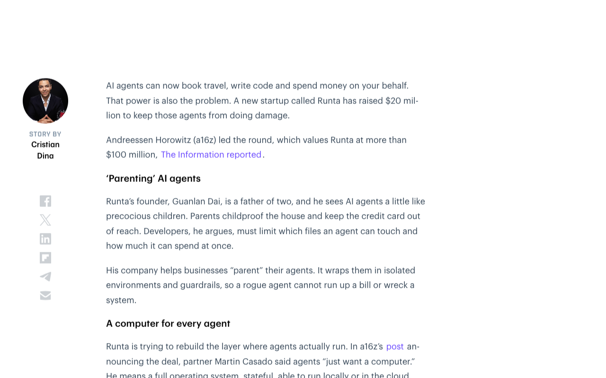
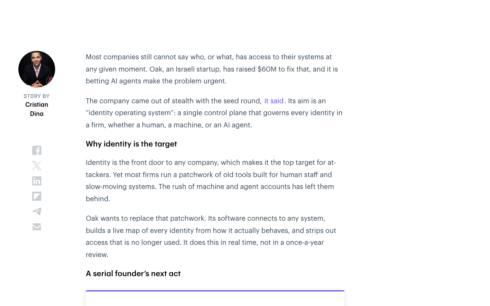
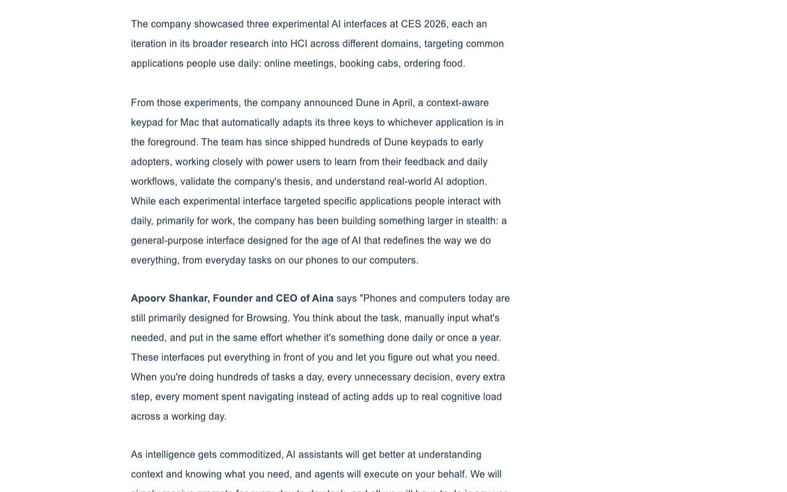
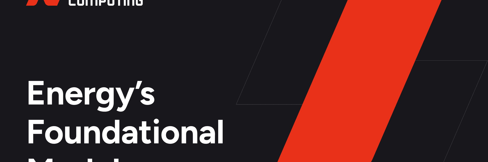

# 0718日报 | Agent基础设施的「安全与控制」时刻

## 今日洞察

今天的五个字：「**Agent的「系安全带」时刻。**」

**7月17-18日是AI行业的一个「基础设施之夜」——我们看到的不是新的模型发布或应用层创新，而是一批关键的基础设施公司在同一周密集获得大额融资，共同指向同一个方向：AI Agent的「控制层」正在被建造。** 上周（7月15-16日）的重磅新闻是Thinking Machines的开源模型、WAIC的宏大叙事和AI监管框架的建立——但到了周末，资本市场的信号更清晰了：投资人正在为AI Agent的「安全执行」、「身份治理」和「专用计算」这三个基础设施层下重注。

**这周的融资节奏本身就说明了趋势的紧迫性。** a16z领投Runta的$2000万种子轮——为Agent建立「执行层」，像一个操作系统一样控制Agent能做什么、不能做什么。Greylock/Accel/CRV联合领投Oak的$6000万种子轮——为Agent建立「身份层」，让每一个AI Agent都像人类员工一样被管理身份和权限。Aina的$550万种子轮——为Agent时代重新设计「硬件接口层」，让用户不需要通过手机屏幕来和AI交互。Applied Computing的$2000万A轮——为特定行业（能源）构建「AI基础模型」，将AI从通用能力落地到工业场景。**四笔融资覆盖了Agent基础设施的四个关键维度：执行、身份、交互、行业化。** 这不仅仅是融资新闻——这是一个正在形成中的「Agent基础设施栈」的蓝图。

**而同一天发布的VentureBeat Agent安全调查给出了这个基础设施投资浪潮的「why」：54%的企业已经遭遇过AI Agent安全事件或险情——但在那些受调查的企业中，只有21%拥有对Agent活动的运行时可见性。** 88%的企业在过去12个月内报告了AI Agent相关的安全事件。**这个数据揭示了一个令人不安的现实：企业正在「边跑边修」——Agent已经部署了，但控制它们的工具还没有到位。** Runta、Oak、Aina等公司的融资，正是市场对这个问题做出的回应。

**结论：这一周的关键词是「基础设施」。** 上周行业讨论的是「哪个模型更好」，这周市场用资本回答了另一个问题——「模型已经够好了，但谁来控制Agent？」Runta的a16z领投、Oak的创纪录种子轮、VentureBeat的安全调查——三者共同指向一个确定性趋势：**2026年下半年，AI Agent基础设施将是最热门的投资和创业方向。** 对于AI创业者来说，核心启示是：如果你在构建AI Agent应用，现在就应该开始思考你的「基础设施依赖」——你的Agent运行在谁的控制层上？如果你在思考新的创业方向，Agent基础设施（安全、身份、执行、监控、成本管理）是一个比Agent应用本身更确定、竞争更少的机会。

---

## 1. [Runta获a16z领投$2000万种子轮——为AI Agent建立「家长控制层」](https://thenextweb.com/news/runta-a16z-seed-ai-agent-infrastructure)（融资 / Agent「执行层基础设施」的诞生）

🔗 链接：[TNW](https://thenextweb.com/news/runta-a16z-seed-ai-agent-infrastructure) | [a16z官方](https://a16z.com/announcement/investing-in-runta/) | [The Information](https://www.theinformation.com/) | [AI Weekly](https://aiweekly.co/alerts/runta-lands-20m-a16z-seed-for-ai-agent-execution-layer)

**融资信息**：**$2000万种子轮**，由**a16z**领投，估值超过**$1亿**。由Guanlan Dai（Robert Yang）创立。Dai此前是Cloudflare边缘计算团队技术负责人，后在API公司Kong构建核心代理层。本轮于7月17日正式宣布。

**做什么的**：Runta正在构建AI Agent的「执行层」（execution layer）——一个控制Agent运行环境的系统层。核心思路是：就像父母给房子做「儿童防护」（childproofing）一样，企业需要给Agent做「Agent防护」——限制它们能访问哪些文件、能花多少钱、能在哪些系统上执行操作。Runta将Agent包裹在隔离的沙箱环境中，配备防护栏（guardrails），让一个「失控的Agent」无法造成破坏。a16z合伙人Martin Casado在博文中形容：「Agent只需要一台计算机」——一个完整的、有状态的操作系统，能在本地或云端运行，内置安全控制。

**为什么值得关注**：

- **a16z的入场是Agent基础设施赛道最大的「信号灯」。** Martin Casado——a16z基础设施投资的灵魂人物（曾投资HashiCorp、Databricks等基础设施巨头）——亲自撰文宣布这笔投资，并将Runta定位为「继GPU之后的下一层基础设施」。**Casado的核心论点非常有说服力：2025年的重点是「训练最好的模型」，2026年的重点是「让Agent安全地运行」。** 他将Runta与2010年代的「云计算操作系统」类比——当企业从托管物理服务器转向云计算时，出现了VMware、Docker等「执行层」公司。现在Agent正在经历同样的转变。「Agent执行层」很可能是一个百亿美元级别的品类。**对于AI创业者来说，a16z这封信值得仔细阅读——Casado描述的基础设施路线图（执行层→身份层→监控层→成本层）本质上是一个创业品类路线图。**

- **Runta的「家长控制」比喻非常精准。** 创始人Dai是两个孩子的父亲，他将AI Agent管理比作「儿童防护」：你不需要阻止孩子探索世界，但你需要把化学品锁起来、把插座盖上、把信用卡放在够不到的地方。**对于企业来说，Agent的「危险品」是：数据库凭证、支付API密钥、内部系统访问权限、HR数据。** Runta的思路不是「限制Agent的能力」，而是「为Agent划定安全边界」——Agent可以在边界内自由行动，但不能越界。**这个「边界思维」对所有构建Agent产品的创业者都有直接的参考价值：你的Agent产品是否设计了「安全边界」机制？还是让Agent「全有或全无」地访问系统？**

- **这笔投资还有一个被忽视的侧写：CPU短缺。** Casado在博文中提出了一个有趣的观察：Agent热潮正在引发「CPU短缺」——因为Agent需要大量的普通计算资源（而非GPU推理算力）来执行任务（处理请求、管理状态、协调工具调用）。**这个「Agent驱动的CPU需求增长」对于AI基础设施的方向选择有深远影响：如果你的AI产品在构建Agent功能，需要考虑CPU成本的增长曲线——这可能比GPU成本增长更快。** 同时，这个观察针对云基础设施创业者也意味着：为Agent优化的计算资源配置可能是一个独立的品类机会。

- **Runta的创始人背景是典型的「基础设施创业者」。** Guanlan Dai曾领导Cloudflare的边缘计算团队（CDN/边缘Worker基础设施），又在API管理公司Kong构建了核心代理层。**他的优势不是AI，而是「系统软件」——这恰恰是Agent执行层最需要的能力：分布式系统、权限管理、沙箱隔离。** 对于创业者来说，这个团队构成的信号很清晰：Agent基础设施不是AI问题，而是系统软件问题——那个曾经在云基础设施领域（Docker、Kubernetes、HashiCorp）出现的人才流动，现在正在流向Agent基础设施。

- 对创业者的启发：**① Agent「执行层」是2026年下半年最确定的基础设施赛道之一——如果你有系统软件背景，这是一个比Agent应用更少竞争的切入点；② 「安全边界」思维应该嵌入所有Agent产品的默认设计中——不仅仅是安全工具，而是所有Agent产品的架构原则；③ a16z正在系统性下注Agent基础设施（Runta只是其中之一）——跟踪Casado的投资组合，你就能看到未来的基础设施路线图；④ 「Agent CPU短缺」是一个被低估的宏观趋势——如果你的产品能帮助客户优化Agent的计算成本，你有一个现成的市场。**

**类比参考**：**「AI Agent的「操作系统」诞生记 / 从「云计算操作系统」（VMware/Docker）到「Agent操作系统」的范式复制」**

---

## 2. [Oak获$6000万种子轮——为AI Agent重建企业身份治理](https://thenextweb.com/news/oak-60m-seed-ai-native-identity-platform)（融资 / AI原生的身份操作系统 / 以色列创纪录种子轮）

🔗 链接：[TNW](https://thenextweb.com/news/oak-60m-seed-ai-native-identity-platform) | [TechCrunch](https://techcrunch.com/2026/07/15/backed-by-60m-in-funding-oak-steps-out-of-stealth-to-fix-the-identity-mess-that-ai-agents-are-making-worse/) | [BankInfoSecurity](https://www.bankinfosecurity.com/oak-lands-60m-seed-to-reinvent-identity-governance-ai-a-32248) | [Calcalist](https://www.calcalistech.com/)

**融资信息**：**$6000万种子轮**，联合领投方为**Accel、Greylock Partners、CRV**，参与方包括Hetz Ventures和天使投资人。由连续创业者**Shai Morag**和**Tal Marom**联合创立。Morag此前创立并出售了三家安全公司，包括2023年以$2.65亿出售给Tenable的Ermetic，累计退出规模约$5亿。本轮是以色列网络安全领域最大的种子轮之一，公司目前约50名员工，已有付费企业客户。

**做什么的**：Oak正在构建一个「AI原生的身份操作系统」——一个统一控制面板，管理企业中的所有身份：人类员工、机器账号和AI Agent。核心能力：连接到任何系统，根据实际行为实时构建每个身份的「活动地图」，自动剥离不再使用的访问权限（而非传统的年度审查）。Oak的定位是：在一个企业中，每个身份的「权限管理」应该像操作系统一样实时、自动、统一——而不是像现在这样通过多个孤立系统、人工流程来管理。

**为什么值得关注**：

- **$6000万种子轮——以色列网络安全领域历史上最大的种子轮之一。** Accel、Greylock、CRV三家顶级VC联合领投一个种子轮，这在任何市场上都是罕见的信号。**这三家VC在安全领域的投后历史加起来超过$1000亿——它们不会同时押注一个种子轮公司而不做充分的尽职调查。** Morag的创始人背景是关键因素——连续三次成功退出（累计约$5亿），让投资人愿意在「无产品验证」阶段就下重注。**对于AI创业者来说，Oak的融资证明了在AI安全领域，「创始人背景×正确赛道」可以带来极端的资本溢价——但这也是少数人的游戏。**

- **AI Agent的「身份问题」是所有Agent基础设施中最紧迫、最被低估的环节。** 当前企业中的身份管理是一个「补丁拼凑」的状态：HR系统记录员工身份、Active Directory管理IT权限、云平台管理机器身份——但AI Agent的身份在哪个系统里？**大多数企业的情况是：Agent使用共享的API密钥或某个工程师的个人凭证来访问系统。** 研究表明，研究人员已经成功诱骗Agent泄露私有代码、甚至执行勒索软件攻击。**Oak的核心论断是：AI Agent不能「借用」人类的身份——每一个Agent都需要自己的「数字身份」，就像每一个员工都有自己的工号和权限组一样。** 对于所有构建Agent产品的开发者，这是一个根本性的产品设计考量：你的Agent是「以谁的身份」在运行？

- **Palo Alto Networks最近收购CyberArk的交易是Oak论点的最佳注脚。** 上周Palo Alto Networks同意收购身份安全巨头CyberArk——这笔交易的背后逻辑是：网络安全巨头认为「身份」将是下一轮安全基础设施的核心。**Oak在这个时间点浮出水面不是巧合——它意味着身份安全赛道正在经历一次由AI Agent驱动的根本性重塑。** 传统的IAM（身份和访问管理）系统是为人类员工设计的——人类有固定角色、固定工作时间、可预测的行为模式。但AI Agent的行为模式完全不同：它们7x24小时运行、访问模式高度动态、可能同时调用数十个API。**传统的「年度权限审查」对Agent来说毫无意义——到年底审查的时候，Agent的权限需求可能已经变了100次。**

- **Morag的「成败论」创业哲学值得关注。** 他在采访中直言：「这是我将创立的最后一家公司。要么做大，要么回家。」累计约$5亿的退出经验让他有底气做这个声明——但更重要的是，他对AI Agent身份管理的判断：**「所有身份——从员工登录到Alexa式的AI助手——最终都将在一个屋顶下管理。这个市场的赢家价值将在几百亿甚至几千亿美元。」** 对创业者来说，这个判断所定义的市场边界是值得参考的：Oak把「身份」定义得极其宽泛——人、机器、Agent——然后说「在一个控制面板里管理这一切」。这个「统一身份」的野心如果实现，它确实是网络安全领域最具价值的品类之一。

- 对创业者的启发：**① Agent的身份管理是2026年下半年最确定的B2B安全创业方向——如果你的产品能帮助企业管理Agent的「数字身份」，你不需要说服企业「为什么需要这个」，你只需要比Oak跑得更快；② 每一家构建Agent产品的公司都应该自问：我的Agent是否有独立的身份标识？它是以什么权限在运行？如果Agent被攻破，攻击者能获得什么？——这些问题现在不回答，半年后就是安全事故；③ Oak的创纪录种子轮意味着顶级VC已经锁定了「Agent身份管理」这个品类——但Agent基础设施的「身份」只是其中一层，Agent安全还有大量未定义的品类（Agent行为审计、Agent间通信安全、Agent供应链安全等）。**

**类比参考**：**「AI Agent的「工牌」和「门禁卡」/ 从「人类身份管理」（Okta/CyberArk）到「人类+机器+Agent三重身份管理」的架构升级」**

---

## 3. [Aina获$550万种子轮——AI时代的「硬件接口」重设计](https://www.globenewswire.com/news-release/2026/07/16/3328464/0/en/aina-raises-5-5m-with-new-hardware-interface-for-the-age-of-ai-beyond-touchscreens-and-keyboards.html)（新产品 / AI时代的人机交互硬件）

🔗 链接：[GlobeNewsWire](https://www.globenewswire.com/news-release/2026/07/16/3328464/0/en/aina-raises-5-5m-with-new-hardware-interface-for-the-age-of-ai-beyond-touchscreens-and-keyboards.html) | [HackerNoon](https://hackernoon.com/aina-raises-$55m-led-by-redstart-labs-and-360-one-to-build-the-interface-for-the-age-of-ai) | [FinSMEs](https://www.finsmes.com/2026/07/aina-raises-5-5m-in-seed-funding.html) | [YourStory](https://yourstory.com/ai-story/aina-raises-55m-seed-funding-develop-ai-first-hardware-interface)

**融资信息**：**$550万种子轮**，由**Redstart Labs**（Infoedge, India）和**360 ONE Asset**联合领投，MIXI Global Investments、Antler、Blume Founders Fund以及多位知名天使投资人（包括Kunal Shah/Cred创始人、Tikhon Bernstam/Scribd创始人、Razorpay联合创始人等）参与。由**Apoorv Shankar**（前Ultrahuman硬件VP）创立，2025年5月注册，此前以「Project Mirage」之名运营。公司已在2026年4月发布首款产品Dune——一款上下文感知的Mac键盘。本轮融资将用于将正在开发中的「通用AI硬件接口」推向市场。

**做什么的**：Aina正在重新思考AI时代的硬件接口。核心理念：**当前的键盘（1980年代设计）和触摸屏（2007年设计）是为「浏览和输入」时代设计的——但AI时代需要的是「意图和行动」导向的接口。** 首款产品「Dune」是一个上下文感知的三键键盘：当你在不同应用中工作时，三个键的功能会自动切换。例如在视频会议中变成「加入通话/静音/共享屏幕」，在IDE中变成「运行/调试/提交」。公司还在秘密开发一个更宏大的「通用AI接口」——超越单一设备的、能让用户与AI进行更自然、更直接交互的硬件形态。Aina的愿景成为「AI时代的鼠标和键盘」——一个被重新定义的交互基础硬件。

**为什么值得关注**：

- **Aina切入了一个被大多数AI公司忽视的空白地带：硬件交互层。** 几乎所有AI公司的精力都在软件层——更好的模型、更智能的Agent、更流畅的对话界面。但人类的物理交互方式——键盘、鼠标、触摸屏——几乎没有因为AI而改变。**Aina的洞察很锋利：AI可以替你写邮件、订机票、做PPT，但「和AI对话」这件事本身，仍然需要你掏出手机、解锁屏幕、打开App、点击输入框、打字——这一系列操作在AI时代显得荒谬地低效。** 当你已经可以让AI替你完成复杂任务，为什么「召唤AI」本身还需要这么复杂？**对于AI产品创业者来说，这个「交互摩擦」是真实存在的：即使用户可以「用AI做任何事」，第一次「让AI开始做事」的步骤仍然太多了。硬件接口的改进可能是一个被低估的用户增长杠杆。**

- **创始人的「Ultrahuman背景」意味着硬件+健康追踪的经验。** Apoorv Shankar此前在Ultrahuman（印度睡眠追踪戒指公司）担任硬件VP——Ultrahuman的成功说明了「小而美的智能硬件」在消费市场是有PMF的。**Aina的思路是类似的：不是做一个「AI手机」或「AI耳机」这样的全景替代品，而是一个「AI配件」——一个辅助性的、不需要替代现有设备的小硬件。** 这种「附件策略」比「替代策略」风险更低：用户不需要改变已有习惯，只需要「增加」一个新设备。**对于所有想在AI硬件方向创业的人来说，Aina的策略（附件而非替代、上下文感知而非通用、先从Mac生态切入）是一个值得学习的产品策略模板。**

- **知名天使投资人阵容——Kunal Shah（Cred创始人，印度最知名的消费互联网创业者之一）参投——说明印度资本圈对「AI硬件」方向开始产生兴趣。** Aina是少有的「印度+美国」双总部硬件公司。**对于中国AI创业者来说，这个信号的意义在于：印度市场的AI硬件消费力正在被验证——如果你在做AI消费硬件，印度不应该被忽略。**

- **Dune的「上下文感知」理念与Agent的「意图理解」趋势一致。** Aina的核心产品逻辑——设备自动理解你正在做什么，然后提供对应的「AI动作」——本质上与GUI Agent的思路同源。**不同之处在于：Nubia的Agent手机是AI「替你做」，Aina的Dune是AI「帮你快速做到」。** 一个是「代执行」，一个是「加速执行」。这两种思路可能适用于不同场景和不同用户类型——专业用户可能更喜欢「加速」而非「替代」。

- 对创业者的启发：**① 「AI时代的交互接口」是一个被严重低估的产品方向——当前所有AI交互都发生在传统设备（手机/电脑）上，这意味着交互本身存在巨大的摩擦未被优化；② 「附件策略」比「替代策略」更适合AI硬件创业——先做一个「锦上添花」的设备而不是「替代手机」的设备；③ 上下文感知（context-aware）是AI硬件的核心差异化——硬件需要知道用户「正在做什么」才能提供「即时有用」的功能；④ Aina的$550万种子轮规模说明——AI硬件不需要融几亿美元来验证假设，小规模、高精度地验证产品理念后，再通过用户反馈来扩大。**

**类比参考**：**「AI时代的「鼠标」被重新发明 / 从「打字-点击」到「意图-执行」的交互范式迁移」**

---

## 4. [Applied Computing获$2000万A轮——为能源运营构建AI基础模型「Orbital」](https://techcrunch.com/2026/07/15/applied-computing-wants-to-give-oil-and-gas-operators-an-ai-model-for-the-entire-plant/)（融资 / 工业AI基础模型的垂直落地）

🔗 链接：[TechCrunch](https://techcrunch.com/2026/07/15/applied-computing-wants-to-give-oil-and-gas-operators-an-ai-model-for-the-entire-plant/) | [FinSMEs](https://www.finsmes.com/2026/07/applied-computing-raises-20m-in-funding.html) | [The Next Web](https://thenextweb.com/news/applied-computing-20m-series-a-orbital-oil-gas) | [Energetica India](https://energetica-india.net/news/applied-computing-raises-usd-20-million-expands-into-us-to-accelerate-ai-solutions-for-energy-sector)

**融资信息**：**$2000万Series A轮**，由**KBR**（全球工程与能源服务巨头，市值约$90亿）领投，**Databricks Ventures**参与。Imperial College London衍生公司，2023年成立。融资将用于扩大Orbital平台部署、拓展美国市场。

**做什么的**：Applied Computing正在构建一个名为**Orbital**的「AI基础模型」，专门为石油、天然气和石化行业的工厂运营设计。与通用AI模型不同，Orbital融合了时间序列数据、物理仿真和语言模型——它能实时监控工厂设备的运行状态，发现异常，诊断根本原因，并预测修复方案的效果。公司宣称Orbital可以在不到8%的计算资源消耗下运行（相对于传统工业AI方案）。核心卖点：一个能从「整座工厂」层面理解和优化运营的AI模型——而不是多个孤立的设备监控AI。

**为什么值得关注**：

- **这是「垂直AI基础模型」赛道中的一个教科书级案例。** 2026年AI行业的一个核心争论是：通用模型（GPT-5.6、Claude Opus）vs 垂直模型（特定行业的微调模型）。**Applied Computing的选择很极端——它不是为「能源行业」做一个通用AI，而是为「工厂运营」这个极其狭窄的场景构建了一个从底层开始训练的「专用基础模型」。** 这个策略的是非判断取决于一个核心问题：通用AI在工业场景中的「准确性」是否足够？**Applied Computing的答案是「不够」——因为工厂运营的核心不是「理解自然语言」，而是「理解时间序列+物理过程+因果关系」。** 对于AI创业者来说，这个选择提供了一个关键的定位框架：如果你的AI产品需要「物理世界理解」（而非「文本世界理解」），垂直基础模型可能是比「在通用模型上微调」更好的选择。

- **KBR作为领投方——产业资本的逻辑值得关注。** KBR不是一家VC——它是一家全球工程公司，为石油和天然气行业提供设计和运营服务。**「产业投资」的逻辑与「财务投资」完全不同：KBR投资Applied Computing不是为了获得财务回报倍数，而是为了在自己的客户服务中整合Orbital的能力。** 这意味着Applied Computing获得的不只是现金，还有KBR在全球能源客户网络中的分销渠道。**Databricks Ventures的参与也同样具有战略意义——作为数据+AI基础设施平台，Databricks在工业AI场景中渴望有「参考架构」级别的合作伙伴。** 对于AI创业者，这种「产业领投+平台跟投」的融资结构是最理想的：它同时解决了资金、渠道和技术基础设施三个问题。

- **工业AI市场正在经历一个从「监控」到「运营」的跃迁。** 传统工业AI的核心应用是「预测性维护」——预测设备什么时候会坏。**但Orbital的定位超越了这个范畴——它的目标是覆盖整个工厂的「运营优化」：发现异常→诊断原因→模拟修复方案→预测结果→自动执行。** 这是一个完整的「感知-分析-决策-执行」闭环。**如果Orbital能实现这个愿景，它将从「IT工具」变成「OT运营系统」——这是工业软件中最有价值的定位。** 工业AI领域的下一个大事件可能不是「更好的模型」，而是「模型能闭环到控制系统的能力」。

- **「物理AI」正在成为2026年下半年资本关注新热点。** Applied Computing代表了AI垂直化趋势中的一个重要子方向：将AI能力从「数字世界」（文本、代码、图像）延伸到「物理世界」（工厂、电网、物流）。**Elorian（上周报道的视觉推理AI公司）也是这个方向的例子——它们都在试图让AI「理解物理世界」而非「理解文本」。** 创业方向从「谁有最大的模型」转向「谁能在最难的垂直场景中部署AI」——工业AI是这个趋势中最确定的落地方向之一。

- 对创业者的启发：**① 「垂直AI基础模型」——在狭窄但高价值的行业场景中训练专用模型——可能是比「通用模型微调」更持久的护城河；② 产业资本（而非纯财务VC）是工业AI创业公司的最佳合作伙伴——它们提供的渠道和技术验证价值远超现金；③ 「感知→分析→决策→执行」的闭环能力是工业AI产品的终极形态——只做「感知和分析」的产品很快会被AI能力商品化浪潮吞噬；④ 能源行业的AI化才刚刚开始——Orbital面对的是一个$万亿级别的存量市场，即使只获取一小部分也足以支撑一家独角兽。**

**类比参考**：**「物理世界的「AI操作系统」/ 从「预测性维护」（看设备）到「运营优化」（管工厂）的能力跃迁」**

---

## 5. [VentureBeat调查：54%企业已遭遇AI Agent安全事件，但只有21%具备运行时可见性](https://venturebeat.com/ai/the-agent-security-gap-54-of-enterprises-have-already-had-an-ai-agent-incident-and-most-still-let-agents-share-credentials)（行业洞察 / Agent安全的「灰犀牛」数据）

🔗 链接：[VentureBeat](https://venturebeat.com/ai/the-agent-security-gap-54-of-enterprises-have-already-had-an-ai-agent-incident-and-most-still-let-agents-share-credentials) | [VentureBeat: 88%企业AI Agent安全事件](https://venturebeat.com/security/most-enterprises-cant-stop-stage-three-ai-agent-threats-venturebeat-survey-finds) | [TechRepublic](https://www.techrepublic.com/article/news-ai-agents-enterprise-security-gap/)

**动态**：**VentureBeat Research于7月16日发布AI Agent安全调查报告**。调查涵盖了107家企业的AI Agent安全实践，核心发现非常令人不安：

- **54%**的企业已经经历了**确认的Agent安全事件或险情**（18%确认事件，36%接近事件）
- **88%**的企业在过去12个月内报告了AI Agent相关的安全事件
- 只有**21%**的企业拥有对Agent活动的**运行时可见性**
- 只有**6%**的安全预算目前用于AI Agent风险管理
- 大多数企业仍然让Agent**共享API凭证**（而不是为每个Agent创建独立的、范围受限的身份）

**做什么的**：这是一份由VentureBeat Research持续进行的「Agent安全脉搏调查」（Agentic Security Pulse Survey）。调查描绘了一个「先部署后安全」的现实：企业知道Agent安全有问题，但在测试和部署速度的压力下，安全控制仍然滞后。调查将Agent安全威胁分为三个阶段：第一阶段（可视性）、第二阶段（控制与策略）、第三阶段（运行时攻击）。**大多数企业已经在经历第二阶段和第三阶段——但安全投资仍然停留在第一阶段。**

**为什么值得关注**：

- **这个数据是所有正在构建或部署AI Agent的人的「必须阅读」——它不是在讲「未来可能发生什么」，而是在讲「现在正在发生什么」。** 54%的企业已经遭遇Agent安全事件——这意味着Agent安全不是「明天的问题」，而是「昨天的问题」。**对于AI应用创业公司来说，这个数据的直接影响是：你的企业客户（尤其是金融、医疗、合规敏感行业）很快会要求你提供「Agent安全认证」——就像他们要求SaaS公司提供SOC 2一样。** 如果你现在不开始构建Agent安全能力，你将在18个月后的企业采购流程中被竞争对手淘汰。

- **「运行时可见性」只有21%——这个数字是Agent基础设施市场最大的增长驱动因素。** 如果大多数企业没有能力看到自己的Agent在做什么，他们也不可能控制Agent在做什么。**「看不见→控制不了」的逻辑链是Runta（执行层）、Oak（身份层）、以及无数其他Agent安全创业公司的商业逻辑基础。** 对于一个创业者来说，如果你能回答「企业如何实时看到Agent在做什么」，你就找到了一个确定性需求。

- **6%的安全预算用于Agent风险——这是市场上最明确的「预算迁移信号」。** 当企业开始将安全资源从「传统安全工作」（端点保护、网络防火墙）转移到「AI Agent安全」时，一个巨大的市场正在形成。**参照云安全的历史：2015年云安全占安全预算不到5%，到2022年超过25%。AI Agent安全的预算增长曲线可能比云安全更陡——因为Agent安全事件的发生速度比云安全事故更快。** 对于在AI安全领域创业的人来说，这个「6%→25%」的预算迁移就是你未来3-5年的增长曲线。

- **Agent共享凭证的问题直接关联到Oak和Runta的价值主张。** 当大多数企业让Agent共享API密钥时，一个Agent被攻破就意味着所有Agent的服务都被攻破。**Oak的「每个Agent一个独立身份」和Runta的「每个Agent一个隔离沙箱」的核心价值，在这个数据背景下变得极其清晰。** 这三条新闻——Runta融资、Oak融资、VB调查——形成了一个完整的叙事闭环：问题（54%安全事件）→解决方案（独立身份+隔离执行层）→资本支持（$20M+$60M种子轮）。

- 对创业者的启发：**① 如果你在构建企业AI产品，请将「Agent安全白皮书」列入Q3路线图——你的客户将会在采购前问你要它；② 「运行时可见性」是最直接的创业切入点——如果企业看不见Agent在做什么，他们无法管理Agent安全；③ Agent安全的「预算迁移」是一个结构性的市场机会——它不依赖于AI技术突破，只依赖于企业安全意识的提升和监管压力的增加；④ Runta、Oak等创业公司的融资和VB调查的数据应该被解读为一个整体：Agent安全的「基础设施层」正在被我们眼前建设——而这个建设本身就是一个巨大的市场。**

**类比参考**：**「云安全2015年的味道——同样的「先跑后修」剧本 / Agent安全的「灰犀牛」终于被数据确认了」**

---

## 值得重点跟踪的 3 个信号

1. **Agent基础设施的「四层栈」正在形成——执行层、身份层、交互层、行业落地层。** 本周的四笔融资（Runta→执行层、Oak→身份层、Aina→交互硬件、Applied Computing→行业落地）共同指向一个清晰的图景：**AI Agent的经济正在催生一个全新的基础设施栈。** 这个栈与传统云计算基础设施栈（IaaS→PaaS→SaaS）既有相似之处（分层架构、标准化接口），又有根本性的不同（Agent需要「控制和约束」而不仅仅是「提供资源」）。**对于AI创业者来说，这个「四层栈」一方面提供了「在每一层找到创业机会」的路线图，另一方面提出了一个问题：你的产品是「填补某层空白」还是「跨层整合」？** 历史经验表明，跨层整合的公司（如AWS同时提供IaaS和PaaS）往往最终获胜——但初创公司在「单层做到最好」的成功路径也同样清晰（如Datadog在监控层、Snowflake在数据层）。**关键启示：无论你选择哪一层，现在就开始构建——这个基础设施栈的建设窗口期可能在12-18个月。**

2. **「先部署后安全」的模式正在被终结——Agent安全正在从「可选项」变成「入场券」。** VB调查的数据（54%事件、21%可见性、6%预算）是典型的「灰犀牛」——所有人都知道问题存在，但没有人采取足够行动。**但Runta和Oak在同一天获得顶级VC的重注，本身就是一个市场信号：资本正在推动Agent安全从「可选」变成「标配」。** 对于AI应用创业公司来说，这意味着你需要在产品路线图中内置Agent安全能力——而不是等客户要求了再去补。**一个清晰的决策框架：如果你的产品涉及Agent执行动作、访问外部系统或处理敏感数据，你现在就应该评估是否需要「Agent身份管理」和「Agent执行沙箱」——因为你的客户很快就会问你要。**

3. **工业AI正在从「监控」进化到「运营」——「物理AI」成为资本新宠。** Applied Computing不是这个趋势的唯一案例——上周的PixVerse（AI视频→实时交互世界）、Elorian（视觉推理AI）以及正在兴起的「AI+机器人」创业潮都指向同一方向：**AI正在从「处理和生成信息」走向「理解和操控物理世界」。** 这个转变对AI创业者的意义：① 如果你的AI产品仍然在「纯信息处理」领域（文本、代码、图像），你将面临越来越激烈的竞争和商品化压力；② 「物理世界理解」的能力（时间序列、物理仿真、因果推理）将成为AI产品的新差异化维度；③ 产业资本（而非纯财务VC）正在成为工业AI创业者的关键融资来源——找到愿意与你共建的行业合作伙伴比找到估值最高的VC更重要。

---

*统计信息：收录 5 个产品/动态 | 融资总额 $1.005亿（Runta $2000万 + Oak $6000万 + Aina $550万 + Applied Computing $2000万） | 覆盖赛道：Agent执行层基础设施、Agent身份安全、AI硬件接口、工业AI基础模型、Agent安全市场洞察*
