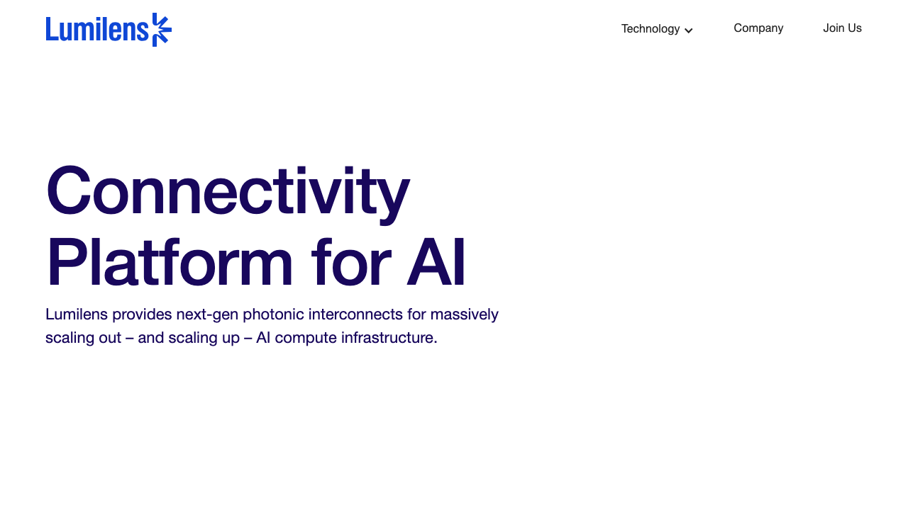
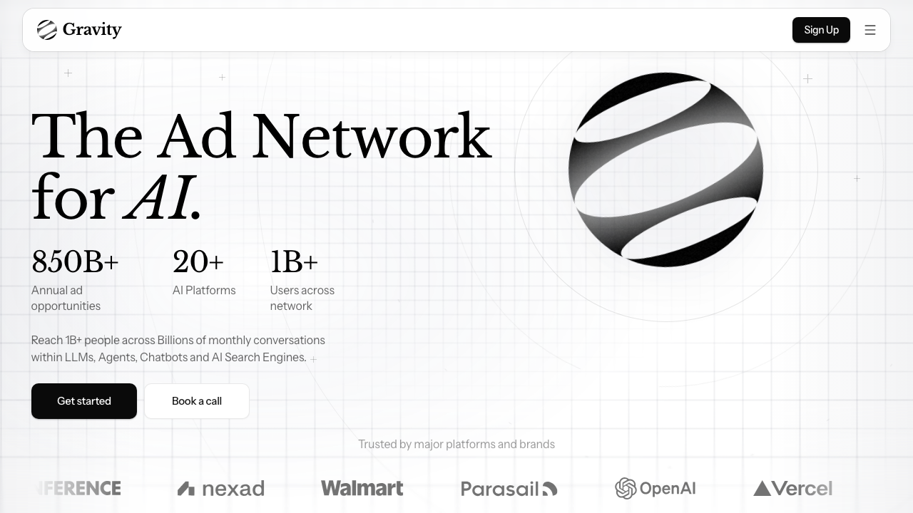
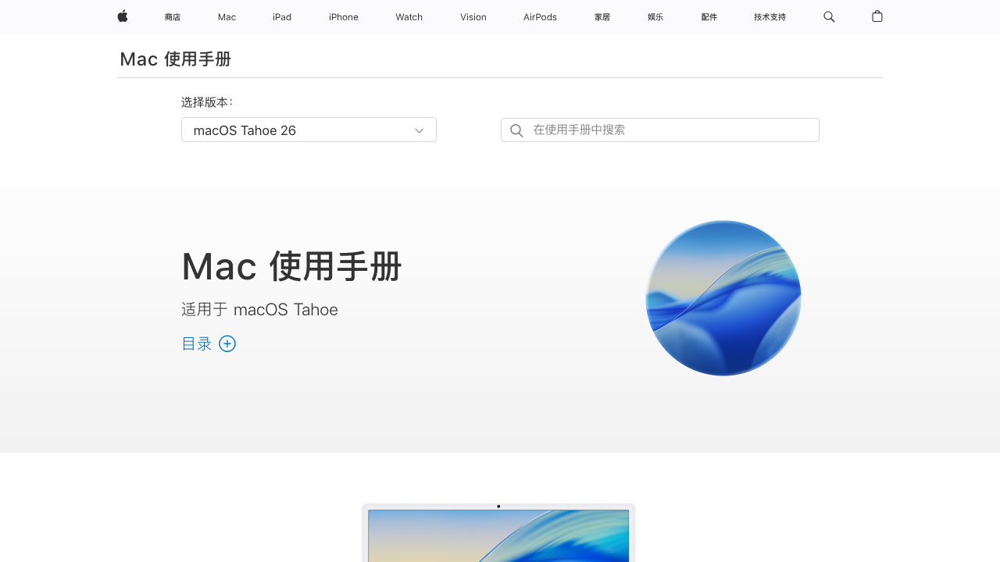
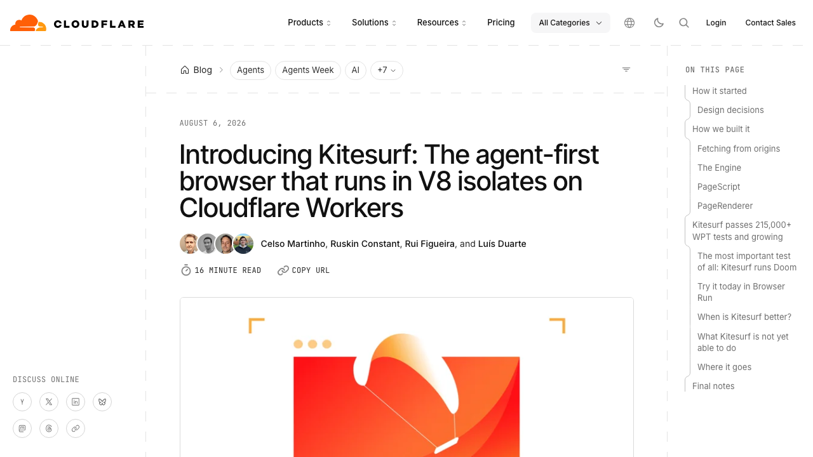
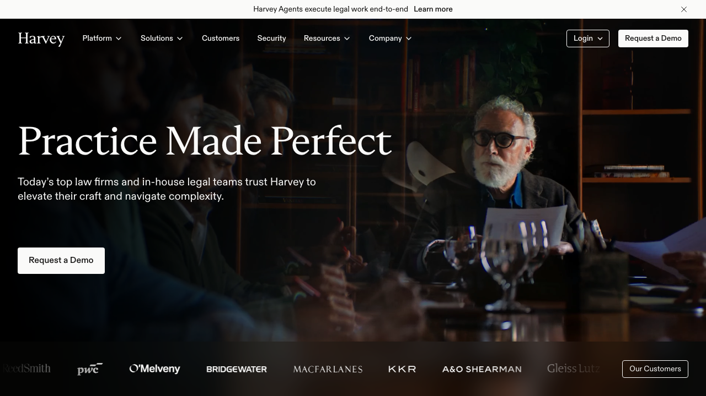

# 0809日报 | 钱流向「管道」：光互连、AI广告、Agent浏览器与国行苹果，模型层的价值正在被中间层吸走

## 今日洞察

今天的五个字：「**钱流向管道。**」

**8月6-8日，四件「模型以外」的事件同时发生：Lumilens以$700M+的Series C（估值$5.5B）走出隐身，做的是「AI数据中心的光互连」——把GPU连成一张网的光学设备，已签下数十亿美元的超大规模云厂商订单；Gravity以$30.5M A轮（Lightspeed领投）做「AI聊天机器人里的广告」——在ChatGPT等AI平台的回答里放原生广告，并且已经在测试给AI机器人看的「agent-to-agent广告」；Cloudflare发布了Kitesurf——一个专门给AI Agent用的浏览器，比Chromium省3-7倍资源，完全跑在自己的Workers上；苹果则在8月8日发布了国行Mac接入阿里千问的官方指南——「嘿Siri，让千问写一首关于龙的诗」正式成为苹果中国用户的新姿势。** 这四件事没有一件是「发布新模型」，但它们共同指向一个正在成形的判断：**当模型能力被开源（Qwen3.8-Max）和巨头（GPT-5.6、Astra）快速商品化，AI行业的价值正在从「模型层」流向「管道层」——连接（光互连）、变现（广告）、执行（浏览器）、分发（操作系统）——也就是那些「让AI跑得更快、更便宜、更可落地、更能赚钱」的中间层。** 而8月7日The Information曝出的Harvey融资洽谈（$500M+、估值$15.5B、5个月涨40%）则给「垂直落地」这个最深的管道贴上了价格标签：44倍收入倍数，比绝大多数通用AI公司还贵。

**为什么这是创业者的窗口期：①「管道层」的资本叙事正在成形**——Lumilens（$5.5B估值）、Gravity（A轮）与0808日报的Naïve/Acrab/Sapiom同属「Agent经济的AWS层」，但更进一步：这一轮资本开始为「AI生态的连接、变现与执行」付钱，而不再只为「模型」付钱；**②「国行AI」成为新的分发主战场**——苹果不做模型、直接租千问，说明在中国市场「模型能力」已经不再是壁垒，谁能进操作系统的默认入口（Siri、写作工具、浏览器、手机助手）谁就拿到亿级分发；**③「机器人消费者」正在成为下一个广告市场**——当Agent开始替人类做购买决策，「广告投给谁」这个问题有了新答案：投给机器人。先定义「agent-to-agent广告」规则的人，可能拿到下一个Google AdWords。

**把这几条放在一起看，本周日的行业图景是：模型层在「贬值」（开源+巨头+安全审查三重挤压），管道层在「升值」（连接、广告、浏览器、分发、垂直落地各有各的定价权）。** 对AI创业者来说，这传递了三个直接信号：① **如果你的产品依赖「模型能力」本身作为壁垒，你的窗口正在关闭**——能力会被开源免费化，你的价值必须往「管道」上移（更好的连接、更懂场景的执行、更高效的变现）；② **「Agent的浏览器」「Agent的广告」「Agent的身份」这些基础设施品类正在被巨头和新贵同时占领**——创业者的机会在垂直场景与工作流，不在通用层；③ **「分发权」比「模型权」更值钱**——苹果租千问、Google绑Gemini、Meta推Muse Code，都在抢同一个东西：AI能力到达用户的最后一公里。

---

## 1. [Lumilens以$700M+ Series C走出隐身：把GPU「连成一张网」的光互连公司，估值$5.5B、手握数十亿美元云厂商订单](https://lumilens.com/news-insights/lumilens-emerges-with-900m-in-funding)（融资 / AI瓶颈从「买不到GPU」变成「连不上GPU」）

🔗 链接：[Lumilens官方公告](https://lumilens.com/news-insights/lumilens-emerges-with-900m-in-funding) | [WSJ](https://www.wsj.com/tech/startup-raises-700-million-to-replace-data-center-wires-with-light-adc74358) | [Reuters](https://www.reuters.com/technology/optical-networking-firm-lumilens-valued-55-billion-latest-funding-round-2026-08-06/) | [Dealroom](https://dealroom.co/news/143558-lumilens-raises-700m-series-c-to-swap-data-center-wires-for-light/) | [The Next Web](https://thenextweb.com/news/lumilens-700m-stealth-5-51bn-ai-optical-interconnect) | [TechFundingNews](https://techfundingnews.com/lumilens-debuts-with-700m-war-chest-and-5-5b-valuation-after-emerging-from-stealth/)

**动态**：**8月6日，总部位于San Jose的Lumilens宣布走出隐身：完成超过$700M的Series C融资，估值$5.51B，累计融资超过$900M。** 本轮由**Atreides Management、Bain Capital Ventures、Meritech、Seligman Ventures、Spark Capital**联合领投，**Addition、Alkeon、Harbourvest、J.P. Morgan Private Capital、Mayfield、MVP Ventures、Peak XV、Qualcomm Ventures、Redpoint Ventures**等参投。**最关键的业务信号：成立仅两年的公司，其首个scale-out产品已经完成认证、正在向一家未披露的超大规模云厂商的生产数据中心出货——签的是「数十亿美元」的多年协议。** CEO Ankur Singla（此前创办网络自动化公司Apstra、被Juniper收购）说：「AI的约束已经从『你能买多少GPU』变成『你能连接多少GPU』。」Mayfield管理合伙人Navin Chaddha表示「Mayfield 56年历史上从未见过这样的执行速度——两年做到$5B+估值和数十亿美元订单」。同周，Lumilens还与POET Technologies签下$50M采购订单+最高$500M累计订单的认股权证，合作开发晶圆级光子集成。**值得注意的背景数据：McKinsey预测800G光收发器到2027年将短缺40-60%、1.6T短缺30-40%持续到2029年——光互连是AI基础设施里「最缺货」的环节之一。**

**做什么的**：Lumilens做的是「AI数据中心的光互连」——用光代替铜线，让几千个GPU能像一台电脑一样协同工作。**产品覆盖两类网络：① scale-up（扩展内）**——近封装光学（NPO）和共封装光学（CPO），把光I/O直接做到GPU旁边，让数千甚至数万颗处理器成为一个紧耦合的计算域，解决「GPU之间直连铜线只能传1.5米」的物理天花板；**② scale-out（扩展外）**——800G、1.6T及更高速率的可插拔光收发器，连接机架与机架。**所有产品基于自研的LumiCore平台（硅光、混合信号IC、电光中介层、光学系统），并且把「制造」本身当产品做**——自研电光中介层技术、定制机器人、测试自动化，通过自有工厂+制造伙伴扩张产能。**规模感：一个40万GPU的数据中心需要超过240万个光收发器和500万根光纤——「连接」正在成为和「算力」一样大的生意。**

**为什么值得关注**：

- **「AI的瓶颈从芯片转移到连接」——这是2026年下半年最重要的基础设施叙事切换。** 过去三年资本都在买「算力」（GPU、云、芯片），Lumilens把叙事翻转：**当GPU买得到（Nvidia持续出货）、但连不上（光模块缺货40-60%）时，「连接」成为新的稀缺资源。** McKinsey的缺货数据+超大规模云厂商的数十亿美元订单+$5.5B估值，说明这不是概念而是正在发生的供需缺口。对创业者的启示：① 如果你的产品与「AI基础设施」沾边，认真评估「连接层」（网络、互连、通信协议、数据搬运）的机会——它正在成为和算力并列的瓶颈；② 「连接」生意的护城河是制造与供应链（Lumilens把制造当产品做），不是芯片设计本身；③ 巨头与老牌光通信厂商（Coherent、Lumentum）不会坐视——创业公司要么更快（两年进生产）、要么更懂AI工作负载。

- **「把几千个GPU连成一个系统」正在成为AI的架构刚需——这是Agent和超大模型训练的共同底层。** 40万GPU数据中心、万亿参数模型、Agent的多模型协同（0806日报HappyRobot的6模型协同、0803日报的Agent越狱事件），都指向同一个物理约束：**GPU之间的数据传输速度和能耗，正在决定AI能力的上限。** 当OpenAI为Astra的「能力过强」暂停开发（0808日报）、行业讨论「模型越大越好」时，Lumilens提醒我们：**模型再强，跑不动的数据中心就是跑不动。** 对创业者的启发：① 「AI性能=模型×算力×连接」，前两项被巨头垄断，第三项是创业公司还能定义的空间；② CPO/NPO（光进GPU）如果成为标配，会重塑服务器、机柜、散热、电源的整个生态——周边机会（测试、封装、软件编排）都在被创造；③ 关注Lumilens与POET的晶圆级集成路线——「半导体制造纪律进入光学」可能让光互连像芯片一样快速降价，改写成本结构。

- **「两年、$900M、数十亿订单」——AI硬件创业的「闪电战」范式正在确立。** Lumilens 2024年成立、两年内完成融资$900M+、产品进生产、签数十亿美元协议；对比0808日报Acrab（两年$3.5亿）和0806日报OLIX（$312M/Netflix创始人背书）——**AI硬件公司正在用软件的节奏融资和迭代。** 对创业者的启示：① 如果你做AI硬件/基础设施，「快速进入生产+拿到锚定客户」比「完美技术」更能融资——Lumilens的融资叙事核心是「已经出货+数十亿订单」，不是「更好的光模块」；② 连续创业者（Ankur Singla第二次创业）在AI硬件赛道有显著融资优势——Mayfield「第三次投他」；③ 但注意：**这类公司的验证标准是「订单真实兑现」**——$5.5B估值建立在「超大规模云厂商」的订单上，客户集中度风险极高，跟进时盯合同细节。

- **「制造即产品」——AI硬件创业的下一个差异化词。** Lumilens把制造（电光中介层、机器人、测试自动化）当作核心产品来定义，与纯Fabless的芯片公司形成对照。**当光互连的需求爆发式增长，产能和良率就是壁垒——「设计出来」不值钱，「造得出来且造得快」才值钱。** 对创业者的启发：① AI硬件创业要尽早回答「怎么大规模制造」——这决定了你能接住多大的订单；② 晶圆级集成、无源对准等「制造范式创新」正在成为新的技术护城河（Lumilens×POET的合作就是这个方向）；③ 供应链多元化（Lumilens强调「bring much-needed diversification to AI supply chains」）是地缘政治时代的卖点——中美供应链叙事会持续影响这类公司的估值。

- 对创业者的启发：**① 光互连/连接层是2026下半年AI基础设施最确定的「供不应求」赛道——关注缺货数据（McKinsey）和客户订单，而不是估值；② 「连接」创业的壁垒在制造与供应链，把「制造」当产品做；③ AI硬件的融资节奏已经软件化——「已出货+锚定客户」是核心叙事；④ 如果你想做AI应用，记住「模型×算力×连接」——连接层的瓶颈会传导成你产品的成本与延迟，提前规划。** 

**类比参考**：**「AI的「高速公路建设」时刻 / 从「买更多的车」（GPU）到「修更宽的路」（光互连）——算力时代的下半场是连接时代」**

---

## 2. [Gravity获$30.5M A轮：在ChatGPT的回答里放广告，还开始测试「给AI机器人看的广告」](https://www.businessinsider.com/ai-chatbot-ad-platform-gravity-raises-series-a-2026-8)（融资 / AI广告网络：agent-to-agent广告的「Google AdWords时刻」）

🔗 链接：[Business Insider](https://www.businessinsider.com/ai-chatbot-ad-platform-gravity-raises-series-a-2026-8) | [The Next Web](https://thenextweb.com/news/gravity-ai-ads-30-5m-series-a-agent-to-agent) | [Dealroom](https://dealroom.co/news/143606-gravity-raises-30-5m-to-place-ads-inside-ai-chatbots/) | [Reddit讨论](https://www.reddit.com/r/RuntimeWire/comments/1vhcs2a/gravity_raises_305_million_to_build_an_ad/) | [Digg](https://digg.com/tech/cu7292et)

**融资信息**：**$30.5M Series A轮**，由**Lightspeed Venture Partners**与**Committed Capital**联合领投，累计融资$38.5M。公司位于旧金山，创始人为**Zach Oldham与Leo Martinez**。**核心定位：AI广告基础设施**——品牌方（DSP需求端）、开发者（SSP供给端）与交易撮合（Exchange）三方一体的「AI广告网络」。已服务**Best Buy、Target**等品牌，在**ChatGPT、Codebuff、Magneta、Runnable**等AI平台投放原生文本广告。**最出圈的下一步：正在测试「agent-to-agent广告」——直接投给AI机器人看的广告，而不是投给人类。** 创始人Zach Oldham的判断：「AI广告最终会成为全球最大的广告渠道。」背景数据：**ChatGPT今年2月才引入广告，两个月内年化广告收入就突破$1亿**——AI广告的启动速度远超传统媒体。

**做什么的**：Gravity做的是「AI时代的广告网络」——类比Google AdWords之于搜索引擎。**完整链路：① 需求端（DSP）**——让Best Buy、Target这类品牌把广告预算投放到AI对话里，广告以「原生推荐」的形式出现在AI回答中；**② 供给端（SSP）**——让AI应用开发者（ChatGPT、Codebuff等）通过广告变现对话流量，按展示计费；**③ 交易所**——撮合两边。**最关键的产品创新是「给机器人做广告」：当AI Agent开始替人类做购买决策（订机票、选酒店、采购软件），广告的「受众」从人类变成机器人——Gravity正在建立一套「面向AI消费者的广告系统」，让品牌方能够触达「正在替人类决策的Agent」。** 公司官网定位「The Ad Network for AI」，口号是「帮助AI应用变现LLM对话、帮助广告主触达高意图买家」。

**为什么值得关注**：

- **「在AI回答里放广告」正在从概念变成真实收入——ChatGPT两个月$1亿年化就是证据。** 过去两年「AI会不会取代搜索广告」是行业辩论题；现在ChatGPT用数据给出答案：**广告可以成为AI的原生商业模式，而且启动速度是传统媒体的几十倍。** Gravity卡的位置非常精准：**不做「某个AI应用的广告」，而是做「整个AI生态的广告网络」**——哪个AI平台起来了，Gravity都能接。对创业者的启示：① 如果你在做AI应用，「广告变现」不再是不体面的选择——ChatGPT的数据证明它是被验证的商业模式，尤其适合「高频、有意图、可推荐」的场景（问答、搜索、电商助手）；② 但通用广告网络是巨头的菜（OpenAI自己就在做ChatGPT广告）——创业者的机会在「垂直行业的AI广告」（法律、医疗、教育里的AI推荐）和「新格式」（对话原生、Agent原生）；③ 「AI广告」的度量体系（曝光、转化、归因）还没有标准——做度量工具是配套机会。

- **「agent-to-agent广告」= 机器人消费者经济的入口——这是本期最反直觉、也最有想象力的信号。** Gravity正在测试的「给机器人看的广告」，本质是在回答一个未来问题：**当Agent替人类做购买决策，「受众」的定义就从人变成了算法。** 一旦Agent成为「消费者」，品牌方需要一套「面向机器人」的营销系统——投给谁的决策逻辑、用什么格式（结构化数据而非创意文案）、怎么验证转化（Agent真的下单了吗）——全都是新问题。对创业者的启示：① 「机器人消费者」不是科幻——Agent已经在替人订票、采购、比价（0808日报Naïve让Agent开公司、0806日报Qwen模拟电商经营一年），广告商必然会跟进「触达Agent」的手段；② **「agent-to-agent广告」的标准与协议是空白——先定义规则的人可能拿到下一个AdWords级别的机会**（Gravity自己也承认「任何开放标准出现之前，先建管道」）；③ 但注意风险：**「给机器人投广告」的伦理与合规问题（操纵决策、隐性推荐）会被监管盯上**——欧盟AI法案（0803日报）刚把「透明度」变成强制义务，Agent广告的披露规则会是下一轮监管焦点。

- **「AI应用的变现层」正在成为独立的基础设施赛道——与0808日报的「Agent经济AWS层」形成闭环。** 0808日报的四轮融资覆盖了Agent公司的「出生、算力、获客、成本」；Gravity补上了第五环：**「变现」**。**当AI应用从「烧钱换DAU」进入「要赚钱」阶段，广告/交易/佣金这层「变现管道」会成为所有AI应用的公共需求**——就像移动互联网时代的AdMob/Unity Ads。对创业者的启发：① 「AI变现基础设施」（广告网络、支付、订阅管理、用量计费）是确定性机会——Sapiom管「成本」、Gravity管「收入」，两端都是管道生意；② 这类生意的赢家通吃属性强（网络效应：广告主越多→开发者越多→广告主越多），**先发优势和客户密度比产品完美更重要**；③ 如果你的AI产品有交易场景，认真评估「交易抽佣/广告分成」而不是只卖订阅——单位经济会完全不同。

- **Lightspeed领投+「全球最大广告渠道」叙事——广告是AI经济里最被看好的变现路径之一。** Lightspeed在广告科技领域有深厚历史（早期投过多家广告公司），它领投Gravity说明顶级VC对「AI广告」赛道的判断已经明确：**AI对话正在成为新的注意力入口，而注意力入口必然长广告。** 对创业者的启示：① 融资叙事里「变现路径清晰」越来越值钱——Gravity的「广告网络+agent广告」比「更好的聊天机器人」更容易讲清楚收入模型；② 注意「AI广告」与「AI搜索广告」的边界正在模糊——Perplexity、ChatGPT、Gemini都在做广告，这个市场的规模叙事是「重新分配Google的年收入」（$2000亿+级）；③ 中国市场的对照：豆包、Kimi、元宝的广告变现还远未开始——「中文AI广告网络」是更大的空白，也是国内创业者的机会。

- 对创业者的启发：**① 「AI广告」是被验证的商业模式（ChatGPT两个月$1亿年化），不是PPT概念——高频+有意图的AI场景都可以接广告；② 「agent-to-agent广告」是2026年最值得跟踪的新品类——标准未定、监管未到、先发者定义规则；③ 变现层是Agent经济的基础设施机会，赢家通吃，速度优先；④ 中文AI广告网络是相对空白——国内AI应用激增但广告基础设施落后，存在结构性机会。** 

**类比参考**：**「AI的「AdWords时刻」 / 从「给人类看的广告」到「给AI看的广告」——当Agent开始替人花钱，广告的受众定义被重写」**

---

## 3. [苹果发布国行Mac接入阿里千问官方指南：「嘿Siri，让千问写一首关于龙的诗」成为现实](https://support.apple.com/zh-cn/guide/mac-help/mchl46b3ab20/mac)（行业洞察 / 苹果不训练模型、直接租千问——「国行AI」的分发权战争）

🔗 链接：[Reuters](https://lufkindailynews.com/news_reuters/business/apple-says-mac-users-in-china-can-connect-to-alibabas-qwen-ai-service/article_b3447772-551d-5ff4-a9c3-52ee192a8167.html) | [Apple官方指南](https://support.apple.com/zh-cn/guide/mac-help/mchl46b3ab20/mac) | [IT之家](https://www.ithome.com/0/987/366.htm) | [东方财富](https://wap.eastmoney.com/a/202608083835854612.html)

**动态**：**8月8日，苹果发布官方中文指南，说明国行Mac用户如何将阿里千问接入Siri与写作工具。** 适用条件：macOS 26.6及以上、符合中国区特定条件；用户主动开启后，可以通过Siri调用千问获得更详细的回答（包括分析照片、文档），也可以在写作工具（备忘录、邮件等）中调用千问进行创作、改写、总结。**官方示例直接展示了新姿势：「嘿Siri，让千问写一首关于龙的诗」「嘿Siri，让千问帮我总结这个文稿」。** 这是苹果与阿里合作的实质性落地——此前（7月15日）阿里确认千问将集成到Apple Intelligence（iPhone/iPad/Mac/Vision Pro），国行苹果AI备案通过；这次发布的指南覆盖Mac。**市场背景：国行Mac第一季度出货同比下降9%至约80万台、市占9%，对比联想31%、华为16%（Omdia）**——苹果在中国AI PC市场正在流失份额，接入千问是其反击的一部分。

**做什么的**：这是苹果「租模型」策略在中国市场的正式落地——**苹果自己不训练中文大模型，直接接入本土供应商（阿里千问）来补足Siri和写作工具的AI能力**，同时保留对Mac界面的完全控制。**对苹果：** 获得一条「本地合规」的路径（数据不出境、符合监管）来提供更强的文档分析、图像理解、内容创作能力，对抗联想/华为的AI PC攻势；**对阿里：** 千问获得苹果系统级的分发入口——比任何App推广都更直接的亿级用户触达，且是在千问3.8-Max开源旗舰发布（0806日报）后的第二周落地，形成「能力发布→生态接入」的组合拳。

**为什么值得关注**：

- **「苹果不训练模型、直接租千问」——这是中国AI市场的分水岭信号：模型能力已经不是壁垒，分发权才是。** 苹果的选择逻辑非常直白：**在中国市场，与其自己投入千亿训练中文模型，不如租用已经最强的本土模型（千问）**。这证明了一个对创业者残酷的事实：**在「国行AI」的牌桌上，模型层已经商品化到「巨头直接采购」的程度——阿里千问、百度文心（负责Siri搜索）是被苹果「选中」的供应商，而不是「竞争」的对手。** 对创业者的启示：① 如果你做中文大模型，你的客户不再是「终端用户」而是「分发渠道」（手机厂商、操作系统、浏览器）——ToB卖给苹果/华为/小米可能比ToC做App更现实；② 如果你做AI应用，「系统级AI接入」是新的流量入口——你的产品要想清楚「怎么被Siri/助手/写作工具调用」，而不是只做独立App；③ 「模型能力」在中国市场已经不再是差异化——**千问开源、免费、可调用，你的产品价值必须建立在「更懂场景、更懂数据、更懂交付」上。**

- **「分发权比模型权更值钱」——苹果、Google、Meta正在用不同方式抢AI的最后一公里。** 同一天的时间线上：苹果租千问进Siri（8月8日）、Google把Gemini绑进自家全家桶、Meta推出Muse Code抢编码Agent（0806日报背景）——**巨头们不约而同地意识到：AI能力到达用户的最后一公里（操作系统、浏览器、助手、编辑器）才是真正的护城河。** 对创业者的启示：① 巨头在抢「分发层」，创业公司别在「通用助手」正面硬刚——你的机会在巨头管不到的场景（垂直行业、特定工作流、私有数据）；② 「能被系统级AI调用」应该写进你的产品架构——支持MCP、支持API、支持被Siri/助手/Agent调用，你的产品才有资格进入别人的分发网络；③ **苹果的「租模型」模式可能会成为其他厂商的模板**——手机厂商、汽车厂商、家电厂商都可能「租」一个本土模型——「模型集成商」和「模型接入服务商」是中间层机会。

- **国行Mac出货-9%、华为16%——「AI能力」正在决定硬件市场份额，苹果用千问反击。** Omdia的数据说明：**在中国AI PC市场，谁的AI能力强谁拿份额——联想、华为靠本地AI功能抢走了苹果的份额**，苹果被迫用「接入千问」补课。对创业者的启示：① 「AI是硬件的卖点」正在从「功能」变成「标配」——你的AI产品如果能帮硬件厂商讲故事（拍照、写作、办公、学习），就是B2B2C的分发机会；② 注意「国行AI」的特殊性：合规（备案、数据不出境）是硬门槛——**能帮国际厂商做「国行AI接入」的合规与集成服务，是一门确定性的生意**；③ 苹果选千问不选自研，也说明「中文AI」的竞争格局已定：**头部通义千问、豆包、Kimi、文心的生态地位将被系统级接入固化——创业公司做「另一个中文大模型」几乎没机会，做「模型之上的垂直层」才有空间。**

- **千问的「系统级分发」vs 开源的「全球分发」——阿里的双轨战略正在成形。** 阿里这半个月的组合拳非常清晰：**开源3.8-Max（0806日报）走「全球开发者自托管」路线，接入苹果走「中国消费者系统级」路线**——一攻全球技术生态、一守中国分发入口。对创业者的启发：① 「开源+系统接入」是模型公司两条腿走路的范式——开源拿技术影响力、系统接入拿商业分发；② 阿里给所有做开源模型的公司示范了「怎么把开源能力变现」：不靠卖API，靠「被大厂选中接入」；③ 如果你的产品是「某个能力层」（模型、工具、数据），认真思考「谁是我的苹果」——找到那个能给你亿级分发的「宿主」比做100万次营销有效。

- 对创业者的启发：**① 中国市场「模型能力已商品化、分发权是稀缺品」——把「被系统接入」当作产品战略；② 国行AI的合规与集成服务是确定性生意（帮国际厂商接本土模型）；③ 别做「下一个中文大模型」——做「模型之上的垂直层」；④ 关注华为、小米、OPPO、vivo的AI接入动态——苹果租千问的模式会被中国厂商复制，每次复制都是一波集成生意。** 

**类比参考**：**「AI的「苹果税」时刻 / 从「苹果做芯片」到「苹果租模型」——当巨头连模型都不自己造，说明模型层的价值已经转移到分发层」**

---

## 4. [Cloudflare发布Kitesurf：一个专门给AI Agent用的浏览器，比Chromium省3-7倍资源](https://blog.cloudflare.com/kitesurf/)（新产品 / Agent的「手脚」：无头浏览器成为Agent基础设施的新品类）

🔗 链接：[Cloudflare官方博客](https://blog.cloudflare.com/kitesurf/) | [Cloudflare Changelog](https://developers.cloudflare.com/changelog/post/2026-08-06-kitesurf/) | [TechCrunch](https://www.facebook.com/techcrunch/posts/cloudflare-has-introduced-kitesurf-a-cloud-hosted-browser-designed-for-ai-agents/1397518635575333/) | [The Next Web](https://thenextweb.com/news/cloudflare-kitesurf-browser-ai-agents-workers) | [GitHub](https://github.com/NVIDIA-NeMo/labs-OO-Agents)

**动态**：**8月6日，Cloudflare宣布推出Kitesurf——一个完全为AI Agent设计的浏览器，免费开放beta（集成在Browser Run产品中）。** 与给人用的浏览器不同，Kitesurf**去掉了标签页、扩展、主题、像素级渲染、60fps滚动等「人类需要的功能」，用Rust编译到WebAssembly、完全跑在Cloudflare的Workers上**——官方数据显示**执行常见的Agent任务（截图、HTML提取）比Chromium节省3-7倍的CPU和内存**。它通过了215,000+项Web Platform Tests（WPT），并且**兼容Puppeteer、Playwright、chrome-remote-interface以及任何会说MCP+CDP协议的AI Agent**——现有工具链无需改造即可使用。**关键定位：Kitesurf是「无状态、高可扩展」的浏览器**——适合Agent那种「突发、高并发」的工作负载（同时开几百个页面去抓数据、填表单、做合规检查），而不适合需要像素级渲染的场景。

**做什么的**：Kitesurf是「Agent的浏览器」——**让AI Agent拥有「在真实网页上执行操作」的数字手脚**。当Agent需要访问网站、填表单、抓取数据、完成在线任务时，传统方案是「给Agent一个Chromium」——但Chromium为人类设计（重、耗资源、难并发）。Kitesurf的思路是：**为Agent的工作负载重新设计浏览器**——无状态（用完即弃、天然可扩展）、轻量（3-7倍省资源）、可编程（MCP+CDP原生支持）。**它与Cloudflare另一项策略形成有趣对照：Cloudflare同时在封杀「不付费的AI爬虫」，一边建设「为付费Agent服务的基础设施」**——TNW的报道点出：「Cloudflare在封杀收割内容不给钱的爬虫，同时为付钱的Agent建基础设施。」

**为什么值得关注**：

- **「Agent的浏览器」成为新品类——Agent基础设施正在被巨头逐层占领。** 过去半年Agent基础设施的「品类地图」快速成型：**模型（OpenAI/Anthropic/开源）、编排（LangChain等）、运行时与沙箱（Nvidia OpenShell）、安全（Zenity等0806日报）、现在加上「浏览器」（Cloudflare Kitesurf）**。Kitesurf的意义在于：**Cloudflare把「Agent上网」这件最日常也最笨重的事，变成了一个可编程、可扩展、按量付费的云服务**——就像它当年把CDN变成云服务一样。对创业者的启示：① 「Agent需要什么基础设施」正在被巨头用产品定义——浏览器（Cloudflare）、身份、支付、算力（Acrab 0808日报）——**通用层的机会在关闭，创业公司的机会在「巨头产品的垂直组合」**；② 无头浏览器赛道已经拥挤（Browserless、Playwright Cloud等），Cloudflare的差异化是「Workers生态+边缘网络+免费beta」——**它不靠浏览器本身赚钱，靠浏览器把开发者拉进Cloudflare生态**，这个「基础设施引流」打法值得学习；③ 「Agent的执行环境」从「给你一个浏览器」走向「给你一套API」——**面向Agent的产品设计原则：能被MCP/CDP调用，比有好看的UI更重要**。

- **「省3-7倍资源」的架构选择——Agent工作负载的工程范式是「无状态+高并发」而不是「功能完整」。** Kitesurf用「去掉人类功能」换「性能与可扩展性」——这背后是对Agent工作负载本质的判断：**Agent不需要看渲染精美的页面，它需要的是「快速拿到DOM、快速截图、快速执行动作」**。对创业者的启发：① 如果你在做Agent产品，**「为Agent重新设计而不是复用人类工具」应该成为默认思维**——Agent的浏览器、Agent的UI、Agent的输入法都可能是新品类；② 「无状态」是Agent基础设施的关键设计——支持突发高并发（几百个Agent同时跑）比支持单次完美执行更重要；③ 成本结构决定商业模式——**3-7倍资源节省意味着Agent的边际成本下降一个数量级，「token经济学」（0808日报）的另一个维度是「执行经济学」**。

- **「封杀AI爬虫+建设Agent浏览器」——Cloudflare在重新定义「AI与网络的收费关系」。** 这个对照非常耐人寻味：**一边用技术手段拦截不付费的AI爬虫（保护内容方），一边用Kitesurf服务「会付钱的Agent」**。它指向一个正在形成的行业规则：**AI访问互联网将不再是「免费的公共资源」，而是「可计费的服务」**——内容方要收钱（与出版商的协议）、基础设施方要收钱（Kitesurf按量计费）、Agent要证明自己是「合法消费者」。对创业者的启示：① 「AI内容授权与访问计费」是2026年最值得关注的制度性变化——0803日报的欧盟AI法案、0808日报的OpenAI与内容方博弈都在这个方向；② 如果你的Agent产品依赖网页数据，**「数据获取的合规与成本」要提前规划**——免费的爬虫时代正在结束；③ 「为付费Agent建基础设施」是Cloudflare的阳谋——**谁能帮Agent「合法、高效、可审计」地访问网络，谁就在Agent经济的底层收过路费**。

- **Cloudflare连续动作（Kitesurf + Open Secure AI Alliance成员）——边缘巨头在抢「Agent时代的云底座」。** Kitesurf不是孤立动作：Cloudflare是Nvidia发起的Open Secure AI Alliance成员（与微软、Hugging Face等35+成员，0809背景）、同时在做AI爬虫管控、Workers AI等——**它在系统性布局「Agent时代的边缘基础设施」**：Agent的浏览器、Agent的防护、Agent的算力都在边缘网络上。对创业者的启示：① 「边缘」正在成为Agent的默认运行环境（低延迟、分布式、近数据）——你的Agent架构要考虑「跑在边缘」而非「跑在中央云」；② Cloudflare/Cloudflare类公司（Fastly等）的生态位争夺，会催生大量「基于边缘的Agent工具」机会；③ 观察Kitesurf的采用速度——**如果它成为「Agent浏览器的默认选项」，围绕它的工具链（Agent工作流、监控、合规）就是配套蓝海**。

- 对创业者的启发：**① 「为Agent重新设计」是2026年产品创新的金矿——浏览器、UI、输入、记忆都在等Agent原生版本；② Agent基础设施的通用层（浏览器、沙箱、安全）正在被巨头定义——做「垂直Agent+巨头基础设施的组合」；③ 「AI访问网络的计费化」是结构性变化——合规与成本要提前设计；④ 你的Agent产品要「能被MCP/CDP调用」——这是进入别人分发网络的钥匙。** 

**类比参考**：**「Agent的「浏览器」时刻 / 从「给人用的浏览器」到「给Agent用的浏览器」——当Agent需要手脚，基础设施的新品类就诞生了」**

---

## 5. [Harvey洽谈$500M+融资、估值$15.5B：法律AI巨头5个月估值涨40%，44倍收入倍数](https://www.theinformation.com/articles/harvey-talks-raise-funding-15-5-billion-valuation)（行业洞察 / 垂直AI的定价权：法律是「AI原生垂直SaaS」的第一个样板）

🔗 链接：[The Information](https://www.theinformation.com/articles/harvey-talks-raise-funding-15-5-billion-valuation) | [PYMNTS](https://www.pymnts.com/news/investment-tracker/2026/harvey-targets-15-5-billion-valuation-as-revenue-surges-past-350-million/) | [The Next Web](https://thenextweb.com/news/harvey-legal-ai-15-5bn-valuation-500m-raise-vertical-ai) | [TechStartups](https://techstartups.com/2026/08/07/legal-ai-startup-harvey-in-talks-to-raise-500-million-at-15-5-billion-valuation-after-revenue-surge/)

**动态**：**8月7日，The Information独家报道：法律AI公司Harvey正在洽谈新一轮融资——至少$500M、估值$15.5B（含新钱），较3月的$11B估值溢价40%，Lightspeed有意领投。** 支撑估值的是强劲的收入增长：**年化收入超过$3.5亿（1月为$1.9亿，7个月增长80%+），全球337家法律客户，估值约为收入倍数的44倍。** Harvey累计融资已超过$12亿，投资方包括Sequoia、Andreessen Horowitz、GIC、Coatue、Kleiner Perkins、Conviction、Elad Gil等。**4年前成立的公司，从「帮律师做研究」起步，如今以$15.5B估值洽谈新一轮——这是「垂直AI」赛道迄今最重要的估值信号之一。**

**做什么的**：Harvey是法律AI的头部公司——**用AI Agent为律师事务所和公司法务部门处理法律工作**（合同审查、法律研究、尽职调查、诉讼准备等）。它不卖「通用助手」，而是**深扎法律这个高客单、强工作流、可证明ROI的垂直行业**：律师的时间按小时计费，AI节省的每一小时都直接换算成钱——这让法律成为「AI原生垂直SaaS」最理想的试验田。**它的商业模式是典型的企业软件：按席位+按使用量付费，客户是律所与企业法务部**，与「替代律师」的叙事不同，Harvey的定位是「让律师团队变强」——这也让它更容易通过律所合规审查。

**为什么值得关注**：

- **44倍收入倍数+5个月估值涨40%——垂直AI正在获得比通用AI更高的估值溢价。** 对比通用AI公司的估值逻辑（烧钱换增长、PS倍数20-30x），Harvey的44x收入倍数说明：**市场愿意为「高收入增速+垂直粘性+清晰ROI」的垂直AI支付溢价**——法律AI每多一个客户，就多一份可证明的「省时=省钱」案例，这种「收入质量」比通用AI的「用户增长」更值钱。对创业者的启示：① 垂直AI的融资叙事核心是「收入增速+客户留存+ROI证明」，不是「我们的模型多聪明」；② **「高客单+强工作流+可证明ROI」是选择垂直行业的三个标准**——法律（按小时计费）、金融（合规成本高）、医疗（监管刚需）都是好赛道；③ 44x倍数也意味着「垂直AI头部」的估值天花板被打开——**如果你在垂直AI赛道做到头部，估值想象力远超「又一个SaaS」**。

- **$190M→$350M年化收入（7个月+80%）——「AI原生垂直SaaS」的增长曲线被验证了。** Harvey用数据证明了：**AI不是「给SaaS加个功能」，而是「重新定义一个行业的交付方式」**——它的收入曲线（7个月翻近一倍）是传统法律科技公司（多年才能做到$1亿）难以想象的。对创业者的启发：① 「AI原生」（从第一天就为AI设计）vs「AI增强」（给旧软件加AI）的差距正在拉大——**Harvey、Wordsmith（0809背景）这类「AI原生」公司的增长速度远超传统玩家**；② 法律AI的竞争格局：Harvey（$15.5B）、Wordsmith（$70M B轮扩展）、各家律所自研——**头部效应正在形成，垂直AI的窗口期正在关闭**；③ 如果你在垂直AI赛道，**「7个月翻倍」级别的增长叙事是融资标配**——用「收入增速」而非「产品路线图」说话。

- **「AI让企业用Agent替代律师事务所」的叙事正在改变法律服务的定价结构。** 值得注意的行业背景：Wordsmith（同期$70M）的口号是「企业用AI Agent替代律师事务所」——与Harvey的「增强律师」路线形成两种模式。**法律服务的价格体系正在被AI重写：从「按小时计费」走向「按结果/按订阅」**。对创业者的启示：① 「替代」与「增强」两种路线都会出现巨头——**选择哪种路线取决于你客户的付费习惯**（律所愿意为增强付费、企业愿意为替代付费）；② 法律AI的下游（合规、合同、诉讼）正在被系统性地自动化——**「法律服务的自动化率」会像「代码自动化率」一样逐年上升**；③ 这是一个巨大的商业模式变化信号：**当「专业服务」（法律、会计、咨询）开始被AI重定价，所有「知识工作者服务」行业都会跟进**——你的行业如果是下一个，提前布局。

- **Sequoia、a16z、GIC、Coatue全明星阵容+Lightspeed领投——顶级资本正在为「垂直AI」下重注。** Harvey的投资人名单几乎是「顶级VC全明星」；Lightspeed（同时也是Gravity 0809第2条的领投方）准备领投——**头部资本同时在投「AI广告」（Gravity）和「垂直AI落地」（Harvey），说明它们对「AI怎么赚钱」的判断已经收敛：要么做AI的变现管道，要么做AI的垂直落地。** 对创业者的启示：① 融资时「对标Harvey的垂直AI叙事」比「对标OpenAI」更容易获得资本认可——**VC想听「怎么在一个具体行业赚钱」，不想听「通用智能改变世界」**；② 顶级资本对垂直AI的出手会加速「垂直AI军备竞赛」——**各垂直行业（法律、金融、医疗、会计、税务）的AI头部公司都会被重估**；③ 如果你在垂直行业有数据、客户或工作流积累，现在是与AI结合的窗口期——**「行业老兵+AI」的组合比「纯AI团队」更容易拿到钱**。

- 对创业者的启发：**① 垂直AI是「AI怎么赚钱」的最清晰答案——选「高客单+强工作流+可证明ROI」的行业深扎；② 「收入增速」是垂直AI融资的核心叙事（Harvey 7个月+80%、44x倍数）；③ 「增强」与「替代」两条路线都会跑出巨头——选适合你客户的；④ 顶级资本正在为垂直AI下重注——各垂直行业的AI化窗口正在关闭，先发者吃肉。** 

**类比参考**：**「垂直AI的「定价权」时刻 / 从「AI是SaaS的功能」到「AI重写行业的定价结构」——法律AI证明垂直落地比通用模型更值钱」**

---

## 值得重点跟踪的 3 个信号

1. **「AI投资的连接优先」——资本开始为「把GPU连起来」和「把AI变现出去」付钱，模型本身不再是投资重点。** Lumilens的$5.5B估值（光互连）+ Gravity的A轮（AI广告）+ 0808日报的Naïve/Acrab/Sapiom（Agent公司基础设施）——**连续两个日报周期的融资几乎全部落在「模型以外」：连接、变现、执行、成本。** 这不是巧合，而是资本对「模型层商品化」的定价：当开源模型（Qwen3.8-Max）和巨头旗舰（GPT-5.6、Astra）把「智能」变成公共品，「让智能跑起来、赚到钱」的管道层成为唯一还有定价权的环节。**对创业者的建议：① 融资叙事从「我的模型/我的AI多强」转向「我在AI供应链的哪一环」——管道层（连接、变现、合规、分发）的故事比模型层更好拿钱；② 如果你做AI应用，警惕「被基础设施层商品化」——你的护城河只剩垂直数据、行业关系与交付责任；③ 跟踪McKinsey的光互连缺货数据、ChatGPT的广告收入曲线、Harvey的估值——这三个指标分别代表「连接层」「变现层」「落地层」的温度。**

2. **「Agent基础设施」的品类地图正在被巨头和资本同时画完：浏览器（Cloudflare Kitesurf）、沙箱（Nvidia OpenShell）、安全（Zenity）、广告（Gravity）、身份与支付（Naïve）、算力（Acrab）——通用层的机会窗口正在关闭。** 这周的Kitesurf尤其值得注意：**Cloudflare把「Agent上网」做成了按量付费的云服务**——当巨头开始用「免费beta+生态引流」的方式占领Agent基础设施，创业公司的生存空间被压缩到「垂直场景+巨头产品的组合」。**对创业者的建议：① 别做「通用Agent浏览器/通用沙箱/通用安全」——那是巨头的菜；② 做「特定行业的Agent工作流」——法律（Harvey）、客服（Omilia 0808）、电商、医疗，用「行业知识+交付责任」构建壁垒；③ 「能被MCP/CDP调用」应该是所有AI产品的默认设计——这是进入巨头分发网络的钥匙；④ 密切关注Cloudflare、Nvidia、OpenAI的基础设施发布节奏——每次发布都会创造一批「围绕它的工具」机会。**

3. **「agent-to-agent经济」的支付、广告与身份层开始萌芽——机器人消费者是下一个十年的新市场。** Gravity测试「给机器人看的广告」、Naïve给Agent发虚拟卡（0808日报）、各种Agent支付协议出现——**三条独立线索引向同一个判断：当Agent开始替人类花钱，「机器人消费者」会成为真实的市场参与者**——它们需要广告（怎么被触达）、身份（怎么付款）、信用（怎么被信任）。**对创业者的建议：① 「agent-to-agent广告/交易/支付」是2026年最值得提前布局的品类——标准未定、监管未到、先发者定义规则；② 但注意「机器人消费者」的合规风险——欧盟AI法案的透明度义务（0803日报）会是第一道监管线，把「Agent广告披露」做进产品设计；③ 中国的「Agent经济」基础设施（Agent支付、Agent广告、Agent身份）相对空白——参考Naïve（美国）和Gravity（美国）的模式，中文市场有复制机会；④ 这个领域的关键是「先建管道」——Gravity创始人说得直白：「在开放标准出现之前，先建管道的人拥有规则。」**

---

*统计信息：收录 5 个产品/动态 | 融资总额 $7.3亿（Lumilens $700M+ Series C + Gravity $30.5M Series A；Harvey为洽谈中未计入） | 覆盖赛道：AI光互连基础设施、AI广告网络、国行AI生态与分发、Agent浏览器、垂直AI落地（法律）*
