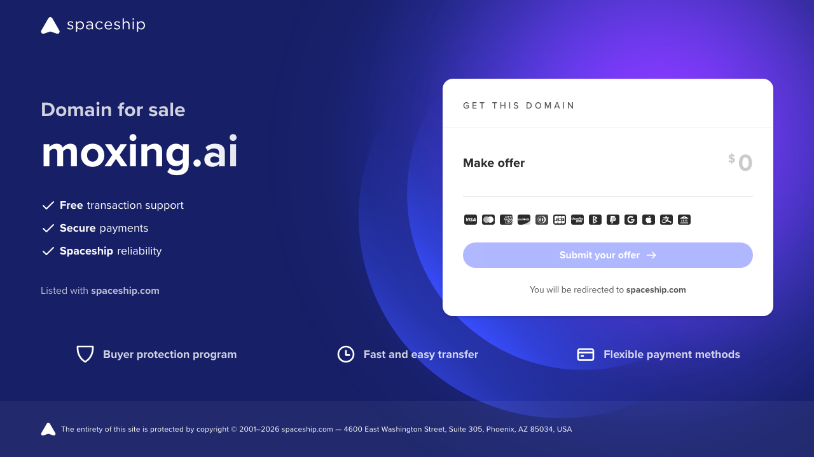
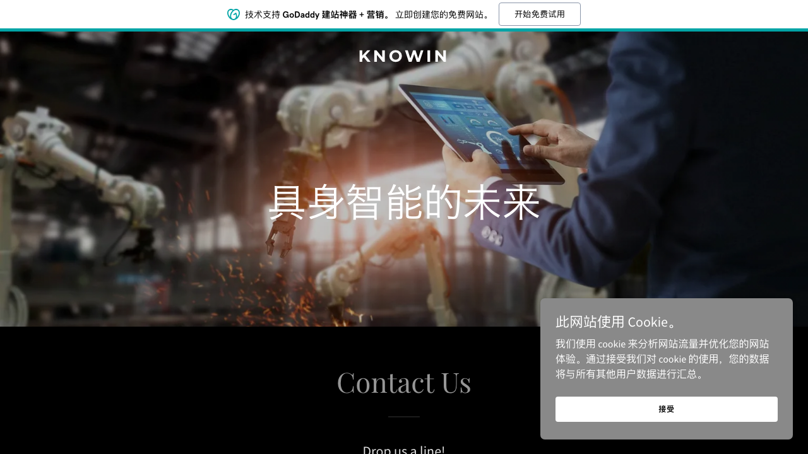
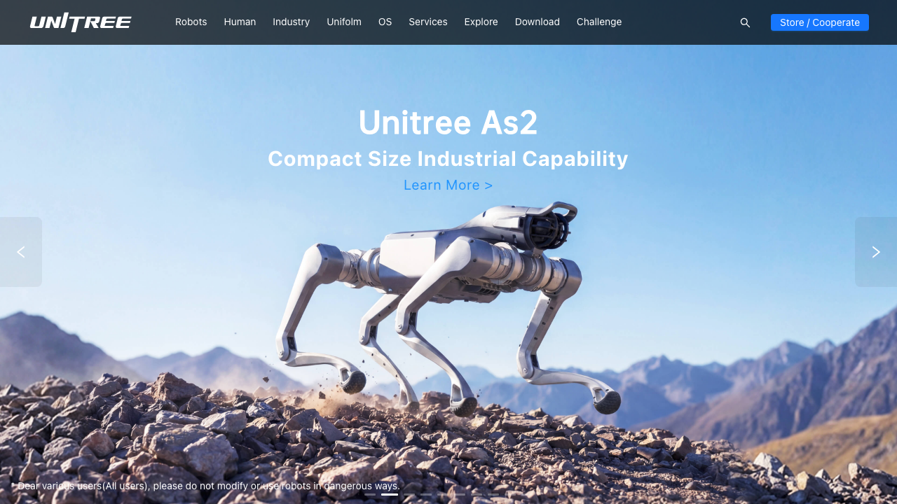
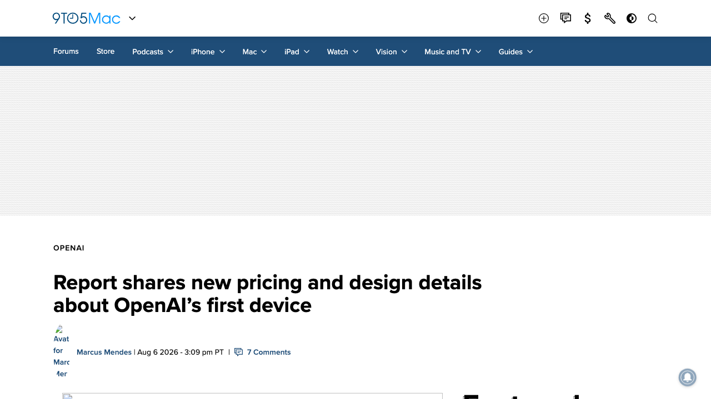
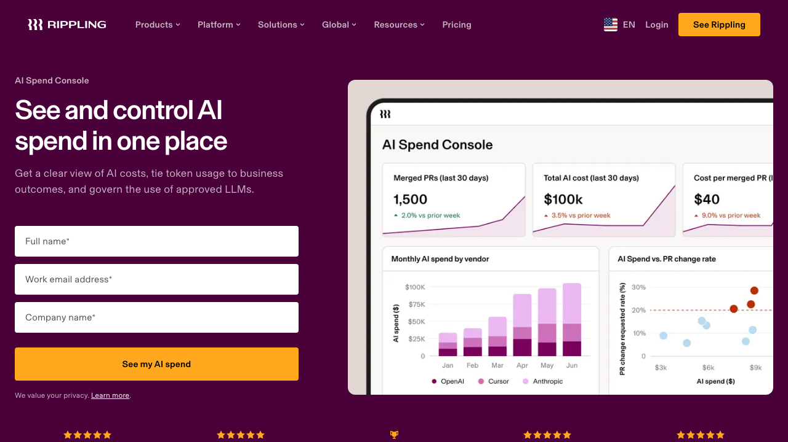

# 0810日报 | AI进入「造物时代」：Token工厂日卖数万亿、人形机器人第一股申购、OpenAI做起了甜甜圈音箱

## 今日洞察

今天的五个字：「**AI开始造物。**」

**8月9-10日，一条清晰的主线同时在中美两端出现：AI的钱正在从「模型」流向「物」——Token工厂、机器人本体、消费硬件与算力账单。** 国内：8月10日（周一），「Token超级工厂」魔形智能宣布完成A轮融资（毅达资本领投）——三个月连融两轮，日均卖出数万亿Token、部分模型已盈亏平衡，目标直指日均10万亿，创始人徐凌杰（前壁仞科技总裁）的判断是「模型是开源的，但高效的部署方式并不会全部开源」；同一天，家庭具身智能公司诺因智能宣布完成5亿元天使++轮（经纬创投领投）——前华为生成式大模型负责人把家务机器人「折」进40厘米，2027年将以数万元价格卖给高净值家庭；还是同一天，A股「人形机器人第一股」宇树科技开启申购——发行价150.80元、对应市值约610亿、市盈率219倍，从IPO受理到申购不到5个月，社保基金与DeepSeek同时入围战略配售，为人形机器人产业链写下第一个A股定价锚。**海外同样在「造物」：OpenAI首款硬件「00」甜甜圈音箱细节持续曝光（$300-400、自带摄像头、带「会自己动的机械结构」，与Jony Ive的LoveFrom合作、2027年发售）——一个软件起家的前沿实验室正式下场做消费硬件；Rippling则发布AI Spend Console（8月6日），把自己「差点把40%研发人头预算烧在token上」的教训做成产品，帮CFO把AI支出当成财务科目来管。**

**五件事放在一起，指向同一个判断：当模型能力被开源（Qwen3.8-Max）和巨头（GPT-5.6、Astra）双重商品化（0806/0809日报），AI行业竞争的主战场正在从「模型竞赛」切换为「造物竞赛」——谁能把智能变成可规模化生产的Token、能走进家庭的机器人、能握在手里的硬件，以及能算清账的支出，谁就拿到下一轮定价权。** 而对创业者来说，最值得注意的其实是中间那条暗线：**AI正在从「软件生意」变成「工业生意」**——魔形智能讲的是「每元钱、每瓦电力能生产多少可用Token」的工厂逻辑，宇树科技的219倍市盈率是资本市场给「机器人工业化」的定价，Rippling的AI Spend Console则是「工业时代」必须配套的成本会计制度。**当一门技术开始讨论「单位成本」「产能」「毛利率」和「IPO定价锚」，它就不再是「创新」而是「产业」了——AI正是走到了这一步。**

**为什么这是创业者的窗口期：①「Token工厂」是中国AI基础设施里第一个「自造血」的商业模式**——魔形智能的日均数万亿Token、数亿元收入、盈亏平衡模型，证明「卖Token」可以是一门真生意，而「每元钱生产多少Token」正在成为衡量所有AI基础设施公司的核心KPI；**②「人形机器人IPO」打开了具身智能的资本化通道**——宇树的定价锚会让一级市场所有具身智能项目被重新估值，「第一股」红利（政策绿灯、社保基金进场、媒体聚焦）只有先发者能吃到；**③「AI支出治理」从成本话题变成产品品类**——Rippling的40%→15%、Sapiom的路由（0808日报）、魔形智能的「token效率」叙事，说明AI已经从「尝鲜预算」变成「需要ROI的科目」，而中文市场的「AI支出治理」几乎空白。

---

## 1. [「Token超级工厂」魔形智能完成A轮融资：三个月连融两轮、日均卖出数万亿Token，部分模型已盈亏平衡](https://www.163.com/dy/article/L3V8A6TC0534A4SC.html)（融资 / 模型开源潮之后，竞争从「谁的模型强」变成「每元钱能生产多少Token」）

🔗 链接：[界面新闻（A轮）](https://finance.eastmoney.com/a/202608103836074582.html) | [智东西专访](https://m.sohu.com/a/1060866902_115978) | [网易转载](https://www.163.com/dy/article/L3V8A6TC0534A4SC.html) | [新浪财经专访（5月）](https://finance.sina.com.cn/stock/t/2026-05-25/doc-inhzascn2557317.shtml) | [Pre-A轮报道（5月6日）](https://finance.eastmoney.com/a/202605063728527867.html)

**动态**：**8月10日（周一），成立两年多的「Token超级工厂」魔形智能宣布完成A轮融资。** 本轮由**毅达资本**领投，**诚元祥投资、洪山资本、瑞锋资本、南通产控思源人工智能基金（由南通产控与上海交大菡源资产共同发起设立）、灏俊投资**等联合投资，**达泰资本、香港科技园创投基金**等老股东持续加注，部分股东超比例跟投。**距离5月公布的数亿元Pre-A轮（达泰资本领投）仅过去三个月——「三个月连融两轮」在当前融资环境下并不多见。** 资金主要用于推进算力基础设施技术迭代与商业化落地。**更关键的业务数据：成立两年，日均Token调用量已达数万亿级（客户实际调用并产生收入的口径），2026年营收预计数亿元，部分模型已经盈亏平衡；客户与合作伙伴覆盖互联网头部企业、大模型厂商与各行业头部企业，AI编程是最确定的商业场景。公司下一个目标是日均Token产量推向10万亿级。**

**做什么的**：魔形智能做的是「Token的规模化生产」——把开源模型、自研推理引擎、算力硬件和运营系统组合起来，将底层复杂性封装成企业**可以直接调用的Token产品**，本质是「AI算力的高阶产品形态」。创始人是**前壁仞科技总裁徐凌杰**（曾在Nvidia、AMD、阿里云GPU基础设施任职，20年芯片/系统/云计算交叉经验）与高性能计算专家**金琛**。技术层面：围绕**Prefill/Decode分离、KV Cache感知调度、多硬件适配**做推理优化（针对不同模型的负载特征把计算任务部署到成本最合适的芯片上）；正在攻关**「超节点」硬件平台**——把更多加速芯片用高带宽、低时延互联组织起来，目标是把Agent场景的生成速度推到**每秒上千Token**（目前部分模型已达每秒数百Token）；同时坚定押注国产芯片生态（国产算力、国产基础设施、国产大模型的协同发展）。

**为什么值得关注**：

- **「模型是开源的，但高效的部署方式并不会全部开源」——这句话定义了Token工厂赛道的全部门槛。** DeepSeek、Kimi、GLM、MiniMax的开源潮让「有卡就能跑模型」成为现实，但大规模并发下的延迟、吞吐、成功率与成本才是「能卖出去的Token」。徐凌杰用公开案例说明：「有人用80张桌面显卡跑最新大模型，单路速度只能达到每秒20个Token——模型跑起来了，速度难以满足商业场景要求，成本也撑不起有竞争力的Token价格。」对创业者的启示：① 如果你做AI应用/Agent，推理成本不是「以后优化」的事，而是商业模式成立的前提；② 如果你做基础设施，「部署效率」正在成为比「模型能力」更稀缺的护城河——开源模型让「原料」免费，但「工艺」仍是壁垒。

- **三个月连融两轮+部分模型盈亏平衡——「Token工厂」是中国AI基础设施里罕见的「已自造血」叙事。** 2026年从芯片厂商、云服务商到运营商几乎人人都在讲Token工厂的故事，但大多数还在「烧钱换规模」；魔形智能给出的是另一组数字：日均数万亿Token实际销量、数亿元收入、盈亏平衡模型、**营收增速快于算力投入增速**。对创业者的启示：① AI基础设施的融资叙事正从「我们有多少卡」转向「每张卡产出多少有效Token」；② 「自我造血」是中国AI基础设施创业的差异化加分项——徐凌杰说得直白：「投资人关心的核心问题，是资本投入能否带来更高的回报」；③ 跟踪它的10万亿目标——如果兑现，「Token产量」将成为衡量AI基础设施公司的核心KPI，就像发电量之于电力公司。

- **「每元钱、每瓦电力究竟能生产多少可用Token」——行业竞争焦点从「拥有多少算力」转向「生产效率」。** 这与0808日报Sapiom的「模型路由」（需求侧省钱）、0809日报Lumilens的「光互连」（供给侧提效）形成完整闭环：**模型层商品化之后，生产、连接、路由、计费——「Token经济」的每一环都在被重新定义。** 对创业者的启示：① 无论你做模型、应用还是中间层，「token效率」都是2026下半年最重要的北极星指标；② 「超节点+软硬件协同」正在成为下一代Token工厂的技术分水岭——徐凌杰判断「未来基于超节点硬件集群和软硬件协同优化的算力基础设施会呈现完全不同的技术范式」；③ 中文AI的「推理成本」故事比英文世界更激烈——开源模型+国产芯片+极致优化是中国Token工厂的独特组合，也意味着「国产算力生态」是这类公司的估值加分项。

- **徐凌杰的「从0到1/从1到10」扩张逻辑——先服务大B客户、在客户内部横向扩展模型与场景。** 魔形智能的策略是先啃下互联网头部企业的核心研发流程（AI编程、办公），用「质量优先于价格」建立信任，再谈性价比——「从0到1是用技术实力获得客户认可；从1到10是有了多个客户，并且能在客户内部持续扩展模型和业务」。对创业者的启示：① Token/算力类生意的正确切入口是「开发者工作流」——进了研发流程就进了企业核心生产力；② 「首Token延迟超过3秒，很多企业客户已经难以接受」——体验指标是ToB AI基础设施的销售门槛；③ 弹性（初始容量+突发扩容能力）是大客户采购的隐藏要求——供应链与运营能力也是产品的一部分。

- 对创业者的启发：**① 「Token工厂」是2026年中国AI基础设施最性感的融资叙事——但验证标准是「实际销量+盈亏平衡」而不是「产能规划」；② 「部署效率」是开源时代唯一的工程壁垒——把PD分离、KV Cache、超节点、国产芯片适配做成体系；③ 大B客户+开发者工作流是算力生意的正确切入口；④ 关注「token效率」指标化——它正在成为衡量AI基础设施公司的新KPI。** 

**类比参考**：**「AI的「富士康时刻」 / 从「造模型」到「造Token」——当智能变成可以计件生产的工业品，工厂效率决定竞争力」**

---

## 2. [诺因智能完成5亿元天使++轮融资：前华为生成式大模型负责人把家务机器人「折」进40厘米](https://finance.sina.cn/stock/jdts/2026-08-10/detail-inimuvrv5048454.d.html)（融资 / 家庭具身智能：从「能走能跳」到「能折进后备厢」的消费级产品化）

🔗 链接：[36氪首发](https://finance.sina.cn/stock/jdts/2026-08-10/detail-inimuvrv5048454.d.html) | [大河财立方快讯](https://app.dahecube.com/nweb/pc/spiderdetail.html?spidid=836637?recid=1) | [36氪（3月天使+轮）](https://m.36kr.com/p/3710837341286919) | [中国日报WAIC报道](https://tech.chinadaily.com.cn/a/202607/22/WS6a606ce6a310d709c2fbf0a6.html) | [虎嗅Knowin-X1拆解](https://www.huxiu.com/article/4876514.html)

**动态**：**8月10日（周一），36氪首发：消费级家庭具身智能公司诺因智能（KNOWIN）完成天使++轮融资，单笔金额5亿元人民币。** 本轮由**经纬创投**领投，**红点创投、商汤国香资本、华登科技、L2F光源创业者基金**跟投，**光源资本**担任独家财务顾问。资金将主要用于**GLOW生成式具身大模型**研发迭代、团队扩充及首款产品**KNOWIN-X1**的工程验证与量产准备。诺因智能成立于2025年（深圳），创始团队汇聚华为与大疆的技术核心：创始人**李银川**曾任华为诺亚方舟实验室生成式大模型方向负责人（诺亚最年轻的项目经理），联合创始人**王韵杰**是大疆明星产品的产品操盘手，合伙人**周凯文**是前华为Agent方向负责人。截至2026年7月团队超190人、博士及以上占比超2/3。此前已完成种子轮（源码律动）、天使轮（L2F光源）与天使+轮（钟鼎资本领投、投后估值超20亿元）。

**做什么的**：诺因智能做「消费级家庭具身智能」——让通用机器人走进家庭。技术核心是自研**GLOW生成式具身大模型系统**（五模块闭环：KnowinDream从有限真实交互扩展出广泛训练分布、KnowinWorld建模「动作如何改变环境与任务走向」、KnowinBrain/KnowinAgent负责任务理解与分步规划、KnowinAct把策略转化为可执行动作），路线是**「数据生成→虚拟试错→真实执行→反馈回流」的闭环**——让机器人在面对没见过的任务时「调用组合已有能力自主解决」，而不是复现训练过的动作。首款产品**KNOWIN-X1**采用**全球首创全折叠双臂构型**：折叠后整机高度控制在40厘米以内（可放后备厢、像家电一样不占空间），展开后有**趴/跪/站**三种工作形态适配地面/桌面/柜体三类操作面，单臂7自由度、双臂最大负载6kg、全身23自由度；场景覆盖家务协助（桌面整理、衣物处理、家庭设备交互）、家庭陪伴（自然交互、主动问候、长期记忆）与智能值守（安全提醒、老人看护）。产品预计**2027年正式发布，售价数万元量级**，定位高净值人群与极客，且刻意不做「开箱即用」而是让用户通过「教学」让机器人学会新任务（养成式交互）。技术验证：**CVPR 2026 EgoCross挑战赛双赛道全球第一、Embodied Arena评测综合得分居首。**

**为什么值得关注**：

- **「天使++轮单笔5亿、成立一年四轮」——家庭具身智能正在复制「大模型创业」的融资节奏。** 种子（源码律动）→天使（L2F）→天使+（钟鼎，估值超20亿）→天使++（经纬领投5亿），投资人名单从产业基金到一线VC再到商汤国香这样的产业资本——这几乎是大模型公司2023年的剧本。对创业者的启示：① 「消费级家庭机器人」是2026年VC公认的下一张船票，资本在抢赛道而非等产品成熟；② 经纬、红点、商汤国香的共同押注说明「数据飞轮+泛化能力」叙事（使用增加→数据积累→模型提升→体验改善）正在被资本接受为具身智能的核心估值逻辑；③ 但注意：产品2027年才发布，「天使++轮」之后的每一轮都需要产品验证来支撑——窗口期也是危险期，估值泡沫与产品交付之间的张力会越来越大。

- **「把机器人折进40厘米」——消费级机器人的产品定义从「功能」转向「存在感」。** 李银川的产品逻辑非常清醒：家庭机器人必须「不工作时不占空间」，消费者才可能接受——所以全折叠、像家电、能放后备厢；且不承诺开箱即用，用「教学+养成」管理预期（「演示一次擦桌子，机器人此后便能自主完成」）。对创业者的启示：① 2C硬件的第一性约束不是技术多强，而是「用户凭什么让它住进家里」——尺寸、噪音、安全、收纳都是产品决策；② 「开箱即用」的过度承诺是家庭机器人最大的体验风险——「教学式交互」既管理预期又创造数据飞轮（每次教学都是一次高质量数据采集），是聪明的产品策略；③ 售价数万元定位高净值+极客——先服务愿意为「养成感」付费的早期用户，再向大众市场渗透。

- **「GLOW五模块闭环」——具身智能的竞争从「堆数据」转向「造数据」。** 行业瓶颈是高质量机器人操作数据极度稀缺、真机采集成本高速度慢；诺因的路线是用生成式数据（KnowinDream把少量真实经验扩展为广泛训练分布）+世界模型（KnowinWorld理解动作如何改变环境）+真机反馈形成闭环——「不是靠堆数据，而是靠建立一套从虚拟到真实、从失败到进步的闭环机制」。对创业者的启示：① 「数据引擎」正在成为具身智能公司的核心资产——会造数据的公司比会买数据的公司有十倍成本优势；② 世界模型（预测动作后果）是泛化能力的关键——只学「动作」不够，要学「动作如何改变世界」；③ CVPR双赛道第一+Embodied Arena第一说明「学术榜单→资本叙事」的转化路径依然有效——学术验证是早期硬件公司最便宜的信任状。

- **华为+大疆团队、博士占比2/3——「大厂AI人才+硬件产品基因」正在成为具身智能创业的标准配方。** 对比同类：它石智航（美团投的「前华为人」团队）5个月完成2.42亿美元融资、诺因（华为+大疆）一年四轮——「华为系生成式模型+大疆系产品操盘」几乎是为家庭机器人量身定做的履历组合。对创业者的启示：① 具身智能是少有的「AI算法+硬件产品+供应链」三合一赛道，团队履历的「混合度」直接决定融资成功率；② 家庭场景的竞争壁垒是「泛化」——能证明模型在未知环境里自主完成任务（而非复现训练动作）的团队才配拿钱；③ 关注「消费级 vs 工业级」的分流——工业具身已拥挤（云深处、鹿明等），家庭场景的窗口还在打开，但「最难场景」也意味着最长的验证周期。

- 对创业者的启发：**① 家庭具身智能是2026年最确定的「长期叙事+短期泡沫」并存赛道——融资窗口在开，但要为「2027年产品落地」留足弹药；② 「数据引擎+世界模型+闭环反馈」是具身智能的技术护城河公式；③ 消费级机器人的产品化要从「存在感」（尺寸、收纳、安全）而不是「功能清单」出发；④ 关注诺因的「教学式交互」——如果养成式体验被验证，它会成为家庭机器人「数据飞轮」的标准打法。** 

**类比参考**：**「具身智能的「家电化」时刻 / 从「工业机械臂」到「能折进后备厢的家电」——机器人第一次按消费品的逻辑设计」**

---

## 3. [「人形机器人第一股」宇树科技8月10日开启申购：发行价150.80元、市值约610亿、市盈率219倍](https://www.stcn.com/article/detail/4065944.html)（行业洞察 / 具身智能的「定价锚」：A股第一次给人形机器人标价）

🔗 链接：[证券时报](https://www.stcn.com/article/detail/4065944.html) | [央广网](https://www.cnr.cn/jingji/gundong/20260809/t20260809_527754640.shtml) | [东方财富](https://wap.eastmoney.com/a/202608083835787592.html) | [烯牛周报](https://zhuanlan.zhihu.com/p/2067735322037900921) | [投资中国（股东结构）](http://www.financeun.com/newsDetail/65259.shtml)

**动态**：**8月10日（周一），A股「人形机器人第一股」宇树科技（688836.SH）在科创板开启网上、网下申购，缴款截止日8月12日。** 发行价**150.80元/股**，对应发行市盈率**219.23倍**，发行市值约**609.93亿元**；拟公开发行**4044.64万股**（占发行后总股本的10%），预计募集资金总额约**61亿元**（原计划42亿元）。**从3月20日IPO申请获受理到8月10日申购，用时不到5个月。** 战略配售名单包括**社保基金、DeepSeek**等；7月30日公告显示董事长**王兴兴**领衔的员工资管计划认购超2.7亿元，超百名核心员工参与战略配售。公司是**全球唯一实现规模化盈利的通用人形机器人公司**：2025年营收16.99亿元，同比暴增335%。募资近半投向具身智能大模型研发。**其上市将为人形机器人产业链建立A股定价锚。**

**做什么的**：宇树科技做四足机器人与人形机器人——从机器狗（Go2、B2）到人形机器人（H1、G1），是全球出货量领先的机器人公司，商业模式覆盖硬件销售（机器人本体）、行业解决方案（电力巡检、教育科研、物流）与海外市场，是少数「靠卖机器人本体实现规模化盈利」的公司。**它的上市意味着：资本市场第一次可以用公开定价来衡量「人形机器人」这门生意的价值——219倍市盈率、610亿市值，是市场对「具身智能会成为下一个智能手机/汽车级市场」的预期投票；同时，它给一级市场所有具身智能公司的估值提供了第一个公开参照系。**

**为什么值得关注**：

- **219倍市盈率+610亿市值——「人形机器人」第一次有了A股定价锚。** 此前具身智能公司的估值全部来自一级市场，各家独角兽各有各的算法；宇树上市后，投资人可以用宇树的PS/PE倍数去重估诺因、它石智航、星尘智能等所有同赛道公司——**一级市场的估值逻辑将开始向二级市场收敛。** 对创业者的启示：① 如果你在具身智能赛道，「对标宇树的估值倍数」将成为每一份TS的谈判锚点；② 219倍市盈率意味着市场按「高增长+平台化」给机器人公司定价——增长叙事（335%营收增速）比当期利润更重要；③ IPO密集期到来（央广网标题直接是「具身智能赛道迎来IPO密集期」）——退出通道打开会反过来加速一级市场的投融资。

- **「全球唯一规模化盈利的通用人形机器人公司」——盈利模式是人形机器人赛道的稀缺品。** 行业普遍还在「融资-烧钱-演示」循环，宇树用「卖本体+行业解决方案」实现了盈利——它证明人形机器人可以先像「高端硬件」一样赚钱，再等「具身大模型」成熟后切换叙事。对创业者的启示：① 「先硬件盈利、后模型增值」是一条被验证的路径——不要为了AGI叙事放弃单位经济；② 四足机器人（机器狗）是宇树的现金牛——「先卖能卖的产品，再养梦想中的产品」是硬件创业的经典策略；③ 海外市场是机器人公司毛利率的关键——全球化能力要提前布局。

- **社保基金+DeepSeek+百名核心员工战略配售——「国家队+AI顶流+全员持股」的资本结构信号。** 社保基金入围战略配售，说明「人形机器人」进入了国家资本的配置清单；DeepSeek参投则把「具身智能×大模型」的协同叙事写进了股权结构；王兴兴领衔员工认购2.7亿、超百名核心员工参与，是罕见的「全员看好」信号。对创业者的启示：① 具身智能正在从「VC赛道」升级为「国家战略赛道」——融资时认真评估产业资本与国家队LP；② 「AI公司×机器人公司」的股权绑定（DeepSeek×宇树）预示具身大模型与机器人本体的合流——这是生态级机会（模型公司需要物理载体、机器人公司需要大脑）；③ 员工重仓配售说明团队对上市后表现的信心——也意味着上市后的业绩压力会传导到研发节奏。

- **从受理到申购不到5个月——硬科技IPO的「绿色通道」效应。** 3月20日受理、8月10日申购，A股对「人形机器人第一股」开了快车道；对比一般企业1-2年的IPO周期，这个速度本身就是政策信号：**资本市场在主动为具身智能「开闸」。** 对创业者的启示：① 中国硬科技IPO窗口正在系统性打开（同周长鑫科技登陆科创板、首日大涨465%、市值3.28万亿超越工商银行）——符合条件的AI/机器人公司应认真规划上市路径；② 「第一股」红利（定价锚+政策绿灯+媒体聚焦）只有一次——赛道头部的窗口期优势巨大；③ 但注意：219倍PE也意味着「上市即巅峰」的风险——如果后续业绩撑不住高估值，会反向压制整个赛道的估值空间，这是所有同赛道公司都要承担的「锚定风险」。

- 对创业者的启发：**① 人形机器人IPO开闸是2026年具身智能最大的资本市场事件——用宇树的估值倍数反推自己的融资定价；② 「先硬件盈利、后模型增值」是被验证的商业模式；③ 国家队+AI公司+员工持股的资本结构值得借鉴；④ 警惕「定价锚」的双刃剑效应——二级市场的估值回调会传导到一级市场。** 

**类比参考**：**「人形机器人的「定价」时刻 / 从「一级市场的估值游戏」到「二级市场的公开定价」——当股票交易所给人形机器人标价，整个产业链都有了参照系」**

---

## 4. [OpenAI首款硬件「00」甜甜圈音箱细节曝光：$300-400、自带摄像头、带会「自己动」的机械结构，与Jony Ive联手](https://9to5mac.com/2026/08/06/report-shares-new-pricing-and-design-details-about-openais-first-device/)（行业洞察 / 软件起家的前沿实验室，正式下场做消费硬件）

🔗 链接：[9to5Mac](https://9to5mac.com/2026/08/06/report-shares-new-pricing-and-design-details-about-openais-first-device/) | [Gizmodo](https://gizmodo.com/openais-rumored-smart-speaker-sounds-more-like-a-squirming-ai-robot-2000795867) | [Fast Company](https://www.fastcompany.com/91587001/openai-hardware-donut-shaped-smart-speaker) | [MobileSyrup](https://mobilesyrup.com/2026/08/06/openai-speaker-size-price-report/) | [Gadgets Now（8月9日）](https://gadgetsnow.indiatimes.com/tech-news/openais-first-ai-smart-speaker-could-cost-up-to-400-heres-everything-we-know-so-far/articleshow/133040503.cms) | [Bloomberg原始报道](https://www.bloomberg.com/news/articles/2026-08-06/what-is-openai-s-device-a-doughnut-shaped-speaker-that-costs-over-300)

**动态**：**过去一周（8月6日Bloomberg首发、8月7-9日持续发酵），OpenAI首款硬件的细节陆续曝光：一款甜甜圈形状、曲棍球大小的智能音箱——无屏幕、电池供电、自带摄像头与传感器，并且带有「能自己动的机械结构」，制造「它是活的、而不只是一个响应命令的物件」的感觉。** 定价讨论区间**$300-400**，采用高级金属等「上乘材质」，设计用于不同摆放姿态（握在手里或放在家具上），更先进的AI模型支持类ChatGPT自然语音交互。产品由**Jony Ive的设计工作室LoveFrom**参与打造，计划今年亮相、**2027年发售**；OpenAI同时在开发**「大约5款」硬件产品**，音箱只是第一款。**背景插曲：苹果已就「前员工窃取商业机密用于OpenAI硬件」起诉OpenAI，8月6日OpenAI同日申请驳回该诉讼；Bloomberg指出甜甜圈形态「不是苹果接近推出的东西」。**

**做什么的**：这是OpenAI从「软件实验室」向「消费硬件公司」迈出的第一步——把ChatGPT的语音能力装进一个**没有屏幕、可以放在家里或握在手里的物理设备**，与Amazon Echo、Google Nest正面竞争。与现有智能音箱的差异化在于：① **形态**——甜甜圈+曲棍球尺寸，非圆柱/球体；② **「生命感」**——可动的机械结构、多姿态使用，试图制造「活物」的错觉；③ **定价**——$300-400，比Echo/Nest入门款贵一个量级，走「高端AI硬件」路线；④ **生态**——与苹果前设计灵魂人物Jony Ive的LoveFrom合作。**战略意图：在「无屏幕的对话式AI」成为下一代交互范式之前，提前两年占住物理入口。**

**为什么值得关注**：

- **「软件公司开始做硬件」——前沿实验室的战略重心正在从「模型」延伸到「设备」。** OpenAI、Anthropic、Google都在布局AI硬件（OpenAI音箱、Meta雷朋眼镜、Google Pixel+Gemini），但OpenAI的「甜甜圈音箱」是第一次有前沿实验室把「无屏幕语音交互」作为旗舰硬件方向——它赌的是**「对话式AI不需要屏幕」**的交互范式。对创业者的启示：① 「AI硬件」正在成为模型公司的第二增长曲线——模型能力的护城河需要「物理载体」来变现；② 无屏幕设备（音箱、耳机、眼镜）是AI原生的交互入口——屏幕是给人类软件用的，AI可能只需要「对话+感知」；③ 观察它能否复制AirPods式的「新形态定义新品类」——Jony Ive的加入让这个概率不低，而「定义新品类」对创业者的意义是：新品类=新供应链=新渠道=新机会。

- **「会自己动的音箱」——「生命感」正在成为AI硬件的设计语言。** Bloomberg描述的「能自己动的机械结构，制造活着的错觉」是一个重要信号：AI硬件不再追求「工具感」而是追求「陪伴感」——像宠物、像室友。对创业者的启示：① 消费级AI硬件的差异化维度从「功能」转向「情感」——能动的、有反应的、看起来「活着」的设备有溢价空间；② 但「拟人化」的度很难把握——Gizmodo直接吐槽它是「蠕动的AI机器人」，过度拟人可能适得其反；③ 中国团队做「AI陪伴硬件」时可以借鉴：形态（非人形也能有生命感）+交互（自然语音）+定价（高端精品路线）——国内「AI陪伴」赛道（桌面宠物、情感音箱）可以观察这个趋势的验证。

- **$300-400定价+LoveFrom设计——OpenAI走「苹果式」高端精品路线，而非「亚马逊式」普及路线。** 智能音箱市场过去十年被Amazon（低价+生态）和Google（搜索+助手）定义；OpenAI的切入角度完全不同：不拼价格、拼「AI能力本身」——它的赌注是**「当AI足够聪明，人们愿意为'聪明'付$400」**。对创业者的启示：① 「AI能力即溢价」——如果你的AI产品真的更强，不要用低价竞争，用「能力+设计」重新定义价格带；② 与顶级设计工作室合作是硬件品牌化的捷径——设计是AI硬件的第一张名片；③ 注意Apple诉讼的进展——硬件供应链与人才流动的合规风险是AI硬件创业的暗礁（苹果指控OpenAI挖走员工+窃取机密，虽然OpenAI申请驳回，但「大厂人才流动做硬件」的合规红线已经画下）。

- **5款硬件产品矩阵+2027年发售——OpenAI的硬件野心比想象中大。** 音箱只是第一款，还有约4款在开发；2027年发售意味着它在**提前两年布局「后手机时代」的入口**。对创业者的启示：① 「AI原生硬件」的窗口期正在打开——2026-2027年会是AI硬件密集发布的两年，供应链、渠道、交互范式都会被重新定义；② 别只盯着音箱——耳机、眼镜、戒指、桌面设备都是候选形态，「AI硬件×垂直场景」（健康、教育、陪伴）是中国创业者的机会；③ OpenAI做硬件也意味着「模型层公司」的边界正在模糊——未来的竞争是「模型×硬件×生态」的全栈竞争，纯软件AI公司的护城河会越来越薄。

- 对创业者的启发：**① 前沿实验室下场做硬件，是「AI原生设备」品类成立的最强信号——关注无屏幕、有生命感、高溢价的AI硬件机会；② 「AI能力即溢价」——用能力+设计重新定义价格带，而不是低价竞争；③ 2026-2027是AI硬件密集发布窗口——供应链与渠道的卡位要提前；④ 关注Apple诉讼与人才合规——大厂系团队做硬件的红线已经画下。** 

**类比参考**：**「AI硬件的「初代iPhone」时刻 / 从「软件里的AI」到「能握在手里的AI」——前沿实验室第一次用消费品的逻辑定义AI」**

---

## 5. [Rippling发布AI Spend Console：把「差点烧掉40%研发预算」的token账单做成产品，帮CFO管住AI支出](https://techcrunch.com/2026/08/07/after-rippling-blew-millions-on-ai-in-months-it-built-an-employee-roi-tool/)（新产品 / 「anti-tokenmaxxing」：AI支出从「失控的账单」变成「可管理的财务科目」）

🔗 链接：[TechCrunch](https://techcrunch.com/2026/08/07/after-rippling-blew-millions-on-ai-in-months-it-built-an-employee-roi-tool/) | [Rippling官方博客](https://www.rippling.com/blog/introducing-ai-spend-console) | [产品页](https://www.rippling.com/platform/ai/ai-spend-console) | [BusinessWire](https://www.morningstar.com/news/business-wire/20260806764198/rippling-launches-ai-spend-console-to-track-ai-usage-and-roi-across-the-business) | [Yahoo Tech](https://tech.yahoo.com/ai/copilot/articles/rippling-blew-millions-ai-months-213011748.html)

**动态**：**8月6日，美国HR软件巨头Rippling发布AI Spend Console——一个让CFO/CTO「看清、理解并控制AI支出」的新产品。** 背景故事非常戏剧化：**Rippling自己曾因AI工具失控，token支出一度冲向「研发人头预算的40%」——相当于把整个研发部门的工资又付了一遍给模型厂商**；在用它自己构建的治理体系后，**token支出从40%降到约15%，且没有限制AI使用量**。产品核心能力：① **统一视图**——连接Anthropic、OpenAI、Cursor等主流AI供应商，按部门/团队/员工维度拆解AI花费（挂在Employee Graph员工图谱上）；② **效率洞察**——把token支出映射到PR与代码评审，识别「高AI花费但产出低」的低效使用（TechCrunch称之为「anti-tokenmaxxing」产品）；③ **自然语言问数**——不用SQL就能问「哪个团队花得最多、产出如何」并自动生成仪表盘；④ **AI Gateway（即将上线）**——按员工属性自动路由模型请求、设置token消费上限、全量日志记录。对Rippling现有HR客户免费（AI用量另计），非客户可30天免费试用。

**做什么的**：AI Spend Console是**「企业AI支出的财务化治理工具」**——把token账单从「看不见的技术成本」变成「可审计的财务科目」。它的独特之处在于数据基础：Rippling本来就掌握员工的部门、职级、汇报线（Employee Graph），加上Data Cloud接入GitHub等第三方数据，就能把**「谁在用AI、花多少钱、产出什么」**三件事关联起来——这是纯云成本管理工具（Vantage等）和纯LLM网关（OpenRouter等）都做不到的「人-钱-产出」三连。商业模式：作为Rippling HR套件的增值模块，用「30天试用+AI用量计费」扩展，本质是HR SaaS巨头向「AI成本管理」品类的横向扩张。

**为什么值得关注**：

- **「40%→15%且不限制使用」——这是AI支出治理领域最硬的一组公开数据。** Rippling自己的案例说明：企业AI支出的失控不是「用太多了」而是「看不见」——一旦把支出映射到人与产出，就能在不砍使用量的情况下砍掉一半以上的浪费。对创业者的启示：① 「AI支出可观测」是企业AI时代的第一个财务刚需——每个有AI预算的公司都需要回答「钱花哪了、值不值」；② 这组数据也解释了为什么「AI成本优化」赛道（0808日报Sapiom的模型路由）持续火热——需求侧的浪费比想象中大得多；③ 如果你做AI应用，准备好回答「我的产品每token产出多少业务价值」——这正在成为企业采购的必答题。

- **「按员工维度管AI」——AI支出治理从「管账单」升级到「管人」。** Rippling的核心创新是把AI花费挂在员工身份上：哪个工程师花得多、代码评审还总被要求返工——「高花费低产出」的员工级洞察是传统成本工具给不了的（Rippling官方的例子：「哪些工程师AI花费高、而他们的代码频繁被同事要求返工」）。对创业者的启示：① 「AI使用×人员组织」的交叉分析是企业软件的新金矿——谁有员工图谱数据（HR系统、IT系统）谁就能做这个品类；② 隐私与公平的边界要提前想清楚——用AI账单评估员工绩效会引发反弹，「治理工具」和「监控工具」只有一线之隔；③ 中国的对照：钉钉、飞书、企微都有员工图谱——「中文版AI Spend Console」是确定性的空白。

- **HR SaaS巨头做AI成本管理——企业软件公司正在用「AI时代的新账单」做交叉销售。** Rippling的逻辑：HR系统已经管着人、钱、权限，AI支出只是「员工相关的又一张账单」——顺手就做了。对创业者的启示：① 警惕巨头用现有客户关系+数据基础横切你的赛道——纯工具型AI成本管理创业公司要往「垂直场景」或「更深的治理」走；② 「AI Gateway」（模型路由+限额+日志）是企业AI治理的入口级产品——谁先拿到网关谁就拿到后续所有AI采购的决策权；③ Rippling的「自己先踩坑再卖工具」是极好的产品叙事——「我们自己的token账单就是最好的demo」。

- **「AI支出」正在成为企业软件的新科目——从「没人管的账单」到「CFO月度review的一行」。** Rippling、Sapiom（0808日报）、各种LLM网关与成本工具的密集出现，说明企业AI已经过了「随便用」阶段进入「管起来」阶段——这与0809日报「模型层贬值、管道层升值」的判断完全一致：**当AI成为企业的主要成本项，「管理AI成本」本身就是一门生意。** 对创业者的启示：① 「AI成本管理」的品类边界正在快速扩展：观测（账单）、优化（路由）、治理（网关）、ROI（产出度量）——每一层都有创业机会；② 与「Agent安全/治理」（Zenity等0806日报）合并看：企业AI的「管理工具层」正在成为2026年最拥挤也最确定的新兴品类；③ 中文企业市场同样需要「AI支出治理」——但要注意合规与审批流程的本地化，以及「国企AI采购」的特殊规则。

- 对创业者的启发：**① 「AI支出治理」是2026下半年确定性最高的新兴品类之一——观测、路由、网关、ROI度量四层都有空间；② 把「token成本→业务产出」的映射做进你的产品——这是企业采购的必答题；③ 「员工级AI洞察」是差异化切口，但隐私边界要先设计；④ 中文市场的「AI支出治理」几乎空白——钉钉/飞书生态、国企AI采购都在等待治理层产品。** 

**类比参考**：**「AI的「财务部」时刻 / 从「AI账单没人管」到「CFO亲自review token支出」——当AI成为企业最大的新成本项，治理工具成为必需品」**

---

## 值得重点跟踪的 3 个信号

1. **「AI造物」三线并行：Token工厂（生产）、机器人（本体）、AI硬件（设备）——模型竞赛正在变成造物竞赛。** 8月10日这一天，中国出现「Token工厂融资（魔形A轮）+ 家庭机器人融资（诺因5亿天使++）+ 人形机器人IPO申购（宇树）」三重奏，海外则是OpenAI首款硬件细节持续曝光——四件事的共同点：都发生在「模型之外」。当开源模型（Qwen3.8-Max）和巨头旗舰把「智能」变成公共品，「把智能变成物」的能力（Token生产、机器人制造、硬件定义、成本治理）成为新的稀缺资源。**对创业者的建议：① 融资叙事从「我的模型/我的AI多强」转向「我把智能变成了什么物/什么服务」；② 模型层创业的窗口正在关闭，但「模型×物」的结合层（具身智能、AI硬件、Token供应）窗口正在打开；③ 跟踪三个指标：魔形智能的日均Token产量（10万亿目标）、宇树上市后的市值走势（具身定价锚）、OpenAI音箱的预订数据（AI硬件需求验证）。**

2. **人形机器人IPO开闸+「第一股」定价锚——具身智能的资本化通道正式打开。** 宇树科技从受理到申购不到5个月、社保基金与DeepSeek同时入围战略配售、219倍市盈率——A股用最快的速度和最高的溢价迎接「人形机器人第一股」，央广网直接点出「具身智能赛道迎来IPO密集期」。**对创业者的建议：① 具身智能创业公司应把「上市路径」纳入战略规划——「第一股」红利（政策绿灯+媒体焦点+估值锚定）只属于先发者；② 一级市场的估值逻辑将向二级市场收敛——用宇树的PS/PE倍数反推自己的融资估值，避免「一级贵过二级」；③ 但警惕「上市即巅峰」的反噬——如果宇树业绩撑不住219倍PE，整个赛道的估值都会回调——「定价锚」是双刃剑。** 同时注意：DeepSeek参投宇树说明「具身大模型×机器人本体」的合流正在发生——这是生态级机会。

3. **「AI支出治理」从成本话题变成产品品类——AI的「财务化」时代开始。** Rippling的40%→15%案例（需求侧控制）、魔形智能的「每元钱生产多少Token」（供给侧效率）、Sapiom的模型路由（0808日报）——供给端与需求端同时成熟，说明AI已经从「尝鲜预算」变成「需要ROI的科目」。**对创业者的建议：① 如果你做企业AI产品，把「token成本」和「业务产出」的映射做进产品——这是采购决策的必答题；② 「AI支出治理/成本优化」是2026下半年确定性最高的新兴品类之一——观测、路由、网关、ROI度量四层都有空间；③ 中文市场的「AI支出治理」几乎空白——钉钉/飞书生态、国企AI采购、大模型厂商的计费体系都在等待「治理层」产品；④ 结合0809日报的「agent-to-agent经济」看：当Agent开始花钱，「谁替Agent付钱、怎么审计Agent的花费」会成为支付与治理的共同问题。**

---

*统计信息：收录 5 个产品/动态 | 融资总额 约¥5亿+（诺因智能天使++轮¥5亿；魔形智能A轮金额未披露、宇树IPO募资约¥61亿为公开募资、OpenAI与Rippling为产品动态不计入融资） | 覆盖赛道：Token生产基础设施、家庭具身智能、人形机器人IPO、AI消费硬件、企业AI支出治理*
