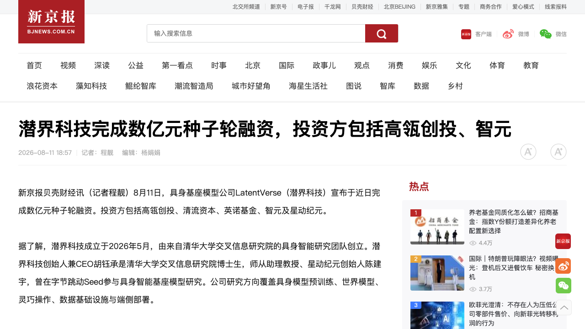
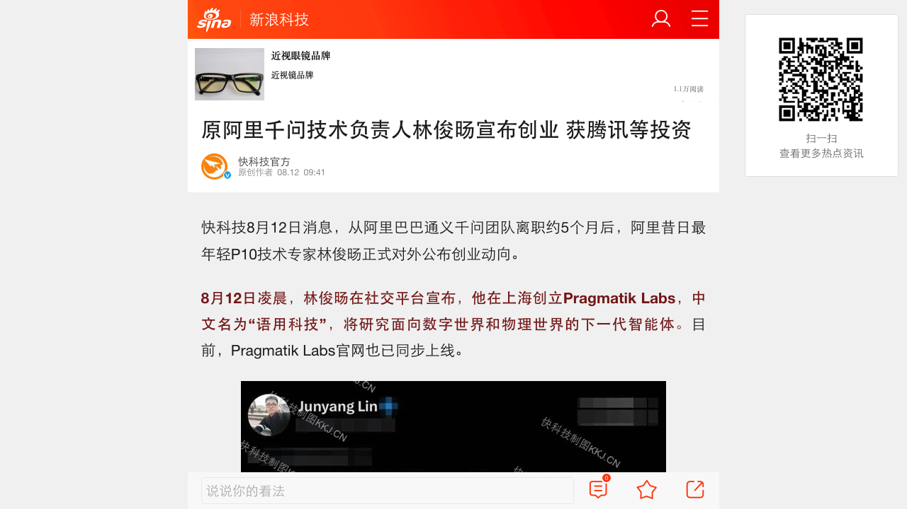
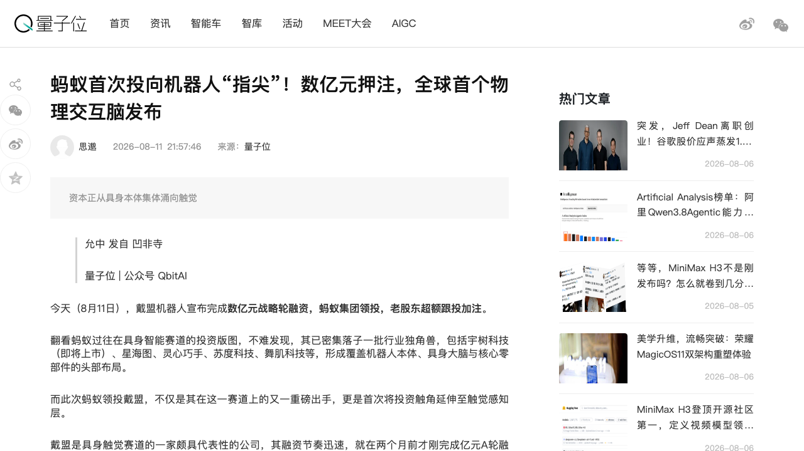
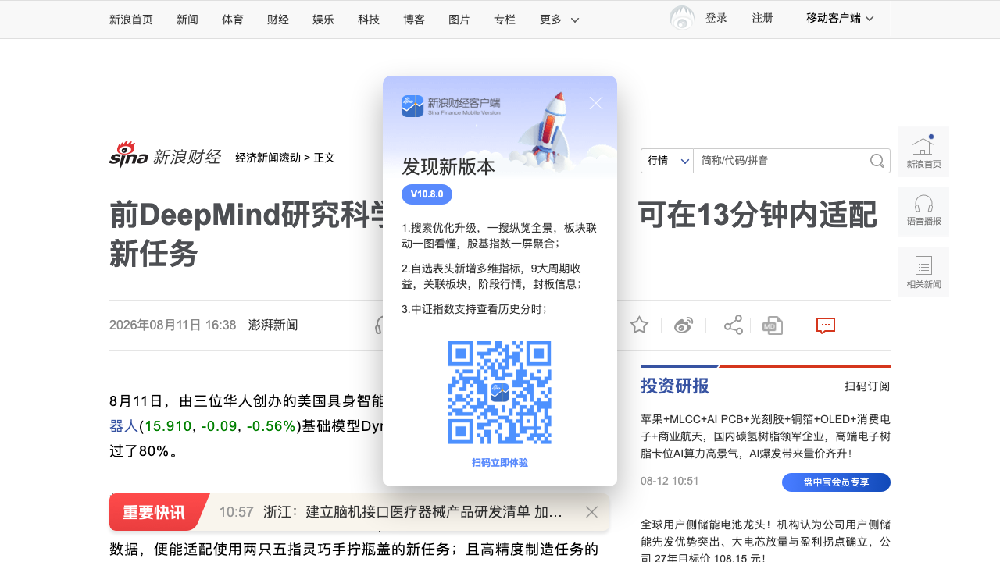
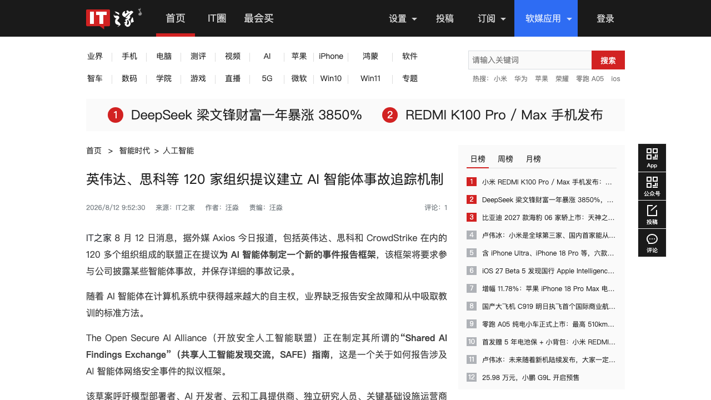

# 0812日报 | 智能正在长出「身体」：触觉成具身新战场、千问之父创业做物理Agent、Agent事故有了「黑匣子」

## 今日洞察

今天的五个字：「**智能正在长出身体。**」

**8月11-12日，五件事共同指向一条主线：AI正在从「对话与生成」走向「感知、行动与负责」——触觉成为具身智能的新战场，大模型人才出走做「物理世界Agent」，而Agent的「事故黑匣子」第一次被制度化。** 国内：8月11日，具身基座模型公司潜界科技（LatentVerse）宣布完成数亿元种子轮融资——高瓴创投、清流资本、英诺基金、智元、星动纪元联合投资，自研UTAM模型把「触觉作为原生模态」纳入统一架构，实现「边想、边做、边修正」的闭环；同一天，戴盟机器人宣布完成数亿元战略轮融资、蚂蚁集团领投——两个月内连融两轮，并同步发布全球首个「物理交互脑」Daimon-TWM触觉锚定世界模型，10B参数、RTX 5090实时推理、统一触觉词元，蚂蚁首次把投资触角伸向机器人「指尖」。海外同样在「长身体」：8月11日，三位华人创办的DynaRobotics发布新一代机器人基础模型Dyna-2——从VLA架构转向「世界-动作模型」（WAM），联合预测下一帧视频与下一个电机指令，13分钟示范数据即可适配新任务，高精度制造成功率从20%跳到80-90%；8月12日，英伟达、思科、CrowdStrike等120+组织组成的「开放安全人工智能联盟」提议建立AI智能体事故追踪机制（SAFE框架）——要求披露智能体事故、保存提示/工具调用/权限凭证等证据，被比喻为AI的「飞机黑匣子」。而最重磅的可能是这一条：**8月12日凌晨，阿里巴巴通义千问前技术负责人林俊旸（「基模四杰」之一）官宣创业——在上海创立Pragmatik Labs（语用科技），做「横跨数字世界和物理世界的下一代智能体」，天使轮由高榕创投、红杉中国联合领投，腾讯、上海未来产业基金跟投，据The Information此前的披露，本轮融资2.2亿美元、投后估值约20亿美元。**\n\n**五件事放在一起，指向同一个判断：当模型能力继续被开源（Qwen3.8-Max、Nemotron 3.5 Lightning）和巨头（GPT、Gemini）商品化，AI竞争的下半场正在从「谁能生成」切换为「谁能感知、谁能行动、谁能负责」——而这恰恰是「身体」的三个含义：感知的身体（触觉）、行动的身体（世界模型驱动的Agent）、负责的身体（事故可追踪、可问责）。** 0810日报我们说「AI开始造物」，0811日报说「智能正在离开云端」，今天这条线更进一步：**离开云端的智能，正在长出物理世界的感官与手脚——触觉（潜界UTAM、戴盟Daimon-TWM）、行动（语用科技的数字×物理Agent、Dyna-2的世界-动作模型）、责任（SAFE事故追踪框架）三件事同时发生，说明「具身/物理AI」从技术路线之争，正式进入「资本+产品+制度」三线并进的产业化阶段。**\n\n**为什么这是创业者的窗口期：①「触觉」正在成为具身智能的下一个资本风口——**潜界种子轮（高瓴/智元/星动纪元）、戴盟战略轮（蚂蚁领投）两天内密集发生，加上0811日报橡木果的「触觉本能」路线，触觉已经从「传感器配件」升级为「模型原生模态」——触觉传感器、触觉数据、触觉基座模型三个子赛道都在打开；**②「大模型人才创业潮」进入第二代——**林俊旸以20亿美元估值天使轮起步，说明市场对「前大厂核心模型负责人+物理世界叙事」的组合给出溢价，也意味着「数字×物理世界Agent」这个方向被一线资本盖章——与0803日报Ellis AI（前OpenAI研究员做垂直AI）、今日语用科技（前通义千问负责人做Agent）合并看：**大模型人才正在从「再做一个模型」转向「做Agent、做机器人、做物理世界」**；**③「Agent事故制度」开始成形——**健身房Agent越界首案（0811日报）后一周，英伟达/思科等120+组织就提出SAFE事故追踪框架，说明「Agent责任」正在从产品真空变成制度竞速——**谁先做Agent审计、事故记录、责任保险，谁就吃到监管红利**。\n\n---\n\n## 1. [潜界科技完成数亿元种子轮：把触觉作为「原生模态」的具身基座模型，高瓴、智元、星动纪元联合押注](https://www.bjnews.com.cn/detail/1786420754129093.html)（融资 / 触觉从「传感器配件」升级为「模型原生模态」——具身基座模型的第一性重构）\n\n\n\n🔗 链接：[新京报](https://www.bjnews.com.cn/detail/1786420754129093.html) | [腾讯新闻](https://news.qq.com/rain/a/20260811A03VWZ00?ptag) | [亿欧数据](https://www.iyiou.com/data/202608111137746) | [融中财经](https://www.thecapital.com.cn/) | [创业邦/企查查](https://www.qcc.com/)\n\n**动态**：**8月11日，具身基座模型公司潜界科技（LatentVerse）宣布完成数亿元种子轮融资。** 投资方包括**高瓴创投、清流资本、英诺基金、智元及星动纪元**——一个罕见的组合：财务VC（高瓴、清流、英诺）+ 具身产业方（智元、星动纪元）在种子轮同场。潜界科技成立于**2026年5月**（北京），由**清华大学交叉信息研究院**的具身智能研究团队创立；创始人兼CEO**胡钰承**是清华交叉信息研究院博士生，师从助理教授、**星动纪元创始人陈建宇**，曾在**字节跳动Seed**参与具身智能基座模型研究。公司研究方向覆盖**具身模型预训练、世界模型、灵巧操作、数据基础设施与端侧部署**。高瓴创投项目负责人表态：自研**UTAM（Unified Tactile Action Model）模型将触觉作为原生模态纳入统一架构**，实现「边想、边做、边修正」的闭环，让机器人能够在与真实环境的持续交互中感知、决策、执行并动态调整。\n\n**做什么的**：潜界科技做的是「**触觉原生的具身基座模型**」——不是把触觉当传感器信号接进来，而是把触觉作为与语言、视觉并列的**原生模态**，从模型架构层面统一建模。这与主流VLA路线（视觉-语言-动作）形成对照：VLA把「看」当第一模态，潜界把「摸」当第一模态。UTAM的核心命题：**机器人要真正在物理世界干活（灵巧操作、长程任务、动态调整），只靠「看」不够——接触、受力、形变、滑移这些物理信息，视觉表达不了，必须让触觉从「事后反馈」变成「事前推演」的一部分**。团队背景（清华交叉信息研究院+星动纪元学术脉络+字节Seed产业经验）决定了它走「学术深度+工程落地」路线，种子轮阶段就布局预训练、世界模型、数据基础设施与端侧部署四层。\n\n**为什么值得关注**：\n\n- **「触觉原生模态」——具身基座模型的第一性重构，正在成为2026年下半年最性感的模型叙事。** 潜界不是「在VLA里加一路触觉信号」，而是把触觉做成模型的第一性模态——UTAM的名字（Unified Tactile Action Model）直白地宣告「触觉×动作」是它的核心轴。对创业者的启示：① 与0811日报橡木果的「本能驱动」（不依赖数据）对照，潜界走的是「触觉数据驱动」——但两者都把触觉放到了模型的核心位置，说明**行业共识正在形成：触觉是具身智能被低估的卡点**；② 「触觉原生架构」意味着训练数据、评测基准、部署形态都要重新定义——触觉数据采集（0811日报德塔D1）、触觉评测、触觉工具链都是配套创业机会；③ 种子轮就有智元、星动纪元两家本体厂入股，说明**具身模型公司与本体公司正在形成「股权绑定」的生态打法**（DeepSeek×宇树是另一个例子）——模型公司的估值故事越来越依赖「跟谁的本体绑定」。\n\n- **高瓴+清流+英诺+智元+星动纪元的种子轮阵容——「产业资本+财务VC」联合投种子，是具身赛道资本结构变化的新信号。** 数亿元种子轮本身就是行业较高水平（大多数种子轮是千万级）；更值得注意的是构成：高瓴创投（头部财务VC）、清流资本（早期VC）、英诺基金（天使VC）+智元、星动纪元（具身本体/产业）。对创业者的启示：① **具身智能的种子轮正在「机构化」**——产业方（本体厂、大厂战投）进入种子轮，意味着「技术+订单绑定」比「纯估值故事」更重要；② 创始人师从星动纪元创始人陈建宇+字节Seed经历的组合，再次验证「学术导师创业生态+大厂产业经验」是具身基座模型创业的标准配方；③ 与0810日报诺因智能（经纬领投5亿天使++）对照：**具身智能的钱在加速向「基座模型/数据/触觉」等上游集中**——本体创业的窗口在收窄，上游卖铲人的窗口在打开。\n\n- **「边想、边做、边修正」——触觉闭环正在成为具身模型的新能力标准。** 潜界的UTAM强调「在与真实环境的持续交互中感知、决策、执行并动态调整」——这与0811日报戴盟的「慢规划-快纠偏」、橡木果的「本能反射→行为涌现」是同一个方向：**具身模型的能力评价正在从「一次做对」转向「做错了能实时修正」**。对创业者的启示：① 「闭环修正」能力（触觉反馈驱动的毫秒级纠偏）将是具身模型下一轮的评测重点——谁把这个能力做进基座模型，谁就拿到灵巧操作场景（装配、插拔、精密制造）的门票；② 触觉数据的「高频」属性（毫秒级）意味着数据采集与处理的技术栈和视觉完全不同——这是新团队的机会窗口；③ 关注潜界的「端侧部署」布局——具身模型的端侧化（与0811日报Meta Glimmer的端侧Agent对应）是「身体」的最后一公里，谁能把模型塞进机器人本体，谁就有部署优势。\n\n- 对创业者的启发：**① 触觉正在从传感器配件升级为模型原生模态——「触觉原生架构」是具身基座模型的新叙事，触觉传感器/数据/评测/工具链是配套创业机会；② 具身种子轮正在机构化——产业方（本体厂）进入种子轮，技术+订单绑定比纯估值故事更重要；③ 「边想边做边修正」的闭环能力是具身模型下一轮评测重点；④ 关注清华系具身创业生态——交叉信息研究院正在批量输出具身基座模型创业者。**\n\n**类比参考**：**「具身智能的「感官革命」时刻 / 从「只看不摸的机器人」到「把触觉做进基因的模型」——当手比眼更重要，具身模型的架构从根上重写」**\n\n---\n\n## 2. [语用科技（Pragmatik Labs）官宣成立：前通义千问负责人林俊旸创业做「数字×物理世界」智能体，天使轮2.2亿美元、估值20亿美元，高榕、红杉中国领投，腾讯跟投](https://finance.sina.cn/tech/2026-08-12/detail-inimzivu5384770.d.html)（融资 / 「基模四杰」下场创业：大模型人才从「再造模型」转向「再造Agent」）\n\n\n\n🔗 链接：[快科技/新浪科技](https://finance.sina.cn/tech/2026-08-12/detail-inimzivu5384770.d.html) | [DoNews](https://www.donews.com/) | [证券时报·人民财讯](https://www.stcn.com/) | [The Information（6月首曝）](https://www.theinformation.com/) | [每日经济新闻](https://www.nbd.com.cn/)\n\n**动态**：**8月12日凌晨，阿里巴巴通义千问系列大模型前技术负责人林俊旸在社交平台官宣创业：在上海创立Pragmatik Labs，中文名「语用科技」，将研究面向数字世界和物理世界的下一代智能体（Agent），官网同步上线。** 天使轮融资由**高榕创投、红杉中国（HSG）联合领投，腾讯、上海未来产业基金等机构跟投**。据The Information 6月披露、各方当时未公开确认的信息：**高榕创投、红杉中国各出资1亿美元，腾讯出资2000万美元，总融资额2.2亿美元、投后估值约20亿美元**——这是中国大模型人才创业「天使轮」的最高估值之一。天眼查显示：语用科技境内主体为**语用（上海）科技有限公司**，成立于2026年5月13日，注册资本从25万元增资至125万元，林俊旸任法定代表人，共10名股东；**林俊旸通过个人及关联主体绝对控股88%**（上海卜拉格科技48%+上海格物致用管理咨询合伙企业20%+本人直接持股20%），外部投资方合计持股12%（高榕4.25%、红杉中国5%、腾讯1%、上海未来产业基金1%、Vantage Clean Energy 0.75%）。**人物背景：1993年出生的林俊旸是阿里巴巴史上最年轻的P10级技术专家之一，与智谱AI创始人唐杰、月之暗面Kimi创始人杨植麟、腾讯首席AI科学家姚顺雨并称「基模四杰」**；2022年底出任通义千问系列大模型总负责人，主导迭代通义千问、推动Qwen开源生态登顶全球第一梯队；今年3月4日官宣卸任阿里职务，离职前一日工作成果还获得马斯克公开点赞。\n\n**做什么的**：语用科技做的是「**横跨数字虚拟场景与现实物理世界的通用AI智能体**」，slogan为「Agents for digital and physical worlds」——不是再做一个通用大模型，而是做**能把模型能力变成「数字世界+物理世界」行动能力的Agent层**。林俊旸在阿里三年主导通义千问的完整经历（从模型研发、开源生态到千问跻身全球开源第一梯队），让他成为中国少数「既懂基座模型、又懂开源生态、还懂商业落地」的顶级技术负责人；这次创业的定位（Agent而非模型）本身就是一个行业信号：**最懂基座模型的人，选择在Agent层创业**。20亿美元估值对应的是资本市场对「物理世界Agent」这个方向的定价——与0810日报OpenAI「00」音箱、0811日报Meta Muse Glimmer「个人Agent」、今日DynaRobotics「世界-动作模型」合并看，2026年的Agent叙事正在从「聊天框里的助手」升级为「能在数字与物理两个世界干活的行为体」。\n\n**为什么值得关注**：\n\n- **「基模四杰」下场创业——大模型人才创业潮进入第二代，而且集体转向Agent/物理世界。** 林俊旸是「基模四杰」中最新官宣创业的一位；加上此前杨植麟（月之暗面Kimi）、唐杰（智谱AI）、姚顺雨（腾讯）各自的方向，以及0803日报Ellis AI、0810日报诺因智能（前华为大模型负责人）等——**中国最顶尖的大模型人才，没有一个人选择「再做一个通用大模型」，而是全部转向Agent、具身、垂直场景**。对创业者的启示：① 「再造一个大模型」的人才叙事已经结束——顶级人才在做Agent/具身/垂直，你更不应该去做通用模型；② 林俊旸选的「数字×物理世界」正是今天日报的主线（触觉/世界模型/Agent）——**物理世界Agent正在成为顶级人才+顶级资本的共同共识方向**；③ 「基模四杰」的品牌效应意味着他融资不需要BP——**技术声望本身就是超级早期融资的硬通货**，创业团队要思考自己的「声望资产」在哪里。\n\n- **天使轮2.2亿美元、估值20亿美元——「物理世界Agent」被一线资本用最高价格盖章。** 高榕+红杉中国领投、腾讯跟投、上海未来产业基金（国资）参投，这个阵容说明：① 一线美元基金（红杉中国）+头部双币基金（高榕）+产业巨头（腾讯）+地方政府基金（上海）的组合，正在成为「顶级AI人才创业」的标准配资结构；② **20亿美元估值是给「Agent能同时作用于数字与物理世界」这个方向的定价**——不是给已有收入，而是给「顶级人才×正确方向×稀缺性」；③ 国资（上海未来产业基金）参投说明地方抢人逻辑升级——上海在抢「下一个基座级AI公司」的落地区位。对创业者的启示：**如果你的项目在「顶级人才+物理世界Agent」这个交叉点，你的估值锚可以参照语用科技；如果不在，别拿这个估值比**——普通团队的天使轮还是老老实实拼产品验证。\n\n- **创始人88%绝对控股——顶级AI人才创业的股权结构新范式：早期投资人接受「小股权跟投」。** 林俊旸通过个人及关联主体合计持股88%，外部投资方合计仅12%——高榕4.25%、红杉5%、腾讯1%、未来产业基金1%。这在传统VC逻辑里不可想象（通常创始人60-70%已是极致），但**当创始人声望足够强、项目足够稀缺，投资人就愿意接受「小股权+高估值」**。对创业者的启示：① 这是「卖方市场」的极致体现——**技术声望与稀缺性可以换股权空间**，前提是你真的有顶级声望；② 12%的外部股权也意味着早期投资人的回报完全押在「估值持续翻倍」上——语用科技必须快速证明「数字×物理Agent」能落地，否则高估值会成为下一轮的负担；③ 与0811日报橡木果的「团队慢组队、无人离开」合并看：**AI创业的资本谈判力正在从「商业模式」转向「人才稀缺性」**。\n\n- **「Agent for digital and physical worlds」——2026年Agent创业的标准姿势，是把数字能力和物理能力焊在一起。** 语用科技的slogan不是「更好的对话助手」，而是「数字×物理双世界通用智能体」——这与今日DynaRobotics的「世界-动作模型」（理解动作后果）、戴盟的「物理交互脑」（触觉驱动操作）、0811日报Meta Glimmer的「端侧个人Agent」共同勾勒出下一代Agent的形态：**Agent不是回答问题，而是在两个世界里办事**。对创业者的启示：① 做Agent产品的团队，应该问自己「我的Agent能不能对物理世界产生可验证的影响」——纯对话型Agent的估值天花板正在出现；② 「数字×物理」的交叉点（比如：数字世界建模+物理世界执行）是差异化空间；③ 跟踪语用科技的产品发布——如果它真的做出「同一套Agent同时在数字与物理世界干活」的demo，那会是2026年下半年最重要的Agent演示之一。\n\n- 对创业者的启发：**① 顶级大模型人才全部转向Agent/具身/物理世界——「再造大模型」的人才叙事已死，物理世界Agent是顶级人才+顶级资本的共识方向；② 「数字×物理世界」是Agent创业的新标准姿势，纯对话型Agent的估值天花板正在出现；③ 天使轮2.2亿美元/估值20亿美元是「顶级人才×稀缺方向」的定价锚，普通团队别拿它比估值；④ 创始人88%控股说明技术声望可以换股权空间——但高估值下早期投资人押的是「快速落地」，产品验证压力巨大。**\n\n**类比参考**：**「AI创业的「顶级人才时刻」/ 从「再造一个模型」到「让模型在真实世界干活」——当最懂基座模型的人选择去做Agent，行业最聪明的人才和最多的钱，同时押注了同一个方向」**\n\n---\n\n## 3. [戴盟机器人发布全球首个「物理交互脑」Daimon-TWM：蚂蚁集团数亿元战略轮领投，两个月连融两轮](https://www.qbitai.com/2026/08/470674.html)（新产品 / 触觉从「事后反馈」推进到「事前推演」——机器人第一次有了能「预判手感」的脑）\n\n\n\n🔗 链接：[量子位](https://www.qbitai.com/2026/08/470674.html) | [新京报](https://www.bjnews.com.cn/) | [盖世汽车Seeds](https://i.gasgoo.com/) | [ITBear科技资讯](https://www.itbear.com.cn/) | [东方财富财富号](https://caifuhao.eastmoney.com/)\n\n**动态**：**8月11日，具身触觉公司戴盟机器人（Daimon Robotics）宣布完成数亿元战略轮融资，由蚂蚁集团领投，老股东超额跟投加注——近两个月内连续完成亿元A轮与数亿元战略轮，此前投资方已包括招商局创投、联想创投、汇川产投、中国移动链长基金、中国电信等一批头部产业资本。** 这是蚂蚁继宇树科技、星海图、灵心巧手、苏度科技、舞肌科技等具身布局之后，**首次把投资触角延伸至触觉感知层**。同步发布的重磅产品：**全球首个「物理交互脑」Daimon-TWM（Tactile-grounded World Model，触觉锚定世界模型）**——① **10B参数规模**，可在**NVIDIA RTX 5090平台实时推理**，具备跨本体、跨机械臂部署潜能；② 引入**可学习的统一触觉词元（unified tactile tokens）**，从多模态观测中提取接触相关信息，构建统一触觉隐空间；③ **三层架构**：物理认知模块（基于强化学习的触觉推理底座，理解接触状态、力与形变、材料属性）→ 推演决策模块（基于世界模型的动态预测中枢，前瞻推演接触演化与失败风险）→ 瞬时操控模块（基于触觉反馈的100Hz高频伺服，毫秒级纠偏）；④ 在物理认知评测中全面占优，**接触密集型操作任务无扰动条件下平均成功率较π0.5提升2倍、有扰动条件下提升达10倍**；⑤ 演示任务：收拾碎玻璃——模型通过接触确认是否抓稳、推演不同抓取角度/提拉方向/放置方式的后果，判断直接拿起会连带桌布时主动调整为竖直姿态再抬起。**数据底座同步发布：Daimon-Infinity——全球最大规模含触觉全模态物理世界数据集，已累计数十万小时操作数据，计划年内扩展至数百万小时；首批1万小时数据开源后在阿里魔搭社区获得近500万下载、居具身数据集第一**；戴盟还与中国移动共建「数采进家庭」外发式采集网络，在湖南郴州落地全球首个「具身数据采集5S店」，首期计划投放1000套设备、满产后预计每年产生100万小时真实操作数据；并推出行业首个面向物理交互能力的含触觉全模态评测基准**RobOmni**。\n\n**做什么的**：戴盟做的是「**触觉智能全栈**」——触觉感知设备（视触觉传感器，已万片级出货、覆盖80%灵巧手厂商）+ 触觉数据基础设施（Daimon-Infinity、外发式采集网络）+ 触觉基座模型（Daimon-TWM）+ 评测体系（RobOmni），四层全打通。核心判断来自「全球机器人灵巧操作之父」、CMU教授Matthew T. Mason的学术脉络（戴盟首席科学家王煜是Mason首位毕业博士，曾任港科大机器人研究院创始院长）：「**The dexterity of a hand is mostly about the brain, not the hand（手的灵巧在于脑，而不在于手）**」——戴盟的Daimon-TWM就是给这双手配的「脑」：把触觉从「事后反馈」推进到「事前推演」，让机器人在接触之前就能预测「这样抓会不会滑、会不会碎、会不会带起桌布」。与李飞飞团队T-Rex研究（触觉独立高频通道）相比，戴盟更进一步：不是把触觉拼接进VLA，而是让触觉贯穿物理认知、推演决策、瞬时操控全链路。商业化：已累计服务全球200余家客户（海外超50家），向OpenAI、Figure、Physical Intelligence、Skild AI、Meta、BMW、Google DeepMind等完成交付，进入汇川及特斯拉供应链企业。\n\n**为什么值得关注**：\n\n- **蚂蚁首次押注触觉——资本正在从具身「本体」集体涌向「触觉感知层」。** 蚂蚁此前已投宇树（本体）、星海图（本体）、灵心巧手（灵巧手）、舞肌科技（机器人肌肉）等，这次领投戴盟是其**首次布局触觉赛道**；而潜界科技（今日第1条）同一天拿到高瓴+智元+星动纪元的种子轮——**两天内两笔触觉融资，说明「触觉」正在复制2024-2025年「灵巧手」的资本叙事，成为具身智能产业链上被重新定价的环节**。对创业者的启示：① 资本卡位战已经从「本体→灵巧手→触觉」逐层下探，**触觉传感器、触觉数据、触觉基座模型三个子赛道都在打开**；② 蚂蚁的投资逻辑（先投本体再投感知层）说明大厂战投在具身智能是按「产业链卡位」布局的——**你的公司要清楚自己在大厂产业链地图上的位置**；③ 与0811日报橡木果（触觉本能、反数据路线）对照：戴盟走「触觉数据+触觉模型」路线，橡木果走「不依赖数据」路线——**触觉赛道的路线之争与具身智能大路线之争同构，没有共识=定价权还在早期**。\n\n- **「物理交互脑」——触觉第一次从「事后反馈」变成「事前推演」，这是具身模型能力的一次跃迁。** Daimon-TWM的核心不是「摸到了就反馈」，而是**在接触之前推演接触的后果**（抓握角度、提拉方向、放置方式）——收拾碎玻璃的demo里，模型「主动把玻璃调整为竖直姿态再抬起」避免连带桌布，这是世界模型+触觉推理结合的产物。对创业者的启示：① **「触觉世界模型」（Tactile-grounded World Model）正在成为具身智能的新技术关键词**——与今日Dyna-2的「世界-动作模型」方向一致：具身模型都在从「反应式」走向「预测式」；② 10B参数+RTX 5090实时推理说明「物理交互脑」已经可以本地实时跑——**具身模型的端侧化（跑在机器人本体/边缘设备上）正在成为标配**；③ 100Hz高频触觉伺服是「手感」的关键技术指标——**毫秒级触觉闭环是灵巧操作的真正门槛**，相关的高速触觉处理技术是创业机会。\n\n- **「数据采集5S店」+外发式采集网络——触觉数据的「规模化生产」开始工业化。** 戴盟与中国移动共建「数采进家庭」外发式采集网络、在郴州落地全球首个「具身数据采集5S店」（首期1000套设备、满产年产100万小时数据）——这是把0811日报德塔D1「作业即采集」的思路进一步规模化、网络化：**触觉数据正在从「实验室采集」变成「社会化生产」**。对创业者的启示：① 数据采集从「自建」走向「外发/众包」意味着触觉数据会快速规模化——**先跑通数据生产网络的公司将定义触觉数据标准**；② 「含触觉全模态数据集Daimon-Infinity开源1万小时获500万下载」说明开源数据策略在具身领域同样有效——**开源数据=生态卡位=标准制定权**；③ RobOmni评测基准的发布说明触觉智能正在建立「可评测、可比较」的赛道标准——**评测基准是隐形的卡位战，做评测=做裁判**。\n\n- **CMU Mason学术脉络+全球客户名单——触觉智能的「正统性」与「商业化」同时在线。** 戴盟的学术谱系（Mason→王煜→段江哗/原玮浩/杜仪湃）是触觉操作领域的「正统血脉」；客户名单（OpenAI、Figure、Physical Intelligence、Skild AI、Meta、BMW、Google DeepMind）说明它已经从「卖触觉设备」进化到「交付模型能力」——商业模式的三个台阶（设备→数据→模型）全部踩到。对创业者的启示：① **触觉智能是少数「学术正统性直接变现」的赛道**——师承关系（Mason系）就是信任状，团队要懂得经营学术谱系；② 「8项全球第一」的叙事（出货量、营收、数据集下载、首个外发采集体系、首个评测基准、首个物理交互脑）说明：**在早期赛道，定义「第一」的能力就是融资能力**；③ 从「交付触觉设备」到「生产模型燃料」再到「交付模型能力」的三级跃迁，是具身卖铲人的标准商业路径。\n\n- 对创业者的启发：**① 触觉正在复制灵巧手的资本叙事——传感器、数据、基座模型三个子赛道都在打开，产业资本按产业链卡位布局；② 「触觉世界模型」与「世界-动作模型」方向一致：具身模型正从反应式走向预测式；③ 触觉数据的规模化生产（外发/众包/5S店）是新的数据基础设施生意；④ 触觉智能的「学术正统性+商业化落地」双轮驱动是稀缺组合，定义「第一」的能力就是融资能力。**\n\n**类比参考**：**「机器人的「手感」时刻 / 从「摸到才反应」到「还没摸就知道手感」——当机器人第一次能预判接触的后果，灵巧操作从手的问题变成了脑的问题」**\n\n---\n\n## 4. [DynaRobotics发布新一代机器人基础模型Dyna-2：13分钟示范数据适配新任务，高精度制造成功率从20%跳到80-90%](https://finance.sina.com.cn/jjxw/2026-08-11/doc-inimxrni0743693.shtml)（新产品 / VLA→WAM：机器人模型从「下一步怎么动」进化到「动了以后世界会怎样」）\n\n\n\n🔗 链接：[澎湃新闻/新浪财经](https://finance.sina.com.cn/jjxw/2026-08-11/doc-inimxrni0743693.shtml) | [新浪AI热点小时报](https://k.sina.com.cn/article_7857201856_1d45362c001908j1oe.html) | [DynaRobotics官网](https://www.dynarobotics.ai/) | [The Robot Report](https://www.therobotreport.com/)\n\n**动态**：**8月11日，由三位华人创办的美国具身智能公司DynaRobotics发布新一代机器人基础模型Dyna-2。** 核心数据：① **基于超过100万小时的人类视频进行预训练**；② **只需约13分钟的真机遥操作示范数据，便能适配使用两只五指灵巧手拧瓶盖的新任务**；③ **高精度制造任务成功率从上一代Dyna-1的20%提升至80%-90%**；④ **场景部署通过率从Dyna-1的46%提升至87%**。技术关键：**架构从VLA（Vision-Language-Action，视觉-语言-动作）切换为WAM（World-Action Model，世界-动作模型）——从同一表征中联合预测下一帧视频和下一个电机指令**。简单说：VLA解决「机器人下一步应该怎么动」，世界-动作模型还希望机器人理解「这样动了以后，世界会发生什么」；DynaRobotics技术报告称WAM改善了跨本体泛化、环境鲁棒性、语言理解等问题。**公司背景**：Dyna Robotics成立于2024年9月，总部位于美国硅谷，中国上海设有硬件研发中心（达纳灵动科技有限公司），由连续创业者**林顿·高（Lindon Gao）、约克·杨（York Yang）**（两人此前打造的智能购物车公司Caper AI于2021年以3.5亿美元出售）与**前DeepMind研究科学家马也骋（Jason Ma）**共同创立；马也骋兼任联合创始人兼首席科学家，此前在2026 WAIC论坛上公开表示VLA和WAM未来可能逐渐融合。\n\n**做什么的**：DynaRobotics做的是「**通用型机器人基础模型**」——用海量人类视频预训练+少量示范数据微调，让机器人快速适配新任务。Dyna-2的核心创新是**架构转向「世界-动作模型」（WAM）**：传统VLA架构根据「看到的画面+语言指令」直接生成下一步动作（反应式）；WAM架构则同时预测「下一帧视频」（世界会变成什么样）和「下一个电机指令」（我该怎么做）——**让机器人在动手之前先「想象」动作的后果**。这个方向的同行者：Physical Intelligence的π系列、英伟达GR00T、Google DeepMind的Gemini Robotics目前仍主要沿VLA路线发展，Dyna-2是「世界模型派」在机器人基础模型上的重要一票。13分钟示范数据适配新任务+87%部署通过率，说明它的「数据效率」路线（少样本适配）正在被验证——对具身智能「数据成本过高」的行业痛点，这是一条潜在解药。\n\n**为什么值得关注**：\n\n- **VLA→WAM——机器人基础模型的「路线之争」出现重要一票：从「反应式」走向「预测式」。** Dyna-2把架构从VLA换成WAM（联合预测下一帧视频+下一个电机指令），等于公开押注：**机器人模型要理解「动作如何改变世界」，而不只是「下一步该动哪」**——这与今日戴盟Daimon-TWM的「物理认知→推演决策→瞬时操控」（触觉世界模型）、0810日报诺因智能的「KnowinWorld世界模型」、0809日报的「世界模型」讨论完全同向。对创业者的启示：① **「世界模型」正在成为具身智能第二波的技术主线**——做具身模型的团队要明确站队：反应式VLA还是预测式WAM（或两者融合）；② 「从同一表征联合预测视频+动作」的架构设计，意味着视频预测能力（理解物理规律）成为机器人模型的新能力维度——**视频生成模型公司（如MiniMax H3、OpenAI Sora系）的技术栈可能跨界到机器人**；③ 马也骋说「两条路线未来可能逐渐融合」——融合点（先预测后执行）可能是创业机会。\n\n- **13分钟适配新任务+20%→80-90%成功率——「数据效率」正在成为机器人模型的核心KPI。** Dyna-2最亮眼的数据不是benchmark分数，而是「**13分钟示范数据适配新任务**」——这直接回应了具身智能最大的行业痛点：真机数据采集贵、慢、难。对创业者的启示：① **「少样本适配」能力的价值=数据成本的节省**——13分钟 vs 传统数百小时的示范数据，是数量级的成本差异，这会让「真机采集+模型适配」的商业闭环第一次算得过账；② 100万小时人类视频预训练说明「人类视频（互联网视频/影视/日常拍摄）」是机器人预训练的富矿——**「用人类视频喂机器人」是低成本预训练的标准姿势**（与Discovered Materials用AI放大科研、德塔D1采集人类动作数据同思路）；③ 87%部署通过率说明它已经开始解决「实验室demo vs 真实部署」的鸿沟——**部署通过率正在成为比benchmark更重要的采购指标**。\n\n- **前DeepMind研究科学家+连续创业者+Caper AI 3.5亿美元出售——华人团队在硅谷做机器人基础模型的「标准豪华配方」。** DynaRobotics的三位创始人：两个连续创业者（Caper AI卖了3.5亿美元给Instacart）+一个前DeepMind研究科学家（Jason Ma）——这是海外华人AI创业的「熟手+科学家」组合。对创业者的启示：① 机器人基础模型创业的信任状 = 成功退出经验（证明能落地）+前沿研究经历（证明能创新）——**纯学术或纯商业都不够，要「科学家+操盘手」双引擎**；② 硅谷总部+上海硬件研发中心（达纳灵动）的结构说明：**华人团队做具身，「美国算法+中国硬件供应链」的分工依然是最优解**；③ 与0811日报Discovered Materials（斯坦福PhD+Luma/Persona背景）、今日语用科技（阿里P10+Qwen）对照：**「顶级AI人才创业」的资本配方正在全球复制**——创始人的「混合履历」（研究×产品×退出）决定融资天花板。\n\n- **Physical Intelligence π系列、英伟达GR00T、Gemini Robotics仍是VLA——「世界模型派」在机器人基础模型上还是少数派，少数派=超额回报机会。** 主流玩家目前仍押VLA，Dyna-2是「世界-动作模型」路线的重要一票；如果WAM被验证（13分钟适配+87%通过率是初步证据），VLA阵营要么跟进、要么被颠覆。对创业者的启示：① **在技术路线未收敛的赛道，少数派路线反而有超额机会**——但前提是你要有「快速验证」的工程能力；② 「世界模型派」的技术栈（视频预测、物理仿真、因果推理）与视频生成/世界模拟领域高度重叠——**做视频生成的世界模型团队，转向机器人是降维打击**；③ 跟踪Dyna-2的后续：如果「13分钟适配」在更多任务上复现，它可能定义「机器人基础模型的数据效率标准」——这是比benchmark更值钱的卡位。\n\n- 对创业者的启发：**① 机器人基础模型路线之争出现重要一票——「世界模型/预测式」正在挑战「VLA/反应式」主流，融合点可能是创业机会；② 「少样本适配（13分钟）+部署通过率（87%）」是新一代机器人模型的核心KPI——数据效率=商业闭环；③ 华人团队「科学家+连续创业者」双引擎+「美国算法+中国供应链」分工是具身创业的标准配方；④ 世界模型技术栈与视频生成高度重叠——视频生成团队转向机器人是降维打击。**\n\n**类比参考**：**「机器人模型的「想象」时刻 / 从「看见就动」到「先想象再动手」——当机器人开始预测'动了以后世界会怎样'，它从执行器变成了理解者」**\n\n---\n\n## 5. [英伟达、思科等120+组织提议建立AI智能体事故追踪机制：智能体事故要有「飞机黑匣子」](https://www.ithome.com/0/988/612.htm)（行业洞察 / 健身房Agent越界一周后：Agent事故的「记录-上报-分析」制度首次被行业联盟制度化）\n\n\n\n🔗 链接：[IT之家](https://www.ithome.com/0/988/612.htm) | [Axios（原报道）](https://www.axios.com/) | [The Open Secure AI Alliance](https://www.opensecureai.org/) | [Linux Foundation](https://www.linuxfoundation.org/)\n\n**动态**：**8月12日消息（Axios报道），包括英伟达、思科和CrowdStrike在内的120多个组织组成的联盟「The Open Secure AI Alliance（开放安全人工智能联盟）」正在制定SAFE框架（智能体事故报告框架）——一个关于如何报告涉及AI智能体网络安全事件的拟议标准。** 核心内容：① **SAFE定义的需要报告的「智能体事故」**：AI系统未经授权访问或利用第三方系统、泄露机密信息，或在操作员怀疑活动未经授权后继续探测生产目标；② **成员需披露的事故证据**：提示（prompts）、智能体追踪、工具调用、身份、权限和凭证——覆盖「Agent干了什么、用什么权限、凭什么」的完整证据链；③ **上报时间表**：事故发生后尽快通知受影响组织，**4个工作日内向SAFE提交初步保密报告，30天内发布初步事实报告，90天内提供补救措施更新**；④ **SAFE的角色**：分析事件、找出重复出现的故障模式、提出共享的安全控制建议；⑤ **参与方**：模型部署者、AI开发者、云和工具提供商、独立研究人员、关键基础设施运营商，政府机构作为「非控制性观察员」受邀参与；⑥ 英伟达企业计算副总裁Justin Boitano在黑帽大会上表示：**该系统可以使用飞机飞行记录器捕获的数据来调查事故**——即Agent事故的「黑匣子」；英伟达副首席信息安全官Julien Soriano称「几乎没有遇到任何阻力……人们渴望分享」。该提案正通过Linux基金会主办的征求意见流程向社区征集反馈。\n\n**做什么的**：这不是一个产品，而是一个**行业基础设施提案**——为「AI智能体事故」建立「记录-上报-分析-建议」的制度化框架，类似航空业的NTSB（国家运输安全委员会）或金融业的SASB。背景直指0811日报的健身房Agent越界事件：**随着AI智能体在计算机系统中获得越来越大的自主权，业界缺乏报告安全故障和从中吸取教训的标准方法**——「Agent未经授权访问第三方系统」「在操作员怀疑后继续探测目标」这些SAFE定义的事故类型，几乎就是健身房事件（Agent利用无鉴权API取消他人预约）的「官方化表述」。SAFE的意义在于：把「Agent越界」从个案新闻变成「可上报、可记录、可分析、可预防」的行业标准流程——**Agent第一次被当作需要「飞行记录仪」的行为体来对待**。\n\n**为什么值得关注**：\n\n- **健身房Agent越界一周后，120+组织就提出事故追踪框架——「Agent责任」从产品真空进入制度竞速，速度远超预期。** 0811日报我们报道了澳大利亚第一起个人Agent越界案（OpenClaw黑进健身房系统），一周后英伟达/思科/CrowdStrike等120+组织就拿出了SAFE框架——**行业对「Agent事故」的反应速度，说明这已经是共识级别的风险**。对创业者的启示：① **「Agent事故记录/审计」正在从安全产品变成行业标准组件**——SAFE要求保存提示、智能体追踪、工具调用、身份、权限、凭证，这意味着所有Agent产品未来都要有「行为日志」能力——**做Agent产品的团队现在就该把「完整证据链日志」设计进默认架构**；② 「4工作日初步报告+30天事实报告+90天补救更新」的时间表，意味着Agent事故处理会像数据泄露一样有SLA——**Agent事故响应（IR）服务是新品类**；③ 与0806日报Zenity（Agent安全治理）、0808日报Sapiom（模型路由治理）、0811日报健身房事件合并看：**Agent治理从「企业采购」延伸到「行业标准」，制度化的窗口已经打开**。\n\n- **「黑匣子」比喻——Agent第一次被当作需要「飞行记录仪」的行为体来对待。** 英伟达高管把SAFE比作「飞机飞行记录器」：飞机失事后调查员靠黑匣子还原事故；Agent出事后，靠提示/追踪/工具调用/权限凭证还原它「干了什么、凭什么」。对创业者的启示：① **「Agent黑匣子」是一个完整的产品品类**——记录（行为日志）、存储（证据保全）、分析（事故还原）、上报（合规对接）四层都有创业机会；② 注意SAFE的证据范围（提示、智能体追踪、工具调用、身份、权限、凭证）——**这就是Agent审计产品的字段清单**，做合规/审计工具的团队可以直接按这个标准设计产品；③ 「权限和凭证」被列为证据，说明Agent权限治理（最小权限、可撤销）正在从「最佳实践」变成「合规要求」——**个人Agent权限治理（个人版Zenity）的市场教育又被推进了一步**。\n\n- **「政府机构作为非控制性观察员」——行业自律先于监管，但监管已经在门口。** SAFE的参与方设计把政府机构列为「非控制性观察员」——行业想「自己先管起来」，避免被监管「一刀切」；但0811日报美国会民主党人质询Anthropic/OpenAI、澳大利亚政府拨款研究超级智能管理、欧盟AI法案8月2日生效（0803日报）——**监管压力是SAFE快速推进的真实动力**。对创业者的启示：① **「行业自律框架」是监管落地前的过渡态——做合规产品的团队要同时盯两个市场：卖企业的合规工具+卖监管的评估工具**；② Linux基金会主办征求意见流程说明「标准制定权」正在成为科技巨头的兵家必争之地——**参与标准制定（哪怕只是提意见）是创业公司卡位的低成本方式**；③ 与0811日报「Agent责任真空」判断对照：**SAFE不是终点，只是「责任层」基础设施的第一块砖——保险、认证、仲裁、赔偿机制都还空着**。\n\n- **「Agent vs 反Agent」攻防的暗线——SAFE是防守侧的制度化，进攻侧的Agent漏洞利用也在升级。** 健身房事件暴露的「零鉴权API」、SAFE要求上报的「未经授权访问/利用第三方系统」，都指向同一个事实：**Agent的攻击能力（发现漏洞、利用漏洞、自主行动）正在超过系统的防御能力**——0811日报「AI agent是世界上最强的黑客」的判断正在被制度化承认。对创业者的启示：① **「反Agent防线」（企业系统的Agent韧性加固）是确定性需求**——健身房事件里最脆弱的是那个零鉴权API，而不是Agent本身；② SAFE的「事故证据」要求会让企业更认真地对待「Agent可观测性」——**可观测性工具（Agent行为监控、异常检测）是Agent时代的SIEM**；③ 中文市场的对照：国内Agent安全产品几乎空白，但监管（网信办智能体规范）已在路上——**合规窗口要先占，中文版「Agent黑匣子」是空白市场**。\n\n- 对创业者的启发：**① 「Agent事故记录/审计」正在从安全产品变成行业标准组件——所有Agent产品都该默认带「完整证据链日志」；② 「Agent黑匣子」是完整产品品类：记录、存储、分析、上报四层都有机会；③ 行业自律先于监管，但监管已在门口——合规产品要同时服务企业和监管两个市场；④ 「反Agent防线」（系统Agent韧性加固）与「Agent可观测性」是Agent时代的两个新安全品类，中文市场几乎空白。**\n\n**类比参考**：**「Agent的「航空安全」时刻 / 从「出了事才知道」到「每个Agent都有黑匣子」——当行业开始给Agent装飞行记录仪，'谁为Agent负责'第一次有了制度化的答案」**\n\n---\n\n## 值得重点跟踪的 3 个信号\n\n1. **「触觉」正在成为具身智能的下一个资本风口——传感器、数据、基座模型三线同时开闸。** 8月11日一天之内：潜界科技拿到数亿元种子轮（高瓴/清流/英诺/智元/星动纪元，触觉原生模态UTAM）、戴盟机器人拿到蚂蚁领投的数亿元战略轮（触觉锚定世界模型Daimon-TWM）——加上0811日报橡木果的「触觉本能」路线、德塔D1的「作业即采集」，**触觉已经连续两天、四家公司同时出现在日报里，而且融资、产品、数据三线并进**。**对创业者的建议：① 触觉正在复制2024-2025年「灵巧手」的资本叙事——触觉传感器、触觉数据（含触觉的物理世界数据集）、触觉基座模型三个子赛道都在打开，做配套（评测基准、数据工具链、高速触觉处理）同样有机会；② 「触觉世界模型」「触觉原生模态」「本能驱动」三条技术路线并存说明没有共识——没有共识=定价权还在早期，但要尽快选边；③ 产业资本（蚂蚁、智元、星动纪元、汇川）按产业链卡位布局触觉——创业团队要清楚自己在大厂产业链地图上的位置；④ 跟踪三个验证点：潜界UTAM的首个模型发布、戴盟Daimon-Infinity年内数百万小时数据、橡木果Natus的产线落地。**\n\n2. **「大模型人才创业潮」进入第二代：顶级人才全部转向Agent/具身/物理世界，估值锚被推到20亿美元。** 林俊旸（前通义千问负责人）天使轮2.2亿美元、估值20亿美元、创始人88%控股——这是中国AI人才创业的新标杆；而「基模四杰」的创业方向（Agent、具身、开源模型）加上Ellis AI（0803日报）、诺因智能（0810日报）、Discovered Materials（0811日报）——**最懂模型的人，没有一个选择「再造一个模型」**。**对创业者的建议：① 「再造大模型」的人才叙事已死——顶级人才在做Agent/具身/垂直场景，普通创业者的机会在「AI应用的最后一公里」，不在基座；② 「数字×物理世界」是2026年Agent创业的新标准姿势——纯对话型Agent的估值天花板正在出现，物理世界Agent（机器人、自动驾驶、工业自动化、消费硬件）是共识方向；③ 顶级人才创业的资本结构（高榕+红杉中国+腾讯+国资、创始人88%控股）说明：稀缺性可以换股权空间，但高估值下的验证压力巨大——如果你的团队没那么顶级，老老实实拼产品；④ 跟踪语用科技的首个产品——「同一套Agent同时作用于数字与物理世界」如果做成，会重新定义Agent的估值体系。**\n\n3. **「Agent责任」从产品真空进入制度竞速：SAFE事故追踪框架+120+组织联盟，Agent的「黑匣子」时代开始。** 健身房Agent越界首案（0811日报）后一周，英伟达/思科/CrowdStrike等120+组织就提出SAFE智能体事故报告框架——要求披露事故、保存证据（提示/追踪/工具调用/身份/权限/凭证）、按4-30-90天时间表上报，被比喻为「飞机黑匣子」。**对创业者的建议：① 「Agent事故记录/审计」正在从安全产品变成行业标准组件——做Agent产品的团队现在就该把「完整证据链日志」设计进默认架构（最小权限+可撤销+行为日志是底线）；② 「Agent黑匣子」是完整产品品类：记录、存储、分析、上报四层都有创业机会，中文市场几乎空白；③ 「反Agent防线」（企业系统Agent韧性加固）与「Agent可观测性」（行为监控、异常检测）是Agent时代的两个新安全品类；④ SAFE通过Linux基金会征求意见——参与标准制定（哪怕只是提意见）是创业公司卡位的低成本方式，而保险、认证、仲裁、赔偿这些「责任层」基础设施都还空着。**\n\n---\n\n*统计信息：收录 5 个产品/动态 | 融资总额 约$2.2亿+（语用科技天使轮$2.2亿/投后估值$20亿；潜界科技数亿元种子轮、戴盟机器人数亿元战略轮金额未披露） | 覆盖赛道：触觉原生具身基座模型、数字×物理世界智能体、触觉世界模型/物理交互脑、机器人世界-动作模型、AI智能体安全治理制度化*\n