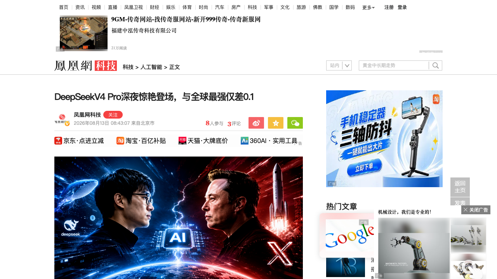
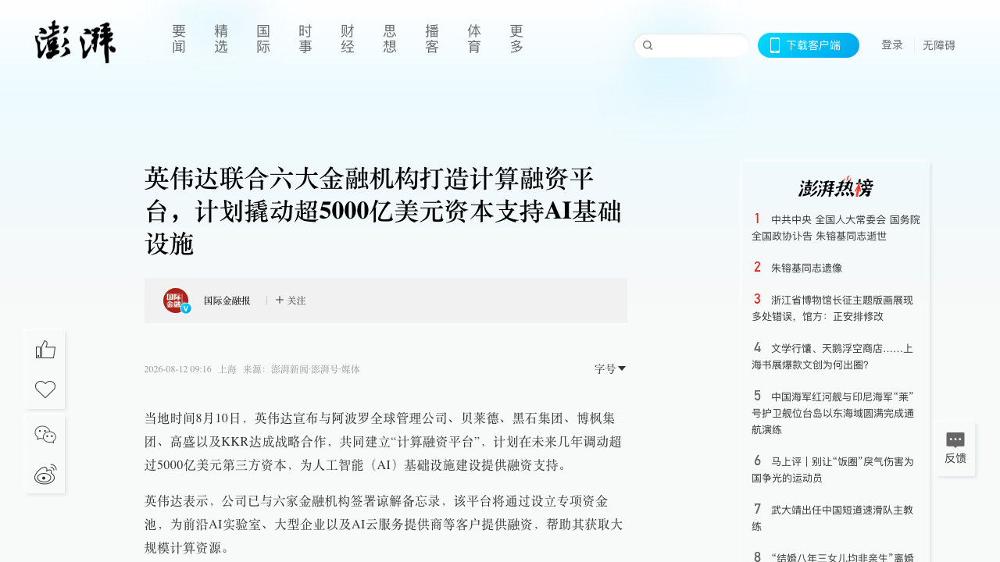
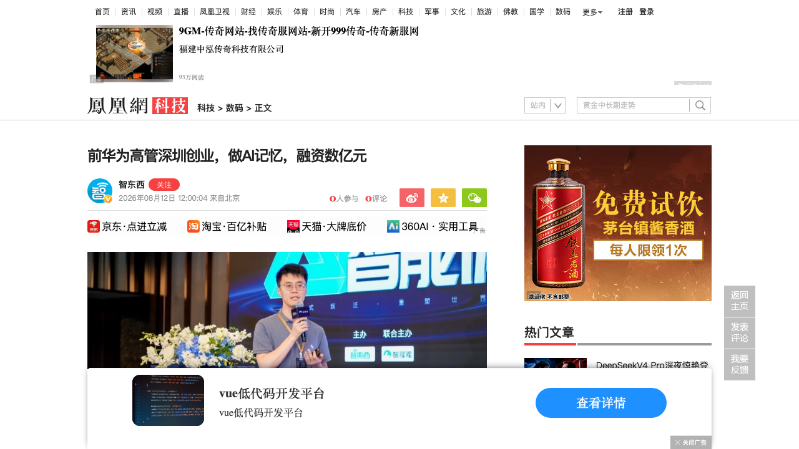
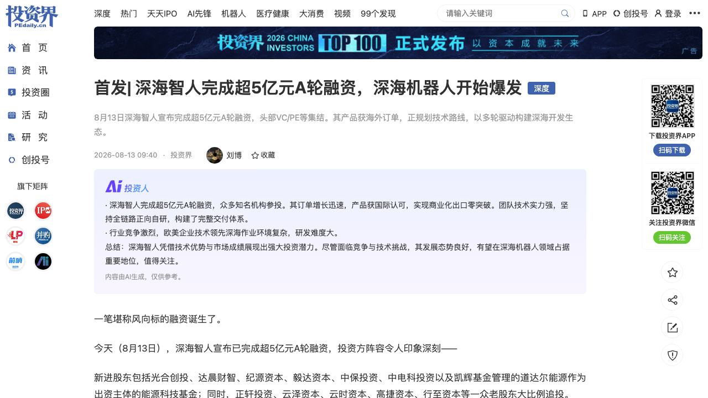
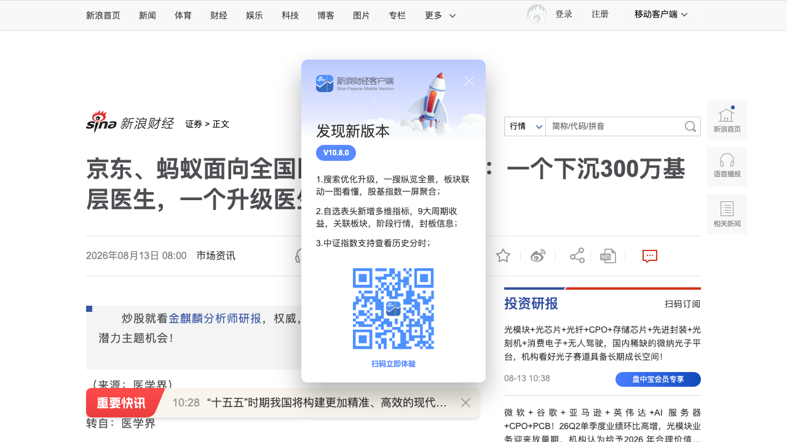

# 0813日报 | AI的「纵深」时刻：算力被华尔街金融化、Agent开始拥有记忆、机器人潜入深海、医疗AI下沉基层

## 今日洞察

今天的五个字：「**AI正在向纵深挺进。**」

**8月12-13日，五件事共同指向一条主线：AI的竞争正在从「横向扩张」转向「纵深挺进」——资本向算力加杠杆、模型向Agent能力掘进、基础设施向记忆层延伸、场景向深海与基层下沉。** 资本层面：8月10日（美东），英伟达宣布与阿波罗、贝莱德、黑石、博枫、高盛、KKR六大金融机构共建「计算融资平台」，计划撬动超5000亿美元第三方资本——「按揭买GPU」把算力做成了可证券化的金融产品，8月12-13日中媒密集报道、英伟达股价当天跌2.86%被市场消化为「算力金融化加速」。模型层面：8月13日凌晨，DeepSeek官网毫无预兆更新，V4 Pro 0813正式版上线——Terminal Bench距全球最强Fable 5仅差0.1分、DeepSWE从12.8飙到62.7（近5倍），同时首度预告API整体涨价——**中国大模型价格战出现终结信号**；几小时前马斯克SpaceXAI的Grok 4.6同日上线，「同夜撞车」。基础设施层面：8月12日，前华为诺亚方舟决策与推理实验室主任郝建业创办的MemoraX AI完成数亿元种子++轮——3个月3轮，资本开始为「Agent长期记忆」买单。场景层面：8月13日，深海智人超5亿元A轮（光合创投、达晨、纪源、毅达等头部VC集体下注深海机器人）；同一天，京东健康与蚂蚁集团同日官宣AI医生助手新动作——一个下沉300万基层医生，一个升级医生工作站，医疗AI从「能力竞赛」进入「场景深耕」。**五件事表面分散，实则同构：AI正在同时向「资本纵深、能力纵深、场景纵深」三个方向掘进，而每一层掘进都在重写创业者的生存规则。**

---

## 1. [DeepSeek V4 Pro 0813正式版凌晨上线：Agent能力5倍跃迁、距Fable 5仅差0.1分，同时首度预告API涨价——中国大模型价格战终结信号](https://tech.ifeng.com/c/8vWY82Q7HGA)（行业洞察 / 「比我强的没我便宜，比我便宜的没我强」的秩序，第一次出现松动）

🔗 链接：[爱范儿（实测）](http://k.sina.com.cn/article_5952915720_162d2490806704od2g.html) | [凤凰网科技](https://tech.ifeng.com/c/8vWY82Q7HGA) | [DeepSeek API文档](https://api-docs.deepseek.com/zh-cn/) | [新浪AI热点小时报](http://k.sina.com.cn/article_7857201856_1d45362c001906d10s.html)

**动态**：**8月13日凌晨，DeepSeek官网毫无预兆地更新，DeepSeek V4 Pro 0813正式版上线——依据惯例，API接入的 deepseek-v4-pro 自动切换为最新模型，无需手动调整。** 这是预览版发布111天后的正式版。核心数据（目前来自官方群与社区流传的跑分、官方尚未发布正式更新日志，多个信源交叉印证）：① **Terminal Bench 2.1（真实终端环境Agent任务）拿到87.9分，全球第一的Anthropic Fable 5为88.0分——差距只剩0.1**，而预览版只有72.1分，三个月跃升15.8分；② **DeepSWE（软件工程基准）从预览版12.8分飙升至62.7分，接近原来的5倍**，超过Anthropic上一代旗舰Opus 4.8的58.0分；③ AI安全智能体基准Cybergym 83.3分、以0.2分反超Fable 5的83.1；④ 工作流智能体测试AutomationBench 31.8分对29.1分胜出。技术规格：1.6万亿参数MoE、**1M（百万）Token上下文、最大输出384K Token**、支持非思考/思考双模式、**兼容OpenAI与Anthropic两种API格式**——开发者几乎不用改代码就能把Claude应用切到DeepSeek。**定价不变：输入（缓存未命中）3元/百万Token、输出6元/百万Token，是V4 Flash的三倍**——按当前汇率约0.87美元/百万输出Token，而Fable 5是50美元、GPT-5.6 Sol Max是30美元、Grok 4.6是6美元：**跑分差0.1，价格差57倍**。更值得注意的行业信号：**8月6日，DeepSeek首次在API后台预告「计划近期整体上调API服务定价，预计涨幅较大」**——这是DeepSeek第一次预告全面涨价（此前只有高峰时段局部调整）；而就在V4 Pro发布前几个小时，马斯克旗下SpaceXAI发布了Grok 4.6（GDPVal-AA v2评估1753 Elo登顶，超过Fable 5的1741）——**两款主打高性价比的模型同夜撞车**。

**做什么的**：DeepSeek V4 Pro是DeepSeek的旗舰推理模型，这次0813正式版的核心变化是**把Agent能力补到了全球第一梯队**。与传统大模型比拼知识问答和数学推理不同，Terminal Bench、DeepSWE这类测试考察的是「AI能不能真正干活」——调用工具、执行多步骤任务、编写和修改代码、在长链条中持续推进直到交付结果。爱范儿的实测印证了这种变化：把它接入Workbuddy后，从「读微信读书数据做报表」到「用模糊指令自主规划做一个新闻网站首页」再到「从一本书获得灵感做椋鸟群模拟器」，全部自主完成，还会主动调用此前存放在文件库里的设计规范Skill。**另一个「隐藏大招」：DeepSeek Harness要来了**——「DeepSeek Harness团队」公众号已于7月6日注册（认证主体为北京深度求索），8月1日内部Harness负责人崔添翼公开征集内测用户。LLM是数字员工的大脑，Harness就是它的办公系统（权限分配、工具调用、审批流程、检查结果、保存日志）——模型层补位完成后，DeepSeek的Agent系统正在从「大脑」走向「大脑+办公系统」全栈。

**为什么值得关注**：

- **「比我强的没我便宜，比我便宜的没我强」——这条秩序第一次出现松动，中国大模型价格战出现终结信号。** DeepSeek过去一年的形象是「价格屠夫」：4月V4发布时V4 Pro以2.5折上线，5月31日优惠结束后直接永久降至原价四分之一（降幅75%），6月29日又引入峰谷计费。但8月6日它首次预告整体涨价。**当最擅长打价格战的玩家开始收枪，说明行业竞争逻辑已经翻页**——摩根士丹利8月9日研报给出三个驱动：V4需求旺盛支撑定价能力、厂商要在份额与毛利之间平衡、国产芯片可能带来更高推理成本。对创业者的启示：① 你正在用的「模型红利」窗口在收窄——**应用层要尽快把成本模型从「烧token换规模」切换到「按能力付溢价」**；② 涨价不是孤例：智谱API定价较去年底上调约83%但调用量增长400%、腾讯部分模型涨幅高达463%、月之暗面Kimi K3发布48小时请求量逼近集群极限——**量价齐升说明开发者愿意为更强的模型付费，模型能力才是终极壁垒**。

- **Agent能力成为竞争新维度——「能不能干活」取代「谁更聪明」成为模型评价标准。** V4 Pro的跃升全部集中在Agent相关基准（Terminal Bench、DeepSWE、AutomationBench），传统知识问答类提升有限——这与0812日报Dyna-2的「世界-动作模型」、0811日报Meta Glimmer的「端侧Agent」同向：**2026年下半年的模型竞争，比的不是benchmark分数，而是「在长任务中稳定交付可用成果」**。对创业者的启示：① 选型模型时别再只看「聪明不聪明」，要看「在真实Agent任务里能不能干活」——Terminal Bench这类测试会成为新的采购标准；② Agent能力跃迁意味着应用层的「Agent编排」价值上升、纯「调用API」价值下降——**做Agent产品的团队要往「长任务可靠性」方向投入**。

- **57倍价差+双API兼容——开发者的一次「零成本迁移」正在冲击闭源定价体系。** V4 Pro兼容OpenAI/Anthropic API格式，粘贴Key即可在Codex、Claude Code、OpenCode等工具中当后端用；输出价0.87美元 vs Fable 5的50美元/M（57倍差距）。对创业者的启示：① **你的应用应该默认做成「模型无关」（model-agnostic）架构**——今天可以随时切DeepSeek省57倍成本，明天可以随时切更强的模型；② OpenAI/Anthropic的定价权正在被「高性价比梯队」（DeepSeek、Grok、Kimi K3）持续压缩——**订阅制AI产品的成本传导要提前设计**。

- **Harness预告——竞争从「模型层」向「框架层」迁移，Agent运行框架是下一个战场。** DeepSeek在模型能力补位后马上放出Harness信号（公众号注册+内测征集+「宇宙最强」的开发者反馈），说明它认为「模型+框架」才是完整竞争力。对创业者的启示：① 与0812日报SAFE框架（Agent事故记录）合并看：**Agent的「运行框架」层（Harness/记忆/权限/日志）正在成为基础设施级卡位点**——MemoraX（今日第3条）做记忆、DeepSeek做Harness、SAFE做事故标准，同一层的不同切面同时开闸；② 框架层的创业窗口在于「模型无关的通用Harness」——OpenAI有Codex、Anthropic有Claude Code、DeepSeek有Harness，独立框架公司要回答「凭什么不用大厂自带框架」。

- 对创业者的启发：**① 中国大模型价格战出现终结信号——模型涨价潮（DeepSeek/智谱/腾讯/月之暗面）意味着应用层「烧token换规模」的模式要重算账，模型能力才是终极壁垒；② Agent能力取代benchmark成为模型评价新维度，「能不能干活」成为采购标准；③ 双API兼容+57倍价差让「模型无关架构」成为应用层标配，迁移成本趋近于零；④ DeepSeek Harness预告宣告竞争从模型层延伸到框架层——Agent的Harness/记忆/权限/日志层是下一个基础设施卡位点。** 跟踪三个验证点：DeepSeek涨价正式落地的幅度、Harness的公开版本、V4 Pro在更多真实Agent任务中的复现。

**类比参考**：**「大模型的『提价时刻』/ 从『烧钱换规模』到『能力换溢价』——当最擅长打价格战的玩家开始收枪，中国大模型的竞争逻辑翻过了一页」**

---

## 2. [英伟达联合六大金融机构打造5000亿美元算力融资平台：算力被金融化，「按揭买GPU」时代开启](https://www.thepaper.cn/newsdetail_forward_33760751)（行业洞察 / 算力从「采购品」变成「可证券化资产」——华尔街开始给AI加杠杆）

🔗 链接：[澎湃新闻](https://www.thepaper.cn/newsdetail_forward_33760751) | [重庆晨报（专家解读）](https://www.cqcb.com/news/56/2026-08-13/6197937.html) | [快资讯（算力金融化分析）](https://www.360kuai.com/pc/959930092aec1b661) | [东方财富·环球财经](https://finance.eastmoney.com/)

**动态**：**当地时间8月10日，英伟达宣布与阿波罗全球管理公司、贝莱德、黑石集团、博枫集团、高盛、KKR六大金融机构达成战略合作，共同建立「计算融资平台」（Compute Financing Platform），计划在未来几年调动超过5000亿美元第三方资本，为AI基础设施建设提供融资支持。** 英伟达已与六家机构签署谅解备忘录：平台通过设立专项资金池，为前沿AI实验室、大型企业以及AI云服务提供商等客户提供融资，帮助其获取大规模计算资源。**黄仁勋**表示：计算能力正在成为AI产业的重要基础资源，此次合作将帮助客户获取稀缺计算资源，建设推动人工智能时代发展的「AI工厂」。**市场反应耐人寻味：消息公布当天英伟达股价收盘下跌2.86%**——市场对「英伟达把算力变成金融产品」的第一反应不是欢呼而是警惕。8月12-13日，国内媒体密集跟进报道，「算力证券化」「按揭买GPU」「AI基建加杠杆」成为解读关键词。

**做什么的**：通俗讲就是**「按揭买GPU」**——以前一家AI公司想买10亿美元的芯片，得自己掏钱、自己扛风险；现在客户可以找这个融资平台借钱买英伟达芯片，英伟达拿到全款，华尔街赚手续费和利息，投资者拿到「算力收益权」。本质上是把算力从「采购品」变成「可证券化的资产类别」：阿波罗总裁吉姆·泽尔特直言「计算资源正在成为一种关键资产类别，具备极具吸引力的投资特征」；贝莱德董事长拉里·芬克称「AI基础设施建设将需要前所未有规模的投资」。这套玩法并非英伟达首创，而是把已经跑通的模式放大：此前阿波罗和黑石已与博通达成类似协议，为包括Anthropic在内的企业融资购买博通芯片；据《华尔街日报》，英伟达正与OpenAI就数据中心项目融资谈判（约2500亿美元规模备用融资）；Meta则与贝莱德合作为其德州数据中心探索表外融资安排；过去一年债券投资者已通过数据中心相关债务交易为AI基建提供数千亿美元资金——**六大机构集体入场，只是把「点状融资」变成了「平台化、标准化、规模化」**。

**为什么值得关注**：

- **算力金融化=给AI行业加杠杆——这是2026年AI资本结构最大的变化，没有之一。** 5000亿美元第三方资本意味着：AI基建的融资方式从「企业资产负债表内自筹」转向「表外杠杆+证券化」。对创业者的启示：① **「买算力可以分期、可以融资」会改变AI公司的资本开支模型**——GPU不再是一次性吞噬现金流的重资产，而是可以租赁化、融资化的「基础设施服务」，创业公司的算力门槛（至少在账面上）被降低了；② 但杠杆是双刃剑——已有评论开始讨论「算力次贷」风险：如果AI需求增速不及预期，被证券化的算力资产会像2008年房贷一样反噬，「英伟达股价当天跌2.86%」就是市场第一时间的风险定价；③ **融资平台绑定的是英伟达生态**——客户拿融资买英伟达芯片，等于英伟达用华尔街的钱锁定了自己的需求，创业公司选云/选芯片时要想清楚自己是否在被「生态锁定」。

- **英伟达的商业模式正在从「卖芯片」升级为「卖芯片+卖金融」——卖铲人开始向卖铲人收「金融税」。** 芯片之外，英伟达正在吃掉AI产业链上「金融中介」这一层的利润：客户通过平台融资，英伟达拿到全款、华尔街赚息差、投资者拿收益权——英伟达不出一分钱本金就锁定了5000亿美元的需求。对创业者的启示：① **算力供应链的「金融化」会让GPU价格更贵还是更便宜？** 短期看融资降低了客户门槛，长期看金融化推高了算力的资产属性定价（债券投资者向英伟达贷款要求的额外收益率已翻倍）——**AI公司的算力成本曲线需要重新建模**；② 「把产品变成金融产品」是平台型公司终极变现路径（参考云计算→云金融、SaaS→SaaS资本化）——AI公司要想自己的产品有没有「可证券化」的属性。

- **「AI工厂」叙事落地：黄仁勋的AI工厂不只是比喻，现在有了金融底座。** 从算力平台（今日）、SAFE事故框架（0812日报）、「AI工厂」表述合并看：**英伟达正在系统性搭建AI时代的「工业基础设施」——计算+标准+金融三层同时下注**。对创业者的启示：① 生态卡位战的主战场是「基础设施层」，创业公司要么在英伟达生态里做「卖水人」，要么在生态外找「反英伟达」的差异化空间（国产算力、开源生态）；② 与DeepSeek涨价（今日第1条）对照：**算力成本上行+融资通道打开，AI创业的「资本-算力-模型」三角正在被巨头重新定价**——创业公司要重新算自己的「单位算力产出」经济模型。

- **中国视角：算力金融化在中国有另一条路径。** 国内智算中心建设同样在金融化（REITs、专项债、算力券），但路径不同——政策驱动+国资主导。对创业者的启示：① 国内创业公司拿算力补贴/算力券的窗口仍在，但「补贴换场景」的兑现要求越来越硬；② 国产算力（今日信号中的无问芯穹「Token价再降十倍」）与英伟达金融化是两条相反的曲线——**做国产算力生态的团队，成本叙事是差异化武器**。

- 对创业者的启发：**① 算力金融化=AI行业加杠杆——GPU从「一次性重资产」变成「可融资基础设施」，创业公司要重算资本开支模型，也要警惕「算力次贷」的系统性风险；② 英伟达从卖芯片到「卖芯片+卖金融」，平台型公司都在把产品金融化，AI创业者要想自己的产品有没有资产属性；③ 「AI工厂」有了金融底座，巨头生态卡位从计算、标准延伸到金融三层同下注；④ 国产算力与英伟达金融化是两条相反的曲线，成本叙事是差异化武器。**

**类比参考**：**「算力的『地产化』时刻 / 从『买芯片』到『按揭买算力』——当华尔街开始给AI加杠杆，算力从成本项变成了资产类别，而杠杆的另一面，永远写着风险」**

---

## 3. [MemoraX AI完成数亿元种子++轮：前华为诺亚方舟实验室主任创业做「Agent记忆」，3个月3轮融资](https://tech.ifeng.com/c/8vWjCAuj0RW)（融资 / 记忆正在成为Agent基础设施的下一张门票——「健忘症」是模型时代最大的产品缺陷）

🔗 链接：[凤凰网/智东西](https://tech.ifeng.com/c/8vWjCAuj0RW) | [新浪·华为大牛深圳创业](http://k.sina.com.cn/article_7857201856_1d45362c001906d10s.html) | [快资讯·数亿元种子++轮](https://www.360kuai.com/pc/949be3c50ea54349b) | [网易科技（种子轮报道）](https://www.163.com/tech/article/KRJJD6F000098IEO.html)

**动态**：**8月12日，据光源资本披露，AI记忆基础设施创企「深圳忆纪元科技有限公司」（MemoraX AI）宣布完成数亿元种子++轮融资，由北洋海棠基金、尚势资本、仁爱资本联合领投，光源资本担任独家财务顾问。** 这是MemoraX AI继今年4月种子轮、5月种子+轮融资后，**短时间内斩获的第3轮大额融资**——3个月3轮。本轮融资将重点投入大模型长期记忆底层核心技术攻坚，并推进B端、C端交互式产品的记忆模块标准化研发与规模化商业化落地。**创始人兼CEO郝建业**：现任天津大学智算学部教授、博导、国家优青，**前华为诺亚方舟决策与推理实验室主任、华为大模型算法实验室主任、华为医疗军团技术总裁、华为决策智能方向首席专家**；2025年11月底离开华为开始筹备创业。学术底子：哈工大本科、港中文博士、MIT-SUTD联合项目博士后，国内最早系统开展深度强化学习研究的团队之一，ICML/NeurIPS/ICLR三大顶会成果近两年全球排名前10，谷歌学术引用超15000次。

**做什么的**：MemoraX AI做的是**「大模型长期记忆」基础设施**——解决AI的「健忘症」。技术体系：以**「可学习记忆策略引擎、记忆基模、自演进Agent Harness」**为核心的Agent记忆技术体系，在文本记忆领域形成超长上下文和时序推理记忆能力突破，在多模态记忆权威榜单Mem-Gallery和ATM-Bench上取得第一，**Token消耗降低30%**。产品方向：① **面向Coding Agent的记忆产品**——让Codex、Claude Code等编程Agent持续理解项目上下文，在复杂长程任务中减少重复解释和上下文断档（对应DeepSeek V4 Pro刚补上的「长任务稳定交付」短板）；② **面向交互式娱乐场景**——上千轮次连续交互中实现动态记忆沉淀与召回，保障角色、关系与世界状态的长期稳定性与一致性（AI陪伴、互动叙事、游戏NPC）。商业进展：**已与华为云签署战略合作，成为入选华为云大模型战略合作厂商中唯一聚焦长期记忆赛道的企业**；并已与医疗健康、智能家居、智能穿戴及具身智能等领域头部客户开展合作。

**为什么值得关注**：

- **记忆正在成为Agent基础设施的下一张门票——「健忘症」是模型时代最大的产品缺陷。** 0812日报的SAFE框架要求保存Agent行为证据、今日DeepSeek预告Harness（今日第1条）、MemoraX做长期记忆——合并看：**Agent的「记忆/上下文/运行框架」层正在同时被安全标准、模型厂商、创业公司三方定义**。对创业者的启示：① 上下文窗口再大（V4 Pro已到1M）也替代不了「记忆」——窗口是临时工作台，记忆是长期档案，**「长程一致性」是Agent产品体验的分水岭**；② Coding Agent是最快落地的记忆场景（代码项目天然长程、天然需要上下文延续）——与DeepSeek Harness、Claude Code竞争的是「记忆模块」这个切面；③ AI陪伴/互动叙事是记忆的C端金矿——「上千轮交互还记得你」是情感陪伴产品的核心竞争力。

- **3个月3轮「种子++轮」——资本正在抢早期记忆赛道，顶级技术声望直接变现。** 数亿元种子++轮在种子阶段是绝对高位；投资方（北洋海棠/尚势/仁爱）虽非一线顶流，但「3轮连投」+光源资本独家FA说明项目供不应求。对创业者的启示：① **「前华为实验室主任+天大教授」的声望资产直接换来了种子轮的定价权**——与0812日报语用科技林俊旸「88%控股」合并看：顶级人才创业的融资范式在复刻；② 记忆赛道的分层：模型层（记忆基模）/中间层（记忆引擎）/应用层（记忆产品）——**中间层的「模型无关记忆引擎」可能是独立创业的最佳位置**；③ Token消耗降低30%是记忆的「降本」卖点——**在模型涨价潮（今日第1条）背景下，「记忆省token」的经济学变得更性感**。

- **华为云战略合作——「记忆」正在成为云厂商的卡位点。** MemoraX是华为云大模型战略合作厂商中唯一聚焦长期记忆的——云厂商需要「记忆层」伙伴来补齐Agent开发栈。对创业者的启示：① 大厂Agent战略合作名单（华为云、阿里云、腾讯云）是「卖水人」创业的活地图——**每个云厂商的战略合作名单里都藏着被验证的赛道**；② 医疗健康、智能家居、智能穿戴、具身智能的客户矩阵说明记忆是「跨场景通用需求」——与深海智人（具身）、京东健康（医疗）等今日新闻合并看，**记忆是贯穿所有AI场景的横切层**。

- 对创业者的启发：**① 「Agent记忆」是确定性的基础设施级机会——Coding Agent记忆（B端最快落地）、AI陪伴记忆（C端金矿）、记忆中间层（模型无关引擎）三个切面都在打开；② 顶级技术声望+稀缺方向=种子轮定价权，记忆赛道正在复刻「顶级人才创业」的融资范式；③ Token消耗降低30%让记忆在模型涨价潮下成为「降本刚需」；④ 云厂商战略合作名单是创业者的赛道活地图——记忆层已被华为云验证，其他云厂商的同类卡位会跟进。**

**类比参考**：**「Agent的『记忆』时刻 / 从『每次对话都失忆』到『可学习、可演进、低成本』——当AI开始记得住，Agent才真正成为能长期共事的同事，而不是每次都重新认识的陌生人」**

---

## 4. [深海智人完成超5亿元A轮融资：光合创投、达晨、纪源、毅达等头部VC首次集体下注，深海机器人开始爆发](https://news.pedaily.cn/202608/567638.shtml)（融资 / 具身智能从「陆地」走向「海底」——头部VC第一次集体潜入深海赛道）

🔗 链接：[投资界](https://news.pedaily.cn/202608/567638.shtml) | [钛媒体·水下机器人钱的流向与分歧](https://www.tmtpost.com/8063739.html) | [新浪·打破30年欧美垄断](https://finance.sina.com.cn/tech/roll/2026-03-19/doc-inhrnvis0950072.shtml)

**动态**：**8月13日，深海机器人公司深海智人（广州）宣布完成超5亿元A轮融资。** 新进股东包括：**光合创投、达晨财智、纪源资本、毅达资本**（四家市场化头部VC，据称均为首次在深海赛道出手）、**中保投资、中电科投资**，以及**凯辉基金管理的以道达尔能源为出资主体的能源科技基金**；老股东正轩投资、云泽资本、云时资本、高捷资本、行至资本等大比例追投。**订单数据是这轮融资最硬的部分**：截止今年7月，深海智人完成新增深海机器人整机销售合同数亿元；未来两个月已锁定待签署订单规模同样为数亿元；另有10亿规模潜在订单正在深度洽谈。公司背景：创始人马亦鸣，深海科技老兵，三年前带领深海智人从大湾区启航；公司坚持全链路正向自研，已实现商业化出口零突破、产品获国际认可。

**做什么的**：深海智人做的是**深海作业机器人**——在深海（油气开采、海底基建、海洋工程、海底电缆运维等场景）替代人类和传统设备执行作业的机器人系统。它的价值在于：深海是人类极难到达、极危险、且作业成本极高的环境（需要深潜器、饱和潜水员，单次作业成本以百万计），机器人替代的「单位价值」极高。行业判断来自「创业教父」李泽湘：**AI的下半场需要跟场景结合，即AI+硬件+场景，这是具身智能的一个边界**——从海域、陆域到空域，唯一不变的是市场落地。头部VC集体首次出手深海赛道，被投资界解读为「一级市场对行业拐点的判断」：深海机器人的B端刚需（油气、海工）让它的商业模式比陆地人形机器人清晰得多——订单先行、场景明确、客户付费意愿强。

**为什么值得关注**：

- **具身智能的「场景化」投资逻辑正在确立——深海机器人是「AI+硬件+场景」的教科书样本。** 李泽湘的「AI的下半场需要跟场景结合」正在被资本用脚投票：深海智人（深海）、诺仕机器人（丝杠供应链）、宇树科技（IPO上市）——**机器人赛道的钱正在按「场景清晰度」分层**。对创业者的启示：① 纯通用机器人叙事降温，「AI+场景」叙事升温——**创业公司要回答「你的机器人在哪干活、谁付钱、付多少」**，而不是「你的机器人多聪明」；② 深海/太空/地下等「极端环境机器人」是具身智能的差异化蓝海——场景越难，竞争越少，客户付费意愿越高；③ 订单先行（数亿元合同+10亿潜在订单）说明：**具身智能的融资正在从「技术故事融资」转向「订单融资」**——深海智人的A轮本质上是「订单+客户验证」换来的。

- **头部VC首次集体下注深海——「场景拐点」信号：一个赛道被一线资本集体重新定价的时刻。** 光合创投、达晨、纪源、毅达四家头部VC同时第一次出手深海赛道，加上中保投资（保险资金）、中电科投资（产业）、道达尔能源基金（能源产业资本）——**「市场化VC+长线资金+产业资本」的组合，是赛道从边缘走向主流的标准配置**。对创业者的启示：① 资本配置逻辑：「国家队/长线资金负责托底，产业资本负责订单，市场化VC负责定价」——**创业公司要学会按这个结构设计自己的投资人组合**；② 深海赛道的「技术壁垒+场景壁垒」双重门槛天然过滤了大部分玩家——**在门槛高的赛道，融资竞争反而小**；③ 与0810日报宇树IPO（人形机器人定价锚）、0811日报橡木果（具身本能模型）、0812日报触觉赛道合并看：**具身智能正在从「人形中心主义」走向「场景多元主义」**——触觉、深海、丝杠、医疗、家庭，每个场景都有自己的资本叙事。

- **中国深海机器人的全球机会：打破欧美30年垄断，商业化出口零突破。** 深海机器人长期被欧美（挪威、美国、法国企业）垄断，深海智人的「商业化出口零突破」+数亿元海外订单说明中国深海机器人开始进入全球市场。对创业者的启示：① **硬科技的全球化窗口：中国供应链+工程师红利在深海机器人同样成立**——与DynaRobotics「美国算法+中国供应链」（0812日报）对照，中国硬科技出海有了新的品类；② 能源转型（海上风电、深海油气、海底碳封存）是深海机器人的长期需求引擎——**关注「能源×机器人」交叉赛道**。

- 对创业者的启发：**① 具身智能进入「场景多元主义」时代——深海、医疗、家庭、制造各有资本叙事，纯通用机器人叙事降温；② 「订单融资」取代「技术故事融资」——先拿到客户验证再融资，是硬科技创业的确定性路径；③ 头部VC首次集体下注的赛道=被重新定价的赛道，深海机器人是具身智能下一个被验证的场景；④ 中国深海机器人打破欧美垄断+出口零突破——「能源×机器人」和「中国供应链×全球市场」是两个值得跟进的长期逻辑。**

**类比参考**：**「机器人的『深海』时刻 / 从『陆地工厂』到『海底作业』——当头部VC第一次集体潜入深海，具身智能的场景叙事从仰望星空，回到了脚下（海底）的硬需求」**

---

## 5. [京东健康×蚂蚁同日官宣AI医生助手：一个下沉300万基层医生，一个升级医生工作站——医疗AI从能力竞赛走向场景深耕](https://finance.sina.com.cn/stock/stockzmt/2026-08-13/doc-inincnux3525995.shtml)（新产品 / 「AI+供应链」闭环成为医疗AI新壁垒：资源越稀缺的地方，AI的边际价值越大）

🔗 链接：[新浪财经/医学界](https://finance.sina.com.cn/stock/stockzmt/2026-08-13/doc-inincnux3525995.shtml) | [医学界](https://www.yxj.org.cn/)

**动态**：**8月12日，京东健康与蚂蚁集团同日公布各自在AI医生助手领域的最新进展，两条路径形成鲜明对照：** ① **蚂蚁集团**把「好大夫医生版」升级为「**阿福医生版**」——整合在线问诊、患者管理和科研辅助功能，打造面向医生群体的**AI工作站**（向上深化存量医生群体的服务效率）；② **京东健康**宣布把已运营半年的AI医生助手「**京东知医**」全面接入第三方基层医疗平台**云鹊医APP**（国内覆盖基层医生规模最大的平台之一，已连接全国300万注册基层医生），同步开放辅诊工具与医药供应链能力，在基层搭建「**AI辅诊+基层医生+医药供应链**」的服务链条（向下延伸至资源更薄弱的基层市场）。**京东知医的存量数据**：已累计服务超百万医生、辅助诊疗决策超2000万次。**这次升级的具体内容**：① 深度思考模式——针对多病共存、多重用药、疑难会诊等复杂场景，先拆解临床问题、规划检索路径、对多来源证据分级评估与交叉验证（整合超5000万份医学文献、临床指南和权威期刊资源，超16万种药品说明书，已接入覆盖29个癌种的中国抗癌协会CACA指南）；② 医学计算器整合——200余项常用工具（CHA2DS2-VASc、eGFR、CURB-65等）集中部署+AI循证解读；③ 科研助手（首次）——文献综述、科普患教、讲课汇报，选题分析结合基金热点与文献空白提供评分及研究路线；④ 药品履约——AI辅助诊疗后接入京东健康医药供应链（县域当日达、次日达覆盖率87.1%，基层慢病购药用户三年增长超113%）。

**做什么的**：京东知医做的是**「基层医疗AI助手」**——针对基层医疗「知识、工具、药品」三个连锁缺口逐一填补：知识层面（权威指南下沉，过去要在三甲图书馆/付费数据库才能查的CACA指南，现在乡镇卫生院即时可调）、工具层面（医学计算器+循证解读，替代基层医生的手工计算）、药品层面（AI诊疗之后接入供应链履约，解决基层「药不全」问题）。核心判断来自行业共识：**基层医疗机构承担了全国超一半的诊疗量，但每万人口全科医生仅4.54人、53.8%的居民反映基层「药不全」**；三甲医院里AI是「效率优化器」（资源充裕，AI让重复劳动更快），基层场景里AI是「能力填充器」（专业资源稀缺，AI的边际效益被放大）——**一款在三甲只是「锦上添花」的AI工具，落到基层可能「雪中送炭」**。

**为什么值得关注**：

- **医疗AI的竞争维度从「谁的回答更准」扩展到「谁的服务链条更长」——「AI+供应链」闭环成为新壁垒。** 京东健康区别于纯AI工具的核心差异点是医药供应链：AI辅助诊疗之后能直接连到药品履约（县域当日达/次日达87.1%）。对创业者的启示：① **垂直行业AI的终局竞争是「AI+交付」**——只做「回答准确」的AI工具会被「AI+供应链」的玩家降维打击；② 基层医疗的「AI+供应链」模式可以复制到其他下沉市场（宠物医疗、县域金融、乡村教育）——**「能力填充器」逻辑适用于所有资源稀缺场景**；③ 渠道是下沉的关键：京东选择云鹊医（300万基层医生）解决「最后一公里」触达——**AI应用团队要思考自己的「云鹊医」在哪**。

- **医疗AI从「能力竞赛」走向「场景深耕」——大厂同一天的两条路径是AI应用商业化的经典分叉。** 蚂蚁阿福（向上：医生工作站，深化存量医生效率）+京东知医（向下：基层市场，增量市场）——**同一个产品逻辑，两个方向，都是正确的**。对创业者的启示：① 「向上做深」和「向下铺量」是AI应用商业化的两条标准路径——**关键是你的资源禀赋适合哪条**（蚂蚁有医生资源存量，京东有供应链+物流增量）；② 医疗AI的「下沉」信号与政策（分级诊疗、基层医疗建设）共振——**跟随政策红利的AI场景（基层医疗、县域金融、乡村教育）值得系统扫描**；③ 「一个向上深化、一个向下延伸」说明医疗AI的竞争从「模型能力」进入「商业化路径设计」阶段——**纯模型能力不再是差异化，路径选择才是**。

- **「深度思考+证据分级+可追溯」——医疗AI从「对话式问答」进入「循证工作流」时代。** 京东知医的深度思考模式（拆解问题→规划检索→证据分级→交叉验证→风险权衡）和200余项医学计算器+AI循证解读，把AI从「聊天医生」变成了「循证工具链」。对创业者的启示：① 高监管行业（医疗、金融、法律）的AI产品，「过程可追溯」比「答案正确」更重要——**与0812日报SAFE框架的「证据链」逻辑同构**；② 「医学计算器+循证解读」这类「工具+AI解释」组合是高监管行业AI的标准产品形态——**「AI给结论，规则给依据」是合规AI的产品配方**；③ 科研助手（综述/选题/职称）说明AI正在切入医生的职业发展刚需——**「工作流+职业发展」双轮驱动是垂直AI的订阅逻辑**。

- 对创业者的启发：**① 医疗AI进入「场景深耕」阶段，竞争维度从「回答谁更准」变成「服务链条谁更长」——AI+供应链闭环是终局壁垒；② 「向上做深/向下铺量」是AI应用商业化的两条标准路径，按资源禀赋选边；③ 高监管行业的AI产品要按「循证工作流」设计（过程可追溯>答案正确），「工具+AI解释」是合规产品配方；④ 政策红利场景（基层医疗、县域金融、乡村教育）值得系统扫描——资源越稀缺，AI的边际价值越大。**

**类比参考**：**「医疗AI的『下沉』时刻 / 从『三甲效率优化器』到『基层能力填充器』——当AI开始补基层医疗的知识、工具、药品三块短板，AI的价值从锦上添花变成了雪中送炭」**

---

## 值得重点跟踪的 3 个信号

1. **灵巧手产业链上游爆发：丝杠/执行器正在复制「灵巧手」的资本叙事——「上游卖铲人」确定性高于本体。** 8月13日，诺仕机器人完成近亿元A+轮融资（顺为资本领投、望千铭诚跟投），做微型行星滚柱丝杠——已实现全球最小行星滚柱丝杠量产，产能供不应求，目标年底前提升至1000万根；创始人徐杨判断「丝杠将是线性关节最终解」，并观察到：灵巧手公司数量翻倍、技术路线迅速分化，传动需求已从手延伸到手腕、小臂、甚至颈部与面部（颈部自由度要求从1-2个升至4-6个，服务人脸微表情精细控制）。**对创业者的建议：① 具身供应链（丝杠、减速器、触觉传感器、电机）正在复制2024-2025年「灵巧手」的资本叙事——「卖铲人」的确定性高于本体，且正从「手」向上游关节/执行器延伸；② 注意「执行器智能化」交叉机会——诺仕在迭代「智能化」执行器，AI+传动是下一波；③ 关注灵巧手寿命痛点（2025年多数灵巧手仅约200小时寿命）——「可靠性」是供应链公司的差异化武器。**

2. **高性价比模型对垒白热化：Grok 4.6与DeepSeek V4 Pro「同夜撞车」——中间层闭源模型的定价权被两头挤压。** 8月13日凌晨DeepSeek V4 Pro上线前几小时，马斯克旗下SpaceXAI发布Grok 4.6，在面向真实知识工作的GDPVal-AA v2评估中以1753 Elo登顶（超过Fable 5的1741和GPT-5.6 Sol Max的1728）；定价Grok 4.6输出6美元/百万Token vs Fable 5的50美元——与DeepSeek的0.87美元形成「高性价比双雄」。**对创业者的建议：① 开源/高性价比梯队（DeepSeek、Grok、Kimi K3）正在把「性能-价格」比卷到新高度，OpenAI/Anthropic的定价权持续承压——应用层选型的成本红利窗口还在，但要盯紧DeepSeek涨价落地后的价格曲线；② 「模型无关架构」是应对模型价格波动的唯一保险；③ 两巨头同日发模型说明前沿竞赛进入「月度甚至周度」节奏——创业公司做产品时不要把能力押在单一模型版本上。**

3. **宇树上市后的机器人融资环境：投资人从「讲故事」转向「问场景」——「复制宇树路线」的门槛大幅抬高。** 8月13日，地瓜机器人「地心引力Demo Day」闭门路演上，10个机器人项目（萝博派对、朗极智能、前华为天才少年周顺波的欧拉万象等）登台，但现场投资人态度「矜持」——高瓴创投刘佳伟点评「很多项目确实感觉做不到，客户是谁、横向潜在市场有多大这些问题无法避免」；当创业者都在讲「先卖给极客、让开发者生态帮忙找场景」时，有投资人反问：「当所有人都在找场景，场景到底是什么？」。背景：宇树科技IPO在即（黄牛收购价已涨至每股410元），「先卖给技术极客+开源生态找场景」的宇树路线成为创业者模板，但宇树当年的门槛对后来者已高太多。**对创业者的建议：① 机器人创业融资逻辑正从「技术叙事」转向「商业闭环验证」——先回答客户是谁、市场多大、怎么赚钱，再谈技术；② 「开发者/极客第一批用户」路线仍然成立，但要证明「极客市场→大众市场」的转化路径（小米战投杨暄的辩护是参照）；③ 家庭/具身新场景（欧拉万象计划2026年12月向早期用户家庭投放样机、明年服务1000个极客家庭）是下一个观察窗口——家庭场景能否跑通，决定「宇树路线」的升级版是否成立。**

---

*统计信息：收录 5 个产品/动态 | 融资总额 超5亿元A轮（深海智人）+ 数亿元种子++轮（MemoraX AI）+ 近亿元A+轮（诺仕机器人，列入信号）| 覆盖赛道：开源大模型Agent能力与定价策略、算力金融化/证券化、Agent记忆基础设施、深海机器人、医疗AI下沉基层*
