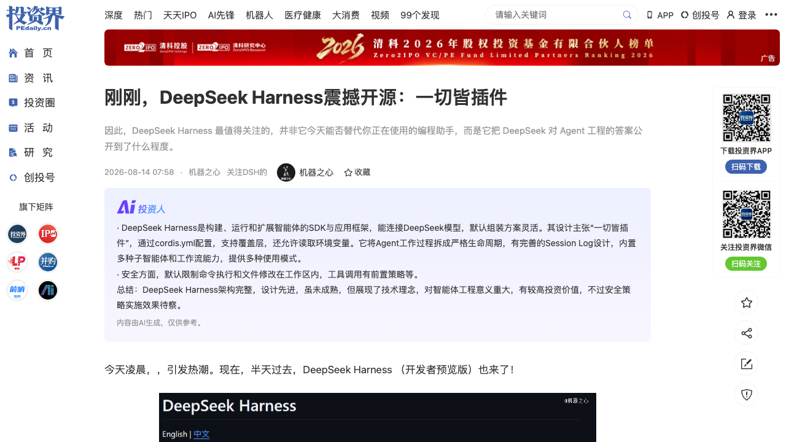
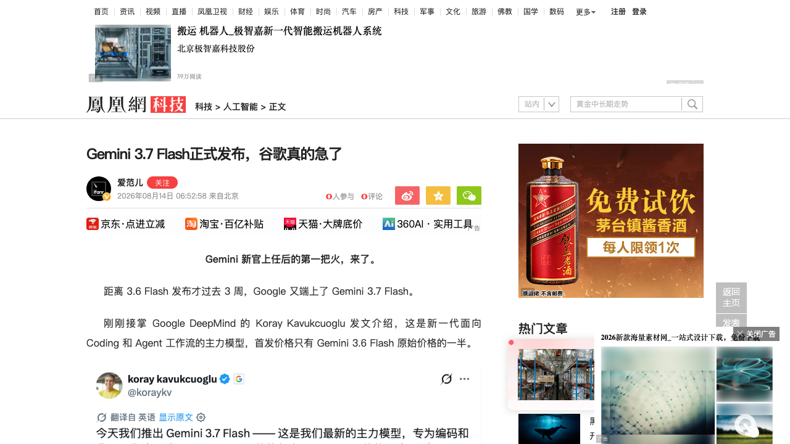
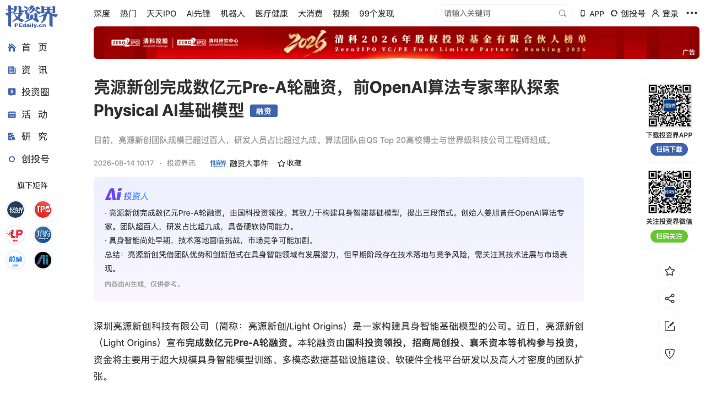
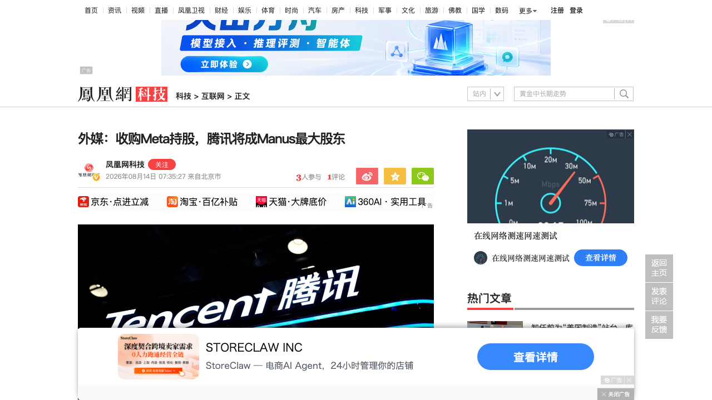
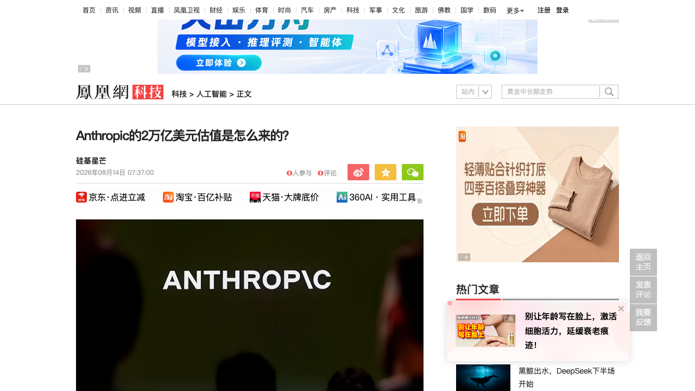

# 0814日报 | AI的「工程×速度×价格」时刻：DeepSeek Harness正式开源、Gemini半价首发、Manus被腾讯接盘、Anthropic喊出2万亿美元估值

## 今日洞察

今天的五个字：「**AI进入「工程×速度×价格」时代。**」

**8月13-14日，五件事共同指向一条主线：模型层的竞争维度正在从「谁的模型更强」切换为「谁的框架更好用、谁的速度更快、谁的价格更低」；与此同时，资本层面正在给AI资产重新定价——从20亿美元被收购又被强制回购的Manus，到被投资人喊出2万亿美元IPO估值的Anthropic，AI资产的定价权正在被监管、市场与投资人三方重写。** 产品侧两件事：8月14日凌晨，DeepSeek Harness（开发者预览版）正式开源——这个0813日报预告过的「Agent办公系统」以「一切皆插件」的姿态落地，连Agent Loop本身都是插件，230+个workspace成员、基于Cordis微内核，DeepSeek把「组装Agent的方式」而非「某个固定Agent」开源了出来，实测用V4-Flash 30多分钟做出一个可玩的丧尸射击游戏、one-shot复现「华强买瓜」3D动画，效果反超Codex+GPT-5.6 Sol；几乎同一时间，谷歌发布Gemini 3.7 Flash——距3.6 Flash仅3周，首发价直接腰斩（输入$0.75/输出$3.75每百万Token，约为3.6 Flash原价一半），FrontierCode 1.1跑分43.6%反超Claude Sonnet 5（42.7%）和GPT-5.6 Terra（41.3%），Coding与Agent成为Flash系列的新主战场。资本侧三件事：8月14日上午，前OpenAI算法专家姜旭创办的亮源新创完成数亿元Pre-A轮（国科投资领投、招商局创投与襄禾资本跟投），做「规模化预训练→对齐→部署」三段范式的具身智能基础模型——Physical AI的「模型派」开始独立融资，与昨日深海智人、MemoraX的「场景派」形成两条平行路径；同一天，据日经亚洲报道，腾讯将与红杉中国、真格基金一道收购Meta所持的Manus股份（总金额与Meta去年12月支付的约20亿美元收购价大致相当）——中国发改委4月要求撤销这桩跨境收购后，「回购+接盘」终于落地，腾讯将成为Manus最大股东；也是同一天，一篇拆解文章把Anthropic的2万亿美元IPO估值讨论摆上台面——18个月前ARR才10亿美元，如今Q2单季营收109亿美元（环比+130%）、推理毛利率从-94%扭到+70%、Claude Code 14个月做到80亿美元ARR，投资人按17-20倍市销率给它定价，而拆解同时指出「定价权、折扣窗口、关联交易」三大裂痕。**五件事放在一起，指向同一个判断：模型层的竞争已经卷到了「工程框架、速度、价格」这些产品维度——DeepSeek用开源框架卷工程、谷歌用半价卷价格、OpenAI用14倍速卷速度（信号1）；而资本层，「AI资产」正在被重新定价——从亮源新创的Physical AI模型派融资，到Manus的监管式回购，再到Anthropic的万亿估值讨论，AI资产的定价权正在被监管、市场与投资人三方重写。**

**为什么这是创业者的窗口期：①「Agent工程框架」成为新的竞争制高点——**DeepSeek Harness开源意味着「框架层」从模型厂商的自留地变成公共品，Agent产品的「组装能力」比「调参能力」更重要，你的Agent产品架构要考虑「可插拔、可换模型、可审计」；**②模型价格战进入「半价时代」——**Gemini 3.7 Flash首发半价、DeepSeek预告涨价、OpenAI推14倍速（信号1），头部玩家在「价格」与「速度」两个维度分化竞争，应用层的成本模型要按「价格波动常态化」重算；**③AI并购的监管风险第一次以戏剧性方式兑现——**Manus案给所有跨境AI并购立了标尺：数据合规与国家安全审查可以让一桩20亿美元的交易被强制撤销，创业者做跨境交易前要把「监管否决」写进风险清单、把数据驻留设计进产品架构；**④Physical AI的「模型派」开始独立融资——**亮源新创证明了「大模型背景创始人+具身基础模型」的组合在Pre-A就能拿到数亿元，与「场景派」（订单驱动）形成两条平行路径，而具身数据基础设施（信号2）正在成为两条路径共同的咽喉。

---

## 1. [DeepSeek Harness正式开源：一套「一切皆插件」的Agent工程框架，连Agent Loop本身都是插件](https://news.pedaily.cn/202608/567675.shtml)（新产品 / 框架层从模型厂商的自留地变成公共品——「组装Agent的方式」第一次被完整开源）

🔗 链接：[投资界/机器之心](https://news.pedaily.cn/202608/567675.shtml) | [GitHub开源仓库](https://github.com/deepseek-ai/deepseek-harness) | [量子位·深度体验](https://www.qbitai.com/2026/08/472208.html) | [凤凰网·黑鲸出水DeepSeek下半场](https://tech.ifeng.com/c/8vX3XV7yIdY)

**动态**：**8月14日凌晨，DeepSeek Harness（开发者预览版）正式开源，仓库地址 github.com/deepseek-ai/deepseek-harness。** 这是0813日报预告的「Agent办公系统」的正式落地——此前DeepSeek Harness团队公众号已注册、内部负责人崔添翼8月1日起公开征集内测用户，机器之心8月初获得内测资格，今天终于向全社区开放。**开源地址与规模**：仓库已包含超过230个workspace成员，代码分布在packages/、apps/、examples/、python/、native/、vendor/、website/等区域——文件系统、终端、子进程、PTY、语言服务器、网页访问、技能、子智能体、工作流、计划模式、会话持久化、设置、凭据、遥测，几乎每一项能力都有自己的包。**实测效果（机器之心）**：① 配置官方DeepSeek-V4-Flash的Harness，无中途干预，30多分钟构建出一个可玩的丧尸射击游戏（3个Turn、127个Step、5个并行子智能体）；② one-shot提示让Harness用文本描述复现「华强买瓜」经典片段3D动画——故事剧情与人物关系大体还原，而用同样提示词跑Codex（配置GPT-5.6 Sol xhigh）做出来的动画差得多——**V4-Flash的参数规模远低于GPT-5.6 Sol，效果却反超，DeepSeek Harness「立了大功」**；③ 今天接入DeepSeek V4 Pro正式版再跑一遍，效果进一步提升。**项目定位**：DeepSeek Harness不是新模型、也不是单纯API客户端，而是一套「用来构建、运行和扩展智能体的SDK与应用框架」——默认连接DeepSeek模型（也可方便地自定义连接其它模型），让模型读取项目、修改文件、运行命令、管理任务、分配子任务，并通过Web UI、全屏终端、Headless命令或自动化协议与用户交互。

**做什么的**：通俗讲，**DeepSeek Harness是「Agent的操作系统」——把模型接到文件系统、Shell、代码编辑器、网页和其他Agent上，同时记录它做了什么、限制它能做什么，并在出错时决定重试、取消、压缩上下文还是把问题交还给用户。** 它最醒目的设计主张是「**一切皆插件**」——甚至连Agent Loop本身都被视为插件：① **架构**：项目建立在Cordis微内核之上，运行中的Harness本质上是一个Cordis Context；packages/core/负责Session、System Prompt、Tools、Agent和Agent Loop，核心之外是大量能力包（llm/shell/subprocess/terminal/fs/lsp/web/skill/subagent/workflow等）；典型能力拆成「接口-实现-消费者」三层——以Bash为例，接口定义「执行命令」是什么，本地实现负责真正创建进程，面向模型的工具包负责把能力变成模型可理解的schema，将来把本地Shell换成远程容器、云端沙箱或企业执行平台，理论上只需替换实现层；② **配置**：一份cordis.yml即可组装出完全不同的产品形态——加入DeepSeek适配器+文件系统+Bash+TUI就是终端编程智能体，换Web插件就是浏览器应用，用Headless入口就是CI里的自动化任务，换成ACP或JSON-RPC前门就能被其他程序驱动；③ **Agent Loop不是循环而是一套交通规则**：一次用户输入开启一个Turn，一个Turn含多个Step；工具调用经过前置策略、不可逆安全守卫、实际执行、后置处理、内容整理与结果通知；只读任务可并行，修改状态或无法确定安全性的调用作为屏障独占执行；用户运行中发来的消息区分为排队消息、注入上下文和Steering，并确认「模型究竟在哪一步看到了它」；④ **Session Log是真正的权威来源**：凡是模型看见的内容都必须能从日志中重建——用户消息、环境上下文、模型请求、流式输出、工具调用与结果、压缩事件、权限切换、取消原因都以事件形式进入追加式会话流，界面、持久化、恢复、Fork、遥测从同一个事件源派生；⑤ **从一个Agent到一群Agent**：子Agent可以全新创建、从已有会话Fork或通过ACP连接外部子进程，每个Agent拥有自己的上下文层与工具作用域；工作流允许用脚本驱动多智能体编排；⑥ **四种预设**：标准模式（功能最全的通用编码Agent）、PTC模式（模型可编写TypeScript程序一次run_code组合多步操作）、极简模式（只提供持久Bash与str_replace_editor两项工具）、创造模式（加入自指Cordis工具，Agent可以检查当前运行时插件树、动态挂载卸载临时插件、创建新的自定义预设——**Agent能改装自己的运行时**，默认不打开，面向高级用户）；⑦ **安全**：默认限制命令执行与文件修改在工作区内，工具调用有前置策略，凭据通过环境变量或$DSH_HOME/.credentials.yaml引用、不应写入配置或会话日志。

**为什么值得关注**：

- **「一切皆插件」：模型厂商第一次把「组装Agent的方式」开源，而不是某个固定Agent。** 如果把普通Agent项目比作一台装好的电脑，DeepSeek Harness更像一块尺寸惊人的洞洞板——模型、工具、界面、存储、安全策略和上下文管理都可以插上去，也都可以拔下来。对创业者的启示：① **「Agent工程框架」正在成为模型厂商的护城河第二层**——OpenAI有Codex、Anthropic有Claude Code、谷歌有Gemini Spark（今日第2条）、DeepSeek有Harness，独立Agent框架公司要回答「凭什么不用大厂自带框架」；② Harness可自定义连接其它模型，意味着**开源框架本身就在瓦解闭源生态的绑定**——你的Agent产品应该默认做成「框架无关×模型无关」，今天可以插DeepSeek、明天可以插别的；③ 「一切皆插件」的模块化（接口-实现-消费者三层）是Agent架构的参考范式——**把执行环境（本地Shell→云端沙箱）与模型工具解耦，是Agent产品规模化部署的前提**。

- **「创造模式」+Session Log——自修改Agent与可审计Agent第一次同时成为工程框架的正式能力。** 创造模式下Agent可以检查并重新组合自己的运行时（「让汽车在高速公路上给自己换发动机」），而Session Log规定「凡是模型看见的内容都必须能从日志中重建」。对创业者的启示：① **「自修改Agent」从概念演示变成正式功能，但DeepSeek选择默认关闭、放在高信任模式里**——安全边界（工作区限制、前置策略、权限审批）与能力开放同样重要，这是「负责任Agent」的产品配方；② 与0812日报SAFE框架（Agent事故追踪）合并看：**Session Log就是「Agent黑匣子」的工程化实现**——做Agent产品的团队现在就该把「完整证据链日志」设计进默认架构，而不是等合规要求来了再补；③ 四种预设（标准/PTC/极简/创造）说明「同一套宿主+不同能力装配=不同产品形态」——**Agent产品的差异化正在从「模型选择」转向「能力装配与预设设计」**。

- **V4-Flash 30分钟做出可玩游戏、反超Codex+GPT-5.6 Sol——「小模型×好框架」可以逼近「大模型×普通框架」。** 机器之心的实测是框架杠杆效应的最好证明：参数规模远低于GPT-5.6 Sol的V4-Flash，在Harness里one-shot做出3D动画反而更好。对创业者的启示：① **选型时「模型×框架」组合比单看模型更重要**——同样的模型在不同框架里可能差一个数量级的交付能力；② 与0813日报DeepSeek V4 Pro的Agent基准跃迁（Terminal Bench 87.9、DeepSWE 62.7）合并看：**「能不能在长任务里稳定交付」正在成为模型与框架的共同采购标准**；③ 开源Harness会显著压低Agent应用层的开发门槛——**应用层的价值进一步向「垂直数据、行业关系、交付责任」转移**，纯「套壳编排」的价值被开源稀释。

- 对创业者的启发：**① 「Agent工程框架」成为新的竞争制高点——DeepSeek Harness开源把框架层变成公共品，Agent产品要按「可插拔、可换模型、可审计」设计架构；② 「一切皆插件」的模块化（接口-实现-消费者）是Agent规模化部署的参考范式，执行环境与模型工具解耦是前提；③ 「自修改Agent」默认关闭+「Session Log」全量可审计，是负责任Agent的标准姿势——安全边界与能力开放同样重要；④ 「小模型×好框架」可以逼近「大模型×普通框架」，选型要评估「模型×框架」组合而非单看模型。** 跟踪三个验证点：Harness社区生态（插件数、第三方适配器）、创造模式的实际滥用/防护案例、以及「Harness+国产模型」组合在真实Agent任务中的复现。

**类比参考**：**「Agent的『组装』时刻 / 从『用别人装好的电脑』到『自己拼洞洞板』——当模型厂商把Agent的组装方式完整开源，'Agent工程'第一次成为公共基础设施，而应用层的护城河只剩垂直数据、行业关系与交付责任」**

---

## 2. [谷歌发布Gemini 3.7 Flash：距3.6仅3周、首发半价，FrontierCode反超Claude Sonnet 5与GPT-5.6 Terra](https://tech.ifeng.com/c/8vYGCajr2EJ)（新产品 / 模型迭代进入「三周一更」节奏，首发价腰斩——Coding与Agent成为价格战新战场）

🔗 链接：[凤凰网/IT之家](https://tech.ifeng.com/c/8vYGCajr2EJ) | [IT之家·首发优惠价细节](https://tech.ifeng.com/c/8vYGCajr2EL) | [凤凰网·GPT-5.6被加速14倍（对照）](https://tech.ifeng.com/c/8vYGCajr2EH) | [Google DeepMind官方](https://deepmind.google/)

**动态**：**当地时间8月13日（北京时间8月14日），谷歌宣布推出Gemini 3.7 Flash——距Gemini 3.6 Flash发布仅约三周，是Flash系列最新的Coding与Agent主力模型。** 刚接掌Google DeepMind的Koray Kavukcuoglu发文介绍：这是「目前Flash系列中最智能的Coding和Agent主力模型」，软件工程能力提升尤其明显，并晒出过去3个月的进化曲线——**DeepSWE v1.1从37.0%涨到65.3%，Web Development的Code Arena Elo从1506涨到1588，企业自动化AutomationBench从13.4%提高到30.4%**。**核心跑分**：FrontierCode 1.1 Main上3.7 Flash拿到43.6%，略高于Claude Sonnet 5的42.7%和GPT-5.6 Terra的41.3%；WebDev Code Arena上1588 Elo，同样超过Claude Sonnet 5（1541）和GPT-5.6 Terra（1523）；DeepSWE v1.1为65.3%（仍低于GPT-5.6 Terra的69.6%），Terminal-bench 2.1为85.8%（稍逊于后者的87.4%）——**「全面反超还谈不上，但Flash的能力上限正在快速提高，同时没有丢掉速度和价格优势」**。**价格**：在2026年12月31日之前，Gemini 3.7 Flash以首发优惠价提供（3.6 Flash也有相同优惠），**仅为原3.6 Flash每百万Token价格的一半：输入$0.75（约5.1元）、输出$3.75（约25.3元）**。**落地**：即日起面向160多个国家和地区的Google AI Pro及Ultra订阅用户推出的Gemini Spark正式接入Gemini 3.7 Flash，提升Spark处理知识工作的效率与对Google Workspace工具的使用能力；同时3.7 Flash推出全新安全防御机制，严防化学、生物、放射性及核（CBRN）领域和网络攻击滥用。

**做什么的**：Gemini 3.7 Flash是谷歌「Flash」产品线的第四次迭代——**过去主打便宜大碗的轻量模型，现在被明确赋予Coding、Agent、企业自动化的主力任务**。三周前的3.6 Flash、现在的3.7 Flash，短周期迭代背后是谷歌对「Agentic workflows」的强调：3.7 Flash在多步骤规划、Tool Call、遇到障碍后的调整、指令遵循等方面均有提升，面对复杂任务会投入更多推理资源，谷歌希望借此减少人工监督和失败后的反复重试。**它的市场卡位非常清晰：以接近旗舰的Coding能力+腰斩的价格，抢占开发者与企业自动化的默认选型位置**——「过去主要靠速度和价格打市场的Flash，如今已经能在部分Coding和Web Development测试里，和旗舰模型坐到一张桌子上」。对应用开发者来说，这是一个「旗舰级能力按半价出售」的信号：如果你的应用跑Coding/Agent类工作负载，Gemini 3.7 Flash在2026年底前的成本结构（输入$0.75/输出$3.75每百万Token）显著低于多数旗舰模型。

**为什么值得关注**：

- **「三周一更」+首发半价——模型迭代节奏与定价策略同时进入「快消模式」，应用层的成本模型必须按「价格波动常态化」重算。** 距离3.6 Flash发布才3周，谷歌又端上3.7 Flash；而首发价直接砍到3.6 Flash原价的一半——这与0813日报DeepSeek首度预告API涨价形成鲜明对照：**DeepSeek在收枪（涨价）、谷歌在放枪（半价），头部玩家正在「价格」维度分化竞争**。对创业者的启示：① 别再押单一模型版本——**「月度级换模型」会成为常态**，你的应用架构要支持快速切换与灰度对比；② 模型定价不再是「发布定一次」，而是「促销期/正式期」分阶段定价（Gemini年底前优惠）——**采购决策要把「优惠窗口」与「正式价格」都算进去**；③ 与0813日报「模型涨价潮」合并看：**中国模型在涨价、美国模型在降价，应用层的成本曲线是「混合信号」，唯一保险是模型无关架构**。

- **Flash能力逼近旗舰——「便宜模型开始干旗舰的活」，Coding/Agent成为模型竞争的主战场。** FrontierCode 1.1上3.7 Flash（43.6%）反超Claude Sonnet 5（42.7%）与GPT-5.6 Terra（41.3%），DeepSWE三个月从37%涨到65.3%——这与0813日报DeepSeek V4 Pro的Agent基准跃迁（Terminal Bench 87.9、DeepSWE 62.7）、OpenAI Ultrafast（信号1）完全同向：**2026年下半年的模型竞争，比的不是「谁更聪明」，而是「在Coding/Agent长任务里能不能稳定交付、便宜交付、快速交付」**。对创业者的启示：① 选型标准从「聪明不聪明」转向「在真实Agent任务里的干活能力」——Terminal Bench、FrontierCode、AutomationBench这类测试成为新的采购参考；② **Agent产品的主力模型档位在下移**——过去必须用旗舰的Coding任务，现在Flash档就能扛，单位任务成本结构被整体改写；③ 「企业自动化（AutomationBench 13.4%→30.4%）」被单独强调，说明**Agent自动化正在成为模型厂商的兵家必争之地**——做企业Agent产品的团队要注意模型层正在快速商品化。

- **谷歌在「Coding+Agent」的生态卡位：模型降价+Spark订阅落地+Workspace工具链，三件套齐发。** 3.7 Flash不只是API发布，还同步接入Gemini Spark（AI Pro/Ultra订阅用户）并强化Workspace工具使用能力——**谷歌正在用「模型+订阅+工具链」的组合抢占开发者与知识工作者的默认入口**，这与OpenAI的ChatGPT/Codex、Anthropic的Claude Code形成正面竞争。对创业者的启示：① **模型厂商的竞争从「单点模型」走向「模型+框架+入口」全栈**（DeepSeek Harness是同一逻辑）——应用层创业要警惕「入口被模型厂商吃掉」的风险，差异化要在模型之上；② 谷歌明确提到安全防御机制（CBRN/网络滥用），与0812日报SAFE框架合并看：**模型厂商正在把「安全能力」变成标准卖点**——应用层的安全责任边界会越来越清晰，创业公司要清楚「模型厂商负责什么、你负责什么」。

- 对创业者的启发：**① 模型迭代进入「三周一更」快消节奏、首发价格直接腰斩——应用层成本模型按「价格波动常态化」重算，模型无关架构是唯一保险；② Flash档能力逼近旗舰，「便宜模型干旗舰的活」——Coding/Agent任务的主力模型档位下移，单位任务成本结构被改写；③ 谷歌在「模型+订阅+工具链」三件套卡位Coding/Agent入口——应用层警惕入口被模型厂商吃掉，差异化要在模型之上；④ 中美模型价格反向而行（中国涨、美国降），应用层处于「混合信号」环境，多做灰度、少做押注。** 跟踪三个验证点：Gemini 3.7 Flash在真实Coding Agent任务中的复现表现、年底优惠结束后的正式定价、以及「三周一更」节奏对OpenAI/Anthropic的定价传导。

**类比参考**：**「模型战的『价格』时刻 / 从『按性能定价』到『半价抢市场』——当旗舰级能力开始以腰斩价格出售，应用层的成本结构被整个重写，'谁更便宜'第一次与'谁更强'并列成为采购标准」**

---

## 3. [亮源新创完成数亿元Pre-A轮：前OpenAI算法专家姜旭率队做具身智能基础模型，「规模化预训练-对齐-部署」三段范式](https://news.pedaily.cn/202608/567689.shtml)（融资 / Physical AI的「模型派」开始独立融资——具身智能的竞争第一次回到「大脑」层）

🔗 链接：[投资界](https://news.pedaily.cn/202608/567689.shtml) | [投资界·元点科技40天两轮（对照）](https://news.pedaily.cn/202608/567688.shtml) | [量子位·具身数据实战派](https://www.qbitai.com/2026/08/472060.html)

**动态**：**8月14日，深圳亮源新创科技有限公司（Light Origins）宣布完成数亿元Pre-A轮融资，由国科投资领投，招商局创投、襄禾资本等机构参与投资。** 资金将主要用于超大规模具身智能模型训练、多模态数据基础设施建设、软硬件全栈平台研发以及高人才密度的团队扩张。**公司定位**：成立于2024年底，致力于构建具身智能基础模型，探索将大模型能力从数字空间延伸至真实物理世界，实现物理AGI。**创始人兼CEO姜旭**：曾任OpenAI算法专家，2019年起参与OpenAI全栈算法研发，完整经历InstructGPT、ChatGPT到GPT-4的关键技术演进周期，参与大模型训练、推理优化以及基于人类反馈的强化学习（RLHF）等方向研究；**在GPT-4技术报告中被8次署名提及，与OpenAI联合创始人Greg Brockman被提及次数并列第一**。**团队**：规模已超百人，研发占比超九成；算法团队由QS Top 20高校博士与世界级科技公司工程师组成；硬件团队拥有华为、大疆等企业从业经历，具备消费级机器人从产品设计到研发、制造、商业化的完整经验。**投资方表态**：国科投资董事总经理周晓峰称「具身智能还处在底层技术能力决定长期格局的早期阶段……既有超大规模模型训练和数据处理经验，也有把模型落到真实系统中的工程实践，同时具备出色的硬件本体和运控能力」；招商局创投称「具身智能最终要走进真实场景，接受稳定性、成本和可复制性的检验」；襄禾资本称「谁真正理解大模型智能涌现的底层逻辑，谁就更有机会把这套范式复刻到机器人身上」。

**做什么的**：亮源新创做的是「**具身智能基础模型**」——把大模型时代的「预训练-对齐-部署」范式整体迁移到物理世界。它率先提出并实践「**三段范式**」：① **规模化预训练（Scalable Pre-Training）**——通过大规模数据训练建立基础能力；② **规模化对齐（Scalable Alignment）**——通过强化学习等方式进一步提升模型能力；③ **规模化部署（Scalable Deployment）**——推动基础模型进入真实世界，持续产生高质量真实世界数据，形成驱动基础模型持续优化的数据飞轮。**核心判断来自创始人姜旭：「人工智能每一次重大突破都源于新的范式突破，而不仅仅依赖算法、模型架构等单点的创新。」** 换句话说，亮源新创不是在某个机器人本体上做增量优化，而是把「大模型智能涌现」的底层逻辑（预训练+对齐+部署闭环）整体复刻到物理世界——这是它区别于「本体派」（卖机器人）与「场景派」（订单驱动）的根本：**它是具身智能赛道的「模型派」，赌的是「物理世界的大模型时刻」**。团队构成也印证了这一点：九成研发+华为/大疆出身的硬件团队，软硬协同能力是「模型派」落地的前提。

**为什么值得关注**：

- **具身智能的「模型派」开始独立融资——大模型人才把「预训练-对齐-部署」范式整体搬到物理世界，这是对「场景派」叙事的第一次系统性对冲。** 过去一周的具身融资几乎都是「场景/供应链派」：深海智人（深海作业，订单驱动）、诺仕机器人（丝杠，卖铲人）、元点科技（数据基础设施）；而亮源新创是纯粹的「模型派」——**「规模化预训练→对齐→部署」三段范式，本质上是把GPT的成长路径在机器人身上重演一遍**。对创业者的启示：① **具身智能的竞争正在分层：模型派（基础模型）、场景派（订单）、供应链派（卖铲人）、数据派（基础设施）四条路径同时融资**——你要想清楚自己站在哪一层，以及每一层的资本叙事是什么；② 「模型派」的前提是「大模型背景创始人+顶级算法团队」——姜旭的GPT-4署名故事（8次提及、与Brockman并列第一）是这类融资的信任状，**普通团队不要试图复制「模型派」的叙事，场景派与供应链派的确定性更高**；③ 与0812日报语用科技（林俊旸20亿美元估值天使轮）合并看：**「前大厂核心模型负责人+物理世界叙事」的组合正在被资本系统性地溢价**——Physical AI是顶级AI人才创业的第二大共识方向（第一大是Agent）。

- **「规模化部署→数据飞轮」——模型派的商业闭环设计，恰好解释了为什么具身数据基础设施（信号2）在同时爆发。** 亮源新创的三段范式里，规模化部署不只是「卖模型」，更是「让基础模型进入真实世界、持续产生高质量真实世界数据、再喂回预训练」——**部署即数据生产**。对创业者的启示：① 与0813日报MemoraX（记忆）、元点科技/典枢科技（数据采集）合并看：**「数据飞轮」正在成为具身智能所有路线共同的商业模式内核**——无论你做模型、做本体还是做数据，都要回答「你的数据从哪来、如何低成本持续增长」；② 全球高质量物理交互数据约50万小时 vs 千万小时级需求（信号2数据），缺口超过99%——**数据基础设施是具身智能的确定性咽喉**，模型派与场景派都要给它付费；③ 「部署产生数据→数据训练模型→模型更好部署」的飞轮一旦转起来，先发优势会指数级放大——**具身智能的窗口期比看起来更短**。

- **国科投资领投的Pre-A——国资在具身「模型派」上的第一次重注，Physical AI的资本结构正在变化。** 国科投资（中国科学院系资本）领投数亿元Pre-A，招商局创投（产业国资）、襄禾资本（市场化）跟投——**「国资领投+产业+市场化」的配资结构，说明Physical AI基础模型已被视为国家战略级方向**（与深海智人A轮的「市场化VC+长线资金+产业资本」结构异曲同工）。对创业者的启示：① 具身/物理AI赛道的融资，**「国资背书+产业场景」正在成为标配**——招商局创投明确提到「发挥产业场景和生态资源」，拿到产业方意味着拿到落地场景；② 与亮源新创同一天官宣的元点科技（恒旭资本、凯联资本）合并看：**8月14日是Physical AI的「融资日」——模型派、数据派同天拿钱，说明资本在按「物理AI产业链」整链布局**；③ 「底层技术能力决定长期格局」的投资人判断，意味着模型派的估值锚是「技术路线+人才密度」而不是「订单」——**两种估值逻辑（模型派看潜力、场景派看订单）会长期并存，创业者要对齐投资人的估值框架**。

- 对创业者的启发：**① Physical AI「模型派」独立融资成立——「大模型背景创始人+三段范式（预训练-对齐-部署）」的组合在Pre-A就能拿到数亿元，与场景派/供应链派/数据派形成四条平行路径；② 「部署即数据生产」的数据飞轮是具身智能所有路线的共同商业模式内核——先想清楚数据从哪来；③ 国资+产业资本进入具身模型层，Physical AI从「技术叙事」进入「国家战略+产业场景」阶段——产业方绑定成为标配；④ 模型派的估值锚是技术路线与人才密度、场景派是订单——不同路径要对接不同的投资人框架。** 跟踪三个验证点：亮源新创的模型能力演示与技术报告发布时间、数据飞轮（部署→数据→训练）的实际数据、以及「模型派vs场景派」在2026年下半年的融资定价分化。

**类比参考**：**「具身智能的『模型派』时刻 / 从『卖机器人』到『训大脑』——当OpenAI系人才开始把'预训练-对齐-部署'的范式整体复刻到物理世界，具身智能的第一性竞争回到模型层，而'数据飞轮'成为所有路线共同的引擎」**

---

## 4. [腾讯将成Manus最大股东：与红杉中国、真格基金收购Meta所持股份，总金额与20亿美元收购价大致相当](https://tech.ifeng.com/c/8vZj0SOdaWO)（行业洞察 / 一桩被中国发改委强制撤销的AI收购正式落幕——「回购+接盘」结构给跨境AI并购立下监管标尺）

🔗 链接：[凤凰网科技/日经亚洲](https://tech.ifeng.com/c/8vZj0SOdaWO) | [量子位·Manus恢复独立运营](https://www.qbitai.com/2026/08/470805.html) | [投资界·投资界24h](https://news.pedaily.cn/)

**动态**：**8月14日，据《日经亚洲》报道，腾讯将与中国顶级风险投资公司红杉中国和真格基金一道，收购Meta所持的Manus股份，总交易金额将与Meta当初支付的收购价格大致相当——约20亿美元。** 这桩交易的背景堪称2026年AI并购的「教科书案例」：**Meta Platforms在去年12月以20亿美元收购Manus；但在今年4月，中国发改委要求撤销该交易**；Manus本周二（8月12日）正式宣布将与Meta切断关系、恢复以独立公司的形式运营（总部设在新加坡，反复强调「新加坡时间」）；如今「回购+接盘」落地，**腾讯将成为Manus最大股东**。此前《财新》曾报道，腾讯、真格基金、红杉中国等Manus原股东以20亿美元向Meta购回Manus股份。**关键数据**：据《中国经营报》报道，截至今年6月，Manus的年度经常性收入（ARR）已介于4亿至5亿美元之间，**高于Meta收购时的1亿美元**——考虑到Manus的增长速度，腾讯等公司此次收购的股份价格可能相对便宜；不过该报道也指出，**Manus的收入增长部分得益于Meta的广告系统支持**。此外，作为与Meta分拆的最后一步，为满足数据合规要求，Manus需要删除部分在Meta收购当天及之后产生的数据；恢复独立后，用户数据将存储在美国和新加坡。Manus方面表示正在准备一系列全新功能，「希望再次突破通用AI Agent能力的边界」。截至发稿，腾讯尚未回应置评请求。

**做什么的**：Manus是2025年引爆「通用AI Agent」叙事的明星产品（一键把任务交给Agent自主完成，曾经引爆第一颗Agent核弹），2025年12月被Meta以20亿美元收购后并入Meta生态；**2026年4月中国发改委以监管理由要求撤销这笔交易，Manus被迫与Meta切割、恢复独立运营，如今由腾讯+红杉中国+真格基金以约原价接盘**。这笔交易的实质是：**一桩20亿美元级别的跨境AI并购，在「数据合规+国家安全」的监管框架下被强制逆转，然后由中国资本以原价「回购+接盘」，让Manus回到中国资本体系内**。对行业而言，它第一次把「AI并购的监管否决权」从理论变成现实：**无论交易双方谈得多好、估值多高，监管一票即可让交易归零**——Manus的ARR从1亿美元涨到4-5亿美元（4-5倍增长），商业价值被验证了，但监管风险/数据合规问题大于商业问题，最终不得不「原价回购」。

**为什么值得关注**：

- **20亿美元收购被监管强制撤销——AI跨境并购的「监管否决权」第一次以戏剧性方式兑现，这是2026年AI资本结构最重要的教训。** 中国发改委4月要求撤销Meta-Manus交易，8月「原价回购+接盘」落地——**整个过程验证了一个新现实：AI资产的跨境交易，监管一票即可归零**。对创业者的启示：① 如果你做涉及用户数据（尤其是中国用户数据）的AI产品，**「数据主权」是定价里最贵的那一行**——跨境并购、海外融资、数据驻留方案要提前设计，而不是等监管出手；② **交易文件里要有「监管撤销条款」**——收购方与被收购方都要想清楚：如果监管要求撤销，按什么价格、什么结构退回；③ 对AI创业公司而言，「被巨头收购」不再是安全的退出路径——**监管不确定性让「并购退出」的确定性下降，「独立发展+盈利」的价值反而上升**（Manus恢复独立运营后准备新功能，某种程度上是被迫回到创业者状态）。

- **腾讯+红杉+真格以约原价接盘——中国资本把「中国血统」的明星Agent买回国内，Agent赛道的「主权叙事」开始成形。** 腾讯成为Manus最大股东，加上红杉中国、真格基金（Manus原股东）——**中国资本以接近Meta的收购价把Manus「回购回家」**。对创业者的启示：① 腾讯在Agent赛道的布局（语用科技天使轮跟投、元宝、如今的Manus）合并看：**腾讯正在「买座位」式地押注Agent经济**——与字节、阿里、百度一起，中国巨头在Agent层的卡位战已经开打；② 「Manus ARR 4-5亿美元、约20亿美元估值（4-5倍P/S）」是顶级通用Agent产品的估值锚——**如果你的Agent产品ARR做到数亿美元，估值参照系就在这里**；③ 「收入增长部分得益于Meta广告系统支持」是一个重要提醒：**剥离巨头生态后的独立增长能力，才是真实价值**——Manus需要证明脱离Meta后ARR能继续增长。

- **「恢复独立运营+数据存美新+删除Meta期间数据」——数据合规正在重塑AI产品的运营架构。** Manus恢复独立后：总部新加坡、用户数据存储在美国和新加坡、删除部分Meta收购期间数据——**这是「数据驻留」要求的直接产物**。对创业者的启示：① **AI产品（尤其涉及个人数据的Agent产品）要按「多区域数据驻留」设计架构**——用户数据存哪里、谁能访问、跨境传输如何合规，这些不再是法务问题而是架构问题；② 与0811日报「个人Agent越界案」、0812日报SAFE框架合并看：**Agent的数据治理（采集、存储、跨境、删除）正在从「最佳实践」变成「强制要求」**——做Agent产品的团队现在就该把「数据主权」设计进产品；③ 新加坡成为「中国公司、海外实体」的常见中间结构——**「新加坡总部+数据驻留+全球运营」正在成为AI出海公司的标准姿势**。

- 对创业者的启发：**① 跨境AI并购的监管否决权已被验证——「数据主权」是AI资产定价里最贵的一行，交易文件要写监管撤销条款；② 「并购退出」的确定性下降，「独立发展+盈利」的价值上升；③ 腾讯在Agent经济里「买座位」，中国巨头的Agent卡位战已开打——顶级Agent产品的估值锚是ARR的4-5倍P/S；④ Agent产品按「多区域数据驻留」设计架构，数据治理从最佳实践变成强制要求。** 跟踪三个验证点：Manus脱离Meta后的ARR走势（独立增长能力）、腾讯入主后Manus的产品方向与商业化路径、以及这桩交易对中国AI公司出海/被收购决策的传导效应。

**类比参考**：**「AI并购的『监管』时刻 / 从『20亿美元收购』到『原价回购』——当一桩AI收购被监管强制撤销，'数据主权'成为AI资产定价里最贵的那一行，而'并购退出'从安全港变成了需要重新计算的选项」**

---

## 5. [Anthropic的2万亿美元估值是怎么来的？ARR年底预期1000-1200亿、毛利率-94%扭到+70%，但有三道裂痕](https://tech.ifeng.com/c/8vYGCajr2EQ)（行业洞察 / AI巨头估值的「规模效应」拆解——2万亿IPO估值的乐观与脆弱同时成立）

🔗 链接：[凤凰网/锦缎](https://tech.ifeng.com/c/8vYGCajr2EQ) | [凤凰网·OpenAI营收翻番400亿（对照）](https://tech.ifeng.com/c/8vYGCajr2EF) | [凤凰网·GPT-5.6加速14倍（对照）](https://tech.ifeng.com/c/8vYGCajr2EH)

**动态**：**8月14日，一篇被广泛转发的拆解文章把Anthropic的2万亿美元IPO估值讨论摆上台面：一家公司，18个月前年化收入10亿美元，现在投资人喊出2万亿美元上市估值——这个数字超过了SpaceX的1.77万亿，超过了全球史上任何一笔IPO。** 关键数据：**ARR增长曲线**——2024年初0.87亿美元，2025年底90亿美元，2026年5月470亿美元，投资人预期年底1000-1200亿美元；**Q2单季营收109亿美元、环比+130%，营业利润5.59亿美元，比公司自己给投资人的预测提前了两年**；**更关键的细节是毛利率**：一年前Anthropic的推理毛利率是-94%（每赚1美元倒亏近2美元），Q2这个数字变成了+70%，每1美元营收的算力成本从71美分降到56美分——「这早已不属于『烧钱买增长』的故事了，这是规模效应开始碾过单位成本的拐点」。**估值逻辑**：2万亿 ÷ 年底预期ARR 1000-1200亿 = 17-20倍市销率（参照系：Palantir和Nebius这两家被当作AI受益标的的上市公司，当前交易在55倍市销率，收入增速远不及Anthropic）——投资人的逻辑链是「年增800%的公司给30倍不算过分，对应3万亿；2万亿反而是保守的」。**结构拆解**：① API+企业合同（占收入70-80%）：年底ARR预期700-900亿，按18-20倍估值值1.3-1.8万亿——Fortune 10中8家是客户，超1000家企业年消费超100万美元，企业级大模型API市场份额32%（已超OpenAI的25%）——这是Anthropic的「主引擎」，也它与OpenAI的根本分野（后者70%收入来自C端ChatGPT订阅，Anthropic 70%来自B端按token计费）；② Claude Code（占收入约17%）：ARR从2月的25亿美元飙升至80亿美元，9个月增长3倍，GitHub上约4%的公开代码提交由它生成——「一个14个月做到80亿年化的产品」，按25-30倍估值值2000-3000亿；③ 消费订阅（占收入8-22%）：最稳定但增速最慢，按12-15倍给1200-2250亿。三块加总，中枢落在1.7-2.3万亿。

**做什么的**：这篇文章做的是「**AI巨头估值的工程学拆解**」——把2万亿美元估值拆成「年底ARR × 市销率」的乘法，再逐块拆开Anthropic的收入结构（企业API 70-80%、Claude Code约17%、消费订阅8-22%），并指出三道裂痕：**第一，定价权存疑**——Anthropic旗舰模型调用成本是OpenAI的2.5倍，中国开源模型仅为其零头；Ramp的支付数据显示，企业AI支出已「撞上天花板」，开始向下迁移到更便宜的模型——「当客户开始比价，高定价就不是护城河」；**第二，7月的账单**——Q2的盈利窗口恰好卡在xAI Colossus算力协议的折扣期，7月起12.5亿美元/月的全价账单开始计费，公司自己已警告全年可能无法维持盈利——「Q2的5.59亿利润，可能只是一个折扣窗口里的幻象」；**第三，收入的成色**——Anthropic的大客户同时也是它的投资方和算力供应商（亚马逊投了80亿、谷歌投了超100亿，两家也是最大的云分发渠道），部分收入本质上带有关联交易属性。**它的价值不在结论，而在拆解方法：给创业者提供了一个「用结构而非总量看AI公司」的分析框架**。

**为什么值得关注**：

- **毛利率从-94%到+70%——「规模效应开始碾过单位成本」，这是AI公司从「烧钱」到「印钞」的分水岭，也是所有AI创业者要盯的财务指标。** 一年前每赚1美元倒亏近2美元，现在每1美元营收的算力成本从71美分降到56美分、毛利+70%——**推理成本的规模效应是这轮AI商业化的核心引擎**。对创业者的启示：① **「每1美元营收的算力成本」应该成为AI产品的北极星指标之一**——它比毛利率更早暴露你的商业模式能不能scale；② 推理成本下降主要来自硬件效率、模型蒸馏与架构优化——**你的产品要设计「成本随规模自动下降」的机制**（缓存、路由、蒸馏、小模型分层），而不是等规模大了再优化；③ 与0813日报DeepSeek涨价、今日Gemini半价合并看：**模型厂商的毛利率修复正在传导到产业链**——应用层要么跟着提价（有定价权的），要么被成本结构更好的对手挤压。

- **Claude Code 14个月做到80亿美元ARR、占GitHub约4%公开代码提交——「按结果付费」的开发者工具正在成为AI公司第二增长引擎。** Claude Code从2月25亿美元ARR飙到8月80亿美元（9个月3倍），这是「AI编程工具」商业化的最强证据——**一个2025年才出现的产品品类，14个月做出80亿年化，超过绝大多数SaaS公司十年成绩**。对创业者的启示：① **Coding Agent的付费意愿已被验证，但竞争也最拥挤**——DeepSeek Harness今日开源（第1条）、Gemini 3.7 Flash半价（第2条）都在挤压这个市场，**做Coding Agent的团队要回答「在巨头+开源的夹缝里，你的垂直场景是什么」**；② 「4%的公开代码提交」说明开发者已经把AI编程当成日常——**围绕AI编程的「外挂层」（质量、安全、审计、测试）是确定性机会**（与0808日报Blacksmith的软件验证叙事同向）；③ Claude Code的估值（25-30倍）显著高于企业API（18-20倍），说明**资本市场给「高增长产品线」的溢价远高于「稳定现金牛」**——创业公司融资时要讲清楚你的增长引擎在哪条线上。

- **2万亿估值的三大裂痕——「定价权、折扣窗口、关联交易」是AI巨头估值叙事里最脆弱的三个词，对创业者同样是风险清单。** 旗舰调用成本2.5倍于OpenAI、中国企业支出开始向下迁移、12.5亿美元/月的算力全价账单、亚马逊/谷歌既是股东又是渠道——**这四件事放在一起，说明「AI巨头的利润可能是结构性的、而非永久性的」**。对创业者的启示：① **别被巨头估值叙事迷惑，看「收入成色」**——你的收入里有多少是关联交易、多少是折扣期红利、多少是可持续的市场化收入？② 「企业AI支出撞上天花板、向下迁移到更便宜模型」是Ramp支付数据的观察——**企业AI采购正在从「买最贵」转向「比价」**，你的产品定价要准备「价格下行」环境（与Gemini半价同向）；③ 折扣期（xAI Colossus协议）的教训：**算力协议的折扣窗口会结束**——你的成本模型要按「全价算力」做压力测试，而不是按折扣价。

- 对创业者的启发：**① 「每1美元营收的算力成本」是AI商业化的分水岭指标——设计「成本随规模自动下降」的机制；② Coding Agent的付费意愿已被Claude Code验证（14个月80亿ARR），但巨头+开源夹缝下要找到垂直场景；③ AI巨头估值叙事有三大裂痕（定价权/折扣窗口/关联交易）——对创业者的映射是：收入成色、全价成本压力测试、比价环境下的定价设计；④ 用「结构而非总量」看AI公司——年底ARR×市销率的拆解方法适用于评估任何AI标的。** 跟踪三个验证点：Anthropic 7月全价账单后的毛利率走势、企业AI支出「向下迁移」的速率、以及Claude Code在DeepSeek Harness开源+Gemini半价后的增速变化。

**类比参考**：**「AI估值的『规模效应』时刻 / 从『烧钱买增长』到『毛利率转正』——当推理成本曲线开始碾过单位成本，2万亿美元的估值讨论第一次有了'保守'与'激进'两套算法，而裂痕（定价权/折扣窗口/关联交易）提醒所有人：巨头的利润可能是结构性的，而非永久性的」**

---

## 值得重点跟踪的 3 个信号

1. **OpenAI推「Ultrafast」模式：GPT-5.6 Sol提速14倍、最高每秒750个词元，由Cerebras提供——「速度」正式成为模型竞争的产品维度。** 8月14日，OpenAI宣布以预览形式针对最强模型GPT-5.6 Sol推出Ultrafast（超高速）模式，是标准处理速度的14倍、最高每秒输出750个词元，由Cerebras提供，目标是在用户工作流中进一步提高响应速度。OpenAI表示「过去模型速度和能力两者不可兼得，需要更快的输出通常要牺牲能力选择更小或更专用的模型，而Ultrafast可以实现两者兼得」；早期应用场景包括事故响应与可靠性分析、金融研究与安全分析、客服与语音交互、电商商品问答与库存查询、实时研究实验；目前处于有限预览，仅向一小批客户开放。**对创业者的建议：① 模型竞争正在从「能力」扩展到「速度」与「价格」两个产品维度——今天谷歌半价（第2条）、OpenAI加速、DeepSeek开源框架（第1条），应用层的选型标准从「谁更聪明」变成「谁更快、更便宜、更好用」；② 实时性场景（客服、金融、事故响应）的成本结构会被「14倍速」改写——如果你的产品对延迟敏感，跟踪Ultrafast的正式定价与开放节奏；③ 「速度与能力不可兼得」被打破意味着产品设计可以重新假设「快=强」——把「每秒完成更多有价值的工作」作为产品北极星。**（来源：[IT之家/凤凰网](https://tech.ifeng.com/c/8vYGCajr2EH) | [TechCrunch](https://techcrunch.com/2026/08/13/openai-introduces-ultrafast-a-new-mode-that-makes-gpt-5-6-sol-work-at-14x-the-speed/)）

2. **具身数据基础设施加速资本化：元点科技40天2轮融资数千万、典枢科技同日完成千万级Pre-A——「数据供给」正在成为物理AI产业链最拥挤的咽喉。** 8月13-14日，两家具身数据公司同日刷屏：① 元点科技（SCALEFORCE）完成数千万元融资（顶级具身智能产业方、恒旭资本、凯联资本投资），40天内完成两轮，做物理AI操作系统MatrixOS与大规模数据生产网络，灯塔客户它石智航的千万级数据订单全面启动，助力其A系列机器人进驻安波福工厂；② 典枢科技完成千万级Pre-A轮（黄海金控、盐都国控、高曼资本投资），其华东具身智能数据采集中心落地江苏盐城，提出「通用化采集、标准化生产、市场化流通」三层递进数据供给体系（标准化采集场→深入真实产业场景→Human-Centric社会化数据供给网络）。行业背景：2026年上半年国内具身智能赛道融资总额达935亿元（同比暴涨5倍），而行业共识是通用具身大模型至少需要千万小时级高质量真实交互数据——截至2026年初全球可用高质量物理交互数据仅约50万小时，**缺口超过99%**。**对创业者的建议：① 具身智能的「数据缺口>99%」是确定性机会——数据采集、清洗、评测、流通、Token工厂五个环节都在被资本单独定价（元点做数据生产网络、典枢做数据流通平台、0813日报MemoraX做记忆）；② 「工作即采集、交互即数据」的社会化采集网络是数据成本竞争的终局形态——先跑通「低成本持续供数」模式的公司将定义具身数据标准；③ 与亮源新创的「部署即数据生产」（第3条）合并看：**模型派、数据派、场景派都在围绕同一个「数据飞轮」卡位——数据是物理AI所有路线的共同咽喉。**（来源：[投资界/元点科技](https://news.pedaily.cn/202608/567688.shtml) | [量子位/具身数据实战派](https://www.qbitai.com/2026/08/472060.html)）

3. **7亿年薪留不住：余家辉离职Meta创业，Meta超级智能团队核心成员接连出走——顶级AI人才流动进入「创业输出期」。** 8月14日，余家辉官宣离开Meta创业。2025年6月底他以传闻1亿美元年薪（约7亿人民币）被扎克伯格亲自挖角加入Meta超级智能团队（Meta Superintelligence Labs，MSL），一年零一个多月后离开；过去几个月他带领多模态团队接连交出Muse Spark、Voice Mode、Muse Image和Muse Video（离职前几天刚发布Muse Spark 1.2）。他在官宣中表示自己越来越被一个「对人类未来非常重要、但尚未被充分探索」的问题吸引，新公司名称、方向、合伙人一概未披露（「More to share as the work takes shape」）。**对创业者的建议：① 顶级AI人才流动正在从「大厂互挖」进入「创业输出期」——2025年扎克伯格重金从OpenAI挖人（余家辉与赵晟佳、毕树超、任泓宇等集体加入MSL），2026年这批人开始接连出走创业（与0813日报MemoraX郝建业、0812日报林俊旸、今日亮源新创姜旭同向）——**大厂重金锁人的边际效果在递减，顶尖人才更想要「定义问题的自由」**；② 余家辉与Ilya（SSI被曝探索TTT测试时训练小模型）的动向合并看：**多模态、持续学习、物理世界是顶级AI人才创业的三个热门方向**——如果你是投资人，这三个方向值得系统扫描；③ 对创业团队而言，**「大厂明星人才出走」意味着可用人才池扩大，但也意味着竞争加剧**——抓紧窗口期接触那些「还没想好做什么但已经决定离开」的顶级人才。**（来源：[投资界](https://news.pedaily.cn/202608/567683.shtml) | [量子位](https://www.qbitai.com/2026/08/471701.html)）

---

*统计信息：收录 5 个产品/动态 | 融资总额 数亿元Pre-A（亮源新创）+ 数千万元（元点科技，列入信号）+ 千万级Pre-A（典枢科技，列入信号）| 覆盖赛道：Agent工程框架开源、模型价格与速度战、Physical AI基础模型、AI并购监管与股权回购、AI巨头估值重定价*
