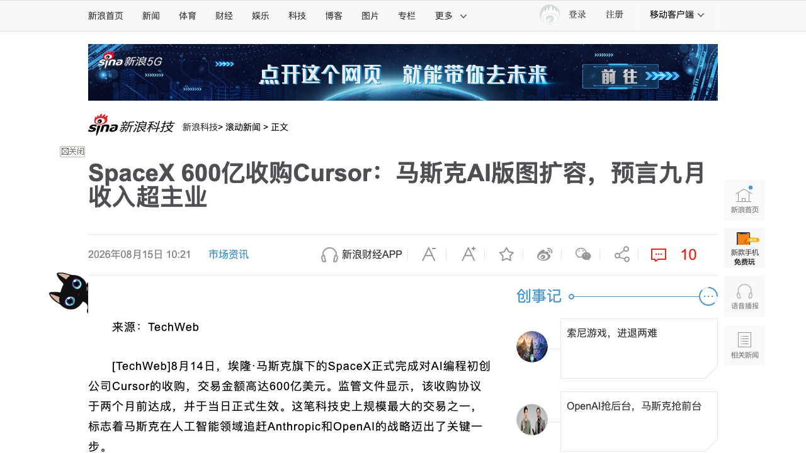
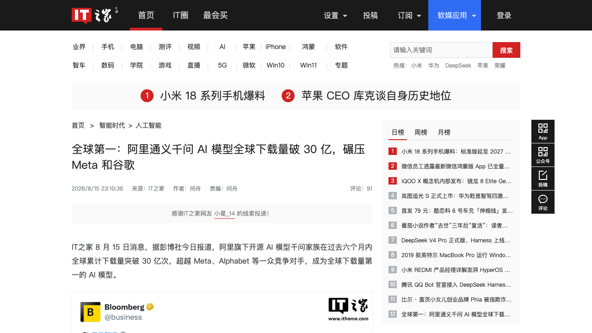
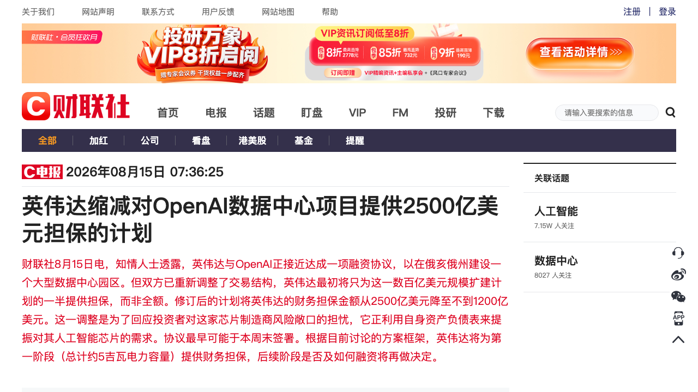
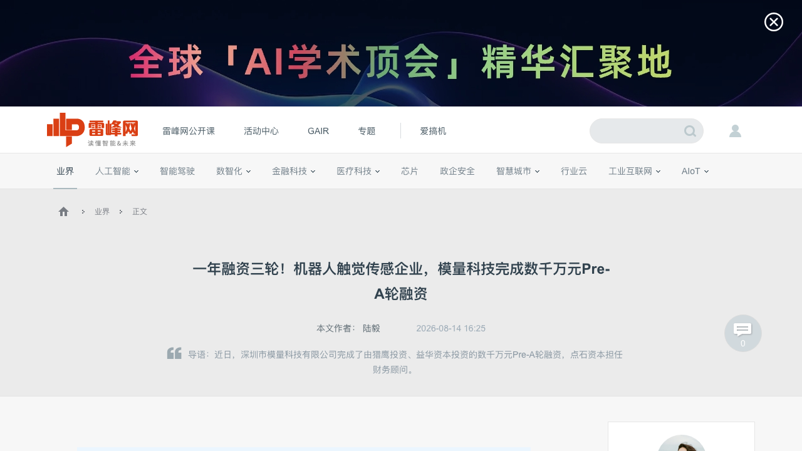
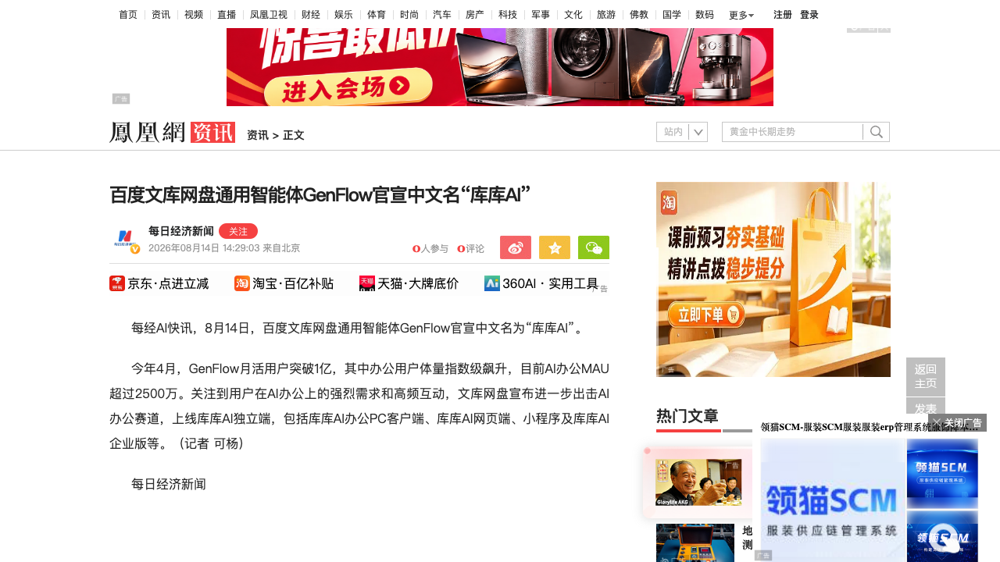

# 0816日报 | AI的「并购×开源×算力金融」时刻：SpaceX 600亿美元正式吞下Cursor、千问开源登顶全球下载30亿、算力金融化出现中美双轨

## 今日洞察

今天的五个字：「**AI进入并购与开源的整合时刻。**」

**8月14-16日，五件事共同指向一条主线：AI的竞争正在从「谁的模型更强」切换到「谁在整合、谁在开源、谁在给算力定价」——并购在加速（SpaceX 600亿美元正式完成对Cursor的收购，史上最大创业公司收购），开源在登顶（阿里千问Qwen3.8-27B开源、家族全球下载破30亿超越Meta与谷歌），而算力金融化出现中美双轨（英伟达把对OpenAI的2500亿美元担保砍到1200亿以下，中国银行却在发「Token贷」给AI企业放款）。** 并购侧最重磅：8月14日，SpaceX正式完成对AI编程公司Cursor的600亿美元收购——监管文件显示收购协议两个月前（6月）达成、当日正式生效，Cursor官宣「Cursor，现在是 SpaceX 的一部分」，四名「00后」创始人每人账面至少13亿美元，团队将接入SpaceX的全球最大GPU集群、并入「SpaceXAI」，马斯克甚至预言今年9月AI业务收入将超过SpaceX其他所有业务之和——从6月的「收购选择权」到8月的「正式交割」，独立AI编程工具的终局第一次被写死。产品侧两件事：8月14日晚，阿里千问正式开源Qwen3.8系列——全新Qwen3.8-27B是原生多模态稠密模型，仅270亿参数、整体超越Qwen3.7-Plus、Apache 2.0协议、量化后消费级显卡即可流畅运行（社区量化版约17GB内存本地运行），加上此前已开源权重的旗舰Qwen3.8-Max，「旗舰开源+小模型本地化」双线卡位；8月15日彭博社数据落地：千问家族过去6个月全球下载突破30亿次，超越Meta与Alphabet成为全球下载量第一的AI模型，累计开源460+个模型、衍生超30万个——中国开源生态第一次在全球基座层拿到「默认选项」地位。同一天（8月14日），百度文库网盘通用智能体GenFlow官宣中文名「库库AI」并上线独立端（PC客户端/网页端/小程序/企业版），月活突破1亿、AI办公MAU超2500万——AI办公从「功能」升级为「独立入口」。资本侧一收一放：8月15日财联社报道，英伟达与OpenAI接近达成俄亥俄州数据中心园区融资协议，但英伟达的财务担保从2500亿美元缩减至不到1200亿美元——投资者对芯片巨头资产负债表风险敞口的担忧开始改写交易结构；几乎同时，中国银行广州分行8月14日发布全省首个词元经济「算力Token贷」（最长3年、最高3000万元授信），成都银行8月13日落地纯信用「算力贷」首笔114万元放款，安徽8月5日发文鼓励「Token贷」「模型贷」——Token消耗量正在成为中国AI企业的「新授信标尺」。融资侧：8月14日，触觉传感公司模量科技完成数千万元Pre-A轮（猎鹰投资、益华资本，点石资本FA）——不到一年三轮融资，用「视触觉+压阻」复合方案和「传感器-数据采集-触觉模型」全栈闭环切入人形机器人与工业制造，联合创始人直言「触觉感知行业的竞争，最终是数据的竞争」。**五件事放在一起，指向同一个判断：模型层已经卷完——开源把模型变成公共品，并购把独立工具变成巨头拼图，算力金融化把「Token消耗」变成信贷资产；创业者的窗口正在从「造模型」转向「造生态位、造入口、造数据资产」。**

**为什么这是创业者的窗口期：①「独立AI工具」的终局被写死——**Cursor从2025年1月25亿美元估值到600亿美元被收购只用了19个月，说明AI应用层「做大做强」之外的另一条出路是「被巨头高价买下」——从第一天就要想清楚「生态依附还是独立终局」，而马斯克「期权式收购+算力注入」的组合正在创造新的整合范式；**②开源主导权易主，「中国开源=全球默认基座」——**千问30亿下载登顶意味着应用层默认选型的成本结构被重写、闭源厂商的定价权被持续压缩，你的产品架构应该默认「开源模型优先、可插拔可替换」；**③算力金融化出现中美双轨——**美国在给「芯片巨头用资产负债表兜底AI基建」踩刹车（英伟达2500→1200亿美元担保）、中国在给「轻资产AI企业用Token消耗量贷款」踩油门（最高3000万、最长10年），融资标尺从「固定资产」变成「Token消耗」——创业者要重新理解「什么能作为授信资产」，同时警惕「Token消耗≠回款」的风控盲区；**④具身智能的资本化从「本体」下沉到「零部件与数据」——**模量科技一年三轮说明触觉传感器这类「卖水人」正在被单独定价，与0812日报潜界科技、0814日报元点科技/典枢科技合并看，具身产业链的每一环都在被资本扫描；**⑤AI办公进入「独立入口」争夺战——**库库AI独立端意味着办公AI不再寄生在文档/网盘里，入口级产品将重写获客成本结构，垂直场景的「默认入口」是当前最值钱的生态位。

---

## 1. [SpaceX 600亿美元正式完成收购Cursor：史上最大创业公司收购，四名「00后」创始人每人13亿美元，马斯克预言9月AI收入超主业](https://finance.sina.com.cn/tech/roll/2026-08-15/doc-ininkfhq3608278.shtml)（行业洞察 / 「独立AI编程工具」的终局第一次被写死——AI应用层的并购窗口正式打开）

🔗 链接：[新浪科技/TechWeb](https://finance.sina.com.cn/tech/roll/2026-08-15/doc-ininkfhq3608278.shtml) | [搜狐·交易完成详情](https://m.sohu.com/a/1063253835_99900743) | [新浪·Cursor彻底消失](https://k.sina.com.cn/article_5953740931_162dee08306703uyb8.html) | [华尔街日报中文·收购选择权回溯](https://cn.wsj.com/articles/spacex%E8%8E%B7%E5%BE%97%E4%BB%A5600%E4%BA%BF%E7%BE%8E%E5%85%83%E6%94%B6%E8%B4%ADai%E5%88%9D%E5%88%9B%E5%85%AC%E5%8F%B8cursor%E7%9A%84%E9%80%89%E6%8B%A9%E6%9D%83-56a66424)

**动态**：**8月14日，SpaceX正式完成对AI编程公司Cursor（Anysphere）的600亿美元收购——监管文件显示收购协议于两个月前达成，当日正式生效。** Cursor官方账号当晚官宣「Cursor，现在是 SpaceX 的一部分」，SpaceX随后确认收购完成，这笔交易被普遍称为「科技史上规模最大的创业公司收购」。**时间线**：今年6月16日，SpaceX宣布与Cursor达成合作协议并获得以600亿美元收购Cursor的选择权（若最终未收购则支付1000万美元合作费用）；8月14日选择权正式行权、交易交割——「先合作验证、再决定买断」的结构最终走完。**创始人回报**：Cursor成立于2023年，由四名MIT背景的年轻创始人在宿舍起步，凭「氛围编程」（vibe coding）引领全球AI编程浪潮；此次收购让四名「00后」创始人每人持有的股份价值至少达到13亿美元，全员跻身亿万富豪行列。**整合计划**：Cursor团队将加入马斯克整合后的「SpaceXAI」，获得SpaceX储备的大量先进AI芯片支持；Cursor在博客中宣布将使用全球规模最大的GPU集群，开发能力更强、运行成本更低的模型；马斯克向员工表示「公司必须在软件领域取得成功」，并预言到今年9月，AI业务收入将超过SpaceX其他所有业务收入的总和。**协同已经发生**：7月，SpaceX与Cursor联合推出面向编程、金融、法律领域的Grok 4.5，随后发布Grok 4.6与AI智能体产品Grok Bot；SpaceX还签署了多笔价值数十亿美元的协议，向Anthropic、谷歌等竞争对手开放算力资源。

**做什么的**：通俗讲，**这是「AI编程工具独立时代」的终结式交易——全球最火的AI编程IDE被全球最有钱的AI基础设施玩家整体买下，成为马斯克AI版图里的「应用层拼图」。** Cursor是AI编程赛道的开创者与风向标：从2025年1月估值约25亿美元，到收购前一周边融资估值约500亿美元，再到600亿美元成交（溢价约20%），19个月估值翻了约24倍。这笔交易的三个看点：① **「选择权-行权」的交易结构**——6月先签合作协议+收购选择权（不成交只赔1000万美元），8月正式行权交割，等于马斯克用一笔「可弃的看涨期权」锁定了Cursor的研发窗口，这是大额AI并购里罕见的「先试用后买断」结构；② **「模型-算力-应用」的一体化闭环**——Cursor的模型研发缺口由SpaceX的GPU集群补上（Grok在代码能力上曾公开承认「落后」），而Cursor的开发者心智又为Grok系列提供落地场景，7月联合发布的Grok 4.5/4.6就是预演；③ **「收入超主业」的激进目标**——马斯克预言9月AI收入超过SpaceX其他所有业务之和，说明AI业务被当成集团第二增长曲线来压注，而非简单并表。

**为什么值得关注**：

- **「独立AI工具」的终局第一次被写死——AI应用层的并购窗口正在打开。** Cursor从25亿到600亿只用了19个月，最终不是IPO而是被收购。对创业者的启示：① AI应用/工具的退出路径里「被巨头收购」正在成为主流预期，创始人从第一天就要想清楚「生态依附（做平台生态的一部分）还是独立终局（做巨头要买的东西）」；② 估值跳涨的核心是「用户心智+数据网络」而非当期收入——Cursor的开发者社区与「氛围编程」心智值钱，纯功能型工具很难复制这个路径；③ 马斯克式「期权收购」把并购变成「先合作验证、再决定买断」——AI创业者在谈收购时可以主动设计「合作期+行权」结构来对冲估值分歧。

- **AI编程赛道进入「巨头整合期」——独立工具的窗口在快速关闭。** 此前OpenAI有Codex、Anthropic有Claude Code、谷歌有Gemini Spark，现在SpaceX把Cursor收入囊中；0814日报DeepSeek Harness开源又在框架层把「组装Agent的方式」变成公共品。对创业者的启示：① AI编程的「模型+框架+工具+算力」正在被巨头全栈化，独立工具公司要回答「巨头为什么不自己做」；② 与0814日报合并看：**框架开源（Harness）在瓦解模型绑定，巨头并购（Cursor）在整合工具入口——中间地带的独立创业公司最危险**；③ 对应用层创业者反而是机会：Cursor并入SpaceXAI后其开发者生态政策可能变化，留下「去巨头化」的工具需求空白。

- **「算力换应用」成为AI并购的新定价逻辑——数据、芯片、GPU集群开始直接兑换应用公司股权。** 这笔交易里，Cursor换来的不仅是现金，还有SpaceX的算力储备与GPU集群；反过来SpaceX向Anthropic、谷歌开放算力签下数十亿美元协议。对创业者的启示：① 在算力紧张的周期里，「算力入股」「算力换股权」正在成为新的交易形态——缺算力的AI公司可以把「算力供应」作为融资/并购的谈判筹码；② 与0813日报英伟达5000亿美元算力融资平台合并看：**算力正在从「采购品」变成「资本品」——既能抵押融资、也能直接换股权**。

- 对创业者的启发：**① AI编程工具的「独立时代」终结，应用层并购窗口打开——想清楚「生态依附 vs 独立终局」，主动设计退出路径；② AI编程赛道进入巨头整合期，中间地带的独立工具最危险，差异化要选巨头不愿做/做不好的垂类；③ 「算力换股权」成为AI并购新形态，算力供应可以作为融资谈判筹码；④ 马斯克预言9月AI收入超主业——AI业务在巨头内部被当作第二增长曲线重仓，竞争烈度只会更高。** 跟踪三个验证点：Cursor并入后的产品节奏与定价政策变化、SpaceXAI「9月收入超主业」能否兑现、以及「Grok+Cursor」组合对Codex/Claude Code的份额侵蚀。

**类比参考**：**「AI编程的『归化』时刻 / 从『最火的独立IDE』到『马斯克AI帝国的应用层拼图』——当600亿美元的收购把独立工具的终局写死，'被谁买下'第一次成为AI应用创始人必须提前回答的问题」**

---

## 2. [阿里开源Qwen3.8-27B：270亿参数原生多模态、17GB内存本地可跑，千问家族全球下载破30亿登顶第一](https://www.ithome.com/0/990/187.htm)（新产品 / 中国开源生态第一次在全球基座层拿到「默认选项」——「开源主导权」正式易主）

🔗 链接：[IT之家·下载量破30亿](https://www.ithome.com/0/990/187.htm) | [财联社/科创板日报·开源Qwen3.8系列](https://www.cls.cn/detail/2455055) | [凤凰科技·270亿参数编程能力](https://tech.ifeng.com/c/8vbMNx17cfF) | [HuggingFace·Qwen3.8-27B](https://huggingface.co/Qwen/Qwen3.8-27B)

**动态**：**8月14日晚，阿里千问正式开源Qwen3.8系列模型，所有开发者、科研机构和企业均可自由下载、部署和使用。** 其中全新开源的**Qwen3.8-27B**是原生多模态稠密（Dense）模型——仅270亿参数，整体水平便超越Qwen3.7-Plus，在编程及办公的真实场景中表现出色；响应速度快、部署便捷，量化后在「消费级」显卡上即可流畅运行（社区Unsloth量化版仅需约17GB内存即可在桌面应用本地运行），采用宽松的Apache 2.0协议开源，有望成为本地部署的主力模型；HuggingFace模型卡显示其原生支持图像与视频输入、支持百万字长文。此前，旗舰模型**Qwen3.8-Max**已开源模型权重（0810日报曾记录其开源带来的「模型能力商品化」主线）。**下载量里程碑**：8月15日，彭博社报道——千问家族过去六个月内全球累计下载量突破**30亿次**，超越Meta、Alphabet等一众竞争对手，成为**全球下载量第一的AI模型**；截至目前千问系列累计已开源超过460个模型，衍生出超30万个衍生模型；HuggingFace的调研也确认：中国实验室在前沿开源模型规模上占主导地位，Qwen是最常见的社区基座模型。

**做什么的**：通俗讲，**Qwen3.8系列是阿里「开源双线卡位」的完整落子——旗舰Qwen3.8-Max开源权重抢「能力天花板」心智，Qwen3.8-27B以「原生多模态+小参数量+消费级可跑」抢「本地部署默认选项」。** 27B这个档位的战略意义有三：① **「中等规模但能力扎实」的填空**——此前千问家族在「超大旗舰与超小端侧」之间存在空档，27B原生多模态稠密模型补上了「不挑硬件、不费电费」的一环，量化后在消费级显卡流畅运行、支持百万字长文与图像/视频输入，直接对标本地部署与私有化场景；② **「Apache 2.0+全模态」的生态卡位**——宽松协议让企业可以无顾虑商用，原生多模态让本地应用不用再拼视觉/视频能力，这是「本地部署主力模型」人设的完整包装；③ **与旗舰形成「能力-成本」阶梯**——从Qwen3.8-Max（云端旗舰）到Qwen3.8-27B（本地主力），开发者可以按任务成本自由选择，把「千问全家桶」变成默认选型。

**为什么值得关注**：

- **「全球下载第一」第一次由中国开源模型拿到——开源主导权正式易主，应用层的默认选型被重写。** 30亿次下载、超越Meta与Alphabet，这不仅是营销数字：它意味着全球开发者（尤其是Agent/Coding类工作负载）的「默认基座」正在变成千问，而不是Llama或Gemma。对创业者的启示：① 应用层选型的「默认选项」变了——你的产品架构应该默认「开源模型优先、可插拔可替换」，把「今天插千问、明天插DeepSeek」当成架构要求而不是口号；② 中国开源生态在全球基座层的「默认选项」地位，意味着**围绕千问的工具链、微调服务、行业适配正在成为确定性机会**（与0814日报DeepSeek Harness插件生态同向）；③ 对闭源厂商（OpenAI/Anthropic）而言，开源基座的渗透会持续压缩其定价权——应用层可以更从容地议价。

- **「27B原生多模态+消费级本地部署」——端侧与私有化场景的算力账被改写。** 17GB内存跑多模态模型，意味着大量「数据不出域」的场景（政企、医疗、金融、终端设备）第一次有了「开源+可本地+全模态」的选项。对创业者的启示：① 私有化部署市场的成本结构会显著下移，「本地部署+开源模型」组合正在成为政企AI项目的默认方案，做交付的团队要按新成本模型报价；② 端侧应用（PC工具、办公软件、边缘设备）可以直接内嵌27B档模型，产品的「联网依赖」降低——离线优先的产品设计窗口打开；③ 与0813日报DeepSeek V4 Pro涨价合并看：**云端API在涨价、本地开源在下沉，应用层的成本最优解正在从「租API」转向「本地跑+云端兜底」的混合架构**。

- **「开源460+模型、衍生30万+」——千问在把自己变成「AI时代的Linux」。** 衍生模型30万个说明社区正在千问基座上做行业微调与二次开发，基座生态的「飞轮」已经转起来。对创业者的启示：① 如果做模型层生意，现在切入的对手不只是DeepSeek，还有一个「生态正在指数膨胀」的千问——差异化要么在数据、要么在行业、要么在开源协议；② 对应用层，基座生态繁荣意味着「换模型成本」趋近于零，不要被任何单一模型锁定；③ 对出海创业者，千问的全球下载第一意味着**「中国开源技术栈」正在成为全球南方与欧洲市场的默认选项**——这与美国拟施压各国「AI选边站」的地缘博弈（信号1背景）形成对冲，「中美两套AI技术栈并存」的合规成本要提前规划。

- 对创业者的启发：**① 开源主导权易主——「中国开源=全球默认基座」，应用层默认开源优先、可插拔可替换；② 27B本地多模态改写端侧/私有化算力账，离线优先+混合架构是成本最优解；③ 千问生态飞轮已转（30万衍生模型），模型层差异化要靠数据/行业/协议；④ 出海要按「中美两套AI技术栈并存」做合规与架构预案。** 跟踪三个验证点：Qwen3.8-27B在真实本地部署任务中的复现表现、千问下载增速是否被DeepSeek/GLM追赶、以及开源基座对闭源API定价的传导压力。

**类比参考**：**「开源基座的『登顶』时刻 / 从『追赶Llama』到『全球下载第一』——当中国开源模型成为全球开发者的默认选项，'用谁的基座'第一次被写进全球AI的分工体系」**

---

## 3. [算力金融化的「中美双轨」：英伟达把OpenAI担保从2500亿缩到1200亿美元，中国银行却开始发「Token贷」](https://www.cls.cn/detail/2455062)（行业洞察 / 美国在给「巨头兜底AI基建」踩刹车、中国在给「Token消耗换贷款」踩油门——AI产业融资标尺从「资产」变成「消耗」）

🔗 链接：[财联社·英伟达缩减担保](https://www.cls.cn/detail/2455062) | [央视网/21世纪经济报道·Token能贷款了](https://finance.cctv.com/2026/08/15/ARTIv3tr8IEVOnYY0lmOVVZm260815.shtml) | [钛媒体·英伟达510亿美元押注SpaceX与英特尔](https://www.tmtpost.com/8104435.html)

**动态**：**算力金融化在8月14-15日出现「一收一放」的中美双轨。** 美国侧：8月15日财联社报道，知情人士透露英伟达与OpenAI正接近达成一项融资协议，在俄亥俄州建设大型数据中心园区；但双方已重新调整交易结构——**英伟达最初只为这一数百亿美元扩建计划的一半提供担保，财务担保金额从2500亿美元降至不到1200亿美元**，以回应投资者对芯片制造商风险敞口的担忧（英伟达正利用自身资产负债表提振AI芯片需求）；协议最早可能于本周末签署，第一阶段（总计约5吉瓦电力容量）由英伟达提供财务担保，后续阶段是否及如何融资再行决定。背景：8月10日英伟达刚联合Apollo、贝莱德、黑石等六大机构设立5000亿美元计算融资平台（0813日报），本周黄仁勋又携六位华尔街资管巨头为「将AI算力打造为独立资产类别」背书，高盛正洽谈加入5000亿美元融资计划；与此同时市场压力显现——博通股价下跌近7%，Vantage Data Centers探索约1000亿美元IPO，投资者开始质疑AI基础设施扩张背后的融资逻辑。中国侧：**8月14日，中国银行广州分行发布全省首个词元经济「中银·算力Token贷」**（广州市海珠区「Token贷」暨「词元八条」发布会），以企业算力Token产出消耗、算力服务合约价值、算力业务应收账款、Token佣金结算量等作为核心授信依据，推出算力Token供给贷/应用贷/服务贷三个子产品，最长三年、最高3000万元授信；**8月13日，成都银行纯信用「算力贷」完成首笔放款114万元**（依托「算力券」财政资金信用支撑）。行业面：截至2026年6月末中行已与超5200家AI产业链企业合作、提供超6600亿元综合金融资源；建行上海分行「徐汇大模型生态贷」专项额度10亿元；上海农商行算力贷期限最长10年；8月5日安徽省发文鼓励「Token贷」「模型贷」并探索数据知识产权质押——**Token消耗量正在成为中国AI产业的「新融资标尺」**。

**做什么的**：通俗讲，**这是「算力金融化」第一次出现明确的刹车与油门：美国在为「芯片巨头用自己资产负债表给AI基建兜底」踩刹车，中国在为「轻资产AI企业用Token消耗量去银行借钱」踩油门。** 两者的本质都是把AI产业的信用基础从「固定资产/财务报表」换成「算力相关的新指标」：美国模式是「巨头担保+资产证券化」——英伟达用自己的资产负债表为OpenAI的数据中心建设担保，华尔街资管把算力包装成「独立资产类别」募资；中国模式是「信贷产品化」——银行把「Token产出消耗、算力合约、Token佣金结算量」当作授信依据，给没有固定资产、没有漂亮报表的AI初创企业放款。这次「一收一放」说明：① 美国模式的风险敞口开始被市场审视——2500亿担保缩减到1200亿以下，本质是投资者在问「AI需求是真的，但巨头的资产负债表扛得住吗」，英伟达从「卖铲人」到「总承包商」的角色转换正在被重新定价；② 中国模式在快速铺开——从2025年5月中行十地首发「算力贷」到如今「Token贷」细分落地，信贷产品的风控逻辑从「看资产」演进到「看算力消耗」，但业内人士也直言：Token消耗量并不直接等同于企业回款和盈利，数据真实性与审计机制仍是风控落地的关键挑战。

**为什么值得关注**：

- **「担保从2500亿缩到1200亿」——AI基建融资逻辑第一次被公开重估，巨头的资产负债表成为新的风险变量。** 这不仅是英伟达一家的事：它标志着华尔街对「AI需求无限、融资无上限」叙事的第一次集体质疑（博通跌7%、Vantage 1000亿IPO试探市场）。对创业者的启示：① **AI基建/算力相关创业要重新做压力测试**——如果巨头担保收缩、融资成本上升，算力价格与供给的预期要按「更贵的资本」重算；② 「投资者风险偏好」正在成为AI周期的新变量——过去两年「讲故事就能融到算力钱」的窗口在收窄，有收入、有客户验证的算力项目才能拿到钱；③ 对应用层反而是利好：算力供给若因融资收缩而趋紧，模型厂商会更激进地抢客户、打价格战，应用层的议价空间扩大。

- **「Token贷」把AI企业的融资标尺从「资产」换成「消耗」——轻资产AI公司的融资路径被重新打开，但风控盲区也在形成。** 中国银行、成都银行、建行、上海农商行集体下场，Token消耗量、算力合约、佣金结算量成为授信依据——这对「有算力消耗但没有固定资产」的AI初创是实实在在的新融资渠道（最高3000万、最长10年）。对创业者的建议：① **把「Token消耗/算力合约」当成可经营的资产来管理**——有规范结算记录的企业将更容易获得信贷，反过来「数据真实性与审计」是风控核心，做假消耗会毁掉整个品类的信用；② 政府「算力券」正在成为信贷增信工具（成都模式），创业公司应主动对接地方算力政策；③ 与0813日报英伟达5000亿平台合并看：**算力金融化是全球现象，但中美走了两条路——美国证券化、中国信贷化，做跨境业务的公司要分别理解两套融资规则**。

- **「一收一放」合起来看：算力从「采购品」正式变成「金融资产」，但资产定价的锚还没有稳定。** 美国在给「巨头担保」定价，中国在给「Token消耗」定价——两种锚都还在摸索期。对创业者的启示：① 算力资产的「金融化」意味着**算力采购合同、GPU库存、Token消耗记录都可能成为融资/并购的资产项**，财务上要按「可被定价的资产」来管理；② 锚未稳定=套利窗口：谁先跑通「算力资产化」的合规路径（无论是美国的担保结构还是中国的Token贷），谁就在下一轮融资里多一张牌；③ 跟踪两个风险信号：美国若出现第一笔AI基建坏账/担保违约，会重挫整个「算力资产类别」叙事；中国若出现Token贷坏账潮，会收紧这条新融资通道。

- 对创业者的启发：**① AI基建融资逻辑被公开重估，算力项目的融资要按「更贵的资本」做压力测试；② 把Token消耗、算力合约当资产经营，对接「Token贷/算力贷」新信贷通道，但守住数据真实性底线；③ 算力金融化中美双轨（美国证券化/中国信贷化）意味着两套融资规则并存，跨境业务分别理解；④ 应用层受益于算力融资收缩带来的价格战，抓紧锁定低成本算力。** 跟踪三个验证点：英伟达-OpenAI协议最终签署结构与规模、中国Token贷的放款规模与坏账率、以及「算力资产类别」叙事对AI股票估值的传导。

**类比参考**：**「算力金融化的『分叉』时刻 / 从『巨头无限担保』到『银行给Token放贷』——当算力从采购品变成金融资产，'谁来为AI的资产负债表兜底'成为中美各自回答的新问题」**

---

## 4. [模量科技完成数千万元Pre-A轮：一年三轮融资做机器人触觉传感，「视触觉+压阻」复合方案+数据飞轮，工业端不良率降30%](https://www.leiphone.com/category/industrynews/TASeafIbnXXY0YSg.html)（融资 / 具身智能的资本化从「本体」下沉到「零部件与数据」——触觉「卖水人」正在被单独定价）

🔗 链接：[雷峰网·Pre-A轮融资](https://www.leiphone.com/category/industrynews/TASeafIbnXXY0YSg.html) | [雷峰网·机器人触觉传感](https://www.leiphone.com/category/robot/XMyk8IgVLIdOCg4g.html)

**动态**：**8月14日消息，深圳模量科技完成数千万元Pre-A轮融资，由猎鹰投资、益华资本投资，点石资本担任财务顾问；算上本轮，公司在不到一年内已完成三轮千万级融资，资金将用于研发团队扩充、产线扩建及全球业务拓展。** 模量科技做机器人触觉传感，核心不是「做出一款传感器」，而是打通「传感器-数据采集-触觉模型」三大板块的全栈闭环：① 传感器采用「视触觉+压阻」复合方案——指尖区域用视触觉（光学成像，反推三维形貌、滑动趋势与六维力），指腹/手掌区域用压阻式柔性电子皮肤（轻薄可弯折、覆盖广），行业内能同时掌握两种技术并集成到灵巧手中的企业不多；② 数据采集构建多模态高频同步、任务级对齐的数据体系（触觉+视觉+机器人状态统一时间戳、任务标注、高速清洗），把每次物理交互变成可训练的数据资产；③ 触觉模型采用「通用触觉底座+任务技能模型」双层架构，输出滑移预警、力控建议、轨迹修正等可直接执行的控制信号。**产品矩阵**：MoVi视触觉六维力传感器（15万个有效感知点、0.1N灵敏度，上线两个月获大量咨询并完成小批量订单交付）、MoFi触觉模组、MoGlo触觉手套（人手操作数据采集入口）、触觉模型。**商业化双引擎**：人形机器人端已与十余家头部企业深度合作（一家客户下了数百万级规模化订单、即将交付）；工业制造端MoTe薄膜压力传感器切入新能源电池检测、3C制造、汽车零部件（客户产线实测不良率降低至少30%）。

**做什么的**：通俗讲，**模量科技是具身智能产业链里的「触觉卖水人」——不造机器人本体，而是给机器人提供「能感知接触的皮肤+能训练触觉的数据+能下判断的模型」三件套，让灵巧手从「会抓」进化到「知道怎么抓」。** 它的战略价值在于把触觉从「单点硬件」升级成「数据飞轮」：传感器在真实场景采集高维触觉数据→任务级对齐标注形成高质量数据集→反哺触觉模型训练→模型驱动本体能力升级→机器人进入更多场景→带动更多传感器部署、产生更丰富数据。联合创始人周建林说得直白：「触觉感知行业的竞争，最终是数据的竞争。谁先把数据飞轮转起来，谁就能建立持久的优势。」模量科技的「点面结合」感知方案（指尖视触觉高精+手掌压阻全局）是它的技术护城河，而「不良率降30%」的工业案例说明它不只是实验室故事，已经进入规模化商业交付阶段。

**为什么值得关注**：

- **触觉传感这个「卖水人」赛道正在被资本单独定价——具身智能的资本化从「本体」下沉到「零部件与数据」。** 不到一年三轮融资，投资人押的不是单个传感器，而是「触觉数据飞轮」的入口地位。对创业者的启示：① 具身智能的「卖水人」逻辑正在兑现——传感器、数据采集、评测、记忆（0813日报MemoraX）、数据流通（0814日报典枢科技）每一环都在被资本扫描，**「不做本体、做本体的上游必需品」是当前具身赛道最确定的切入姿势**；② 与0812日报潜界科技（触觉作为原生模态）合并看：**触觉正在从「传感器」变成「模型的原生模态」——做触觉的团队要同时押注硬件与模型两层，否则会被模型厂商吃掉价值**；③ 「数据飞轮」叙事在硬件公司身上的可行性正在被验证——把每次操作变成数据资产，硬件就从「一次性销售」变成「持续增值入口」。

- **「不良率降30%」——触觉传感在工业端的付费理由已经硬到能写进财务报表。** 一条年产百万件的产线，30%不良率降幅就是上千万的成本节约——这是工业客户愿意付费的根本原因。对创业者的启示：① 具身供应链产品的商业化要从「前沿客户」和「工业客户」双线并行——前沿需求牵引技术迭代，工业交付打磨可靠性，两条腿互为驱动（模量的双引擎策略值得抄作业）；② 「能直接反映在财务报表上的经济效益」是硬科技产品过融资关、过客户关的通用公式；③ 2026-2027年被视为国产触觉传感器规模化落地的关键周期，窗口期的竞争核心是「谁先把数据飞轮转起来」。

- **「视触觉+压阻」复合方案——技术路线的「组合拳」正在成为硬件创业的新常态。** 模量没有押注单一技术路线，而是让视触觉（局部高精）与压阻（全局连续）各展所长、数据层融合。对创业者的启示：① 在技术路线尚未收敛的赛道（触觉、具身、世界模型），「组合拳+数据层融合」比「单点押注」更抗风险，也更容易讲清楚差异化；② 「从硬件到算法、从物理信号到智能决策」的全栈闭环正在成为硬件公司估值的新标准——只做传感器会被认为是「卖零件」，打通闭环才是「定义品类」。

- 对创业者的启发：**① 具身智能的资本化正在下沉到「零部件与数据」环节，「卖水人」是当前最确定的切入姿势；② 触觉正在成为模型的原生模态，硬件团队要同时押注硬件与模型两层；③ 「数据飞轮+可量化的财务效益」是硬科技过融资关的通用公式；④ 技术路线未收敛时用「组合拳+数据融合」对冲风险。** 跟踪三个验证点：模量科技头部订单的规模化交付进度、视触觉+压阻复合方案在人形机器人量产机型上的采用率、以及触觉数据飞轮能否跑出「数据复利」的估值溢价。

**类比参考**：**「具身智能的『触觉卖水人』时刻 / 从『造本体』到『给本体装上会学习的皮肤』——当机器人开始卷手部精细操作，'谁掌握触觉数据飞轮'成为供应链上最性感的生意」**

---

## 5. [百度「库库AI」独立端上线：GenFlow官宣中文名、月活破1亿，AI办公从「功能」升级为「独立入口」](https://news.ifeng.com/c/8vaD3kx26UZ)（新产品 / AI办公进入「入口争夺战」——谁占据办公者的默认位置，谁就重写分发成本）

🔗 链接：[凤凰网·GenFlow官宣中文名](https://news.ifeng.com/c/8vaD3kx26UZ) | [东方财富/上证报·库库AI独立端](https://finance.eastmoney.com/a/202608143841700957.html) | [腾讯新闻·AI办公赛道行业第一](https://view.inews.qq.com/a/20260814A09EGC00)

**动态**：**8月14日，在百度AI Day开放日上，百度文库网盘通用智能体GenFlow官宣中文名「库库AI」，并宣布进一步出击AI办公赛道，上线「库库AI」独立端——包括库库AI办公PC客户端、库库AI网页端、小程序及库库AI企业版。** 数据面：GenFlow月活用户已突破1亿，其中AI办公MAU超过2500万，被腾讯新闻等称为「AI办公赛道行业第一」。产品面：「库库AI」将通用智能、经验知识与存储记忆三大能力深度整合，让通用智能真正进入专业办公领域；作为最早探索AI办公的通用智能体，「库库AI」2025年4月上线1.0版本，一年迅速迭代到4.0版本，可在文库网盘、Oreate AI等海内外产品全端通用。

**做什么的**：通俗讲，**「库库AI」是百度把「藏在文库和网盘里的AI助手」升级成「独立办公入口」——从寄生在文档/存储产品里的功能，变成有自己的PC客户端、网页端、小程序和企业版的独立产品。** 这背后的产品战略变化值得拆解：① 从「功能」到「入口」——此前GenFlow是文库/网盘里的AI能力，现在独立成端，意味着百度判断「AI办公的分发入口」值得单独占位，而不是继续寄生于内容/存储场景；② 从「个人」到「企业」——同步上线企业版，说明商业化重心从C端订阅转向B端办公市场，与钉钉、飞书、WPS AI正面竞争；③ 「通用智能+经验知识+存储记忆」的三合一——把模型能力（通用智能）、百度文库的知识资产（经验知识）、网盘的存储与个人记忆（存储记忆）打包，这是百度做AI办公的独特底座：别人有模型、有工具，但「知识库+个人记忆」的组合是文库网盘十多年积累的差异化资产。

**为什么值得关注**：

- **AI办公进入「独立入口」争夺战——寄生在文档里的AI开始独立成端，入口级产品将重写获客成本结构。** 库库AI独立端（PC客户端/网页端/小程序/企业版）标志着AI办公从「功能插件」升级为「桌面入口」——谁占据办公者的默认入口，谁就掌握了分发成本最低的位置。对创业者的启示：① 办公AI的竞争维度从「功能好不好用」升级到「入口抢不抢得到」——做办公类AI产品的团队要严肃评估「独立端 vs 寄生在巨头生态里」的路线选择；② 「月活1亿、AI办公MAU 2500万」说明AI办公的真实使用规模已经很大，垂类办公AI（财务、法务、HR、销售）的机会窗口仍在，但入口被巨头占住后获客成本会快速上升；③ 与0814日报腾讯元宝/CodeBuddy/WorkBuddy（腾讯把新AI产品单独算账）合并看：**大厂正在集体把AI办公当成「单独考核的生意」而非「附属功能」——创业者要面对的是认真做办公AI的巨头**。

- **「知识库+存储记忆」成为百度做AI办公的差异化底座——办公AI的竞争本质是「个人/企业数据资产的争夺」。** 库库AI把通用智能、经验知识、存储记忆三者整合——文库的知识资产与网盘的存储记忆是百度独有、别人难以短期复制的。对创业者的启示：① 办公AI产品的护城河不在模型（模型是公共品），而在「谁能合法、合规、低成本地触达用户的私有数据」——知识库、文档、历史记录这些数据资产才是真正的壁垒；② 个人/企业「记忆」正在成为办公AI的兵家必争之地（与0813日报MemoraX做Agent记忆同向）——**「记得住你的工作上下文」比「模型聪明」更决定办公产品的留存**；③ 数据主权与隐私（企业数据不出域）会决定办公AI的采购决策，本地化/私有化能力是B端入场券。

- **「一年从1.0到4.0」——通用智能体的迭代速度说明AI办公产品的竞争已经进入「月级迭代」节奏。** 从2025年4月的1.0到如今的4.0，一年四个大版本。对创业者的启示：① AI办公的产品形态还在快速演化，过早固化产品定义是危险的——保持「版本快速迭代+用户反馈闭环」的组织能力比押注某个功能更重要；② 大厂产品迭代快、资源多，创业公司的差异化窗口在「巨头产品覆盖不到的垂类场景」与「更深的行业Know-how」；③ 关注「企业版」的定价与交付模式——B端办公AI的商业化路径（按席位/按用量/按私有化部署）正在被大厂趟路，创业公司可以跟随并细分。

- 对创业者的启发：**① AI办公进入「独立入口」争夺战，入口级产品重写获客成本，办公AI创业者要选「独立端 vs 寄生生态」的路线；② 办公AI的护城河是「数据资产」不是模型——知识库、文档、记忆是真正的壁垒；③ 个人/企业「记忆」成为办公AI兵家必争之地；④ 大厂把AI办公当独立生意考核，创业差异化在垂类场景与行业Know-how。** 跟踪三个验证点：库库AI独立端的用户与留存数据、企业版的定价与客户结构、以及「独立入口」策略对百度AI生态的协同效果。

**类比参考**：**「AI办公的『独立成端』时刻 / 从『文档里的AI助手』到『抢占桌面的办公入口』——当AI办公从功能升级为入口，'谁占据办公者的默认位置'成为下一场分发权之争」**

---

## 值得重点跟踪的 3 个信号

1. **Anthropic初步Q2营收超115亿美元、首次实现调整后运营盈利——「史上最大IPO」倒计时，AI实验室从「烧钱证明技术」进入「赚钱证明模式」。** 8月15日，据新浪财经等援引监管文件：Anthropic最新季度初步营收超过115亿美元（2025年同期为7.87亿美元、今年第一季度为47.3亿美元，同比约+1361%），并首次实现调整后运营盈利——这是主要AI实验室第一次在季度层面交出「盈利」答卷（0814日报拆解过其「Q2单季109亿美元、毛利率-94%扭到+70%」，如今初步数据进一步上修并叠加盈利里程碑）；市场开始讨论「史上最大规模IPO」，Anthropic正全力筹备上市事宜。**对创业者的建议：① 前沿AI实验室的估值逻辑从「信仰投资」切换到「数据投资」——「首次季度盈利」将成为所有AI公司一级市场定价的新锚点，纯烧钱叙事越来越难融到大钱；② 盈利的核心驱动力是编程Agent等「干活型」收入（企业客户大模型输出Token中编程Agent占比已超六成）——「能交付工作」比「能聊天」更能撑起收入，做Agent产品盯住「交付型收入」；③ 头部玩家进入IPO冲刺期会加速收割企业客户，创业公司的差异化窗口在「垂直到他们不去的场景」。（来源：[新浪财经·营收暴增1361%](http://finance.sina.com.cn/stock/zqgd/2026-08-15/doc-ininmpaf8337390.shtml) | [新浪AI热点小时报](https://k.sina.com.cn/article_7857201856_1d45362c001908jmc6.html)）

2. **微信密集内测AI功能、「小微」智能体加速落地——内容与营销的流量逻辑正在被改写，「GEO（生成引擎优化）」成为新必修课。** 8月15日，AI新榜报道：过去两个月微信在小范围内密集灰度测试了10多项AI功能，内置智能体「小微」加速落地——这些功能正在改变内容行业、营销行业获取流量的逻辑：以前商家做SEO，现在做内容的、做视频的都要开始给内容做「GEO」，因为AI助手会直接引用、摘要、推荐内容，内容的「可被AI引用性」将决定曝光。**对创业者的建议：① 微信生态的AI化是「入口级」变化——公众号/视频号内容的曝光机制可能从「人工搜索」变成「AI引用」，内容团队现在就该建立「可被AI引用」的内容工程（结构化、可验证、带出处），这对做内容营销的团队（包括我们的读者）是当下最值得动手的准备工作；② 「小微」这类系统级智能体是比单点AI功能大得多的生态变量，做微信生态生意的团队要跟踪它的权限边界与分发规则——它可能是微信版「App Store分发革命」的起点。（来源：[新浪转载·AI新榜](https://k.sina.com.cn/article_5952915720_162d2490806704os5g.html)）

3. **月之暗面500亿美元Pre-IPO轮推进、老股市场乱象丛生——8月14日法务部声明「不存在特殊融资通道」，冒名融资已报公安机关。** 背景：据财联社8月5日报道，Kimi G轮（Pre-IPO）融资以500亿美元估值启动，要求投资方8月15日前完成打款，三个月估值从180亿美元跳到500亿美元（核心驱动是K3模型发布）；与此同时市场出现大量冒用月之暗面名义的「老股转让」「特殊通道」交易，甚至有FA推售「假的Kimi老股」——8月14日月之暗面法务部发布严正声明：不存在所谓「朋友基金」「特殊通道」「老股额度」「预留额度」「官方代理」「授权中介」，已就相关冒名行为向公安机关反映。**对创业者的建议：① 顶级AI公司的一级市场正在出现「估值炒作与诈骗并存」的乱象——老股转让必须要求「公司书面确认」，凡是「内部额度」「特殊通道」一律视为高风险；② 「8月15日打款期限」式的强约束条款说明头部公司的融资谈判地位极强，创业者反向学习：融资条款里的「交割节奏控制」也是博弈工具；③ 对投资人而言，明星项目的「老股份额」往往是信息不对称最严重的角落，尽调不能绕过公司官方渠道。（来源：[财联社·500亿美元Pre-IPO轮](https://m.cls.cn/detail/2445951) | [新浪·月之暗面声明](https://k.sina.com.cn/article_1887344341_707e96d504001u0wm.html)）

---

*统计信息：收录 5 个产品/动态 | 融资总额 数千万元Pre-A（模量科技）| 覆盖赛道：AI编程并购与整合（SpaceX×Cursor）、开源模型生态（千问Qwen3.8）、算力金融化中美双轨（英伟达担保缩减×Token贷）、触觉传感（模量科技）、AI办公独立入口（百度库库AI）*
