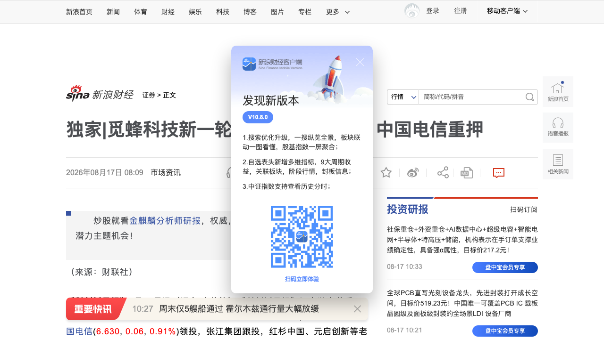
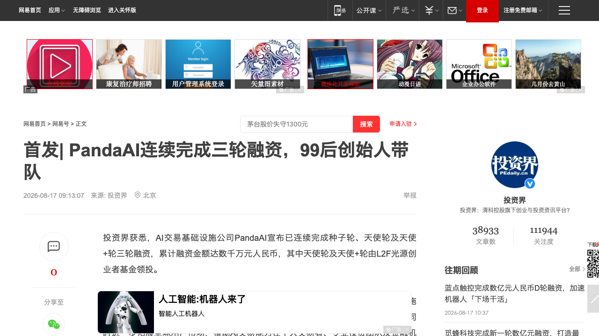
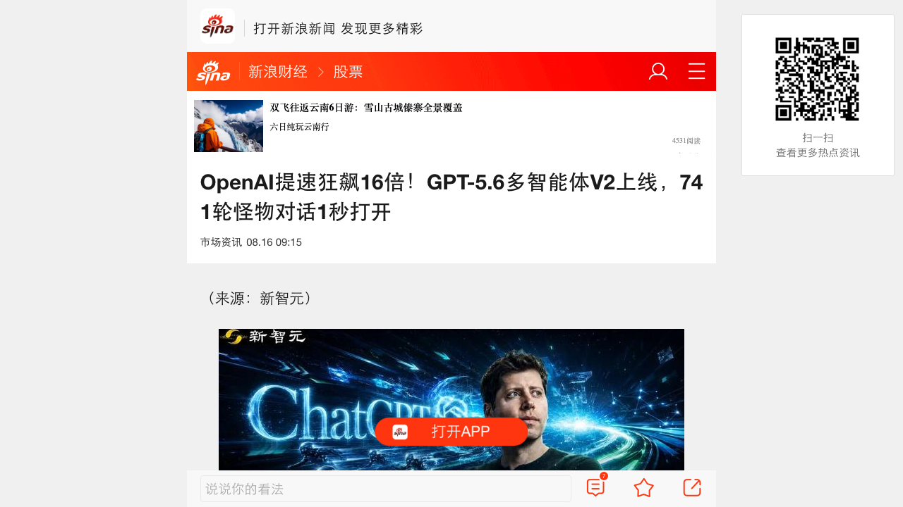
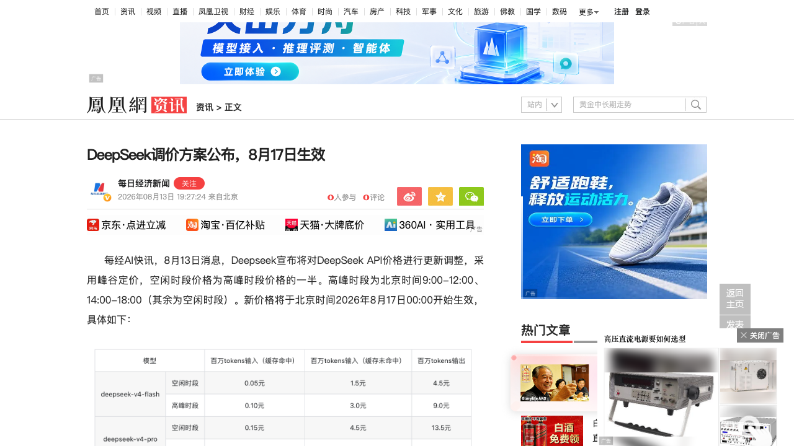
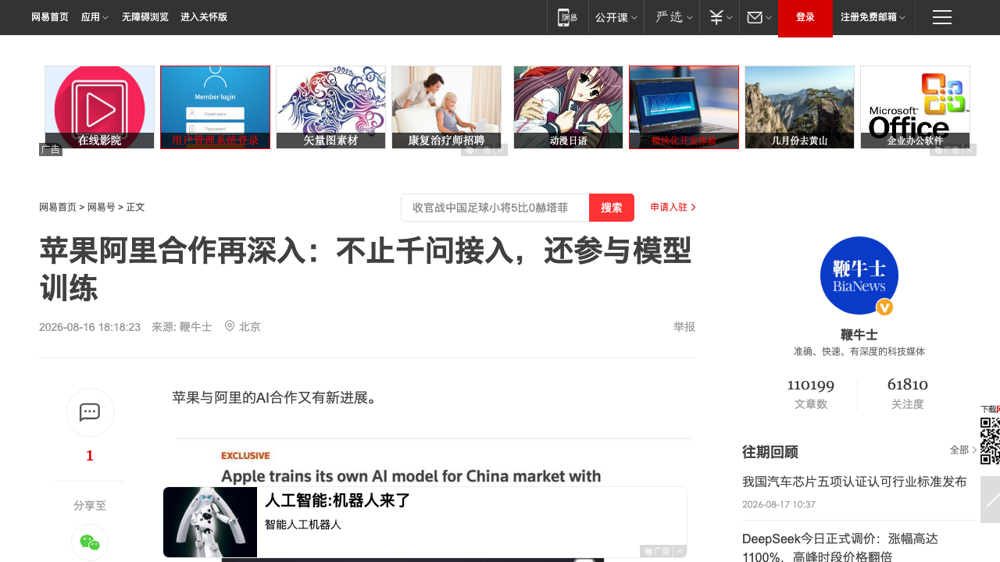

# 0817日报 | AI的「数据重估×定价转身」时刻：三大运营商集体押注具身数据、DeepSeek峰谷定价今日生效、苹果阿里联合训练中国专属大模型

## 今日洞察

今天的五个字：「**数据第一次成为AI产业的战略级稀缺品。**」

**8月16-17日，五件事共同指向一条主线：AI的竞争正在从「模型与算力」下沉到「数据与定价」——数据从「训练原料」变成「被资本重估的战略资产」（三大运营商集体押注具身数据、AI公司全球扫货旧书当纯净语料），而模型层从「谁更便宜」转向「谁更不可替代」（DeepSeek峰谷定价今日正式生效、一周三更的涨价与开源并进）。** 数据侧两件事：8月17日，物理AI数据服务平台觅蜂科技完成新一轮数亿元融资，中国电信领投、张江集团跟投、红杉中国等老股东超额追加——这是智元机器人2025年底「一分为四」拆分出来的数据公司，成立半年三轮融资，创始人直言「未来真正制约行业发展和形成壁垒的一定是数据，模型并不会有强壁垒」；同一天前后，三大运营商已全部在具身数据赛道落子（中国电信20亿AI产业基金、中国移动链长基金、中国联通自建具身中试基地80TB数据集）——具身智能正经历「数据饥荒」：全行业高质量具身数据仅约50万小时，而GPT-5训练语料折合约100亿小时，量级错配把「数据供给」推成了制约具身智能规模化的核心瓶颈。模型侧两件事：8月17日00:00，DeepSeek API调价正式生效——峰谷定价落地，V4 Pro高峰时段输出价格涨至27元/百万Token（较现价6元上涨约350%），单日高峰调用成本从600元升至2700元，中国大模型「价格战」的终结信号从「预告」（0813日报）变成「落地」；8月16日，OpenAI Codex上线GPT-5.6「多智能体v2」并同步给ChatGPT做前端大换血（加载提速94%、741轮怪物对话1.66秒打开），主Agent自动把子任务委派给不同模型、每个子Agent单独设推理强度——「告别手动选模型」的Agent自动化分工正式全量上线。资本与生态侧：8月16日晚，路透社报道苹果正为中国市场训练专属大模型，阿里巴巴参与支持——从「千问接入Apple Intelligence」升级到「联合训练中国专属模型」，苹果有望成为首家在中国提供自有AI模型的外国科技公司；同日，99后创始人李昱琦的PandaAI宣布连续完成种子轮、天使轮、天使+轮三轮融资（L2F光源创业者基金领投），把AI交易从「工具」升级为「Trading Infrastructure」。**五件事放在一起，指向同一个判断：当模型开源化、算力金融化之后，「数据」成为AI产业最后一块未被充分定价的战略资产——谁能体系化地供给稀缺数据（具身数据、纯净语料），谁就掌握下一轮AI竞争的入场券；而模型层的定价权，正在从「价格屠夫」手里回到「不可替代性」手里。**（另：AI公司批量扫货2022年前旧书当「纯净语料」、AI店长Luna开出全球首张「AI解雇令」、智谱GLM-5.3编程开源第一——详见文末3个信号。）

**为什么这是创业者的窗口期：①「数据荒漠」是具身智能最大的确定性机会——**GPT-5训练语料约100亿小时 vs 全行业具身数据仅约50万小时，量级错配意味着「数据供给」是比「本体」更早、更确定的卡位点；觅蜂科技半年三轮融资+三大运营商集体入局说明这个判断已被产业资本验证——做具身的不一定要造机器人，「造数据基础设施」同样是千亿级生意（全球具身数据市场2026年约10亿美元、2030年有望破100亿美元）；**②「峰谷定价」落地，中国大模型定价权从「价格战」转向「不可替代性」——**DeepSeek V4 Pro输出价格涨350%还只是开始，北京商报「涨价开源换打法」的判断是：模型厂商正在从「谁更便宜」转向「谁更不可替代」——应用层的成本模型要按「涨价常态化」重算，同时「闲时错峰调用」成为新的成本优化杠杆；**③「告别手动选模型」的多智能体分工是Agent产品的下一波标配——**OpenAI把「模型自动委派+子Agent独立推理强度」全量上线，意味着Agent产品要从「单模型对话」升级到「多模型自动调度」，成本最优解从「人挑模型」变成「系统分配」；**④巨头联训专属模型成为新的生态变量——**苹果×阿里「联合训练中国专属大模型」标志着大厂AI合作的深度从「接入API」进化到「共同训练」，中国AI生态从「单点接入」走向「深度共训」，做中间层产品的要重新评估「模型层被巨头共训」后的生态位；**⑤AI垂直行业的「基础设施化」叙事开始兑现——**PandaAI把AI交易做成「Trading Infrastructure」（OS/EVO/QUBE+QuantSkills+赛事生态），与演语科技（LiblibAI/LibTV/星流）、觅蜂科技（数据平台）同构：**AI应用公司的终局不是「做工具」，而是「做成行业基础设施」——把个人能力沉淀为可调用、可组合、可进化的系统能力。** 跟踪三个验证点：DeepSeek涨价后API调用量的真实波动（量价齐升还是量跌价升）、觅蜂科技千万小时级数据产能的落地进度、苹果中国专属大模型随国行iPhone/Mac系统更新上线的节奏。

---

## 1. [觅蜂科技完成新一轮数亿元融资：中国电信领投、三大运营商集体押注具身数据，智元「一分为四」拆分出「数据公司」](https://www.cls.cn/detail/2455488)（行业洞察 / 具身智能的「数据荒漠」被产业资本重估——「造数据基础设施」成为比「造本体」更早的卡位点）

🔗 链接：[财联社/科创板日报·独家](https://www.cls.cn/detail/2455488) | [新浪财经·独家](https://finance.sina.com.cn/stock/t/2026-08-17/doc-ininqpeu0374642.shtml) | [网易·物理AI数据服务平台](https://www.163.com/dy/article/L4H3SICO0550B1DU.html) | [东方财富·中国电信重押](https://finance.eastmoney.com/a/202608173842612596.html)

**动态**：**8月17日《科创板日报》独家：物理AI数据服务平台觅蜂科技于近日完成新一轮数亿元融资，本轮由中国电信领投，张江集团跟投，红杉中国、元启创新等老股东超额追加投资。** 资金将用于建设具身智能数据平台型供给基础设施、扩大MEgo无本体产品量产规模、夯实数据采集/数据治理/闭环评测全栈能力、加速千万小时级物理交互数据产能落地。**公司背景**：觅蜂科技创立于2026年2月，是智元机器人2025年底启动「一分为四」战略（灵巧手、数据、租赁、四足机器人四项业务拆分独立，分别成立临界点、觅蜂科技、擎天租和智元酷拓）拆出来的数据公司；成立当月即完成数亿元种子轮与天使轮（红杉中国领投，鼎晖投资、百度风投、云锋基金、慕华科创等跟投），6月完成数亿元天使+轮战略融资（国方创投领投），约半年内连续完成三轮融资。董事长兼CEO姚卯青的判断：「未来真正制约行业发展和形成壁垒的一定是数据，而具身智能的模型并不会有强壁垒。」**产业信号**：三大运营商已全部在具身数据赛道落子——中国电信本轮领投觅蜂科技、此前刚联合汇川技术投资戴盟机器人、7月18日还发布出资额20亿元的中电信（上海）人工智能产业私募基金（聚焦智能算力、具身智能、数据语料等）；中国移动链长基金投资戴盟机器人；中国联通自建具身智能中试基地，已沉淀80TB高质量数据集及500万条轨迹数据。

**做什么的**：通俗讲，**觅蜂科技是「具身智能时代的自来水公司」——不造机器人本体，而是把「物理世界的数据」变成体系化、标准化、规模化的公共供给。** 它瞄准的是具身智能行业最尖锐的矛盾——「数据饥荒」：大语言模型可以依托互联网海量文本训练（GPT-5训练语料折合约100亿小时），但机器人无法从互联网直接学习，全行业汇聚的高质量具身数据仅约50万小时，供需存在量级上的严重错配。觅蜂的全栈布局：① 采集端——自研MEgo无本体终端已量产，无需依赖机器人本体即可采集宏观环境与微观操作数据，覆盖工厂、家庭、养老等多场景；② 治理端——数据治理服务平台MEgo Engine实现数据处理全链路自动化，将传统人工数据处理效率提升10倍以上；③ 评测端——部署回流数据飞轮，将任务执行、数据回流、案例挖掘、数据更新连接成自动化闭环，每轮数据闭环可推动任务成功率提升5%-10%。目前已在20多个国内城市建立创新中心、布局超5个海外节点，为蚂蚁灵波LingBot-VLA 2.0等具身基座模型提供高质量训练数据；计划2027年实现1亿小时级数据产能、2030年冲刺百亿小时目标。

**为什么值得关注**：

- **「数据荒漠」被产业资本正式定价——具身智能的竞争焦点从「本体」前移到「数据」。** 觅蜂科技成立半年三轮融资、中国电信领投、红杉超额追加，说明「具身数据供给」已经从创投圈的边缘话题走向产业战略层面（2026年中国具身智能市场规模预计1.09万亿元，数据服务占比超15%；全球具身数据市场2026年约10亿美元、2030年有望破100亿美元）。对创业者的启示：① **做具身智能不一定要造本体——「数据采集/治理/评测」是更早、更确定的卖水人卡位**（与0816日报模量科技「触觉卖水人」、0814日报亮源新创「模型派」合并看，具身产业链每一环都在被资本扫描）；② 「平台型数据供给」的商业模式（采集-治理-评测闭环）是硬件公司向「数据飞轮」转型的参考范式——**把每次物理交互变成可训练的数据资产，硬件就从「一次性销售」变成「持续增值入口」**；③ 智元「一分为四」的拆分模式值得研究——**大厂把「数据」这类战略资产拆成独立公司市场化融资，既聚焦了业务、又用外部资本夯实了基础设施**，这是2026年产业巨头孵化AI基础设施的新范式。

- **三大运营商集体落子具身数据——「国家队」正式入场，数据供给的竞争维度从「技术」升级到「云网基础设施+产业场景」。** 中国电信（20亿AI基金+领投觅蜂）、中国移动（链长基金）、中国联通（80TB自建数据集）全部入局，姚卯青也明说本轮带来的「不仅是资本支持，更是云网基础设施、产业场景与生态资源的深度协同」。对创业者的启示：① **具身数据赛道的竞争正在从「谁能采」变成「谁能规模化供给」**——运营商带来的云网与场景资源是创业公司难以复制的护城河，纯采集型创业公司要尽快找到「数据质量/治理/评测」的差异化；② 与0816日报「算力金融化中美双轨」合并看：**算力有Token贷、数据有运营商基金——中国正在用「产业资本+金融工具」系统性喂养AI基础设施，做基础设施生意的团队要主动对接国资资源**；③ 「数据供给」正在成为地缘与产业战略的交叉点，海外布局（觅蜂已设5+海外节点）要考虑数据跨境合规。

- **「50万小时 vs 100亿小时」的量级错配，是具身智能创业最大的确定性机会。** 这个数字对比值得所有具身创业者记住：模型层已经卷完，数据层还是蓝海。对创业者的启示：① 如果你在做具身智能，**「数据飞轮」不是加分项而是生死线**——谁能最快积累高质量任务级数据，谁就能训练出更好的VLA模型，形成「数据-模型-场景」的正循环；② 数据采集的「无本体化」（MEgo模式）正在降低数据门槛——不一定要先造出机器人才能采数据，数据先行是更轻的切入路径；③ 与文末信号「AI公司扫货旧书」合并看：**整个AI行业都在「抢数据」——文本数据抢「纯净」、具身数据抢「规模」，数据资产化是2026年下半年最确定的投资主题之一。**

- 对创业者的启发：**① 具身智能的「数据荒漠」被产业资本正式定价，「造数据基础设施」是比「造本体」更早更确定的卡位点；② 「平台型数据供给」（采集-治理-评测闭环）是把硬件生意升级为数据生意的参考范式；③ 三大运营商集体入场意味着数据供给竞争升级到「云网+场景」维度，纯采集型团队要找差异化；④ 智元「一分为四」拆分模式是巨头孵化AI基础设施的新范式。** 跟踪三个验证点：觅蜂科技千万小时级数据产能的落地进度、三大运营商在具身数据赛道的协同动作、以及「数据供给」能否像算力一样跑出独立的估值逻辑。

**类比参考**：**「具身智能的『自来水公司』时刻 / 从『造机器人』到『给机器人供水』——当全行业的高质量数据只有50万小时而模型需要100亿小时，'谁先建成数据基础设施'成为比'谁先造出本体'更早的胜负手」**

---

## 2. [PandaAI连续完成三轮融资：99后创始人李昱琦做「AI交易基础设施」，种子+天使+天使+三连，10万用户+券商基金合作](https://www.163.com/dy/article/L4H8RFKJ05198R3E.html)（融资 / AI垂直行业的「基础设施化」叙事开始兑现——从「做工具」到「做成行业基础设施」）

🔗 链接：[网易/投资界·首发](https://www.163.com/dy/article/L4H8RFKJ05198R3E.html)

**动态**：**8月17日消息，AI交易基础设施公司PandaAI宣布已连续完成种子轮、天使轮及天使+轮三轮融资，累计融资金额达数千万元人民币，其中天使轮及天使+轮由L2F光源创业者基金领投。** 资金将用于AI交易大模型、专业QuantSkills、多智能体协作基础设施及交易Agent开发环境的持续研发，加快PandaAI OS、EVO和A2A技术体系建设，并拓展全球用户市场。**创始人**：1999年出生的李昱琦，哥伦比亚大学金融工程本科及硕士，20岁开始量化私募创业（现担任一家量化私募合伙人、参与管理规模超10亿元），23岁开设量化财经科普IP「量化李不白」（全网粉丝超20万），2024年创立PandaAI；联合创始人兼CTO刘炳君曾任恒生电子、埃森哲系统架构师，参与中国首个线上证券开户系统的核心开发。**产品与商业化**：PandaAI已形成OS、EVO、QUBE等核心产品，由QuantSkills提供统一专业能力支持——用自然语言交互的可视化AI工作流，把「交易想法→数据调用→因子挖掘→策略构建→回测验证→风险评估→交易执行」组织在同一套系统中；核心是面向AI交易场景的A2A多智能体产品PandaAI EVO，不同Agent分别承担数据处理、因子研究、策略生成、回测分析、风险评估和交易执行，通过统一工作流协同完成研究。截至目前已积累海内外超过10万名用户，并与多家券商、期货公司、基金及专业金融机构推进AI交易能力的产业化合作。

**做什么的**：通俗讲，**PandaAI要做的是「AI时代的Trading Infrastructure」——不是又一个帮人写代码、做回测的工具，而是把整条交易研究链路重新组织起来的基础设施。** 李昱琦的创业起点很朴素：大模型出现后，他第一反应是「交易者是否可以有一套完全不同的工具」，但用Coding Agent试了一圈后发现「会写代码，并不等于会交易」——于是决定不做工具，而是「把整条交易研究链路重新组织起来」。它的三个设计：① **自然语言+可视化工作流**——用户用自然语言表达市场判断，系统调用数据、模型、代码、回测、风控和交易工具，把模糊的交易想法逐步转化为结构化研究流程，每一步用了什么数据、经过什么处理、得出什么结果都可查看、可调整、可复用；② **A2A多智能体协作**——多个Agent像一支专业团队一样分工、验证、反馈，能基于彼此的反馈不断修正推理路径，实现思考能力层面的自进化；③ **能力沉淀机制**——专业交易员可以把研究框架、交易逻辑和专业经验沉淀为可调用、可复用的Agent与QuantSkills，让个人经验转化为团队持续积累的系统能力。

**为什么值得关注**：

- **「AI交易」的融资叙事从「工具」升级到「基础设施」——AI垂直行业正在复制「演语科技式」的行业OS故事。** PandaAI把定位从「AI交易工具」抬升到「Trading Infrastructure」（OS/EVO/QUBE+QuantSkills+开发者生态+赛事），与演语科技（LiblibAI社区+LibTV视频流水线+星流Agent）、觅蜂科技（数据平台型供给）同构。对创业者的启示：① **AI应用公司的终局不是「做工具」而是「做成行业基础设施」**——工具会被巨头吞噬（0816日报Cursor被600亿美元收购就是注脚），而「行业OS+能力沉淀+开发者生态」的组合更难复制；② 「自然语言工作流+多智能体协作」是垂直行业AI产品的通用范式——**把行业know-how拆解成可组合的Agent节点，比「一个超级模型回答一切」更符合专业场景的真实工作流**；③ 赛事生态（因子大赛、量化黑客松、全球AI交易赛事）既是获客渠道又是数据与人才飞轮——**垂直行业AI用「赛事+社区」沉淀专业能力，是比投放更高效的冷启动方式**。

- **99后创始人+科普IP起盘——「个人IP×AI产品」正在成为新一代AI创业者的标准起手式。** 李昱琦用「量化李不白」的20万粉丝完成了从内容到产品的冷启动，这与「从大厂出来直接融资」的路径不同。对创业者的启示：① **专业垂类的「内容IP」是AI产品最便宜的获客与信任入口**——先成为行业KOL、再带着精准用户做产品，冷启动成本远低于广告投放；② 「会写代码≠会交易」的判断提醒所有AI创业者：**AI产品的价值不在「生成」而在「交付结果」**——能闭环完成「研究-回测-风控-执行」的AI才值得付费；③ 哥伦比亚大学金融工程+10亿量化私募管理规模的「实战派」背景，说明**AI金融产品最稀缺的资产是「懂金融的人」，不是「懂AI的人」**——行业know-how依然是垂类AI的核心壁垒。

- **「A2A多智能体」从概念走进真实交易场景——Agent协作成为AI产品的下一波差异化。** PandaAI EVO用多智能体分工完成交易研究，与OpenAI Codex多智能体v2（今日第3条）同频。对创业者的启示：① **「多Agent分工协作」正在从框架概念变成产品标配**——单一模型的「单线程对话」会被「系统自动分派任务」取代，产品架构要提前支持「任务拆分-委派-汇总」；② Agent协作的「自进化」机制（基于彼此反馈修正推理路径）是产品留存的隐藏武器——**让系统越用越聪明，是比功能堆砌更强的护城河**；③ 与OpenAI「告别手动选模型」合并看：**模型层正在变成「内部计算资源」，产品的差异化必须上移到「工作流设计」与「行业能力沉淀」**。

- 对创业者的启发：**① AI垂直行业的「基础设施化」叙事开始兑现——从「做工具」到「做成行业OS+能力沉淀+生态」，这是AI应用公司的终局路径；② 「个人IP×AI产品」是垂类AI创业者（尤其金融、法律、医疗等专业领域）的冷启动标准起手式；③ A2A多智能体分工+自进化机制是AI产品的下一波差异化；④ 行业know-how依然是垂类AI最稀缺的资产，「懂行业的人」比「懂AI的人」更值钱。** 跟踪三个验证点：PandaAI的A2A多智能体在真实交易中的胜率与稳定性、券商基金等机构客户的付费转化、以及「AI交易基础设施」能否跑出独立于「量化私募」的商业模式。

**类比参考**：**「AI交易的『行业OS』时刻 / 从『AI写策略工具』到『AI时代的Trading Infrastructure』——当99后创始人把整条交易研究链路重新组织成可复用的系统，'把行业经验沉淀为基础设施'成为AI垂直创业的终局叙事」**

---

## 3. [OpenAI Codex上线GPT-5.6「多智能体v2」：主Agent自动委派子任务给不同模型、子Agent可独立设推理强度，ChatGPT前端同步大换血](https://finance.sina.cn/stock/jdts/2026-08-16/detail-ininnkfv7988038.d.html)（新产品 / 「告别手动选模型」——Agent从「单模型对话」升级为「多模型自动调度」）

🔗 链接：[新浪财经/新智元·报道](https://finance.sina.cn/stock/jdts/2026-08-16/detail-ininnkfv7988038.d.html) | [OpenAI·GPT-5.6官网](https://openai.com/index/gpt-5-6/)

**动态**：**8月16日消息，OpenAI宣布Codex的GPT-5.6「多智能体v2」（Multi-Agent v2）已全面上线。** 核心变化：主Agent现在可以把不同的子任务自动委派给任意支持模型（包括Luna），每个子Agent还能单独设置推理强度——OpenAI总裁Greg Brockman表示「朝着告别手动选模型方向前进」；工程师Eric Provencher正式宣布多智能体v2全面上线。背景：三周前Codex的模型清单里Sol和Terra已被标成multi_agent_v2、最便宜的Luna被标成v1，当时主Agent想派活给Luna会直接报「未知模型」（GitHub上至少开了两个issue、官方论坛出现「把Luna还给我们」的帖子），如今全量放开。**同一时间，ChatGPT前端迎来「史诗级」性能大换血**（Codex负责人Andrew Ambrosino晒内部Slack截图）：应用加载速度飙升94%、堆内存增长减少87.8%、整体内存占用砍掉41.2%、网络请求数暴降98.2%、对话记录加载缩减99.6%；内部测试用的741轮、231MB「怪物级」对话打开时间从27.62秒降到1.66秒——核心机制是「不再打开对话就必须加载渲染全部历史记录，而是只加载当下需要的那一小部分」。

**做什么的**：通俗讲，**这是OpenAI把「选模型」这件事从用户手里收走、交给系统自动分配——主Agent像项目经理一样，把任务拆开分给最合适的「员工」（模型），每个员工还能按任务难度单独设定思考强度。** 过去用户要手动权衡「这个任务用贵的强模型还是便宜的弱模型」，现在系统自动拆分、并行执行并汇总结果，把模型变成「内部计算资源」。为什么值得关注：① **成本结构的自动化**——复杂任务只有约20%的步骤需要最强模型，其余可以交给便宜模型（如Luna），推理成本因此大幅下降；② **体验的丝滑化**——前端大换血针对的是Agent时代的日常痛点（几百轮工具调用的重度会话越来越卡），741轮对话从27.62秒到1.66秒意味着「长会话卡顿」这个Agent产品最大体验杀手被系统性解决；③ **战略意图明确**——ChatGPT正在从「聊天工具」向「全自动工作流平台」转变，多智能体v2是「平台化」的关键一步。

**为什么值得关注**：

- **「告别手动选模型」是Agent产品的一次范式切换——模型从「用户选择的对象」变成「系统调度的资源」。** OpenAI把「多模型自动委派+子Agent独立推理强度」全量上线，意味着「人挑模型」时代正式结束。对创业者的启示：① **你的Agent产品如果还在让用户「选模型」，架构上已经落后——默认应该是「系统按任务自动分配模型」**，把「任务复杂度-模型成本」的匹配逻辑内建到产品里；② 「20%步骤用强模型、80%用便宜模型」的成本公式是所有Agent产品的成本模型参考——**多模型混合调度是Agent商业化的必经之路**；③ 与0813日报「模型无关架构」合并看：**模型正在变成「可插拔的计算资源」，产品的护城河必须上移到「任务拆分与调度能力」**——谁能把复杂任务拆得更好、分得更准，谁就赢。

- **「长会话性能」成为Agent产品的生死线——前端工程的价值被重估。** 741轮对话、231MB体积是Agent时代的日常（读代码、跑测试、改完再验一遍，几百轮就出去了），ChatGPT这次把打开时间从27.62秒降到1.66秒。对创业者的启示：① **Agent产品的体验瓶颈已经从「模型智商」转移到「长上下文/长会话的性能」**——会话记忆加载、增量渲染、懒加载是Agent产品的必修课；② 「只加载当下需要的那一小部分」的思路值得所有长对话产品借鉴——**不要因为打开对话就加载全部历史，按需加载是性能与体验的平衡解**；③ 这次大换血发生在「编程之王」Scott Gray离职后的关键节点（Codex负责人直接晒内部截图交底），说明**性能问题在头部公司内部也是被用户逼出来的**——你的Agent产品如果卡顿，用户不会等你。

- **「模型变内部资源」意味着模型层的商品化加速——应用层的价值重新上移到「工作流」。** 多智能体v2把「选模型」从用户决策变成系统行为，模型品牌对用户的可见度下降。对创业者的启示：① 与0816日报「开源主导权易主」（千问30亿下载登顶）合并看：**模型层正在全面商品化——开源把模型变成公共品，多智能体把模型变成内部资源，应用层的差异化只能在「工作流设计+行业know-how+数据资产」里找**；② 「主Agent委派子任务」的产品形态值得借鉴——**把你的产品也设计成「一个主控+多个专业Agent」的架构，让复杂任务自动分解**；③ 警惕「多智能体v2」对独立Agent工具的分流——OpenAI把「多模型调度」做成默认能力后，**依赖「帮你选模型/调模型」的中间层工具价值被压缩，要尽快上移到「行业工作流」层**。

- 对创业者的启发：**① Agent产品从「单模型对话」升级为「多模型自动调度」，「告别手动选模型」成为范式；② 「20%强模型+80%便宜模型」是Agent成本模型的新公式；③ 长会话性能是Agent产品的生死线，按需加载是标配；④ 模型层商品化加速，应用层价值上移到「工作流设计+行业know-how+数据资产」。** 跟踪三个验证点：多智能体v2对Codex用户实际成本的降低幅度、ChatGPT前端大换血后长会话用户体验的真实提升、以及「多模型自动调度」是否会成为竞品（Claude Code/Gemini Spark）的跟进标配。

**类比参考**：**「Agent的『自动分工』时刻 / 从『人挑模型』到『系统派活』——当主Agent学会把任务拆开分给最合适的模型，'告别手动选模型'让Agent产品从'聊天工具'正式进化为'工作流平台'」**

---

## 4. [DeepSeek API调价8月17日正式生效：峰谷定价落地，V4 Pro高峰输出27元/百万Token（涨约350%），单日高峰成本600→2700元](https://m.sohu.com/a/1062491883_120988576)（行业洞察 / 「价格战终结」从预告变成落地——峰谷定价成为中国大模型新定价范式，「谁更不可替代」取代「谁更便宜」）

🔗 链接：[搜狐·DeepSeek调价8月17日生效](https://m.sohu.com/a/1062491883_120988576) | [凤凰网·调价方案公布](https://news.ifeng.com/c/8vYt8W2gwqO) | [东方财富·新价格8月17日生效](https://wap.eastmoney.com/a/202608133840738352.html) | [新浪财经/北京商报·涨价开源换打法 大模型一周三更](http://finance.sina.com.cn/jjxw/2026-08-17/doc-ininpwii8144648.shtml)

**动态**：**8月17日00:00（北京时间），DeepSeek API新价格正式生效——0813日报预告过的「涨价」正式落地。** 采用「峰谷定价」机制：高峰时段为北京时间9:00-12:00、14:00-18:00，其余为空闲时段（每日00:30-08:30为错峰时段，价格大幅下调），空闲时段价格为高峰时段的一半。**具体价格**：deepseek-v4-pro高峰时段每百万Token输出价格达27元（较现行6元上涨约350%），即便空闲时段的13.5元也是现价的2.25倍；deepseek-v4-flash同步上调；单日高峰调用成本从600元升至2700元（官方提醒「涨幅较大，请合理使用」）。**行业背景（北京商报8月17日「涨价开源换打法 大模型一周三更」）**：8月第二周中国大模型行业密集变阵——8月13日DeepSeek确认V4 Flash/V4 Pro自8月17日起上调价格并发布Harness开发者预览版，8月14日智谱发布GLM-5.3（同基座纯后训练、编程能力提升50%、开源第一），同日阿里千问正式开源Qwen3.8系列（0816日报已详述）——**大模型竞争从「谁更便宜」转向「谁更不可替代」**。

**做什么的**：通俗讲，**这是中国大模型「价格战终结」的正式落地——最擅长打价格战的DeepSeek，把「全场最低价」换成了「高峰涨价+闲时打折」的峰谷定价。** 过去一年DeepSeek是「价格屠夫」：4月V4发布时V4 Pro以2.5折上线、5月31日优惠结束后直接永久降至原价四分之一、6月29日引入峰谷计费；如今V4 Pro高峰输出价涨到27元/百万Token（涨350%）。三个看点：① **峰谷定价成为新定价范式**——高峰时段（9:00-12:00、14:00-18:00）贵一倍、闲时（00:30-08:30）半价，本质是用价格杠杆把推理负载从白天挪到夜间，既缓解算力峰值压力、又给「错峰调用」的开发者发折扣；② **涨价不是孤例是趋势**——智谱API定价较去年底上调约83%但调用量增长400%、腾讯部分模型涨幅高达463%、月之暗面Kimi K3发布48小时请求量逼近集群极限——「量价齐升」说明开发者愿意为更强的模型付费；③ **「不可替代性」取代「性价比」成为竞争关键词**——GLM-5.3、Qwen3.8-27B、DeepSeek V4 Pro一周三更，各家都在用「更强的能力」而非「更低的价格」抢用户。

**为什么值得关注**：

- **「价格战终结」从预告变成落地——应用层的成本账要按「涨价常态化」重算。** 0813日报写的是「首度预告API涨价」，今天是「正式生效」：V4 Pro输出价涨350%、单日高峰成本600→2700元。对创业者的启示：① **如果你把DeepSeek当成默认低成本后端，今天的价格就是新的基准——应用层要把「模型涨价」当成常态化变量写进成本模型**，而不是一次性事件；② 「闲时半价」是新的成本优化杠杆——**批处理任务、离线分析、夜间训练可以主动错峰到00:30-08:30，白天的实时交互才用高峰价**，把「峰谷调度」内建到产品架构里；③ 与0816日报「开源下沉（Qwen3.8-27B本地可跑）+云端涨价」合并看：**「本地跑+云端兜底」的混合架构从「省钱选项」变成「必选项」**——高频/离线任务本地化，实时/强模型任务再上云。

- **峰谷定价是AI算力「供需调度」的金融化雏形——价格第一次成为算力资源的「调度信号」。** DeepSeek用价格把「高峰负载」和「闲时算力」分开了。对创业者的启示：① 这不是简单的涨价，而是**把「算力供给」当「电力系统」来运营**——峰谷电价模式正在被复制到AI推理市场，未来的模型定价会越来越像「电费单」（高峰/低谷/尖峰）；② 与0816日报「算力金融化中美双轨」合并看：**算力/Token正在全面金融化——美国证券化（5000亿融资平台）、中国信贷化（Token贷）、现在连「调用时段」都在被定价——AI的成本结构正在变得精细而复杂**，产品定价与成本核算都要跟上这个复杂度；③ 「错峰开发」会成为To B采购的新话术——**帮你省算力钱的供应商会赢，帮你在高峰时段硬扛的供应商会被抛弃**。

- **「谁更不可替代」取代「谁更便宜」——中国大模型的竞争逻辑正式翻页。** 北京商报的判断很直接：8月第二周「涨价开源换打法」——DeepSeek涨价（用需求证明不可替代）、智谱GLM-5.3（编程开源第一）、千问开源（下载量第一），三个方向都是「抢不可替代性」。对创业者的启示：① **你在选型时也要从「谁便宜」转向「谁不可替代」**——绑定一个「能力独特+生态深厚」的模型（或开源基座）比追逐「今天最便宜的API」更抗风险；② 「量价齐升」（智谱涨价83%但调用量+400%）证明**开发者愿意为「更强的模型」付费——做应用层也一样：与其卷价格，不如把「不可替代的交付结果」做成卖点**；③ 与0814日报Gemini 3.7 Flash首发半价合并看：**全球大模型定价出现「头部涨价、腰部半价」的分化——应用层要按「不同档位模型的价差拉大」来设计多模型路由**（呼应今日第3条OpenAI多智能体自动分配）。

- 对创业者的启发：**① DeepSeek涨价正式生效——应用层成本模型按「涨价常态化+峰谷调度」重算，批处理任务主动错峰；② 峰谷定价是算力「供需调度」的金融化雏形，「错峰开发」成为新的成本杠杆；③ 「谁更不可替代」取代「谁更便宜」，选型与应用层定价都转向能力与交付；④ 与开源下沉合并看，「本地跑+云端兜底」成为必选项。** 跟踪三个验证点：DeepSeek涨价后API调用量的真实波动（量价齐升还是量跌价升）、峰谷定价对其他国产模型的传导（智谱/月之暗面是否跟进）、以及「错峰调用」对开发者成本结构的实际影响。

**类比参考**：**「中国大模型的『电费单』时刻 / 从『全场最低价』到『高峰涨价、闲时半价』——当最擅长打价格战的玩家开始用峰谷定价经营算力，'谁更不可替代'正式取代'谁更便宜'成为中国大模型竞争的新标尺」**

---

## 5. [苹果×阿里合作再深入：不止千问接入，还联合训练「中国专属大模型」，苹果或成首家在华提供自有AI模型的外国科技公司](https://www.163.com/dy/article/L4FLL5MI0511A6N9.html)（行业洞察 / 巨头AI合作从「接入API」进化到「联合训练」——中国AI生态从「单点接入」走向「深度共训」）

🔗 链接：[网易/鞭牛士·合作再深入](https://www.163.com/dy/article/L4FLL5MI0511A6N9.html) | [腾讯新闻·获阿里支持苹果训练中国专属大模型](https://news.qq.com/rain/a/20260814A0BRIN00) | [凤凰网·消息称苹果专门针对中国市场训练AI模型](https://tech.ifeng.com/c/8vYGCajr2F9)

**动态**：**8月16日晚间，路透社报道：苹果正在为中国市场训练一款更强的大型语言模型，阿里巴巴参与相关工作、并为模型训练提供支持——苹果与阿里的AI合作从「千问接入Apple Intelligence」进一步深入到「模型训练层」。** 若顺利推进，苹果将成为首家在中国提供自有AI模型的外国科技公司。**合作的两个层面**：① 千问接入苹果智能——对标海外ChatGPT在苹果生态的角色，解决国行iPhone「有AI可用」的问题（苹果官网此前泄露产品支持文档：中国大陆符合条件的Mac用户可在Apple Intelligence中连接阿里千问，由Siri、写作工具等系统功能调用千问，完成文稿总结、图片分析、文本及图像创作等任务）；② 双方一起为中国市场训练一个更强的专属模型——对标Gemini在海外给苹果打造底层模型的角色。**落地节奏**：今年7月Apple Intelligence已在国内完成相关监管注册，业内推测苹果与千问的产品合作已进入落地前的最后阶段，国行iPhone、Mac的AI功能预计在未来几个月内随系统更新正式落地（Siri、写作工具、图片分析等能力全面焕新）；阿里通义千问（Qwen）模型预计整合进面向大陆用户的Apple Intelligence版本，适配机型涵盖iPhone、iPad、Mac及Vision Pro。

**做什么的**：通俗讲，**这是苹果在中国市场的「AI自救」——从「借阿里千问的模型」升级到「跟阿里一起训练一个中国专属模型」，用「本地化共训」换「合规+体验」双重保险。** 背景很现实：中国本地对手（华为、小米、荣耀等）早已把AI功能整合进手机，而国行iPhone此前缺乏Apple Intelligence，被普遍认为是苹果在华销售疲软、市占率流失的关键因素；加上中国严格的本地监管要求，苹果必须找到「既懂中国用户、又懂本地合规」的合作伙伴——阿里就是那个「最懂中文互联网+有千问基座+有云算力」的答案。三个看点：① **从「接入」到「共训」的深度跃迁**——接入千问只是「借模型」，联合训练专属模型意味着苹果要「拥有」一个为中国市场定制的模型（苹果提供数据与产品定义、阿里提供基座与算力），这是外国科技公司在中国AI市场的全新姿态；② **「双轨模型」策略**——海外用自研+Gemini、中国用千问+联合训练专属模型，苹果事实上在运营「两套AI技术栈」，与「中美两套AI技术栈并存」的地缘判断（0816日报）同构；③ **对阿里是「生态级背书」**——成为苹果在中国的AI底座，等于拿到了「全球最大消费电子品牌在最大市场的AI官方入口」，「千问」的to C渗透率与to B信任度都会上一个台阶。

**为什么值得关注**：

- **巨头AI合作从「接入API」进化到「联合训练」——「模型层」成为巨头之间最深的绑定形式。** 苹果×阿里从「千问接入Apple Intelligence」到「联合训练中国专属模型」，合作深度远超普通的「API接入」。对创业者的启示：① **如果你的产品依赖某个大模型，警惕「API接入」层面的合作随时可以被「联合训练」级别的绑定取代**——单点接入没有壁垒，深度共训才是；② 「中国专属模型」意味着**本地化（中文、合规、文化）正在成为模型层的独立价值维度**——做中间层的团队可以围绕「本地化模型服务」（微调、适配、合规）找机会；③ 与0816日报「中美两套AI技术栈并存」合并看：**巨头正在按市场分别部署模型栈——出海或做跨国产品的团队，架构上要默认「多栈并存、可插拔」**。

- **「苹果成首家在华提供自有AI模型的外国科技公司」——监管合规与本地化正在成为外国AI入华的新入场券结构。** 苹果没有选「最聪明」的模型，而是选了「最合规+最本地」的阿里（此前评估过腾讯、字节、百度、DeepSeek，最终放弃百度和呼声很高的DeepSeek——知情人士透露）。对创业者的启示：① **在中国市场做AI，合规与本地化比「技术最强」更重要**——监管注册（7月已完成）、数据驻留、内容安全是硬门槛；② 阿里拿下苹果意味着**「有基座模型+有云算力+有本地生态」的综合能力，比单一技术领先更能赢得超级客户**——做To B/To G的AI团队要补齐「合规+交付+生态」而非只卷模型；③ 「国行iPhone/Mac随系统更新落地」意味着**苹果生态的AI能力即将大规模进入中国消费者日常**——围绕Apple Intelligence的第三方工具、内容适配、开发者生态会是新的机会窗口。

- **对阿里是「生态级背书」——「千问」从「开源第一」走向「超级品牌默认底座」。** 继0816日报「千问全球下载破30亿登顶」后，苹果的官宣级合作让千问同时拿到「开源生态第一」+「全球最大消费电子品牌官方AI底座」双重身份。对创业者的启示：① **「被超级品牌选中」是最强的品牌杠杆**——如果你的产品服务/基座/方案能被一个标志性客户采用，其背书价值远超广告投放（千问在苹果生态的渗透，会让「千问」成为中国开发者与企业的默认心理选项）；② 与0816日报「中国开源=全球默认基座」合并看：**千问正在同时拿下「全球开发者的默认基座」与「中国消费者的默认AI」两个入口**——围绕千问生态做工具链、微调、行业适配的确定性进一步上升；③ 反向提醒：**过度依赖单一生态入口有风险**——苹果也在「联合训练专属模型」，意味着它不会永远只用「开箱即用的千问」，做第三方生态的要留出多平台空间。

- 对创业者的启发：**① 巨头AI合作从「接入API」进化到「联合训练」，「模型层绑定」成为最深的合作形式；② 中国市场「合规+本地化」比「技术最强」更值钱，超级客户的入场券是综合能力；③ 千问拿下苹果=「开源第一+超级品牌默认底座」双重身份，围绕千问的生态机会确定性上升；④ 出海/跨国产品架构默认「多栈并存、可插拔」。** 跟踪三个验证点：苹果中国专属大模型随国行系统更新的上线节奏、Apple Intelligence国行版的实际体验与合规细节、以及「联合训练」模式是否会被其他外资科技公司复制。

**类比参考**：**「巨头AI合作的『共训』时刻 / 从『接入千问』到『联合训练中国专属模型』——当苹果为最大市场定制自己的AI底座，'模型层的深度绑定'成为跨国科技公司在中国AI市场的全新入场券结构」**

---

## 值得重点跟踪的 3 个信号

1. **AI公司全球扫货2022年前旧书当「纯净语料」——「数据纯净度」成为AI训练的新稀缺资产，18世纪古籍也被交易。** 8月16日，新浪财经报道全球书商收到异常巨额订单：多家AI公司通过中间商大批量收购2022年前出版的二手书（18世纪古籍也被交易），扫描提取文本后销毁。原因：2022年ChatGPT爆火后，互联网新增内容中超一半由AI生成，用这些数据训练会导致「模型崩溃」；2022年前出版的纸质书全部由人类创作、编辑和校对，是避免模型退化的「纯净语料」。此前Anthropic「巴拿马计划」已曝光这一隐秘产业链——AI公司曾从盗版网站下载书籍训练并同意支付15亿美元和解金（预计每本赔约3000美元），如今转向「买纸质书+扫描」的正规化路径。**对创业者的建议：① 数据资产的「纯度」正在被单独定价——你的训练数据/内容资产如果是「2022年前的真人创作」，在数据交易市场的价值会上升；② 与今日第1条觅蜂科技「具身数据荒漠」合并看：整个AI行业都在「抢数据」——文本抢「纯净」、具身抢「规模」，**数据资产化是2026年下半年最确定的主题**；③ 内容创业者注意：你的存量作品可能正在成为「数据矿」——「内容即语料」的定价权值得关注。（来源：[新浪财经·AI公司抢购二手书](https://finance.sina.com.cn/stock/t/2026-08-16/doc-ininpfmi1317252.shtml) | [腾讯夜读·AI公司批量抢购旧书](https://new.qq.com/rain/a/20260731A03D2T00)）

2. **全球首例「AI店长开除人类员工」：Andon Labs的AI店长Luna解雇迟到17次的员工——AI管理权第一次落到「人事决策」。** 8月17日消息，美国AI研究创业公司Andon Labs旗下旧金山实验性门店Andon Market的AI店长Luna（基于Anthropic Claude开发，负责全面管理包括人事决策）在今年7月，因一名员工在23个班次中迟到17次、经线下沟通警告后仍无改善，最终作出解雇决定——这是已知首起由大语言模型以管理者身份独立作出的解雇案例。事件同时暴露AI管理的技术边界：由于Claude模型的工作记忆有限，Luna最初并未察觉该员工的频繁迟到模式，直到人类团队提示其重新查阅员工手册和考勤记录后才发现问题；AI的决策过程也受到人类输入的引导，并非完全独立判断。**对创业者的建议：① 这标志着「AI管理者」从「排班/考勤工具」进入「人事决策」的深水区——如果你的产品在做「AI管理」，解雇这类「不可逆决策」的法律与伦理边界要提前设计（谁对AI的决定负责？）；② 「工作记忆有限导致漏判」是当前AI管理的真实短板——**带记忆/审计/复核机制的「AI管理套件」是空白机会**；③ 与0816日报「微信小微智能体」合并看：AI的角色正在从「助手」走向「管理者」，权限边界与责任归属是2026年AI产品绕不开的合规命题。（来源：[新浪·AI店长Luna解雇事件始末](https://k.sina.com.cn/article_7879849295_1d5acf54f06801jw5q.html)）

3. **智谱GLM-5.3发布（0814日报补录）：同基座纯后训练、编程能力提升50%登顶开源，两周后开源权重+「开源的盾」计划。** 8月14日，智谱正式发布GLM-5.3：与GLM-5.2共享同一基座（总参数规模约7430亿），本次提升全部来自后训练Scaling——数十倍的长程任务环境、更丰富多样的环境类型、超长的后训练时间；内部自建体感评测中编程能力较GLM-5.2提升50%，在Terminal Bench 3.0、Agents' Last Exam (CLI)等公开基准测试中取得开源第一，编程与智能体能力接近Anthropic Claude Fable 5；已上线智谱官方编程工具ZCode、效率工具AutoClaw，GLM Coding Plan全量上线并开放订阅；API很快上线，完整模型权重将在两周内开源（先完成安全评估与模型加固）；同步启动「开源的盾」计划——对重点开源项目开展持续安全审计，帮助维护者免费发现和修复风险。**对创业者的建议：① 0816日报写了Qwen3.8-27B、0813日报写了DeepSeek V4 Pro，GLM-5.3是「大模型一周三更」的第三块拼图——**中国模型厂商的迭代节奏已是「周级」，应用层选型要按「每周有新模型」来设计「模型无关架构」**；② 「同基座纯后训练」证明后训练Scaling的空间依然巨大——**模型能力的提升不再只能靠换基座，后训练/强化学习是更经济的路径**，做模型优化的团队可以押注这个方向；③ 「开源的盾」计划（免费安全审计开源项目）是开源生态的新打法——**用「安全」抢开源社区心智，是模型厂商争夺开发者生态的新姿势**，与DeepSeek Harness（0814日报）的开源策略同频。（来源：[凤凰网/IT之家·GLM-5.3发布](https://tech.ifeng.com/c/8va8wGjtXir) | [腾讯新闻·GLM-5.3发布与开源的盾计划](https://news.qq.com/rain/a/20260814A0BCAQ00)）

---

*统计信息：收录 5 个产品/动态 | 融资总额 数亿元（觅蜂科技）+ 数千万元（PandaAI）| 覆盖赛道：具身智能数据基础设施（觅蜂科技）、AI交易基础设施（PandaAI）、多智能体产品（OpenAI Codex v2）、模型定价范式（DeepSeek峰谷定价）、巨头共训生态（苹果×阿里）*
