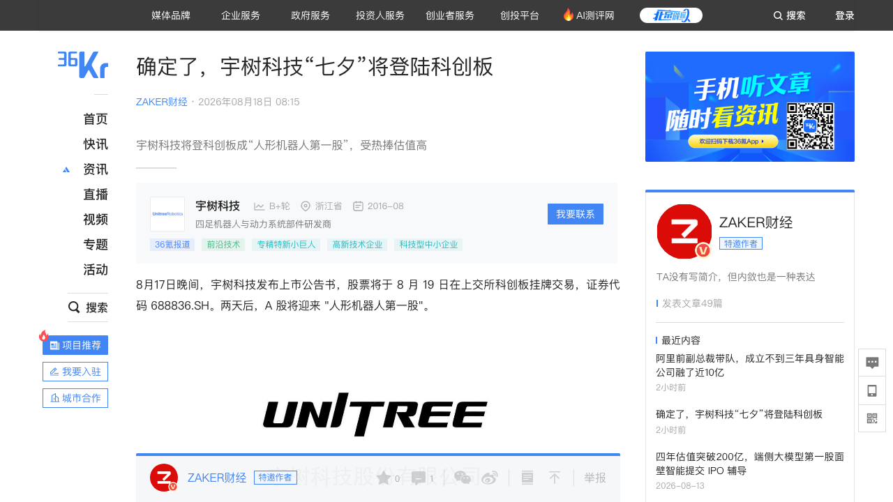
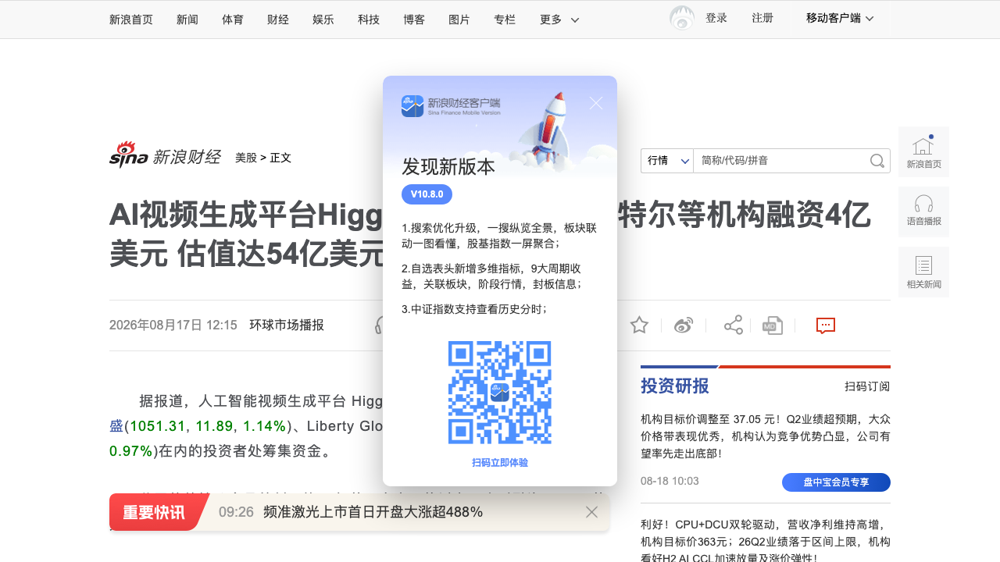
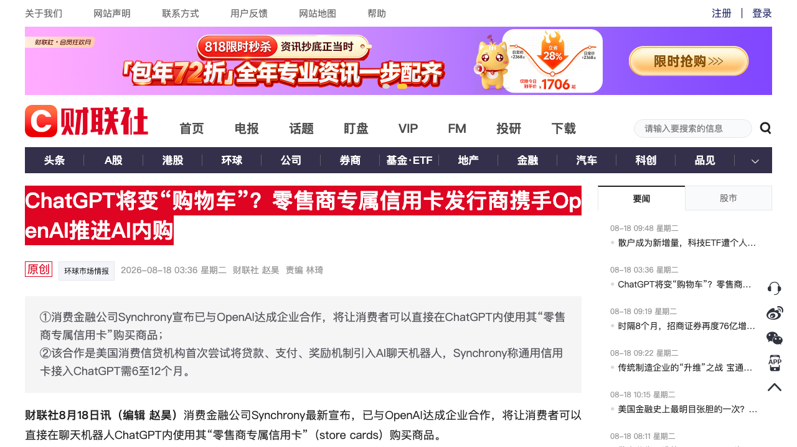
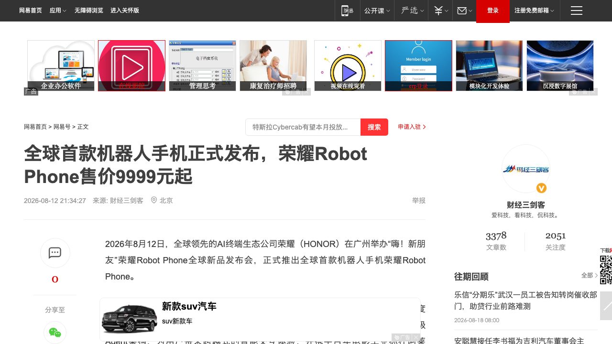
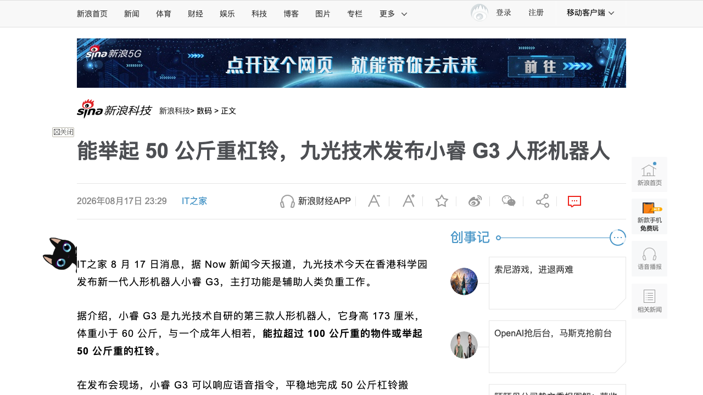

# 0818日报 | AI的「兑现期」时刻：宇树明日上市、A股迎来人形机器人第一股；ChatGPT开始变「购物车」；AI视频独角兽8个月估值翻4倍

## 今日洞察

今天的五个字：「**AI从『讲故事』进入『兑现期』。**」

**8月17-18日，五件事共同指向一条主线：AI行业正在从「融资讲故事」切换到「用收入、用订单、用IPO兑现」——人形机器人第一次被A股定价（宇树科技8月19日上市、成为A股「人形机器人第一股」，中签率万分之1.8创科创板历史新低、219倍发行市盈率、104天闪电过会），AI视频独角兽第一次被「收入飞轮」定价（Higgsfield成立不到两年估值54亿美元、8个月翻4倍，靠的是年化收入7亿美元——一年前只有2000万美元），而AI平台第一次开始直接收钱（消费金融公司Synchrony宣布与OpenAI合作，让消费者直接在ChatGPT内用信用卡完成购买——美国消费信贷机构首次将贷款、支付、奖励引入AI聊天机器人，「代理式电商」从概念进入落地）。** 产品侧两件事把「兑现」延伸到物理世界：8月18日上午10:08，全球首款机器人手机荣耀Robot Phone正式首销（9999元起）——四自由度钛合金灵巧云台+系统级Agent架构，手机第一次拥有机器人级「身体」，AI终端从「数字智能」迈向「具身智能」；8月17日，香港九光技术发布人形机器人「小睿G3」（能拉100公斤、举50公斤杠铃），与宇树同日发布的「超人」（原地跳高2米、极限速度12.66m/s破人类纪录，但官方明确「不量产、不销售」）形成对照——人形机器人的路线正在分化：一边秀极限性能，一边干体力活。**五件事放在一起，指向同一个判断：AI产业的估值逻辑正在从「谁的叙事最性感」切换到「谁先兑现——收入、交易、订单、上市」。创业者要重新审视自己的「兑现路径」：收入从哪来、交易在哪个环节发生、物理世界的入口要不要占。** 资本侧同步验证：Anthropic年化营收据传突破650亿美元（半年翻7倍、最快10月IPO）、英伟达为OpenAI俄亥俄数据中心提供最高1050亿美元担保落地——「AI能赚钱」与「AI基建有人兜底」同时被数据确认，市场对AI投资回报的疑虑暂时缓解。

**为什么这是创业者的窗口期：①「人形机器人第一股」诞生，A股第一次给人形机器人定价——**宇树以609.93亿市值、219倍市盈率（行业平均38.56倍）上市，中签率0.018%（万分之1.8）刷新科创板历史新低、有效申购户数978.46万户创科创板史上最多，同时171名核心员工、DeepSeek（锁36个月）、腾讯、社保基金、央企集体战配——「产业朋友圈+资本狂热」同时到位，但经济日报的评论点破要害：宇树上市「既是行业发展里程碑，更是产业大考的开始」，人形机器人正式进入「以盈利验成色」阶段；**②AI视频的估值锚从「用户」换成「收入」——**Higgsfield 8个月估值从13亿到54亿美元（4倍+），同期的年化收入从2000万美元涨到7亿美元（34倍），且企业客户营收占比从1月不足25%反转为「大部分」——「AI应用能不能收钱」成为估值分水岭，纯C端用户故事越来越难融到大钱；**③AI平台的「交易入口」争夺战正式打响——**Synchrony把亚马逊、沃尔玛、劳氏的专属信用卡嵌进ChatGPT，加上OpenAI此前与Visa、Stripe的合作，「在聊天框里直接完成购买」从Demo变成产业推进——ChatGPT在从「回答问题的地方」变成「完成交易的地方」，入口级生态位正在被巨头重写；**④AI终端开始「具身化」——**荣耀Robot Phone首销（9999元起）把机械云台装进手机、把Agent做成系统级架构，手机从「工具」变成「伙伴」——终端形态的变革窗口打开，软硬结合的Agent载体（机器人、机器人手机、可穿戴）成为新战场；**⑤人形机器人路线分化：「秀肌肉」vs「干体力活」——**宇树超人「破纪录但不量产」、九光小睿G3「能搬100公斤重物」——性能验证与负重实用两条路线并行，结构化重体力场景（搬运、举重、拉货）可能是比「陪伴」「表演」更早算得过来账的商业化入口。

---

## 1. [宇树科技明日科创板上市：A股「人形机器人第一股」诞生，中签率万分之1.8创历史新低、DeepSeek/腾讯/社保集体战配，同日发布「超人」机器人跳高2米破人类纪录](https://www.36kr.com/p/3943674198218376)（行业洞察 / 人形机器人第一次被A股定价——「以盈利验成色」的产业大考正式开始）

🔗 链接：[36氪·确定8月19日登陆科创板](https://www.36kr.com/p/3943674198218376) | [华尔街见闻·宇树8月19日上市](https://wallstreetcn.com/articles/3779630) | [联合早报·人形机器人第一股](https://www.zaobao.com.sg/finance/china/story20260817-9533394) | [证券时报·后天正式上市](https://www.stcn.com/article/detail/4081908.html)

**动态**：**8月17日晚，宇树科技（688836.SH）发布上市公告书：股票将于8月19日在上交所科创板挂牌，成为A股「人形机器人第一股」。** 定价与发行：发行价150.8元/股，对应发行后市值约609.93亿元、发行市盈率219.23倍（通用设备制造业行业平均仅38.56倍，前者是后者近6倍）；公开发行4044.64万股（占总股本10%），预计募资总额60.99亿元、净额约59.17亿元——比招股书原计划的42.02亿元超募近19亿元。**速度与热度**：今年3月20日上市申请获受理、7月2日注册生效，全程仅104天，创科创板「预先审阅机制」落地以来最快审核纪录；回拨后网上中签率仅0.01809759%（约万分之1.8），刷新科创板历史最低纪录，有效申购户数978.46万户（科创板史上最多）、申购股数536.37亿股、最终仅19414个中签号码（中一签500股缴款7.54万元），仍有8734股被网上投资者弃购。**战略配售=产业朋友圈**：9家战配投资者合计获配808.93万股（占发行总量20%）——全国社保基金三个组合合计1.41亿元（锁12个月）、DeepSeek获配93.34万股金额1.41亿元（锁定36个月、所有战配方中锁定期最长）、腾讯旗下上海启善投资约1.36亿元，中石油昆仑资本、南方电网产融、天翼资本等央企背景机构在列，中信证券跟投80.89万股；171名核心员工通过两个资管计划合计出资约2.71亿元，创始人王兴兴个人出资1500万元、直接与间接合计持股33.36%（按发行价对应身家约203.5亿元）。**业绩**：2025年营收17.08亿元（同比+335.36%）、扣非净利6亿元（+674.29%）、归母净利2.88亿元；人形机器人2025年收入8.68亿元（占51.78%）、出货5511台、全球市占率32.4%居全球第一；起家的四足机器人收入6.98亿元（占41.62%）、全球市占率约60%连续多年第一；机器人组件毛利率59.36%。**同日彩蛋**：8月17日宇树发布「超人」人形机器人——0.85米腿长硬件上实现原地跳高2米、极限速度12.66m/s，双双打破人类世界纪录；整机从立项到原型仅3个多月；但官方明确表示「超人」只是技术验证原型机，不对外销售、未公布量产计划。

**做什么的**：通俗讲，**这是「人形机器人」这个品类第一次进入公开资本市场的定价体系——A股第一次用真金白银回答「一台人形机器人值多少钱」，而宇树在上市前夜发布的「超人」则在回答「技术天花板在哪里」。** 三个看点：① **「最难中的签」与「最快过的会」**——0.018%的中签率+978万户申购说明二级市场把「人形机器人第一股」当成了稀缺资产，104天过会说明监管把具身智能当成了需要绿灯放行的战略赛道，两者叠加=政策与资本的双重定价；② **战配阵容=算力（DeepSeek）+生态（腾讯）+国家队（社保/央企）**——尤其DeepSeek以36个月最长锁定期押注，说明大模型厂商正在把「人形机器人本体公司」当作战略卡位（机器人是「具身智能时代的算力消耗大户」，也是「世界模型」的最佳落地载体）；③ **「超募19亿+创始人身家203亿」**——从2016年做四足机器人起家，到2025年人形收入反超四足（8.68亿 vs 6.98亿），宇树用十年完成了从「机器狗」到「人形第一股」的品类跃迁，而「超人」不量产的表态又给市场留了一个「技术验证机」的悬念。

**为什么值得关注**：

- **人形机器人第一次被A股定价——产业从「融资竞赛」进入「以盈利验成色」阶段。** 219倍发行市盈率（行业平均的近6倍）定价的是「品类稀缺性+增速」：营收+335%、人形出货全球第一。对创业者的启示：① 具身智能赛道的资本化通道已经打通（国内已有约50家具身智能相关企业进入IPO辅导或申报阶段，IT桔子统计截至7月底具身模型细分领域年内195起融资、累计754.63亿元，前7个月融资规模已超2025全年4倍）——「做到头部就能上市」不再是口号，但上市只是起点，「盈利验证」会成为二级市场持续拷问的考题；② 「第一股」的稀缺溢价不可复制，跟风上市的企业将面对更苛刻的定价——把收入结构、毛利率（组件59.36%）、全球市占率这些「可验成色的指标」从第一天就当成经营目标；③ 经济日报说得直白：宇树上市「标志着中国人形机器人产业正式迈入以盈利验成色的新阶段」——纯烧钱叙事在二级市场行不通了。

- **「超人」不量产 vs 中签率创新低——技术狂热与资本冷静在宇树身上同时发生。** 一边是「破人类纪录但不卖」的技术验证机，一边是万分之1.8的申购热潮。对创业者的启示：① 「先技术后市场」的路线（先让原型机在极端测试中暴露问题、完成迭代，再谈量产销售）被资本市场接受了——但前提是主业（四足/人形出货）已经在赚钱；② 技术验证机是「市值管理」的免费广告（发布即破圈），但只有量产的订单才能撑起长期估值——不要用原型机故事替代订单；③ 与美国对照更鲜明：K-Scale Labs创始人的反思文章刷屏——美国公司Figure AI一年出货仅约150台（约为宇树的1/36），估值却高达390亿美元，「美国为什么造不出宇树机器人」成为行业之问——中美在具身智能上的估值体系与制造能力正在分化，中国「量产+成本+供应链」的路径被资本市场验证。

- **DeepSeek、腾讯、社保、央企同席战配——「产业朋友圈」成为硬科技IPO的标配名片。** 36个月锁定期最长的DeepSeek、1.41亿的社保、1.36亿的腾讯、中石油/南方电网/天翼等央企——这笔战配名单本身就是具身智能产业链的「合纵连横图」。对创业者的启示：① 硬科技公司在IPO前就要经营「战略股东结构」——算力伙伴（DeepSeek/英伟达系）、生态伙伴（腾讯/阿里系）、国家队（社保/央企）的组合决定了上市后的资源协同空间；② 与0816日报SpaceX收购Cursor、0817日报苹果×阿里联合训练合并看：**「模型厂商×硬件厂商×国家队资本」的绑定正在成为AI产业链的新常态——创业公司要主动设计自己在产业链里的「绑定关系」**；③ 员工战投2.71亿+创始人个人1500万——「全员持股+创始人真金白银」是向市场传递信心的标准动作，值得早期公司学习。

- 对创业者的启发：**① 人形机器人的资本化通道打通，「第一股」溢价不可复制——尽早把「可验成色的财务指标」当经营目标；② 「技术验证机」只能当免费广告，订单才是估值支柱——先技术后市场的路线要以赚钱主业为前提；③ 战配名单就是产业朋友圈，IPO前就要经营战略股东结构（算力+生态+国家队）；④ 中美具身估值体系分化，中国「量产+成本」路径被验证——出海创业可以借势「中国机器人供应链」叙事。** 跟踪三个验证点：宇树8月19日上市首日表现与破发与否、「超人」何时从验证机走向量产、以及「人形机器人第一股」对后续具身IPO（约50家在途）的定价锚定作用。

**类比参考**：**「人形机器人的『上市钟声』时刻 / 从『融资竞赛』到『A股定价』——当第一只人形机器人股票敲钟，'用盈利验成色'第一次成为这个品类的公共考题，而破纪录的『超人』提醒所有人：技术天花板与商业地平线之间，还隔着量产这道坎」**

---

## 2. [AI视频平台Higgsfield完成4亿美元融资、估值54亿美元：成立不到两年、8个月估值翻4倍，年化收入7亿美元（一年前仅2000万）](https://finance.sina.com.cn/stock/usstock/c/2026-08-17/doc-ininqxur7019218.shtml)（融资 / AI视频的估值锚从「用户故事」换成「收入飞轮」——B端营销订阅成为AI应用估值新引擎）

🔗 链接：[新浪财经·4亿美元融资估值54亿](https://finance.sina.com.cn/stock/usstock/c/2026-08-17/doc-ininqxur7019218.shtml) | [财联社·AI视频赛道升温](https://www.cls.cn/detail/2456440) | [36氪·估值366亿AI视频独角兽](https://www.36kr.com/p/3943619724557445) | [凤凰科技·从高盛英特尔处融资](https://tech.ifeng.com/c/8vf3qySXQmm)

**动态**：**8月17日，成立仅两年的AI视频生成平台Higgsfield宣布完成4亿美元新一轮融资，估值达54亿美元——距上一轮（13亿美元估值、融资8000万美元）仅8个月，估值提升超4倍。** 本轮投资方包括DST Global、高盛（Goldman Sachs）、Liberty Global和英特尔（Intel）。数据面：Higgsfield于2025年推出AI视频生成平台，已吸引超过3000万用户，美国是其最大市场；**本月年化收入已达7亿美元，而一年前仅为2000万美元（增长约34倍）**；公司营收结构发生关键反转——「如今我们的大部分营收来自企业客户，这与今年1月相比发生了重大变化，当时企业客户贡献的营收还不到25%」。商业化进展：创始人兼CEO Alex Mashrabov（Snapchat人脸滤镜核心开发者出身）透露，自今年5月以来，包括Dollar Shave Club在内的品牌开始构建由AI驱动的营销系统，每天利用Higgsfield制作多条视频，而不再只为单次营销活动制作一条；还有数百家遍布全美的DTC品牌在用AI「每天生产多条视频」替代昂贵的创意代理机构。内容侧：年内早些时候，Higgsfield基于Seedance 2.0打造的全球首部95分钟AI电影《Hell Grind》在戛纳完成全球首映。本轮融资用途：企业级产品、安全保障以及算力——「算力目前非常稀缺，这笔融资将使我们能够大规模预订算力」。背景数据：高盛估计全球创作者经济规模可能从2023年的2500亿美元增长至2027年的4800亿美元；到2030年全球数字广告支出预计达1.1万亿美元（年均增速8.6%）。

**做什么的**：通俗讲，**Higgsfield是「AI视频界的营销流水线」——不满足于让用户「生成一条炫酷视频」，而是让品牌「每天自动生产多条营销视频」，把自己从创作工具升级成企业的视频内容基础设施。** 三个关键变化：① **从C端爆款到B端订阅**——3000万用户是流量底盘，但真正撑起7亿美元年化收入的，是企业营销客户（营收占比从1月的<25%反转为「大部分」）——它走的正是「C端获客、B端变现」的路径；② **从「单条生成」到「规模化生产」**——Dollar Shave Club这类品牌不再「为一个campaign做一条视频」，而是「每天做多条视频」——AI视频的商业模式从「按条卖」变成「按订阅持续生产」，这是量级完全不同的收入模型；③ **「算力即壁垒」**——创始人直言算力稀缺、融资用于大规模预订算力——在视频生成赛道，算力预订能力=交付能力=客户留存能力。

**为什么值得关注**：

- **AI视频的估值锚从「用户」换成「收入」——「能收钱的AI应用」正在享受估值溢价。** 8个月估值13亿→54亿美元（4倍+），同期年化收入2000万→7亿美元（34倍）——估值涨幅远低于收入涨幅，说明市场甚至还没完全定价它的增速。对创业者的启示：① 「ARR飞轮」取代「DAU故事」成为AI应用估值的核心叙事——Higgsfield、Anthropic（年化650亿美元）、OpenAI（年化超400亿美元）在同一天出现在新闻里，不是巧合：**2026年AI融资的分水岭就是「能不能收钱、收多少钱」**；② 企业客户收入占比的「反转曲线」（<25%→大部分）是比总流水更重要的估值信号——投资人看的是收入结构的健康度，纯C端订阅的AI应用要尽快找到B端付费场景；③ 与0816日报库库AI、0817日报OpenAI多智能体合并看：**AI应用商业化正在全面转向「企业为生产力付费」——消费级故事留给巨头，创业公司的收入引擎应该默认长在B端**。

- **「每天生产多条视频」——AI营销从「尝鲜」变成「流水线」，创意代理的定价权正在被重构。** Dollar Shave Club的CEO公开谈使用Higgsfield，数百家DTC品牌「每天多条视频」——这意味着AI视频的客户价值主张从「省一次拍摄成本」变成「替代整个内容团队的产能」。对创业者的启示：① 面向营销/电商的AI内容工具，产品设计要围绕「规模化生产+持续更新」而不是「单次生成」——帮客户建立「日更产能」才是订阅制的根基；② 「降低对昂贵创意代理机构的依赖」是明确的企业采购动机——AI营销工具的对手不是别的AI工具，而是4A公司的服务费；③ 与0817日报「GEO/可被AI引用」信号合并看：**营销内容的「生产端」和「分发端」都在被AI重写——生产端是Higgsfield们，分发端是微信小微们，中间是创业者的机会带**。

- **创始人背景+产业资本结构——「大厂老兵+算力股东」成为AI视频赛道的标准配置。** 创始人是Snapchat滤镜核心开发者（懂「年轻人娱乐」到「企业营销」的迁移），本轮引入DST Global（全球顶级美元基金）、高盛（华尔街）、英特尔（算力/芯片）——每个股东都有明确的产业意图。对创业者的启示：① AI视频/多模态赛道的融资要「按需配股东」——芯片厂商（算力）、云厂商（基础设施）、品牌资本（客户）的组合能带来比钱更重要的资源；② 与0814日报谷歌Gemini半价、0813日报英伟达5000亿算力平台合并看：**算力正在成为AI应用公司融资谈判里的核心筹码——「能预订到算力」本身就是估值的一部分**；③ 全球首部95分钟AI电影《Hell Grind》戛纳首映说明「AI长内容」正在从技术demo变成产业事件——内容形态的边界在被重写，长视频、电影级的AI生产将是下一波产品机会。

- 对创业者的启发：**① 估值锚从用户换成收入——把「企业付费收入占比」当成核心经营指标，尽早设计B端变现路径；② AI营销工具围绕「规模化生产」做产品——帮客户建立日更产能才是订阅制根基；③ 按需配股东：算力、资本、客户三合一；④ 盯住「AI长内容」——95分钟AI电影之后，电影级AI生产是下一波产品机会。** 跟踪三个验证点：Higgsfield企业订阅的客单价与留存、AI视频「日更流水线」模式对广告行业成本结构的影响、以及高盛「创作者经济4800亿美元」预测的实际兑现节奏。

**类比参考**：**「AI视频的『收入飞轮』时刻 / 从『生成一条炫酷视频』到『每天为品牌生产多条视频』——当AI应用的估值锚从用户故事换成年化收入，'能不能收企业的钱'第一次成为估值分水岭」**

---

## 3. [ChatGPT要变「购物车」：零售商专属信用卡发行商Synchrony携手OpenAI推进AI内购，美国消费信贷首次接入AI聊天机器人](https://www.cls.cn/detail/2456537)（行业洞察 / 「代理式电商」从概念进入落地——AI平台开始抢「交易入口」，聊天框正在变成收银台）

🔗 链接：[财联社·ChatGPT将变购物车](https://www.cls.cn/detail/2456537) | [新浪财经·零售商信用卡接入ChatGPT](https://finance.sina.com.cn/jjxw/2026-08-18/doc-ininsmwc7516533.shtml) | [CNBC·Synchrony partners with OpenAI](https://www.cnbc.com/amp/2026/08/17/synchrony-openai-chatgpt-shopping.html) | [财联社·美股AI板块逆势走强（Synchrony合作）](https://www.cls.cn/detail/2456585)

**动态**：**8月17日（北京时间8月18日凌晨报道），消费金融公司Synchrony宣布与OpenAI达成企业合作，将让消费者可以直接在ChatGPT内使用其「零售商专属信用卡」（store cards）购买商品。** Synchrony是亚马逊、沃尔玛、劳氏（Lowe's）等品牌的专属信用卡发行商；新闻稿称，新的合作将助力Synchrony把借款、奖励和忠诚度计划融入AI原生的购物和结账体验。**这是美国消费信贷机构首次尝试将贷款、支付、奖励机制直接引入AI聊天机器人。** 背景与进展：OpenAI此前已与Visa、Stripe等公司达成合作，推动「在聊天界面内直接完成交易」——目前消费者在AI代理中发现商品后，通常仍会被引导至品牌官网完成购买（Synchrony首席战略官直言「交易还无法在OpenAI这样的服务商平台上顺畅完成」）；Synchrony正在推出一款ChatGPT插件，让消费者浏览其市场中的优惠商品、促销融资方案及合作伙伴优惠；该公司还将在内部部署OpenAI最新模型加速产品开发。**落地节奏**：Synchrony表示让通用信用卡接入ChatGPT可能需要6至12个月甚至更长时间，专属品牌信用卡所需时间更久（还需与相关品牌协调）；公司也在与其他AI平台洽谈（包括Claude和Gemini），希望把信用卡嵌入这些聊天机器人。**未解问题**：消费者目前对向AI提供信用卡信息、或允许AI代理代为完成购买仍持谨慎态度；交易完成后费用如何分配，需零售商、Synchrony和OpenAI协商商业模式。

**做什么的**：通俗讲，**这是「代理式电商」（agentic commerce）的支付层第一次被美国持牌金融机构正式接入——AI聊天机器人正在从「帮你选商品的地方」变成「直接完成付款的地方」，ChatGPT在从「信息入口」升级为「交易入口」。** 三个信号：① **支付是「交易闭环」的最后一公里**——此前AI购物停留在「推荐+跳转官网」，Synchrony的信用卡把「贷款、支付、奖励」搬进聊天框，等于给AI装上了「收银台」；② **「专属信用卡」是聪明的切入点**——亚马逊/沃尔玛的store card用户有明确的消费场景和信用账户，比通用信用卡更容易在聊天框里完成闭环，这是「从封闭场景试点、再走向通用」的渐进策略；③ **6-12个月的落地周期说明这不是PR**——涉及品牌协调、商业模式分成、消费者信任（向AI提供卡号）三道坎，巨头都在摸着石头过河。

**为什么值得关注**：

- **AI平台的竞争从「回答权」升级到「交易权」——入口级生态位正在被重写。** OpenAI联手Visa/Stripe/Synchrony、Synchrony同时洽谈Claude和Gemini——「哪个AI平台能完成交易」将成为下一阶段的分水岭。对创业者的启示：① **「交易入口」是比「对话入口」值钱得多的生态位**——谁能成为AI原生的结账层，谁就掌握电商的下一张门票；② 对电商/品牌创业者：AI代理推荐→AI内直接购买意味着「品牌官网的流量」正在被AI平台截留——「可被AI购买」要像「可被AI搜索」一样进入产品设计清单；③ 与0817日报微信小微16个AI入口信号合并看：**中美两大AI生态（ChatGPT/微信）同时在抢「入口」——应用层创业者要么依附入口生态、要么在巨头不去的垂直交易场景（本地服务、B2B、跨境）建立自己的交易闭环**。

- **「贷款+支付+奖励」进入AI——消费金融的获客渠道正在被AI重写。** Synchrony把「零售商专属信用卡」装进ChatGPT，本质是消费金融公司把AI当成了新的发卡与促活渠道。对创业者的启示：① 金融/信贷类AI创业的机会窗口打开——「AI原生信贷产品」（在聊天里完成授信、分期、支付）是Synchrony们趟路后的确定性方向，但合规与数据安全是入场券；② 「在AI里给消费者放贷」的风控逻辑和传统渠道完全不同（对话意图、购买上下文成为新信用信号）——「对话即信用」的数据资产值得早期布局；③ 注意Synchrony也在谈Claude和Gemini——支付基础设施会「多平台嵌入」，做AI支付中间层的公司可以服务所有模型，而不是押注单一平台。

- **三道坎（品牌协调、分成模式、消费者信任）被巨头公开承认——「先行者的探索地图」就是创业者的机会清单。** 6-12个月周期、专属卡需更久、费用分配未定、用户对向AI提供卡号谨慎——这些问题全被Synchrony高管在采访中摊开。对创业者的启示：① **每一个被巨头公开承认的痛点都是创业机会**：AI结账的信任层（「AI购物保险/担保」）、AI交易的费用结算协议、品牌侧的「AI内购运营工具」；② 大厂用「合作+协商」慢慢趟合规与商业模式的坑，创业公司可以更快地在垂直品类（机票、保险、二手交易）做「AI直接成交」的闭环试点；③ 「代理式电商」是2026年最值得重仓的产品方向之一——参照移动支付历史：先有工具（推荐）后有闭环（支付），闭环一旦跑通，整个流量分配逻辑都会改写。

- 对创业者的启发：**① AI平台从「回答权」打到「交易权」——创业者要么嵌入入口生态、要么在垂直交易场景自建闭环；② 把「可被AI购买」纳入电商产品设计；③ 消费金融的AI获客渠道重写，「对话即信用」的数据资产值得布局；④ 巨头公开承认的每个痛点（信任、分成、品牌协调）都是创业机会。** 跟踪三个验证点：Synchrony ChatGPT插件的实际上线时间与首批接入品牌、通用信用卡接入ChatGPT的6-12个月承诺能否兑现、以及OpenAI「交易入口」对亚马逊/谷歌购物的份额侵蚀。

**类比参考**：**「AI平台的『收银台』时刻 / 从『帮你选东西』到『替你付钱』——当信用卡第一次被装进聊天机器人，'哪个AI能完成交易'成为比'哪个AI更聪明'更值钱的竞争维度」**

---

## 4. [荣耀Robot Phone今日10:08正式首销：全球首款机器人手机，四自由度钛合金云台+系统级Agent架构，9999元起](https://www.163.com/dy/article/L45N47EH05118MCQ.html)（新产品 / AI终端从「数字智能」迈向「具身智能」——手机第一次拥有机器人级「身体」，软硬结合的Agent载体成为新战场）

🔗 链接：[网易·全球首款机器人手机发布](https://www.163.com/dy/article/L45N47EH05118MCQ.html) | [荣耀官网·Robot Phone](https://www.honor.com/cn/activity/honor-robot-phone/) | [百度百科·荣耀ROBOT PHONE](https://baike.baidu.com/item/%E8%8D%A3%E8%80%80ROBOT%20PHONE/66910098) | [搜狐·机器人手机开启具身智能](https://m.sohu.com/a/1062138758_211762)

**动态**：**8月18日10:08，荣耀Robot Phone在荣耀商城、各大授权电商平台及线下门店正式首销（8月12日发布并开启预售）——12GB+512GB版售价9999元，16GB+1TB版售价12999元。** 这是荣耀与阿莱（ARRI）联合研发、被定义为「全球首款机器人手机」的旗舰新品，核心创新：① **首创四自由度钛合金灵巧云台**——为手机带来机器人级机械自由度（云台可升降、翻转、旋转），加工精度±0.005mm（行业最高）、钛合金云台电机仅2.6g（行业最轻）、三轴最大控制转速360°/s（行业最快）、自研盾构钢翻转电机扭矩密度120N·m/L（行业最强），整套云台集成100余个精密零件、60余项精密工艺、100余项自研专利；② **Agentic OS内核+首个系统级Agent架构**——首发YOYO Pro模式（感知-规划-推理-执行-反馈完整闭环），超长任务一句话搞定、跨应用联动；联合阿里「千问大模型」深度共创面向手机场景优化的终端大模型方案；③ **YOYO机器人模式（多模态具身交互）**——手势识别「懂你所指」、拟人表情「懂你所感」、识别音乐快慢随音而舞、「你说TA拍」自动运镜、AI直播追焦、视频通话追焦；④ **YOYO技能商店**——skills一键安装，开发者可调用云台控制、多模态通话、相机等100余项系统能力自行创建Skills；⑤ **ARRI电影级影像**——ARRI LogC3曲线、11种ARRI Looks、2亿像素灵巧云台主摄（1/1.28英寸、f/1.6、4倍无损变焦）、4K 120fps升格、ARRI专属电影模式；⑥ **超旗舰底座**——第五代骁龙8至尊版、7060mAh电池、6.31英寸6800nits屏、约9.59mm/248g。发布会还展示了与矽递科技（Seeed）合作的「Robot Phone+机甲小车」组合（手机AI核心控制运动、自动泊车、3D打印改装）。

**做什么的**：通俗讲，**荣耀Robot Phone是「给手机装上机器人的身体和大脑」——四自由度机械云台是它的「身体」（能转头、能跟随、能跳舞），系统级Agent是它的「大脑」（能理解、能规划、能跨应用执行），手机从「被动的屏幕」变成「能感知、会行动、可陪伴的智能伙伴」。** 三个战略看点：① **形态创新=新的品类心智**——当所有旗舰机都在卷芯片、卷影像、卷屏幕参数，荣耀用「机械自由度」开辟了新的竞争维度——「机器人手机」不是营销词，而是把具身智能（机械结构）与智能体（Agent架构）在消费终端上第一次量产结合；② **Agent从「软件层」下沉到「系统层」**——YOYO Pro是系统级Agent（不是App里的助手），配合技能商店开放100余项系统能力——这是「手机版技能经济」的雏形，开发者生态决定它能长多大；③ **「终端×模型」的深度共创**——与阿里千问联合打造终端大模型方案，与0817日报「苹果×阿里联合训练中国专属大模型」形成呼应：大模型厂商正在争抢终端侧的「深度绑定权」。

**为什么值得关注**：

- **AI终端进入「具身化」元年——「手机+机器人」的形态窗口打开，软硬结合的Agent载体成为新战场。** 云台=机械自由度、Agent=系统智能，两者叠加把「AI手机」从「更聪明的助手」升级为「有身体的伙伴」。对创业者的启示：① **「具身智能」不只属于人形机器人——机械结构+Agent的组合正在渗透一切终端**（机器人手机、AI眼镜、桌面机器人、可穿戴），软硬结合的Agent载体是比纯软件Agent更难复制、也更值钱的生态位；② 荣耀Robot Phone的云台（2.6g电机、±0.005mm精度）本质上是「灵巧手」技术在消费终端的降维应用——具身供应链（电机、云台、传感器）的创业公司多了一条「消费电子」的出货通道；③ 「伙伴型终端」会重写交互范式——语音+手势+机械动作的多模态交互，是下一轮终端产品经理的必修课。

- **系统级Agent+技能商店——「Agent即操作系统」的生态卡位，开发者生态决定终端生死。** YOYO技能商店开放100余项系统能力（云台控制、多模态通话、相机），让第三方创建Skills——这是把Agent能力「平台化」的关键一步。对创业者的启示：① **「Agent技能经济」正在成型**——小程序之后的下一个生态位可能是「Agent技能」，提前在主流终端上做技能开发是低成本卡位；② 技能商店的成败取决于「高频刚需技能」——直播追焦、视频通话追焦、自动运镜这类「云台+AI」的杀手级技能已经内置，第三方机会在垂直场景（教育、医疗、电商直播）；③ 与0814日报DeepSeek Harness开源合并看：**Agent生态正在「框架开源+技能商店+系统级集成」三个层面同时铺开——做Agent产品的团队要决定自己寄生在哪一层**。

- **「终端×模型」深度共创成为大模型厂商的必争之地——千问/苹果都在抢「手机里的默认模型」。** 荣耀联合千问共创终端大模型方案，苹果与阿里联合训练中国专属大模型——手机厂商与模型厂商的「联姻」正在密集发生。对创业者的启示：① 终端侧的大模型绑定是「排他性」战略资产——模型厂商愿意补贴终端合作（算力、定制、联合优化），应用层创业者要警惕「手机厂商默认模型」对第三方AI应用的分发压制；② 端侧模型+云端模型的混合架构成为终端标配（Agent在端侧响应、重任务上云）——做端侧优化、量化、私有化部署的中间层公司吃到确定性红利；③ 荣耀Robot Phone定价9999-12999元，说明「具身终端」初期是高端市场——平价化是下一波机会（参考智能手机普及史）。

- 对创业者的启发：**① 「具身智能」向消费终端渗透，软硬结合Agent载体是新战场；② 具身供应链（电机/云台/传感器）多了一条消费电子出货通道；③ 提前布局「Agent技能经济」——在主流终端上做技能开发是低成本卡位；④ 警惕手机厂商默认模型对第三方AI应用的分发压制，端侧中间层（优化/量化/私有化）是确定性机会。** 跟踪三个验证点：Robot Phone首销销量与口碑、YOYO技能商店的第三方开发者数量与杀手级技能、以及「机器人手机」品类是否被友商跟进（小米/华为/OPPO/三星）。

**类比参考**：**「AI终端的『具身化』时刻 / 从『屏幕里的数字智能』到『有身体的智能伙伴』——当手机第一次长出机械云台和系统级Agent，'终端该长成什么样'被重新提问，而'Agent技能经济'在悄悄成为下一个生态位」**

---

## 5. [九光技术发布人形机器人「小睿G3」：能拉100公斤、举50公斤杠铃，香港科学园现场语音指令完成负重搬运](https://finance.sina.com.cn/tech/digi/2026-08-17/doc-ininrzhc6720534.shtml)（新产品 / 人形机器人的路线分化：「秀肌肉」vs「干体力活」——结构化重体力场景可能是更早算得过来账的商业化入口）

🔗 链接：[新浪科技·小睿G3发布](https://finance.sina.com.cn/tech/digi/2026-08-17/doc-ininrzhc6720534.shtml) | [IT之家·能举50公斤杠铃](https://www.ithome.com/0/990/853.htm)

**动态**：**8月17日，香港九光技术在香港科学园发布新一代人形机器人「小睿G3」，主打功能是辅助人类负重工作。** 规格与能力：小睿G3是九光技术自研的第三款人形机器人，身高173厘米、体重小于60公斤（与一个成年人相若），能拉超过100公斤重的物件或举起50公斤重的杠铃；发布会现场，小睿G3可响应语音指令，平稳完成50公斤杠铃搬运、定点摆放等操作。公司背景：九光技术有限公司是一家位于香港的企业，专注打造具身智能机器人生态体系；其全资子公司九光智能于2023年成立，聚焦AI机器人研发、生产、销售及垂直行业应用。

**做什么的**：通俗讲，**小睿G3是「人形机器人里的体力劳动者」——不追求跳高破纪录、不主打情感陪伴，而是瞄准「搬运、举重、拉货」这类结构化重体力场景，把自己定位成能听懂语音指令、能扛得动重物的「车间同事」。** 与同日发布的宇树「超人」（原地跳高2米、速度12.66m/s破人类纪录、但不量产不销售）对照，人形机器人的两条产品路线非常清晰：一条是「极限性能验证机」（秀肌肉、定义技术天花板、为下一代攒数据），一条是「实用负重劳动者」（干体力活、进工厂仓库、先跑通商业闭环）——小睿G3选择的是后者。

**为什么值得关注**：

- **人形机器人路线正式分化：「秀肌肉」与「干体力活」并行——负重实用化是更早能算账的商业化入口。** 宇树超人「破纪录但不量产」、九光小睿G3「能搬100公斤」——同一天两个发布，把行业的两种打法摆上了台面。对创业者的启示：① 人形机器人的商业化不应该只盯着「通用人形」——拉货、搬运、举重这类「结构化重体力场景」需求明确、验收标准清晰（搬得动多少公斤、放得准不准），是比「陪伴」「表演」更早能算ROI的切入点；② 与0813日报深海智人、0816日报模量科技合并看：**具身智能的资本与产品都在从「本体通用化」走向「场景专用化」——深海作业、触觉感知、负重搬运，每个垂直场景都在长出专用玩家**；③ 「语音指令+负重操作」的组合说明交互门槛在快速降低——工人的操作习惯（说一句就干活）正在成为人形机器人的默认交互范式。

- **香港具身智能生态开始冒头——「一国两制」下的机器人创业有了第二落点。** 九光技术是香港企业、在香港科学园发布——香港正在承接一部分具身智能的研发与出海功能（国际资本、海外市场、学术资源）。对创业者的启示：① 香港/大湾区是具身智能「出海桥头堡」——面向海外市场的机器人公司可以研究香港主体+内地供应链的结构（成本优势与国际化两头占）；② 与0813日报深海智人（深圳）、0816日报模量科技（深圳）合并看：**具身智能的创业地理正在从「北京/深圳双中心」扩散到香港、长三角**——供应链、政策、人才的结构性优势决定了公司选址。

- **「第三个产品」背后的研发节奏——具身智能进入「多代际并行迭代」的工程竞赛。** 小睿G3已是九光自研的第三款人形机器人（2023年成立子公司）——从1到3的迭代速度说明人形机器人的「研发-验证-迭代」周期正在被压缩。对创业者的启示：① 人形机器人竞争的本质是「工程化速度+场景数据」——谁能更快地在真实场景里跑坏、修好、再跑，谁就领先（与宇树「3个多月出原型机」同向）；② 「第三款」意味着前两款大概率是探路者——创业公司要敢于用「快速试错的多代际」换「场景Know-how」，而不是憋一个完美产品；③ 垂直行业的「负重劳动力」需求真实存在（物流、建筑、制造、仓储）——与其等待通用人形成熟，不如用专用机型先进场。

- 对创业者的启发：**① 人形机器人商业化从「结构化重体力场景」切入更早能算账——搬运/举重/拉货的ROI清晰；② 具身智能创业可考虑「香港/大湾区主体+内地供应链」的出海结构；③ 多代际快速迭代+场景数据是具身竞争的本质，别憋完美产品；④ 与「性能验证机」路线对照，找到自己的生态位（秀肌肉 vs 干体力活 vs 中间层）。** 跟踪三个验证点：小睿G3的量产计划与首批客户行业、九光技术的融资节奏与估值、以及「负重实用型」人形机器人在物流/制造场景的订单落地速度。

**类比参考**：**「人形机器人的『打工』时刻 / 从『跳高破纪录』到『举起50公斤杠铃』——当人形机器人同一天展示两种未来（秀肌肉的验证机与干体力活的打工者），'先商业化还是先技术天花板'第一次成为这个行业的分岔路口」**

---

## 值得重点跟踪的 3 个信号

1. **Anthropic年化营收据传突破650亿美元、最快10月IPO——「史上最大IPO」进入倒计时（续报：0817日报记录其Q2营收超115亿美元，今日新增7月底数据）。** 8月18日，据彭博社援引知情人士：Anthropic的营收运行率在7月底已达650亿美元（较去年底的90亿美元翻7倍、今年5月为470亿美元）；Q2实际营收超115亿美元（2025年同期7.87亿美元）、经调整营业利润转正；公司最快可能在9月或10月初启动美股IPO，投资者给出的上市估值已达2万亿美元——将超过SpaceX上市前1.77万亿美元估值，刷新史上最大IPO纪录。**对创业者的建议：① AI一级市场的定价锚已从「信仰」全面切换为「收入数据」——Anthropic 650亿年化、OpenAI超400亿年化的数字每天在刷新，「能收多少钱」决定估值倍数，纯烧钱叙事融到大钱的时代结束了；② 头部AI实验室进入IPO冲刺期会加速收割企业客户——创业公司的差异化窗口在「巨头不去的垂类场景」与「更深的行业Know-how」；③ 「史上最大IPO」将把海量资本注意力吸进AI赛道——一级市场的「AI估值水位」可能被整体抬高，估值谈判时心中有数。（来源：[财联社·半年翻7倍](https://www.cls.cn/detail/2456549) | [36氪·年化收入4381亿](http://www.36kr.com/p/3944297610886532)）**

2. **英伟达为OpenAI俄亥俄数据中心提供最高1050亿美元担保正式落地——0816日报预告的「担保缩水」最终以「特定部分支持」结构兑现。** 8月17-18日：OpenAI确认已达成协议，将从俄亥俄州Pike County园区最高获得约8吉瓦算力（首批800MW预计2028年前投用），「先租后付」——只有在容量可供租赁后才会开始付款；英伟达将为「特定部分的租金和电力付款」提供支持，金额最高1050亿美元。对比0816日报的报道：英伟达最初为数百亿美元扩建计划提供全额担保、后缩减至不到1200亿美元——最终落地为1050亿美元的「部分支持」，风险敞口管理成为交易结构的核心设计。**对创业者的建议：① 算力金融化的「巨头担保」叙事正在被「部分担保+先租后付」取代——AI基建融资从「无限兜底」走向「风险共担」，做算力相关生意要按「更贵的资本、更严的担保条件」做压力测试；② OpenAI的「先租后付」结构（容量可用才付款）值得所有To B创业者学习——把付款条件与交付验收绑定，是需求方在强势卖方市场里的自我保护；③ 与0816日报Token贷信号合并看：算力金融化中美双轨都在深化——美国的「担保结构化」与中国的「信贷产品化」两条路都指向同一个结论：算力已经是金融资产。（来源：[新浪财经·英伟达投资至多1050亿](https://finance.sina.com.cn/tob/2026-08-17/doc-ininrzhc6712729.shtml) | [IT之家·最高1050亿美元担保](https://www.ithome.com/0/990/890.htm)）**

3. **微信「小微」AI入口增至16个：公众号「AI总结」、朋友圈「AI点评」上线——内容曝光机制正在被AI重写（续报：0817日报记录微信灰度测试AI功能，今日新增高频场景落地）。** 近期微信在原生AI助手「小微」的灰度测试中新增3个高频场景AI入口，微信内AI入口总数已达16个：公众号消息页「常看的号」一栏新增「AI总结」入口（自动把常看公众号更新整理成摘要）、公众号文章详情页底部新增「AI总结」、长按好友朋友圈文本可唤起「AI点评」（总结内容并提供不同风格评论参考）。**对创业者的建议：① 公众号/朋友圈的内容曝光机制正在从「人工搜索+关注流」转向「AI总结+AI引用」——内容的「可被AI总结性」将决定曝光，内容团队现在就该建立结构化、可验证、带出处的「AI友好内容工程」；② 「AI点评」进入朋友圈意味着微信在把AI塞进最高频的社交场景——系统级智能体的权限边界与分发规则值得每个微信生态玩家持续跟踪，它可能是微信版「App Store分发革命」的起点；③ 与今日ChatGPT购物车信号合并看：中美两大超级App（微信/ChatGPT）正在同时变成「AI入口聚合器」——应用层创业者的流量逻辑要重写：依附入口、做入口的垂直技能、或自建场景闭环。（来源：[新浪·微信重大更新](https://k.sina.com.cn/article_5952915720_162d2490806704p4aa.html)）**

---

*统计信息：收录 5 个产品/动态 | 融资总额：4亿美元（Higgsfield，估值54亿美元）| 覆盖赛道：人形机器人资本化与产品潮（宇树科技×九光技术）、AI视频商业化（Higgsfield）、Agentic Commerce交易入口（ChatGPT×Synchrony）、AI终端具身化（荣耀Robot Phone）*
