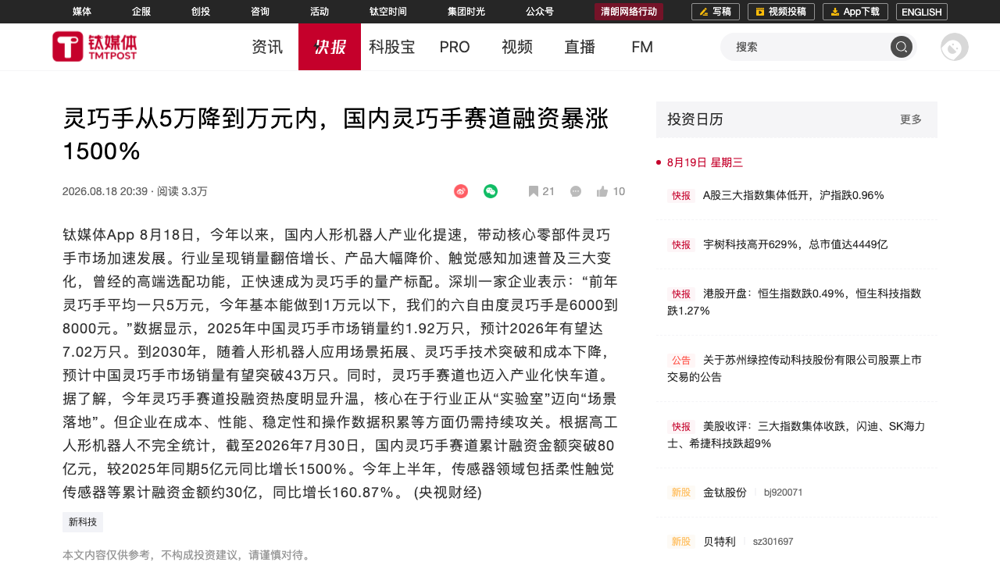
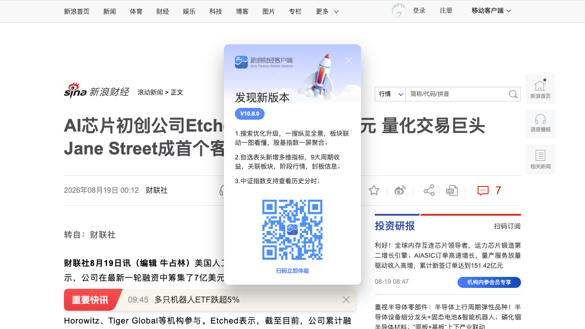
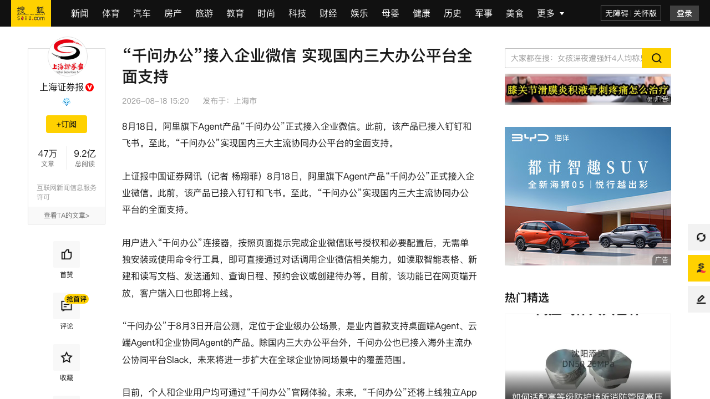
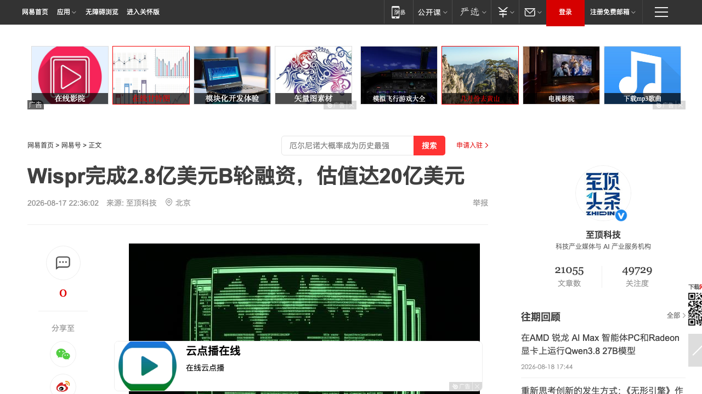
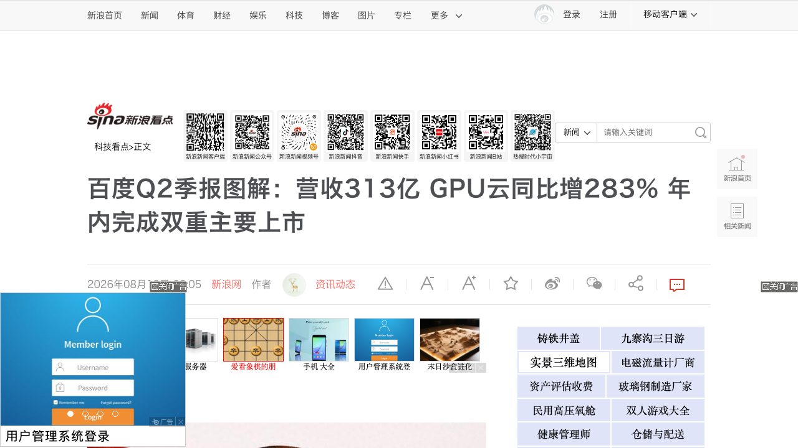

# 0819日报 | AI的「平价革命」：灵巧手两年从5万降到万元内、推理芯片公司估值4周翻倍；千问办公打通三大办公平台、语音AI独角兽All in「下一个界面」

## 今日洞察

今天的五个字：「**AI的平价革命。**」

**8月18-19日，五件事指向同一条主线：AI产业在「兑现期」（0818日报）之后，正式进入「拼价格、抢入口」的下半场——昨天是「谁先兑现」，今天是「兑现之后拼什么」：拼成本曲线、拼入口生态位。** 硬件侧，央视财经8月18日报道国内灵巧手价格两年从平均5万元/只降到万元以内（六自由度已做到6000-8000元），2025年销量1.92万只、2026年预计7.02万只、2030年有望破43万只，而截至7月底灵巧手赛道累计融资突破80亿元——较2025年同期5亿元暴涨1500%，「人形机器人的手」第一次变成量产标配（而就在今天上午，宇树科技上市首日高开629%、总市值约4449亿元——「人形机器人第一股」以7倍于发行市值的姿态登场，具身智能的「本体热」正在向「供应链热」传导）；算力侧，AI推理芯片公司Etched 8月18日宣布完成7亿美元融资、估值210亿美元（4周前刚以103亿美元估值融资，一个月翻倍），量化交易巨头Jane Street既是领投方又是首个客户（7月已在其数据中心装机），公司手握超10亿美元客户合同，而与它同一天形成鲜明对照的是推理云公司Groq估值腰斩至35亿美元（2025年9月还是69亿美元）且要用融资扩充「基于英伟达芯片」的集群——推理赛道的「自研芯片派」与「云服务派」正在被资本用脚投票；入口侧，阿里Agent产品「千问办公」8月18日正式接入企业微信，加上此前的钉钉、飞书实现国内三大协同办公平台全面支持（还已接入海外Slack）——「一个Agent住进所有IM」的多平台寄生模式成型，同日百度发布Q2财报：AI业务收入占比50%（连续两季过半）、GPU云同比+283%（连续四季度三位数增长）、昆仑芯已覆盖Kimi K3/GLM 5.2/MiniMax M3/混元Hy3四家第三方模型并筹备上市（摩根大通预计估值400-490亿美元）——中国AI商业化的「收入结构」第一次有了可核对的答案。** 资本侧同步验证「入口」与「界面」的估值逻辑：语音AI公司Wispr 8月17日完成2.8亿美元B轮融资、估值20亿美元（距上轮不足10个月），从AI听写（把话变成字）All in「语音成为下一个界面」（自研模型Canto把错误率从30%压到10%以下、成立前Alexa核心成员领衔的Interface Labs探索人机交互新形态）——当打字作为默认交互的统治地位被挑战，「界面战争」成为2026年下半年的新叙事。

**为什么这是创业者的窗口期：①「硬件平价化」是具身智能的商业化拐点——**灵巧手5万→1万以内、销量3.7倍、融资15倍（80亿 vs 5亿）三个数据同向爆发，说明人形机器人的瓶颈正在从「本体贵、造不出」转向「场景数据少、用不起」——零部件与触觉传感这类「卖水人」被资本单独定价（呼应0816日报模量科技触觉Pre-A），「让机器人用得起」的供应链创业窗口已经打开；**②「推理成本」成为AI应用生死的分水岭——**Etched低电压芯片（运算电压不到主流加速器一半、FLOPs密度数倍于竞品）+ 百度GPU云+283% + Groq估值腰斩，三件事同时指向：AI算力需求主引擎正从「训练」切换到「推理」，谁的推理成本结构更好、谁的「单位token成本」更低，谁的商业模式就成立——应用层创业者现在就该把推理成本当成产品核心指标来设计；**③「客户即股东」成为AI基础设施融资的新范式——**Jane Street 7月装机、8月领投Etched，用订单换股权、用股权锁订单——「锚定客户+锚定投资人」二合一的设计，让估值在收入之前就有了锚（Etched手握超10亿美元合同）；**④「Agent入口」进入多平台寄生阶段——**千问办公以连接器方式入驻钉钉/飞书/企业微信/Slack，与0818日报微信小微16个入口、ChatGPT变购物车合并看：AI入口的争夺从「自建入口」进入「寄生所有入口」——「对话即操作」将重写企业SaaS的操作层，「可被Agent调用」正在成为SaaS的续费理由；**⑤「语音界面」叙事被资本重估——**Wispr 10个月估值冲到20亿美元、自研语音模型+Interface Labs双轮驱动——「用嘴操作电脑」从输入法升级为操作系统级交互，语音优先（voice-first）设计应进入每个消费级AI产品的路线图。** 三个信号同样关键：宇树上市首日高开629%验证「人形机器人第一股」的稀缺溢价、逐际动力保密递交港交所IPO（拟募资数亿美元）让「机器人上市潮」从传闻变成队列、OpenAI推出ChatGPT青少年版把「年龄分层」变成消费级AI的合规标配——AI产业的资本化通道、入口格局与产品设计范式，正在同一天被重写。

---

## 1. [灵巧手从5万降到万元内：国内灵巧手赛道累计融资突破80亿元、同比暴涨1500%，触觉感知成量产标配](https://www.tmtpost.com/nictation/8107835.html)（行业洞察 / 人形机器人的「手」第一次变成量产配件——硬件平价化是具身智能从「实验室」迈向「场景落地」的商业化拐点）

🔗 链接：[钛媒体·灵巧手从5万降到万元内](https://www.tmtpost.com/nictation/8107835.html)（央视财经报道转引）

**动态**：**8月18日，央视财经报道：今年以来国内人形机器人产业化提速，带动核心零部件灵巧手市场加速发展，行业呈现「销量翻倍增长、产品大幅降价、触觉感知加速普及」三大变化，曾经的高端选配功能正快速成为量产标配。** 价格侧：深圳一家企业表示「前年灵巧手平均一只5万元，今年基本能做到1万元以下，我们的六自由度灵巧手是6000到8000元」——两年价格砍掉八成以上；销量侧：2025年中国灵巧手市场销量约1.92万只，预计2026年有望达7.02万只（约3.7倍），到2030年随着应用场景拓展、技术突破和成本下降，销量有望突破43万只；资本侧：根据高工人形机器人不完全统计，截至2026年7月30日，国内灵巧手赛道累计融资金额突破80亿元，较2025年同期5亿元同比增长1500%；今年上半年传感器领域（包括柔性触觉传感器等）累计融资金额约30亿元，同比增长160.87%。行业判断：灵巧手赛道投融资热度升温的核心，在于行业正从「实验室」迈向「场景落地」，但企业在成本、性能、稳定性和操作数据积累等方面仍需持续攻关。

**做什么的**：通俗讲，**灵巧手是「人形机器人的手」——五指可动、能抓能捏的执行末端，过去是实验室里的天价器件（一只5万元），今年正在变成万元以内的量产配件。** 三个关键信号：① **「价格-销量-融资」三螺旋同向爆发**——价格砍八成（5万→1万以内）、销量预增3.7倍（1.92万→7.02万只）、融资暴涨15倍（80亿 vs 5亿），三个数据同时反转，说明灵巧手不是「单个产品降价」，而是整个「手」的产业地位在变化：从「选配」变「标配」；② **触觉感知从「高端」变「标配」**——柔性触觉传感器融资同比增长160.87%、被写入「三大变化」之一——「会感知的手」正在成为人形机器人的默认配置，而不再是可以砍掉的成本项；③ **「场景落地」成为融资逻辑的核心关键词**——资本不再为「实验室技术」买单，而是为「能进工厂、能干活」的零部件买单——这与0818日报「人形机器人路线分化（秀肌肉 vs 干体力活）」形成呼应：干体力活需要手，手需要便宜。

**为什么值得关注**：

- **硬件平价化是具身智能的商业化拐点——「用得起」取代「造得出」成为行业分水岭。** 5万元一只的灵巧手只有实验室买得起，1万元以内、6000-8000元的六自由度灵巧手让「机器人进厂搬货、进店服务」第一次算得过来账。对创业者的启示：① 具身智能的瓶颈正在从「本体贵」转向「场景数据少」——硬件平价之后，「让机器人在真实场景里干活并积累数据」成为最值钱的能力（与0817日报觅蜂科技「具身数据荒漠」信号合并看，数据缺口会进一步放大）；② 「卖水人」逻辑被资本验证——灵巧手、触觉传感器这类零部件公司（模量科技0816日报Pre-A、本轮80亿赛道融资）正在被单独定价，做「又便宜又好用的执行器/传感器」是确定性机会；③ 参考消费电子历史：任何「从万元级降到千元级」的硬件品类都会引爆一波应用创新（智能手机普及→App经济）——机器人硬件平价化之后，「机器人应用层」是下一波创业机会带。

- **「融资暴涨1500%」背后的警示：价格战提前开打，供应链创业者的窗口是「成本+数据」双壁垒。** 融资80亿 vs 销量1.92万只——资本供给已经远超当前市场规模，灵巧手赛道必然经历一轮「产能过剩→洗牌」，价格从5万打到1万以内本身就是竞争白热化的证据。对创业者的启示：① 别只做「更便宜的灵巧手」——成本优势会被同行更快复制，真正的壁垒是「操作数据积累」（谁的机器手在真实场景干过更多活，谁的模型就更可靠）；② 央视点名的三大攻坚方向（成本、性能、稳定性、操作数据）就是产品差异化的四个抓手；③ 与0818日报宇树「组件毛利率59.36%」对照：零部件生意的毛利率可以很健康，但要在洗牌前建立「客户锁定」（绑定头部本体厂商）。

- **「机器人供应链热」正在取代「本体热」——具身智能的资本重心下移。** 宇树今日上市（首日高开629%）、灵巧手赛道融资暴涨1500%、触觉传感器+160%——「淘金热里的卖铲人」叙事全面启动。对创业者的启示：① 具身智能的资本化正在从「造机器人本体」扩散到「造机器人的器官」（手、眼、触觉、关节、云台）——每一类器官都可能跑出一家上市公司；② 与0818日报荣耀Robot Phone（2.6g电机云台、±0.005mm精度）合并看：具身供应链（电机、云台、传感器）同时吃「机器人」和「消费电子」两个市场的需求，出货通道比纯机器人零部件更宽；③ 供应链创业要算清「BOM占比账」——灵巧手在整机成本中的占比决定了它的议价空间，做到「整机越便宜、我的占比越高」的品类才是好生意。

- 对创业者的启发：**① 硬件平价化=商业化拐点，做「让机器人用得起」的供应链（手/触觉/关节）确定性最强；② 「操作数据积累」比「更便宜」更难复制，是供应链公司的真壁垒；③ 警惕产能过剩与价格战，用「客户锁定+数据飞轮」穿越洗牌；④ 具身供应链同时吃机器人与消费电子两个市场，出货通道更宽。** 跟踪三个验证点：灵巧手价格是否在2026年底跌破5000元、头部本体厂商（宇树/智元/众擎）的自研与外采比例变化、以及「机器人应用层」是否在硬件平价后迎来第一波爆发（参照智能手机App经济）。

**类比参考**：**「灵巧手的『千元机』时刻 / 从『5万元一只的实验室器件』到『万元以内的量产配件』——当机器人的手第一次变得便宜，'用得起'开始取代'造得出'成为这个行业的分水岭，而融资暴涨1500%提醒所有人：卖铲人的窗口已经打开，价格战也同时开打」**

---

## 2. [AI芯片初创公司Etched估值达210亿美元：7亿美元融资由Jane Street领投，量化巨头成首个客户并完成装机交付，手握超10亿美元合同](https://finance.sina.com.cn/roll/2026-08-19/doc-ininukpm9825537.shtml)（行业洞察 / 推理芯片的「客户即股东」模式成型——金融交易成为专用推理芯片第一个大规模付费场景，「自研芯片派」估值4周翻倍 vs 推理云公司估值腰斩）

🔗 链接：[新浪财经·Etched估值达210亿美元](https://finance.sina.com.cn/roll/2026-08-19/doc-ininukpm9825537.shtml) | [SiliconANGLE·Etched raises $700M at $21B](https://siliconangle.com/2026/08/18/inference-chip-startup-etched-raises-another-700m-at-21b-valuation/) | [网易·财联社Etched](https://www.163.com/dy/article/L4LGF8MA05198CJN.html) | [新浪财经·Groq估值腰斩至35亿美元（对照）](https://finance.sina.com.cn/tech/roll/2026-08-18/doc-ininttru0079490.shtml)

**动态**：**8月18日，AI推理芯片初创公司Etched宣布完成7亿美元新一轮融资，投后估值达210亿美元——距其7月23日以103亿美元估值完成3亿美元融资（英伟达参投）仅约4周，估值翻倍。** 本轮由Jane Street领投，Kleiner Perkins、红杉（Sequoia）、Andreessen Horowitz、Tiger Global、Bain Capital Ventures等参投；截至目前累计融资19亿美元。**Etched同时宣布完成首个客户交付：Jane Street（本轮领投方）已于7月在其数据中心安装了Etched机架**——客户合同总金额已超10亿美元，来自公共及私营AI企业和云服务提供商。技术侧：Etched的低电压math blocks（数学运算电路）以不到主流AI加速器一半的电压运行，可提供「数倍于竞品」的FLOPs密度；自研互联可把竞品需4000毫秒的通信任务压到700毫秒；还自研冷板与VRM（电压调节模块）；公司已在圣何塞总部建成2MW AI集群供潜在客户测试。CEO Gavin Uberti（2021年与两位哈佛辍学生共同创立）表示「从零做出第一个机架花了三年，下一个会快得多」；华尔街日报报道其正在挖角英伟达人才。与大多数同类初创公司不同，Etched不开发软件、专注半导体。**同日对照**：美国AI推理云独角兽Groq宣布完成3.5亿美元融资，投后估值35亿美元——较2025年9月的69亿美元估值腰斩；本轮由Disruptive领投，英伟达计划参投（已签投资意向、尚未交割），且Groq称融资将用于扩充「基于英伟达芯片」的计算集群。

**做什么的**：通俗讲，**Etched是「AI推理的专用芯片厂」——不做通用GPU、不卖软件，只做一件事：让大模型跑推理（回答问题、生成内容）时更便宜、更快。** 三个战略看点：① **低电压=高密度=推理成本革命**——运算电压砍一半、FLOPs密度翻数倍、互连通信从4000毫秒压到700毫秒，这三个数字翻译成人话就是「同样的电费和机柜，能跑更多的AI请求」——在推理需求爆发的当下，这就是芯片公司的「印钞机参数」；② **「客户即股东」的完美闭环**——Jane Street先装你的机架（验证产品）、再领投你的估值（背书价值）、还贡献第一笔合同收入——一个客户同时扮演「验货员+股东+现金牛」，这是AI基础设施融资的最优解；③ **金融交易成为专用推理芯片的第一个大规模付费场景**——量化交易对「低延迟+高吞吐」极度敏感（700ms vs 4000ms的差距就是真金白银），金融比任何行业都更早、更愿意为「专用硬件」付溢价——通用大模型推理反而是它的第二曲线。

**为什么值得关注**：

- **推理芯片的「客户即股东」范式——用订单换股权、用股权锁订单，估值在收入之前就有了锚。** Etched成立近5年、累计融资19亿美元、手握超10亿美元合同、估值210亿美元——合同金额成为估值的「锚」（合同/估值约1/20），而Jane Street既是首个客户又是领投方，等于市场用真金白银验证了「产品已装机、客户已买单」。对创业者的启示：① 基础设施类创业（芯片、算力、云）在收入放量前，融资叙事要围绕「锚定客户」设计——先拿下1-2个愿意付费试用的灯塔客户，再拿他们的订单和背书去融资，比纯讲技术参数有效得多；② 「客户即股东」结构（客户领投+老股东跟投）能同时解决「销售信任」和「融资确定性」两个问题——但要警惕客户股东绑架产品路线（你的芯片路线是否被单一客户需求锁死）；③ 与0816日报「英伟达担保缩水至1050亿美元」合并看：AI基建的资本结构正在从「巨头兜底」演进到「客户绑定」——「谁是第一个付费客户」正在取代「谁给你担保」成为估值信号。

- **金融场景率先为推理芯片付费——「低延迟+高吞吐」是专用硬件创业者的第一桶金。** 量化交易、高频风控、实时搜索这类场景对延迟极度敏感，愿意为专用芯片付溢价——Etched的700ms互连、低电压高密度，首先服务的就是Jane Street的量化交易负载。对创业者的启示：① 做AI基础设施（芯片、推理引擎、向量数据库）的团队，第一客户别盯着「通用大模型公司」，而是找「延迟敏感+预算充足」的垂直场景（金融交易、实时风控、自动驾驶）——这些场景的付费意愿和验收标准都更清晰；② 金融行业正在成为AI硬件的「尝鲜者」：从ChatGPT购物车（Synchrony）、AI交易基础设施（PandaAI 0817日报）到推理芯片装机（Etched×Jane Street）——「AI+金融」的每一个环节都在被重做，创业者可以沿着这条链找缝隙；③ 专用芯片的路线风险也要看清：一旦「为特定架构优化」变成「被架构迭代锁死」，转型成本极高——Etched自己就是从「只做Transformer专用」转向「支持多种架构」的（教训在前）。

- **「自研芯片派」vs「云服务派」被资本用脚投票——推理赛道的估值逻辑正在重写。** 同一天：Etched估值4周翻倍至210亿美元（自研低电压ASIC+客户装机），Groq估值腰斩至35亿美元（LPU云服务+要靠英伟达芯片扩集群、英伟达还挖走了它的人）——「做芯片的」比「做云的」更被看好，因为推理需求的爆发让「硬件定义成本」成为核心竞争力。对创业者的启示：① 2026年AI算力的主战场从「训练」切换到「推理」——训练是军备竞赛（巨头游戏），推理是成本竞赛（创业者可以参与）——「单位token成本」将决定AI应用的生死线，做应用的团队现在就要把推理成本纳入产品架构决策；② 与百度GPU云+283%合并看：推理算力需求在国内外同步爆发，「推理优化」（量化、蒸馏、专用硬件适配、调度）是确定性赛道；③ Groq的教训值得记：依赖单一芯片供应商（哪怕是被挖角的对象）会让估值承压——算力创业者要设计「多供应商」叙事。

- 对创业者的启发：**① 基础设施创业先拿「锚定客户」再融资，客户即股东是估值加速器；② 「低延迟+高吞吐」场景（金融/交易/风控）是专用硬件的第一个付费市场；③ 推理成本战开打，「单位token成本」是AI应用的生死线；④ 自研硬件 vs 依赖生态的路线分化正在被资本市场定价，选边要趁早。** 跟踪三个验证点：Etched「下一个机架」的量产速度与第二批客户名单、Jane Street装机后的实际吞吐数据（700ms互连在真实负载下的表现）、以及Groq估值腰斩后推理云赛道的融资环境变化。

**类比参考**：**「AI推理芯片的『客户即股东』时刻 / 从『把芯片卖给数据中心』到『让最大的客户为你领投』——当量化巨头把机架装进自己的机房、再为你的210亿美元估值背书，'算力金融化'从贷款担保演进到了股权绑定，而同日Groq的估值腰斩提醒所有人：推理赛道的选边（自研芯片 vs 云服务）正在被资本市场用脚投票」**

---

## 3. [「千问办公」接入企业微信：阿里Agent产品实现国内三大协同办公平台全面支持，对话即可读写文档、预约会议、创建待办](https://www.sohu.com/a/1064388271_120988576)（新产品 / AI办公Agent进入「多平台寄生」阶段——一个Agent住进所有IM，「对话即操作」重写企业SaaS的操作层）

🔗 链接：[搜狐·上海证券报「千问办公」接入企业微信](https://www.sohu.com/a/1064388271_120988576) | [网易·财联社千问办公接入企业微信](https://m.163.com/dy/article/L4KDEB3L0550B1DU.html) | [凤凰网·阿里盘中涨近5%](https://h5.ifeng.com/c/vivoArticle/v002qsfEhaVIbLdFsTmF3jqng9iwjOLyJCcAB5dksBNnzVU__?isNews=1&showComments=0) | [雅虎财经·千問辦公接入企業微信](https://hk.finance.yahoo.com/news/%E9%98%BF%E9%87%8C-09988-hk-%E6%97%97%E4%B8%8B%E5%8D%83%E5%95%8F%E8%BE%A6%E5%85%AC%E6%8E%A5%E5%85%A5%E4%BC%81%E6%A5%AD%E5%BE%AE%E4%BF%A1-072239851.html)

**动态**：**8月18日，阿里旗下Agent产品「千问办公」正式接入企业微信。此前该产品已接入钉钉和飞书——至此，「千问办公」实现国内三大主流协同办公平台的全面支持，消息发布后阿里盘中一度涨近5%。** 使用方式：用户进入「千问办公」连接器，按页面提示完成企业微信账号授权和必要配置后，无需单独安装或使用命令行工具，即可直接通过对话调用企业微信相关能力——读取智能表格、新建和读写文档、发送通知、查询日程、预约会议、创建待办等；目前该功能已在网页端开放，客户端入口即将上线。产品背景：「千问办公」于8月3日开启公测，定位于企业级办公场景，是业内首款支持桌面端Agent、云端Agent和企业协同Agent的产品；除国内三大办公平台外，也已接入海外主流办公协同平台Slack；未来还将上线独立App端并推出国际版，覆盖更多办公场景。此前消息：千问办公已初步打通钉钉IM，Qwen3.8的API已上线千问AI平台并接入千问办公。

**做什么的**：通俗讲，**「千问办公」是阿里打造的一个「数字员工」——它不住在任何一个App里，而是以连接器方式住进所有IM（钉钉、飞书、企业微信、Slack），你只要在对话框里说「读一下这张表」「约个会」，它就替你把活干了。** 三个战略看点：① **「一个Agent住进所有IM」的多平台寄生模式**——不跟钉钉/飞书/企微抢入口，而是把Agent做成「可插拔连接器」入驻所有对手的IM——这是AI办公入口争夺的「打不过就加入」策略，也意味着Agent的分发逻辑从「平台内置」转向「连接器扩散」；② **「对话即操作」第一次跨平台落地**——读取智能表格、新建文档、发通知、约会议、建待办，这些原本需要打开多个SaaS、多点几次的操作被压缩进一个对话框，企业办公的交互范式从「人找工具」变成「Agent替人干活」；③ **三种Agent形态集于一身（桌面端+云端+企业协同）**——业内首款，说明阿里的打法是「全形态覆盖」：桌面端吃掉个人生产力场景、云端吃掉网页场景、企业协同吃掉IM场景。

**为什么值得关注**：

- **企业IM成为Agent的「默认入口」——AI办公入口争夺战进入第二阶段：从「自建入口」到「寄生所有入口」。** 百度有库库AI（独立端，0816日报）、百度搭子、秒哒矩阵，腾讯有微信小微（16个AI入口，0818日报），阿里则选择「连接器寄生」——把Agent铺进所有对手的IM。对创业者的启示：① AI办公不必自建入口——「跨平台Agent连接器」是更轻的卡位（千问办公用连接器模式4周内从公测到接入三大平台，速度远快于自建生态）；② 企业微信是中国企业IM最大的流量池之一（直接连接微信生态），Agent在企微里能读写文档、预约会议，意味着「办公自动化」的渗透速度会远超钉钉/飞书时代——围绕企微做「Agent技能/连接器」的服务商有红利；③ 与0816日报库库AI（月活破1亿）合并看：AI办公的「入口之争」正在从「谁能做出好产品」变成「谁能占据办公者的默认位置」——自建入口与寄生入口两条路线会长期并存。

- **「对话即操作」重写SaaS的操作层——「可被Agent调用」正在成为SaaS的续费理由。** 千问办公通过连接器调用企业微信的智能表格、文档、日程、会议——这些能力背后是一个个SaaS应用，而Agent成了它们的「统一操作界面」。对创业者的启示：① 你的SaaS是否「可被Agent调用」将决定它在Agent时代的存活率——API化、结构化数据、可编程权限是标配，别等巨头来「接入」你时才发现接口一团乱；② 应用层创业者的护城河正在从「界面」转向「数据+工作流」——当所有人都能通过Agent操作文档/表格时，谁掌握行业数据和工作流Know-how，谁就不可替代；③ 与0818日报ChatGPT购物车（交易入口）、0817日报OpenAI多智能体（自动委派）合并看：AI正在把「应用」变成「技能」，把「技能商店」变成新生态位——提前把产品拆成「可被Agent调用的技能单元」是低成本卡位。

- **BAT的「办公Agent」军备竞赛全面开打——巨头教育市场，创业者的机会在垂直场景。** 百度（搭子/库库AI/秒哒/伐谋矩阵）、腾讯（小微+企微生态）、阿里（千问办公三平台通吃）——三大厂同月加码AI办公（百度8月刚完成AI办公产品线整合，0819日报百度Q2条目）。对创业者的启示：① 别在通用办公赛道与巨头硬碰——垂直行业的「办公+业务」一体化Agent（财务、法务、医疗文书、跨境电商运营）才是创业空间，巨头做「通用入口」、你做「行业纵深」；② 巨头正在教育市场：库库AI MAU超2500万、百度搭子MAU环比+1063%——用户「让AI干活」的习惯一旦养成，垂直玩家的获客成本会大幅下降，现在就要把「行业工作流数据」攒起来；③ 注意千问办公「接入Slack+未来国际版」——中国AI办公产品开始出海，海外企业IM生态（Slack/Teams）的Agent连接器可能是中国团队的差异化机会。

- 对创业者的启发：**① AI办公进入「多平台寄生」阶段，「跨平台Agent连接器」是比自建入口更轻的卡位；② 把产品做成「可被Agent调用的技能单元」——API化、结构化数据、可编程权限是Agent时代的SaaS标配；③ 别与巨头抢通用入口，做垂直行业「办公+业务」一体化Agent；④ 中国AI办公产品出海（Slack/Teams连接器）是差异化窗口。** 跟踪三个验证点：千问办公接入企微后的企业用户数与任务调用量、企业微信生态是否出现「Agent技能」第三方开发者、以及百度/阿里/腾讯「办公Agent」的付费转化率对比。

**类比参考**：**「办公Agent的『多平台寄生』时刻 / 从『每个IM里长一个助手』到『一个Agent住进所有IM』——当千问办公以连接器方式入驻钉钉、飞书、企业微信甚至Slack，'对话即操作'第一次成为跨平台的企业办公现实，而Agent的分发逻辑也从'平台内置'转向'连接器扩散'——谁占据办公者的默认位置，谁就重写企业软件的分发成本」**

---

## 4. [语音AI公司Wispr完成2.8亿美元B轮融资、估值20亿美元：Menlo Ventures领投，发布自研模型Canto把错误率从30%压到10%以下，All in「语音成为下一个界面」](https://www.163.com/dy/article/L4IMPLLD05118UGF.html)（融资 / 语音从「输入法」升级为「操作系统级交互」——10个月估值冲到20亿美元，「voice-first」进入消费级AI产品路线图）

🔗 链接：[网易·Wispr完成2.8亿美元B轮融资](https://www.163.com/dy/article/L4IMPLLD05118UGF.html) | [TechCrunch·Wispr raises $280M at $2B valuation](https://techcrunch.com/2026/08/17/wispr-raises-280m-at-2b-valuation-as-it-looks-beyond-dictation/) | [鉅亨網·語音AI公司Wispr完成B輪融資](https://m.cnyes.com/news/id/6579605) | [BlockBeats·自研模型Canto让识别错误率大降超4倍](https://blockweeks.com/news/301996)

**动态**：**8月17日，AI语音听写工具公司Wispr宣布完成2.8亿美元B轮融资，估值20亿美元，由Menlo Ventures领投；Notable Capital、NEA、Neo Ventures、8VC、MVP Ventures等老股东加注，Acrew、Forerunner、Goodwater、Peak XV、Together Fund、PLUS Capital等新投资方入局。** 公司累计融资达3.61亿美元，距上一轮（2025年11月2500万美元）不足10个月。**产品与模型**：以AI听写工具Wispr Flow闻名，平台将语音转为文字、帮助用户创作内容、交流想法并跨软件工作；去年11月上线安卓版，并在印度、英国等市场扩张。融资消息公布同时，公司发布新语音模型Canto——此前数周多名用户吐槽Flow听写输出质量下滑，Canto宣称把错误率从约30%压降至10%以下（降幅超4倍）。**场景扩张**：新推出的会议笔记工具（能生成摘要和待办事项）正与Granola、Fireflies、Read AI等竞争，未来有望与更多工具集成，支持文档更新、内容创建、邮件草稿生成；与Oasis智能戒指等硬件厂商合作，让用户无需大声说话即可语音输入。**界面探索**：上个月成立Wispr Interface Labs，由亚马逊Alexa早期核心开发成员Ariya Rastrow领导，目标是探索人机交互的全新界面形态。**竞争背景**：语音听写赛道竞争激烈，Willow、Monologue、Aqua、Superwhisper等应用涌入，还有开发者推出免费或低价工具。

**做什么的**：通俗讲，**Wispr是「语音界的『下一个界面』赌徒」——从「把话变成字」（AI听写）这个高频工具切入，正在把语音变成「操作电脑的方式」（会议、写作、跨软件工作），并用自研模型（Canto）和实验室（Interface Labs）押注「语音即交互」的终局。** 三个关键信号：① **听写是入口，会议是场景，Interface Labs是未来**——典型的「从高频工具到平台再到范式」的路径：先用听写建立用户习惯，再用会议纪要切入B端付费，最后用实验室赌「下一个界面」；② **自研模型=质量与成本的护城河**——Canto把错误率从30%压到10%以下，在语音这类「准确率+延迟敏感」场景，自研模型与调API的体验差距是生死线，也是毛利的分水岭；③ **竞品涌入+免费工具夹击**——C端语音工具的窗口正在关闭，Wispr的应对是「场景蔓延+硬件联动」：往会议、写作、邮件扩张，与智能戒指等硬件绑定，从「工具」升级为「交互平台」。

**为什么值得关注**：

- **10个月估值冲到20亿美元——「语音界面」叙事被资本重估，「voice-first」进入产品路线图。** 上一轮2500万美元（2025年11月）到本轮2.8亿美元/20亿估值，不足10个月——资本愿意为「语音成为下一个界面」的叙事付高价。对创业者的启示：① 语音不是「输入法」，而是「操作系统级的交互入口」——谁能定义「用嘴操作电脑」的默认体验，谁就掌握下一代分发（对照：键盘+鼠标定义了PC时代，触摸屏定义了移动时代，语音/多模态正在定义Agent时代）；② Wispr的路径值得抄作业：先用高频工具（听写）抢用户习惯，再向场景（会议）要收入，最后用实验室押范式——「高频入口→场景变现→范式赌注」三段式比直接做「语音操作系统」更稳；③ 与0817日报OpenAI Codex「告别手动选模型」合并看：交互范式正在从「打字」向「说话」迁移——消费级AI产品（尤其面向C端/办公场景）现在就该把「语音优先」设计纳入路线图，而不是事后加语音功能。

- **「模型自研」成为AI应用公司的分水岭——错误率30%→10%以下背后是数据飞轮。** Canto发布的前提是Wispr累计3.61亿美元融资——自研模型很贵，但语音赛道的竞争本质是「模型质量×数据飞轮」：用户每一次语音修正都在喂养模型。对创业者的启示：① 自研模型的时机选择很关键——Wispr是在融到3.61亿美元之后才发布自研模型，早期靠调API起量、后期用融资换自研，「先API后自研」是AI应用公司的标准节奏；② 在「延迟+准确率敏感」的场景（语音、实时翻译、自动驾驶、金融交易），模型能力直接决定产品生死——这类创业的融资叙事要围绕「自研模型+数据飞轮」讲；③ 用户语音修正数据是语音公司最深的资产——产品设计上要刻意收集「纠正信号」（让用户改起来更方便），这是数据壁垒的源头。

- **会议纪要已是红海，Wispr的差异化是「场景蔓延+跨软件执行」——AI应用的「入口蔓延」逻辑。** Granola、Fireflies、Read AI已把会议纪要打成红海，Wispr的牌是「从听写延伸到会议+跨软件执行」（文档更新、邮件草稿）。对创业者的启示：① AI应用「场景蔓延」是常态——守住一个高频入口（听写），向相邻场景（会议、写作、邮件）扩张，比重新教育用户便宜得多；② 但「蔓延」要有主线——Wispr的主线是「语音」：所有扩张场景都是语音交互的自然延伸，而不是什么都做；③ 与硬件联动（Oasis智能戒指）是语音赛道的独特壁垒——「无声输入」（不用大声说话）场景（办公室、公共场所、安静环境）是纯软件语音工具覆盖不到的，软硬结合是差异化方向（呼应0818日报荣耀Robot Phone的「软硬结合Agent载体」）。

- 对创业者的启发：**① 「voice-first」应进入消费级AI产品路线图，语音是Agent时代的默认交互之一；② 「高频入口→场景变现→范式赌注」三段式是AI应用公司的成长路径；③ 「先API后自研」的节奏+刻意收集纠正信号构建数据飞轮；④ 场景蔓延要有主线，软硬结合（无声输入）是语音赛道的独特壁垒。** 跟踪三个验证点：Canto上线后Wispr Flow的留存与付费转化变化、会议笔记工具对Granola/Fireflies的份额侵蚀、以及Interface Labs是否在2026年内发布「语音操作电脑」的突破性Demo。

**类比参考**：**「语音AI的『界面赌注』时刻 / 从『把话变成字』到『用嘴操作一切』——当一家听写公司用2.8亿美元押注'语音是下一个界面'、发布自研模型把错误率砍掉三分之二、并让前Alexa核心成员带队探索人机交互新形态，'打字'作为默认交互的统治地位第一次被认真挑战——而10个月估值翻到20亿美元说明，资本已经为这场赌注开始下注」**

---

## 5. [百度Q2财报：AI业务收入占比50%连续两季过半、GPU云同比增283%、昆仑芯覆盖Kimi/GLM/MiniMax/混元四家模型并筹备上市](https://k.sina.com.cn/article_5953189932_162d6782c06704vk22.html)（行业洞察 / 中国AI商业化的第一份「结构体检报告」——算力收入爆发、应用收入平淡，「应用层增收」正是创业公司的机会）

🔗 链接：[新浪·雷递百度Q2季报图解](https://k.sina.com.cn/article_5953189932_162d6782c06704vk22.html) | [每日经济新闻·百度Q2 AI业务收入占比过半](https://www.nbd.com.cn/articles/2026-08-18/4545417.html) | [钛媒体·百度Q2总营收313亿](https://www.tmtpost.com/nictation/8107482.html)

**动态**：**8月18日晚，百度发布2026年第二季度财报：总营收313.25亿元（同比-4%）；一般性业务收入252亿元，其中AI业务收入占比50%，已连续两季占比过半。** 结构数据：核心AI新业务收入125亿元（同比+25%），占总收入40%；AI云基础设施收入73亿元（+50%），其中GPU云同比+283%，连续四个季度实现三位数增长（上季度为+184%）；AI应用收入25亿元（+3%）；AI原生营销服务收入26亿元。AI办公：8月完成AI办公产品线新一轮整合，形成百度搭子、库库AI、秒哒等为代表的AI办公产品矩阵——百度搭子7月MAU环比增长1063.79%、库库AI办公MAU超2500万、秒哒发布3.5版本完成六大能力升级、自我演化智能体百度伐谋已有3000家企业申请试用。昆仑芯：李彦宏在财报电话会表示，昆仑芯推理吞吐量和整体算力效率进一步提升，Q2已覆盖Kimi K3、GLM 5.2、MiniMax M3、混元Hy3等模型更新版本；昆仑芯已完成三代AI芯片的研发和商业化，未来将推出面向大规模推理优化的M100及未来的M300；据雷递报道，昆仑芯正在筹备上市，摩根大通预计其估值400-490亿美元。资本动作：百度拟于8月26日召开股东大会批准双重主要上市转换，预计年内生效；9月纳入港股通。净利：归属公司净利润23亿元，Non-GAAP净利润26亿元。

**做什么的**：通俗讲，**百度Q2是「中国AI商业化的第一份体检报告」——AI收入占比过半（连续两季）、GPU云三位数增长、昆仑芯成为覆盖四家国产模型的中立算力底座，中国AI的「收入结构」第一次清晰可见。** 三个关键信号：① **「AI收入占比50%」是里程碑**——百度从「搜索引擎公司」正式变成「AI收入过半的公司」，AI转型叙事第一次被财报数据确认（不再只是故事）；② **GPU云+283%说明中国推理算力需求真实爆发**——连续四个季度三位数增长且增速加快（184%→283%），这不是补贴出来的数字，是真实需求（与Etched「推理成本战」、Groq「推理云」同一天出现在新闻里不是巧合）；③ **昆仑芯同时支持Kimi/GLM/MiniMax/混元——国产芯片正在成为「中立底座」**——大模型厂商不再只绑英伟达，「芯片+多模型适配」的生态位被百度占了先手。

**为什么值得关注**：

- **「AI收入占比过半」连续两季——中国AI商业化进入「结构验证期」，但结构里藏着创业者的机会。** 百度AI收入占比50%说明「AI To B付费」在中国已经成立；但拆开看：AI云基础设施73亿（+50%）与GPU云（+283%）是增长引擎，而AI应用收入25亿仅占总营收8%、同比仅+3%——「算力收入爆发、应用收入平淡」是中国AI商业化的典型结构。对创业者的启示：① 巨头的AI收入结构就是行业温度计——算力已经被验证能收钱，应用层还是洼地——「巨头算力强、应用弱」恰恰是创业公司的机会（应用层的AI产品定价可以更自信，因为需求真实存在）；② AI应用收入+3%说明「通用AI应用」的付费还在早期——做「垂直场景+强工作流」的应用（而不是又一个通用助手）才是差异化；③ 与0818日报Higgsfield（企业客户收入占比反转）、Anthropic（年化650亿美元）合并看：AI应用商业化的全球规律是「B端先付费」——中国创业者应默认把收入引擎设计在企业端。

- **昆仑芯覆盖四家第三方模型+筹备上市（摩根大通预计估值400-490亿美元）——「中立算力底座」是稀缺生态位。** 昆仑芯Q2同时支持Kimi K3、GLM 5.2、MiniMax M3、混元Hy3——国产大模型的「适配清单」就是国产芯片的商业版图；而摩根大通给出400-490亿美元估值预期，说明「卖铲人」在中国同样被重估。对创业者的启示：① 国产推理芯片的「模型适配」是生态卡位战——做「模型+芯片」适配中间层（量化、编译、调度、推理框架）的公司吃到确定性红利，因为每一家新模型发布都会产生适配需求；② 与0816日报算力金融化、0818日报英伟达1050亿担保合并看：中国算力走「自给+金融化」双轮驱动，芯片估值（昆仑芯400-490亿美元）与「Token贷」说明中国AI基建的资本化路径已经打通；③ 「中立底座」的启示：在巨头林立的市场里，「谁都能用」的第三方基础设施（芯片、数据、模型网关）比「站队某一家」更值钱——参考Stripe/OpenRouter被7亿美元收购传闻（AI网关的中立价值）。

- **AI办公成为BAT主战场——百度用「产品矩阵」打法（搭子/库库AI/秒哒/伐谋），与千问办公的「连接器寄生」形成路线对照。** 百度搭子7月MAU环比+1063.79%、库库AI办公MAU超2500万、秒哒3.5、伐谋3000家企业试用——百度选择了「多产品矩阵+独立入口」路线，阿里千问办公选择「连接器寄生」路线（今日另一条目）。对创业者的启示：① 巨头两条路线（自建矩阵 vs 寄生连接器）会长期并存，AI办公市场正在被巨头教育成熟——库库AI 2500万MAU说明用户习惯正在养成，市场成熟后垂直玩家（行业Agent）收割；② 注意「AI原生营销服务收入26亿」——百度的AI广告（营销服务）已经规模化，做「AI营销工具」的创业者要关注巨头的定价与分发（Higgsfield 0818日报的B端营销故事在中国也有对应物）；③ 与0816日报库库AI（月活破亿）合并看：百度AI办公矩阵是「入口争夺战」的中国样本，创业者要么做垂直场景、要么做生态服务商，别在通用入口硬碰。

- 对创业者的启发：**① 中国AI「算力强、应用弱」的结构=应用层创业窗口，B端付费已成立、定价可自信；② 「中立底座」生态位稀缺——模型+芯片适配中间层吃确定性红利；③ AI办公被巨头教育成熟，垂直行业Agent是创业空间；④ 巨头财报的AI收入结构是行业温度计，每月跟踪。** 跟踪三个验证点：昆仑芯上市进度与最终估值（vs 摩根大通400-490亿美元预期）、百度AI应用收入何时从+3%提速、以及AI办公「自建矩阵 vs 连接器寄生」两条路线谁先跑通付费闭环。

**类比参考**：**「中国AI商业化的『过半数』时刻 / 从『AI是百度的故事』到『AI占百度收入的一半』——当一家互联网巨头的财报第一次给出'AI收入占比50%、GPU云增速283%、国产芯片服务四家模型'的结构化答案，'中国AI到底赚不赚钱'第一次有了可核对的账本——而账本上'算力爆发、应用平淡'的落差，正是创业公司最值得盯的位置」**

---

## 值得重点跟踪的 3 个信号

1. **宇树科技上市首日高开629%、总市值约4449亿元——A股「人形机器人第一股」正式登场，7倍于发行市值开盘（续报：0818日报记录其上市公告，今日新增首日表现）。** 8月19日开盘：宇树科技（688836.SH）高开629%，总市值达4449亿元（发行价150.8元/股、发行后市值约609.93亿元）；富途显示盘前合约价一度较发行价上涨约6.7倍；另有报道称开盘涨幅一度达488.61%、中一签浮盈超45万元——「人形机器人第一股」首日即被市场爆炒。**对创业者的建议：① 「第一股」的稀缺溢价兑现（发行市值609.93亿→开盘市值约4449亿，约7倍），但219倍发行市盈率+首日爆炒意味着「以盈利验成色」的产业大考只会更严——二级市场已给所有具身智能公司立了一个「宇树锚」，后续IPO（约50家在途）的定价都会参照它；② 与今日灵巧手融资暴涨1500%合并看：具身智能的「本体热」正在向「供应链热」传导，资本重心下移；③ 上市首日暴涨≠长期价值，跟踪宇树「超人」量产计划与海外订单（其2025年人形出货5511台、全球市占率32.4%）的兑现节奏。（来源：https://www.tmtpost.com/nictation/8108240.html ）

2. **逐际动力保密递交港交所IPO、拟募资数亿美元——「机器人上市潮」从传闻变成队列（与宇树今日A股上市同周发生）。** 8月18日：阿里巴巴投资的机器人制造商逐际动力已以保密形式提交香港IPO申请，拟募资数亿美元；该公司7月刚完成2亿美元IPO前融资，估值150亿元人民币（22亿美元）；此前已有消息称星动纪元也在筹备赴港IPO。**对创业者的建议：① 港股成为机器人公司IPO主战场（A股科创板+港股双通道），「上市预期」正在重塑一级市场估值锚——Pre-IPO轮融资谈判有了参照系，但也意味着「上市前估值虚高」的风险（对照今日Groq估值腰斩）；② 阿里系在机器人赛道密集布局（逐际动力+此前投资），产业资本的「机器人组合拳」（算力+云+终端+机器人）值得研究——与0818日报DeepSeek战配宇树合并看，「大模型厂商×机器人本体」的绑定正在成为常态；③ 机器人IPO潮的底层逻辑是「场景落地预期」——逐际动力主打足式机器人+工业场景，与宇树「量产+成本」路线一致，「能干活」比「能表演」更受资本市场认可。（来源：https://www.tmtpost.com/nictation/8107815.html ）

3. **OpenAI推出ChatGPT青少年版——AI产品的「年龄分层」从合规要求变成标配设计。** 8月18日：OpenAI宣布推出ChatGPT青少年版——若系统判断用户未满18岁，或用户自行声明年龄在13至17岁之间，将自动将其切换至ChatGPT青少年版。**对创业者的建议：① 面向未成年人的AI产品第一次有了「巨头样板」——年龄识别（系统判断+用户声明双通道）、自动切换、内容分级将成为消费级AI的合规标配，做C端AI（教育、陪伴、社交、健康）的团队应把「年龄分层」设计进产品架构的第一天，而不是事后打补丁（补丁的合规成本与口碑代价都更高）；② 「系统判断年龄」意味着消费级AI要从第一天设计「可验证的用户身份信号」（行为模式、内容偏好、设备信号），这既是合规能力也是用户分层运营能力；③ 与0818日报ChatGPT购物车（交易入口）、0817日报微信小微16个入口合并看：OpenAI正在用「产品分级」扩大用户盘（未成年人=下一代用户），入口之争已延伸到年龄维度——谁能安全地服务未成年人，谁就拿到未来十年的用户心智。（来源：https://www.tmtpost.com/nictation/8107748.html ）
