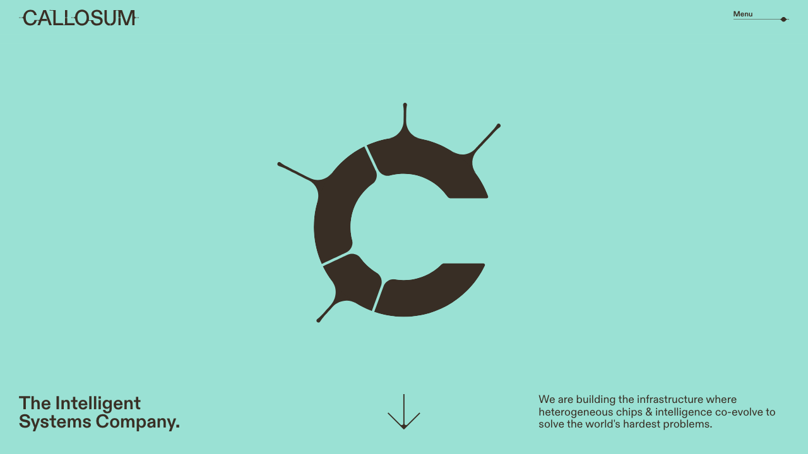
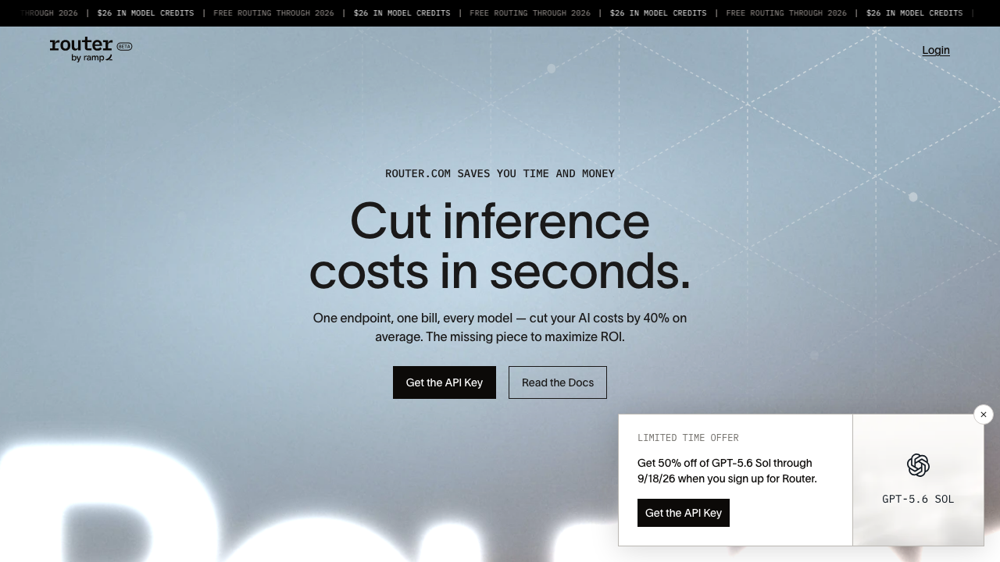
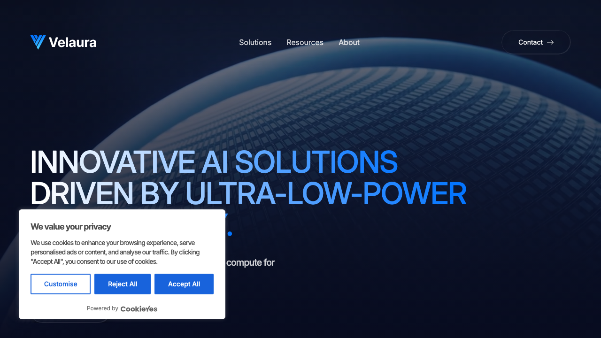
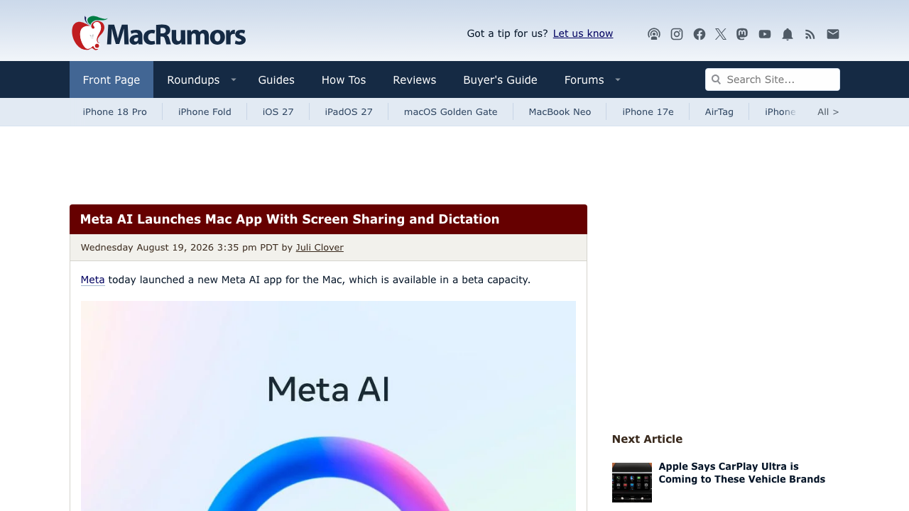
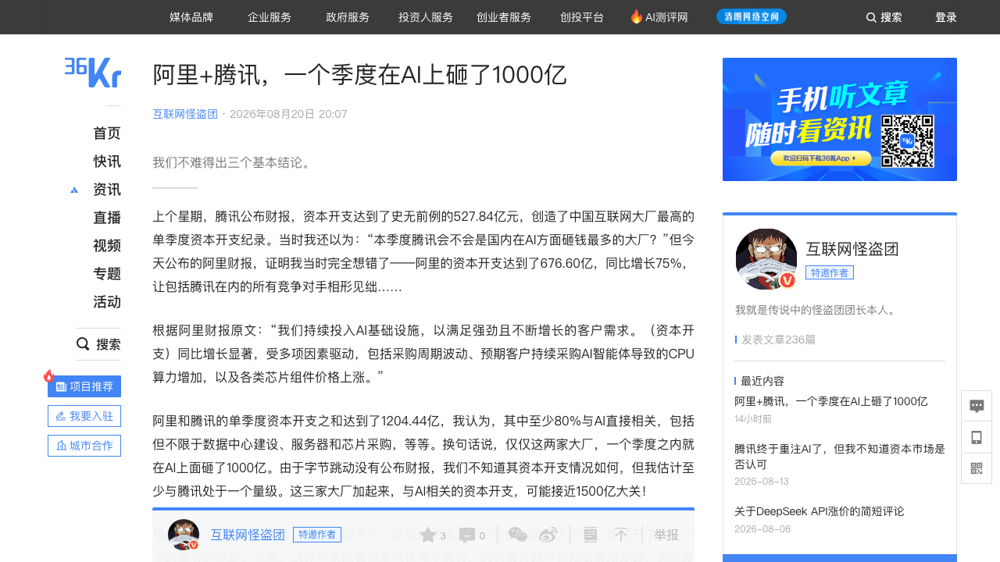

# 0821日报 | AI的「路由与军备」时刻：算力路由公司种子轮融1亿美元获英国主权AI基金首投、金融科技公司下场做模型「收费站」、超低功耗芯片公司A轮即独角兽、Meta AI上Mac抢语音入口、阿里腾讯单季AI资本开支超千亿

## 今日洞察

今天的五个字：「**AI的『路由与军备』。**」

**8月20-21日，五件事指向同一条主线：AI竞争正在同时向「每一层基础设施」蔓延——算力被路由、资本被军备、入口被语音重写。** 软件侧，伦敦AI基础设施公司Callosum 8月20日宣布完成1亿美元种子轮（Atomico领投，Plural、DCVC、英国主权AI基金参与）——这是英国政府5亿英镑主权AI基金的「首笔披露投资」，公司也被列入英国11亿英镑AI硬件计划；它的产品是把AI工作负载拆成小任务、再路由到「最合适的模型+芯片」的「可编程异构」平台（同日官宣与Cerebras、韩国Rebellions战略合作），并刷新欧洲AI基础设施种子轮纪录——「算力路由」第一次被主权基金和国家产业政策点名；同日，美国企业支出管理平台Ramp（6月刚以440亿美元估值融7.5亿美元）发布自研AI模型路由服务Router（router.com）——支持OpenAI/Anthropic/DeepSeek/Moonshot/MiniMax/Nvidia/xAI/Z.ai七家以上模型、按「flex用量偏好/基准分数/难题优先」等策略自动路由、仪表盘透明展示token花费与延迟，2026年底前免费并送26美元额度，而Ramp说自己内部用这个路由器已经三年——紧随Stripe 75亿美元收购OpenRouter（0820日报），「模型路由」正在成为有分发渠道的科技公司的新收费站；硬件侧，超低功耗AI芯片公司Velaura AI的1.1亿美元A轮（估值超10亿美元，Seligman Ventures领投、Samsung Catalyst Fund/Mayfield/StepStone等跟投）8月18日官宣后，8月20日引爆VC圈「A轮该不该带独角兽估值」的争论（Value Add Pulse发文《为什么我对新的10亿美元级A轮感到警惕》）——它的Titan Core芯片IP号称每瓦性能提升2-4倍、已部署超3000万颗ASIC，押注「AI的下一个瓶颈不是GPU数量、而是电网能养得起多少GPU」；产品侧，Meta 8月20日发布Meta AI Mac应用——系统级听写（Muse Spark模型驱动、跨所有App，直接对标Wispr Flow/Superwhisper/Monologue，Google上月刚给Gemini Mac加了同样的功能）+「看屏幕回答问题」+面向商家的工具（连接Instagram/Facebook账号、Meta广告、Google Workspace，生成提案deck/文档/表格）——「语音优先」从创业公司叙事变成巨头Mac端默认入口；资本侧，36氪8月20日刊发互联网怪盗团分析：阿里Q2资本开支676.60亿元（同比+75%）、腾讯527.84亿元（中国互联网史上最高单季纪录、占收入26%、远超市场预期的321.4亿），两家合计1204.44亿元、其中至少80%与AI直接相关——仅阿里腾讯一个季度就在AI上砸了约1000亿元（若计入字节跳动，三家可能接近1500亿），而代价是腾讯自由现金流首次转负（-138亿）、阿里-446.7亿（-138亿是腾讯的，阿里-446.7亿），回购大幅缩水（腾讯上半年回购244亿、同比-1/3；阿里上季仅回购1.6亿美元）——「AI军备竞赛进入绝大部分人负担不起的阶段」第一次有了可核对的账单。

**为什么这是创业者的窗口期：①「算力路由」正在成为AI基础设施新的一层——**Callosum（任务级路由）与Ramp Router（模型级路由）两天内先后出现，加上Stripe收购OpenRouter（0820）、Fractile×Anthropic「客户锚定」（0820）、Etched×Jane Street（0819）——「谁把任务路由到最便宜的模型+芯片」正在被独立定价，模型路由/推理网关/用量监控这些「路由层」组件是AI应用创业者的确定性基建需求，「单位token成本」第一次有了工程化的抓手；**②「主权AI基金」开始下场，欧洲AI基础设施获得新钱——**英国5亿英镑主权AI基金首投Callosum、11亿英镑AI硬件计划点名，「国家资本+中立路由层+多芯片适配」的组合说明：主权算力叙事偏爱「不站队任何单一模型/芯片」的基础设施——做中立编排层的团队可以主动对接国家基金与产业政策；**③「A轮即独角兽」与「电力瓶颈」同时被定价——**Velaura以1.1亿美元A轮估值破10亿（芯片公司资本密集+人才/产能争夺让「传统阶梯」太慢），而它的卖点「每瓦性能2-4倍」直指AI数据中心的新瓶颈：电网容量——「每瓦算力」正在成为芯片与数据中心的共同KPI，做能效优化（芯片、散热、调度、虚拟化）的团队吃到结构性红利；**④「金融科技公司变成AI收费站」——**Ramp从支出管理切入模型路由（免费+透明token成本+自家440亿估值客户群），与Stripe收购OpenRouter合并看：拥有企业分发渠道的公司正在抢占「AI推理分发」入口——SaaS/金融科技公司应把「模型路由+用量监控」做成产品能力，而独立路由层创业者的窗口正被巨头与渠道商两头挤压；**⑤「语音优先」进入巨头默认入口+中国资本开支军备的现实——**Meta AI Mac系统级听写（对标Wispr）验证「voice-first」从创业叙事变成巨头标配，创业公司要么做垂直语音场景、要么做巨头不做的「无声输入/硬件联动」；而阿里+腾讯单季超千亿资本开支说明「低成本弯道超车」叙事不成立——大厂的钱全部流向算力与存储，「卖水人」（算力、存储、能源、路由）确定性最强，应用层创业者则要默认与「巨头生态」共存：做垂直场景Agent、做巨头连接器生态里的技能插件，而不是与巨头抢通用入口。** 三个信号同样关键：ChatGPT推出Apple Messages插件（8月20日，可代发/删除/搜索iMessage，本地运行不建索引）——AI开始接管个人通信入口；Ramp数据（7万+美国企业客户）显示OpenAI在企业份额上开始追赶Anthropic（Anthropic近44% vs OpenAI近40%，但Q3至今OpenAI增速更快）——「企业AI支出粘性」第一次有了第三方数据质疑；清华系AI Agent公司独到科技8月20日宣布获赛富领投新一轮融资，发布「业务世界的Agent编译器」DLM-AOP——中国Agent落地从「基础模型比拼」进入「把业务意图编译成可上岗Agent」的深水区。

---

## 1. [伦敦AI基础设施公司Callosum完成1亿美元种子轮：Atomico领投，英国主权AI基金「首笔披露投资」，打造把任务路由到最合适模型与芯片的「可编程异构」平台](https://dealroom.co/news/145986-callosum-raises-100m-in-one-of-europes-largest-seed-rounds/)（融资 / 「算力路由」被主权基金和国家产业政策点名——不站队任何单一模型/芯片的中立编排层，成为欧洲AI基础设施的新宠）

🔗 链接：[Dealroom·Callosum raises $100M in one of Europe's largest seed rounds](https://dealroom.co/news/145986-callosum-raises-100m-in-one-of-europes-largest-seed-rounds/) | [Sifted·Callosum raises $100m led by Atomico](https://sifted.eu/articles/callosum-raise-atomico-plural-uk-sovereign-ai) | [Bloomberg·AI Startup Callosum Raises $100 Million](https://www.bloomberg.com/news/articles/2026-08-20/ai-startup-callosum-raises-100-million-to-make-ai-tasks-cheaper) | [TechStartups·UK AI startup Callosum raises $100M](https://techstartups.com/2026/08/20/uk-ai-startup-callosum-raises-100m-to-rethink-how-ai-uses-models-and-chips-backed-by-sovereign-ai-fund/) | [Callosum官方博客](https://www.callosum.com/blog/seed-round)

**动态**：**8月20日，伦敦AI基础设施创业公司Callosum宣布完成1亿美元种子轮融资，由Atomico领投，Plural、DCVC与英国主权AI基金（UK Sovereign AI Fund）参与，另有其他机构与天使投资人。** 三个关键背景：① **这是英国政府5亿英镑「主权AI基金」的首笔披露投资**，公司同时被列入英国11亿英镑AI硬件计划（扶持本土芯片公司）；英国AI大臣Kanishka Narayan在声明中表示「AI离不开芯片，而成功不仅取决于能否获得芯片，更取决于能否尽可能高效地使用它们」；② **公司2024年由剑桥博士Danyal Akarca与Jascha Achterberg创立**，产品是「可编程异构」（programmable heterogeneity）平台——把AI工作负载拆解为更小的任务，再为每个任务分配最合适的模型与处理器，帮助开发者跨不同模型与硬件供应商路由工作负载，而不是绑死在单一系统或芯片架构上；③ **同日官宣与两家AI芯片公司达成战略合作**：美国Cerebras与韩国半导体创业公司Rebellions——本轮是欧洲AI基础设施领域最大的种子轮之一，也是近期「欧洲AI基建受追捧」的最新样本。

**做什么的**：通俗讲，**Callosum是「AI算力的调度大脑」——它不造芯片、不训模型，而是做一层「路由层」：把你的AI任务拆开，哪个模型最擅长这段推理、哪块芯片跑这段最便宜，它就给你分到哪去。** 三个战略看点：① **「可编程异构」= 任务级路由**——不是简单地在OpenAI和Anthropic之间二选一，而是把一个复杂工作负载拆成子任务、逐段匹配「模型+芯片」的最优组合——这是比OpenRouter（模型级网关）更细粒度的路由，也是「单位token成本」的工程化答案；② **「中立」是它的护城河叙事**——不站队任何单一模型、单一芯片厂商（同时合作Cerebras与Rebellions、适配多家模型），这让它成为主权AI基金眼中「符合国家利益」的基础设施（国家不想押注单一美国巨头）；③ **种子轮即1亿美元**——2024年成立的公司直接拿「巨型种子轮」，说明资本对「AI基础设施路由层」的定价已经追上应用层，「欧洲AI基建」正在成为独立叙事。

**为什么值得关注**：

- **「算力路由」成为AI基础设施新的一层——与Ramp Router（今日另一条目）、Stripe收购OpenRouter（0820）、Fractile×Anthropic（0820）合并看，「路由/编排」正在被全行业独立定价。** Callosum做「任务级异构路由」、Ramp做「模型级路由API」、Stripe花75亿美元买OpenRouter（模型网关）、Fractile/Etched靠「客户锚定」锁推理芯片——AI推理的「分发层」从软件到硬件都在被重做。对创业者的启示：① 无论你做应用还是做基建，「让每次调用走最便宜的路径」都是产品架构决策，不是运维问题——把「路由策略」设计进产品第一天（哪些请求走便宜模型、哪些走贵模型、失败怎么回退）；② 「路由层」创业的窗口正在收窄：巨头（Stripe/OpenRouter）与渠道商（Ramp）都在进场，独立路由层要么做「任务级/异构级」的更细粒度（Callosum式）、要么做垂直行业的推理优化，纯「多模型API转发」的生意会被两头挤压；③ 「中立+多芯片适配」叙事对主权资本有独特吸引力——做基础设施的团队可以主动接触国家基金与产业政策。

- **「主权AI基金」开始下场——国家资本正在为「算力主权」买单，欧洲AI基础设施获得新资金来源。** 英国主权AI基金首投Callosum、11亿英镑AI硬件计划点名、英国AI大臣亲自站台——与0819日报「昆仑芯中立底座」、0818日报「英伟达担保缩水至1050亿美元」合并看，AI基建的资金来源正在从「纯市场化VC」扩展到「国家资本」。对创业者的启示：① 欧洲（英国、法国、德国）的主权AI基金/算力计划正在密集落地，在欧设立实体、主打「算力主权+中立路由」叙事的团队有政策红利；② 主权基金的投资偏好是「基础设施+战略自主」——做芯片、路由、数据、能源相关「卖水人」的团队，融资叙事可以加一层「国家算力安全」；③ 但主权资本往往伴随「本地化义务」（英国公司、英国团队、英国数据中心），出海团队要提前设计「本地实体+本地合规」结构。

- **「欧洲AI基建」成为独立叙事——种子轮1亿美元刷新纪录，说明资本不再只盯着硅谷。** Callosum、Fractile（英国推理芯片，0820日报）、Wayve等欧洲AI基建公司连续获得大额融资，英国在「AI硬件计划」上对标美国出口管制与算力补贴。对创业者的启示：① 欧洲正在系统性扶持「AI基础设施」而非「AI应用」——做基建的团队（芯片、路由、能效、数据中心配套）去欧洲募资的窗口打开；② 剑桥博士创业、主权基金首投、国家硬件计划点名的「三件套」说明：硬科技创业的「学术+政策+资本」组合在欧洲更被看重——学术出身+符合国家战略方向的团队要主动放大这两个信号；③ 与国内对照：中国是「大厂资本开支军备」（今日第5条），欧洲是「主权基金+国家计划」——两条路的共同点是「基建优先」，应用层创业者要意识到：全球AI资本都在先喂基础设施，应用层的付费要等基建成熟后才会真正爆发。

- 对创业者的启发：**① 把「任务级/异构级路由」纳入产品架构，单位token成本是可以被工程化优化的；② 「中立+多芯片适配」叙事对主权资本有吸引力，做基建的团队可对接国家基金与产业政策；③ 欧洲主权AI基金密集落地，在欧实体+算力主权叙事是融资加分项；④ 独立路由层窗口被巨头挤压，做更细粒度或垂直行业的路由优化。** 跟踪三个验证点：Callosum与Cerebras/Rebellions合作的首批落地客户与延迟/成本数据、「可编程异构」平台正式开放后的开发者采用率、英国主权AI基金后续投资的行业分布（是否持续押注算力路由层）。

**类比参考**：**「算力路由的『主权时刻』 / 从『在OpenAI和Anthropic之间选一个』到『把每个任务拆开、路由给最合适的模型和芯片』——当一家剑桥博士创办的伦敦公司用1亿美元种子轮（其中坐着英国主权AI基金）做'可编程异构'的算力调度大脑，'单位token成本'第一次从口号变成一层可被投资的基础设施——而国家资本的下场，意味着算力路由不再只是商业问题，还是主权问题」**

---

## 2. [Ramp发布自研AI模型路由服务Router：支持OpenAI/Anthropic/DeepSeek等7家以上模型、按策略自动路由、免费到2026年底，金融科技公司下场做「AI收费站」](https://techcrunch.com/2026/08/20/ramp-launches-its-own-ai-model-router-called-router/)（新产品 / 拥有企业分发渠道的公司正在抢占「AI推理分发」入口——Ramp跟随Stripe收购OpenRouter，「模型路由」成为有客户的公司的新收费站）

🔗 链接：[TechCrunch·Ramp launches its own AI model router, called Router](https://techcrunch.com/2026/08/20/ramp-launches-its-own-ai-model-router-called-router/) | [Router官网](https://router.com/) | [TechCrunch·Stripe didn't really buy OpenRouter because of the 'singularity'](https://techcrunch.com/2026/08/19/stripe-didnt-really-buy-openrouter-because-of-the-singularity/)

**动态**：**8月20日晚（美东），企业支出管理平台Ramp发布自研AI模型路由服务「Router」（router.com）——让用户和公司通过一个API使用并切换多家大模型。** 关键信息：① **支持模型**：OpenAI、Anthropic、DeepSeek、Moonshot（月之暗面）、MiniMax、Nvidia、xAI、Z.ai（智谱）等；② **路由策略**：可设置「优先走模型供应商的flex弹性用量档位」、可按最多3个用户指定基准自动选择模型、也可只把难题路由给贵模型、无需切换即可测试模型；③ **透明仪表盘**：查看token花费、成本、延迟、回退尝试等细节；④ **商业模式**：目前仅限美国，2026年剩余时间免费（用户仍需支付模型推理费用），附26美元启动额度，明年价格未公布；⑤ **背景**：Ramp称这套路由器过去三年一直在内部自用（用于自家AI用量），现在产品化对外开放；Ramp今年6月刚以440亿美元估值完成7.5亿美元融资。**对照**：功能与OpenRouter类似（但OpenRouter的模型选项远多于Ramp目前的产品），紧随Stripe约75亿美元收购OpenRouter（0820日报）之后——「金融科技巨头下场做AI推理收费站」在两天内出现两个样本。

**做什么的**：通俗讲，**Router是「AI模型的分流闸」——你公司所有AI调用都从这一个API进出，它按你的规则（便宜优先/质量优先/难题才用贵模型）自动决定每个请求发给谁，并把每一笔token花费用仪表盘算给你看。** 三个战略看点：① **「自带客户的分发」**——Ramp拥有海量企业客户（6月440亿美元估值、企业信用卡/支出管理），Router天然可以嵌入它的「AI token用量监控与支出管理」产品线——这不是「从0获客的路由创业」，而是「给已有客户多一个买单理由」；② **「自己用了三年才发布」**——Ramp把内部基建产品化，说明「模型路由」已经从「可选项」变成「大厂自用标配」——任何重度使用多模型的公司都该有一层路由；③ **「免费+透明成本」的收费站打法**——2026年底前免费、送26美元、成本透明，先抢「模型测试场/路由入口」心智，明年再定价——与OpenRouter「模型越多越吸引测试流量」的路径一致。

**为什么值得关注**：

- **「金融科技公司变成AI收费站」——有企业分发渠道的公司正在抢占「AI推理分发」入口。** Ramp（支出管理）下场做模型路由、Stripe（支付）收购OpenRouter——它们都不是AI公司，但都握有「企业客户的支付/支出数据与信任」。对创业者的启示：① 「AI推理分发」正在成为金融科技/SaaS巨头的第二曲线——拥有企业客户分发渠道的公司，做「路由+用量监控+账单」是顺理成章的增值（Ramp自己就有AI token用量监控产品线）；② 独立路由层创业者（OpenRouter模式）的窗口正在被「巨头+渠道商」两头挤压——要么被收购（OpenRouter）、要么做更细粒度的任务级路由（Callosum，今日第1条）、要么深耕垂直行业；③ 对应用层创业者：模型路由正在变成「水电」——你不用自建，但「你的产品如何利用路由省成本」会成为竞争差异（同一个Prompt，别人路由后成本是你的一半）。

- **「自己用了三年才发布」——路由是「重度AI使用者的标配基建」，不是锦上添花。** Ramp三年前就开始自建路由（当时可能只是「内部省钱工具」），今天产品化——说明「多模型路由」是任何AI原生公司的必经之路。对创业者的启示：① 如果你的产品每天有大量模型调用，现在就该评估「是否需要一个路由层」——哪怕先内部用，它也会成为你的成本结构与产品体验的一部分；② 「内部工具产品化」是一条低风险的第二曲线（先解决自己的问题、验证了再对外卖）——Ramp、OpenAI（Codex）、Meta（Muse Code）都在走这条路；③ 路由策略本身就是产品能力：flex用量档位、基准路由、难题分流——这些「策略」会从「工程师配置」变成「产品卖点」。

- **「AI推理成本透明化」——token花费仪表盘正在成为企业AI的「新记账本」。** Router的仪表盘展示token花费、成本、延迟、回退——与Ramp的「支出管理」主业完美咬合（AI支出也是企业支出）。对创业者的启示：① 「AI支出管理/AI成本治理」正在成为企业级刚需——做「AI账单+用量+路由优化」一体化的工具（Ramp方向）有真实付费场景；② 企业采购AI的决策正在从「哪个模型最强」转向「哪个方案的总拥有成本最低」——路由+监控是「AI CFO」类产品的核心组件；③ 与0819日报「单位token成本是AI应用生死线」合并看：成本透明化会让「谁在裸泳」现形——靠补贴/烧钱跑量的AI应用会更快被客户用数据否决。

- 对创业者的启发：**① 有企业客户分发渠道的公司，「模型路由+用量监控」是顺理成章的第二曲线；② 独立路由层窗口被巨头挤压，做更细粒度（任务级/异构级）或垂直行业路由；③ 路由策略（flex档位/基准分流/难题优先）是产品能力不是工程配置；④ AI成本透明化加速，「AI支出管理」是企业级刚需。** 跟踪三个验证点：Router明年的定价策略与付费转化、Ramp客户中「因Router而加购/新签」的比例、Router的模型覆盖能否追上OpenRouter（模型数量是路由层竞争的核心变量）。

**类比参考**：**「金融科技的『AI收费站』时刻 / 从『帮你管企业支出』到『帮你管AI模型的每一分钱』——当一家440亿美元估值的企业信用卡公司把内部用了三年的模型路由器产品化、免费开放给客户，'AI推理分发'第一次从创业公司的战场变成'有客户的公司'的增量生意——而Stripe花75亿买OpenRouter、Ramp自己造Router，两天内两个样本都在说同一件事：谁握着企业的钱袋子，谁就有资格在AI推理的高速公路上设卡收费」**

---

## 3. [超低功耗AI芯片公司Velaura AI完成1.1亿美元A轮、估值超10亿美元：Seligman Ventures领投，「每瓦性能2-4倍」押注AI的下一个瓶颈是电力，A轮即独角兽引发VC圈争论](https://techstartups.com/2026/08/18/velaura-ai-raises-110m-series-a-at-1b-valuation-to-tackle-ais-growing-power-problem/)（融资 / 「AI的下一个瓶颈不是GPU数量、而是电网能养得起多少GPU」——每瓦性能成为芯片新战场，「A轮即独角兽」的估值纪律之争摆上台面）

🔗 链接：[TechStartups·Velaura AI raises $110M Series A at $1B+ valuation](https://techstartups.com/2026/08/18/velaura-ai-raises-110m-series-a-at-1b-valuation-to-tackle-ais-growing-power-problem/) | [Velaura AI官方公告](https://velaura.ai/velaura-ai-raises-110-million-series-a-to-advance-the-next-generation-of-ultra-low-power-ai-compute-infrastructure/) | [Value Add Pulse·Why I'm Wary of the New $1B+ Series A](https://valueaddvc.com/pulse/pulse-take-mega-series-a-skepticism-2026)

**动态**：**8月18日，硅谷AI基础设施公司Velaura AI宣布完成1.1亿美元A轮融资，估值超过10亿美元（成为独角兽）——8月20日，这笔「A轮即独角兽」的交易在VC圈引发公开争论（Value Add Pulse发表《为什么我对新的10亿美元级A轮感到警惕》）。** 本轮由Seligman Ventures领投，新进投资者包括Capricorn Investment Group与Prosperity7 Ventures（沙特阿美旗下）；老股东Mayfield、Maverick Silicon、MARA、Premij Invest、Samsung Catalyst Fund（三星催化基金）、StepStone Group跟投。**技术与产品**：核心是「Titan Core」自研数字芯片IP与设计平台，宣称可为AI加速器使用的数学运算提供「每瓦性能2-4倍」的提升且不牺牲性能；公司称该技术已在超过3000万颗ASIC中部署——「量产历史」是它与多数年轻芯片创业公司的关键区别。**目标市场**：一头是数据中心（电力消耗成为经济与基础设施问题），一头是物理AI（机器人、无人机、自主机器等必须在严苛能耗与散热限制下运行AI负载）；公司称正与领先超大规模云厂商合作，把技术纳入未来XPU路线图。**团队**：高管与工程师来自Apple、Nvidia、Google、Qualcomm、Marvell，CEO为联合创始人Rajiv Khemani。**争论焦点**：Value Add Pulse认为「传统A轮以种子轮进展定价、B轮再验证，而第一轮定价轮就带独角兽数字，意味着没有下方参照点——下一个B轮要么硬造没人信的跳升、要么平轮（读作失败）」；反方观点是「芯片设计这类资本密集赛道，传统A→B→独角兽阶梯太慢，抢人才与产能抢不过Etched这种月月翻倍估值的公司」。CEO Khemani表示「AI的下一时代不仅由更好的模型定义，还由根本性更好的计算经济学定义」。

**做什么的**：通俗讲，**Velaura是「给AI芯片做『省电改造』的公司」——它不卖成品芯片，而是卖「芯片IP+设计平台」：让AI加速器在做同样的数学运算时，每瓦电干2-4倍的活。** 三个战略看点：① **「电力是下一个瓶颈」的赌注**——数据中心的问题正在从「买不到GPU」变成「电网供不起GPU」——同样的电力下跑更多AI，比再多买加速器更值钱——这是「算力经济」叙事的升级版；② **「3000万颗ASIC量产」是稀缺信用**——多数芯片创业公司卡在「实验室Demo」，Velaura的核心工程已被大规模生产验证（虽然此前的部署场景未必是AI）——「量产履历」让它敢喊「已与超大规模云厂商谈XPU路线图」；③ **「A轮即独角兽」的估值纪律之争**——1.1亿美元A轮、估值超10亿，两岁的公司直接带独角兽数字——支持者说「资本密集赛道等不起传统阶梯」，反对者说「第一个定价轮就是10亿，B轮怎么走都尴尬」——这是2026年AI估值体系最真实的现场。

**为什么值得关注**：

- **「每瓦性能」正在成为AI基础设施的共同KPI——电力瓶颈把「能效」从工程指标变成估值叙事。** 数据中心受限于电网连接、发电能力、散热与建设周期，Velaura把「每瓦性能2-4倍」作为核心卖点，CEO直接说「下一时代由计算经济学定义」。对创业者的启示：① 做AI硬件/基础设施的团队，「每瓦性能」「单位token能耗」应写进融资叙事——能效正在成为比「算力规模」更稀缺的差异化（呼应0819日报「推理成本战」、0820日报「数据中心用尿冷却」的讨论）；② 「卖芯片IP/设计平台」是比「卖成品芯片」更轻的切入方式（IP授权+设计服务，避开制造资本开支），适合中小团队；③ 物理AI（机器人/无人机/自动驾驶）对「严苛能耗+散热下跑AI」的需求是真实且未被满足的——做边缘AI能效优化的团队有确定性场景。

- **「A轮即独角兽」的估值纪律之争——2026年AI融资最值得创业者抄作业/避坑的现场。** Value Add Pulse的论点：没有下方参照点的首个定价轮=独角兽数字，会让期权、二级买家、后续投资人全部锚定在这个「零验证的标记」上；反方：芯片赛道资本密集+人才/产能争夺激烈，等传统阶梯就输给Etched们。对创业者的启示：① 如果你的赛道资本密集（芯片、算力、机器人），「压缩时间线的估值跳跃」有合理性——但拿独角兽级A轮时，一定要跟领投方谈清楚「B轮平轮/下轮剧本」：他们是否愿意在平轮继续支持？（VC建议原话：直接问领投方『如果下一轮平轮你会怎么办』）；② 「第一轮定价轮就带独角兽」的后果是：执行完美没人注意，执行良好（中位结果）也要面对「平轮=失败」的误读——融资结构设计（可转换、部分低价投入、期权池预留）比估值数字更重要；③ 与0819日报Etched（4周估值翻倍）、0820日报Fractile（3个月6倍）合并看：AI估值的「跳升」越来越快，但「跳升后的B轮验证」是所有独角兽的共同考题——「下一轮有人接盘吗」是每个创始人在签本轮条款时就要想的问题。

- **「量产履历」是芯片创业的稀缺信用——「已部署3000万颗ASIC」比「实验室跑分」值钱得多。** Velaura强调其核心技术已在超3000万颗ASIC中量产部署——这是它与多数「纸面芯片公司」的分水岭。对创业者的启示：① 做硬件的团队，第一优先级是「把东西造出来、装进真实设备」，哪怕先做非AI场景——量产履历是后续融资与客户信任的硬通货；② 「IP+设计平台」模式让芯片创业可以「轻资产起步」（不建厂、先授权），但要算清「IP授权费×渗透率」的商业模式能否撑起10亿估值；③ 与0819日报Etched「从0做机架用了三年」合并看：芯片创业的时间表是以「年」计的，融资节奏要匹配「流片/量产/客户认证」的现实周期，别被估值新闻带乱节奏。

- 对创业者的启发：**① 「每瓦性能/单位token能耗」写进AI基础设施融资叙事，能效是稀缺差异化；② 资本密集赛道拿独角兽级A轮前，先跟领投方谈清B轮平轮剧本；③ 硬件创业优先攒「量产履历」，IP+设计平台是轻资产切入方式；④ 物理AI的能耗约束是真实未满足需求。** 跟踪三个验证点：Velaura与超大规模云厂商的XPU合作是否转为大规模部署、Titan Core在真实AI负载（非此前ASIC场景）下的每瓦性能实测、以及「A轮独角兽」们的B轮表现（平轮/跳升/下轮）是否会验证或推翻这场争论。

**类比参考**：**「AI芯片的『省电时刻』 / 从『我们有多少GPU』到『电网养得起多少GPU』——当一家带着3000万颗ASIC量产履历的公司用1.1亿美元A轮把自己定成10亿美元独角兽，赌注是'每瓦性能2-4倍'能让AI数据中心从'买卡'转向'省电'，'电力'第一次成为芯片估值公式里的主变量——而'A轮即独角兽'引发的VC争论，也在提醒所有创始人：估值跳得越快，下一轮的验证题就越难」**

---

## 4. [Meta AI发布Mac应用：系统级听写（Muse Spark驱动）跨App输入、看屏幕回答问题，并面向商家打通Instagram/Facebook广告与Google Workspace](https://techcrunch.com/2026/08/20/meta-ais-new-mac-app-wants-you-to-talk-to-your-apps/)（新产品 / 「语音优先」从创业叙事变成巨头Mac端默认入口——Meta同时把AI助手推向商家工作台，「卖Agent给企业」进入落地期）

🔗 链接：[TechCrunch·Meta AI's new Mac app wants you to talk to your apps](https://techcrunch.com/2026/08/20/meta-ais-new-mac-app-wants-you-to-talk-to-your-apps/) | [MacRumors·Meta AI Launches Mac App With Screen Sharing and Dictation](https://www.macrumors.com/2026/08/19/meta-ai-mac-app/) | [TechCrunch·Zuckerberg says Meta's enterprise AI opportunity extends beyond agents](https://techcrunch.com/2026/07/29/zuckerberg-says-metas-enterprise-ai-opportunity-extends-beyond-agents/)

**动态**：**8月20日，Meta发布面向Mac的Meta AI应用——内置系统级听写（dictation）、屏幕上下文问答，并同步推出面向商家/企业主的工具集成。** 关键能力：① **系统级听写**：由Meta自研Muse Spark模型驱动，可在所有App内使用（跨App语音输入），直接对标Wispr Flow、Superwhisper、Monologue等语音听写工具——上月Google也刚为Gemini Mac应用更新了系统级听写功能；② **屏幕上下文**：应用可以「看」当前屏幕，基于上下文回答你的问题（Muse Spark模型）；③ **商家工具（本次更新的重点）**：商家可连接自己的Instagram与Facebook账号、Meta广告投放、以及Google Workspace（Gmail、Docs、Sheets、Slides）账号，通过向Meta AI提问获取洞察——例如查看广告系列表现与受众互动数据、了解什么内容有效、基于公开数据获取竞品情报；还可让Meta AI生成提案deck、起草文档与表格。**背景**：Meta正持续把AI工具推向商家（WhatsApp Business的AI Agent客服已于6月全球上线）；Q2财报电话会上扎克伯格表示「向企业出售Agent、替他们自动化工作」是巨大机会。

**做什么的**：通俗讲，**Meta AI Mac应用是「一个住在Mac系统里的语音+屏幕助手」——你对着它说话，它帮你把话变成字（跨所有App）、帮你解释当前屏幕上的内容，还能连上你的IG/FB广告与Google办公套件，替你查数据、做提案、写文档。** 三个战略看点：① **「语音优先」进入巨头默认入口**——Meta、Google同月给Mac加系统级听写，说明「voice-first」从创业公司叙事（Wispr 0819日报）变成巨头标配——语音不再是「输入法」，而是「操作系统级交互」；② **「看屏幕+问答」是Agentic AI的轻量形态**——不需要完整Agent权限，先「看懂你在干什么、回答你的问题」——这是Meta对「AI伴侣/工作助手」的渐进式切入；③ **「商家工作台」是Meta AI的变现主线**——连接广告数据+Google Workspace、生成提案deck/文档——Meta把AI定位成「替商家干活」的工具，与其「向企业卖Agent」的战略一致。

**为什么值得关注**：

- **「语音优先」进入巨头Mac端——voice-first从创业差异化变成产品默认项。** Meta（Muse Spark系统级听写）、Google（Gemini Mac dictation，上月）同月下场，直接对标Wispr Flow/Superwhisper/Monologue等创业公司。对创业者的启示：① C端/办公AI产品现在就该把「语音输入+屏幕上下文」当成默认设计（呼应0819日报「voice-first进入消费级AI路线图」）——巨头在教育用户习惯，等待期就是你的窗口；② 但「通用系统级听写」正在被巨头标准化（Wispr们要小心）——差异化要往「垂直场景语音」和「软硬结合」（无声输入、硬件联动）走；③ 「看屏幕回答」这个能力形态值得抄作业：先「看懂上下文」再「执行操作」——降低用户信任门槛的渐进式Agent设计，比一上来就要全权限更顺滑。

- **Meta的「商家AI工作台」——「卖Agent给企业」从口号进入产品落地。** 连接IG/FB广告+Google Workspace、生成deck/文档/表格——Meta把「商家运营」作为AI变现主线（广告数据是Meta的天然护城河：竞品情报、内容效果分析都是广告主愿意付费的场景）。对创业者的启示：① 「垂直场景的AI工作台」（电商运营、广告投放、内容营销）是巨头正在教育、但做不深的战场——做「Meta广告/Shopify/独立站运营Agent」的团队有窗口；② 注意Meta选择「读取广告数据+办公套件」而不是「接管操作系统」——「数据接入+洞察+文档生成」是商家愿意先付费的轻量AI能力，创业公司可以按同样顺序设计产品；③ 与0819日报千问办公（连接三大办公平台）、0818日报微信小微（16个AI入口）合并看：AI办公/商家工具的「连接器寄生」模式正在成为全球共识——「你的产品能被多少平台调用」决定分发上限。

- **「看屏幕」成为AI交互的新基线——上下文感知从「读取文件」升级到「读取你的屏幕」。** Meta AI Mac应用可以基于当前屏幕内容回答问题——这与荣耀Robot Phone的「系统级Agent架构」（0818日报）、ChatGPT桌面端的屏幕理解一脉相承。对创业者的启示：① 「屏幕上下文」将很快成为AI助手的标准能力——做工具类产品的团队要考虑「你的界面是否可被AI读取/理解」（结构化、可访问性、语义化）；② 「先看后做」的渐进式权限设计（先问答、后操作）是Agent产品的信任阶梯——从「解释屏幕」到「操作屏幕」的路径，比一步到位更稳；③ 隐私是屏幕上下文的天然阻力（谁能看你屏幕、数据去哪）——「本地处理+明确授权」会是这类产品的合规标配，也是差异化卖点。

- 对创业者的启发：**① voice-first+屏幕上下文是AI产品的默认设计方向，但差异化在垂直场景与软硬结合；② 「商家AI工作台」（广告+办公数据接入）是巨头教育中的垂直战场，先做「数据洞察+文档生成」轻量能力；③ 「先看后做」的渐进式Agent权限设计降低信任门槛；④ 让产品「可被AI读取」（结构化/语义化）是Agent时代的SaaS标配。** 跟踪三个验证点：Meta AI Mac应用的下载与留存（系统级听写的用户习惯能否迁移）、商家工具（广告洞察+deck生成）的付费转化、以及Google/Meta/Apple三家在「系统级AI助手」上的功能竞赛节奏。

**类比参考**：**「语音助手的『巨头入场』时刻 / 从『创业公司教你用嘴打字』到『Meta和Google同月把系统级听写装进Mac』——当Meta AI应用不仅能跨App听写、还能看着你的屏幕回答问题、再连上你的广告账户和Google办公套件替你干活，'voice-first'第一次从创业叙事变成巨头默认入口——而'看屏幕+商家工作台'的组合也说明：AI助手的下一战，是'看懂你在干什么，然后替你把活干了'」**

---

## 5. [阿里+腾讯，一个季度在AI上砸了1000亿：阿里Q2资本开支676.6亿（+75%）、腾讯527.84亿创纪录，两家自由现金流双双转负，AI军备竞赛进入「巨头垄断」阶段](https://www.36kr.com/p/3947745360592003)（行业洞察 / 「低成本弯道超车」叙事被财报数据证伪——中国AI资本开支军备进入只有阿里/腾讯/字节留在牌桌的阶段，算力与存储供应商迎来最好时代）

🔗 链接：[36氪·互联网怪盗团·阿里+腾讯，一个季度在AI上砸了1000亿](https://www.36kr.com/p/3947745360592003) | [钛媒体·腾讯Q2资本开支528亿](https://www.tmtpost.com/8108898.html)

**动态**：**8月20日，36氪刊发互联网怪盗团的分析：根据阿里、腾讯最新财报，两家单季度资本开支合计达1204.44亿元——其中至少80%与AI直接相关（数据中心建设、服务器与芯片采购等），即仅阿里腾讯两家一个季度就在AI上砸了约1000亿元。** 数据拆解：① **阿里**：Q2资本开支676.60亿元、同比增长75%——阿里财报解释「持续投入AI基础设施以满足强劲且不断增长的客户需求；包括采购周期波动、预期客户持续采购AI智能体导致的CPU算力增加，以及各类芯片组件价格上涨」；② **腾讯**：Q2资本开支527.84亿元——创中国互联网大厂单季资本开支纪录、占收入26%、远超市场预期的321.4亿元；若加上514亿元算力采购定金，单季度AI相关支出超千亿；腾讯AI业务Q2净亏损105亿元，但剔除后经营利润同比增长19%；③ **代价**：腾讯单季自由现金流-138亿元、阿里-446.7亿元（资本开支增速远超经营现金流增速）；回购缩水——腾讯上半年回购244亿元、同比下滑三分之一，阿里上季度仅回购1.6亿美元；④ **格局**：作者判断「AI军备竞赛已进入绝大部分人负担不起的阶段，国内只有阿里、腾讯、字节跳动三家还留在AI全产业链布局的牌桌上，其他大厂和中厂已自觉退居二线或聚焦个别环节」；并直言「在AI基建领域，低成本的弯道超车战略并不存在——无论水电和基建成本多低、无论掌握什么低成本推理技术，该投的钱总归要投、该买的芯片总归要买，连DeepSeek融资后第一件事都是建大型数据中心」。**结论**：这场竞赛不太可能在一年内停下来（谁先收手谁落后），对算力和存储供应商来说「这是最好的时代——只要你能做出产品，不管水平如何，恐怕都会被全球大厂疯抢」。

**做什么的**：通俗讲，**这是一篇「中国AI军备竞赛的账单分析」——把阿里和腾讯财报里的资本开支数字加起来，算出两家大厂单季度为AI花了多少钱（约1000亿），再指出代价（自由现金流为负、回购缩水）和格局（只剩三巨头玩得起）。** 三个关键信号：① **「1000亿/季度」的军备量级**——阿里+腾讯单季AI相关资本开支约1000亿，若计入字节跳动可能接近1500亿——对比百度、快手等单季60-80亿，「一个数量级的差距」让「全产业链布局」成为巨头专属游戏；② **「自由现金流转负」的代价显性化**——腾讯首次转负（-138亿）、阿里-446.7亿，回购缩水——资本市场开始「更看重现金流」，「提高资本开支=提高目标价」的逻辑正在过时；③ **「低成本弯道超车不存在」的论断**——作者明确反驳「DeepSeek/Kimi走红后英伟达和海力士是骗局、中国有低成本弯道超车路径」的说法：该投的钱总归要投，该买的芯片总归要买。

**为什么值得关注**：

- **「军备竞赛进入巨头垄断阶段」——应用层创业者要默认与巨头生态共存，别再做「通用入口」梦。** 阿里+腾讯单季1000亿、字节同量级、其他大厂退居二线——「通用AI入口/通用模型」的创业窗口在中国已经关闭。对创业者的启示：① 别在通用模型、通用办公、通用消费AI入口上与三巨头硬碰（它们单季烧的钱够你融几百轮）——垂直场景（教育、医疗、法律、制造、出海本地化）是仅存的创业空间；② 「巨头生态寄生」是更务实的路线：千问办公/腾讯Agent/字节豆包都在开放生态，做「连接器/技能插件/行业Agent」吃巨头的分发（呼应0819日报千问办公接入三大平台）；③ 巨头烧钱教育市场（Agent、AI办公、AI内容），用户习惯一旦养成，垂直玩家的获客成本会大幅下降——现在就该攒「行业数据+工作流Know-how」。

- **「该买的芯片总归要买」——算力与存储供应链是确定性最强的「卖水人」。** 作者直言「对算力和存储供应商来说这是最好的时代，只要你能做出产品，不管水平如何、不管性价比高低，恐怕都会被全球大厂疯抢」。对创业者的启示：① 算力/存储/能源/散热/数据中心配套的「卖水人」生意（哪怕不是明星赛道）正在吃结构性红利——与0819日报灵巧手「卖铲人」逻辑、0820日报Fractile「订单金融化」合并看，AI供应链每个环节都在被重估；② 「芯片组件价格上涨」「CPU算力增加」写进阿里财报——供应链创业（存储、网络、电力设备、AI服务器部件）的窗口明确；③ 但「不管水平如何都会被抢」意味着窗口期内泥沙俱下——创业者要抓紧窗口建立「客户锁定+交付能力」，窗口关闭后拼的是质量与成本。

- **「自由现金流为负+回购缩水」——大厂股东回报让位于AI投入，二级市场开始用现金流给科技股定价。** 腾讯回购同比-1/3、阿里上季仅回购1.6亿美元、两家自由现金流转负——「提高资本开支=提高目标价」的逻辑过时，「更看重现金流」的趋势反转（呼应0820日报「单位经济性取代增长故事」）。对创业者的启示：① 资本市场对「烧钱换增长」的耐心在系统性下降（OpenAI亏损扩大、Groq估值腰斩、腾讯阿里现金流转负）——创业公司融资叙事要尽早转向「现金流/毛利/单位经济性」；② 巨头削减回购意味着「股权融资补血」的可能（作者提示阿里腾讯可能发债、环境有利时发股）——一级市场的AI公司要和巨头抢同一批钱，融资「要趁早、要拿够」；③ 若大厂被迫股权融资，二级市场AI供给增加，估值锚会进一步分化——「有盈利路径的公司被追捧、纯叙事公司被重估」的趋势会加速。

- 对创业者的启发：**① 中国AI通用入口创业窗口关闭，做垂直场景+巨头生态寄生；② 算力/存储/能源「卖水人」确定性最强，抓紧窗口建立客户锁定；③ 资本耐心下降，融资叙事转向现金流与单位经济性；④ 巨头烧钱教育市场，垂直玩家现在攒行业数据、等收割。** 跟踪三个验证点：腾讯/阿里后续季度的资本开支是否继续高位（军备竞赛是否如预期持续一年以上）、两家是否启动股权融资/发债补血、以及「三巨头」之外的算力需求方（创业公司/中厂）的采购行为变化。

**类比参考**：**「中国AI的『军备账单』时刻 / 从『AI是巨头的故事』到『阿里+腾讯一个季度在AI上砸了1000亿、自由现金流双双转负』——当两家中概互联网巨头的财报第一次把'AI军备竞赛'的代价显性化（资本开支破纪录、回购缩水、现金流转负），'低成本弯道超车'的叙事被数据证伪——而'只有三巨头留在牌桌上'的判断，也在提醒所有创业者：AI的水电煤已经被巨头垄断，你的机会不在修大坝，而在大坝下游的每一块田」**

---

## 值得重点跟踪的 3 个信号

1. **ChatGPT推出Apple Messages插件：可排序、分析、编辑、删除、代发iMessage，与Codex/ChatGPT Work打通——AI开始接管个人通信入口（8月20日）。** OpenAI发布ChatGPT的Apple Messages插件，用户可连接自己的Messages收件箱：让ChatGPT排序、分析、编辑消息，代发消息（基于前一天收到的消息建议回复）、删除消息、在消息历史里搜索；插件同时支持Codex与ChatGPT Work（专业场景）；OpenAI告诉彭博：插件在用户机器上本地运行、「不会建立所有消息的索引」；OpenAI同时警告用户「别开永久自动批准」，否则「将失去在ChatGPT替你发送前最后审核一次的机会」。**对创业者的建议：① AI正在从「对话入口」向「通信/消息入口」扩张——谁能安全地代表你收发消息，谁就掌握个人通信的下一个入口（与0818日报ChatGPT购物车、0819日报语音界面合并看：OpenAI正在把Agent能力铺到每一个入口）；② 「本地运行+不建索引+发送前审核」是AI接管个人数据的信任三件套——面向个人数据的AI产品（邮件、消息、日历）都要按这个标准设计，这是合规底线也是产品卖点；③ 「代发消息」这类「AI以你之名行动」的能力会催生新的责任与滥用议题——产品要设计「最终审核权」机制（OpenAI自己都在警告关闭审核的风险）。（来源：https://techcrunch.com/2026/08/20/chatgpt-can-now-send-texts-for-you-with-new-apple-messages-plugin/ ）**

2. **Ramp数据：OpenAI在企业客户中开始追赶Anthropic——Anthropic份额近44% vs OpenAI近40%，但Q3至今OpenAI增速更快，「企业AI支出粘性」第一次被第三方数据质疑（8月20日）。** Ramp基于7万+美国企业客户（通过其账单支付与企业信用卡产品，年支出数十亿美元）发布数据：OpenAI曾在企业与消费者两端遥遥领先，但5月被Anthropic反超（Anthropic 41% vs OpenAI 39%）；截至7月，Anthropic份额接近44%、OpenAI接近40%；不过Ramp经济学家Ara Kharazian指出：Q3至今OpenAI在该客群中增速更快（季度还剩一个多月、趋势可能再变）；Ramp未披露实际美元金额只给了百分比。**对创业者的建议：① 与0820日报「Anthropic营收首超OpenAI」合并看，「AI收入王座」的争夺比想象中更动态——企业客户会随模型发布来回摇摆，「粘性」存疑对两家巨头都是风险；② 第三方支付/支出数据（Ramp）正在成为观测AI市场份额的新数据源——做AI市场情报/份额追踪的团队可以留意这类「支出侧数据」的盲区与机会；③ 对企业客户：「模型来回摇摆」意味着多模型路由（今日Router条目）不是可选项而是必选项——锁定单一模型的采购决策正在被数据证明是危险的。（来源：https://techcrunch.com/2026/08/20/openai-is-gaining-on-anthropic-with-business-users-new-data-indicates/ ）**

3. **清华系AI Agent公司独到科技获赛富领投新一轮融资：发布「业务世界的Agent编译器」DLM-AOP——把业务意图、知识与流程转化为能上岗的AI Agent（8月20日）。** 独到科技宣布完成新一轮融资，赛富投资基金领投（其他股东包括IDG资本、高和资本、Amino Capital）；创始人张文浩毕业于清华计算机系AI研究所（师从张钹院士），核心高管团队全部来自清华。公司提出「DLM-AOP：业务世界的Agent编译器」——类比「Codex是代码世界的Agent编译器（把开发意图转化为可运行软件）」，DLM-AOP把企业的业务意图、知识和流程转化为能够上岗工作的AI Agent；目前「AI+销售」与「AI+反诈」两条业务线均已进入真实生产场景，计划2026年下半年加快AI+销售重点客户复制、推动AI+反诈进入更多重点区域。**对创业者的建议：① 「Agent编译器」正在成为2026年下半年的新叙事——把「业务意图编译成可上岗Agent」类比「代码编译器」，说明AI落地进入「深水区」：不再拼模型能力，而是拼「把分散的领域数据+复杂业务流程+真实反馈熔铸成自主进化的Agent系统」的组织能力（创始人原话：企业的护城河是把知识资产转化为可复用、可迭代、可规模化的数字化业务能力）；② 中国Agent创业的验证标准正在从「Demo」变成「真实生产场景」（AI+销售、AI+反诈已进生产）——与0816日报「AI Agent必须'有用'」、0820日报「机器人从秀肌肉转向接订单」合并看：能进生产、能出效果是唯一通行证；③ 反诈、销售这类「高合规+强流程+可审计」场景是Agent落地的差异化切口——「执行边界、人工责任、全过程审计」是通用模型搞不定的，也是垂直Agent公司的护城河。（来源：https://www.bjnews.com.cn/detail/1787219486129184.html ）**
