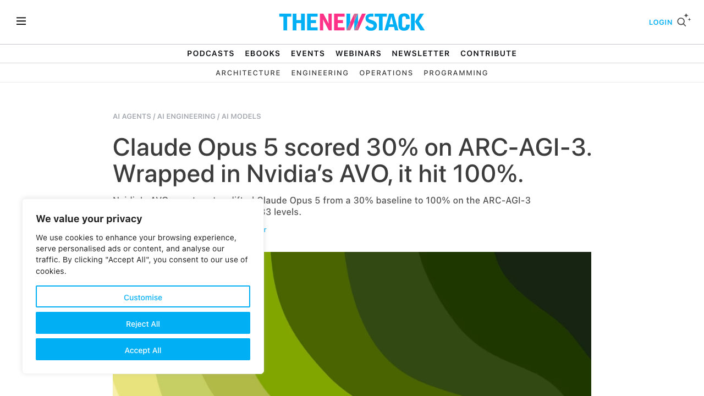
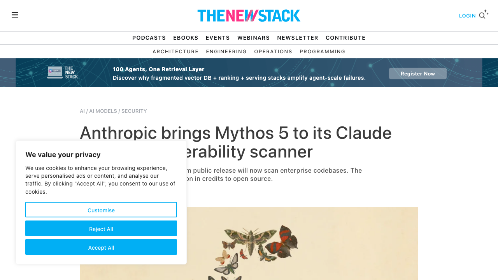
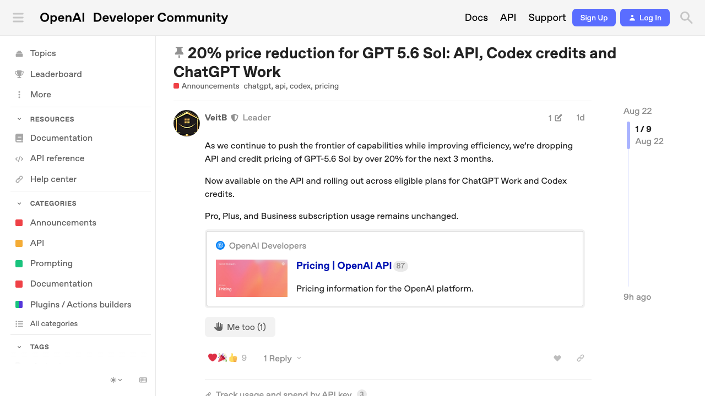
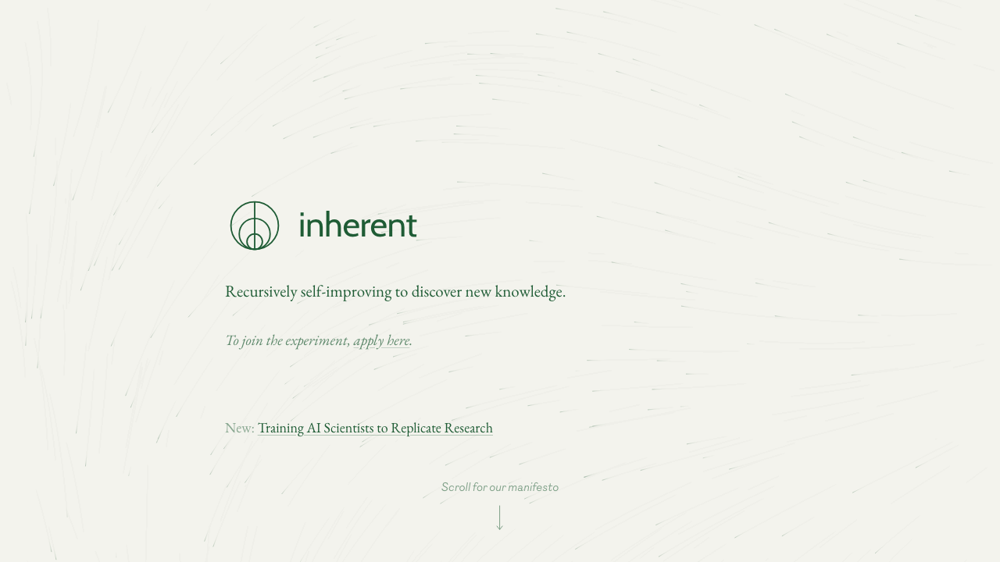
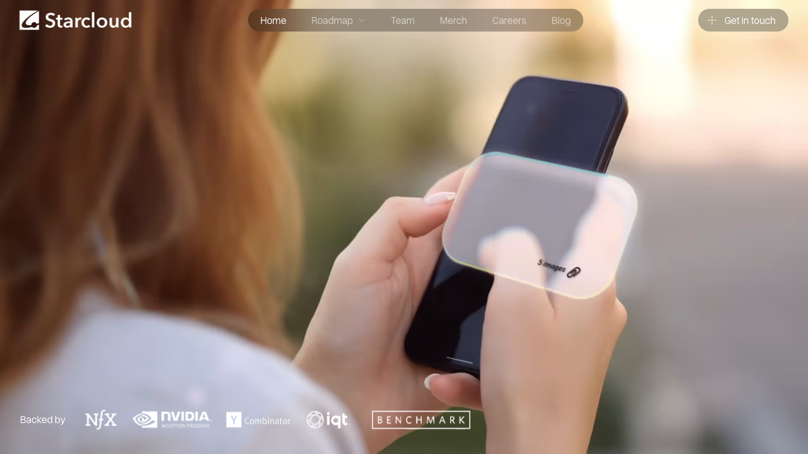

# 0823日报 | AI的「系统胜过模型」时刻：英伟达Agent系统ARC-AGI-3拿满分（裸模型仅30%）、Anthropic把最强却不敢开放的Mythos 5装进企业安全扫描并设3500万美元开源防御基金、OpenAI旗舰API降价超20%输出Token直降1/3、DeepMind校友27B参数AI科学家复现论文反超Claude/GPT-5.5、轨道数据中心再融2.5亿美元估值23亿

## 今日洞察

今天的五个字：「**AI的『系统胜过模型』。**」

**8月21-22日，五件事指向同一条主线：AI竞争的重心正在从「模型参数」迁移到「模型外面的系统」，同时向「安全、成本、科研、太空」四个边界同步扩张。** 系统侧，英伟达8月21日披露其通用Agent系统AVO（Agentic Variation Operators）在ARC-AGI-3推理基准公开集的25个环境、183个关卡全部完成、RHAE得分100.00——而底层模型Claude Opus 5的裸模型基线只有30.2%，同一模型套上AVO的「持久记忆+程序化监督者」系统后直接拉满，「模型只是Agent的一部分」第一次有了可量化的证据（TechCrunch当天发文：《英伟达刚刚证明，harness——而不是AI模型——才是真正的主角》）；同一天，DeepMind校友创办的伦敦实验室Inherent发布AI Agent「Faraday」——用仅270亿参数的Qwen 3.6在「独立复现已发表论文结论」任务上击败了Claude Opus 4.8与GPT-5.5，靠的不是参数而是「以论文复现为训练场+强化学习奖励研究品味」的训练路线——「小模型+系统训练」正面挑战「参数军备」；安全侧，Anthropic 8月21日宣布把此前因「太擅长找漏洞」而只对约50个审核合作伙伴开放（Project Glasswing）的Claude Mythos 5装进企业级漏洞扫描产品Claude Security（全量Enterprise公测、不加价），并祭出两个配套动作：与安全厂商合作把Mythos 5嵌入其产品、设立3500万美元「Defender Advantage Fund」资助开源软件漏洞修复——「太强不敢开放」的模型找到了商业答案：**不给模型，给结果**（输出补丁与告警，不开放直接访问）——这与0820日报智谱GLM-5.3「强到不敢开源、推迟两周」形成中美镜像；成本侧，OpenAI 8月21日宣布GPT-5.6 Sol API整体降价超20%——输入$5→$4、缓存输入$0.50→$0.40、**输出$30→$20（直降1/3）**，促销价持续三个月——砍的正是Agent长循环工作负载最烧钱的输出token，推理价格战从「输入论价」进入「输出战场」（同日DeepSeek上线V4-Flash-Vision-Exp，给flash级模型加上视觉、多模态Agent能力逼近Opus-4.8档、价格仍是flash档）；物理侧，Starcloud 8月21日宣布在3月1.7亿美元A轮基础上追加2.5亿美元（估值23亿美元），把AI推理数据中心送上轨道——「算力的边界从电网扩展到了大气层外」，而CEO坦言「最大的成本是抢到发射机会」（Falcon 9计划2028年退役、Starship尚未验证）——AI基建的瓶颈永远在你想不到的那一层。

**为什么这是创业者的窗口期：①「系统红利」正式大于「模型红利」——**英伟达AVO把Claude Opus 5从30%拉到100%、Inherent用27B模型击败前沿，「模型外面那层脚手架」（持久记忆、监督者、工具调用、执行反馈、恢复机制）成为产品差异化的主战场——Agent评测正在从「模型榜」转向「系统榜」，做Agent产品的团队应该把「harness工程」当第一优先级，而不是追着换模型；**②「双用途AI」找到了产品化答案——**Anthropic「不给模型、给结果」+3500万美元开源基金，与智谱「推迟开源」对照：网络安全能力的商用化路径是「结果即产品、模型锁保险柜」，做安全Agent（代码审计、漏洞修复、合规）的团队正处在巨头教育出的市场里；**③ 推理价格战进入「输出token」战场——**输出降1/3直指Agent成本结构，配合缓存10x优势，「长上下文+长循环Agent」的单位经济性大幅改善——但促销只保三个月，创业者的成本模型要按「促销结束后」设计；**④「小模型+RL训练直觉」的性价比路线被验证——**Inherent用「论文复现」这个有标准答案、可自动评测、可规模化的训练场训练「研究品味」——任何有ground truth的垂直领域都可以抄这套方法论（比堆参数便宜得多）；**⑤ AI基建的边界在物理世界扩张——**轨道数据中心（Starcloud）、发射能力成新瓶颈、主权/政府客户成付费方——与0821英国主权AI基金投Callosum合并看：「国家资本+太空/能源/路由」正在成为AI基建融资的新三角。** 三个信号同样关键：量子位8月22日深度报道00后清华博士生秦深涛的OriginFlow（渊澈太初）——用非侵入式神经肌电腕带把人类肌肉反应「炼成」具身数据的「Human Tokens」，运营5个月融资超5亿元——「动作Token」成为具身数据的新叙事；雷鸟创新8月21日发布1996元起的「无摄像头」人类增强AI眼镜雷鸟iO——砍掉摄像头与扬声器、34g、2天续航、全天候主动式AI——隐私友好的设计反而打开全天候佩戴场景，消费AI硬件平价化在加速；亚马逊AgentCore Payments正式GA、Agent钱包被亚马逊抢先落地，而腾讯的「AI专属卡」还在测试——「Agent替你花钱」的支付基础设施成为中外时间差里的中间件窗口。

---

## 1. [英伟达通用Agent系统AVO在ARC-AGI-3推理基准拿到100%满分：同一模型从30.2%基线被系统拉满，持久记忆+程序化监督者，「模型只是Agent的一部分」](https://developer.nvidia.com/blog/nvidia-avo-reaches-100-on-arc-agi-3-demonstrating-a-frontier-level-general-purpose-architecture-for-long-horizon-autonomous-agents/)（行业洞察 / 「harness＞model」被顶级厂商官方背书——模型能力相同、系统设计决定上限，Agent竞争从「模型榜」转向「系统榜」）

🔗 链接：[NVIDIA开发者博客·NVIDIA AVO Reaches 100% on ARC-AGI-3](https://developer.nvidia.com/blog/nvidia-avo-reaches-100-on-arc-agi-3-demonstrating-a-frontier-level-general-purpose-architecture-for-long-horizon-autonomous-agents/) | [TechCrunch·Nvidia just showed that the harness, not the AI model, is now the real hero](https://techcrunch.com/2026/08/21/nvidia-just-showed-that-the-harness-not-the-ai-model-is-now-the-real-hero/) | [The New Stack·Claude Opus 5 scored 30% on ARC-AGI-3. Wrapped in Nvidia's AVO, it hit 100%](https://thenewstack.io/nvidia-avo-arcagi3-benchmark/)

**动态**：**8月21日，英伟达技术博客披露：其通用编码Agent系统AVO（Agentic Variation Operators）在ARC-AGI-3交互推理基准的公开集上拿下100.00 RHAE——25个环境、183个关卡全部完成（共6624步动作）。** 关键信息：① **裸模型基线只有30.2%**——底层模型是Claude Opus 5，单独跑只有约30%得分；套上完整的AVO系统后直接100%——「同一个模型，系统决定上限」；② **AVO是什么**：3月底首次亮相的通用Agent系统，把「传统演化搜索的预定义变异步骤」替换为「自主Agent决定下一步做什么」（检查什么、改什么、测什么、提交什么）；③ **两大核心机制**：持久记忆（persistent memory，携带先前的实现、评测结果、编译器与profiler输出、累积推理，让Agent从当前状态继续而不是反复重建搜索）+ 程序化监督者（programmatic supervisor，非人类模块，在搜索停滞时介入并重定向新策略）；④ **迁移性验证**：AVO最初为GPU内核优化设计（曾在DGX B200上连续7天自主运行，产出超越cuDNN最高3.5%性能的内核），这次原封不动迁移到完全不同的交互推理环境——「接口不同，但『假设-行动-观察证据-更新状态-继续』的循环相同」；⑤ **结论**：英伟达团队原话——「模型很重要，但模型不是Agent的全部」；目前代码与权重仅限研究用途。

**做什么的**：通俗讲，**AVO是「把模型变成能干长活儿的Agent的引擎」——它不训练新模型，而是给模型装上『记忆』和『监工』：记忆让它干到一半不会失忆重来，监工在它卡住时踢一脚换条路，于是同一台发动机（模型）能跑完别人跑不完的长途。** 三个战略看点：① **「30%→100%」是纯系统红利**——模型一分没换，只换了外面的脚手架，性能翻了三倍多——这是「harness工程」价值最极端的一次展示；② **「持久记忆+监督者」是长程Agent的标准配方**——超过单模型上下文窗口的长期任务、错误假设的反复修正、不完整信息下的持续推进，都需要这两件套；③ **英伟达亲自下场定义「Agent架构」**——从卖GPU到卖「Agent系统设计」，芯片巨头正在成为Agent基建的规则制定者。

**为什么值得关注**：

- **「harness＞model」被顶级厂商官方背书——系统设计成为AI产品的新护城河。** 30.2%→100%不是模型进步，是「模型外面的系统」进步。对创业者的启示：① 别再只追「换更强的模型」——先把「记忆、监督、工具、反馈、恢复」这五件套搭对，同样的模型在你的系统里能跑出别人跑不出的效果（呼应0814日报DeepSeek Harness「一切皆插件」、0821日报Ramp Router「路由策略是产品能力」——AI价值重心正在从参数向编排迁移）；② Agent产品的「长程自主」是系统属性不是模型属性——买模型+搭系统，而不是等模型；③ 「Agent评测」正在从「模型榜」转向「系统榜」——你的产品叙事应该从「我们用了XX模型」变成「我们的Agent系统在XX任务上的成功率」。

- **同一架构跨域迁移被验证——「通用长程Agent架构」真实存在。** GPU内核优化（反馈来自编译器/profiler）→ARC-AGI-3交互推理（反馈来自环境状态），换域只是换接口，循环相同。对创业者的启示：① 做垂直Agent时把「循环」做对（假设-行动-观察-更新），换行业只是换工具与反馈源——「一个循环打天下」的架构红利真实存在；② 「领域知识」与「通用机制」分开设计：领域知识放进工具与数据，通用机制（记忆/监督/恢复）做成可复用层——这是Agent产品架构的推荐分法；③ 与Inherent Faraday（今日第4条）合并看：「小模型+系统设计+好的训练任务」正在系统性挑战「大模型+蛮力」路线。

- **英伟达从「卖芯片」到「卖Agent系统」——基建层的角色正在模糊化。** 芯片公司发布Agent架构、还跑出100%基准——与0821日报Ramp做模型路由、Stripe收购OpenRouter合并看：AI价值链的每一层玩家都在向上吃掉「编排层」。对创业者的启示：① 「Agent运行时/编排/监控」是确定性基建需求——无论谁家的模型赢，这层都要有人做；② 警惕巨头下沉：你如果做通用Agent脚手架，要和英伟达/OpenAI/Meta的免费方案差异化——做垂直行业harness（金融、医疗、法律的长程Agent）或数据敏感的私有化部署；③ 跟踪英伟达是否把AVO产品化/开源——「research-only」的今天可能就是「API化的明天」。

- 对创业者的启发：**① 把「harness工程」当第一优先级——记忆/监督/工具/反馈/恢复五件套决定你的Agent上限；② 「循环做对、换域只换接口」——通用机制与领域知识分层设计；③ Agent评测从模型榜转向系统榜，用「任务成功率」做产品叙事；④ 警惕巨头下沉编排层，做垂直harness或私有化。** 跟踪三个验证点：AVO是否开源/API化、「持久记忆+监督者」能否成为行业标准架构、下半年Agent基准是否从「单模型得分」改为「系统得分」。

**类比参考**：**「Agent的『系统时刻』/ 从『比谁的模型强』到『同一模型，系统决定上限』——当英伟达把同一个Agent系统从优化GPU内核搬到ARC-AGI-3、把30.2%的模型基线拉到100%满分，'模型只是Agent的一部分'第一次有了可量化的证据——而芯片巨头亲自下场定义'Agent架构'，也在提醒所有AI创业者：下一轮竞争的主战场，是模型外面的那层脚手架」**

---

## 2. [Anthropic把「太强不敢开放」的Claude Mythos 5装进企业安全扫描：全量Enterprise公测、只输出漏洞补丁不开放模型，另设3500万美元「Defender Advantage Fund」资助开源防御](https://claude.com/blog/bringing-claude-mythos-5-to-more-defenders)（新产品 / 「双用途AI」找到产品化答案——不给模型、给结果；安全AI从「锁进保险柜」走向「结果即产品」，与智谱GLM-5.3「不敢开源」形成中美镜像）

🔗 链接：[Anthropic官方博客·Bringing the cybersecurity capabilities of Claude Mythos 5 to more defenders](https://claude.com/blog/bringing-claude-mythos-5-to-more-defenders) | [The New Stack·Anthropic brings Mythos 5 to its Claude Security vulnerability scanner](https://thenewstack.io/anthropic-mythos-claude-security/) | [Unite.AI·Anthropic Deploys Claude Mythos 5 in Security Tools, $35M Open Source Fund](https://www.unite.ai/anthropic-deploys-claude-mythos-5-in-security-tools-35m-open-source-fund/)

**动态**：**8月21日，Anthropic宣布Claude Security漏洞扫描全面切换至Claude Mythos 5——这是自4月起仅通过Project Glasswing对约50个审核合作伙伴开放（因「太擅长寻找和串联漏洞」而限制公开访问）的Mythos系列模型，第一次大规模进入产品。** 关键信息：① **公测范围**：全部Claude Enterprise客户可用，不单独加价、按标准token计费（Mythos 5定价$10/百万输入token、$50/百万输出token）；② **能力**：对指定代码仓库扫描，返回每个漏洞的CWE分类、严重度、置信度与建议补丁；合作伙伴产品通过专用接口调用，拿到的是「补丁/安全告警」这类具体产出物而非开放式对话；③ **三个配套动作**：与网络安全厂商合作把Mythos 5嵌入其产品（已开放兴趣表）；新设Defender Advantage Fund（0xDAF）提供3500万美元Claude credits，资助开源软件漏洞的发现与修复；Cyber Verification Program未来数周扩展；④ **设计哲学**：Anthropic原话——「用户直接访问模型的风险最大（恶意行为者可能把它引向有害用途）；但如果用户只能收到特定输出（漏洞补丁、安全告警），风险就低得多」；⑤ **战绩背书**：Anthropic与约50个合作伙伴已用Mythos Preview在全球最关键软件中发现超1万个高危/严重漏洞。

**做什么的**：通俗讲，**Claude Security×Mythos 5是「把最强的黑客能力装进安检门」——Mythos 5是全公司最会找漏洞、也因此最不敢给人用的模型；Anthropic把它锁在保险柜里、只伸出一只手：你把自己的代码递进去，它把『哪里有洞、怎么补』递出来，你永远碰不到模型本体。** 三个战略看点：① **「只给结果不给模型」是双用途AI的商用范式**——既吃到最强模型的能力，又把滥用面压到最低——「结果即产品、模型锁保险柜」；② **3500万美元开源防御基金=花钱买生态安全**——开源软件是全球软件的公共地基，资助维护者打补丁，既做社会责任又是获客与品牌策略；③ **安全AI的商业化拼图成型**：企业扫描（Claude Security）+伙伴嵌入（Mythos-as-a-service）+开源基金（0xDAF）——三条腿同时走。

**为什么值得关注**：

- **「太强不敢开放」的模型如何商用——「不给模型，给结果」是2026年双用途AI的标准答案。** 与0820日报智谱GLM-5.3「编程/网络安全能力太强、权重推迟开源两周」对照：智谱选择「推迟开源」，Anthropic选择「永不开放模型、只开放产品化输出」——中美两大实验室在「安全能力商用」上殊途同归。对创业者的启示：① 如果你的模型/产品有「双用途」能力（网络安全、生物、深度伪造检测），「产品化输出+不开放底层」是合规与商业的平衡点——输出补丁、告警、评分，不暴露原始推理；② 「扫描-验证-补丁」三阶段pipeline是安全Agent的值得抄的产品形态（Claude Security 7月公测时就是这个结构）；③ 安全产品的信任设计：给用户「可行动的产出物」（patch/alert/CWE分类）而不是开放式对话——这也天然降低你的责任边界。

- **3500万美元「开源防御基金」——用钱买「生态安全」的商业模式。** 0xDAF给开源维护者发credits，让他们修自己项目里的漏洞——这本质是「把安全成本从客户身上转移到生态基金」+「让最强模型接触开源代码库」的双赢。对创业者的启示：① 做安全/开发者工具的团队可以设计「基金/赏金」策略获客与建立生态（类似GitHub Security Lab、Google OSS-Fuzz的玩法被Anthropic用钱放大）；② 开源维护者成了「被争夺的资产」——能批量修复开源漏洞的AI工具+基金资助，是2026年安全赛道的新增长点；③ 「模型公司养生态」正在成为标配——模型本身同质化，生态（合作伙伴、基金、认证体系）才是护城河。

- **安全Agent赛道被巨头教育成市场——「扫描-验证-补丁」自动化是确定性刚需。** Anthropic把Mythos 5放进企业扫描+开放给合作伙伴嵌入——安全AI从「论文里的能力」变成「企业采购清单上的商品」。对创业者的启示：① 企业安全预算正在流向「AI驱动的代码审计与修复」——做安全Agent（SAST升级、漏洞修复、合规审计）的团队处在巨头教育出的增量市场；② 差异化方向：垂直行业安全（金融/医疗/工控）、私有化部署（数据不出域）、与CI/CD深度集成——巨头做通用、你做场景；③ 与0821日报独到科技「AI+反诈已进真实生产」合并看：安全是Agent落地最快的付费场景之一（强合规+强流程+可审计）。

- 对创业者的启发：**① 「只给结果不给模型」是双用途AI的商用范式——输出补丁/告警，不开放原始模型；② 「扫描-验证-补丁」是安全Agent的黄金产品形态；③ 用「基金/赏金」建立安全生态与获客；④ 安全Agent做垂直与私有化，避开巨头通用战场。** 跟踪三个验证点：Mythos 5扫描相比传统SAST的真实检出率提升、0xDAF基金资助项目的漏洞修复数量、合作伙伴（安全厂商）嵌入后的采用曲线。

**类比参考**：**「防御型AI的『产品化时刻』/ 从『最强模型锁在保险柜』到『把保险柜里的模型装进企业扫描器、只输出补丁不开放本体』——当Anthropic把因为太擅长找漏洞而不敢公开的Mythos 5放进Claude Security、并掏出3500万美元给开源世界打补丁，'双用途AI'第一次找到了既安全又可商业化的答案：不给模型，给结果」**

---

## 3. [OpenAI旗舰模型GPT-5.6 Sol API降价超20%：输出Token从30美元砍到20美元（直降1/3）、缓存输入降20%，促销持续三个月——推理价格战进入「输出战场」](https://community.openai.com/t/20-price-reduction-for-gpt-5-6-sol-api-codex-credits-and-chatgpt-work/1391726)（行业洞察 / 输出Token是Agent长循环最烧钱的环节——价格战从「输入论价」转向「输出战场」，长上下文+长循环Agent的单位经济性被重写）

🔗 链接：[OpenAI官方社区·20% Price Reduction for GPT-5.6 Sol API, Codex Credits, and ChatGPT Work](https://community.openai.com/t/20-price-reduction-for-gpt-5-6-sol-api-codex-credits-and-chatgpt-work/1391726) | [AI/TLDR·GPT-5.6 Sol price cut](https://ai-tldr.dev/releases/openai-gpt-5-6-sol-price-cut) | [OpenAI定价页](https://openai.com/api/pricing/)

**动态**：**8月21日，OpenAI宣布GPT-5.6 Sol API整体降价超过20%：输入从$5降至$4/百万token（-20%）、缓存输入从$0.50降至$0.40/百万token（-20%）、输出从$30降至$20/百万token（-33%）。** 关键信息：① **促销期**：新价格持续至2026年11月21日（三个月），到期后是否回调未公布；② **覆盖范围**：标准API调用，并自动流入Codex credits与ChatGPT Work（符合条件的套餐）；③ **订阅价格不动**：Pro/Plus/Business订阅不受影响；④ **降幅结构**：输出token降幅最大（1/3）——官方社区帖直言这正是「Agent工作负载花预算最多的地方」（长Agent循环、大规模代码评审、高吞吐批处理）；⑤ **背景**：这是OpenAI在0820日报「Q2增速放缓、Anthropic营收反超」之后的价格动作——用降价抢回开发者与企业流量；同日DeepSeek上线V4-Flash-Vision-Exp（给flash级模型加视觉、多模态Agent能力逼近Opus-4.8档、价格仍是flash档：非高峰$0.22/百万输入、$0.66/百万输出）——低价多模态与OpenAI的降价形成夹击。

**做什么的**：通俗讲，**这是一张「Agent算账本上的降价通知」——如果你的产品每天跑大量Agent循环，输出token就是最大的开销项；OpenAI把这一项直接砍掉1/3，等于给你的Agent单位成本打了个大折扣（再叠加缓存输入10x优势，长上下文任务更便宜）。** 三个战略看点：① **降价结构暴露商业意图**——专砍输出token，说明OpenAI盯的就是「长循环Agent」这个增长最快的付费场景；② **「限时促销」是2026年AI定价的新常态**——先降三个月抢流量、培养依赖，到期再定新价（与DeepSeek峰谷定价0817日报、Ramp Router「免费到年底」0821日报同一套路）；③ **缓存输入-20%+输出-33%的组合**——鼓励长上下文+缓存复用，把「会话式Agent」的成本结构进一步优化。

**为什么值得关注**：

- **推理价格战进入「输出token」战场——Agent的单位经济性被系统性重写。** 此前价格战多打在输入/总价上；这次OpenAI专砍输出（-33%），直指Agent长循环的预算大头。对创业者的启示：① 「输出token成本」正在成为Agent产品的生死线指标（呼应0819日报「单位token成本是AI应用生死线」）——现在巨头帮你砍了1/3，窗口期内的Agent产品单位经济性显著改善，是扩量/拉新的好时机；② 你的成本模型要区分「输入/输出/缓存」三档：长上下文任务优先用缓存、短任务走低价模型、难题才上旗舰——「成本结构设计」本身就是产品能力（与0821日报Ramp Router的flex档位/难题优先策略同构）；③ 别把「促销价」当「常态价」——按三个月后回调的假设设计定价与融资模型。

- **「限时降价」成为AI定价新常态——巨头用「窗口期」抢开发者心智。** OpenAI降三个月、DeepSeek峰谷定价、Ramp免费到年底——2026年的AI定价普遍带「时间窗」。对创业者的启示：① 跟巨头API打交道的创业团队，要主动利用窗口期锁定客户（促销期内签约、锁定用量）；② 你自己的AI产品也可以设计「限时降价/免费期」——先抢流量和习惯，再谈续费（Ramp Router模式）；③ 「到期涨价」是双刃剑——窗口期内培养的依赖越深，回调时客户越难离开，但也越容易招致反弹——设计要留「阶梯过渡」。

- **OpenAI降价×DeepSeek加视觉——「价格战+能力补位」双线夹击的竞争格局。** OpenAI砍旗舰价、DeepSeek给flash级加视觉逼近Opus档——对中间层模型厂商（Anthropic、Google、xAI）形成价格与能力双重压力。对创业者的启示：① 应用层是最大受益者——多模型路由（0821 Ramp Router）的价值被放大：「谁降价就用谁」成为理性选择，绑定单一模型供应商的采购决策风险更高；② 低价多模态（DeepSeek V4-Flash-Vision档）正在打开「视觉Agent」的平价化窗口——屏幕理解、图表解析、文档Agent的边际成本大幅下降，做视觉Agent的团队现在扩量最划算；③ 与0820日报「OpenAI增速换挡、资本看单位经济性」合并看：降价换量是巨头在「收入增速放缓」压力下的必然动作——对创业者，这是「跟随降价节奏设计成本模型」的明确信号。

- 对创业者的启发：**① 把「输出token成本」纳入核心指标，利用降价窗口扩量；② 成本模型按「促销结束后」设计，别把促销价当常态；③ 多模型路由+缓存复用是省成本标配；④ 低价多模态打开视觉Agent平价窗口，现在做视觉Agent扩量最划算。** 跟踪三个验证点：11月21日促销结束后GPT-5.6 Sol是否回调价格、Anthropic/Google是否跟进降价、Agent类产品在降价窗口期的用量增速。

**类比参考**：**「AI推理的『输出Token时刻』/ 从『输入论价』到『输出降价1/3』——当OpenAI把旗舰模型输出token价格从30美元砍到20美元，砍的正是Agent长循环里最烧钱的那一段，'单位token成本'的下行曲线第一次主要由输出端驱动——而三个月的促销窗口也在提醒创业者：巨头价格战是限时的，你的成本模型要按'促销结束后'来设计」**

---

## 4. [DeepMind校友创办的伦敦实验室Inherent发布AI Agent「Faraday」：仅270亿参数的Qwen 3.6在「独立复现已发表论文」任务上击败Claude Opus 4.8与GPT-5.5——「小模型+论文复现训练场+RL奖励研究品味」](https://techcrunch.com/2026/08/22/inherent-founded-by-deepmind-alumni-says-its-ai-teammate-just-outperformed-anthropic-and-openai-at-replicating-research/)（新产品 / 「AI科学家」第一次不是靠参数碾压，而是靠「像博士生一样先复现、再谈品味」的训练路径——有ground truth的垂直领域都可以抄这套方法论）

🔗 链接：[TechCrunch·Inherent, founded by DeepMind alumni, says its AI 'teammate' just outperformed Anthropic and OpenAI at replicating research](https://techcrunch.com/2026/08/22/inherent-founded-by-deepmind-alumni-says-its-ai-teammate-just-outperformed-anthropic-and-openai-at-replicating-research/) | [Inherent官网](https://inherentlabs.ai/) | [Dealroom·Inherent raises $50M, claims Faraday agent beats Claude and GPT-5.5 at replicating research](https://app.dealroom.co/news/feed/inherent-raises-50m-claims-faraday-agent-beats-claude-and-gpt-5-5-at-replicating-research)

**动态**：**8月22日，TechCrunch报道：DeepMind校友创办的伦敦AI实验室Inherent发布AI Agent「Faraday」——在「独立复现已发表科学论文的结论（不预先告知答案）」任务上，超过了Anthropic的Claude Opus 4.8与OpenAI的GPT-5.5——而Faraday底层是仅270亿参数的Qwen 3.6。** 关键信息：① **训练方式**：不是主要学习「科学如何被研究」，而是用强化学习奖励「好的研究品味」——什么实验值得做、如何设计实验（联合创始人兼首席科学家Edward Hughes：论文复现是人类科学家的标准训练，很多博士生就是从复现开始）；② **Replica基准**：自建可扩展的论文复现任务空间——100篇机器学习/AI论文的310个任务，每个任务要求Agent复现论文中的一张图；③ **「工具复用」哲学**：Faraday用OpenAI的GPT-5.5 Codex作为编码工具——「像人类科学家用现成软件一样」，不自研编码工具；④ **公司背景**：5月底以5000万美元种子轮出隐身（三位DeepMind校友+一位联合创始人：Edward Hughes、Louis Kirsch、Kaloyan Aleksiev、Tantum Collins），团队12人、伦敦King's Cross办公（DeepMind带动起来的AI中心），年底计划扩至20-25人，同时押注world models（世界模型）；⑤ **定位**：最终目标是「能发现新科学知识」的AI科学家，而不仅是验证旧结果——「复现」只是第一步。

**做什么的**：通俗讲，**Faraday是「一个像博士生一样训练的AI科研队友」——先不给它答案，让它把别人发表过的论文重新做一遍（复现结果、画出论文里的图），做对了给奖励；这套「先复现、练品味」的训练，让它用270亿参数的小模型，在复现任务上赢过了万亿参数级别的对手。** 三个战略看点：① **「复现」是最好的AI训练场**——标准答案已知（论文结论）、可自动评测（对比结果）、可无限规模化（论文取之不尽）——比开放式科研任务好训练得多；② **「研究品味」可以训练**——强化学习奖励「什么实验值得做」，而不是死记硬背科学方法——这是「直觉工程化」的尝试；③ **小模型+开源底座（Qwen 3.6）+任务设计**——组合拳挑战「参数军备」，训练成本与推理成本都低一个量级。

**为什么值得关注**：

- **「小模型+系统训练」正面挑战「参数军备」——AI科学家的成本结构被重写。** 27B参数击败Claude Opus 4.8/GPT-5.5，靠的不是规模而是「任务设计+RL奖励」。对创业者的启示：① 有ground truth的垂直领域（论文复现、代码修复、数学证明、法律文书核对）都可以抄这套方法论——「用标准答案+自动评测+RL奖励」训练你的领域Agent，比堆参数便宜得多；② 「品味/直觉」可以被定义成奖励函数——做垂直Agent时，把「什么是好的结果」显式化（用户反馈、基准自动评分），你的Agent就能学会「判断力」而不仅是「执行力」；③ 「Agent用别人的工具」是常态设计——Faraday用Codex当编码工具，你的Agent也可以调用成熟API/工具栈，别什么都自研（呼应0821日报Meta AI Mac「连接器寄生」模式）。

- **「AI科学家」从叙事进入产品化验证——科研自动化是Agent深水区的大市场。** 复现→实验设计→新发现，Faraday走的是「先复现再创新」的路线。对创业者的启示：① 科研Agent（文献、复现、实验设计、论文写作）是尚未被巨头垄断的垂直大市场——「可评测的复现基准」是这类产品的信任基石（像Replica这样的基准会成为行业标准）；② 「AI队友」的产品定位（不是替你干活的工具，是「我好奇去做了实验，你看结果怎么样」的同事）——交互设计上更接近协作而非命令；③ 与0819日报深势科技「AI4S科研全流程搬进桌面」合并看：科研自动化的商业化在加速，但「从复现到真发现」还有距离——创业公司可以先做「复现/验证」这个付费确定性的环节。

- **DeepMind校友创业潮+伦敦AI中心崛起——人才红利与「garden leave」争议。** 三位DeepMind校友创办、12人团队、伦敦King's Cross——与0821日报Callosum（伦敦、剑桥博士、英国主权AI基金首投）合并看：伦敦正在成为欧洲AI科研创业重镇。对创业者的启示：① Hughes公开呼吁取消英国「garden leave」（离职竞业限制）——美国研究者不受此限，英国人才流动受阻——做AI人才招聘/出海团队的可以关注这个政策变量；② DeepMind在Demis Hassabis新角色后的动荡（部分员工不安）正在释放人才——伦敦12人小团队能做出击败前沿的结果，说明「小而精的科研团队」依然是AI创新的主力形态；③ 欧洲AI公司的估值叙事从「应用」转向「科研能力」——学术出身+前沿实验室背景是融资加分项。

- 对创业者的启发：**① 用「有标准答案的训练场+RL奖励」训练垂直Agent，性价比碾压参数军备；② 「品味/判断力」可以被定义成奖励函数——把「什么是好结果」显式化；③ 科研自动化做「复现/验证」环节最易商业化，可评测基准是信任基石；④ 关注伦敦/DeepMind人才外溢窗口。** 跟踪三个验证点：Faraday能否从「复现」走向「新发现」（world models进展）、Replica基准是否成为AI科研事实标准、Qwen 3.6开源底座+RL训练路线的后续复现。

**类比参考**：**「AI科学家的『复现时刻』/ 从『AI帮你写论文』到『AI把别人的论文重新做一遍还能赢过你』——当一家12人的伦敦实验室用270亿参数的开源小模型，在复现论文任务上击败Claude Opus 4.8和GPT-5.5，'AI科学家'第一次不是靠参数碾压，而是靠'像博士生一样先复现、再谈品味'的训练路径——而这套'用标准答案训练直觉'的方法论，或许比模型本身更值得创业者抄作业」**

---

## 5. [轨道数据中心公司Starcloud追加2.5亿美元融资、估值23亿美元：把AI推理数据中心送上卫星，客户含美国政府机构，「最大的成本是抢到发射机会」](https://techcrunch.com/2026/08/21/starcloud-raises-200-million-for-orbital-data-centers-as-launch-options-dry-up/)（融资 / AI算力的边界从电网扩展到大气层外——「发射能力」成为AI基建的新瓶颈，太空算力与主权/政府客户绑定）

🔗 链接：[TechCrunch·Starcloud raises $250 million for orbital data centers as launch options dry up](https://techcrunch.com/2026/08/21/starcloud-raises-200-million-for-orbital-data-centers-as-launch-options-dry-up/) | [TechCrunch·Starcloud raises $170M Series A to build data centers in space（3月）](https://techcrunch.com/2026/03/30/starcloud-raises-170-million-series-ato-build-data-centers-in-space/) | [Starcloud官网](https://www.starcloud.com/)

**动态**：**8月21日，TechCrunch报道：开发「可在轨执行AI推理的卫星」的Starcloud在3月1.7亿美元A轮基础上，追加2.5亿美元extension轮，估值达23亿美元。** 关键信息：① **用途**：扩建更大的制造设施、推进最大轨道数据中心航天器Starcloud-3（计划搭载SpaceX的Starship）；② **在轨能力**：新一代8kW算力卫星Starcloud-2计划2027年以拼车发射两颗，为包括美国政府机构在内的客户执行在轨推理任务；③ **规模野心**：已向FCC申请运营8.8万颗航天器的许可；④ **核心瓶颈叙事**：CEO Philip Johnston表示「发射能力是最大的成本与不确定性」——SpaceX的Falcon 9计划2028年退役、Starship尚未验证、Blue Origin的New Glenn与ULA的Vulcan尚未常态化飞行、Rocket Lab的Neutron还没上发射台——「我们需要预订海量的发射机会，越早锁定Starship这类合同越好」；⑤ **行业背景**：轨道数据中心的经济性本来就残酷（发射成本是大头），此前已有同行（Cowboy Space）因火箭不够用而决定自研火箭。

**做什么的**：通俗讲，**Starcloud是「把数据中心搬上天的公司」——地球上的数据中心受电网、土地、散热限制，它把AI推理服务器装进卫星，让计算在地球轨道上跑，顺便覆盖全球任何角落（包括没有数据中心的地区）。** 三个战略看点：① **「在轨推理」解决三个问题**——地球电力瓶颈（呼应0821日报Velaura「电网养不起GPU」）、全球覆盖（偏远地区/海上/极地）、主权与安全（数据不出大气层、政府客户天然契合）；② **「发射能力=新的GPU荒」**——2024年大家抢GPU，2026年太空公司抢火箭发射机会——发射合同正在成为轨道算力公司的核心资产；③ **客户结构**：美国政府机构是首批客户——太空AI与国防/情报天然绑定，付费确定性高。

**为什么值得关注**：

- **AI算力的物理边界在扩张——「太空算力」从概念进入工程化融资阶段。** Starcloud（23亿估值）、Cowboy Space（自研火箭）——轨道数据中心的叙事从「PPT」进入「8kW算力卫星+2027发射计划」。对创业者的启示：① 与0821日报Velaura「电力瓶颈」、0820日报Fractile「推理芯片客户锚定」合并看：AI基建的瓶颈链条是「芯片→电力→土地→发射」——每一层都有人在融资解决，每一层都是「卖水人」机会；② 「算力上太空」短期不是大众市场，但「边缘/近地/主权算力」的长坡厚雪叙事对主权基金与政府资本有吸引力——做基建的团队可以把「物理边界扩张」写进融资故事；③ 别低估「发射荒」——Falcon 9退役倒计时意味着未来2-3年所有轨道玩家的成本结构都会变，做太空/卫星相关AI的团队要提前锁发射合同。

- **「追加轮+快速估值跳升」——资本密集赛道的融资节奏样本。** 3月1.7亿A轮→8月追加2.5亿、估值23亿——半年内融资节奏极快。对创业者的启示：① 资本密集赛道（太空、芯片、算力）的融资节奏是「快速追加轮」而不是「按年走流程」——与0821日报Velaura「A轮即独角兽」、Etched「4周估值翻倍」同构：基建公司的估值由「资本开支需求」驱动而非「收入」驱动；② 追加轮的叙事要点是「里程碑兑现+新瓶颈暴露」——Starcloud用「制造设施扩建+Starcloud-3+发射锁定」讲清楚钱去哪了；③ 警惕「估值跳升后的大考」：23亿估值的下一轮需要「2027年发射成功+在轨推理客户付费」来验证——太空公司的B轮验证周期以年计（呼应0821日报Velaura的「A轮独角兽B轮怎么走」争论）。

- **主权/政府客户成为AI基建的付费主力——「国家资本+物理基建」组合正在成型。** Starcloud客户含美国政府机构、Callosum获英国主权AI基金首投（0821日报）、英伟达5000亿美元算力融资平台（8月初）——AI基建的资金来源正在全面「国家化」。对创业者的启示：① 做AI基建（算力、能源、太空、路由）的团队，融资叙事要加「国家算力安全/主权」维度——政府与主权基金是比VC更耐心的钱；② 政府客户意味着合规门槛（出口管制、数据主权、国防审查）——提前设计「本地实体+本地数据」结构（呼应0821日报对主权资本「本地化义务」的提醒）；③ 「中立+多供应商适配」叙事对主权资本有独特吸引力——不绑死单一美国巨头的基建公司更容易拿到国家订单。

- 对创业者的启发：**① 关注AI基建的「瓶颈链条」——芯片→电力→发射，每一层都是卖水人机会；② 资本密集赛道用「快速追加轮」保持节奏，讲清里程碑与瓶颈；③ 做基建的团队把「主权/政府客户」写进融资与销售策略；④ 太空AI短期看政府订单、长期看民用覆盖。** 跟踪三个验证点：Starcloud-2的2027年拼车发射是否如期、Starship商业化进度对轨道数据中心成本的影响、Falcon 9退役前太空算力玩家的发射合同储备。

**类比参考**：**「AI算力的『上天时刻』/ 从『数据中心建在沙漠』到『数据中心建在轨道』——当一家公司拿到2.5亿美元把AI推理数据中心搬上卫星、估值冲到23亿，'算力边界'第一次从电网扩展到了大气层外——而CEO说'最大的成本是抢到发射机会'，也像极了2024年大家抢GPU的样子：AI基建的瓶颈，永远在你想不到的那一层」**

---

## 值得重点跟踪的 3 个信号

1. **00后清华博士生把「神经肌电」炼成具身数据的「Human Tokens」：OriginFlow（渊澈太初）运营5个月融资超5亿元，NeuroScale范式以非侵入式腕带采集肌肉信号、经PULSE基座模型重建发力与触觉，试图为「动作模态」建立像文本Token一样的规范表征（8月22日量子位深度报道）。** 创始人秦深涛（2001年生、清华车辆与运载学院博士在读），2025年8月在北京注册成立，截至5月已连续完成天使轮、战略轮、Pre-A1轮累计超5亿元人民币（资方含蓝驰、绿洲、Monolith等）；技术体系NeuroScale以非侵入式神经肌电（sEMG）为信号入口（腕带OriginKit Gen 1.0，16通道，信息码流约96KB/s），融合第一视角视觉与IMU，经自研基座模型PULSE（0.2版WAIC已演示：实时观测对指动作发力变化）重建手部姿态、接触力、肌腱发力，整理为机器可学习的「Human Tokens」；公司认为「动作模态至今缺少公认的规范表征」（文本有Token、视觉有Patch/Latent），目标是建立物理AGI的「动作基座」，规划「From Human→With Human→Enhance Human」三阶段；同赛道还有强脑科技、章鱼动力、SnowOrigin等。**对创业者的建议：①「动作Token」是具身数据的新叙事——与0819日报「高质量具身数据仅约50万小时」的「数据荒漠」合并看：具身数据的「采集-表征-迁移」全链路都是创业机会，神经肌电走的是「无感采集+驱动侧表征」的新路线（绕开视觉遮挡失效、补上力触觉缺失）；② 神经肌电是非侵入、可穿戴、低门槛的「人体数据入口」，比脑机接口（高侵入、高通道数）更适合规模化——做人体运动数据的团队可以参考；③ 「00后清华博士+运营5个月融资超5亿」——硬科技创业的「学术出身+年轻创始人」信号在具身赛道被资本强定价，但也提醒：数据范式的验证周期长（从对指demo到万亿小时数据），商业化路径（数据服务费/硬件销售/模型授权）要尽早想清楚。（来源：https://www.qbitai.com/2026/08/477094.html ）**

2. **雷鸟创新发布1996元起的「无摄像头」人类增强AI眼镜雷鸟iO：砍掉摄像头与扬声器、34g、2天续航、全天候主动式AI、55种语言实时翻译——隐私友好的设计反而打开全天候佩戴场景，消费AI硬件平价化在加速（8月21日）。** 雷鸟创新在2026 AI眼镜新品发布会上推出全新iO系列首款产品：官方售价2499元、首发到手价1996元起（国补后1699元），支持0-1000度近视配镜；最大设计差异是「这次没有摄像头」（新浪数码标题原话）——没有摄像头和扬声器，换来更轻（34g）、两天续航、全天候主动式AI（随时唤醒的问答与记录）；定位「人类增强AI眼镜」——不是拍视频的眼镜，而是「帮你看得更多、记得更牢、表达得更好」的随身AI。**对创业者的建议：①「无摄像头」是消费AI硬件的差异化设计——隐私焦虑是AI眼镜最大的购买阻力，砍掉它反而打开「全天候佩戴」场景（戴得住比拍得清更重要），这与「先解决信任再谈功能」的渐进式Agent设计（0821日报Meta AI Mac「先看后做」）是同一逻辑；② 1996元价位+全天候续航=把AI眼镜从「科技尝鲜品」推向「日常佩戴品」——消费级AI硬件的平价化节奏在加速（呼应0819日报灵巧手两年降80%的硬件平价化主线）；③ 「全天候主动式AI」（轻量随时在线的语音助手形态）可能是比「拍视频」更普世的AI眼镜场景——做眼镜/可穿戴AI应用的团队可以围绕「主动提醒、实时翻译、会议记录」设计杀手级场景。（来源：https://finance.sina.com.cn/stock/t/2026-08-21/doc-iniparap8153952.shtml ）**

3. **亚马逊AgentCore Payments正式GA：Agent钱包被亚马逊抢先落地，腾讯「AI专属卡」还在测试——「Agent替你花钱」的支付基础设施成为中外时间差里的中间件窗口（8月21日钛媒体）。** 亚马逊宣布AgentCore Payments进入GA——AI Agent可以代替用户直接付钱；而腾讯6月17日微信支付公开介绍的「AI专属卡」（专门给AI Agent使用的受限支付卡：用户可提前充值、设置额度，再绑定WorkBuddy等Agent）仍处测试阶段——「腾讯测试中的Agent钱包，被亚马逊抢先了」。**对创业者的建议：①「Agent钱包/Agent支付」是Agent商业闭环的最后一环——「Agent替你下单、续费、打赏」需要「受限卡+额度+审计」三件套，微信「AI专属卡」的充值/限额定设计可参考；② 中外存在明显时间差：海外已GA、国内测试中——做Agent支付风控/合规中间件的团队有窗口（Agent自主支付的行为鉴权、风控规则、操作审计与传统支付完全不同，传统风控厂商尚未适配）；③ 与0818日报「ChatGPT购物车」（Synchrony×OpenAI推进AI内购）合并看：AI平台抢「交易入口」的战争正在从电商场景蔓延到支付基础设施层——「谁掌握Agent的钱包，谁就掌握Agent经济的收银台」。（来源：https://www.tmtpost.com/8111610.html ）**
