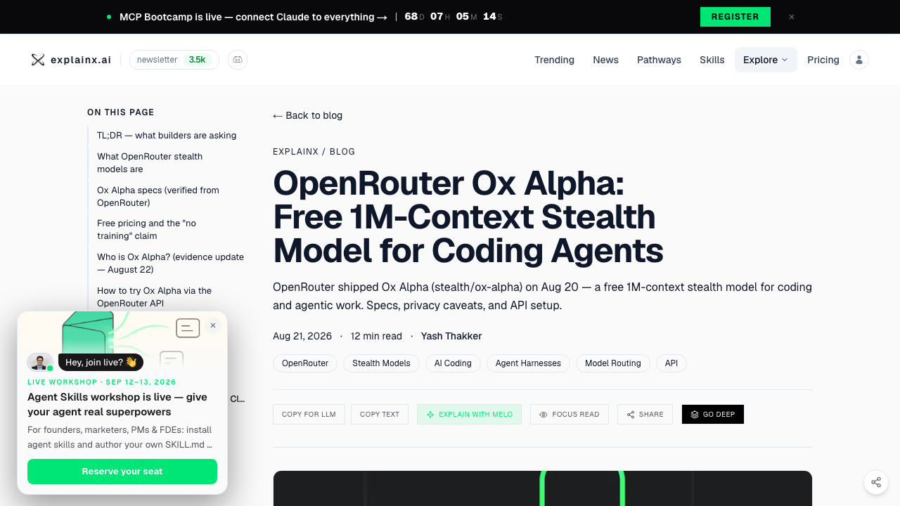
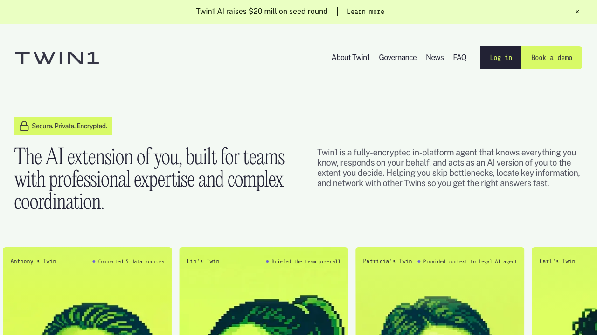
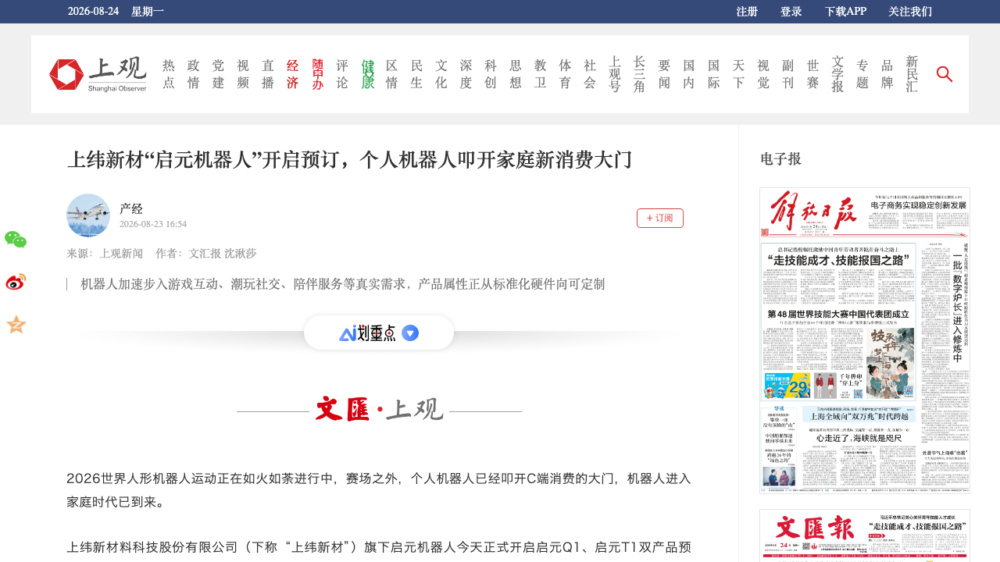
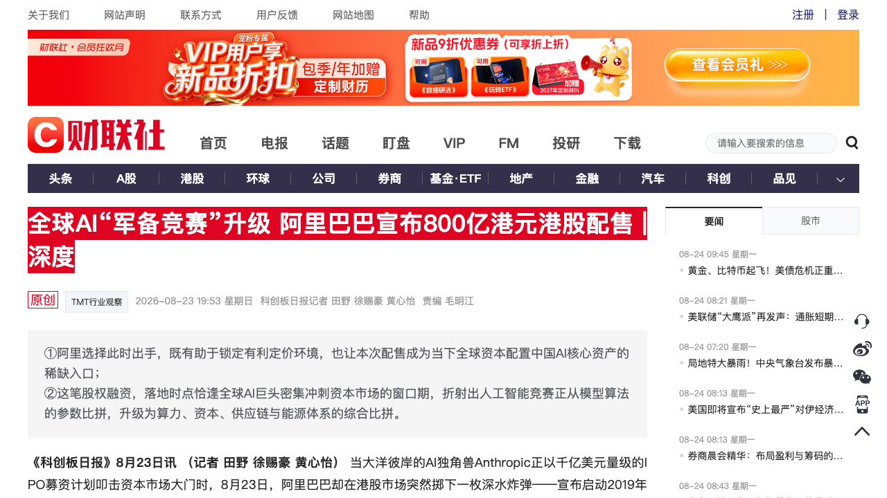
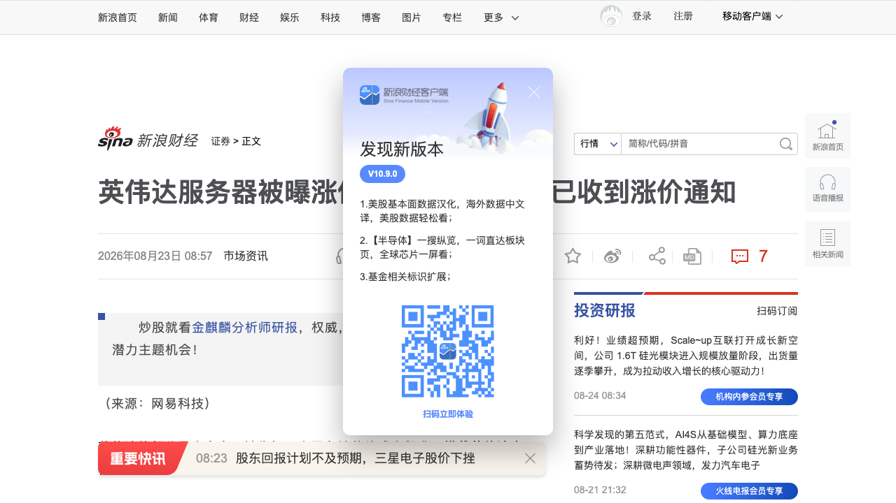

# 0824日报 | AI的「入口与账本」时刻：神秘匿名模型Ox Alpha免费屠榜（1M上下文、指纹指向智谱GLM、Patrick Collison盛赞）、上纬新材启元Q1/T1开启预订（个人机器人进大众消费）、阿里800亿港元配售100%投全栈AI（主权基金超额认购）、英伟达AI服务器被曝涨价15%（HBM占BOM 62%「存储定义算力」）、Twin1 AI 2000万美元种子轮押注「数字分身」成企业AI新界面

## 今日洞察

今天的五个字：「**AI的『入口与账本』时刻。**」

**8月23-24日，五件事指向同一条主线：AI竞争的重心正在从「模型能力」转向「入口与账本」——一边是成本与资本同时收紧，另一边是应用层在争夺新的用户入口。** 入口侧，8月20日一个匿名「stealth model」Ox Alpha突然出现在OpenRouter（免费、104.86万token上下文、13.1万token输出、文本/图片/视频输入、专为编码与长周期Agent设计），随后OpenCode宣布其上线Go且连续数天近乎不限量免费、不计入用户额度，三天内刷屏全球AI圈——Stripe CEO Patrick Collison亲自试用后盛赞「It's very impressive」，开发者们拿着代码库和刁钻任务一拥而上，并开始用Tokenizer指纹、视频token预算、API报错信息给模型做「数字DNA鉴定」：多项受控测试显示Ox Alpha与智谱GLM-5.x高度同源（视频token消耗与GLM-5V-Turbo逐项对上），也有人怀疑是谷歌Gemini 3.5 Pro或微软MAI，还有人调侃「Cursor拿开源GLM自己训的」——「模型是谁训练的」第一次变成全民推理题（此前2月OpenRouter匿名模型Pony Alpha最终揭晓就是GLM-5早期测试版，这次「智谱又来了」的呼声最高）；同一周末，上纬新材（688585.SH）旗下启元机器人8月23日开启启元Q1、T1双产品预订（1000元订金抵2000元、首发礼盒含稚晖君亲签信、预计9月发货）——个人机器人第一次从发布会走进大众消费的收银台；Twin1 AI 8月20日带着2000万美元种子轮出隐身（Bessemer、Tribeca、Aramco Ventures共同领投），押注「企业AI的下一代界面不是另一个聊天机器人，而是你的数字分身」。账本侧，阿里巴巴8月23日宣布2019年上市以来首次新股配售、募资800亿港元、净额100%投入全栈AI能力与基础设施建设，获主权财富基金等长线资金超额认购——「用股权而非债务锁产能，把折旧风险留在权益端」；同一天彭博爆料英伟达已告知部分最大客户：因存储芯片成本飙升，搭载Vera Rubin与Grace Blackwell的AI服务器明年初发货订单普遍涨价超15%——HBM+系统DRAM已占高端整机BOM约62%、GPU本身降至44%，「服务器里最贵的零件已经不是GPU」，HBM供需缺口达50-60%，三星/海力士/美光垄断90%以上产能——AI基础设施正式进入「存储定义算力」的新阶段，1GW数据中心成本激增50亿美元。

**为什么这是创业者的窗口期：①「匿名+免费+神秘」成为2026年最有效的模型分发范式——**Ox Alpha三天内累计250B token级使用量、约8500名独立用户、超11万次完成会话（OpenCode公开数据），「神秘身份+免费额度」比任何发布会都更能引爆开发者心智；对应用创业者，这意味着至少窗口期内「模型供给」是免费+充裕的公共资源——你的差异化不能再押在「调用哪个模型」，而要押在入口、数据与工作流；**②「模型身份不可辨」是2026年AI的新常态——**蒸馏、后训练、第三方推理服务让「谁训练的」和「谁部署的」变成两道题；若Ox Alpha真是智谱出品，说明中国模型的代码/Agent能力正被全球开发者匿名验证（10个真实软件工程任务的社区测试：Ox Alpha 80% vs Fable 5的65%、GLM-5.3的62%、GPT-5.6 Sol的52%——小样本但信号强烈），「中文模型被低估」的叙事有了新证据；**③ 企业AI界面从「聊天框」扩散到「分身」与「人形硬件」——**Twin1把人的邮件/会议/文档炼成「可授权给Agent的上下文资产」，启元Q1把机器人做成「能塞进书包的全身力控小尺寸人形机器人」——「AI的入口」正在从对话框扩散到数字分身、桌面与家庭，谁先占据一个「入口生态位」，谁就有机会定义下一轮交互；**④ 中国AI军备进入「股权融资+体系比拼」阶段——**阿里800亿港元配售（对比美国巨头靠发债扩产，中国厂商用股权锁产能、把硬件贬值风险留在权益端）+ DeepSeek新一轮融资投前约5000亿元、月之暗面Pre-IPO目标投前500亿美元——「资本×芯片×集群效率×电力×软件生态=有效算力」的公式下，一级市场正在为「确定性」买单，香港正成为连接亚洲/中东/欧洲长期资本的接口；**⑤ 成本端掉头向上，「账本能力」成为创业公司的护城河——**英伟达涨价15%+、存储厂商从季度议价切到3-5年长协锁价、B200租赁成本翻倍——纯套壳API的中小AI公司调用成本最高暴涨3.5倍，「会算账」的团队（错峰调度、缓存命中、模型分层、国产替代选项）反而在洗牌中受益。

**三个信号同样关键**：谷歌DeepMind研究员Evan Otero在讨论中发「Gemini」、又说「如果Ox Alpha就是我们一路遇到的朋友呢」，全网「认牛大会」从智谱派转向谷歌派（Gemini 3.5 Pro自I/O「Coming next month」后一再跳票）；上纬新材上半年消费级具身智能机器人业务研发投入1.6亿元、与蓝思智能落地首期万台级产线、与卧龙电驱合作核心部件——个人机器人的量产供应链已经启动；英伟达2026财年Q2营收467.4亿美元同比+56%、已告知投资者到2027年约1万亿美元已确认AI芯片采购订单，而8月26日英伟达财报与Vera Rubin首批出货，将是「涨价能否持续传导」的第一批验证点。

---

## 1. [匿名「stealth model」Ox Alpha刷屏全球：免费1M上下文+视频输入、OpenCode近乎不限量免费，开发者靠Tokenizer指纹扒出「智谱血缘」，Patrick Collison盛赞「very impressive」](https://openrouter.ai/stealth/ox-alpha)（新产品 / 「匿名+免费+神秘」成为2026年最有效的模型分发范式——蒸馏与第三方推理让「模型身份」第一次变成全民推理题，中国模型或被全球开发者匿名验证）

🔗 链接：[OpenRouter·stealth/ox-alpha](https://openrouter.ai/stealth/ox-alpha) | [Business Insider·Who Made Ox Alpha? The Mystery AI Is Turning Heads](https://www.businessinsider.com/ox-alpha-ai-model-mystery-2026-8) | [量子位·匿名牛来大模型被扒出智谱血缘](https://www.qbitai.com/2026/08/478191.html) | [TechCrunch·Who's behind the new 'stealth model' Ox Alpha?](https://techcrunch.com/2026/08/23/whos-behind-the-new-stealth-model-ox-alpha/)

**动态**：**8月20日，一个名为Ox Alpha的匿名模型以「stealth model」身份出现在OpenRouter，标注「由选择在预览期保持匿名的第三方提供商开发运营」，定位是「面向编码、长周期Agent工作与生产负载的推理模型」。** 关键信息：① **规格激进**：104.86万token上下文（1M级）、单次最多输出13.1万token、支持文本/图片/视频输入、工具调用+强制推理模式——直接对标「塞进整个大型代码仓库+一长串Agent运行记录」的场景；② **免费不限量**：OpenCode宣布Ox Alpha上线OpenCode Go，连续数天近乎不限量免费、不计入用户原有Go额度（社区讨论中出现「每天100万亿token级服务容量」的说法）；③ **战绩**：OpenCode公开数据显示累计250B token级使用量、约8500名独立用户、超11万次完成会话；Stripe CEO Patrick Collison在X上试用后称「It's very impressive」（Stripe正在收购OpenRouter）；④ **社区小样本测试**：10个真实软件工程任务中Ox Alpha完成8个（80%），同一组任务Fable 5为65%、GLM-5.3为62%、GPT-5.6 Sol为52%——需注意这只是10道题的非官方测试，Abacus.AI CEO Bindu Reddy与沃顿教授Ethan Mollick都公开表示「低于预期/惊艳程度一般」，评测分歧极大；⑤ **身份之谜**：独立研究者的Tokenizer指纹测试显示Ox Alpha与GLM-5.3的token计数呈高度一致的固定偏移（同一段文本GLM-5.3计68个token、Ox Alpha计143个，多出的75个恰可由外部隐藏System Prompt解释，25组Prompt均验证）；受控视频测试中Ox Alpha与GLM-5V-Turbo的视频token预算逐项吻合（每秒约147个token增速、帧率/分辨率缩放策略一致），而MiMo、Qwen、GLM-4.6V均呈现不同特征；API层还捕捉到与智谱相似的「[1210] temperature parameter is illegal」错误信息——但也有人押注谷歌Gemini 3.5 Pro（1M上下文+原生视频输入正是Gemini方向，DeepMind研究员Evan Otero发「Gemini」暗示）或微软MAI，Reddit两派吵翻天。中国网友因「Ox=牛」+《牛来》梗，干脆叫它「牛来大模型」。

**做什么的**：通俗讲，**Ox Alpha是「一头免费、神秘、还特别能打代码的牛」——你不需要知道它爹妈是谁，打开OpenCode就能白嫖1M上下文的Agent级模型；而全网为它做的「亲子鉴定」（Tokenizer指纹、视频token账单、API报错比对），本质上是一次公开的「模型逆向工程狂欢」。** 三个战略看点：① **「匿名发布」成了最好的营销**——免费+神秘+限时，比任何发布会都更高效地引爆开发者流量，OpenRouter/Pony Alpha（2月匿名模型、后来揭晓是GLM-5早期版）与Ox Alpha两连发，说明「先匿名试水、再官宣认领」正在成为模型厂商的发布新流程；② **多模态指纹让「蒸馏伪装」越来越难**——文本风格可以模仿，但视频token预算、采样策略这类「进入模型前的工程设计」很难伪装，指纹技术本身会变成AI行业的新基础设施；③ **若真是智谱**——意味着GLM-5.x的多模态/代码能力已达到「匿名也能被全球开发者认可为前沿」的水平，中美模型差距叙事将被改写。

**为什么值得关注**：

- **「匿名+免费+神秘」=2026年最有效的模型分发范式，巨头的发布会焦虑来了。** Ox Alpha三天250B token使用量、8500开发者、Patrick Collison背书——OpenAI/Anthropic/Google花几亿美元发布会+广告都不一定换得来的心智，被一个「不知道谁家的免费模型」三天拿到。对创业者的启示：① 你的AI产品也可以借鉴「匿名试水」玩法（隐藏品牌发布、限时免费、社区造谜）——尤其在小圈层/开发者社区，神秘感和稀缺感本身就是增长杠杆；② 「模型供给免费化」正在加速——应用层的价值锚点必须从「调用哪个模型」迁移到「入口、数据、工作流、账本」，否则会被免费供给抽干利润；③ 警惕「免费狂欢」的不可持续性——一周预览期结束后大概率收费或限流，测试要趁窗口期。

- **「模型身份不可辨」是新常态——蒸馏、后训练与第三方推理让溯源成为难题，也放大了「中国模型被低估」的叙事。** 量子位总结得很准：「仅凭模型外部行为判断开发者身份越来越困难；『模型是谁训练的』和『模型在哪里部署』甚至都可能是两道题」。对创业者的启示：① 做模型层的团队，匿名发布可以成为「能力验证+收集真实反馈」的低成本路径（先匿名上OpenRouter收数据，再择机官宣）；② 应用层不用纠结模型出处——按能力与价格选型即可，多模型路由（0821日报Ramp Router）的价值进一步放大；③ 对中文模型生态是利好信号：若Ox Alpha确系GLM家族，说明中国模型的代码/Agent能力已被全球开发者匿名验证，出海API的信任门槛在降低。

- **代码Agent基准战的「匿名黑马」——能力评测的分歧本身说明市场进入「无法用单一榜单定价」的阶段。** 社区测试Ox Alpha 80% vs GPT-5.6 Sol 52%，但Bindu Reddy/Ethan Mollick泼冷水——同一模型在低推理强度下表现一般、视觉明显弱于Gemini。对创业者的启示：① 别被任何单一测试带节奏，Agent能力要用自己的业务负载实测（呼应0823日报「Agent评测从模型榜转向系统榜」）；② 小样本高分的「benchmark套利」依然存在，评测设计（推理强度、任务分布）比模型本身更能决定排名；③ 对做Agent产品的团队，Ox Alpha这类免费高规格模型=窗口期的「成本套利」机会——立刻在OpenCode上把它加进你的路由池，用真实负载测一轮。

- 对创业者的启发：**① 借鉴「匿名+免费+神秘」做开发者社区的冷启动；② 应用层价值锚点从「模型」迁到「入口/数据/工作流」；③ 用指纹思维做模型选型与溯源（tokenizer/视频token/API指纹）；④ 抓住免费窗口期把Ox Alpha加入路由池实测。** 跟踪三个验证点：匿名期结束后Ox Alpha由谁「牵牛认领」（智谱？谷歌？）、预览期后是否转为付费及定价、250B token用量能否转化为真实付费客户留存。

**类比参考**：**「模型发布的『匿名时刻』/ 从『发布会官宣』到『匿名免费+全网认亲』——当一头不知道谁家的牛（Ox Alpha）靠1M上下文和免费额度三天刷屏全球、被开发者拿Tokenizer指纹扒出智谱血缘，'模型是谁训练的'第一次变成全民推理题——而无论答案是谁，2026年最有效的模型营销方式已经变了：不是发布会，是悬念」**

---

## 2. [Twin1 AI带2000万美元种子轮出隐身：给每个专业人士一个AI「数字分身」——从邮件/会议/文档学习你的知识与判断，在Slack/Teams/Outlook里替你作答办事，「企业AI的下一代界面不是聊天机器人，而是数字版的你」](https://techstartups.com/2026/08/20/twin1-ai-emerges-from-stealth-with-20m-in-funding-to-give-every-professional-an-ai-powered-digital-twin/)（融资 / 2000万美元种子轮，Bessemer/Tribeca/Aramco Ventures共同领投——「数字分身」把人的上下文变成可授权的Agent资产，企业AI界面的下一个形态之争开打）

🔗 链接：[TechStartups·Twin1 AI emerges from stealth with $20M](https://techstartups.com/2026/08/20/twin1-ai-emerges-from-stealth-with-20m-in-funding-to-give-every-professional-an-ai-powered-digital-twin/) | [Twin1官网](https://twin1.ai/) | [Twin1官方声明·$20M seed round](https://twin1.ai/news/twin1-ai-raises-20-million-seed-round)

**动态**：**8月20日，总部位于San Mateo（另设伦敦团队）的Twin1 AI宣布出隐身，完成2000万美元种子轮，由Bessemer Venture Partners、Tribeca Venture Partners与Aramco Ventures共同领投。** 关键信息：① **创始团队**：2025年由Dr. Lewis Z. Liu、Tom Cahn、Huiting Liu、Dr. Jonathan Budd创立；② **产品主张**：为每个专业人士构建AI「数字分身」——分身学习你的知识、判断力、工作上下文与沟通风格，可跨Slack、Microsoft Teams、Outlook、Gmail、Google Drive、SharePoint运行，代表你回答问题、处理事务；③ **问题切口**：企业的宝贵知识不在数据库里，而散落在邮件、会议、文档、对话与多年经验中——Twin1要让这些「人的上下文」变得对AI可访问，同时不剥夺员工的控制权（员工决定分身能做什么）；④ **资金用途**：扩张San Mateo与伦敦团队、投入GTM与核心技术研发；⑤ **窗口判断**：正值企业部署AI Agent的爆发期——「数字分身」瞄准的是「Agent如何获得组织内最有价值的知识（人脑里的隐性上下文）」这一空白。

**做什么的**：通俗讲，**Twin1做的是「把你的工作人格复制一份，交给AI替你上班」——它不训练一个通用机器人，而是训练「你」：读你的邮件、听你的会议、翻你的文档，学会你的判断和语气，然后在Slack/Teams/Outlook里替你回消息、跟进度、办杂事，而你随时可以收回控制权。** 三个战略看点：① **「人的上下文」是Agent时代最大的未开采资产**——企业知识管理（KM）几十年没解决的问题（知识在人的脑子里），Twin1用「数字分身」重新包装：不搞知识库迁移，而是让Agent直接长在人的工作流上；② **「可授权」是产品设计的核心**——区别于「全自动Agent」的失控焦虑，分身强调员工控制权（能做什么由人决定），这是企业采购的信任开关；③ **与「AI同事/员工」叙事互补**——Inherent的Faraday（0823日报）是「AI teammate」，Twin1是「你的分身」——2026年企业AI的两条路线：给你一个同事，还是复制一个你。

**为什么值得关注**：

- **企业AI界面从「聊天机器人」走向「数字分身」——界面之争是2026年应用层最大的机会窗口。** Twin1的slogan很直接：「next big enterprise AI interface won't be another chatbot. It will be a digital version of you.」对创业者的启示：① 聊天框是「通用入口」，分身是「个性化入口」——同样调用底层模型，分身捕获了「人的上下文」这一独占数据资产，天然形成数据护城河；② 「人机边界」由用户定义（可授权/可收回）正在成为企业AI产品的标配信任设计；③ 竞争格局还没定：微软Copilot、谷歌Gems、各种AI agent builder都可能长成「伪分身」——真分身的关键差异在「是否持续学习+可被授权操作」，先发者要尽快建立「分身与人的绑定关系」。

- **「让Agent获得隐性知识」是比「给Agent更多工具」更值钱的痛点——知识资产化。** 企业里最有价值的信息在资深员工的邮件与会议里，Twin1把「人的上下文」变成「可授权给Agent的资产」——这本质是「人类知识的Agent化封装」。对创业者的启示：① 做企业Agent的团队，与其卷「工具调用数量」，不如卷「上下文获取能力」（接入了哪些系统、学到了多深）；② 「分身」的合规与伦理边界（员工离职后分身归谁、分身能否被审计）将催生新的治理产品——类似0823日报Claude Security「结果即产品」的安全思路可以平移；③ 垂直行业（律所、投行、咨询）的知识高度人格化，「专家分身」可能是比「通用分身」更快付费的场景。

- **种子轮阵容说明「分身赛道」已被一线基金定价——但2000万美元的体量意味着这仍是早期赌注。** Bessemer（企业SaaS之王）+ Tribeca + Aramco Ventures的组合，押的是「Agent基础设施之上、人的上下文这一层」的价值。对创业者的启示：① 「AI+人的身份」正在成为融资新叙事（对比0819日报Wispr「语音成为下一个界面」、0823日报OriginFlow「Human Tokens」）——凡是把「人的独特信号」（声音/肌肉/知识/风格）变成AI可用资产的创业，都在被资本重新定价；② 分身类产品的关键指标不是「用户数」而是「授权深度」（接入了多少系统、被授权执行了多少任务）；③ 警惕「数字分身」被做成「高级聊天机器人」——没有真实操作闭环的分身只是皮套。

- 对创业者的启发：**① 把「人的上下文」当产品资产做，而不是只做通用Agent；② 「可授权+可收回」是企业AI的信任标配；③ 垂直行业「专家分身」可能比通用分身更快付费；④ 指标盯「授权深度」而非「聊天次数」。** 跟踪三个验证点：Twin1首批企业客户与付费模式、分身跨系统操作的安全审计机制、2026年内是否出现巨头（微软/谷歌）的正面竞争动作。

**类比参考**：**「企业AI的『分身时刻』/ 从『再给我一个AI同事』到『复制一个我替我上班』——当Twin1拿着2000万美元种子轮宣布'下一代企业AI界面是数字版的你'，AI Agent的供给逻辑第一次反转：不是让Agent学会更多工具，而是让Agent学会'你'——人的上下文，成了Agent时代最贵的原材料」**

---

## 3. [上纬新材「启元机器人」开启Q1/T1双产品预订：全球首款全身力控小尺寸人形机器人启元Q1+启元T1，1000元抵2000元、首发礼盒含稚晖君亲签信、预计9月发货——个人机器人正式叩开家庭消费大门](https://www.jiemian.com/article/14970490.html)（新产品 / 个人机器人从发布会走向收银台——「能塞进书包的人形机器人」+天猫/抖音/B站全渠道预订+万台级产线，消费级机器人的「iPhone时刻」在预订环节率先到来）

🔗 链接：[界面新闻·上纬新材「启元机器人」正式开启预订](https://www.jiemian.com/article/14970490.html) | [北京商报·上纬新材消费级机器人开启预订](https://www.163.com/dy/article/L51STO670519DFFO.html) | [量子位·你的第一个个人机器人开启预订](https://www.qbitai.com/2026/08/478017.html) | [新浪财经·上纬新材正式发售个人机器人](https://finance.sina.com.cn/stock/t/2026-08-23/doc-iniphnkw2575988.shtml)

**动态**：**8月23日，上纬新材（688585.SH）旗下启元机器人正式开启启元Q1、启元T1双产品预订，用户可通过上纬启元官方小程序、天猫、抖音、B站官方店铺及线下体验活动参与，预计首发发货时间为2026年9月。** 关键信息：① **预订权益**：支付1000元订金抵扣2000元购机尾款；购机30天内享Care保障套装、官方配件及周边7折；预订用户获全套首发珍藏礼盒（含稚晖君亲签信、创始用户收藏卡、首发限定机器人手办），优先解锁启元Q1外壳定制权益，额外赠送半年整机质保与1V1专属客服优先响应；② **产品背景**：启元Q1为全球首款全身力控小尺寸人形机器人（身高约0.8米、可「打包带走」塞进书包，开放全量SDK/HDK接口），2025年12月31日由上纬新材董事长、智元机器人联合创始人彭志辉（稚晖君）发布；此前已在2026世界人工智能大会、ChinaJoy完成小范围预订，并在广州/杭州/上海等地落地线下体验与内购；③ **公司投入**：据2026年半年报，上半年消费级具身智能机器人业务研发投入达1.6亿元，覆盖AI模型、具身智能算法、运动智能、交互智能、轻量化关节等核心技术；④ **量产准备**：与蓝思科技旗下蓝思智能签约落地首期万台级规模机器人产线合作，与卧龙电驱达成核心部件产线战略合作；⑤ **价格**：本次预订未公布正式售价（市场此前消息称Q1起售价约8.5万元量级）。

**做什么的**：通俗讲，**启元机器人是「把实验室装进背包的个人机器人」——Q1是全球最小的全身力控人形机器人之一（0.8米、能塞书包、全量SDK/HDK开放，研究者可以把它当「第一台毕业机」），T1是面向家庭/陪伴场景的另一形态；8月23日这一天，它从「展台产品」变成了「可预订商品」——1000元锁权益、9月发货、天猫抖音B站都能下单。** 三个战略看点：① **「预订」是消费级机器人的第一道成人礼**——此前人形机器人都在发布会和展会上「秀肌肉」，启元首次把「个人机器人」放进大众消费渠道（小程序/天猫/抖音/B站+线下），并用「定金膨胀+收藏礼盒+限定手办」全套消费电子营销打法，等于官方宣布「机器人开始按消费品的逻辑卖了」；② **稚晖君IP+上纬A股平台+智元技术血缘的组合**——稚晖君（彭志辉）同时是智元机器人联合创始人，2025年12月正式执掌上纬新材并变更业务方向，「个人机器人」赛道第一次有了「顶流工程师IP+上市公司产能+A股融资能力」三位一体的玩家；③ **万台级产线+核心部件自研是「平价化」的伏笔**——蓝思智能万台产线、卧龙电驱核心部件合作，说明启元在按「年出货万台级」准备供应链——消费机器人的成本曲线即将跟随产量下探。

**为什么值得关注**：

- **「个人机器人进大众消费」是具身智能从「接订单」到「收定金」的关键一跃——与WRC「能接单」叙事（0820日报）形成接力。** 0820日报工信部数据显示机器人产业从「秀肌肉」转向「接订单」，启元Q1/T1则更进一步：直接对C端开预订。对创业者的启示：① 具身智能的「消费品化」窗口正在打开——但真正的门槛是「预订-交付-售后」全链路的消费级运营能力（定金、礼盒、质保、客服），纯技术团队做不了这件事；② 「小尺寸+全身力控+开放SDK」的产品定义值得抄——家用机器人不一定要大而全，0.8米「书包级」+开发者友好的开放接口，先圈住研究者/极客基本盘，再向家庭渗透；③ 关注「先预订后定价」的定价策略——用权益和稀缺性锁客，正式价格留到交付前，这给了供应链成本下探的空间。

- **「IP化创始人+上市公司平台」正在成为国内具身创业的新范式——个人品牌是消费级硬件最大的冷启动杠杆。** 稚晖君（B站顶流工程师、「天才少年」人设）亲自站台+亲签信礼盒，直接把技术发布会变成粉丝经济事件。对创业者的启示：① 做消费级AI硬件，创始人的内容能力（演示视频、人格化叙事）就是获客预算——参考0823日报雷鸟iO的「人类增强」叙事、OriginFlow的「00后博士」叙事；② A股上市公司收购/绑定明星创业者做「第二增长曲线」会成为常态（上纬新材2025年拿下A股涨幅冠军、股价受机器人叙事驱动）——技术创始人要理解「资本平台」与「技术品牌」如何互相借力；③ 但警惕「叙事溢价」与「交付能力」的落差——预订到9月发货之间，市场会紧盯量产爬坡与品控。

- **「个人机器人」赛道进入多路线并跑期——书包级（启元Q1）、家庭管家、宠物型、桌面型，谁先跑通「预订-交付-复购」谁定义品类。** 与上纬启元同场竞技的还有各种「家庭机器人」叙事（如0813日报诺因智能「把家务机器人折进40厘米」）。对创业者的启示：① 品类定义权在「第一个规模化交付者」手里——预订只是开始，9月能否如期交付、良率多少才是生死线；② 消费机器人的「杀手场景」仍未被证明——启元Q1开放SDK/HDK的打法本质是「让开发者替你找场景」，先建生态再找PMF；③ 硬件平价化依赖供应链，万台级产线（蓝思）与核心部件（卧龙）的合作模式值得所有消费硬件团队参考——不要自己建厂，绑定成熟供应链。

- 对创业者的启发：**① 消费级机器人按「消费品逻辑」打（定金/礼盒/全渠道/质保），预订制是锁客+测需求的双用工具；② 「小尺寸+全身力控+开放SDK」是家用机器人的差异化切口；③ 创始人IP是消费硬件的冷启动杠杆；④ 供应链绑定（万台级产线）比自建产能更聪明。** 跟踪三个验证点：9月首发交付是否如期与良率表现、Q1/T1正式定价与首批预订量、稚晖君IP能否转化为持续的开发者生态（SDK/HDK的第三方应用数量）。

**类比参考**：**「人形机器人的『收银台时刻』/ 从『展台上秀肌肉』到『小程序里付定金』——当0.8米、能塞进书包的全身力控人形机器人启元Q1在抖音和天猫开启预订、礼盒里装着创始人的亲签信，'个人机器人'第一次按消费电子的玩法走向家庭——具身智能的'iPhone时刻'也许还很远，但它的'预售时刻'已经来了」**

---

## 4. [阿里巴巴宣布800亿港元港股配售：2019年上市以来首次新股配售、净额100%投入全栈AI能力与基建，获主权基金等长线资金超额认购——「用股权而非债务锁产能，把折旧风险留在权益端」，中美AI军备竞赛从参数比拼升级为资本/算力/供应链/能源体系比拼](https://www.cls.cn/detail/2461729)（行业洞察 / 巨头开始为AI重资产「提前融资锁产能」——AI竞争进入「体系比拼」阶段，香港成中国AI资本接口，DeepSeek/月之暗面估值同步重估）

🔗 链接：[财联社·全球AI「军备竞赛」升级 阿里巴巴宣布800亿港元港股配售](https://www.cls.cn/detail/2461729) | [Reuters·Alibaba launches $10 billion Hong Kong share placement to fund AI spending](https://www.reuters.com/business/retail-consumer/alibaba-proposes-hong-kong-share-placement-worth-10-billion-2026-08-23/) | [新浪财经·独角兽遍地背后：一级市场正在为「确定性」买单](https://finance.sina.com.cn/jjxw/2026-08-23/doc-inipichu3523171.shtml)

**动态**：**8月23日，阿里巴巴宣布启动2019年上市以来的首次新股配售，募资总额高达800亿港元（约合100亿美元），采用美国证券法Regulation S离岸发行模式、仅面向美国境外投资者，所得款项净额100%用于投资全栈人工智能能力与基础设施建设。** 关键信息：① **认购火爆**：据接近阿里巴巴的消息人士，配售启动后很快获超额认购，主权财富基金等高质量长线做多投资者需求尤为强劲——「阿里选择此时出手，既有助于锁定有利定价环境，也让本次配售成为当下全球资本配置中国AI核心资产的稀缺入口」；② **财务背景**：截至2026年6月30日季度，集团收入2689.53亿元（同比+9%），但资本开支达676.78亿元（同比+75%）、自由现金流净流出扩大至446.70亿元——「阿里不是没钱，而是在AI军备竞赛进一步资本密集化之前先把钱准备好」（汇生国际资本总裁黄立冲）；③ **三年计划进度**：2025年2月CEO吴泳铭宣布三年投3800亿元云与AI硬件（超过过去十年总和），截至2026年6月进度已近半（约1900亿元）；阿里云收入同比增速加速至45%、AI相关产品收入连续12个季度三位数增长；④ **组织动作**：云智能与平头哥半导体合并、新设「AI云与算力服务」分部，形成芯片、模型、云基础设施三层纵向一体化；⑤ **背景对照**：Anthropic已于6月向SEC秘密递交IPO申请、预计最快10月挂牌、估值目标冲击2万亿美元；OpenAI同样瞄准Q4上市、私募市场估值约8500亿美元；腾讯Q2单季资本开支527.84亿元（同比+176%）；国内DeepSeek新一轮融资投前估值约5000亿元人民币、月之暗面Pre-IPO目标投前估值500亿美元。

**做什么的**：通俗讲，**这是「巨头给AI军备竞赛开的第二张信用卡」——阿里账上不差钱，但AI硬件（GPU/HBM/先进封装）折旧快（3-4年）、回报周期还没验证，继续发债会把硬件贬值风险压到债务端；于是它选择增发股票融资，把「风险留在权益端」，用股权换「算力所有权」——主权基金们抢着认购，等于用脚投票「中国AI核心资产值得长线持有」。** 三个战略看点：① **融资路径的中美分野**——美国巨头（微软/亚马逊/Meta）靠投资级信用发债扩产，中国厂商拿不到「外包船票」、必须自己把芯片-模型-云三层建完整，所以用股权锁产能；② **「AI有效算力」公式被点名**——资本×芯片×集群效率×电力×软件生态=有效算力（黄立冲）——中国单芯片性能追不平时，靠集群规模+国产互联+高效模型（通义千问/DeepSeek）做系统级效率追赶；③ **香港的角色升级**——面向非美投资者的Reg S配售，强化了香港作为中国科技企业连接亚洲/中东/欧洲长期资本接口的功能——「如果未来几年越来越多中国AI基建资金通过香港、亚洲和中东资本形成，这次800亿港元可能被回头看作标志性事件」。

**为什么值得关注**：

- **AI军备竞赛进入「资本密集化」阶段——巨头开始为未来3-4年的算力开支「提前融资」，创业者要理解「钱从哪来」的新结构。** 阿里配售+腾讯资本开支翻倍+DeepSeek/月之暗面天价估值，说明中国AI的「军备竞赛」已经从「烧利润」进入「烧股权」阶段。对创业者的启示：① 巨头融资动作是你判断「算力供给与价格」的先行指标——阿里拿钱锁产能，意味着未来1-2年国产算力供给会加速，训练/推理成本曲线可能被巨头补贴拉低；② 「AI资本开支-商业化速度」的赛跑是2026年最大的宏观变量——黄立冲的警示「投资者最需要警惕的不是AI不成功，而是AI商业化速度赶不上资本开支速度」，对创业公司同样适用：你的成本结构必须比巨头更早跑赢资本成本；③ 观察指标：未来两三个季度阿里云经营杠杆是否随资本开支改善——若改善，说明中国AI从「训练军备竞赛」切换到「推理规模经济」，应用层将迎来算力红利。

- **「一级市场为确定性买单」——DeepSeek约5000亿元、月之暗面500亿美元Pre-IPO估值的背后，是资本从「赌技术」转向「赌退出确定性」。** 独角兽遍地但资金集中在少数头部项目：IPO退出确定性（阿里/Anthropic/OpenAI的上市窗口）+交易确定性（热门项目持续提价、下一轮有人接棒）。对创业者的启示：① 融资叙事要往「确定性」靠——可验证的收入、明确的退出路径、被验证的客户付费，而不是「AGI愿景」；② 头部项目估值飙升的溢出效应：DeepSeek/月之暗面之后，中间层模型公司的估值锚被抬高，但也意味着「下一轮接棒者」会更挑剔——没有商业化证据的团队融资窗口在收窄；③ 香港/中东/亚洲长线资金正在成为人民币与美元之外的中国AI第三资金来源——有出海/主权基金背景的创业者可以主动对接这条线。

- **「体系比拼」取代「参数比拼」——芯片、模型、云、能源、供应链五层一起卷，创业公司的生态位选择比努力更重要。** 阿里把云智能+平头哥合并成「AI云与算力服务」分部，说明巨头在做纵向一体化；对创业者的启示：① 不要在巨头「纵向一体化」的路径上硬碰（自研芯片+模型+云），而是找「巨头之间的缝隙」——垂直场景、私有化部署、行业数据、Agent编排层；② 「全栈AI」是巨头的语言，「单点极致」才是创业公司的语言——你的护城河应该在某一层做到比巨头更快更便宜（呼应0823日报「做垂直harness或私有化」）；③ 能源/电力作为「有效算力公式」的一环被正式摆上台面——电力资产、绿电、储能相关的AI配套创业（如0813日报算力金融化、能源调度）处于长坡厚雪。

- 对创业者的启发：**① 用「巨头融资动作」做算力供给与价格的先行指标；② 融资叙事向「确定性」靠拢（收入/退出/被验证的付费）；③ 避开巨头纵向一体化的路径，做「单点极致」；④ 对接香港/中东长线资本与能源/电力新变量。** 跟踪三个验证点：配售定价与超额认购倍数、阿里云未来两季度经营杠杆是否改善、Anthropic（10月）与OpenAI（Q4）IPO对全球AI资金的分流效应。

**类比参考**：**「AI军备竞赛的『资本化时刻』/ 从『烧利润扩产』到『增发800亿港元锁产能』——当阿里在AI硬件折旧3-4年、回报未验证的当口选择用股权而非债务给军备竞赛买单，'把折旧风险留在权益端'第一次成为巨头级操作——而主权基金的抢购也在宣告：AI的下一轮竞争，比的不只是谁的模型强，而是谁能把资本、芯片、电力、供应链和退出通道拧成一股绳」**

---

## 5. [英伟达AI服务器被曝涨价超15%：存储芯片成本飙升、HBM+系统DRAM已占整机BOM约62%「最贵的零件不再是GPU」、HBM供需缺口50-60%，1GW数据中心成本激增50亿美元——AI基础设施进入「存储定义算力」新阶段](https://finance.sina.com.cn/stock/t/2026-08-23/doc-iniphhay2625440.shtml)（行业洞察 / 算力成本曲线掉头向上——「存储-GPU协同时代」开启，三层传导把涨价推向云巨头与应用层，套壳小厂将被洗牌，「会算账」成为AI创业者的新护城河）

🔗 链接：[新浪财经·英伟达服务器被曝涨价15%，部分客户已收到涨价通知](https://finance.sina.com.cn/stock/t/2026-08-23/doc-iniphhay2625440.shtml) | [量子位·英伟达AI服务器将涨价15%！1GW数据中心成本激增50亿美元](https://www.qbitai.com/2026/08/478164.html) | [TruthDigger/网易·英伟达AI服务器涨价超15%，存储芯片是推手](https://www.163.com/dy/article/L514HS7405229GSU.html) | [Reuters·Nvidia customers face over 15% server price hikes](https://www.reuters.com/technology/ai-chip-startup-etched-valued-21-billion-latest-funding-round-2026-08-18/)

**动态**：**8月22-23日，据彭博社援引知情人士，英伟达已向部分最大客户告知：由于存储芯片成本飙升，搭载Vera Rubin和Grace Blackwell芯片的AI服务器系统，明年初发货的订单在多数情况下涨价将超过15%；为微软、谷歌、甲骨文代工的服务器厂商近期已向客户预告这轮涨价。** 关键信息：① **并非一刀切**：路透表示无法独立核实该报道、英伟达未立即置评；涨幅取决于芯片代际与内存配置——准确表述是「整套AI服务器系统报价上调的市场消息」；② **根源是存储**：HBM3e 2026年交付合约价同比上涨约20%，集邦咨询预计2026年Q3 Server DRAM合约价再环比涨13%-18%；三星、SK海力士、美光三家垄断全球90%以上HBM产能；截至2026年Q2，HBM供需缺口达50%-60%，SK海力士董事长称客户要求的供货量接近原需求两倍，存储厂商已把议价模式从季度议价切换为3-5年长协锁价；③ **「存储定义算力」**：在Vera Rubin等高端AI服务器中，HBM加系统DRAM在整机BOM成本占比已冲至约62%，GPU芯片本身占比降至44%——「服务器里最贵的零件，已经不是英伟达自己的GPU」；台积电CoWoS先进封装产能售罄到2027年中，数据中心GPU交期仍长达36-52周；④ **三层传导**：存储厂→英伟达（此前已上调芯片及模组价格10%-15%）→ODM代工厂（广达、纬创等，存储部件涨价50%以上、利润率被严重挤压）→云巨头（一台原本500万至700万美元的Vera Rubin NVL72，15%涨幅意味着多掏大几十万甚至上百万美元）；⑤ **卖方市场**：英伟达2026财年Q2营收467.4亿美元（同比+56%），并已告知投资者到2027年约有1万亿美元已确认AI芯片采购订单——供给约束下不愁卖，8月26日将公布Q2财报。

**做什么的**：通俗讲，**这是「AI算力账单的涨价通知」——过去两年大家以为瓶颈是GPU，2026年的现实是存储芯片（HBM/DDR5）比GPU更紧：一台高端AI服务器里最贵的零件已经从GPU变成了内存，存储三巨头垄断90%以上产能、还从「季度议价」改成「3-5年锁价」，英伟达只能把成本往下游传——云巨头多掏大几十万到上百万美元一台机器，最终这笔账会通过API价格与租赁价格传导到每一个AI开发者头上。** 三个战略看点：① **定价锚从「GPU」切换到「存储+先进封装」**——黄仁勋GTC 2026已预告：推理模型每次调用消耗的token是一次性问答的100-1000倍，过去两年AI总算力需求暴增约100万倍，高盛预计到2030年月度token消耗再增约24倍——每一枚token最终都要GPU「吐」出来，而每一颗GPU都离不开HBM；② **三层传导的终点是应用层**——无自主模型、仅靠二次封装API的中小AI公司调用成本最高暴涨3.5倍，B200租赁成本翻倍将直接抬高通用大模型企业训练成本30%-50%；③ **国产替代窗口被实质性扩大**——TrendForce预测2026年中国高端AI芯片市场国产份额将达90%（英伟达+AMD合计降至10%），华为昇腾2025年出货约81.2万张，DeepSeek V4系列已全面适配国产算力平台。

**为什么值得关注**：

- **算力成本曲线掉头向上——「AI越来越便宜」的线性叙事被打破，账本能力成为创业公司的新护城河。** 过去两年大家默认「摩尔定律式降价」，现在存储瓶颈把成本曲线重新掰弯。对创业者的启示：① 把「单位token成本」纳入产品级指标（呼应0823日报OpenAI降价、0819日报「单位token成本是生死线」）——涨价周期里，谁的缓存命中率高、谁的模型分层做得好、谁能错峰调度，谁就能把成本优势变成定价优势；② 「纯套壳」模式进入倒计时——调用成本最高暴涨3.5倍，没有优化能力的小厂商将失去生存空间；③ 你的成本模型要同时算「涨价传导」与「国产替代」两条路径——国产算力（昇腾/寒武纪）+开源模型（DeepSeek/GLM）的组合性价比窗口正在打开。

- **「存储定义算力」——AI基础设施的瓶颈叙事从GPU切换到HBM，供应链话语权发生结构性转移。** 存储三巨头垄断90%+产能+长协锁价，是2026年AI产业链里议价权最强的环节。对创业者的启示：① 做AI基建/云服务的团队，要重估「存储成本占比」——HBM占BOM 62%意味着服务器定价将跟随存储期货而非GPU期货，采购策略要向「长协锁价」靠拢；② 存储、先进封装（CoWoS）、液冷等「被忽视的瓶颈层」正在成为新投资热点——类比0819日报Etched「推理芯片」、0821日报Velaura「每瓦性能」，做「瓶颈层」生意的创业公司（HBM测试、先进封装设备、存储控制器）处于长坡厚雪；③ 云巨头被迫加速自研ASIC（谷歌与Marvell合作第八代TPU、2026年自研占比或达70%；微软Maia、亚马逊Trainium）——ASIC供应链（IP、EDA、测试）的机会同步放大。

- **「涨价传导」是一面照妖镜——强者转嫁成本、弱者被洗牌，AI应用层的分化将加速。** 三层传导（存储→英伟达→ODM→云巨头→应用）每一层都在转嫁，最终落在没有议价权的套壳应用上。对创业者的启示：① 拥有「自研模型/自主优化能力」的团队（DeepSeek适配国产平台、自建推理栈）在涨价周期里反而获得相对成本优势；② 「面向开发者的API中间层」要设计「成本对冲」产品（多模型路由、缓存复用、批处理调度——0821日报Ramp Router模式的付费意愿会被涨价强化）；③ 涨价预期下A股算力硬件链全线走强，但「有订单兑现的龙头吃真红利、纯炒概念的跟风标的风险陡增」——做配套生意的团队要押「订单兑现」而非「概念」。

- 对创业者的启发：**① 把「单位token成本」与「存储/算力成本传导」纳入经营仪表盘；② 用缓存/分层/错峰/多模型路由做成本对冲，套壳模式尽快转型；③ 关注「瓶颈层」创业机会（HBM测试、先进封装、存储控制器、ASIC供应链）；④ 评估国产算力+开源模型的性价比切换窗口。** 跟踪三个验证点：8月26日英伟达Q2财报与涨价指引、Vera Rubin首批出货与2027年量产爬坡、云巨头API价格是否跟涨及涨幅。

**类比参考**：**「AI算力的『存储时刻』/ 从『GPU为王』到『HBM定生死』——当一台高端AI服务器里最贵的零件从GPU变成内存、存储三巨头把议价模式改成3-5年锁价，'AI越来越便宜'的线性叙事第一次被成本曲线打断——而英伟达这15%的涨价通知，也在提醒所有AI创业者：算力不是免费的，存储更不是无限供应的，AI时代的账，要开始一笔一笔认真算了」**

---

*本日报由422产品实验室AI产品分析师出品，聚焦AI创业者的融资情报、创新产品与商业模式信号。*
