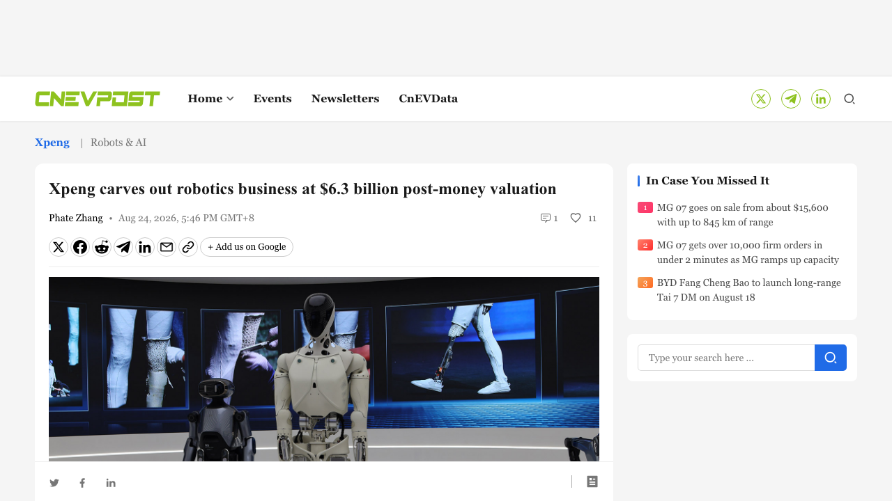
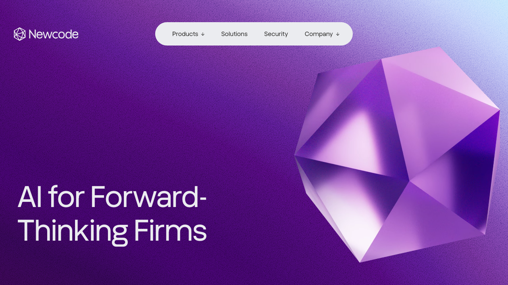
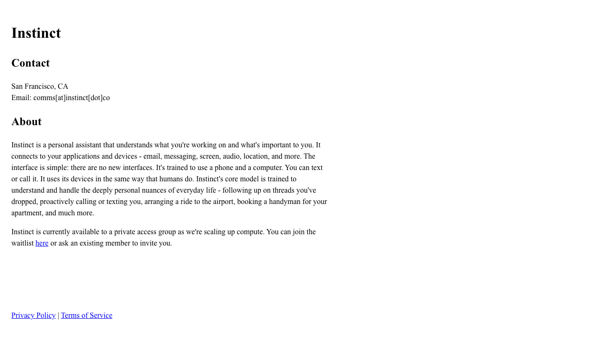
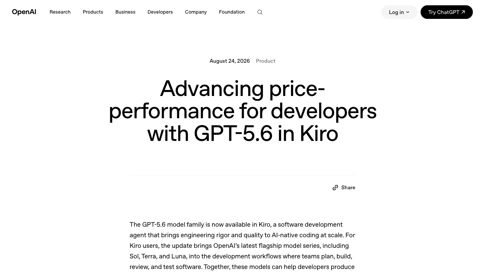
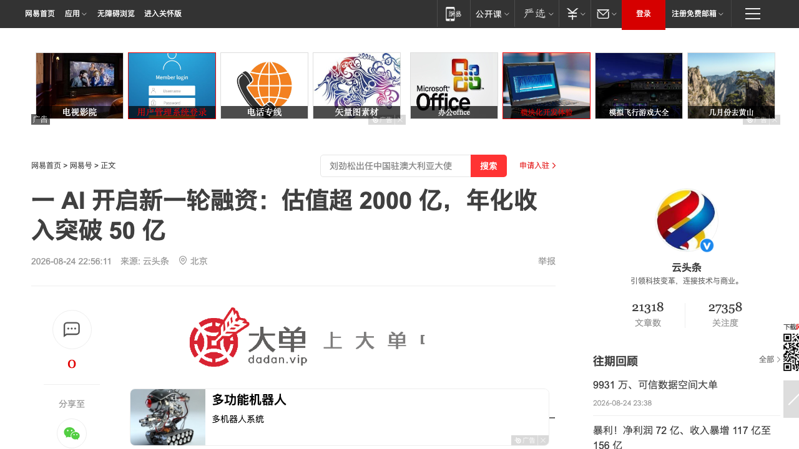

# 0825日报 | AI的「卖铲人买矿」时刻：英伟达洽谈以300亿美元估值投资Perplexity（另砸60亿美元买Poolside模型授权+向100名员工发offer）、小鹏机器人9亿美元A轮估值63亿美元创中国具身智能纪录（IRON年底量产、76自由度+2250 TOPS端侧算力）、OpenAI把GPT-5.6全家桶塞进AWS编码Agent Kiro（Terminal-Bench 2.1成本降82%「渠道战」开打）、Reflexion作者新作Instinct引爆硅谷却被「永久不可撤销」条款反噬（个人助理的信任悬崖）、Newcode 1350万美元A轮做法律AI编排层（e-discovery巨头Relativity创始人亲自领投）

## 今日洞察

今天的五个字：「**AI的『卖铲人买矿』时刻。**」

**8月24-25日，五件事指向同一条主线：AI的价值重心正在从「基础设施层」向「应用/渠道/信任/垂直数据层」下沉——连最大的卖铲人英伟达都开始亲自下场买矿了。** 卖铲人侧，8月24日The Information报道英伟达正洽谈参与Perplexity新一轮股权融资（整轮规模达数十亿美元、估值将超300亿美元，较2025年9月的200亿美元一年涨超50%；Perplexity年化收入已超7.5亿美元、8个月增长超2倍，Agent产品Perplexity Computer是主要增长引擎）；而在谈股权投资之前，英伟达曾考虑以数十亿美元购买Perplexity部分技术授权并招聘部分员工——上周它刚刚对Poolside这么干过：60亿美元买模型开发技术授权+向100多名员工发工作邀请+拟以120亿美元投前估值投资10亿美元，合计英伟达在AI软件/模型层的布局已达约70亿美元——「卖铲人」第一次需要「买几座矿」来续命：推理需求才是它的命脉，投资应用与模型=锁定推理需求+获得数据飞轮。买矿侧，小鹏集团8月24日宣布机器人业务（剥离为Dogotix独立运营）完成首轮超9亿美元融资、投后估值超63亿美元（约430亿元人民币），由IDG资本领投、高榕创投参投、腾讯与阿里作为战略投资者支持，刷新中国具身智能行业单轮私募股权融资纪录——IRON人形机器人76个自由度（每手21个）、三颗Turing自研芯片2250 TOPS端侧算力、车规级质量标准，2026年底量产、2027年上市交付，小鹏用十年造车攒下的供应链与制造能力给「机器人创业」换了新的估值锚；同一周，Generalist AI的GEN-1.5（8/19发布、8/20量子位称「机器人的GPT-3时刻真的来了」）展示了「物理提示」——看3-12秒示范就能学会新任务、无需梯度更新，「物理AI的scaling law」正在被验证（此为背景，非当日动态）。渠道侧，OpenAI 8月24日官宣GPT-5.6全家桶（Sol/Terra/Luna）进驻AWS的软件开发Agent Kiro：与AWS联合优化后在Terminal-Bench 2.1上Terra任务成本降约82%，主打「spec-driven development」与「每token价值」——模型厂商的竞争从「发布会宣发」进入「渠道上架」阶段。信任侧，前Sierra研究员、Reflexion论文作者Noah Shinn打造的AI个人助理Instinct（可接管你的邮件/消息/日历/屏幕/键盘，短信或WhatsApp即可召唤）被测试者盛赞「像魔法一样」「OpenClaw以来最令人兴奋的发布」，却因一份「永久且不可撤销」、可读取屏幕截图/光标/键盘输入、可代你签有约束力协议的条款被全网炮轰——个人Agent的「权限设计」第一次成为生死线。垂直侧，挪威法律AI编排公司Newcode 8月24日完成1350万美元A轮，由e-discovery巨头Relativity创始人Andrew Sieja的投资公司OnDean Forward领投，定位「律所的运营层」——把律所的知识、工作流、数据变成专有AI能力，垂直行业「编排层」正在被资本单独定价。

**为什么这是创业者的窗口期：①「被巨头看上」的剧本变了——从「给你钱」变成「授权+挖人+投资」三选一。** 英伟达对Perplexity先谈「数十亿美元买技术授权+招聘员工」、谈不拢才转向股权投资；对Poolside则是授权+挖人+投资三件套——当卖铲人开始买矿，它对「矿」的胃口是整座矿山而不是一张支票。对创业者的启示：应用层公司被巨头接触时，要把「技术授权+人才收购」当作比股权投资更常见的剧本，提前想清楚哪些资产可以卖、哪些团队会被挖、以及「被英伟达看上的叙事」本身值多少钱；**② 具身智能进入「量产资本化」——估值锚从「demo能力」变成「量产能力+供应链」。** 小鹏9亿美元/63亿美元估值的纪录，锚点不是「机器人多会翻跟头」，而是「车规级产线+76自由度+自研芯片+2027年交付」——汽车公司（小鹏/特斯拉）把十年供应链平移到机器人，纯创业团队单靠demo融资的窗口在收窄，绑定成熟供应链（呼应0824启元×蓝思万台产线）成为标配动作；**③ 模型分发进入「渠道战」——OpenAI借AWS的Kiro、Anthropic借Claude Code、谷歌借Gemini CLI，「每token价值」取代「参数」成为营销语言。** spec-driven development（规格驱动开发）成为2026编码Agent的新范式（呼应0823「harness＞model」、0821「路由层被定价」），对应用创业者：不要绑死单一模型的发布会，要把「渠道接入能力」和「成本优化能力」当产品能力来建；**④ 全能个人助理撞上「信任悬崖」——能力越强、权限越大、条款越宽，反噬越快。** Instinct的「魔法」与「永久不可撤销」条款在同一条时间线出现，对照0824日报Twin1的「可授权可收回」设计——个人Agent的信任设计（权限边界、数据条款、可撤销性）从加分项变成必选项，谁能把「能力-权限-信任」三角做平衡，谁就能拿到下一代个人入口；**⑤ 垂直行业「编排层」被资本定价——法律（Newcode）、财务（Rillet）、医疗的「行业知识+工作流变成专有AI能力」叙事正在接力。** 大模型同质化之后，真正的护城河在「行业运营层」：谁先接入最多律所/事务所的私有数据与工作流，谁就拥有巨头拿不走的垂直编排权。

---

## 1. [小鹏机器人完成首轮超9亿美元融资、投后估值超63亿美元：IDG领投、高榕参投、腾讯阿里战略支持，刷新中国具身智能单轮私募融资纪录——IRON人形机器人76自由度+三颗Turing芯片2250 TOPS端侧算力，2026年底量产、2027年上市交付，「汽车厂供应链」成为机器人估值的新锚](https://www.reuters.com/business/retail-consumer/xpeng-says-its-robotics-business-raised-over-900-million-first-funding-round-2026-08-24/)（融资 / 具身智能从「demo融资」进入「量产资本化」——IDG领投9亿美元A轮、腾讯阿里罕见同台，「能不能造」取代「能不能秀」成为估值锚）

🔗 链接：[Reuters·Xpeng's robotics unit valued at over $6.3 billion after record funding round](https://www.reuters.com/business/retail-consumer/xpeng-says-its-robotics-business-raised-over-900-million-first-funding-round-2026-08-24/) | [CnEVPost·Xpeng carves out robotics business at $6.3 billion](https://cnevpost.com/2026/08/24/xpeng-carves-out-robotics-business/) | [RoboticsTomorrow·XPENG robotics business raises over US$900 million](https://www.roboticstomorrow.com/news/2026/08/24/xpeng-robotics-business-raises-over-us900-million-at-a-post-money-valuation-of-over-us63-billion-accelerating-physical-ai-deployment/26985/) | [新浪财经·小鹏机器人首轮融资超9亿美元](https://tech.sina.cn/2026-08-24/detail-inipmnps2846731.d.html)

**动态**：**8月24日，小鹏集团宣布其机器人业务（将剥离为Dogotix独立运营）完成首轮融资，金额超9亿美元，投后估值超63亿美元（约430亿元人民币），刷新了中国具身智能行业单轮私募股权融资的纪录。** 关键信息：① **阵容**：由IDG资本领投、高榕创投参投，腾讯和阿里巴巴作为战略投资者支持——腾讯与阿里罕见同台押注同一家人形机器人公司；② **股权结构**：融资完成后小鹏集团仍控股（持股降至81.97%，若额外认购完成或摊薄至68.41%），机器人业务继续并表；③ **IRON人形机器人**：76个自由度（全身）、每只手21个自由度，三颗自研Turing AI芯片提供2250 TOPS端侧有效算力，物理AI基座模型直接部署在机器人上、无需远程操控，采用车规级安全与质量标准；④ **量产节奏**：预计2026年底进入量产，先在小鹏门店与园区商业部署，2027年在中国及海外正式上市交付；⑤ **资金用途**：软硬件研发、物理AI模型训练与迭代、高质量数据生成、端到端量产基地建设、全球商业化扩张；⑥ **对标**：宇树科技此前通过科创板IPO募资约9.05亿美元，小鹏单轮私募即追平这一量级。

**做什么的**：通俗讲，**小鹏是「把造车的家底搬到机器人上」——IRON不是实验室里翻跟头的demo，而是一台按车规标准设计、76个自由度、每只手21个关节、用三颗自研芯片在机器人本体上跑物理AI模型的人形机器，而这次融资是「物理AI公司」第一次按量产能力而不是demo能力被定价：9亿美元、63亿美元估值，买的是小鹏十年的供应链、制造基地和「2027年真的交付」的承诺。** 三个战略看点：① **「汽车厂机器人」范式成型**——小鹏把智能电动车积累的供应链、质量体系、制造能力整体平移到人形机器人，与特斯拉Optimus同路线，「造车的人造机器人」正在定义具身智能的工业化路径；② **腾讯阿里同台=「平台资本」为物理AI站台**——两家战略投资者同时入场，说明互联网巨头把「人形机器人量产」视为下一个必须占位的入口级资产（呼应0824启元预订与阿里配售全押AI）；③ **端侧算力+自研芯片是「数据飞轮」的钥匙**——2250 TOPS端侧推理让IRON无需遥控即可自主执行任务，行为数据反哺物理AI模型，「硬件-数据-模型」闭环在真实场景中滚动。

**为什么值得关注**：

- **具身智能的估值锚换了：从「能不能秀」到「能不能造」——量产能力成为新的定价单位。** 过去两年机器人融资讲「技术demo」故事（翻跟头、跑酷、打乒乓球），小鹏这轮9亿美元/63亿美元估值的锚是「车规级产线+76自由度+自研芯片+2027年交付」。对创业者的启示：① 纯demo型团队融资窗口在收窄，「量产时间表+供应链绑定+质量体系」要写进融资故事的核心；② 汽车/3C供应链能力成为具身创业的新护城河——没有自建产能的团队要学0824启元×蓝思的「绑定成熟产线」模式；③ 「单轮9亿美元」的纪录会抬高整个赛道的估值锚，但对没有交付能力的团队是双刃剑（下一轮要兑现量产）。

- **「造车的人造机器人」——制造业能力平移正在重构具身竞争格局，创业团队要重新选生态位。** 小鹏、特斯拉把汽车级供应链、制造基地、质量体系直接搬进机器人，这是纯创业团队很难复制的分母。对创业者的启示：① 不要在「整车厂同款全栈路线」上硬碰——找它们看不上的细分场景（家庭陪伴、教育、特定工种）或它们缺的软件层（物理AI数据、任务编排、垂类基座模型）；② 「物理AI数据」是汽车厂也缺的资产（呼应GEN-1.5的50万小时数据引擎叙事）——做数据采集网络、仿真-现实迁移工具链的团队处于长坡厚雪；③ 关注「机器人OS/中间件」机会——当硬件量产加速，跨厂家的软件层（类似手机时代的Android）会诞生新巨头。

- **IDG领投+腾讯阿里战略支持的结构，说明「产业+平台+财务」三路资本在具身赛道合流——融资策略要按这个新结构设计。** 对创业者的启示：① 具身赛道的下一轮融资大概率是「产业方（车企/硬件厂）+平台方（互联网巨头）+财务VC」的组合，尽早接触产业资本而非只找财务VC；② 巨头战略投资往往附带业务协同条款（供应链、渠道、数据），谈融资时要明确「钱之外的价值包」；③ 参照小鹏「剥离独立运营+管理层激励」的结构——大公司内部孵化AI业务时，「独立融资+独立估值+股权激励」是留住顶尖人才的标准动作。

- 对创业者的启发：**① 融资故事从「demo能力」转向「量产能力+供应链绑定」；② 避开整车厂全栈路线，找细分场景/数据/软件层生态位；③ 融资结构设计「产业+平台+财务」三路资本组合；④ 大厂内部AI业务尽早独立融资。** 跟踪三个验证点：2026年底IRON量产爬坡与良率、2027年首批交付的量与价、Dogotix独立运营后是否引入更多外部股东与订单（B端订单>估值数字才是真信号）。

**类比参考**：**「具身智能的『汽车厂时刻』/ 从『demo融资』到『量产资本化』——当一家造车公司把车规级供应链、制造基地和9亿美元一起押进一台76自由度的人形机器人，'机器人创业'的估值锚第一次从'能不能秀'变成'能不能造'——而腾讯阿里罕见同台的9亿美元，也在宣告：物理AI的下一轮竞争，拼的是工厂、产线和交付日期」**

---

## 2. [挪威法律AI编排公司Newcode完成1350万美元A轮：Relativity创始人Andrew Sieja旗下OnDean Forward领投、e-discovery巨头Rel Labs参投——「律所的运营层」把律所知识、工作流与数据变成专有AI能力，垂直行业「编排层」被资本单独定价](https://www.law.com/legaltechnews/2026/08/24/legal-ai-startup-newcode-announces-135m-series-a-round-with-investment-from-relativity/)（融资 / 法律AI从「单点工具」走向「运营层」——大模型无关的Agentic编排平台+行业巨头的投资卡位，垂直Agent战争的下一站是「谁的编排层更深」）

🔗 链接：[Law.com·Legal AI Startup Newcode Announces $13.5M Series A](https://www.law.com/legaltechnews/2026/08/24/legal-ai-startup-newcode-announces-135m-series-a-round-with-investment-from-relativity/) | [Newcode官网](https://newcode.ai/) | [Legaltech Hub·Newcode.ai](https://www.legaltechnologyhub.com/vendors/newcodeai/) | [DLA Piper×Newcode合作公告](https://finland.dlapiper.com/en/news/dla-piper-partners-newcodeai-bring-agentic-ai-legal-workflows-across-nordics)

**动态**：**8月24日，总部位于挪威的法律AI编排（orchestration）初创公司Newcode宣布完成1350万美元A轮融资。** 关键信息：① **领投方**：OnDean Forward——e-discovery巨头Relativity创始人Andrew Sieja的投资公司；② **参投方**：The LegalTech Fund（法律科技专项基金）、Relativity的投资部门Rel Labs、Antiportfolio Ventures等老股东跟投；③ **产品定位**：Newcode自称为律所的「operating layer（运营层）」——「把律所的知识、工作流和数据变成专有AI能力」，其Agentic AI平台面向隐私敏感环境，采用大模型无关（model-agnostic）架构，旗下有Nova等产品线；④ **生态进展**：已与全球律所DLA Piper合作，把Agentic AI带入北欧法律工作流；⑤ **资金用途**：扩张美国市场（客户支持与产品开发团队），美国是法律科技付费意愿最高的市场；⑥ **背景**：Rel Labs是Relativity去年10月推出的投资部门，Newcode是其今年投资的法律科技公司之一——行业巨头正用「投资+生态」双轨卡位。

**做什么的**：通俗讲，**Newcode是「律所的AI操作系统层」——它不做一个帮你查判例的聊天机器人，而是把律所几十年的知识资产、工作流和客户数据，编排成一套专属于这家律所的AI能力：大模型随便换、知识和工作流是自己的，律师在隐私合规的环境里让Agent替自己跑文档、审查、尽调流程。** 三个战略看点：① **「编排层」是垂直AI最深的护城河**——模型可以换、工具可以抄，但「接入多少律所的私有知识+跑通多少真实工作流」是时间堆出来的壁垒，这正是Relativity（在e-discovery领域拥有海量律所客户）投资卡位的原因；② **大模型无关（model-agnostic）是合规行业的刚需**——律所对数据主权极度敏感，平台必须能对接任意模型（含私有化部署），「模型中立」本身就是卖点；③ **北欧→美国的扩张路径**——先在监管严格的欧洲市场打磨合规能力，再进攻付费能力最强的美国市场，是欧洲法律科技的经典出海剧本。

**为什么值得关注**：

- **法律AI的竞争从「单点工具」进入「编排层」——垂直行业Agent战争的下一站是「谁的编排层更深」。** 过去两年法律AI是「文档审查、判例搜索、合同分析」等单点工具混战（Harvey、CoCounsel等），Newcode打的是「运营层」：把律所整体工作流编排起来。对创业者的启示：① 垂直AI的终局不是「更好的单点工具」，而是「行业运营层」——先占住「工作流编排」的位子，工具能力可以后补；② 「知识资产化」叙事（把律所/事务所的私有知识变成可编排的AI资产）在资本端越来越吃香——对照0824 Twin1的「人的上下文资产化」；③ 巨头（Relativity/Thomson Reuters/LexisNexis）正在用「投资+自研+生态」三轨并进，垂直创业团队要尽早绑定一个生态或找到巨头没覆盖的细分。

- **「模型中立+隐私优先」正在成为B端Agent平台的标配卖点——尤其在欧洲，合规能力=商业壁垒。** Newcode面向「隐私敏感环境」、支持任意模型，这既是监管要求也是产品差异化。对创业者的启示：① 服务B端（尤其法律/医疗/金融）的Agent产品，要把「数据主权、模型中立、可审计」当作第一特性而不是事后补丁；② 欧洲团队的合规先发优势可以反向输出到美国市场（GDPR之后是各州AI立法）；③ 「私有化部署+混合云」能力会显著提高客单价与续费率。

- **行业巨头创始人亲自下场领投——「创始人基金+企业风投+专项基金」的新组合正在定义垂直AI的融资结构。** Andrew Sieja（Relativity创始人）通过OnDean Forward领投，加上Rel Labs参投，意味着Newcode一出生就绑定了e-discovery生态。对创业者的启示：① 垂直AI融资时，「行业巨头的创始人/战投」比纯财务VC更有价值——钱之外还有客户渠道与数据生态；② 但要注意「投资≠中立」——被Relativity投资后与竞品的合作空间会收窄，要提前评估生态绑定成本；③ 法律科技正迎来资本密集期（同期Thomson Reuters发布自研LLM Thomson、Lexis推出Agentic升级、Reveal发布Agentic e-discovery套件），窗口期内「编排层+生态绑定」的团队最稀缺。

- 对创业者的启发：**① 垂直AI押「行业运营层」而非单点工具；② 「模型中立+隐私优先」作为B端标配第一特性；③ 融资优先找「行业巨头创始人/战投」绑定生态；④ 欧洲合规能力可反向输出美国。** 跟踪三个验证点：Newcode美国市场客户数与ARR增速、与Relativity生态的协同深度（e-discovery工作流集成）、DLA Piper等大所合作的规模化复制能力。

**类比参考**：**「法律AI的『运营层时刻』/ 从『单点工具混战』到『律所操作系统』——当e-discovery巨头Relativity的创始人亲自领投一家'把律所知识、工作流和数据变成专有AI能力'的编排层公司，垂直行业的Agent战争正式从'谁的工具多'进入'谁的编排层深'——模型可以换、工具可以抄，但'接入多少律所的私有数据+跑通多少真实工作流'，是时间堆出来的护城河」**

---

## 3. [Reflexion论文作者Noah Shinn新作Instinct引爆硅谷：可接管邮件/消息/日历/屏幕/键盘的全能个人AI助理，短信或WhatsApp即可召唤，测试者称「像魔法一样」「OpenClaw以来最令人兴奋的发布」——却因「永久且不可撤销」条款、可代用户签有约束力协议而遭隐私炮轰](https://techcrunch.com/2026/08/24/instincts-powerful-ai-assistant-is-raising-privacy-and-security-concerns/)（新产品 / 个人Agent的「权限即产品」——能力越强、条款越宽、反噬越快，个人助理的信任设计从加分项变成生死线）

🔗 链接：[TechCrunch·Instinct's powerful AI assistant is raising privacy and security concerns](https://techcrunch.com/2026/08/24/instincts-powerful-ai-assistant-is-raising-privacy-and-security-concerns/) | [Instinct官网](https://instinct.co/) | [TheCompanyWire·Stealth AI Agent Startup Instinct Faces Security Scrutiny](https://thecompanywire.com/ai/stealth-ai-agent-startup-instinct-faces-security-scrutiny-over-broad-permissions) | [Sources·Two new AI assistants have Silicon Valley buzzing](https://sources.news/p/two-new-ai-assistants-have-silicon)

**动态**：**8月24日，TechCrunch报道了硅谷正在热议的AI个人助理Instinct——仍处于私人测试阶段，但测试者口碑已经爆棚，同时其安全模型与用户协议也遭到广泛质疑。** 关键信息：① **团队**：由前Sierra研究科学家Noah Shinn（也是经典Agent自我反思论文Reflexion的作者）领衔的小团队，旧金山，通过Spear Street Technology运营，处于隐身状态（PitchBook）；② **能力**：连接用户的应用与设备——邮件、消息应用、日历，以及设备的音频、位置、屏幕等；用户可通过短信或WhatsApp用文字或语音召唤它，执行订约会与订座、安排机场接送、清理收件箱、整理重要信息、购物、找便宜航班等任务；③ **口碑**：测试者形容「像魔法一样」，称其为「OpenClaw以来最令人兴奋的发布之一」（Stripe CEO等硅谷名流本周都在转发）；④ **争议条款**：服务条款被截图疯传——授予Instinct「可再许可、全球范围、永久且不可撤销」的许可，可「访问、使用、托管、缓存、存储、复制、传输、显示、发布、分发和修改」用户的任何资料（包括用于训练其AI模型）；条款显示Instinct可接收屏幕截图、光标移动和键盘输入；还允许Instinct代表用户达成「协议、承诺或交易」，且对用户具有约束力；另有报道指出其存在明文邮件缓存问题；⑤ **融资传闻**：据sources.news，该团队正在筹集A轮资金以购买算力并开放waitlist（未证实）。

**做什么的**：通俗讲，**Instinct是「把整个数字人生交给一个AI管家」——它不像聊天机器人那样等你提问，而是常驻在你的手机和电脑里：读你的邮件、看你的屏幕、听你的环境音，你发条短信它就去订餐厅、买机票、清收件箱；但它的服务条款同时也写着：你的一切资料（包括键盘输入和屏幕截图）都被授予'永久不可撤销'的使用权，它甚至能替你签下具有法律约束力的合同——这也是为什么'魔法'与'恐怖'在同一条时间线里被同时讨论。** 三个战略看点：① **「代理式」交互是个人助理的下一个形态**——OpenClaw（个人AI Agent框架）证明了「常驻+自主执行」的吸引力，Instinct把它产品化成了「发短信就能办事」的消费级体验；② **权限是产品的一部分**——它卖的不是模型，是「接管你数字生活」的许可，因此条款、数据边界、可撤销性这些「信任设计」直接决定产品生死；③ **「先出隐身再补信任」是危险路径**——在私人测试期就被截图扒出条款问题，等于在正式发布前透支了用户信任。

**为什么值得关注**：

- **个人Agent进入「全能助理」时代——但「权限即产品」：能力越大，条款的每个字都越致命。** Instinct的能力方向（接管邮件/日历/屏幕/支付）代表了个人Agent的终局形态，但它的条款（永久不可撤销+键盘输入+代签协议）说明团队把「获取权限」当成了工程问题而不是信任问题。对创业者的启示：① 做个人Agent产品，条款和权限设计要当成第一特性来写——「最小权限+可撤销+数据边界透明」是2026年的用户默认预期；② 对照0824日报Twin1的「可授权可收回」设计——企业端已经证明了「控制权在人」是采购的信任开关，C端同理；③ 「明文缓存+永久授权」这类问题一旦在测试期爆出，会在正式发布前杀死冷启动——隐私审查要前置。

- **「像魔法一样」的体验与「毛骨悚然」的条款之间的落差，正是个人AI产品的定价空间——谁能把平衡做好，谁就能拿走下一代个人入口。** 硅谷名流愿意交出邮箱和数据（推特上「大家都把个人数据给了它」的吐槽与「这就是未来」的赞美并存），说明「魔法体验」有真实付费意愿；但「永久不可撤销」说明现有条款设计还停留在「互联网时代」而不是「代理时代」。对创业者的启示：① 个人助理的差异化竞争点将从「能力」转移到「信任架构」——能力会被快速复制（都是调模型+接API），信任架构（本地处理、加密、可审计、可撤销）很难复制；② 参考OpenClaw的开源路径——「开源+自托管」可以直接消解数据隐私质疑，闭源全能助理需要更严苛的信任工程；③ 「代用户签协议」这类能力需要「分级授权+确认机制」，参考支付领域的「小额免密、大额验证」。

- **「被巨头/名流背书」与「条款翻车」同时发生——个人Agent的舆论场是双刃剑，冷启动要设计「信任叙事」。** 对创业者的启示：① 不要只准备「能力演示」的发布物料，还要准备「信任白皮书」（数据怎么存、谁可访问、如何撤销、如何处理用户删除请求）；② 内测期就公开条款让社区审查，把「审查」变成「参与感」而不是「公关危机」；③ 关注监管动向——个人Agent获得屏幕/键盘/麦克风级权限后，美国各州与欧盟的AI问责立法会加速，先合规者先拿到企业客户。

- 对创业者的启发：**① 个人Agent的信任设计（最小权限+可撤销+数据透明）当作第一特性；② 「魔法体验」要与「信任架构」同步发布；③ 隐私审查前置到内测期；④ 参照OpenClaw验证过的「能力-权限-信任」三角做产品平衡。** 跟踪三个验证点：Instinct的A轮融资与waitlist开放、条款是否在舆论压力下修订、OpenClaw/其他竞品是否快速跟进「全能助理+严格权限」的形态。

**类比参考**：**「AI助理的『信任悬崖』/ 从『像魔法一样』到『永久不可撤销』——当Reflexion论文作者做出硅谷最兴奋的个人助理、却因为一份连键盘输入和屏幕截图都要走、还能替你签合同的服务条款被全网扒皮，个人Agent时代的第一课不是'能做多强'，而是'敢给多少权限'——能力决定你走多快，信任决定你能走多远」**

---

## 4. [OpenAI官宣GPT-5.6全家桶（Sol/Terra/Luna）进驻AWS软件开发Agent Kiro：与AWS联合优化后Terminal-Bench 2.1任务成本降约82%，主打「spec-driven development」与「每token价值」——模型厂商竞争从「发布会宣发」进入「渠道上架」阶段](https://openai.com/index/gpt-5-6-in-kiro/)（新产品 / 模型分发的「渠道战」开打——OpenAI借AWS触达企业开发团队，「价格-性能」取代参数成为营销语言，规格驱动开发成为2026编码Agent新范式）

🔗 链接：[OpenAI官方·Advancing price-performance for developers with GPT-5.6 in Kiro](https://openai.com/index/gpt-5-6-in-kiro/) | [Kiro changelog·GPT-5.6 models now available](https://kiro.dev/changelog/models/gpt-5-6/) | [Kiro blog·GPT-5.6 is now available in Kiro](https://kiro.dev/blog/gpt-5-6/)

**动态**：**8月24日，OpenAI官方宣布GPT-5.6模型家族（Sol/Terra/Luna）正式进驻Kiro——AWS旗下的软件开发Agent平台，将OpenAI最新旗舰模型系列带入「团队规划、构建、审查、测试软件的开发工作流」。** 关键信息：① **产品形态**：Kiro定位「为AI原生编码带来工程严谨性（engineering rigor）与质量」的软件开发Agent——把高层意图转化为清晰的需求、技术设计与可执行任务；② **联合优化**：OpenAI与AWS共同优化了Kiro环境与OpenAI模型——Terminal-Bench 2.1测试中，GPT-5.6 Terra在Kiro内完成任务的成本降低了约82%；③ **能力主张**：spec-driven development（规格驱动开发）、复杂多步编码任务的一致性、跨代码库与团队标准的上下文、在关键检查点审查与精修模型工作、用property-based testing验证实现正确性；④ **双方表态**：AWS Agentic AI副总裁Swami Sivasubramanian称「让最新基础模型触达开发者」；OpenAI全球战略合作伙伴副总裁Colleen Kapase称「开发者可以在软件开发生命周期的每个阶段匹配智能、速度与成本」——「匹配」成为关键词；⑤ **背景**：GPT-5.6系列7月发布（Sol为最强编码模型）、8月13日推出Ultrafast模式（最高14倍速）、8月22-25日Sol API降价促销（输入$5→$4、输出$30→$20）——Kiro上架是这一轮「价格-性能」攻势的渠道侧落地。

**做什么的**：通俗讲，**这是「OpenAI把旗舰模型放进了AWS的货架」——Kiro是AWS的AI编码Agent（类似Cursor/Claude Code的定位），过去主要跑其他模型，现在GPT-5.6的Sol/Terra/Luna三档全部上架，而且不是简单接入：OpenAI和AWS联合把模型和Kiro的「规格驱动」工作流深度优化，让Terra在Terminal-Bench 2.1上成本降82%——卖点不再是「最强参数」，而是「每个token干更多活、每美元换来更多成品代码」。** 三个战略看点：① **模型厂商进入「渠道战」**——OpenAI不自己卷IDE，而是借AWS的企业渠道（Kiro随AWS触达海量企业开发团队），模型分发从「官网发布会」变成「渠道上架」，与Anthropic押Claude Code、谷歌押Gemini CLI形成渠道矩阵竞争；② **「价格-性能」取代「参数」成为营销语言**——「82%成本降低」「better value per token」是这轮公告的核心话术，呼应8/23-25的Sol降价促销——OpenAI在打「每token价值」的认知战；③ **spec-driven development成为2026编码Agent新范式**——「先定规格、再写代码、按检查点审查」把编码从「自由生成」变成「工程流程」，呼应0823日报「harness＞model」——工作流设计比模型本身更能决定产出。

**为什么值得关注**：

- **模型分发的「渠道战」正式开打——模型厂商的竞争从「谁的参数强」变成「谁的渠道多、每token更值」。** OpenAI进Kiro（AWS）、Anthropic做Claude Code（自建）、谷歌押Gemini CLI（自家生态）、Meta/智谱走开源——分发渠道正在决定模型的实际使用份额。对创业者的启示：① 应用层不要绑死单一模型的发布会节奏，要把「多模型路由+渠道切换」当产品能力（呼应0821 Ramp Router、0824 Ox Alpha「模型供给免费化」）；② 「模型上架渠道」是新的商业位——做「模型商店/路由层」的团队（OpenRouter、Ramp Router模式）会吃到渠道战红利；③ 巨头渠道（AWS/Azure/Google Cloud）正在成为模型分发的咽喉，独立模型厂要提前布局多云上架。

- **「每token价值」成为模型竞争的核心叙事——成本优化能力（spec-driven、缓存、路由）从「工程细节」变成「产品卖点」。** OpenAI用「82%成本降低」而不是「更高分」来宣传Kiro集成，说明2026年的模型竞争已经从基准分数转向单位经济性。对创业者的启示：① 你的产品叙事也要从「用了最强模型」转向「每美元产出最多」——用成本数据说话；② spec-driven development值得所有编码Agent团队抄作业：先规格后代码+检查点审查+property-based testing，这套工作流设计显著降本；③ 「模型+工作流」联合优化（OpenAI×AWS）说明——单卖模型没壁垒，模型+场景工作流才是定价权所在。

- **AWS与OpenAI的「竞合」关系加深——云厂商与模型厂商正在互相渗透，创业公司要理解新的生态位。** AWS一面自研模型（Nova系列）、一面把OpenAI旗舰模型深度优化进自家Agent产品，说明云厂商的算盘是「谁的模型在我平台上都行，但工作流和渠道是我的」。对创业者的启示：① 云厂商是「渠道」而非「盟友」——不要把命运押在单一云×模型组合上；② 做「跨云、跨模型」的中立层（路由、编排、成本优化）是巨头的盲区，也是创业公司的生态位；③ 关注AWS Bedrock/Agent类产品的演进——云厂商正在把「模型+Agent+渠道」打包卖给企业，垂直行业的定制层仍有空间。

- 对创业者的启发：**① 应用层做「多模型路由+渠道切换」能力；② 产品叙事转向「每token价值/每美元产出」；③ 抄spec-driven development工作流降本；④ 警惕云×模型捆绑，保持中立层生态位。** 跟踪三个验证点：GPT-5.6在Kiro的实际采用率与成本数据、其他模型厂（Anthropic/谷歌）对AWS渠道的应对、spec-driven开发是否会成为编码Agent的行业默认范式。

**类比参考**：**「模型分发的『渠道时刻』/ 从『发布会宣发』到『渠道上架』——当OpenAI把GPT-5.6全家桶塞进AWS的编码Agent、用'Terminal-Bench成本降82%'当卖点，模型厂商的竞争第一次从'谁的参数强'变成'谁的渠道多、每个token更值钱'——2026年的模型战争，不在发布会的聚光灯下，而在开发者每天打开的那几个工具里」**

---

## 5. [英伟达洽谈以超300亿美元估值投资Perplexity：The Information爆料其先想「数十亿美元买技术授权+挖人」、谈不拢才转向股权投资——上周刚对Poolside砸60亿美元买模型授权+向100多名员工发offer+拟投10亿美元，合计约70亿美元布局AI软件/模型层，「卖铲人」开始「买矿」](https://www.163.com/dy/article/L54ONJ5M0511D6RL.html)（行业洞察 / AI价值重心从基础设施向应用层下沉——算力垄断者第一次需要「买几座矿」来锁定推理需求；「被巨头看上」的剧本从「给你钱」变成「授权+挖人+投资」三选一）

🔗 链接：[云头条/网易·Perplexity开启新一轮融资：估值超300亿美元、年化收入突破7.5亿美元](https://www.163.com/dy/article/L54ONJ5M0511D6RL.html) | [爱范儿/网易·英伟达押注Perplexity，但它真的值300亿美金吗？](https://www.163.com/dy/article/L543AS2I05118O8G.html) | [新智元/网易·老黄斥资60亿美元，打造全球顶尖开源模型](https://www.163.com/dy/article/L541SSVL0511ABV6.html) | [新浪财经·英伟达加码AI软件赛道](https://cj.sina.cn/articles/view/2868676035/aafc85c301901vyhi?from=finance)

**动态**：**8月24日，据The Information报道，英伟达正洽谈参与AI搜索与智能体公司Perplexity的新一轮股权融资——整轮融资规模预计达数十亿美元，完成后Perplexity估值将超过300亿美元（约2017亿元人民币），较2025年9月（2亿美元融资、估值200亿美元）一年内增长超50%。** 关键信息：① **收入支撑**：Perplexity年化收入已超7.5亿美元（约50.4亿元人民币），今年年初还不到2.5亿美元，8个月增长超2倍——面向专业用户、可自动执行电脑任务的Perplexity Computer是增长引擎之一；② **谈判过程反转**：在讨论传统股权投资之前，英伟达曾考虑以数十亿美元购买Perplexity的部分技术授权并招聘部分员工——The Information称不清楚为何最终转向更传统的股权投资；③ **关系基础**：英伟达此前已多次投资Perplexity（后者累计融资超17亿美元，投资方含NEA、Accel、软银），黄仁勋曾公开表示Perplexity是他常用的聊天机器人之一；④ **Poolside先例**：上周英伟达同意支付60亿美元获得AI编程公司Poolside的模型开发技术授权，并向超过100名Poolside员工发出工作邀请；同时计划以120亿美元投前估值向Poolside投资10亿美元；⑤ **合计布局**：加上对开源模型生态的投资，英伟达在AI软件/模型层的布局已达约70亿美元量级——与谷歌Gemma、Meta Llama等开源生态同台竞技，同时向应用层渗透；⑥ **背景**：Perplexity 2022年成立、从AI搜索切入，现业务扩展至AI Agent、模型调用与企业级服务；与OpenAI/Anthropic不同，Perplexity不训练自有基础模型，而是按任务调用和路由多家厂商的模型；CEO Aravind Srinivas此前表示考虑2028年推动上市。

**做什么的**：通俗讲，**这是「卖铲人开始买矿」——英伟达过去两年靠卖GPU（铲子）赚走AI行业大部分利润，现在它发现：光有铲子不够，还得拥有几个「矿」（应用与模型），才能保证铲子一直有人买——于是它先对Poolside开出「60亿美元买模型技术+挖走100多名员工+再投10亿美元」的三件套，现在又对Perplexity开价300亿美元估值入股，而谈判桌上的第一版方案甚至是「数十亿美元买技术授权+把团队挖走」。** 三个战略看点：① **推理需求是命脉，投资应用=锁定推理需求**——英伟达的GPU销量越来越依赖Agent/搜索等「每任务高token消耗」的应用，投资Perplexity这类推理大户等于锁定未来算力订单，同时获得应用层数据与反馈；② **「授权+挖人」是比股权投资更狠的剧本**——对Poolside的操作说明英伟达的算盘不只是财务回报：它要的是模型技术与人才本身（此前已成立自有模型团队、布局开源模型），「买矿」的尽头是「把矿搬回家」；③ **从「算力税」到「模型税+应用税」**——黄仁勋一边在GTC卖「推理token革命」，一边用70亿美元布局软件/模型层，「算力+模型+应用」三位一体的垂直整合正在成型。

**为什么值得关注**：

- **「卖铲人买矿」是AI价值重心下沉的标志性事件——基础设施的垄断利润开始向应用/模型层转移定价。** 当最大的算力垄断者都要靠投资应用来锁需求，说明AI产业的利润池正在从「卖算力」向「卖应用/卖模型」扩散。对创业者的启示：① 应用层创业的「被巨头需要」价值在上升——你不需要成为巨头，只要成为巨头「必须拥有」的矿（高token消耗、高数据价值、高用户心智）；② 估值谈判时，「战略价值溢价」要谈进去——Perplexity一年估值+50%不只是收入增长，更是「英伟达想要它」带来的溢价；③ 反过来，警惕「巨头看上是双刃剑」——被英伟达盯上的公司，可能面对的不是支票而是「技术授权+挖人」的拆解方案，知识产权与人才条款要从第一天就守住。

- **「被巨头看上」的剧本变了：从「给你钱」变成「授权+挖人+投资」三选一——创业公司要提前想清楚哪部分资产可以卖。** 对Poolside是「60亿授权+100人offer+10亿投资」三件套，对Perplexity是先谈「授权+挖人」、谈不拢才转股权投资——巨头整合创业公司的工具包越来越丰富。对创业者的启示：① 如果你的技术对巨头有战略价值，融资前先做「资产清单」：哪些IP可以授权、哪些团队是核心不可挖、哪些数据是命脉——在谈判桌上明确边界；② 「被收购/被授权」也可以是体面退出路径，但要防止「人才被挖空、技术被低价授权」的最差解；③ 对做开源/被巨头生态依赖的团队，「被整合风险」与「被整合红利」并存——提前设计好「独立运行」的底线条款。

- **Perplexity的「不训练自有模型+多模型路由」商业模式被英伟达验证——「路由层」与「应用层」的价值比想象中大。** Perplexity年化收入7.5亿美元、估值300亿美元，且不拥有自己的基础模型——它证明了「不做模型也能做成300亿美元公司」，「应用入口+模型路由+Agent产品」的商业模式成立。对创业者的启示：① 不要被「必须自研模型」的军备竞赛绑架——Perplexity（路由）、Ramp Router（0821）、OpenRouter（被Stripe收购）都证明「路由与分发」是有定价权的生意；② 「Agent产品」（Perplexity Computer）是收入增长引擎——2026年搜索/办公的「计算机使用Agent」是变现最快的形态之一；③ 英伟达投资Perplexity的另一个信号：推理芯片的需求越来越依赖「应用层消耗」——做高token消耗应用的团队，将同时享受模型降价（0823-0825 OpenAI连降）与资本关注的双重红利。

- 对创业者的启发：**① 把「被巨头需要」写进估值叙事（高token消耗/高数据价值/高心智）；② 融资前做资产清单，守住IP与核心团队边界；③ 验证「不训模型只做路由+应用」的轻资产模式；④ 把「战略价值溢价」纳入定价。** 跟踪三个验证点：英伟达×Perplexity交易的最终形态（纯投资 or 带授权条款）、Poolside「授权+挖人」后原团队的走向、英伟达开源模型/应用投资的下一目标是谁（搜索？Agent框架？）。

**类比参考**：**「英伟达的『买矿时刻』/ 从『卖铲人』到『买矿人』——当算力垄断者开始谈300亿美元估值入股搜索公司、砸60亿美元买模型授权、给竞争对手的员工批量发offer，'卖铲子'这门生意第一次需要'买几座矿'来续命——AI的价值重心正在从基础设施向应用层转移，而2026年最值钱的资产，可能不是算力，而是'消耗算力的人'」**

---

*本日报由422产品实验室AI产品分析师出品，聚焦AI创业者的融资情报、创新产品与商业模式信号。*
