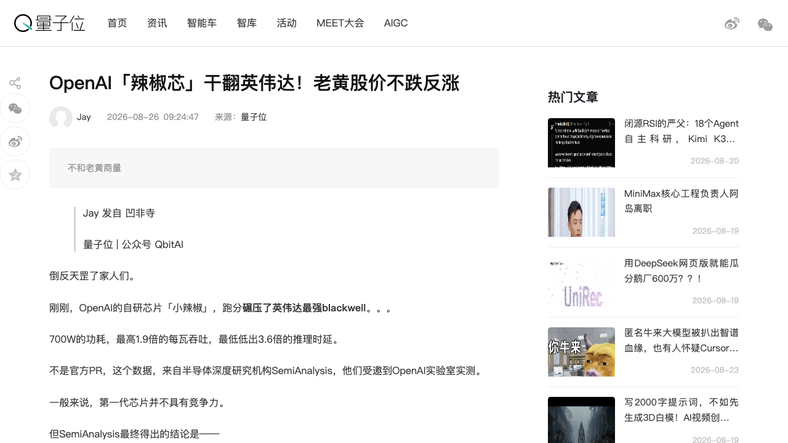
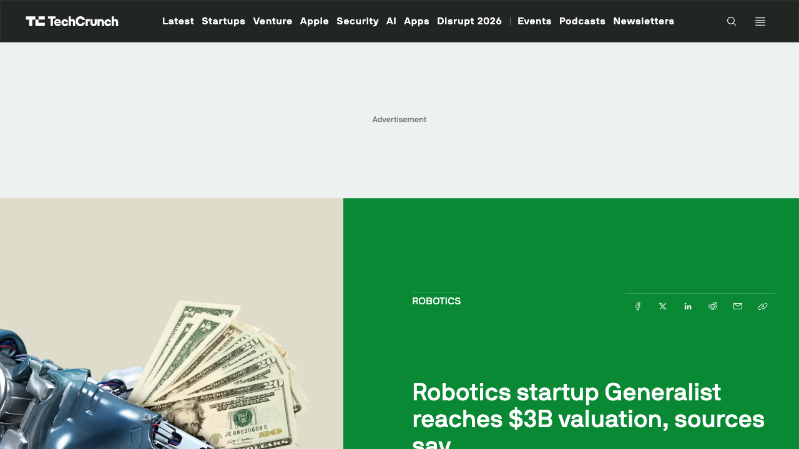
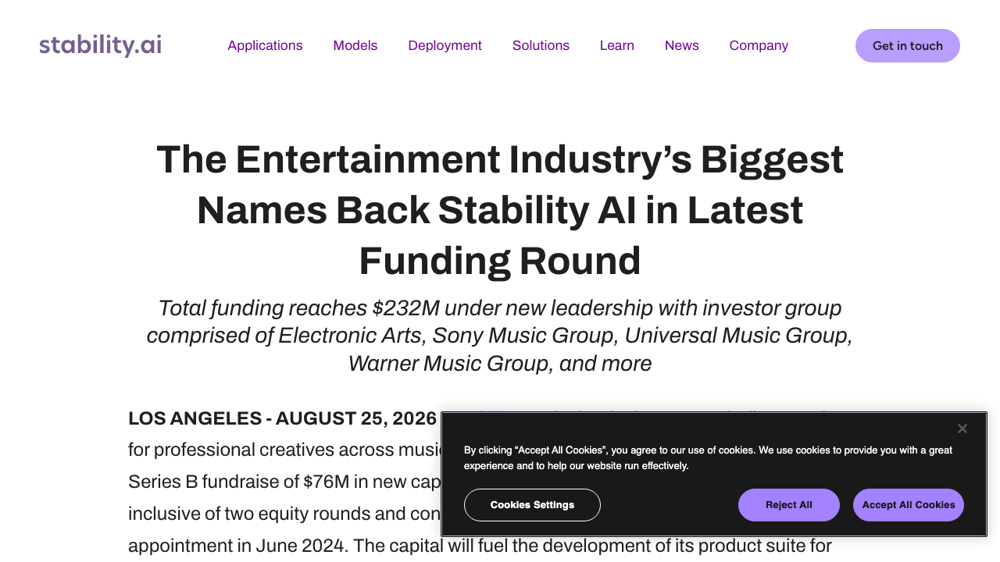
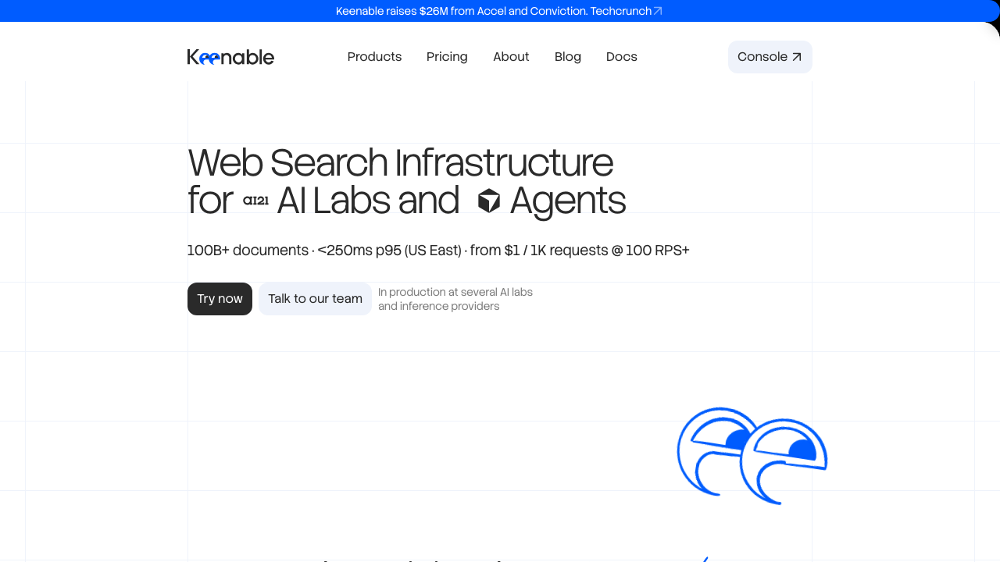
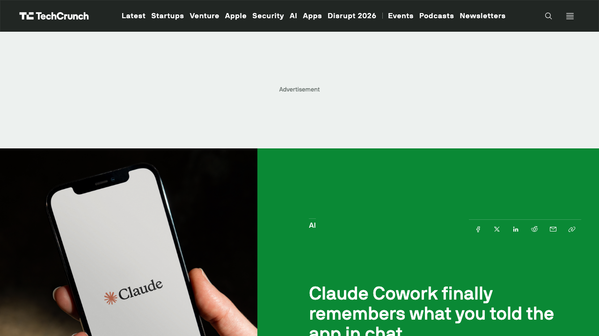

# 0826日报 | AI的「地基与记忆」时刻：OpenAI自研推理芯片Jalapeño「小辣椒」Hot Chips跑分碾压英伟达Blackwell（SemiAnalysis实测每千瓦吞吐1.5-1.9倍、700W对1200-1400W）、机器人大脑公司Generalist估值冲上30亿美元（8VC领投近2亿美元、总轮6亿美元，「机器人的ChatGPT时刻」被资本定价）、Stability AI完成7600万美元B轮环球/索尼/华纳/EA四大内容巨头齐入股（「版权方入股模型厂」、总融资2.32亿美元）、前Yandex搜索掌门创业Keenable为AI Agent重建千亿文档级Web索引（2600万美元种子轮、Accel领投）、Claude Cowork终于「记住」你了（chat与Cowork记忆统一、可读可编辑可删除，「记忆」成为产品主权）

## 今日洞察

今天的五个字：「**AI的『地基与记忆』时刻。**」

**8月25-26日，五件事指向同一条主线：AI竞争进入「重建地基」阶段——巨头不再只在地基上盖楼，而是亲自挖地基；同时把「记忆」这种连续性资产做成产品主权。** 算力地基侧，8月25日Hot Chips大会上，OpenAI首次公布自研推理芯片Jalapeño「小辣椒」的跑分——半导体深度研究机构SemiAnalysis带着自家InferenceX基准套件到OpenAI实验室实测：700W TDP的「小辣椒」每千瓦推理吞吐达到GB200/GB300 NVL72机架系统的1.5-1.9倍、端到端时延低1.7-3.6倍、超低时延场景快2.1-4.1倍，在GPT-OSS 120B、DeepSeek R1 670B、月之暗面Kimi K2.5（1万亿参数）三个开源模型上击败了它能测到的所有英伟达、AMD、谷歌芯片——「模型厂自建芯片」从传闻变成跑分，黄仁勋股价不跌反涨（市场把「OpenAI自研」解读为对英伟达需求的补充而非替代）；检索地基侧，8月25日前Yandex搜索/AI/云业务掌门Andrey Styskin的创业公司Keenable带2600万美元种子轮出隐身（Accel领投、Conviction参投）——为AI Agent重建「千亿文档级」Web索引（100B+文档、<250ms p95、$1/1000次请求），在谷歌/微软纷纷关闭自家搜索API防「自噬」的当口，赌「下一个Google属于Agent」；内容地基侧，Stability AI 8月25日官宣7600万美元B轮（总融资达2.32亿美元）——环球音乐、索尼音乐、华纳音乐、EA四大内容巨头+AMD Ventures、Pacific Alliance Ventures齐入股，加上原有的Coatue/Greycroft/Lightspeed/WPP/Sean Parker/Eric Schmidt/James Cameron阵容——「版权方入股模型厂」第一次成为内容AI的标准融资结构；大脑地基侧，8月25日TechCrunch报道机器人「通用大脑」公司Generalist估值冲上30亿美元（8VC领投约2亿美元B轮扩展、使该轮总额达6亿美元，6月由Radical Ventures领投4亿美元B轮、估值20亿美元）——与Physical Intelligence（约110亿美元）、Skild AI（140亿美元）一起，把「机器人的ChatGPT时刻」押注推向高潮；记忆侧，Anthropic 8月25日宣布把chat与Claude Cowork的记忆系统合并——Claude记住你在聊天里说过的一切，还能让你查看、编辑、删除任何记忆，「记忆」第一次成为用户可以行使主权的产品功能。

**为什么这是创业者的窗口期：①「巨头自建处，即缝隙处」——OpenAI造芯+整租数据中心，留给中立层的窗口还有一年以上。** Jalapeño量产要2027年才爬坡、目前明确「不会弃用英伟达」、训练仍大量用英伟达——这意味着未来12-18个月，推理芯片市场是「英伟达+自研芯片并跑」的过渡期：多模型路由、推理优化工具链、跨芯片调度这类「中立优化层」反而更值钱（呼应0821日报Ramp Router、0825日报Kiro「每token价值」叙事）；**②「版权入股」正在成为内容AI的融资新结构——把最大客户变成股东，把诉讼对手变成利益共同体。** Stability把环球/索尼/华纳/EA变成股东、并刚推出全授权数据训练的Stable Audio 3.0，说明「内容公司不再是模型的被告，而是模型的股东」——做音乐/视频/图像类AI的团队，融资优先级可以重新排序：先把版权方拉进股东名单，再谈产品；**③ 机器人「通用大脑」被资本用真金白银定价——但「大脑派」与「身体派」的分野也在加速。** Generalist（大脑+数据路线，看3-12秒演示即学会任务）对标Physical Intelligence、Skild AI，而中国侧0825日报小鹏走「汽车供应链+量产」的身体派路线——对创业者：机器人软件层（数据引擎、任务编排、垂类基座模型）仍是中国团队能切入的生态位；**④「记忆控制权」从合规条款变成产品竞争力——谁能把记忆交给用户，谁赢。** 就在Instinct（0825日报）因「永久且不可撤销」条款被炮轰的同一天，Anthropic选择把记忆系统合并并开放「读/改/删」——个人Agent的信任设计正在从「能力越大越好」转向「控制权越清晰越好」；**⑤ 搜索的「十蓝链接时代」正在结束——为Agent重建信息地基是新创业窗口。** 谷歌/微软关API、AI爬虫流量占比持续上升，Keenable/Exa/Brave在抢「Agent的地基」——创业者可以做的不是再造一个Google，而是做「面向Agent的检索中间件/垂直索引」。

**三个信号同样关键**：① **OpenAI数据中心负责人Malone离职**（WSJ 8月25日报道、彭博经OpenAI发言人确认）——他2025年3月Stargate项目官宣后不久加入、负责为高速增长的算力需求建数据中心；Stargate开局不顺后OpenAI转向整体租下整座数据中心而非租芯片；离职后无继任者、职责拆分给多位负责人，TheNextWeb统计4月以来已有7位高层离任或换岗——「扩张期的组织阵痛」值得持续跟踪；② **SemiAnalysis的冷静提醒**：拿Blackwell对比「并不算公平」，Jalapeño真正要对标的是同样用HBM4的下一代Vera Rubin；当前每美元产出两者打平，而Rubin成绩用了推测解码（能把每token成本再降3-5倍）、Jalapeño还没做——「跑分领先≠成本领先」，2027年才是真正的胜负手；③ **中国侧同频「开源+共建」的另一条地基路线**：商汤8月25日开源8B图像模型SenseNova U1.5 Lite（复杂排版与精准编辑对标闭源GPT-Image-2），范式8月25日联合优必选、北京人形机器人创新中心、星动纪元等十余家具身巨头发布PhanthyMotus生态共建计划（通用具身Agent底座从「开源」迈入「多方共建」，联合创始人兼首席科学家陈雨强称行业已从「单点技术比拼」进入「系统生态竞争」）——当美国巨头在「自建」，中国厂商在「共建」，两条路线都在改写AI的地基。

---

## 1. [OpenAI自研推理芯片Jalapeño「小辣椒」Hot Chips首秀跑分：SemiAnalysis实测每千瓦推理吞吐达英伟达GB200/GB300 NVL72的1.5-1.9倍、端到端时延低1.7-3.6倍，700W TDP对1200-1400W——「模型厂自建芯片」从传闻变成跑分，AI算力的「英伟达时代」迎来第一个真正的对手](https://techcrunch.com/2026/08/25/openais-jalapeno-chip-is-built-for-fast-inference-at-scale-benchmarks-show/)（行业洞察 / 垂直整合的最深处：OpenAI把「模型-芯片-内存-网络」做成一代代协同的平台——推理成本结构将被重写，中立优化层的窗口期也同步打开）

🔗 链接：[TechCrunch·OpenAI's Jalapeño chip is built for fast inference at scale, benchmarks show](https://techcrunch.com/2026/08/25/openais-jalapeno-chip-is-built-for-fast-inference-at-scale-benchmarks-show/) | [量子位·OpenAI「辣椒芯」干翻英伟达！老黄股价不跌反涨](https://www.qbitai.com/2026/08/479320.html) | [OpenAI官方·Jalapeño first results](https://openai.com/index/jalapeno-first-results) | [SemiAnalysis·OpenAI Jalapeño is better than Nvidia](https://newsletter.semianalysis.com/p/openai-jalapeno-better-than-nvidia)

**动态**：**8月25日（美东8月24日），Hot Chips大会上OpenAI首次公布自研推理芯片Jalapeño「小辣椒」的详细规格与首批跑分——SemiAnalysis受邀带着自家InferenceX基准套件到OpenAI实验室当场实测。** 关键信息：① **跑分结论**：700W TDP的小辣椒，每千瓦推理吞吐达到GB200 NVL72、GB300 NVL72机架系统的1.5-1.9倍；端到端推理时延比英伟达记录的这两款系统最佳成绩低1.7-3.6倍，超低时延场景快2.1-4.1倍；测试模型为三个开源大模型——GPT-OSS 120B、DeepSeek R1 670B、月之暗面Kimi K2.5（1万亿参数）；低并发下GPT-OSS与Kimi K2.5约1400 token/s/用户，DeepSeek R1并发1时超700 token/s/用户；② **前提与保留**：以上成绩基于单token预测（STP）、无推测解码、无prefill/decode分离，而对比的Blackwell成绩开了多token预测（MTP）；SemiAnalysis在实验室现场验证了InferenceX跑分过程，但没跑完整套件、也没测OpenAI更偏好的AgentX（覆盖长上下文多轮对话，更接近真实生产负载）；SemiAnalysis直言「拿Blackwell对比并不算公平，小辣椒真正要对标的是同样用HBM4的下一代Vera Rubin」，目前每美元产出两者打平，Rubin还用了推测解码（每token成本可再降3-5倍）；③ **规格**：B0步进采用台积电N3P工艺的单计算die+N3E工艺I/O chiplet，单die提供13.4 PFLOPS MXFP4算力；内存为六组HBM4、单封装216GB容量、15.4TB/s带宽——是目前已出货或接近出货加速卡里最高的（供应商大概率是三星）；④ **软件栈同样关键**：内核用基于Triton的Gluon语言编写、保留SPMD编程模型但暴露更底层抽象；设计阶段用Codex、GPT-Astra辅助，SIMD单元面积缩减8%、矩阵引擎面积缩减10%；彩蛋：OpenAI用Codex把《毁灭战士》移植到这颗芯片上、能跑36 FPS——「跑在英伟达GPU上的GPT-5.6 Sol，参与了设计这颗威胁CUDA生态护城河的芯片」；⑤ **量产节奏**：2026年底小批量部署、2027年逐步爬坡、大部分产出集中在2027年底，下一阶段目标是100MW规模；承载它的单机架系统叫Vindaloo——128颗小辣椒+ Katsu CPU主机架+Chana交换机架，两机架合计约160kW，最多16个机架、2048颗芯片组成一个scale-up域；OpenAI明确不会弃用英伟达、训练仍大量用英伟达且双方有融资担保合作。

**做什么的**：通俗讲，**这是「OpenAI把算力的命根子从英伟达手里拿回来了一截」——一颗700W、长得像辣椒的自研推理芯片，在SemiAnalysis的实测里用更少的电、更快的速度，把GPT-OSS/DeepSeek R1/Kimi K2.5这些开源模型喂给更多用户；它不是替代英伟达（训练还在用），而是OpenAI在推理这个「最烧钱、最影响毛利」的环节上，开始自己掌控定价权。** 三个战略看点：① **「全栈协同」是真正的门槛**——OpenAI把Jalapeño做成「多代平台」：模型、芯片、内存、网络一起设计，专攻prefill与通信这两个推理瓶颈阶段，「KV cache放本地、按推理阶段动态调配计算/内存/网络」——这不是芯片公司能抄的，是「模型厂造芯片」独有的优势；② **「Codex设计芯片」开启新范式**——AI辅助芯片设计让SIMD面积减8%、矩阵引擎面积减10%，8天内并行规模从TP8扩到整机架TP32——芯片设计本身的「scaling law」正在被AI改写，未来自研芯片的研发周期会被大幅压缩；③ **「跑分领先≠成本领先」的清醒**——SemiAnalysis提醒每美元产出目前与Rubin打平、推测解码还没做，2027年Vera Rubin（同样HBM4）才是真正对决——这场仗的胜负手在2027年底。

**为什么值得关注**：

- **推理成本结构将被重写——「每token成本」的定价权第一次有可能从英伟达手里转移。** 0824日报刚记录英伟达AI服务器涨价15%、「存储定义算力」，0825日报记录英伟达开始「买矿」（投资Perplexity/Poolside），0826就是OpenAI自研芯片跑分——算力垄断者与最大客户之间的博弈进入了「有备胎」阶段。对创业者的启示：① 若Jalapeño如期量产，推理价格曲线会在2027年后被OpenAI自己的成本结构拉低，纯API套壳生意的毛利空间会被两头挤压——现在就按「推理会持续变便宜」设计产品（多做Agent长循环、少做一次性问答）；② 在过渡期（2026年底-2027年底），跨芯片/多模型路由、推理优化工具链、缓存与KV cache管理这类「中立优化层」反而最值钱——巨头自建处，正是中立者的缝隙。

- **「模型厂造芯片」验证了垂直整合的终极形态——AI的价值链权力从「模型层」向「每一层」重新分配。** OpenAI造芯片（+整租数据中心重建Stargate）、Anthropic与谷歌各有TPU/Mythos生态、中国厂商自研昇腾/寒武纪——「算力」不再是外购商品而是战略资产。对创业者的启示：① 不要跟巨头在「全栈」上硬碰，找「巨头之间的断层」：垂直场景的推理优化、小模型蒸馏、边缘部署；② 「AI辅助芯片/硬件设计」本身成为新赛道（Codex设计芯片、Gluon内核语言、AI编译器）——所有做硬件工具的团队都应该把「AI-native设计工具链」写进路线图。

- **「跑分」的解读方式变了——市场开始区分「能力领先」与「成本领先」。** 小辣椒跑分碾压Blackwell但老黄股价不跌反涨，因为市场看懂了两件事：训练需求仍由英伟达垄断、且自研芯片验证了「AI推理需求还在指数增长」。对创业者的启示：① 选模型/选算力时别只看单点跑分，要算「每美元产出」（呼应0823日报GPT-5.6降价、0825日报「每token价值」话术）——推测解码、MTP、prefill/decode分离这些「工程增益」往往比架构跑分更影响你的毛利；② 「跑分由谁测、怎么测」本身就是信息差——SemiAnalysis这种独立实测会成为2026年最稀缺的第三方资产。

- 对创业者的启发：**① 把「推理会持续变便宜」写进产品与定价假设；② 在过渡期抢「中立优化层」生态位（路由/缓存/工具链）；③ 关注「AI辅助芯片设计」新赛道；④ 用「每美元产出」而非单点跑分做选型。** 跟踪三个验证点：Jalapeño 2026年底小批量部署的良率与真实负载表现、2027年与Vera Rubin的正面对决、OpenAI推理API价格是否随自研芯片下调。

**类比参考**：**「算力垄断的『备胎时刻』/ 从『英伟达定价算力』到『OpenAI自己造一颗辣椒』——当700W的Jalapeño在SemiAnalysis实测里用1/2的功耗跑出1.5-1.9倍的推理吞吐，'模型厂造芯片'第一次有了跑分背书——而老黄股价不跌反涨的潜台词是：英伟达的护城河（训练+CUDA生态）依然深，但AI算力的定价权，从今天起多了一个变量」**

---

## 2. [机器人「通用大脑」公司Generalist估值冲上30亿美元：8VC领投约2亿美元B轮扩展（监管文件披露近2亿美元、与6月Radical Ventures领投的4亿美元B轮合计6亿美元），前DeepMind研究员+波士顿动力工程师创立——GEN-1.5模型看3-12秒视频演示即可学会新任务，「机器人的ChatGPT时刻」被资本用真金白银定价](https://techcrunch.com/2026/08/25/robotics-startup-generalist-reaches-3b-valuation-sources-say/)（融资 / 具身智能的「大脑派」融资竞赛开打——Generalist 30亿美元 vs Physical Intelligence 110亿美元 vs Skild AI 140亿美元，机器人软件层的估值锚被重估）

🔗 链接：[TechCrunch·Robotics startup Generalist reaches $3B valuation, sources say](https://techcrunch.com/2026/08/25/robotics-startup-generalist-reaches-3b-valuation-sources-say/) | [量子位·机器人的GPT-3时刻真的来了（GEN-1.5）](https://www.qbitai.com/2026/08/476596.html)

**动态**：**8月25日，据TechCrunch援引两位知情人士，机器人初创公司Generalist估值已达30亿美元——8VC领投的新一轮资本近2亿美元（据监管文件），这是6月由Radical Ventures领投的4亿美元B轮（估值20亿美元）的扩展轮，使该轮融资总额达到6亿美元。** 关键信息：① **创始团队**：2024年由前谷歌DeepMind研究员Pete Florence、Andy Zeng与波士顿动力前工程师Andrew Barry创立，早期投资方包括8VC、Radical Ventures以及英伟达、Union Square Ventures、Bezos Expeditions和AI学者李飞飞；② **低调起家**：此前几乎不公开宣传；③ **产品**：开发可适配多种机器人的AI基础模型，最新发布的GEN-1.5（8月19日发布）号称「物理提示（Physical Prompting）」——机器人看3-12秒的视频演示即可掌握新任务、无需梯度更新与微调，还能把两段不同演示「拼接学习」（模拟器里看一遍、真实世界直接上手），由50万小时级物理数据预训练「悟」出；④ **商业化**：正与少数客户合作、用反馈为特定场景定制模型；⑤ **竞争格局**：Physical Intelligence据报估值约110亿美元、软银系Skild AI约140亿美元、Genesis AI上月洽谈以30亿美元估值融资——「机器人大脑」赛道头部玩家估值集体站上几十亿美元量级；⑥ **争议**：VC们一边押注「机器人的ChatGPT时刻」（机器人无需逐任务训练即可执行通用任务），一边警告——机器人无法像LLM那样用整个互联网数据训练，「真正通用的机器人模型可能还要好几年」。

**做什么的**：通俗讲，**Generalist是「给各种机器人装一个通用大脑」的公司——它不造机器人本体，而是让机器人「看几秒演示就会干活」：人类拍一段3-12秒的视频，GEN-1.5看完就上手，不需要重新训练；8月25日的新闻是，资本市场给这个「大脑」标了个价：30亿美元。** 三个战略看点：① **「物理提示」=机器人版的In-Context Learning**——GPT-3当年靠上下文学习让人「看愣」，GEN-1.5把同样的范式搬进物理世界（演示视频即Prompt、无需梯度更新），这是「物理AI scaling law」叙事最性感的版本；② **「大脑派」与「身体派」的路线分野**——美国玩家（Generalist/Physical Intelligence/Skild）押模型+数据，中国玩家（0825日报小鹏IRON）押供应链+量产，两条路线在2026年同时被资本定价；③ **估值锚的迁移**——从「demo能力」到「数据引擎+模型泛化能力」，机器人软件层的估值正在向LLM公司看齐。

**为什么值得关注**：

- **「机器人的ChatGPT时刻」不再是口号，而是融资叙事——但VC自己也说「可能还要好几年」。** Generalist一年内从低调到30亿美元，加上Physical Intelligence（110亿美元）、Skild（140亿美元），机器人大脑赛道头部玩家的估值总和已超280亿美元。对创业者的启示：① 如果你在做机器人软件层，融资叙事要往「数据引擎+泛化能力」靠（GEN-1.5的50万小时物理数据、「物理提示」范式），而不是「我们做了个会跳舞的demo」；② 但别被头部估值带节奏——通用机器人模型的「ChatGPT时刻」是否真的临近，VC内部都有分歧，二级市场验证要等到「机器人像LLM一样卖token/订阅」的那天；③ 「数据」是这场竞赛的真正瓶颈——谁能以最低成本拿到最多样的物理交互数据（仿真、遥操作、真实产线），谁就掌握机器人大脑的「互联网」。

- **「大脑+数据」路线让纯软件团队有了与整车厂（小鹏）同台竞技的可能——物理AI的「安卓时刻」在数据层率先出现。** 0825日报小鹏用「汽车供应链+量产」给机器人换了估值锚，Generalist则证明「不做本体、只做大脑」同样能到30亿美元。对创业者的启示：① 机器人中间件/数据层（采集网络、仿真-现实迁移工具链、任务编排、垂类基座模型）是中国团队的现实切入点——头部大脑公司只有几家，但「给大脑供数据/供工具」的生意会百花齐放；② 关注「物理提示」范式带来的交互产品机会：未来人类教机器人干活就像给LLM写Prompt，谁把「教机器人」的体验做好，谁就是物理世界的Cursor。

- **融资结构信号：8VC从早期投资人升级为领投方、英伟达在早期名单里——「巨头+顶级VC」集体下注机器人大脑。** 与0825日报小鹏的「IDG领投+腾讯阿里战略支持」结构对照，中美两地的资本都在为具身智能的「确定性」买单。对创业者的启示：① 机器人创业的融资要同时讲「模型能力」与「商业化路径」两个故事（Generalist已开始服务少数客户做场景定制）；② 英伟达既是供应商又是投资人，这类「双重身份资本」正在重塑硬件创业的股权结构——提前设计好与算力巨头的绑定条款。

- 对创业者的启发：**① 机器人软件层叙事押「数据引擎+泛化」而非demo；② 卡位「给机器人大脑供数据/工具」的中间层；③ 把「物理提示」范式产品化（教机器人=写Prompt）；④ 融资结构兼顾「模型能力」与「商业化路径」。** 跟踪三个验证点：Generalist首批付费客户与场景、GEN-1.5的第三方复现结果、「机器人ChatGPT时刻」是否出现跨本体/跨任务的强泛化证据。

**类比参考**：**「机器人大脑的『定价时刻』/ 从『看3秒演示学会干活』到『资本市场给它标价30亿美元』——当Generalist用'物理提示'让机器人像LLM一样'看例子就会'，VC们一边掏钱一边提醒'通用机器人大脑可能还要好几年'——这像极了2020年所有人一边投GPT-3、一边说AGI还远的样子：物理AI的泡沫与信仰，正在同时被定价」**

---

## 3. [Stability AI完成7600万美元B轮融资：环球音乐、索尼音乐、华纳音乐、EA四大内容巨头+AMD Ventures齐入股，总融资达2.32亿美元——「版权方入股模型厂」成为内容AI的标准融资结构，Stable Audio 3.0全授权开源权重音乐模型同步上线](https://techcrunch.com/2026/08/25/stability-ai-maker-of-image-generator-stable-diffusion-raises-76-million-in-fresh-funding/)（融资 / 内容AI的权力结构反转：版权从「诉讼对手」变成「股东」——Stability把最大客户变成利益共同体，音乐/游戏巨头的AI工具链开始「共同开发」而非「购买授权」）

🔗 链接：[Stability AI官方·Latest funding backed by entertainment industry's biggest names](https://stability.ai/news-updates/stability-ai-latest-funding-backed-by-entertainment-industry-biggest-names) | [TechCrunch·Stability AI raises $76M in fresh funding](https://techcrunch.com/2026/08/25/stability-ai-maker-of-image-generator-stable-diffusion-raises-76-million-in-fresh-funding/)

**动态**：**8月25日，Stability AI宣布完成7600万美元B轮融资，公司总融资额达2.32亿美元。** 关键信息：① **投资阵容极不寻常**：新晋投资者包括互动娱乐巨头Electronic Arts（EA）、环球音乐集团、索尼音乐集团、华纳音乐集团，以及AMD Ventures和Pacific Alliance Ventures；Coatue、Greycroft、Kadmos Capital、Sean Parker、Eric Schmidt等在新领导下连续第二轮参投；整体股东名单还有Lightspeed、Mantis Capital、Sound Ventures、WPP与James Cameron、Kevin Mayer、Mark Burnett、Patrick Whitesell等；② **「客户即股东」逻辑**：EA、环球音乐、华纳音乐本就是Stability的战略合作伙伴（去年10月与UMG/EA、11月与华纳签约），此次从「合作伙伴」升级为「股东」——共同开发Stability的AI工具，而不仅是购买输出授权；③ **产品同步**：宣布刚推出Stable Audio 3.0——基于全授权数据训练的开源权重音乐模型家族，艺术家可通过新的DAW插件或StableAudio.com直接使用；④ **治理升级**：Coatue联合创始人Thomas Laffont加入董事会（董事会已有James Cameron、Sean Parker、Greycroft联合创始人Dana Settle、CEO Prem Akkaraju）；⑤ **背景**：CEO Prem Akkaraju（前Weta Digital CEO、2024年上任）称这是「生成式AI赋能每一位制作人、音乐人、故事讲述者」的愿景背书；Stability在英国Getty Images版权诉讼中基本胜诉——「开源模型公司」正在向「创意产业共建公司」转型；资金将用于继续建设「创意生产」产品套件并扩张专业服务业务。

**做什么的**：通俗讲，**这是「版权方集体入股模型厂」——环球、索尼、华纳、EA这些手握版权的巨头，不再只想告Stability侵权，而是直接掏钱当股东，跟它一起开发AI音乐/游戏工具；Stability则拿到了「全授权数据」这张内容AI最稀缺的船票（Stable Audio 3.0用全授权数据训练、开源权重），从「人人喊打的爬虫模型厂」变成「创意产业自己人」。** 三个战略看点：① **版权问题的「股权化解决」**——与其打官司（Getty案虽胜诉但耗时两年），不如让版权方成为利益共同体：版权方分享AI工具的商业回报，模型厂获得合法数据源，这是内容AI最优雅的商业模式解；② **「共同开发」取代「购买授权」**——UMG/EA/Warner不只是买API，而是参与工具形态定义——AI创作工具第一次按「产业工作流」而非「通用生成器」设计；③ **「创意工具」vs「通用AI」的定位分化**——Akkaraju反复强调「Stability是创意人给创意人造工具」、Coatue称「别人在做通用AI，Stability在做创意工具」——内容垂直的模型公司正在与通用模型厂（OpenAI/谷歌）划清边界。

**为什么值得关注**：

- **「把最大客户变成股东」——内容AI融资结构的教科书案例，值得所有垂直AI创业者抄作业。** Stability没有去找纯财务VC（虽然Coatue/Greycroft也在），而是先签合作、再开放股权给合作方。对创业者的启示：① 做内容/垂直行业的AI公司，融资优先级可以重排：先锁定「会真正使用产品的头部客户」，再让他们以股东身份进入——客户股东的定价意愿（战略价值）通常高于财务投资人（回报倍数）；② 「数据合法性」是内容AI最大的护城河——全授权训练的Stable Audio 3.0开源权重，直接戳中Suno/Udio等竞品的版权软肋，合法数据源=可对B端销售=可持续收费；③ 注意「客户股东」的双刃剑：股东化会限制你服务竞品客户（环球是股东，你还能卖给华纳的竞品吗？），签约时要设计好排他条款的边界。

- **版权诉讼的终局不是「打赢」而是「合流」——AI与内容产业从对立走向股权绑定。** Getty案胜诉但Stability选择把对手变成股东，说明「诉讼只能止血、股权才能造血」。对创业者的启示：① 如果你的AI产品依赖特定内容数据，优先设计「分成/共开发」结构，而不是赌诉讼结果；② 「开源权重+授权数据」的组合正在成为内容模型的新标准（Stable Audio 3.0、以及0823日报GLM-5.3「太强不敢开源」的反例都在说明：开不开源、用谁的数据，是2026年模型公司的战略选择题）；③ 音乐/游戏/影视三个垂直的「AI工具链」正在被内容巨头重新定义——做创作者工具的团队，直接去对接唱片公司/游戏工作室的「AI共建计划」可能是最快的通路。

- **AMD Ventures的出现值得注意——芯片厂商开始押注「创意内容」场景的推理需求。** 英伟达押机器人大脑（Generalist早期投资方）、AMD押内容生成（Stability股东）——算力巨头在应用层做「场景卡位」。对创业者的启示：① 芯片厂商的「应用层投资」是判断「哪个场景的推理需求会被补贴」的信号——内容生成（图像/视频/音频）与机器人大脑是当前两大被押注场景；② 做内容生成应用的团队，可以把「AMD/英伟达生态合作」写进融资与供应链叙事。

- 对创业者的启发：**① 垂直AI先签「客户共建」再开放股权；② 「合法数据源」作为第一护城河（全授权训练）；③ 把「共同开发」而非「购买授权」写进合作条款；④ 关注芯片厂商的场景卡位投资。** 跟踪三个验证点：Stable Audio 3.0的开源社区采用率与付费转化、四大内容巨头的AI工具是否真正进入生产流程、Stability专业服务业务（B端定制）的收入占比。

**类比参考**：**「内容AI的『合流时刻』/ 从『版权诉讼被告』到『版权方集体入股』——当环球、索尼、华纳、EA把Stability从被告席拉上股东席，'AI与内容产业'第一次不是谈判桌上的对手，而是同一张股权证书上的利益共同体——版权的终局不是打赢官司，而是把对手变成队友」**

---

## 4. [前Yandex搜索掌门Andrey Styskin创业Keenable出隐身：2600万美元种子轮（Accel领投、Conviction参投），为AI Agent重建「千亿文档级」Web搜索索引（100B+文档、<250ms p95、$1/1000次请求），已有多家AI实验室与推理提供商在生产环境使用——「下一个Google属于Agent」的赌注开打](https://techcrunch.com/2026/08/25/accel-backed-keenable-is-indexing-the-web-for-ai-agents/)（融资 / AI原生搜索基础设施：谷歌/微软关API的「创新者窘境」窗口——搜索从「给人看的十蓝链接」转向「给Agent吃的结构化解」，检索地基的创业窗口开打）

🔗 链接：[TechCrunch·Accel-backed Keenable is indexing the web for AI agents](https://techcrunch.com/2026/08/25/accel-backed-keenable-is-indexing-the-web-for-ai-agents/) | [Keenable官网](https://keenable.ai/)

**动态**：**8月25日，Keenable宣布带2600万美元种子轮出隐身——由Accel领投、Conviction Partners及多位天使参投。** 关键信息：① **创始人**：Andrey Styskin——曾执掌俄罗斯搜索巨头Yandex的搜索/AI/云业务、在Yandex和Amazon拥有20年搜索建设经验（在Amazon曾与联合创始人Matthias Petri一起为Alexa等AI应用建设Web搜索基础设施）；Petri是德国AI科学家；团队约15名工程师、横跨美欧，资金将用于年底前翻倍扩充GTM团队；② **产品**：为AI Lab与Agent提供「独立的Web搜索基础设施」——已建成超1000亿文档（100B+）的Web索引，API在多家AI实验室与推理提供商的训练与推理环节生产环境使用（客户未披露）；性能指标：<250ms p95（美东）、$1/1000次请求（100 RPS+档）；与语音AI公司Gradium合作支持实时信息检索；③ **路线图**：正在构建专有检索能力，即将推出「Web Query Language」——帮助AI系统跨多个网页来源综合回答，即使没有任何单一来源包含完整答案；④ **市场判断**：谷歌与微软正关闭自家搜索API以避免「自噬」（cannibalization）、转向捆绑式供应并精选合作伙伴——AI玩家在「网络级搜索基础设施」上几乎没有独立选项；Styskin看到Cloudflare数据显示AI爬虫占搜索流量份额持续上升，认为「面向AI的搜索基础设施」是确定性机会；⑤ **竞争**：Brave、Exa等已入场，谷歌也在为AI时代重构搜索——但Styskin认为「创新者窘境」使谷歌在Agent式查询上「可被击败」，Keenable的差异化在「针对任务微调索引结构」以控制全网级服务的成本；⑥ **愿景**：做「AI Agent的下一代Google」——「无论给人还是给Agent，十蓝链接的时代正在落幕」。

**做什么的**：通俗讲，**Keenable是「给AI Agent重新铺一条信息高速公路」——人类搜索靠「十蓝链接」，AI Agent需要的是结构化的、机器可读的、能直接喂进上下文的网页数据；Keenable建了一个千亿文档级的索引，按「AI的任务」而非「人类的关键词」优化，让AI Lab和推理商按量付费调用——它的赌注是：当人人都用ChatGPT查资料，谷歌那套「给人看」的搜索地基就不再够用，Agent需要自己的地基。** 三个战略看点：① **「任务化索引」是成本战的胜负手**——全网索引贵得吓人（Styskin：「别问，痛得要命」），只有针对特定任务微调索引结构、快速收窄搜索空间，才能把「扫描全网」的成本降下来——这是与谷歌「关键词索引」完全不同的工程范式；② **「创新者窘境」式窗口**——谷歌/微软关API、选型捆绑，恰恰把「对AI友好的中立搜索商」的需求推给了第三方——巨头「防自噬」的动作正在亲手创造新市场；③ **「检索地基」是Agent经济的基础设施**——Agent要可靠执行任务，必须「grounding」到源文档（Styskin：「这创造了一个与谷歌从人类行为学到的完全不同的飞轮」）——检索质量直接决定Agent的可靠性，这是比「模型能力」更底层的基础设施层。

**为什么值得关注**：

- **「AI原生搜索基础设施」是2026年最清晰的B2B创业窗口之一——巨头亲手关上门，中立商就有生意。** 谷歌/微软关闭搜索API，AI Labs买不到「干净的全网索引」，只能自建（成本极高）或找Keenable/Exa/Brave。对创业者的启示：① 「巨头主动撤退的中间层」是最佳创业生态位——关注谷歌/微软/OpenAI「关了什么API、收紧了什么政策」，那里就是新的B2B机会；② 这类生意的壁垒是「索引规模+任务化优化」的组合——先发者的索引规模会形成数据护城河，新进入者的成本极高；③ 定价模式值得抄：按请求量级定价（$1/1000次）+ SLA级性能承诺（<250ms p95）——「检索即服务」可以直接对标「搜索SaaS」的毛利结构。

- **「给Agent看的互联网」与「给人看的互联网」正在分叉——内容/网页的「机器可读化」是衍生机会。** 当Agent成为流量主力（Cloudflare数据显示AI爬虫占比持续上升），网页的「结构化」本身会变成生意。对创业者的启示：① 做内容/出版/电商的团队，应该把「Agent可检索性」（结构化数据、schema标记、API友好）当作新的SEO——「被Agent选中」将是下一个增长杠杆；② 「检索质量」会成为Agent产品的核心KPI——做Agent的团队要建立自己的「检索-落地」评估体系（呼应0823日报「Agent评测从模型榜转向系统榜」）；③ 「Web Query Language」这类跨源综合检索如果跑通，会动摇「RAG外包给向量库」的现有技术栈——关注检索层的新标准之争。

- **种子轮2600万美元+Accel领投的体量说明「搜索地基」已被一线基金定价——但这也是个「烧钱深渊」赛道。** Styskin自嘲「建索引痛得要命」，全网索引的资本开支极高。对创业者的启示：① 这类基础设施创业的融资节奏要「小步快跑+尽早商业化」（Keenable已有生产环境客户、按量收费），别指望纯烧钱换规模；② 客户结构决定了议价权——同时服务多家AI Lab与推理商（而不是绑定一家）才能保持中立地位；③ 与「垂直索引」（医学/法律/代码）相比，「全网通用索引」赢家通吃属性更强——垂直团队可以学「任务化微调」的思路做垂直索引，避开与Keenable/Exa的正面对抗。

- 对创业者的启发：**① 盯住「巨头关闭的API」找B2B窗口；② 把「Agent可检索性」当新的SEO做；③ 检索层「任务化微调」是成本战的核心方法论；④ 基础设施创业「尽早商业化+保持中立」。** 跟踪三个验证点：Keenable的Web Query Language落地效果、AI Labs对独立检索的付费意愿与留存、谷歌搜索API关闭后「Agent检索」市场的规模增速。

**类比参考**：**「搜索的『换地基时刻』/ 从『给人看的十蓝链接』到『给Agent吃的千亿文档索引』——当谷歌、微软亲手关掉自己的搜索API防'自噬'，前Yandex掌门带着2600万美元种子轮给Agent重建了一条信息高速公路——十蓝链接的时代正在落幕，而新地基的每一铲土，都标着'按量计费'」**

---

## 5. [Anthropic把chat与Claude Cowork的记忆系统合并：Claude终于「记住」你在聊天里说过的事——记忆可读、可编辑、可删除，聊天过程中即写即存，Free/Pro/Max全量默认开启——「一个连续体感的助理」取代「两个产品」，「记忆控制权」成为Agent产品的信任标配](https://techcrunch.com/2026/08/25/claude-cowork-finally-remembers-what-you-told-the-app-in-chat/)（新产品 / Agent记忆的产品化分水岭：从「会话属性」到「可管理的资产」——敏感信息默认不存+显式开关+通知，与Instinct的「永久不可撤销」条款形成镜像对照）

🔗 链接：[TechCrunch·Claude Cowork finally remembers what you told the app in chat](https://techcrunch.com/2026/08/25/claude-cowork-finally-remembers-what-you-told-the-app-in-chat/)

**动态**：**8月25日，Anthropic宣布合并Claude聊天与Claude Cowork（执行Agent）的记忆系统——Claude将始终记得你在一个场景里学到的东西，即使你在另一个场景与它互动。** 关键信息：① **记忆互通**：以前你在chat里聊出的项目细节，到了Cowork执行阶段要全部重新交代；现在chat与Cowork共享同一套记忆——「Claude现在像一个连续体感的助理，而不是同一个屋檐下的两个产品」；官方示例：起草给经理的汇报/会议议程时，Cowork已知道参会人数、城市、演讲者，无需重新输入；② **记忆可视化**：Anthropic同时开放「Claude记住了什么」——用户可查看、编辑、删除任何主题的记忆；③ **记忆机制升级**：从「对话结束时总结」改为「聊天过程中即写即存」——在对话进行中记忆就持续更新并在两个体验间共享；④ **隐私设计**：默认不存储健康数据、种族、族裔、宗教信仰、政治立场、性别认同等敏感信息；用户可开启「在记忆中包含敏感话题」开关，App会在保存敏感话题时通知用户；政府证件号码、社保号、犯罪记录、移民状态等永远不保存（违反可接受使用政策的内容也不保存）；⑤ **上线范围**：Free/Pro/Max计划在Web、桌面、移动端默认开启，iOS/Android需更新App到最新版本。

**做什么的**：通俗讲，**这是「Claude终于长了长期记忆，而且把记忆的钥匙交给了你」——以前你跟Claude聊天攒下的上下文，换个场景（Cowork干活）就全忘了、要重新交代；现在chat和Cowork共用一本「笔记本」，Claude边聊边记，你随时可以翻开看、改、删——它记住了什么，你说了算。** 三个战略看点：① **「连续性」是Agent体验的最大痛点**——用户对Agent最大的挫败感就是「每次都要重新解释一遍背景」，记忆统一把「两个产品」变成「一个助理」，这是从「工具」到「助理」的体验跃迁；② **「记忆可见性」成为信任设计的分水岭**——就在Instinct（0825日报）因「永久且不可撤销」条款被隐私炮轰的同一天，Anthropic把记忆系统做成「默认不存敏感信息+显式开关+操作通知+随时可删」——「你能看到它记住了什么」本身就是最大的信任开关；③ **记忆的「即写即存」改变Agent架构**——从「会话级上下文」到「跨会话持续记忆」，意味着Agent的记忆层从「临时缓存」变成「核心产品资产」——记忆的质量、结构、可管理性将成为Agent产品的核心竞争维度。

**为什么值得关注**：

- **「记忆控制权」正在成为个人Agent的信任标配——能力越大，记忆越要透明。** 0825日报Instinct因「永久不可撤销」条款被反噬，0826日报Anthropic用「可读可改可删+敏感信息开关」正面作答——个人Agent的信任设计从「能力最强」转向「控制权最清晰」。对创业者的启示：① 做Agent/助理类产品，「记忆管理页」（用户能看到、编辑、删除AI记住了什么）应该与核心功能同一天上线，而不是事后补合规；② 「敏感信息默认不存+显式开关+保存时通知」这套设计可以直接抄作业——它是「能力」与「尊重」之间的产品平衡点；③ 记忆的「可解释性」会变成差异化卖点：告诉用户「AI记住了什么、为什么记住」，比任何隐私政策都更有说服力。

- **「跨会话记忆」把Agent产品从「对话工具」推向「连续性资产」——数据迁移成本开始形成。** 当Claude记住你的项目、偏好、上下文，你换一个Agent的成本就变高了——记忆即护城河。对创业者的启示：① 把「记忆深度」（跨多少场景、多准地记住用户上下文）当作产品核心指标；② 「记忆的可携带性」会成为监管与用户的共同诉求（用户有权导出/删除自己的记忆）——提前设计「记忆导出/迁移」功能，既是合规也是兼容性卖点；③ 与Twin1「数字分身」（0824日报）的逻辑呼应：无论是「分身」还是「记忆」，AI都在积累「用户专属的连续性资产」——谁能积累并让用户信任地托付，谁就拥有下一轮数据护城河。

- **「边聊边记」vs「结束时总结」——记忆机制的工程细节决定体验上限。** Anthropic把记忆写入时机从「会话结束」改为「会话进行中」，让chat与Cowork之间的上下文同步从「分钟级」变成「实时级」。对创业者的启示：① 记忆的「写入时机」「更新粒度」「跨产品共享」是产品决策而非纯工程决策——实时写入让「研究→执行」无缝衔接，这是Agent工作流体验的关键；② 记忆的「主题化组织」（Claude按主题归类记忆）比「流水账式记录」更可管理——做记忆类产品，先想清楚「记忆的结构化」；③ 「记忆+上下文工程」会催生新的中间件机会：跨应用、跨Agent的「记忆层」标准（谁拥有用户的长期记忆，谁就有分发权）。

- 对创业者的启发：**① 记忆管理页与核心功能同日上线；② 抄「敏感信息默认不存+显式开关+通知」信任设计；③ 把「记忆深度」当产品指标、做记忆导出/迁移；④ 记忆「即写即存+主题化」作为体验优化方向。** 跟踪三个验证点：记忆合并后Claude的留存与使用时长变化、用户对「可读可编辑可删除」的接受度、竞品（OpenAI/谷歌）是否跟进「记忆可见性」设计。

**类比参考**：**「Agent记忆的『主权时刻』/ 从『每次重新交代一遍』到『一本随时可翻开、可修改的笔记本』——当Anthropic把chat与Cowork的记忆合并、并把'记住什么'的钥匙交到用户手里，'连续性'第一次成为Agent的产品主权——而就在同一天，Instinct的'永久不可撤销'条款被全网炮轰：AI记住了什么、谁说了算，正在成为2026年个人Agent的生死线」**

---

*本日报由422产品实验室AI产品分析师出品，聚焦AI创业者的融资情报、创新产品与商业模式信号。*
