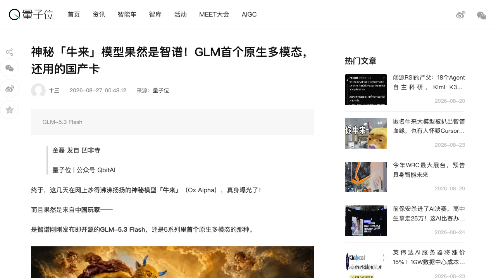
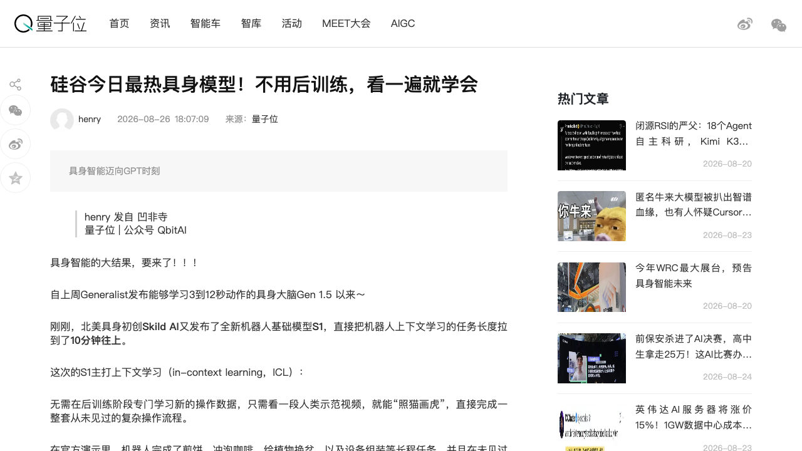
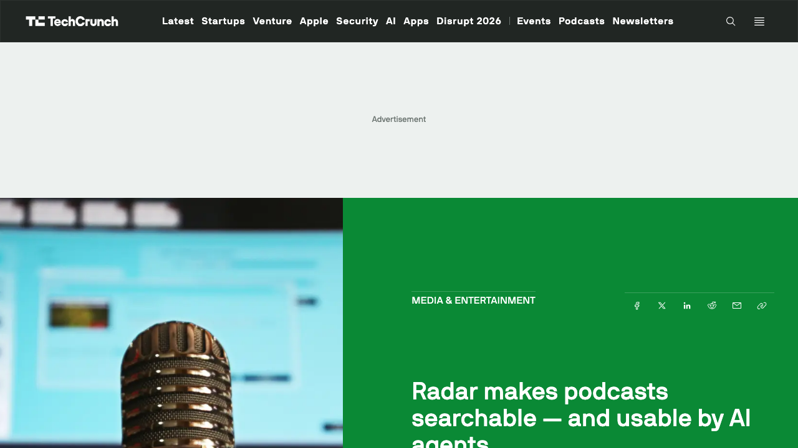
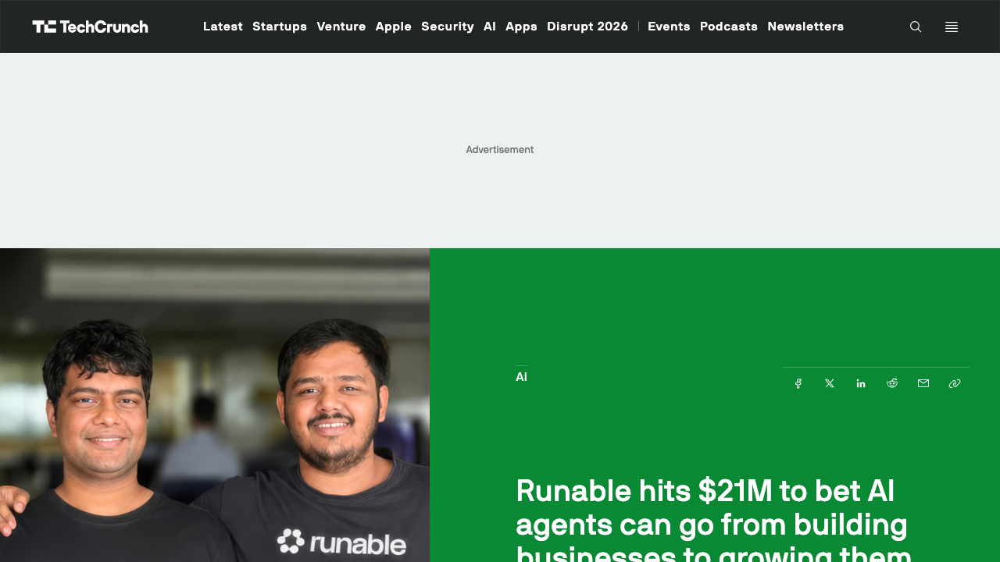
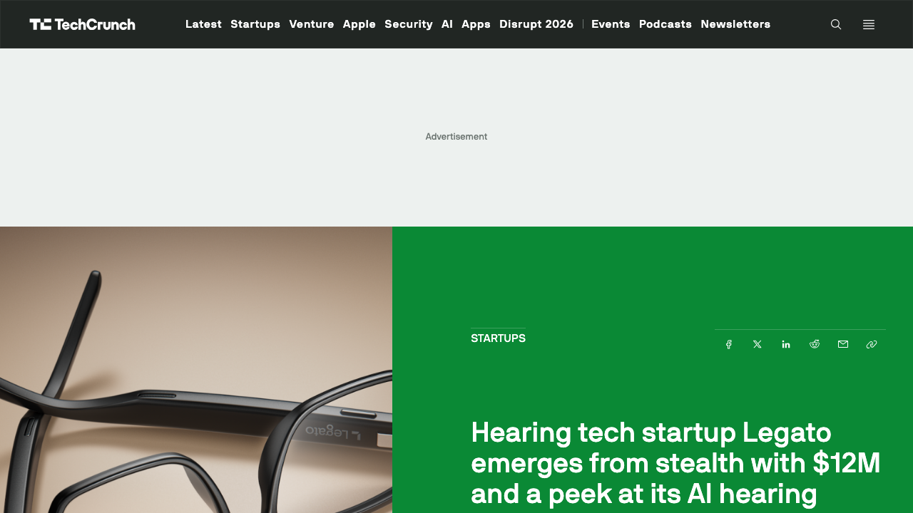

# 0827日报 | AI的「真相与感官」时刻：智谱认领「牛来」真身GLM-5.3 Flash（320B原生多模态、AA 57分追平Claude Opus 4.8、定价仅其1/40、62T tokens跑在国产卡上、终结DeepSeek在OpenCode的56天霸榜）、Skild AI发布机器人基础模型S1「看一遍就学会」（10分钟长程任务、未见任务成功率66% vs 语言VLA 9%）、Particle转型Radar把13万播客变成AI Agent可检索的音频数据层（Exa合作、对冲基金是最大API客户）、印度Runable完成2100万美元A轮押注Agent从「造生意」到「做增长」（Susquehanna+Nexus联合领投、投后估值6500万美元、90天消耗1万亿tokens）、Legato带1200万美元出隐身推AI助听眼镜（Bose与Meta Ray-Bans班底、秋季发售、价格仅为传统助听器零头）

## 今日洞察

今天的五个字：「**AI的『真相与感官』时刻。**」

**8月26-27日，五件事指向同一条主线：AI竞争从「生成内容」进入「感知世界、亲自下场」阶段——神秘模型的真身被认领，模型开始看、开始听、开始替人做生意。** 真相侧，8月26日彭博率先揭晓答案、智谱随后认领：让全球开发者围观了近一周的匿名神秘模型「牛来」（Ox Alpha，0824日报曾记录其免费屠榜）就是智谱「发布即开源」的GLM-5.3 Flash——GLM 5系列首个原生多模态模型，仅320B参数全面超越753B的GLM-5.2，Artificial Analysis榜单57分与Claude Opus 4.8持平，定价为GLM-5.3的1/10（限时1/20）、仅为Opus 4.8的1/40、还低于DeepSeek V4 Flash；量子位强调：这场全球围观背后约62T tokens的用量全部跑在国产卡上——「老外追了一个月的神秘模型，是头纯血国产牛」；OpenRouter首日冲上榜首并刷新单日tokens纪录、OpenCode上终结了DeepSeek连续56天的霸榜；视觉侧，8月26日北美具身初创Skild AI发布机器人基础模型S1——看一段人类示范视频就能「照猫画虎」完成整套未见过的复杂操作流程（煎饼、冲咖啡、给植物换盆、设备组装），任务长度拉到10分钟以上，未见任务成功率66%（基于语言提示的VLA只有9%），想用传统后训练微调追平它看一次的效果需要约380次任务演示——「机器人还在BERT时代」的范式转换宣言；听觉侧，8月26日前Twitter工程师创办的AI新闻阅读器Particle宣布转型推Radar——把13万+播客转写索引成AI Agent可检索的音频数据层（每天新增2万集、覆盖Apple Top 200播客的135个垂直领域），通过API+MCP卖给对冲基金、AI搜索平台与数据转售商（Exa已是合作伙伴），CEO直言「Agent对音频是盲的」；生意侧，8月26日印度班加罗尔初创Runable完成2100万美元A轮（Susquehanna Venture Capital与Nexus Venture Partners联合领投、投后估值6500万美元）——通用Agent从「帮人造网站/应用」延伸到「帮人找客户、投广告、管社媒、做SEO」，3月开放付费三周内从零做到200万美元年化收入、90天消耗超1万亿tokens；健康侧，8月26日Legato带1200万美元出隐身（Neotribe Ventures、Listen、Village Global）——由Bose Frames创造者与Meta Ray-Bans参与者创办的AI助听眼镜Legato Frames秋季发售，AI实时分离背景噪音与人声、只放大语音，开放耳设计+双扬声器把漏音降低99%，价格「仅为传统助听器零头」——「让听力像视力一样普及」。

**为什么这是创业者的窗口期：①「开源+低价+国产算力」正在成为中国模型的『身份自信』——神秘感本身就是最好的营销，但接住流量要靠真本事。** 智谱用一场「匿名发布→全球围观→身份揭晓」的连续剧，把GLM-5.3 Flash做成了教科书级发布：320B对753B的「以小博大」、57分平Opus 4.8、1/40价格、62T tokens跑国产卡——「能力对标前沿、价格打一折、算力不依赖英伟达」三件套，值得所有中国模型公司抄作业：匿名灰度测试+社区共建（OpenRouter/OpenCode）+揭晓时点选择，比发布会PPT有效得多；**② 机器人的『GPT时刻』竞赛进入白热化——上周Generalist看3-12秒，今天Skild看10分钟，『上下文学习』取代『后训练』成为具身智能的新军备。** 核心变量是「后训练数据成本」：机器人每学一个新任务都要几十上百小时真机数据，S1赌的是「从上下文直接学习」让技能开发变成「像给ChatGPT写Prompt一样」——做机器人软件层（数据引擎、任务编排、垂类基座模型）的团队，可以把「上下文学习」作为产品叙事的锚点；**③ 『Agent对音频是盲的』——音频/视频等非文本数据层是新边疆，检索生意从文字卷向多模态。** 0826日报的Keenable在为Agent重建文字索引，Radar则补上了「声音」这块拼图：对冲基金愿意为「Agent看不见的数据」付费、Exa这样的检索厂商主动合作——做「Agent的数据地基」的团队，别只盯着网页文字，播客、会议录音、视频、工控数据都是未被开采的语料；**④ Agent的商业模式从『造东西』切换到『做增长』——帮小生意找客户，比帮程序员写代码更有付费意愿。** Runable的「负毛利+赌推理成本10倍下降」说明：通用Agent的竞争已经从模型能力卷到「结果交付」，谁能把「从建站到获客」的完整闭环打包给小商家，谁就拿到增长层定价权（呼应0821日报Ramp Router、0825日报Kiro的「每token价值」叙事）；**⑤ AI硬件的下一站是『健康+眼镜』——助听器被AI重做一遍，可穿戴AI从「拍照翻译」走向「感官增强」。** Legato把Bose/Meta Ray-Bans的眼镜工程能力用在听力上、用AI语音分离解决「噪音环境听不清」的传统痛点、价格打到助听器零头还蹭视力保险——「AI眼镜」的叙事从AR显示转向「隐形感官义体」，医疗级AI硬件的消费化窗口打开。

**六个信号同样关键**：① **争议中的Instinct拿下2.5亿美元估值**（8/26 WSJ：2500万美元B轮、Index Ventures与Benchmark联合领投、总融资3.5亿美元、估值25亿美元——0825日报记录其「永久不可撤销」条款隐私争议，23岁创始人Noah Shinn的Reflexion作者背景加持）——「争议越大、估值越高」的个人助理赛道，资本热度与信任风险正在赛跑；② **算力军备「既要自研、又要加单」**：8/26英伟达财报电话会上宣布亚马逊把GPU订单提高3倍（Blackwell Ultra/Rubin/Rubin Ultra、2027-28年部署AWS、价值数百亿美元，距上次百万卡订单仅5个月），同日彭博报道Anthropic与Nscale签45亿美元六年算力协议（西弗吉尼亚旗舰数据中心、Vera Rubin、2027年底上线）——Anthropic八个月来已累计签下Volta 100亿、AMD 50亿、SpaceX每月12.5亿、亚马逊+5GW等一长串算力单，而亚马逊一边加单英伟达一边自研Trainium（自研芯片业务年化收入已破250亿美元、获Anthropic/OpenAI共2250亿美元承诺）——「有备胎的军备竞赛」成为巨头标配；③ **OpenAI高管离职潮持续**（8/26 TC：年初以来12+位高管离任——COO、CRO、CMO、Altman副手、多个团队负责人，数据中心负责人Malone上周离职后无继任者，Brockman重掌基础设施与产品团队）——IPO临门（6月已秘密递交）之际「砍边角、聚焦赚钱」的组织重塑，与Anthropic同期冲击IPO形成对照；④ **中国视频AI应用层「井喷」**（量子位8/26：明星AI实验室Agnes发布Agnes Video 2.5上线Pavo创作平台——Flash档免费、约0.15元/秒、无限画布+3D导演台；美图等视频应用被重估，Higgsfield/Flova/LibTV/Firefly/开拍/MVLAND集体爆发）——「模型吞噬应用」没有发生，应用层靠工作流/Agent/无限画布赚「效果的钱」，模型公司赚「算力的钱」；⑤ **中国具身「双响炮」**：成立约一年的超维动力凭WRC乒乓球对局出圈、亮出KAI全栈（KAI Bot/Hand/Halo数采头环/World Model/Embodied AI Infra，直接对标Figure的「本体+模型+场景」闭环）；未来不远机器人半年三轮融资超10亿元、字节跳动入股、家用机器人已卖进500个家庭（8/25量子位）——「全栈派」与「家用派」两条路线都在被资本定价；⑥ **开源工业视觉模型登场**（8/26 TC：两位前Meta FAIR科学家创办的Perceptron发布开源权重模型Isaac 0.5——100万小时通用视频+ego视频训练，主打「通用」而非「窄模型」，帮机器人看懂仓库与工厂）——「物理AI的假二选一」（通用模型太贵/窄模型太笨）正在被开源拆解。

---

## 1. [智谱认领「牛来」真身：神秘模型Ox Alpha=GLM-5.3 Flash，320B参数全面超越753B的GLM-5.2、AA榜单57分追平Claude Opus 4.8、定价仅其1/40、约62T tokens用量跑在国产卡上，OpenRouter首日登顶+OpenCode终结DeepSeek 56天霸榜——「匿名发布→全球围观→身份揭晓」的中国模型超级发布范式](https://techcrunch.com/2026/08/26/surprise-z-ai-is-the-ai-lab-behind-the-mysterious-ox-alpha-model/)（行业洞察 / 神秘模型的「身份揭晓」背后是「开源+低价+国产算力」三件套——智谱用一场全球围观完成GLM-5.3 Flash的发布，中国模型的竞争叙事从「追赶」变成「定义」）

🔗 链接：[量子位·神秘「牛来」模型果然是智谱！GLM首个原生多模态，还用的国产卡](https://www.qbitai.com/2026/08/479919.html) | [TechCrunch·Surprise: Z.ai is the AI lab behind the mysterious Ox Alpha model](https://techcrunch.com/2026/08/26/surprise-z-ai-is-the-ai-lab-behind-the-mysterious-ox-alpha-model/) | [Z.ai官网](https://z.ai/)

**动态**：**8月26日彭博报道、智谱确认：让全球开发者围观了近一周的匿名神秘模型Ox Alpha「牛来」，就是GLM系列最新迭代——8月27日量子位进一步揭晓，其真身为智谱「发布即开源」的GLM-5.3 Flash，也是GLM 5系列首个原生多模态模型。** 关键信息：① **身份揭晓**：0824日报记录的「牛来」（8/20匿名上线OpenRouter、104.86万token上下文、免费、3天250B tokens用量、8500开发者、Patrick Collison盛赞「very impressive」）由彭博证实出自GLM厂商Z.ai，智谱官方确认Ox Alpha是GLM系列最新迭代，描述为「为编码、持续Agent工作与生产负载设计的推理模型，适合长周期软件工程、复杂推理与文本+视觉混合工作流」，权重已于周三（8/26）开放下载；② **规格与能力**：仅320B参数、全面超越753B的GLM-5.2；最新AA榜单57分、与Claude Opus 4.8持平，进入全球前沿行列；作为5系列首个原生多模态模型，量子位实测其能对多人说话的视频做说话人识别+精准字幕——「GLM终于长眼睛了」；③ **价格屠刀**：GLM-5.3 Flash定价为GLM-5.3的1/10（限时折扣1/20）、Opus 4.8的1/40，且低于DeepSeek V4 Flash；④ **战绩**：OpenRouter首日冲上榜首并刷新单日tokens用量历史纪录；OpenCode称Ox Alpha一出世即终结了DeepSeek连续56天的霸榜；⑤ **国产算力**：量子位强调这场热潮背后约62T tokens的用量全部跑在国产卡上——「老外追了一个月的神秘模型，是头纯血国产牛」；⑥ **背景**：Hugging Face最近曾用该模型防御OpenAI Agent的攻击（TC），本月初Z.ai发布的GLM-5.3已在部分基准上对标Anthropic旗舰。TC评价：Ox Alpha的发布加剧了「廉价而强大的中国模型」对OpenAI/Anthropic等昂贵前沿模型厂商的市场威胁。

**做什么的**：通俗讲，**这是「一个匿名模型在海外刷屏一周后，智谱站出来说：是我家的GLM-5.3 Flash——320B的小模型干翻了自家753B的大模型，能力追平Claude Opus 4.8，价格只要它的1/40，而且全部跑在国产卡上」。** 三个战略看点：① **「匿名发布→社区共建→身份揭晓」成为教科书级发布范式**——先以「stealth model」身份上线OpenRouter让开发者免费实测、用真实用量制造悬念与口碑（Patrick Collison、开发者社区自发传播），再在流量峰值揭晓身份、顺势开源权重——比任何发布会都有传播力，且规避了「中国模型」标签在海外的先入为主；② **「320B打赢753B」的小模型路线**——不堆参数、用架构与数据效率换成本，AA 57分追平Opus 4.8意味着「前沿能力」与「平民价格」第一次可以同时成立，直接把价格战打到前沿模型的心脏地带；③ **「国产卡」从口号变成卖点**——62T tokens跑在国产算力上，既是技术自信（训练与推理栈已不依赖英伟达），也是地缘叙事（纯血国产），「自主可控」第一次成为模型的产品竞争力而非合规负担。

**为什么值得关注**：

- **「开源+低价+国产算力」三件套正在重构全球模型市场的竞争格局——这不是一次发布，而是一种范式。** 从DeepSeek到GLM-5.3 Flash，中国模型反复验证：用前沿能力当锚、用1/10-1/40价格当刀、用开源权重当钩子。对创业者的启示：① 做应用/Agent的团队，推理成本曲线会继续陡降——「按OpenAI定价设计商业模式」的团队要重新算账，GLM-5.3 Flash这类低价模型让「Agent毛利为正」提前到来；② 「匿名灰度+社区共建」的发布方式成本极低、传播极强，值得所有模型团队复用：先在OpenRouter/OpenCode这类开发者社区匿名跑真实负载，让社区帮你完成「产品验证+口碑蓄水」，再择机揭晓；③ 「以小博大」（320B vs 753B）说明参数军备不是唯一路径——架构效率、数据质量、多模态原生设计，是小团队可以押注的差异化维度。

- **「原生多模态」正在成为模型的分水岭——会看视频、会听声音的模型，才配做Agent。** GLM-5.3 Flash是5系列首个原生多模态，能对视频做说话人识别与字幕生成；这与0826日报Keenable「为Agent重建索引」、今天Radar「让Agent听懂播客」是同一条暗线的不同截面：Agent的输入模态正在从「纯文本」走向「文本+视觉+音频」。对创业者的启示：① 选模型时「原生多模态」应作为硬指标——用「拼接式多模态」做Agent会在长上下文、跨模态推理上吃亏；② 「视频理解+音频理解」类应用（会议纪要、播客索引、视频字幕、内容审核）会吃到多模态模型的免费红利，现在入场正当时。

- **「国产卡」叙事的商业价值被重估——算力自主从成本项变成品牌项。** 62T tokens跑国产卡，对国内客户是「合规+稳定」的定心丸，对海外客户是「低成本+不受制裁影响」的卖点。对创业者的启示：① 使用国产算力训练/推理的模型公司，可以把「国产卡」写进品牌与融资叙事（与0824日报阿里配售「全栈AI」、0826日报Jalapeño「自研芯片」形成呼应：算力主权是中美两边的共同主题）；② 但别只讲情怀——智谱的底气是「能力追平+价格1/40」在先，「国产卡」只是加分项，顺序不能反。

- 对创业者的启发：**① 复用「匿名灰度+社区共建+身份揭晓」发布范式；② 按「推理持续变便宜」重算商业模式；③ 把「原生多模态」作为选型与招聘的硬标准；④ 关注GLM-5.3 Flash开源后的生态采用率。** 跟踪三个验证点：权重发布后OpenRouter/OpenCode的留存与付费转化、GLM-5.3 Flash在真实Agent工作负载上的长程表现、国内模型厂是否跟进「国产卡」叙事。

**类比参考**：**「中国模型的『身份自信』时刻/ 从『匿名屠榜的神秘牛』到『智谱家的GLM-5.3 Flash』——当320B的小模型追平Opus 4.8、价格砍到1/40、62T tokens全部跑在国产卡上，'中国开源模型'第一次不是靠神秘感而是靠真实力被全球开发者认领——匿名是流量，真身才是底气」**

---

## 2. [Skild AI发布机器人基础模型S1：看一段人类示范视频就学会10分钟以上长程任务、无需后训练，未见任务成功率66%（语言提示VLA仅9%），追平它的一次学习需约380次传统演示——「机器人还在BERT时代」的范式转换宣言，具身智能的GPT时刻竞赛从Generalist的3-12秒拉到Skild的10分钟](https://www.qbitai.com/2026/08/479834.html)（新产品 / 机器人的「上下文学习」取代「后训练微调」——技能开发将像给ChatGPT写Prompt一样简单，后训练数据成本成为具身智能的生死线）

🔗 链接：[量子位·硅谷今日最热具身模型！不用后训练，看一遍就学会](https://www.qbitai.com/2026/08/479834.html) | [Skild AI官网](https://www.skild.ai/)

**动态**：**8月26日，北美具身智能初创Skild AI发布全新机器人基础模型S1——把机器人「上下文学习」（in-context learning）的任务长度拉到10分钟以上：无需在后训练阶段学习新的操作数据，只看一段人类示范视频就能「照猫画虎」，完成一整套从未见过的复杂操作流程。** 关键信息：① **能力演示**：官方演示中机器人完成了煎饼、冲泡咖啡、给植物换盆、设备组装等长程任务；在从未见过的任务上成功率做到66%，远超基于语言提示的VLA（仅9%）；② **数据效率碾压**：想用传统「后训练微调」路线追平S1「只看一次演示」的效果，大约需要喂进去380次任务演示——「上下文学习」把新技能的数据成本压掉了两个数量级；③ **范式论点**：Skild认为机器人行业还困在「BERT时代」——早期BERT每碰到新任务都要重新准备数据、微调一遍，直到「上下文学习」出现才完成范式转换；机器人现在每学一个新技能仍然要几十上百小时真机数据+重新后训练，预训练的真正价值应该是让机器人获得「从上下文里直接学习」的能力（学会没见过的新技能、把已有技能重组完成超长任务）；④ **背景**：Skild AI是北美头部具身初创（0826日报作为Generalist竞对出现、估值约140亿美元），一周前Generalist刚发布GEN-1.5（看3-12秒演示即学会任务）；社区评价：「从Rhoda、到上周Generalist、再到现在Skild S1的10分钟任务——机器人的GPT时刻似乎正在出现」。

**做什么的**：通俗讲，**这是「机器人版ChatGPT时刻的加速器」——以前教机器人一个新技能，要真人示范几百次、再花几周微调模型；S1让机器人看一遍视频就会，就像大模型看几个例子就能in-context学会新任务一样。** 三个战略看点：① **「后训练数据成本」是具身智能的生死线**——大模型的后训练数据可以来自互联网甚至自动生成，机器人的数据必须在现实世界采集（几十上百小时真机数据/新任务），S1赌的是「上下文学习」能把这个成本结构彻底改写；② **「看一遍就会」正在成为机器人基础模型的军备竞赛指标**——上周Generalist看3-12秒、今天Skild看10分钟长程，衡量「机器人智能」的标准从「单任务成功率」升级为「新任务的数据效率」——谁能让机器人学得越快、越省数据，谁就定义下一代机器人基础模型；③ **「技能开发=写Prompt」的终局想象**——如果上下文学习真的泛化，机器人技能开发会从「机器人工程师+数据采集团队」变成「任何用户用自然语言+示范视频定义任务」——这会重写机器人软件栈的生态位（技能市场、任务编排、数据飞轮都是新机会）。

**为什么值得关注**：

- **「上下文学习」是机器人基础模型的下一个主战场——数据效率决定谁能规模化。** 传统路线（预训练+每任务后训练）每扩展一个新技能就要采集新数据，成本线性增长；S1的「看一遍就学会」一旦被验证可泛化，机器人技能的边际成本趋近于零。对创业者的启示：① 具身智能创业的评估标准要加一条「新任务数据效率」——演示一次能学会 vs 需要380次演示，是数量级的估值差；② 机器人数据采集（遥操作、数采头环、合成数据）仍然有价值，但方向从「喂给后训练」转向「喂给上下文学习」——数据的质量（长程、多本体、跨场景）比数量更重要；③ 「技能市场/技能商店」这类把「机器人技能」当商品交易的生意，会因上下文学习而提前到来。

- **「看一遍就学会」正在成为中美具身智能的共同叙事——但路线分野也在加速。** 美国侧：Generalist（3-12秒演示）、Skild S1（10分钟长程）押注「大脑+数据」；中国侧：0825日报小鹏走「汽车供应链+量产」身体派、今天超维动力亮出KAI全栈（本体+模型+场景闭环）、未来不远做「家用落地」——「大脑派」与「身体派」都在被资本定价。对创业者的启示：① 机器人软件层（基座模型、任务编排、数据引擎）仍是中美团队都能切入的生态位，但「数据效率」会成为新的护城河指标；② 「人形」不是必要条件——S1的上下文学习能力如果跨本体泛化（不同硬件共用大脑），「通用大脑+任意本体」的生意模式会挤压「本体派」的估值逻辑（呼应0826日报Generalist的「跨本体」叙事）。

- **机器人的「GPT时刻」叙事正在被资本市场加速定价——但离「真GPT时刻」还有距离。** 从Rhoda到Generalist到Skild S1，社区情绪高涨，但S1的66%成功率仍局限于演示场景、泛化边界未验证。对创业者的启示：① 融资叙事可以借用「机器人GPT时刻」，但产品 roadmap 要诚实——「看一遍就会」的demo距离「工厂里稳定干活」还有工程化鸿沟；② 真正的机会在「把上下文学习能力产品化」的中间层：评估基准（怎么衡量「学得快」）、数据管道（示范视频怎么采、怎么标）、技能市场（学到的技能怎么交易）。

- 对创业者的启发：**① 把「新任务数据效率」写进具身智能的产品指标与融资材料；② 关注「上下文学习」对机器人数据行业的方向性影响；③ 「技能开发=写Prompt」的终局想象提前布局技能市场/任务编排。** 跟踪三个验证点：S1上下文学习在未见环境（非演示场景）的泛化率、Generalist与Skild的「数据效率」军备竞赛走向、中国具身团队是否跟进「上下文学习」路线。

**类比参考**：**「机器人的『GPT时刻』竞赛/ 从『教机器人像训狗一样重复几百次』到『看一遍视频就会』——当Skild S1把上下文学习拉到10分钟长程任务，机器人行业第一次看到了'技能开发像写Prompt一样简单'的终局——而这场竞赛的起跑枪，上周刚由Generalist打响」**

---

## 3. [Particle转型Radar：把13万+播客转写索引成AI Agent可检索的音频数据层——每天新增2万集、覆盖Apple Top 200播客135个垂直领域，说话人标签+实体追踪+提及提醒+广告投放监测，核心产品是API与MCP，Exa已是合作伙伴、对冲基金是最大API客户——「Agent对音频是盲的」，播客成为AI检索的下一个处女地](https://techcrunch.com/2026/08/26/radar-makes-podcasts-searchable-and-usable-by-ai-agents/)（新产品 / 延续0826日报Keenable的「为Agent重建信息地基」主线：文字网页被爬完、谷歌微软关API之后，音频数据层成为检索新边疆——数据生意从「文本」卷向「多模态」）

🔗 链接：[TechCrunch·Radar makes podcasts searchable — and usable by AI agents](https://techcrunch.com/2026/08/26/radar-makes-podcasts-searchable-and-usable-by-ai-agents/) | [Particle官网](https://particle.xyz/)

**动态**：**8月26日，由前Twitter工程师创办的AI新闻阅读器Particle宣布转型推出Radar——把播客里的口语内容转写、索引成AI Agent可以检索和使用的数据层。** 关键信息：① **规模**：Radar已转写13万+播客，自称全球最大的转写播客服务，覆盖Apple Top 200播客的全部135个垂直领域，每天新增约2万集进入索引；② **能力**：转写包含说话人标签与丰富元数据（理解讨论的人物、公司、品牌、产品、话题）；可跨播客追踪实体提及并在发生时通过邮件/Slack/webhook发送提醒（支持筛选：指定嘉宾+指定话题）；可提取带时间戳的独立片段（既能听也能读）；还有专门的播客广告搜索引擎（找到每集播客里某公司投的广告并追踪趋势）、政治偏见分析、榜单数据、受众规模估算等；③ **商业模式**：网页端只是入口，真正的产品是API和MCP——让AI Agent与其他企业编程化接入这套「音频情报」；定价29美元/月/座、399美元/月企业版（20座）、API按需定制；④ **客户**：CEO Sara Beykpour透露对冲基金是直接集成API的最高用量客户（「寻找他们的Agent看不见的数据」），AI搜索平台与数据转售商也是头部付费客户，Exa（AI Agent搜索API厂商）已是合作伙伴之一；⑤ **未来**：计划把服务扩展到YouTube视频、新闻片段等其他音频形式；⑥ **背景**：Radar源自Particle新闻阅读App最受欢迎的功能（用API抓取播客片段配在新闻流里），团队意识到「产品被困在新闻阅读器里」，随AI Agent浪潮转向API-first。

**做什么的**：通俗讲，**这是「给AI Agent装上耳朵」——以前AI只能搜网页文字，对播客里几百万小时的对话「又聋又瞎」；Radar把13万个播客转写成带说话人、带时间戳、带实体标签的结构化数据，让对冲基金、AI搜索平台和任何Agent通过API直接「听懂」播客，还能监控「某公司在哪些播客投了广告」。** 三个战略看点：① **「Agent对音频是盲的」是最大的认知差**——大多数API Agent和爬虫只爬文本，音频是尚未被开采的语料金矿：播客里的行业内幕、公司动态、产品口碑，往往比新闻稿更早、更真实；② **API-first + MCP是Agent数据层的标准姿势**——Radar不是做一个「播客搜索网站」赚订阅费，而是把数据能力做成API/MCP让Agent原生调用——这与0826日报Keenable（为Agent重建Web索引）是同一套逻辑：卖数据给Agent，而不是卖搜索给人；③ **「实体监控+广告监测」是隐藏的变现点**——对公司的提及提醒（舆情）、对竞品的广告投放监测（情报）、对投资标的的持续追踪，都是企业愿意付高价的场景——播客数据不只是「内容检索」，而是「商业情报」。

**为什么值得关注**：

- **数据生意的下一站是「非文本数据层」——谁先让Agent「看见/听见」，谁就定义下一轮检索。** 文字网页被爬虫爬烂、谷歌/微软关闭搜索API防「自噬」之后（0826日报Keenable的背景），播客、会议录音、视频、工控数据这些「Agent看不见的数据」成为新边疆——对冲基金愿意为「别人Agent看不见的数据」付费，说明「数据稀缺性」直接定价。对创业者的启示：① 做检索/数据层的团队，把「模态」作为差异化维度：文本卷不动了，音频、视频、专业领域数据（法律、医疗、工控）都是洼地；② 「MCP/API优先」应该成为数据产品的默认架构——你的客户是Agent，不是浏览器用户；③ 垂直音频数据（某行业的播客、会议、路演录音）比泛播客更有情报价值，可以切得更深。

- **「播客情报」验证了「Agent经济的数据付费意愿」——B端为AI可消费数据买单的速度比想象中快。** Radar还没正式面向消费者大规模推广，对冲基金已经是最大API客户——「Agent供应链」里的数据层正在形成独立市场。对创业者的启示：① 卖数据给Agent的定价模型（按调用/按量/按座）可以参考Radar：订阅+API混合；② 「实体追踪+提醒」是数据产品的标准功能包——纯检索不够，要带监控、带告警、带趋势分析；③ 与Exa这类Agent搜索厂商合作是冷启动捷径——成为「Agent数据生态」的一环，比自己获客快得多。

- **「新闻阅读器→API数据公司」的转型是教科书级Pivot——产品被时代追着跑，不如主动换赛道。** Particle从消费者App转向B端数据API，因为看到了「AI Agent浪潮」这趟更大的列车。对创业者的启示：① 如果你的产品有一个「数据资产」内核（用户喜爱但被困在单一产品里），考虑把它API化卖给Agent经济——新闻、播客、会议、邮件都是候选；② Pivot的判断标准不是「现在赚不赚钱」，而是「这个数据资产在Agent时代值多少钱」；③ 消费者产品做品牌，数据产品做生态——两者打法完全不同，要早做取舍。

- 对创业者的启发：**① 把「非文本数据层」作为检索/数据创业的差异化方向；② 数据产品默认API+MCP优先；③ 用「实体监控+提醒+广告监测」做增值变现；④ 关注「音频情报」在舆情、竞对监测、投资研究场景的付费意愿。** 跟踪三个验证点：Radar的API客户增长与续费率、Exa等Agent搜索厂商是否全面接入音频数据、谷歌/OpenAI是否下场做播客/视频索引（巨头进场=赛道验证）。

**类比参考**：**「Agent数据层的『听觉边疆』/ 从『只能爬文字的Agent』到『听得懂13万播客的Radar』——当对冲基金开始为'Agent看不见的数据'付费，数据生意的版图从网页文字扩展到声音——文字的地基还没打完，音频的地基已经有人开挖（呼应0826日报Keenable：检索的下一战不是搜索框，而是Agent的数据胃）」**

---

## 4. [印度Runable完成2100万美元A轮：押注AI Agent从「造生意」到「做增长」——自然语言建站/建应用之外，延伸投广告、管社媒、做SEO、优化AI聊天结果，3月开放付费三周内做到200万美元年化收入、90天消耗超1万亿tokens（60-70%来自付费用户）、约170万注册用户——「小企业主不该拼装工具，而该直接要结果」](https://techcrunch.com/2026/08/26/runable-hits-21m-to-bet-ai-agents-can-go-from-building-businesses-to-growing-them/)（融资 / Agent商业化的「增长层」被资本定价：印度团队用「负毛利+赌推理成本下降」挑战硅谷通用Agent——帮小生意找客户，比帮程序员写代码更有付费意愿）

🔗 链接：[TechCrunch·Runable hits $21M to bet AI agents can go from building businesses to growing them](https://techcrunch.com/2026/08/26/runable-hits-21m-to-bet-ai-agents-can-go-from-building-businesses-to-growing-them/)

**动态**：**8月26日，印度班加罗尔初创Runable宣布完成2100万美元A轮融资（全股权、纯增资），由Susquehanna Venture Capital与Nexus Venture Partners联合领投，老股东Together Fund、Array VC参投，投后估值6500万美元。** 关键信息：① **转型轨迹**：2025年创立，创始人Umesh Kumar（CEO）与Saksham Sarda最初做AI基础设施/浏览器爬虫技术，发现用户越来越多地让它的浏览器Agent做PPT、建网站，于是转向通用AI Agent；② **产品**：用户用自然语言建网站、应用、演示文稿，Agent负责底层基础设施（部署、分析）；现在向「grow」侧延伸——投广告、管社媒、做SEO、优化企业在AI聊天结果里的曝光；终极目标是让小企业主直接说「帮我拿N个客户」，而不是自己拼装网站、分析、广告、营销一堆工具；③ **商业化数据**：3月开放付费，三周内从零做到200万美元年化收入运行率；约170万注册用户，美国、英国、日本是最大市场；过去90天用户消耗超1万亿tokens，其中60-70%来自付费用户；④ **经济模型**：目前负毛利（补贴AI使用成本），多模型混用+自研模型并行，创始人预计推理成本将下降约10倍——「同样的推理质量，成本几乎可以降到1/10」；⑤ **定位**：不跟编码Agent正面竞争（本地文件/写代码场景仍推荐Codex、Claude Code），瞄准不懂技术的小企业主；竞对是Manus、Genspark这类通用Agent；⑥ **实测**：TC用「为虚构咖啡订阅公司建站+投放广告吸引前100名访客、预算25美元」测试——Runable建好了网站、准备好了广告计划，但投放前要求先连接广告账户（在ChatGPT上的广告投放可直接执行，靠「soft wedge」合作伙伴）；Cursor在同测试里也卡在广告账户环节，且建站依赖第三方服务——Runable在平台内处理了更多基础设施。

**做什么的**：通俗讲，**这是「印度版『AI帮你把生意做起来』」——以前AI Agent帮你把网站/App造出来就完了，Runable赌的是更值钱的后半段：帮你找到客户、把广告投出去、把社媒管起来、让客户在AI搜索里找到你——『造生意』是入场券，『做增长』才是付费点。** 三个战略看点：① **「build→grow」的价值迁移**——AI让建站建应用变免费之后，稀缺的不再是「造」，而是「增长」：找客户、投放、转化——Runable用2100万美元A轮赌「增长层」是Agent商业化的下一个金矿；② **「结果交付」取代「工具交付」**——创始人的原话：「生意不需要Codex或Claude Code，需要真实的结果」——小企业主愿意为「少付钱给广告代理（1万美元/月）」付费，而不为「一个更酷的工具」付费；③ **「负毛利+赌推理降价」是2026年Agent公司的标准赌局**——先补贴AI成本换规模（90天1万亿tokens），赌推理成本10倍下降后毛利转正——这与0825日报Kiro、0821日报Ramp Router的「每token价值」叙事一脉相承：单位经济性靠推理降价兑现。

**为什么值得关注**：

- **「帮小生意找客户」是比「帮程序员写代码」更大的Agent市场——增长层正在被资本单独定价。** Runable的170万注册用户、三周200万美元年化收入、1万亿tokens消耗，说明「非技术小企业主」对Agent的付费意愿被严重低估。对创业者的启示：① 通用Agent的下一战场不是IDE而是「生意运营」——投放、社媒、SEO、AI搜索结果优化（GEO）是具体可收费的场景；② 印度团队的崛起（低成本+英语市场+小生意密度）说明Agent创业不再被硅谷垄断——「增长层」适合全球团队切入；③ 「build免费、grow收费」的漏斗模型值得抄：用免费建站/建应用引流，用增长服务变现。

- **「负毛利+赌推理降价」的赌局有风险也有窗口——关键在「付费用户占比」与「留存」。** Runable 60-70%的tokens来自付费用户，说明不是纯补贴刷量；但负毛利意味着规模越大越烧钱。对创业者的启示：① 学Runable的「补贴换规模」前，先确认你的付费转化率（token付费占比）健康；② 推理成本下降的兑现速度（10倍）决定这类公司的生死——绑定多家模型厂商+自研小模型对冲是合理策略；③ 关注「广告投放闭环」的合规与平台依赖风险：Runable在自有账户投放上仍受限（需客户连广告账户），「Agent替企业花钱」的信任与授权机制是产品设计的关键（呼应0825日报Instinct的权限争议）。

- **「GEO（生成引擎优化）」正在成为新的营销基础设施——AI聊天结果里的曝光，是下一轮SEO。** Runable把「优化企业在AI聊天结果里的存在感」列为增长能力，这与Agent搜索（Perplexity、ChatGPT Search、Exa）的流量崛起是同一趋势。对创业者的启示：① 做营销/增长SaaS的团队，把「AI可见度优化」作为新功能线，这是2026-2027的确定增量；② 「Agent替你投广告+Agent替你被搜索到」会形成新的广告投放范式——「喂给Agent的数据」比「喂给谷歌的关键词」更值钱。

- 对创业者的启发：**① 把「增长层」（获客、投放、GEO）作为Agent产品的第二曲线；② 「build免费引流+grow付费变现」的漏斗值得抄；③ 用「付费token占比」而非「注册量」衡量健康度；④ 提前设计「Agent替企业花钱」的授权与风控机制。** 跟踪三个验证点：Runable毛利转正的时间表与推理降价兑现、广告投放闭环的合规进展、Manus/Genspark等竞对是否跟进「增长层」。

**类比参考**：**「Agent商业化的『增长层』/ 从『AI帮你造东西』到『AI帮你做生意』——当Runable用2100万美元押注'小企业主不需要Codex，需要客户'，Agent竞赛的下半场哨声吹响：造东西已经免费，找到客户才是生意（呼应0825日报Kiro的'每token价值'：从写代码的token，到拉来客户的token）」**

---

## 5. [Legato带1200万美元出隐身：AI助听眼镜Legato Frames秋季发售——Bose Frames创造者+Meta Ray-Bans参与者创办，AI实时分离背景噪音与人声只放大语音，开放耳设计+双扬声器把漏音降低99%，价格「仅为传统助听器零头」、或可走视力保险——「让听力像视力一样普及」，AI眼镜从AR显示走向感官增强](https://techcrunch.com/2026/08/26/hearing-tech-startup-legato-emerges-from-stealth-with-12m-and-a-peek-at-its-ai-hearing-glasses/)（融资 / AI硬件的「健康+眼镜」交叉点：可穿戴AI从拍照翻译走向「隐形感官义体」——轻中度听损人群是最大市场，价格与耻辱感是传统助听器的两大死穴，AI眼镜同时拆解）

🔗 链接：[TechCrunch·Hearing tech startup Legato emerges from stealth with $12M and a peek at its AI hearing glasses](https://techcrunch.com/2026/08/26/hearing-tech-startup-legato-emerges-from-stealth-with-12m-and-a-peek-at-its-ai-hearing-glasses/)

**动态**：**8月26日，听力科技初创Legato带1200万美元融资出隐身（投资方：Neotribe Ventures、Listen、Village Global），并首次公开其AI助听眼镜Legato Frames——专利助听技术集成在镜腿里，预计今年秋季发售。** 关键信息：① **班底**：创始人Mehul Trivedi（在Bose创造了Bose Frames、后任EssilorLuxottica智能眼镜负责人、参与过Meta Ray-Bans）与Steve Romine（曾任Bose助听器部门负责人、听力护理公司Audicus COO），2024年底创立；② **痛点**：美国约5000万成人受听力损失影响，但确诊者中仅约20%寻求治疗——价格、舒适度与「戴助听器的耻辱感」是传统助听器的三大拦路虎；Legato瞄准最大群体「轻中度听力损失人群」；③ **技术路线**：不走传统助听器的方向性麦克风（安静环境尚可、嘈杂环境抓瞎），改用AI系统实时区分背景噪音与人声、只放大语音——避免传统助听器「费力听」的认知消耗；④ **产品细节**：开放耳设计（不堵耳道），双扬声器系统把声音定向传给佩戴者、同时把外漏声音抵消99%——旁边几英寸的人几乎听不到；外观与普通眼镜无异，「无需摆弄的操控、全天候佩戴、不需要繁琐配置」；⑤ **商业化**：价格「仅为传统助听器零头」，通过全美精选眼科护理机构销售，在眼科诊所购买或可适用视力保险；⑥ **愿景**：Trivedi称目标是「让听力像视力一样普及」——像配眼镜一样配助听设备；强调听力健康与降低痴呆/抑郁风险相关，产品可佩戴16小时。

**做什么的**：通俗讲，**这是「把助听器藏进眼镜腿、再用AI只放大想听的声音」——Bose和Meta Ray-Bans的眼镜老兵创业，用AI语音分离技术解决「餐馆里听不清人说话」的传统痛点，开放耳设计+漏音抵消让它看起来就是一副普通眼镜——价格只有传统助听器的零头，还能蹭视力保险。** 三个战略看点：① **「感官增强」是可穿戴AI的下一个爆点**——AI眼镜的叙事从「拍照/翻译/AR显示」转向「修复与增强人类感官」：听力是比视力更大、更未被满足的市场（5000万患者、仅20%就医）；② **「AI语音分离」是助听技术的关键跃迁**——传统方向性麦克风在嘈杂环境失灵，AI实时分离人声与噪音让「助听」从「放大一切」变成「只放大想听的」——这与耳机降噪、会议转录是同一技术栈在不同场景的变现；③ **「眼镜+健康+保险」的渠道创新**——走眼科诊所+视力保险，绕开助听器验配师的昂贵渠道与医疗报销的漫长审批——「用消费电子渠道卖医疗设备」是AI硬件降维打击的经典路径。

**为什么值得关注**：

- **「AI眼镜」的终局不是AR，是「感官义体」——听力、视力、认知辅助，每一个都是百亿美元市场。** Meta Ray-Bans证明了「眼镜+AI」的佩戴意愿，Legato证明下一站是「感官增强」：让听障人群摘掉「助听器标签」、让健康人群获得「超级听力」（选择性放大想听的声音）。对创业者的启示：① 可穿戴AI的选品逻辑：找「高频痛点+高客单价+可复用技术栈」——助听（5000万患者）、老花/视力（更大）、睡眠、认知训练都是候选；② 「AI语音分离」技术栈可以复用：助听眼镜、会议耳机、同传、内容转写，一个模型多种变现；③ 医疗级硬件消费化的核心是「渠道与支付创新」——走诊所+保险（Legato）、走运营商（助听器OTC化）都比走医院审批快。

- **「价格与耻辱感」是医疗硬件消费化的两大死穴——谁能同时拆解，谁就能打开10倍市场。** 传统助听器数千美元+「戴了就老」的社会 stigma，让80%确诊者放弃治疗；Legato用「眼镜形态+零头价格+视力保险」同时拆解。对创业者的启示：① 做健康类AI硬件，把「用户愿意在公共场合佩戴」作为设计红线（形态、噪音、外观）；② 「用相邻品类的支付渠道」（视力保险覆盖助听眼镜）是聪明的合规套利，值得研究；③ 「16小时佩戴」这类全天候使用时长指标，是感官类硬件的产品北极星。

- **Bose/Meta Ray-Bans班底下场，说明「眼镜老兵」正在集体转向AI健康硬件——这个赛道会被反复验证。** Trivedi做过Bose Frames和Meta Ray-Bans、Romine管过Bose助听器和Audicus——「智能眼镜工程能力+听力护理行业认知」的组合，是AI助听眼镜的最优解。对创业者的启示：① 硬件创业的「班底匹配度」比「技术炫酷度」更重要——找「相邻品类老兵」组队，比从零摸索快两年；② 关注Meta/苹果/华为的「AI眼镜」动向——巨头教育市场后，垂直健康眼镜的差异化窗口会打开（Legato的「健康+保险」就是巨头不会轻易碰的差异化）；③ 助听器OTC化（美国FDA 2022年开放非处方）是政策红利——消费电子公司正在批量进场，先发者有渠道卡位优势。

- 对创业者的启发：**① 可穿戴AI选品看「感官增强」：高频痛点+高客单价+技术复用；② 「AI语音分离」技术栈多场景变现；③ 医疗硬件消费化走「相邻品类渠道+保险」；④ 组队找「相邻品类老兵」。** 跟踪三个验证点：Legato Frames秋季发售后的销量与复购、视力保险对助听眼镜的报销覆盖、Meta/苹果是否跟进「AI助听/感官增强」功能。

**类比参考**：**「AI眼镜的『感官义体』时刻/ 从『拍照翻译的AI眼镜』到『AI只放大你想听的声音』——当Bose与Meta Ray-Bans的老兵把助听器藏进镜腿、价格打到零头，'AI可穿戴'的叙事从'帮你看世界'升级到'帮你听清世界'——AI不再只是工具，开始成为身体的延伸」**

---

*本日报由422产品实验室AI产品分析师出品，聚焦AI创业者的融资情报、创新产品与商业模式信号。*
