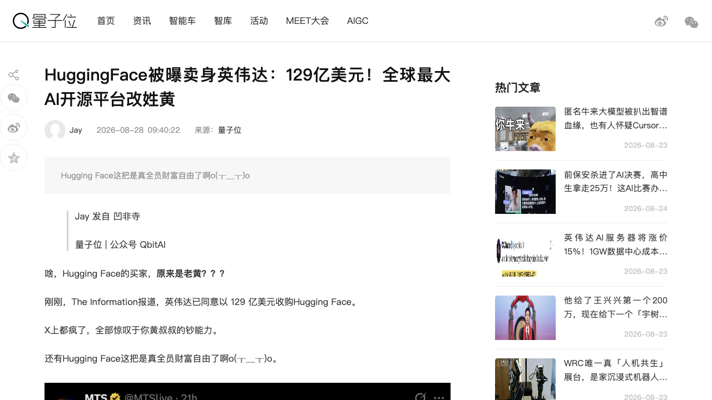
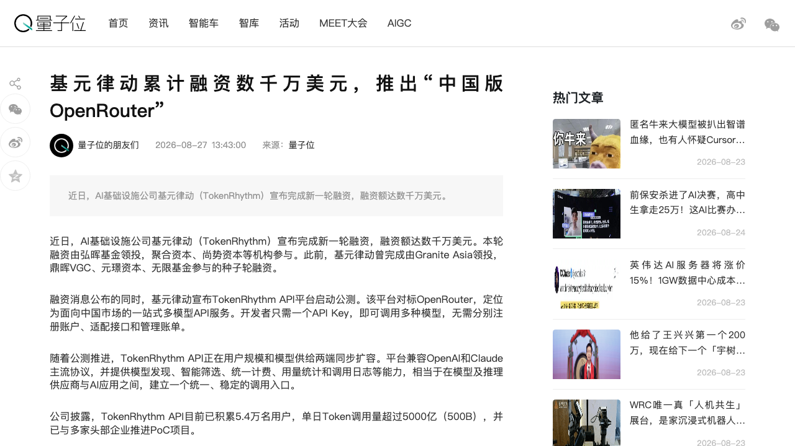
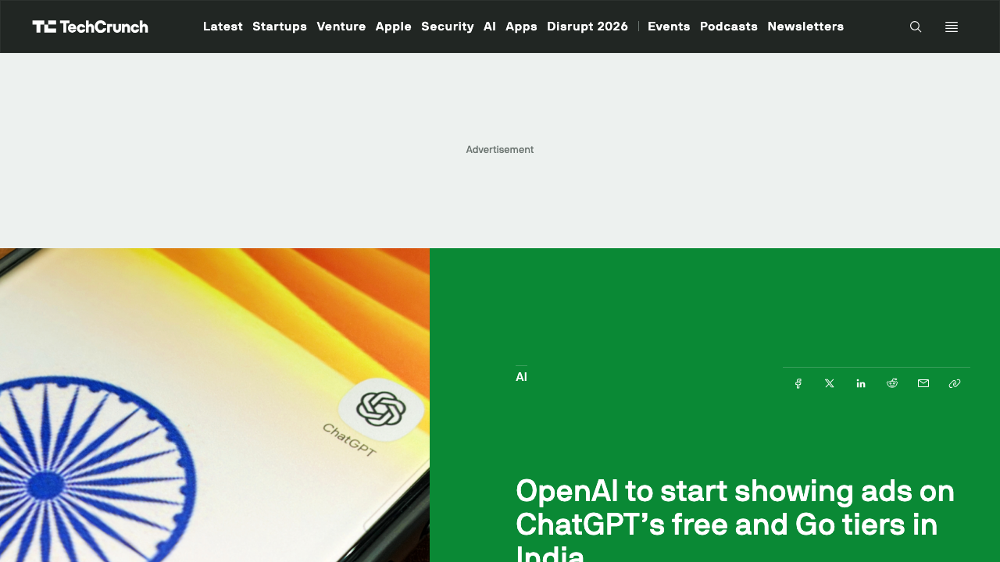
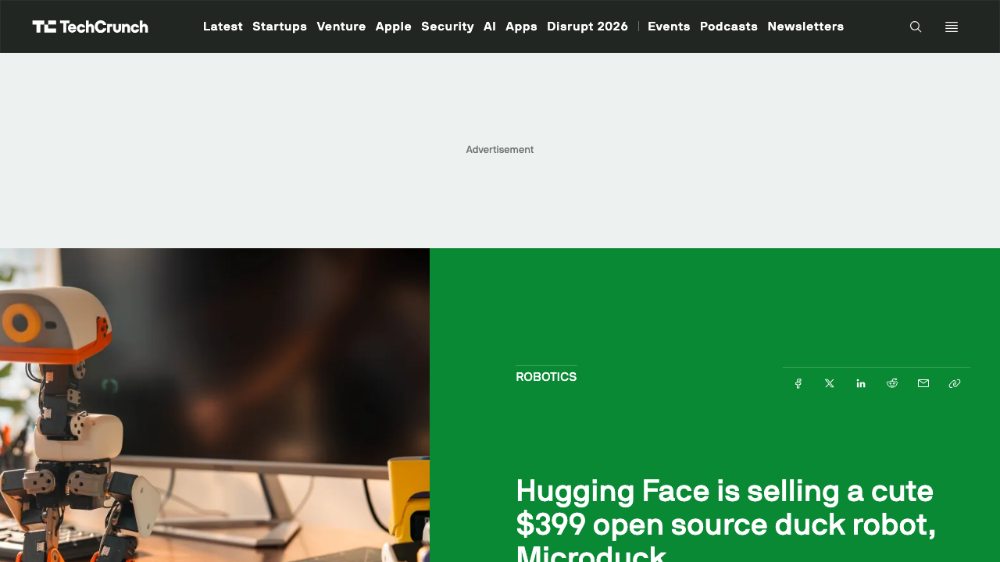
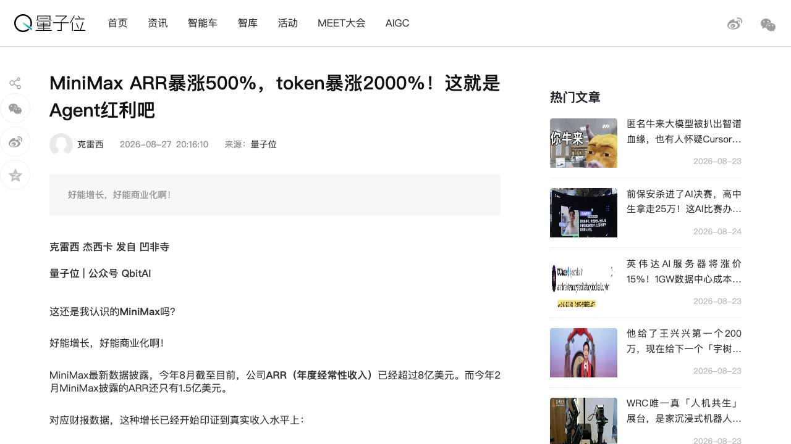

# 0828日报 | AI的「生态收编」时刻：英伟达129亿美元收购Hugging Face（「AI界GitHub」3年估值从45亿到129亿、ARR仅约1亿美元的它改姓黄——微软没谈成、开源=英伟达的Android、「免费的东西最贵」、还捎带重返云计算+给闲置算力找买家）、OpenAI把ChatGPT广告开到印度（1亿周活、50品牌首发、WPP/Omnicom联手、广告管理器下月上线、日预算最低7.6美元、Q2收入67亿美元IPO前补血）、MiniMax半年ARR从1.5亿飙到8亿美元（B端占比80%、7月Token消耗=1月的20倍、M3仅1.2美元/百万Token、H3开源3周2400万下载——「Agent红利+开源反哺」双引擎）、基元律动数千万美元融资推「中国版OpenRouter」（TokenRhythm API公测、5.4万用户500B日Token、Query级路由成本仅1/9、「Routing Harness」抢跑模型编排层）、Hugging Face卖399美元开源鸭子机器人MicroDuck（RL教新把戏、能捡800克能滑旱冰、仿真训练直部署真机、SDK与RL训练栈全开源——「物理AI平价化」宣言）

## 今日洞察

今天的五个字：「**AI的『生态收编』时刻。**」

**8月27-28日，五件事指向同一条主线：AI产业进入「生态收编与商业化提速」阶段——基础设施巨头买下开源生态中枢，模型公司把流量变成广告位，Agent浪潮让Token像水电一样被消耗，中间件与平价硬件同时抢跑。** 收编侧，The Information报道英伟达已同意以129亿美元收购Hugging Face（尚待正式协议）：这家2016年成立的「AI界GitHub」托管着超300万个开源模型与超100万个数据集，2023年D轮投后估值45亿美元、两个月前ARR仅约1亿美元（The Information称近期年收入约1.5亿美元）——3年估值近3倍，微软谈过没谈成，而英伟达去年底那笔被拒的5亿美元投资（70亿美元估值）如今换来整个公司；黄仁勋近期的「开源小作文」、与24家公司联名呼吁美国政府支持开源模型，全是这场收购的草蛇灰线——英伟达的逻辑与Google当年推Android如出一辙：软件免费、生态拉动硬件，「免费的东西最贵」；交易还藏着两层算盘：HF本就在帮开发者用租来的算力跑模型=英伟达收缩DGX Cloud一年后重返云计算，以及为客户担保数百亿美元云合同的英伟达，可以把客户用不完的闲置算力卖给HF的用户（呼应0821日报Stripe 75亿美元收购OpenRouter：巨头正在集体收编「开发者入口」）；商业化侧，OpenAI宣布在印度ChatGPT Free/Go层级投放广告：印度周活用户超1亿、首发50个品牌、与WPP和Omnicom两大广告代理合作、广告管理器（Ad Manager）下月上线且日预算最低仅7.6美元（₹725）——美国2月、欧洲8月、印度8/27，「对话即广告位」从试验走向全球，IPO前把免费流量变现（Q2收入67亿美元）；Agent红利侧，MiniMax电话会披露：ARR 8月超8亿美元（2月1.5亿、半年5.3倍）、B端收入占比从2025年约三成升至8月的80%、7月Token消耗量=1月的20倍、M3定价1.2美元/百万Token（同级中位数2.2美元）、H3视频模型开源3周2400万+下载——「人跟AI聊天」变成「Agent跟AI打交道」后，Token像水电一样被消耗，中国模型公司第一次把「Agent红利」写进财报；中间件抢跑，基元律动（TokenRhythm）宣布新一轮融资数千万美元并公测「中国版OpenRouter」：一个API Key调用多模型、5.4万用户500B日Token、Query级路由成本仅为任务级方案的1/9——「组织模型」取代「拥有模型」成为新叙事；平价硬件宣言，被129亿美元收购传闻包围的Hugging Face，同一天卖起了399美元的开源鸭子机器人MicroDuck——用RL教新把戏、仿真训练直接部署真机、SDK与RL训练栈全开源，「开源模型托管中枢」与「开源平价机器人」在同一个公司身上完成闭环。

**为什么这是创业者的窗口期：①『开源平台的独立时代结束了』——中立性溢价消失，托管/分发层成为巨头入口生意。** 英伟达买HF、Stripe买OpenRouter（75亿美元），两个月内两个「开发者入口」被收编：开源生态的中立托管方变成芯片巨头的获客漏斗，「免费的东西最贵」从段子变成财报逻辑。对创业者的启示：做开源/开发者基础设施的团队，要把「被巨头收编」写进退出剧本——估值锚从ARR（HF约1亿ARR卖129亿，约百倍PS）切换到「生态位稀缺性」；同时警惕生态风险：HF被英伟达收购后，中立性、模型托管政策、开源社区治理都会变，依赖HF分发的开源项目要有Plan B；**②『注意力层』成为AI商业化的新战场——对话即广告位，AI媒体的广告网络开始成型。** OpenAI把广告开到印度（1亿周活）、广告管理器下月上线且日预算低至7.6美元：这是Facebook式Self-serve广告的AI版——「在决策成形的高上下文时刻」插入广告，意图明确的对话（旅行、购物、决策）广告价值远超信息流。对创业者的启示：① 做AI应用/Agent的团队，把「对话内广告位」作为免费层的变现设计（而非只有订阅），参考ChatGPT的「免费层靠广告、付费层靠订阅」双层结构；② 「给AI投广告」是新的营销服务——GEO（生成引擎优化）+对话广告投放，会成为2026-2027的确定增量（呼应0827日报Runable的「增长层」叙事）；③ 广告管理器的低门槛（₹725日预算）意味着AI广告会快速长尾化，先做「AI广告效果归因/中间层」的团队有窗口；**③『Agent红利』从叙事变成财报数字——Token消耗是新的价值标尺，「B端/开发者」成为模型公司主引擎。** MiniMax半年ARR从1.5亿到8亿美元、B端占比80%、7月Token=1月20倍：增长的乘数是「用户数×单用户消耗量」双增——Agent在工作流里「每一步都要调模型」，消耗量级与聊天完全不同。对创业者的启示：① 衡量模型公司/Agent公司的健康度，别只看用户数或收入，要看「Token消耗增速」与「付费Token占比」（呼应0827日报Runable的付费token口径）；② 模型公司的收入结构正在从C端订阅转向API/企业服务——「开放平台」是Agent浪潮的最大受益者，做Agent的团队要选「吃token的模型供应商」绑定长期价值；③ 低价策略（M3的1.2美元/百万Token）不是赔本赚吆喝，而是「降低单位智能成本→客户跑更多工作流→收入反增」的正循环，国内模型的「量大管饱」路线被数据验证；**④『组织模型』比『拥有模型』更早成为生意——模型路由/编排层是确定的中间件机会。** 基元律动做「中国版OpenRouter」+ Routing Harness：不止统一接入（Model Gateway），而是进入Agent任务执行过程按任务类型/阶段/预算/实时状态动态调度模型——OpenRouter被Stripe 75亿收购后，「路由层」全球被定价，中国版空白正在被填。对创业者的启示：① 多模型长期共存是结构性的（开源+闭源、国产+海外、价格能力分层），「路由/编排」是Agent时代的中间件新位（呼应0821日报Ramp Router、Callosum的「算力路由」主线）；② 路由层的护城河不是API聚合，而是「任务理解+成本优化」的数据飞轮——真实任务的模型选择/结果/成本/反馈数据，比接入的模型数量值钱；③ 从「组织模型」走向「反哺模型」（用真实反馈优化路由策略、甚至训练Agent-Native模型）是第二曲线；**⑤ 物理AI的『平价开源』宣言——399美元机器人+开源RL栈，让『教机器人新把戏』变成开发者能力。** HF的MicroDuck把「强化学习教新技能」的产品化做到399美元：仿真训练直部署真机、SDK与完整RL训练栈开源——这正好接住0827日报Skild S1「上下文学习」抛出的问题：当机器人学新技能越来越便宜，「机器人技能开发」会成为像写Prompt一样的全民能力，玩具级硬件是数据飞轮与开发者教育的入口。对创业者的启示：① 机器人硬件平价化（399-499美元）+开源软件栈，会催生「机器人技能市场/教程/数据集」的生态生意；② 「在卧室里跑的摄像头机器人」的隐私争议=信任设计的机会（HF CEO用「开源比黑箱好」回应，但App层数据外泄风险仍在）；③ 个人/桌面机器人是机器人数据采集的「众包入口」，做具身数据生意的团队值得盯。

**六个信号同样关键**：① **AI硬件的『随身入口』再进一步**（8/27 TC：Plaid新耳机Plaud One——250万用户的AI录音笔厂商做AirPods形态耳机，最大卖点是eSIM充电盒：不依赖手机电脑、随时远程召唤AI Agent干活（写跟进邮件/建文档/做演示），12mm驱动+主动降噪、5米拾音、单次充电25小时录音，$249预售Q4发货，300分钟/月免费转写后$8.33/月起，购买送$200 Agent任务积分，另有300分钟免费额度之外的agentic更新在路上——「语音即界面」从叙事变成硬件标配，但竞品密集：Viaim/Anker/Pocket都在做同形态）；② **Google AI Mode把Agent塞进交易闭环**（8/27 TC：AI Mode新增航班价格追踪（180+国家、降价邮件提醒）+对话订酒店（「Continue on Google」流转到Booking.com/Expedia/Hilton/Marriott等10家合作方、Google Pay支付）+积分/里程兑换显示（全球可用）——「订机票酒店」这种高客单、意图明确的场景，是Agent原生交易的第一个主战场，巨头把「搜索→比价→预订→支付」整条链路收进对话里）；③ **宇树×智元共用一个大脑**（8/26量子位：10分钟一镜到底、无剪辑无遥控的demo里，宇树与智元两款硬件架构/自由度/传感完全不同的机器人在同一空间并行干家务、伸手出窗擦玻璃、长程任务被打断后精准恢复——「跨本体通用大脑」是全球罕见样本，与0827日报Skild S1的「上下文学习」同一条主线：机器人竞争从本体参数卷到「大脑跨本体泛化」，大脑派估值逻辑再获验证）；④ **千问办公首发Qwen3.8-Flash**（8/26晚上线、8/27量子位：千亿级总参数性能超Claude Opus 4.6，办公专属版针对多步规划/工具选择/上下文压缩专项调优，标准模式单任务生成速度+约100%、Token消耗平均-75%，未来只保留标准/高级两档、95%日常任务走标准模式——「性能、成本、速度的『不可能三角』被Agent与模型的深度协同打破」，办公Agent进入「量大管饱」成本战）；⑤ **工业Agent拒绝「套壳」**（8/27量子位：西门子Xcelerator把百年工业经验灌进工业AI——货架解决「把产品卖出去」，Xcelerator解决「让产品在真实工业场景持续生长」，工业Agent的护城河是行业数据+流程知识而非模型本身，垂直行业Agent正在被巨头与创业公司同时教育市场）；⑥ **端侧内存成为AI新瓶颈**（8/27 TC：Google宣布Android新性能阈值（动态内存/位图用量）+代码优化要求+超限告警工具，年底推Memory Limiter防App吃光设备内存——官方明说移动行业正面临「显著硬件供应约束改变设备内存可用性」，HBM供需缺口50-60%（0824日报）开始向手机DRAM传导，开发者需在2027年2月前达标——「存储定义算力」从数据中心蔓延到端侧，内存优化能力成为AI App的合规项）。

---

## 1. [英伟达被曝以129亿美元收购Hugging Face：The Information报道双方已同意、尚未达成正式协议——「AI界GitHub」托管300万+开源模型与100万+数据集，3年估值从45亿涨到129亿、ARR仅约1亿美元（近期约1.5亿），微软谈过没谈成、去年底还拒过英伟达5亿美元投资——「开源=英伟达的Android」，免费的东西最贵，顺带重返云计算+给闲置算力找买家，与Stripe 75亿美元收购OpenRouter构成「巨头收编开发者入口」双响炮](https://www.qbitai.com/2026/08/480186.html)（行业洞察 / 开源生态中枢被芯片巨头收编：英伟达的算力霸权从「卖铲子」延伸到「买下矿脉」——开源平台的中立性溢价消失，托管/分发层成为巨头入口生意，与0821日报Stripe×OpenRouter同构）

🔗 链接：[量子位·HuggingFace被曝卖身英伟达：129亿美元！全球最大AI开源平台改姓黄](https://www.qbitai.com/2026/08/480186.html) | [TechCrunch·Nvidia closes in on Hugging Face acquisition](https://techcrunch.com/2026/08/26/nvidia-closes-in-on-hugging-face-acquisition/) | [Hugging Face官网](https://huggingface.co/)

**动态**：**The Information报道（量子位8/28转述），英伟达已同意以129亿美元收购Hugging Face——这场收购尚未达成正式协议，但微软已出局。** 关键信息：① **身份与规模**：HF 2016年成立于纽约，最早做聊天机器人App，后转型开源模型托管，成为开发者上传/分享/下载AI模型与数据集的集散地，人送外号「AI界的GitHub」——平台上托管超300万个开源模型与超100万个数据集；② **估值轨迹**：2023年D轮融资2.35亿美元、投后估值45亿美元（Salesforce Ventures领投，谷歌、亚马逊、英特尔、AMD、英伟达等参投）；去年底FT报道HF拒绝过英伟达一笔5亿美元投资（对应70亿美元估值），理由是「不想要一个能左右公司决策的强势大股东」——如今却选择整体卖身；③ **财务现实**：HF营收其实很少——两个月前ARR仅约1亿美元，The Information称近期年收入约1.5亿美元，Delangue上月表示公司「接近盈利」；129亿美元对一家ARR约1.5亿的公司是近百倍PS；④ **买家财力**：英伟达Q2财报杀疯——当季营收962.21亿美元（同比+106%）、净利润596.88亿美元（同比+126%）、单日市值增加约4420亿美元、收盘市值约5.49万亿美元（全球上市公司史上第二大单日市值增量）——129亿美元「也就是个单日涨幅零头」；⑤ **谈判背景**：上周末即有巨头要收购HF的消息，商业内幕报道微软也见过HF但没谈成；英伟达本就是HF股东（2023年D轮），且双方多年合作（英伟达自2023年起提供基础设施）；黄仁勋近期亲自开推特声援开源、与24家公司（含HF）联名致信美国政府呼吁支持开源模型而非限制——全是这场收购的草蛇灰线。

**做什么的**：通俗讲，**这是「卖铲子的英伟达，花129亿美元买下了全球开发者交换模型的那条街」——HF是开源AI生态的正中心（300万个模型、100万个数据集），英伟达买下它，等于在『每个开发者训练和推理都要买GPU』的路径上，再装了一个流量总闸门。** 三个战略看点：① **「开源=英伟达的Android」**——几乎所有闭源AI实验室（OpenAI、Google、Amazon、Anthropic）都在自研AI芯片、想摆脱英伟达，但开源生态没有这个问题：一个繁荣的开源模型生态给客户提供闭源之外的替代选项，让更多算力需求留在英伟达硬件上——这正是英伟达已砸数百亿美元自研开源模型、老黄亲自下场声援开源的原因，「软件免费、靠生态拉动硬件」与Google当年推Android如出一辙，「免费的东西最贵」；② **云计算的回归跳板**——一年前英伟达收缩了自己的DGX Cloud云业务，而HF本来就在帮开发者用租来的算力跑模型——拿下HF等于不从头起步重返云市场；③ **闲置算力的「安全垫」**——英伟达承诺为客户担保数百亿美元的云计算合同，如果客户用不完这些算力，英伟达会砸在手里——而HF的用户群正好是消化这些闲置算力的买家，这是一笔「财务保险」。

**为什么值得关注**：

- **「开发者入口」正在被巨头批量收编——开源平台的中立性溢价消失。** 两个月内两笔标志性交易：Stripe以超75亿美元收购OpenRouter（5月估值还只有13亿美元）、英伟达129亿美元收购HF——「入口」的定价权不在ARR，而在生态位稀缺性（HF约1亿ARR卖129亿、OpenRouter更夸张）。对创业者的启示：① 做开发者基础设施/开源平台的团队，要把「被巨头收编」作为明确的退出路径写进融资叙事——你的价值锚是「生态位+流量入口」而非当期收入；② 收购方逻辑高度一致：芯片巨头（英伟达）、支付巨头（Stripe）都在买「开发者必经之路」，因为它们卖的是「使用次数」而非「订阅」——做「高频使用入口」的创业方向（路由、托管、工具链）被巨头盯上是早晚的事；③ 但也要警惕生态风险：HF被芯片巨头收购后，模型托管政策、开源治理、中立性都会变——重度依赖HF分发/托管的开源项目与团队，需要准备Plan B（自建分发、多平台冗余）。

- **开源与闭源的格局正在被「资本化」改写——英伟达赌的是开源生态长期繁荣，因为那是它对抗自研芯片潮的护城河。** OpenAI/Google/Amazon/Anthropic自研芯片、OpenAI「小辣椒」Jalapeño跑分碾压Blackwell（0826日报）——闭源阵营去英伟达化越坚决，英伟达越需要开源阵营当「替代选项」；与此同时华盛顿在权衡限制开源权重模型（中国Moonshot Kimi K3等低成本高性能模型引发担忧），黄仁勋与24家公司联名信正是为此。对创业者的启示：① 「开源政策」正在变成地缘政治与商业博弈的焦点——做开源模型/平台的团队要意识到，你的开源策略本身就是政治筹码，融资与叙事可以借用「开源安全港」定位；② 英伟达收购HF后，开源模型的分发可能逐渐与英伟达硬件绑定（跑HF的模型=用英伟达的卡），国产开源生态（魔搭/启智等）的机会窗口打开——「开源中立性」在中国平台上是可打的差异化牌。

- **「被巨头看上」的剧本在升级：从『给你钱』到『买下你』——HF从拒绝5亿美元投资到接受129亿美元收购，中间只隔了不到一年。** 对创业者的启示：① 估值弹性极大：HF在ARR几乎没变（1亿→1.5亿）的情况下，估值从70亿美元（去年底投资报价）跳到129亿美元——生态位价值在AI军备竞赛中被重估，别用传统PS框架自我设限；② 但「拒绝强势股东」与「整体卖身」的选择题，本质是「独立但受制于人」vs「并入但获得资源」——HF选择了后者，说明开源平台独立运营的现金流模型（托管免费、靠企业服务）天花板有限；③ 对HF生态内的创业公司（基于HF做工具、数据集、微调服务）是利好：母公司变成全球最有钱的芯片公司，但也要盯紧平台政策变化。

- 对创业者的启发：**① 把「生态位稀缺性」而非ARR写进估值叙事；② 开源/开发者平台提前规划「被收编」剧本与Plan B；③ 关注HF被收购后托管政策与中立性变化，重仓HF生态的团队做冗余；④ 跟踪国产开源平台（魔搭等）承接「中立性」红利的窗口。** 跟踪三个验证点：收购正式协议与监管审批（美国/欧盟反垄断）、HF托管政策与商业化节奏变化、开发者社区对「英伟达版HF」的迁移意愿。

**类比参考**：**「AI的『Android时刻』/ 从『拒绝5亿美元投资』到『129亿美元卖身』——当卖铲子的英伟达买下全球开发者交换模型的广场，'免费的东西最贵'第一次有了市值：开源不是情怀，是芯片霸权的护城河（呼应0821日报：Stripe刚用75亿美元买下OpenRouter，'入口'正在被巨头集体收编）」**

---

## 2. [基元律动完成新一轮数千万美元融资并公测「中国版OpenRouter」：TokenRhythm API平台一个API Key调用多模型、兼容OpenAI/Claude协议、已积累5.4万用户与单日500B Token调用——但野心不止模型API聚合：押注「Routing Harness」基础设施，让Agent按任务类型/执行阶段/成本预算动态组织模型（Query级路由成本仅为任务级方案的1/9），从「拥有最强单模型」转向「更好地组织模型」](https://www.qbitai.com/2026/08/480079.html)（融资 / 模型路由/编排层被资本定价：OpenRouter被Stripe 75亿收购后，「路由层」全球价值确认，中国版空白正在被填——「组织模型」取代「拥有模型」成为Agent时代的新中间件叙事，延续0821日报Ramp Router/Callosum的「算力路由」主线）

🔗 链接：[量子位·基元律动累计融资数千万美元，推出「中国版OpenRouter」](https://www.qbitai.com/2026/08/480079.html) | [TokenRhythm官网](https://www.tokenrhythm.com/)

**动态**：**8月27日，AI基础设施公司基元律动（TokenRhythm）宣布完成新一轮融资（融资额数千万美元，弘晖基金领投，聚合资本、尚势资本等参与；此前完成由Granite Asia领投、鼎晖VGC、元璟资本、无限基金参与的种子轮），并同步宣布TokenRhythm API平台启动公测。** 关键信息：① **产品定位**：对标OpenRouter，面向中国市场的一站式多模型API服务——开发者只需一个API Key即可调用多种模型，无需分别注册账户、适配接口和管理账单；兼容OpenAI与Claude主流协议，提供模型发现、智能筛选、统一计费、用量统计与调用日志，相当于在模型及推理供应商与AI应用之间建立统一、稳定的调用入口；② **冷启动数据**：TokenRhythm API已积累5.4万用户、单日Token调用量超5000亿（500B），已与多家头部企业推进PoC项目；③ **战略升级**：基元律动并不停留在模型API聚合层——随着大模型数量持续增加、模型间能力/价格/适用场景差异扩大，AI应用正从「选择一个最强模型」转向「针对不同任务组织不同模型」；公司押注的是模型与Agent应用之间的Routing Harness基础设施：与主要解决统一接入和供应商切换的Model Gateway相比，Routing Harness会进入Agent任务执行过程，根据任务类型、执行阶段、成本预算和实时状态，动态完成模型选择、切换、协作与结果聚合，在效果与成本之间寻找更优解；④ **产品路径**：已形成「开源Agent、模型API、智能路由与协同」路径——首个产品OpenSquilla是开源AI Agent软件（多操作系统一键启动），已获超6600个GitHub Stars、17万次Clone、超1万台真实装机；⑤ **实测数据**：在国际通用评测PinchBench上，保持相同任务精度下OpenSquilla采用Query级路由后的调用成本约为任务级路由方案的1/9；在DRACO复杂研究任务评测中，由国产模型组成的多模型集成方案以约1/3的成本取得高于Fable 5的测试成绩；⑥ **愿景**：CEO王云鹤表示「模型能力只是Agent智能的一部分。下一阶段的竞争，不仅是谁拥有最强的单模型，更是谁能更好地组织模型、理解任务，并让真实反馈持续改善模型」——系统在真实任务中产生的模型选择、任务结果、成本与用户反馈，可反哺路由策略优化，并为Agent-Native Model研发打基础。

**做什么的**：通俗讲，**这是「给中国的AI开发者造一个『模型路由器』——以前你要为每个模型注册账号、接不同接口、对不同的账单，TokenRhythm让你用一个Key用所有模型；再进一步，它不满足于当『接线板』，还要当『调度员』：看懂你的任务是什么、哪一步该用哪个模型最划算，自动帮你切换和组合。** 三个战略看点：① **「中国版OpenRouter」的卡位时机**——OpenRouter刚被Stripe以75亿美元收购（5月估值13亿），全球「路由层」价值被确认，而中国市场还没有同等量级的玩家——TokenRhythm带着5.4万用户、500B日Token的公测数据进场，卡的是「先发+本土化」身位（国产模型供给、人民币计费、国内合规）；② **从Model Gateway到Routing Harness的叙事升级**——统一接入是「水电煤」生意（低毛利、可替代），进入Agent任务执行过程的动态路由才是「智能调度」生意（高价值、有数据飞轮）：按任务类型/阶段/预算/实时状态选模型，本质是「用路由策略换成本与效果的最优解」——PinchBench上Query级路由成本仅为任务级1/9，是「路由本身就能省钱」的量化证据；③ **开源Agent做钩子、API做变现、路由数据做护城河**——OpenSquilla（6600+ Stars、1万+装机）负责冷启动与开发者教育，API公测负责规模化，真实任务的模型选择/结果/成本/反馈数据负责训练更聪明的路由策略——「组织模型」的数据飞轮比「拥有模型」的参数军备更轻、更快。

**为什么值得关注**：

- **「路由层」是Agent时代被验证的中间件新位——多模型长期共存是结构性的，组织模型的生意比拥有模型更早盈利。** OpenAI/Anthropic/谷歌/国产模型百花齐放、价格与能力分层加剧，「一个模型打天下」正在失效；而Agent工作流天然需要多模型协作（规划用强模型、执行用快模型、视觉用多模态）——这正是0821日报Ramp Router（440亿美元估值的金融科技公司自研路由）、Callosum（1亿美元种子轮做「算力路由」）、以及Stripe 75亿收购OpenRouter共同押注的方向。对创业者的启示：① 路由/编排层的机会不止于API聚合：垂直场景路由（某行业的多模型编排）、路由策略即服务、路由效果评估基准都是切入点；② 「成本优化」是路由层最锋利的销售话术——1/9成本、1/3成本这类数据直接打动预算敏感的企业客户；③ 路由层的终局是「反哺模型」：用真实任务的模型表现数据训练Agent-Native模型，或做「模型选型咨询」，从卖流量升级到卖智能。

- **国产模型的「供给侧红利」正在被中间件收割——中国版OpenRouter的窗口来自国产模型爆发。** 智谱GLM-5.3 Flash（0827日报）、DeepSeek、MiniMax M3（今日信号）、Qwen3.8-Flash（今日信号）等国产模型能力追平前沿、价格打一折——模型供给越多，「选模型」越难也越值钱，路由中间件的价值与模型数量正相关。对创业者的启示：① 做Agent的团队可以把「多模型路由」作为默认架构能力（而非绑定单一模型厂商），成本与稳定性都能优化；② 「国产模型集成方案」本身是卖点——DRACO评测中国产模型组合以1/3成本超Fable 5，证明「组织」可以弥补「单点」的差距；③ 关注路由层玩家（TokenRhythm、OpenRouter中文版、云厂商的模型网关）的竞争——云厂商的网关是「顺带做」，独立路由公司要拼「路由策略深度」而非「接入数量」。

- **「开源Agent引流→API变现→数据反哺」是2026年中国AI基础设施公司的标准起手式。** 与0827日报Radar（消费者产品转型API数据公司）不同，TokenRhythm是「开源软件起家、API商业化」路径——OpenSquilla的1万台装机是开发者信任的种子，API公测把这些装机转化为调用量。对创业者的启示：① 开源是成本最低的获客漏斗：先用开源Agent/工具建立开发者心智，再向API/云服务导流——HF的H3开源3周2400万下载反哺API付费（今日MiniMax信号）是同一逻辑的模型侧版本；② 「路由数据」是比「路由功能」更深的护城河——真实的模型选择、成本、结果、反馈数据，是训练「更聪明路由」的燃料，先发者数据积累越多越难被追上。

- 对创业者的启发：**① 把「多模型路由/编排」写进Agent产品架构与融资叙事；② 做中间件优先选「有数据飞轮的环节」（路由策略>统一接入）；③ 用「开源钩子+API变现+数据反哺」三步走冷启动；④ 关注国产模型爆发带来的路由层窗口。** 跟踪三个验证点：TokenRhythm公测后的付费转化与头部客户落地、路由策略在真实Agent长程任务上的成本/效果数据、云厂商/OpenRouter是否加速中国区布局（巨头进场=赛道验证）。

**类比参考**：**「Agent时代的『模型调度员』/ 从『一个Key调所有模型』到『看懂任务、替你选最划算的模型』——当Stripe用75亿美元给OpenRouter定价，'组织模型'第一次成为一门生意：多模型长期共存不是过渡态，而是结构——谁让Agent更省钱、更好用，谁就站在中间收过路费（呼应0821日报：路由层正在被全行业定价）」**

---

## 3. [OpenAI宣布在印度ChatGPT Free/Go层级投放广告：1亿+周活用户、首发50个品牌、与WPP/Omnicom两大广告代理合作，广告管理器（Ad Manager）下月上线且日预算最低仅₹725（7.6美元）——「在决策成形的高上下文时刻」插入广告，美国2月、欧洲8月、印度8/27，「对话即广告位」从试验走向全球，Q2收入67亿美元、IPO前把免费流量变现](https://techcrunch.com/2026/08/27/openai-to-start-showing-ads-on-chatgpts-free-and-go-tiers-in-india/)（行业洞察 / AI的「注意力层」商业化提速：对话内广告+自助广告管理器=Facebook式Self-serve广告的AI版——免费层靠广告、付费层靠订阅的双层结构成型，广告成为AI应用流量货币化的新通道）

🔗 链接：[TechCrunch·OpenAI to start showing ads on ChatGPT's free and Go tiers in India](https://techcrunch.com/2026/08/27/openai-to-start-showing-ads-on-chatgpts-free-and-go-tiers-in-india/)

**动态**：**8月27日，OpenAI宣布将在印度市场的ChatGPT Free与Go（低价）层级开始展示广告——本月早些时候OpenAI已修改服务条款，明确将向用户展示广告。** 关键信息：① **市场基础**：OpenAI今年2月披露印度周活用户超1亿，其中很大一部分使用免费或低价Go层级——印度是OpenAI深耕的市场：2025年8月推出低于5美元的ChatGPT Go、做过把Go层级免费一年的促销、赞助WPL与IPL板球赛事、近期还挖来Uber印度负责人主导扩张；② **首发阵容**：首批向50个品牌开放广告位，与WPP、Omnicom两家全球广告代理集团合作；③ **广告管理器**：下月（9月）将推出ChatGPT Ads的广告管理器（Ad Manager），让营销人员自助创建投放计划——门槛极低：日预算最低₹725（约7.6美元）；④ **节奏**：美国2月开始投放广告、欧洲本月早些时候扩展、印度8/27跟进——「对话即广告位」从试验走向全球；⑤ **高管口径**：OpenAI全球广告解决方案负责人Dave Dugan称「通过ChatGPT Ads，各种规模的企业都可以在决策开始成形的高上下文时刻介绍自己」；⑥ **财务背景**：IPO（预期今年或明年）前OpenAI在加紧巩固收入来源——WSJ报道其截至2026年6月的Q2收入67亿美元（上季57亿）；The Information去年11月报道OpenAI目标2030年达2.2亿付费订阅用户（当时Plus/Pro付费用户3500万）。

**做什么的**：通俗讲，**这是「ChatGPT从工具变成媒体」——以前你在ChatGPT里问问题、看答案，现在免费用户会在对话里看到广告；更关键的是OpenAI要做一个自助广告平台，让任何商家花7.6美元就能在AI对话里投广告——就像Facebook当年把广告投放开放给所有小商家一样。** 三个战略看点：① **「高上下文时刻」是对话广告的核心卖点**——用户跟AI聊「该买什么、去哪旅行、怎么选方案」时，意图明确、决策在成形，这个时刻的广告位比信息流广告精准得多——广告主为「意图」付费，而非为「曝光」付费；② **双层商业模式成型**——免费层靠广告变现、付费层（Plus/Pro/Go）靠订阅变现：这是搜索引擎（Google）与社交平台（Meta）验证过的经典结构，OpenAI正在把ChatGPT的10亿级用户池变成广告库存；③ **自助广告管理器+₹725低门槛=长尾广告网络**——50个品牌首发是「品牌广告」开路，自助工具是「效果广告」放量：让无数小商家自己投放，广告收入才会指数级增长——这是Facebook Ads的剧本，也是OpenAI广告业务的真正想象空间。

**为什么值得关注**：

- **AI应用的免费层终于有了「广告」这个变现答案——对话即广告位，注意力层商业化提速。** 订阅制撑不起免费层的算力成本，广告是唯一能规模化补贴免费用户的模式；OpenAI在3个月里把广告从美国铺到欧洲再到印度，节奏极快。对创业者的启示：① 做C端AI应用/Agent的团队，把「对话内广告位」设计进产品架构（广告位规范、上下文意图识别、广告与答案的边界），这是2026-2027免费层变现的确定方向；② 「在决策成形时刻插广告」的产品原则可迁移：旅行、购物、金融、健康等意图明确的垂直对话，广告价值最高——垂直AI助手的广告变现潜力可能超过通用助手；③ 注意广告与信任的边界：对话式广告比信息流更侵入，「答案与广告的区分」「用户对广告的接受度」是产品设计红线，做砸了会反噬信任（参考0825日报Instinct的信任悬崖）。

- **「给AI投广告」正在成为一门新营销生意——GEO+对话广告，是2026-2027的增量市场。** OpenAI的广告管理器让任何商家能自助投放，意味着「AI广告投放」会快速长尾化：商家需要知道「用户会在ChatGPT里问什么、我的品牌如何出现在答案里」。对创业者的启示：① 做营销SaaS/增长服务的团队，把「ChatGPT广告投放+AI可见度优化（GEO）」作为新功能线（呼应0827日报Runable的「AI聊天结果曝光优化」）；② 「广告效果归因」是空白：对话广告的曝光-点击-转化链路如何衡量？做AI广告的归因/分析中间层有窗口；③ 中国的对标：豆包、Kimi、元宝等免费AI助手同样面临变现压力，广告可能是它们的下一步——提前布局「AI对话广告网络」的合规与产品经验，在中国复制。

- **IPO前的「收入补血」逻辑：OpenAI把用户池、广告网络、订阅三层收入结构同时铺开。** Q2收入67亿美元（环比+17.5%）、目标2030年2.2亿付费用户——广告是补齐免费层的增量，不是替代订阅。对创业者的启示：① 读巨头动作背后的财务模型：OpenAI的广告扩张节奏（2月美国→8月欧洲→8月底印度）是「先验证→再铺量→再下沉」的标准路径，创业公司学节奏而非学规模；② 印度是AI免费层的「广告试验田」：1亿周活、价格敏感、移动优先——对做全球市场的团队，印度是验证「免费+广告」模型的理想市场；③ 关注广告对ChatGPT体验的影响：如果广告导致用户反感，反而会给无广告的付费竞品（Claude等）送用户——「广告密度」是AI媒体要小心校准的变量。

- 对创业者的启发：**① 把「对话内广告」写进C端AI应用的变现设计；② 做「AI广告投放+GEO」营销服务抢增量；③ 关注广告与信任的边界设计；④ 用印度等价格敏感市场验证免费+广告模型。** 跟踪三个验证点：印度广告上线后的用户留存与反感度、广告管理器的自助投放增长曲线、Google/Perplexity等竞品是否跟进对话广告（巨头跟进=赛道确认）。

**类比参考**：**「AI的『媒体化』时刻/ 从『每月20美元的订阅』到『7.6美元就能在AI对话里投广告』——当OpenAI把免费用户的注意力变成广告库存、把广告投放开放给所有小商家，ChatGPT不再只是工具，而是正在成为AI时代的注意力交易所——'高上下文时刻'就是新的黄金广告位（Facebook用信息流做过一遍的事，AI要用对话再做一遍）」**

---

## 4. [Hugging Face发布399美元开源鸭子机器人MicroDuck：25厘米高、能摇摆行走/用喙捡起800克物体/摔倒自己站起/甚至滑旱冰，CEO称「可用强化学习教它新把戏」——摄像头+激光雷达+双IMU感知、仿真训练可直接部署真机、SDK与完整RL训练栈全开源、圣诞前发货——「欢迎来到开源平价机器人时代」，与129亿美元收购传闻同框的物理AI平价化宣言](https://techcrunch.com/2026/08/27/hugging-face-is-selling-a-cute-399-open-source-duck-robot-microduck/)（新产品 / 物理AI的「平价开源」宣言：399美元机器人+开源RL训练栈，让「教机器人新把戏」从实验室技能变成开发者能力——玩具级硬件是机器人技能数据飞轮与开发者教育的入口，与0827日报Skild S1的「学新技能变便宜」同一条主线）

🔗 链接：[TechCrunch·Hugging Face is selling a cute $399 open-source duck robot, Microduck](https://techcrunch.com/2026/08/27/hugging-face-is-selling-a-cute-399-open-source-duck-robot-microduck/) | [Hugging Face官网](https://huggingface.co/)

**动态**：**8月27日（周四），Hugging Face发布Microduck——一款399美元的开源鸭子机器人，承诺圣诞前发货。** 关键信息：① **官方定位**：CEO Clem Delangue称Microduck是「可用强化学习教新把戏的开源机器人」，并宣言「欢迎来到开源平价机器人时代，让物理AI与世界模型民主化」；② **能力**：25厘米高的鸭子能摇摆行走、用喙捡起物体（最高800克）、摔倒后自己站起来、蹲下、甚至滑旱冰——官方发布附带一段「raw footage」实拍视频；③ **感知**：摄像头+激光雷达+两个IMU（惯性测量单元）感知世界；④ **训练与部署**：行为可以在仿真环境中训练后直接部署到真机，开发者可微调、重训、重新部署——SDK、仿真环境与完整RL训练栈全部在GitHub开源；⑤ **团队背景**：来自HF 2025年4月收购的法国机器人初创Pollen Robotics——此前双方已推出Reachy Mini（499美元、树莓派驱动）与Reachy Mini Lite（399美元、Mac/PC驱动）桌面机器人；⑥ **隐私争议**：对「卧室里带摄像头的机器人」的担忧，Delangue此前回应：由开源模型驱动的机器人比「由少数组织控制的黑箱系统」更有利于隐私——但TC提醒：开源只给审计与可控性，消费者安装的App层仍可能访问摄像头/麦克风并把数据发给外部服务；⑦ **发布时点**：Microduck发布恰逢HF被曝将以约130亿美元估值被英伟达收购——两者多年合作（英伟达自2023年起提供基础设施），并公开共同倡导开源AI。

**做什么的**：通俗讲，**这是「把『教机器人学新把戏』做成399美元的玩具」——以前的机器人开发要几十万的硬件、实验室级的训练流程；MicroDuck让任何开发者花399美元买一只鸭子，用开源的强化学习训练栈在仿真里教会它新动作，再一键部署到真机——就像当年树莓派把电脑开发平民化一样，HF想把机器人开发也平民化。** 三个战略看点：① **「物理AI平价化」是开源社区的下一个民主化对象**——模型权重开源之后，HF把矛头指向机器人硬件：399美元的价格锚点（比一台游戏机还便宜）让「机器人开发」从实验室走入极客卧室与学校课堂；② **「仿真训练→真机部署」是产品化的关键卖点**——在仿真里练好再部署真机（sim-to-real），绕开「真机数据采集贵、摔坏赔不起」的痛点，让RL训练栈成为任何人都能用的开发流程——这与0827日报Skild S1「看一遍演示就学会」共享同一个方向：机器人学新技能的成本在快速下降；③ **开源RL栈=开发者生态的钩子**——SDK、仿真、训练栈全开源，等于把「教鸭子新把戏」的教程生态交给社区：谁教会了鸭子最酷的把戏，谁就是社区明星——这是HF最擅长的「开源+社区」打法在硬件上的复制。

**为什么值得关注**：

- **机器人硬件的「树莓派时刻」正在到来——399美元的开源机器人，让机器人技能开发从实验室走向全民。** 对创业者的启示：① 机器人硬件平价化（399-499美元区间）会催生生态生意：技能市场（「教鸭子把戏」的交易平台）、数据集（众包采集机器人行为数据）、教程/课程、配件——「机器人版App Store」的早期形态可能出现在玩具级硬件上；② 仿真训练→真机部署的sim-to-real工具链（仿真环境、迁移工具、评测基准）是中间件机会——机器人的「开发工具」比机器人本体更早规模化；③ 「开源硬件+开源模型+开源训练栈」的组合正在形成新的机器人开发范式，做闭源黑箱机器人硬件的团队要有差异化警觉。

- **「玩具级硬件是数据飞轮与开发者教育的入口」——机器人技能数据开始众包化。** 每个买了MicroDuck的开发者都在训练、微调、部署，产生的行为数据与技能是分散的「众包数据」——如果HF（或英伟达）把这些技能数据汇聚成数据集，就是具身智能的「众包语料」。对创业者的启示：① 做具身数据生意的团队，关注「消费者级机器人+开源训练」产生的长尾数据——比真机遥操作采集便宜几个数量级；② 「在卧室里跑的摄像头机器人」的隐私争议=信任设计的机会：开源模型、本地处理、数据可控是卖点，但App层的合规设计（数据出境、权限透明）是新硬件公司必须提前做的功课。

- **被129亿美元收购传闻包围的HF还在卖399美元的鸭子——「开源理想主义」与「巨头收编」的张力，本身就是产品叙事。** 对创业者的启示：① 开源项目的商业化路径可以「硬件+软件栈」双轮：模型托管（平台）提供品牌与流量，平价硬件提供收入与开发者抓手——即使平台被收购，硬件与社区的价值仍在；② 关注英伟达收购HF后对机器人业务的影响：MicroDuck/Reachy Mini与英伟达的机器人平台（Isaac等）天然契合，「开源机器人+英伟达算力」可能成为新的机器人开发生态——做机器人软件/工具的团队，可以把「兼容开源机器人硬件栈」作为架构选择。

- 对创业者的启发：**① 把「机器人硬件平价化」作为创业窗口：技能市场、sim-to-real工具链、众包数据都是入口；② 玩具级硬件是开发者教育/数据飞轮的起点，别轻视「玩具」；③ 硬件产品提前设计隐私与合规（摄像头/麦克风权限、数据本地化）；④ 关注开源机器人硬件栈与英伟达生态的融合。** 跟踪三个验证点：MicroDuck圣诞前发货后的销量与社区活跃度（技能数量）、开源RL训练栈的第三方采用率、英伟达收购HF后机器人业务的整合方向。

**类比参考**：**「机器人的『树莓派时刻』/ 从『几十万的真机+实验室训练』到『399美元的鸭子+开源RL栈』——当被129亿美元收购传闻包围的开源平台，转身卖起圣诞前发货的开源鸭子机器人，'物理AI民主化'第一次有了价格标签：教机器人新把戏，正在变成像写代码一样便宜的技能（呼应0827日报Skild S1：机器人学新技能的边际成本正在趋近于零）」**

---

## 5. [MiniMax电话会披露商业化数据：8月ARR超8亿美元（2月1.5亿、半年5.3倍），2026上半年收入1.166亿美元同比+283.1%、B端收入占比升至80%（2025年约三成），7月Token消耗量=1月的20倍，企业客户与开发者破200万（去年底10倍），M3定价1.2美元/百万Token（同级中位数2.2）、H3视频模型开源3周2400万+下载——「人跟AI聊天」变「Agent跟AI打交道」，Agent红利+开源反哺双引擎，中国模型公司第一次把「Agent红利」写进财报](https://www.qbitai.com/2026/08/480092.html)（行业洞察 / 模型公司的商业模式分水岭：Token消耗取代用户数成为价值标尺、B端/开发者成为主引擎、低价策略被验证为正循环——「量大管饱」从刻板印象变成增长飞轮）

🔗 链接：[量子位·MiniMax ARR暴涨500%，token暴涨2000%！这就是Agent红利吧](https://www.qbitai.com/2026/08/480092.html) | [MiniMax官网](https://www.minimax.io/)

**动态**：**8月27日，MiniMax在财报电话会上披露一组爆发式数据：今年8月截至目前ARR（年度经常性收入）已超8亿美元——而2月披露时还只有1.5亿美元，半年扩大约5.3倍。** 关键信息：① **收入**：2026上半年收入1.166亿美元，同比+283.1%，半年即超2025全年（7904万美元）；Q2环比Q1再增81.8%；② **收入结构剧变**：B端收入占比从2025全年的约三成，升至2026上半年的63.4%、8月进一步到80%——上半年开放平台及其他AI企业服务收入7393万美元（同比+703.1%），约3/4的新增收入来自B端；C端并未收缩：AI原生产品收入4264万美元、同比+100.9%（Talkie、海螺AI持续商业化）；③ **Token消耗**：7月Token消耗量已达1月的20倍——「人跟AI聊天」变成「Agent跟AI打交道」后，单用户消耗量级完全不同，Agent驱动的推理需求增长显著快于人类用户数与消息数增长；④ **开发者规模**：5月平台企业客户与开发者突破200万（去年年底的10倍），M3发布后老客户持续扩量；⑤ **开源反哺**：7月视频生成模型H3开源，三周内超2400万次下载、社区衍生300多个模型——开源让开发者熟悉技术栈，需要云服务时转向API付费调用，带动官方线上服务使用量爆发；⑥ **价格与效率**：最强模型M3定价1.2美元/百万Token（同级中位数2.2美元）——MiniMax称这不是商业策略而是「推理算力开销真的没那么高」；毛利率从12.1%升至17.9%（毛利2081万美元、同比+464.8%），销售及分销开支同比-17.9%（用户自然增长策略），研发开支2.969亿美元（+138.8%、增速低于收入增速）；⑦ **基础设施**：ETTR（有效训练时间比例）达97%，是国内最早建立规模化基础设施体系的独立大模型公司之一；⑧ **核心论点**：CEO闫俊杰团队回应「量大管饱=智能差一截」的刻板印象——「性价比是手段、路径，不是目的、终点」：降低单位智能成本，客户用同样预算跑更多工作流、愿意把模型塞进生产环节（商业端），同样算力跑更多后训练与实验、模型迭代加速（技术端），「模型越强→用量越大→收入更多→投入更多算力→模型更强」的正向循环。

**做什么的**：通俗讲，**这是「一家中国AI公司交出的『Agent红利』成绩单」——半年里ARR从1.5亿涨到8亿美元，主要不是靠C端聊天产品，而是靠企业和开发者把它的模型塞进真实工作流：以前是人跟AI聊天，现在是Agent跟AI打交道，同样的功能消耗的Token是以前的几十倍；再加上把视频模型H3开源引来2400万下载、开发者用顺手了就转成付费API——开源当获客、低价当策略、Agent当引擎，三件事咬合成一个飞轮。** 三个战略看点：① **「B端/开发者」成为模型公司主引擎**——MiniMax的收入结构从「三成B端七成C端」翻转为「八成B端」：C端产品（Talkie/海螺）负责品牌与用户心智，开放平台（API）负责收入规模——这与OpenAI、Anthropic的企业收入占比趋势一致：模型公司的钱正在从「消费者订阅」转向「开发者调用」；② **「Token消耗量」是Agent时代的价值标尺**——7月Token=1月20倍、ARR半年5.3倍：增长的乘数是「开发者数量（10倍）×单用户消耗量（20倍）」双增——对模型公司而言，用户数不再重要，Token吞吐才是收入的前瞻指标；③ **低价不是慈善是正循环**——1.2美元/百万Token的定价（同级中位数一半）让客户「用同样预算跑更多工作流」，用量上去了收入反而更多，再反哺推理效率优化——「量大管饱」从刻板印象变成商业模式本身。

**为什么值得关注**：

- **「Agent红利」第一次被中国模型公司用财报证实——Token像水电一样被消耗的时代来了。** MiniMax不是孤例：7月Token=1月20倍的增速，与0827日报Runable「90天消耗1万亿tokens」、0826日报Keenable「为Agent重建索引」是同一条暗线的不同截面——Agent工作流每一步都调模型、错一步全链崩，模型被「塞进生产环节」后消耗量级是指数级的。对创业者的启示：① 做Agent/应用的团队，把「Token消耗增速」作为产品健康度指标——它在Agent时代比DAU更接近收入；② 选模型供应商时，「吃token能力」与「单位智能成本」比基准分更重要——绑定一个让客户敢跑复杂工作流的模型，长期价值更大；③ 「按token价值设计商业模式」（0825日报Kiro的「每token价值」叙事）正在从口号变成财务报表。

- **「开源是获客漏斗顶端」——H3开源3周2400万下载、300+衍生模型，反哺的是API付费。** MiniMax验证了一条国产模型公司的增长路径：开源权重→开发者熟悉技术栈→云端API付费调用——开源不是让利，是最高效的开发者获客。对创业者的启示：① 模型公司/工具公司都可以学这条路径：把「开源」定位为市场部而非成本中心，用下载量/衍生模型数衡量获客效率；② 开源+低价组合拳正在改变「先进模型=闭源高价」的格局（H3的表现让MiniMax在电话会上直言「改变了先进模型都属于大厂且走封闭路线的格局」）——中国模型公司的「开源反哺」飞轮被数据验证，做闭源高价路线的团队要有压力；③ 对做应用层的团队：开源模型生态越繁荣，你的模型成本越低、选择越多——「组织模型」的价值继续上升（呼应今日TokenRhythm）。

- **「量大管饱」的刻板印象正在被数据改写——低价与高智能不是二选一，而是飞轮的两端。** MiniMax毛利率12.1%→17.9%、销售费用下降、研发增速低于收入增速——商业效率在改善的同时模型还在变强（M3、H3）。对创业者的启示：① 「低价策略」的正确叙事是「降低单位智能成本→扩大用量→反哺迭代」的正循环，而不是「烧钱换规模」——区分两者的关键是毛利趋势与付费token占比；② 中国模型公司的竞争已经从「参数/基准」转向「单位智能成本+商业化效率」——这是投资人评估模型公司的新框架；③ 关注MiniMax的下一步：Agent-Native方向、推理成本继续下探、以及IPO传闻（B端80%的收入结构对资本市场讲故事更顺）。

- 对创业者的启发：**① 用「Token消耗增速+付费Token占比」衡量Agent/模型生意；② 把「开源」当获客漏斗顶端设计；③ 低价策略讲「单位智能成本正循环」而非「烧钱换规模」；④ 关注模型公司从C端订阅转向B端/开发者收入的结构性迁移。** 跟踪三个验证点：MiniMax ARR在Q4能否延续翻倍节奏、H3/开源生态的API转化率、B端80%结构下毛利能否持续改善（推理成本下降兑现）。

**类比参考**：**「模型公司的『Agent红利』成绩单/ 从『1.5亿ARR的C端聊天公司』到『8亿美元ARR、B端80%、Token消耗20倍』——当MiniMax用半年时间证明'人跟AI聊天'正在变成'Agent跟AI打交道'，'Token像水电一样被消耗'从比喻变成财报数字：开源获客、低价放量、Agent吃token，三件事咬合成一台增长机器（呼应0827日报Runable的90天1万亿tokens：Agent经济里，消耗量就是收入的前瞻指标）」**

---

*本日报由422产品实验室AI产品分析师出品，聚焦AI创业者的融资情报、创新产品与商业模式信号。*
