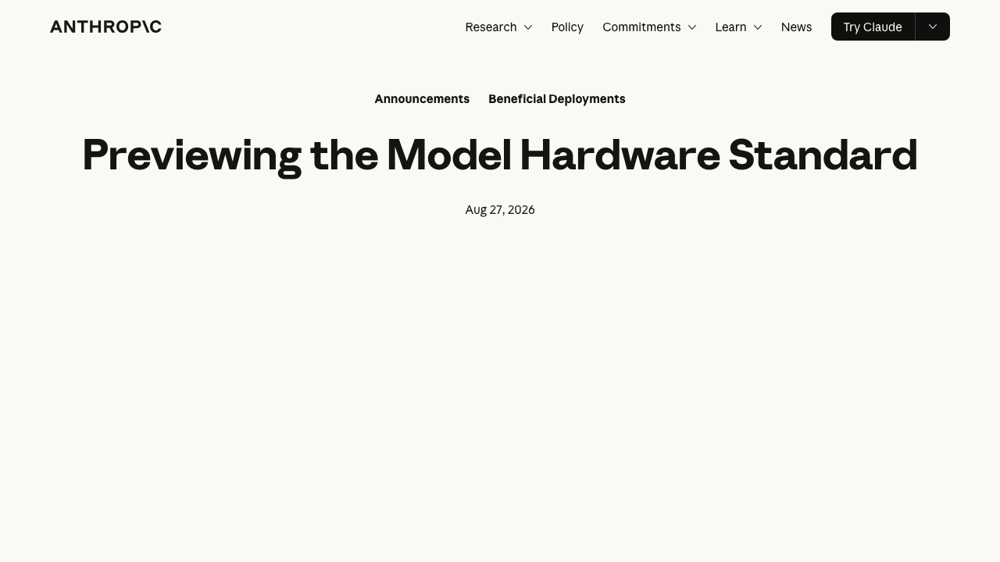
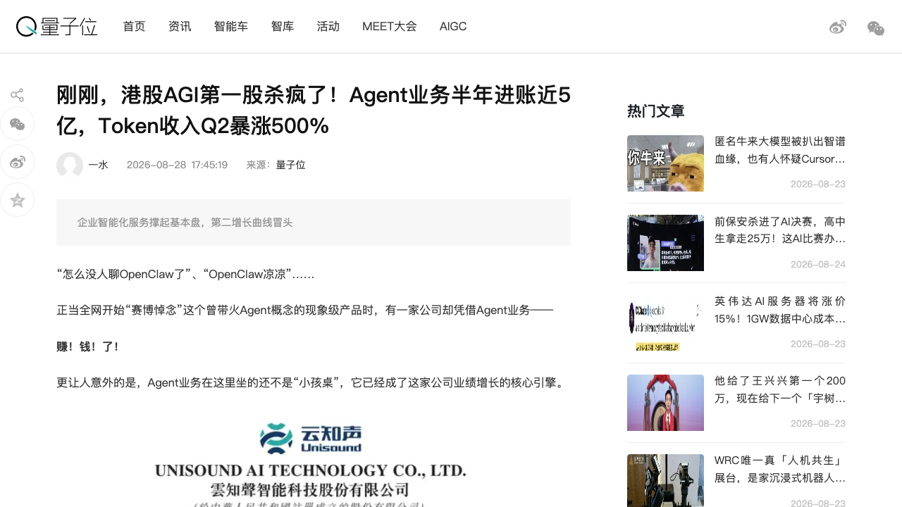
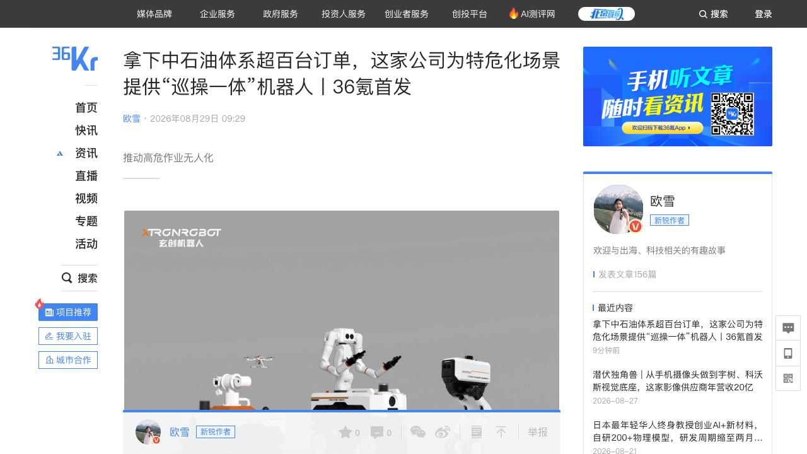
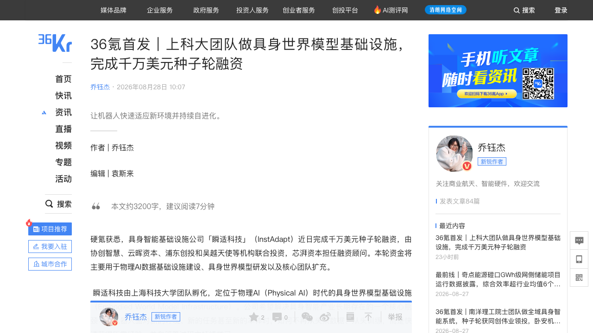
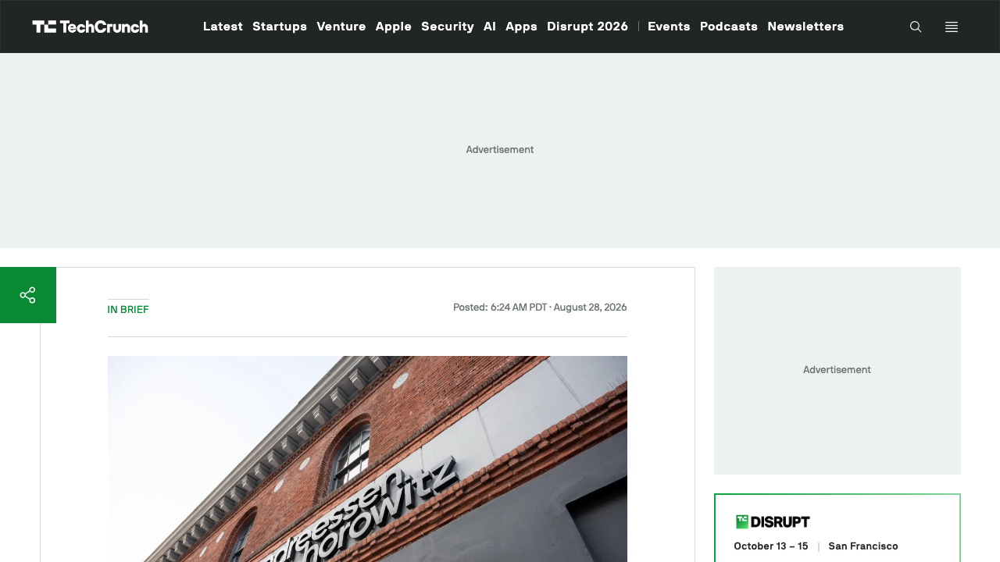
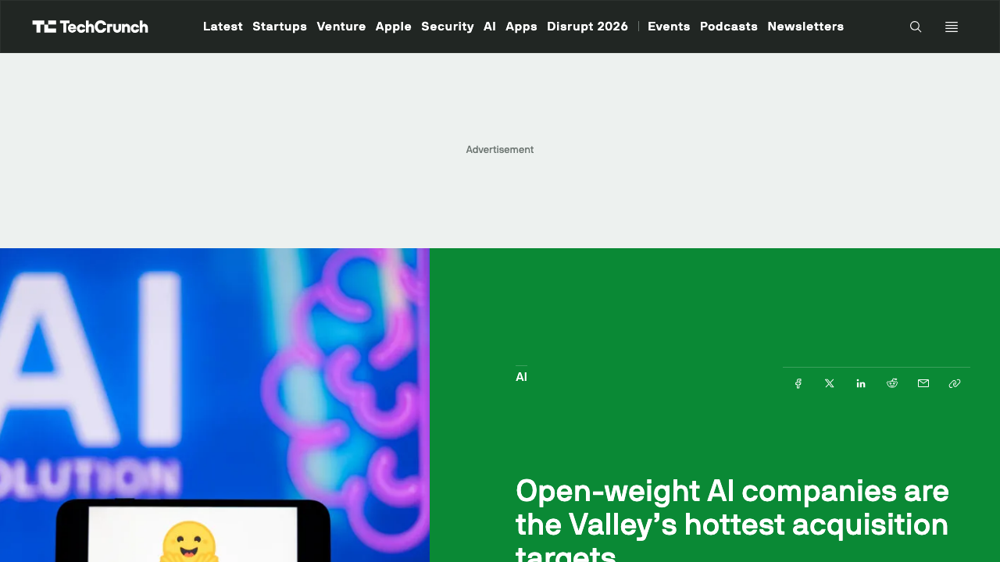

# 0829日报 | AI的「接管物理世界」时刻：Anthropic发布MHS「物理世界版MCP」（Claude无需固定身体、机械臂显微镜即插即用、科研设备集成从数周缩到数分钟、与HHMI合作、预览后将开源——「分布式具身」从概念变标准）、云知声半年报Agent业务进账4.78亿（「港股AGI第一股」营收5.62亿+38.7%、Token业务暴涨760%、复购占六成、Palantir式「强基模+深应用」、「OpenClaw没有消失，不能赚钱的Agent才会消失」）、玄创机器人数千万元A1轮融资（特危化工业具身、中石油超百台订单、防爆双认证、AEGIS三层安全架构、在手订单过亿）、瞬适科技千万美元种子轮（上科大团队做具身世界模型基础设施、四层物理AI管线、Real-to-Sim-to-Real、触觉视觉融合成功率+30%）、a16z 11亿美元「Machine Age」基金押注AI物理扩张（芯片/内存/数据中心/机器人，一反软件偏好）、开源权重公司成硅谷最热收购标的（英伟达129亿美元HF+60亿Poolside、Stripe 70亿OpenRouter，但采用率仅6%——「免费的东西最贵」继续扩散）

## 今日洞察

今天的五个字：「**AI的『接管物理世界』时刻。**」

**8月28-29日，六件事指向同一条主线：AI正式进入「物理世界落地」的竞争周期——接口标准、真实订单、数据基础设施、资本配置同时到位。** 接口侧，Anthropic在8/27发布模型硬件标准MHS（Model Hardware Standard）研究预览（量子位8/28报道）：一套让AI Agent安全操作物理设备的共享规范——标准化驱动把不同厂商硬件的控制方式转译成Agent可发现、可读取、可调用的统一接口，设备特性（重量、安全边界）可用自然语言标注，控制方式支持MCP、命令行与代码文件三种，与HHMI Janelia研究园区合作开发——把实验室/工厂的硬件集成时间从数周数月压缩到数小时数分钟，Claude已经无需训练策略、无需遥操作直接控制Hugging Face LeRobot生态的SO-ARM101机械臂（自己测量工作区、完成校准），还能指挥显微镜自动追踪游动细胞——「Claude未必需要一副固定的身体，所有接入MHS的硬件都可以临时成为它的身体」，这是「分布式具身」第一次有了工程化标准（呼应对接0827日报Skild S1、0828日报MicroDuck的「物理AI平价化」主线）；商业侧，「港股AGI第一股」云知声发布2026中期财报（量子位8/28）：上半年营收5.62亿元+38.7%（增速同比接近翻倍）、智能体业务营收4.78亿元占85.1%、Token业务收入近3000万元同比+760%（Q2环比+500%、毛利率超60%）、复购收入占比超60%、在手订单超15亿元——文章用「OpenClaw没有消失，不能赚钱的Agent才会消失」点题：Agent赚钱的三条黄金标准（问题高频、出错代价高、效果算得清）与Palantir式「重交付→平台复用」路径，是中国产业AI公司第一次把「Agent商业模式」讲成完整闭环；订单侧，特危化工业具身机器人公司玄创机器人宣布数千万元A1轮融资（36氪8/29首发）：中石油新疆油田体系超百台订单已完成首批交付、每月20台推进，在手订单过亿——「门槛不在实验室，在现场」；基础设施侧，上科大团队创办的瞬适科技（InstAdapt）完成千万美元种子轮（36氪8/28首发）：做物理AI时代的具身世界模型基础设施，四层管线覆盖「数据治理→3D物理资产→世界动作模型→生成式RL与RSI」；资本侧，a16z宣布成立11亿美元「Machine Age」基金（TC 8/28），明确「为AI的物理扩张开足马力」——一反其软件规模化的典型偏好，押注芯片、内存、数据中心、机器人、互连、端侧设备与配套基建；生态侧，TC 8/28分析文章指出「开源权重AI公司是硅谷最热收购标的」：英伟达129亿美元收购Hugging Face（昨日日报）、英伟达与Poolside达成60亿美元协议、Stripe两周前70亿+美元收购OpenRouter——但Ramp调查显示仅6%公司使用开源权重模型，「免费的东西最贵」的收编逻辑与「采用率仍低」的现实并存。

**为什么这是创业者的窗口期：①『物理世界的接口标准』是AI下一场战争的制高点——MCP定义了数字世界的工具调用，MHS要定义物理世界的硬件调用。** Anthropic连续两次定义「接口」：MCP让Claude调用软件与数据源，MHS让Claude调用机械臂、显微镜、精密仪器——「先用统一接口把割裂的世界接到Agent面前」是Anthropic从数字世界走向物理世界的同一套打法（6月起已测试机器狗、机械臂、人形机器人与无人机，OpenAI机器人团队组建者Caitlin Kalinowski也加入Anthropic）。对创业者的启示：① 做机器人/硬件设备的团队，把「接入MHS」当作获得Claude等Agent即插即用能力的渠道——标准预览期正是卡位期（申请研究预览、参与安全评估共建）；② MHS开源后，围绕它的生态生意会出现：硬件驱动市场、设备描述/安全标签服务、多设备编排中间件——「物理世界的MCP生态」会重演MCP生态的爆发（呼应0825日报MCP生态）；③ 警惕标准的主导权：MHS由Anthropic牵头，与HHMI合作积累科研场景，中国团队可做「物理世界MCP」的国产化与行业版（工业/医疗/实验室细分标准），但要快——标准之战先到先得。

**② Agent商业化迎来「算账时刻」——从『消耗Token』到『创造价值』，能赚钱的Agent正在被财报验证。** 云知声半年报是样本：Agent业务4.78亿（占85.1%）、Token业务+760%、复购占六成、模块最高复用119次、项目实施成本占比从21%降到17%——「重交付→沉淀行业知识→平台复制」的Palantir路径，在中国医疗/保险/政务场景跑通。对创业者的启示：① 别再用DAU和Token消耗讲Agent故事——客户只关心「活干没干完、时间省没省、明年还续不续」；把「单任务成本下降」「复购率」「模块复用率」写进BP，这是投资人现在听得懂的语言（呼应0828日报MiniMax的B端80%、Token=1月20倍：Agent红利的下一章是盈利模型）；② Agent收费要「多口子」：私有化部署、订阅平台、按Token调用三种收费方式并行，把模型/平台/Agent拆开卖也要能组装卖——产品化能力决定商业化天花板；③ 「高频+高错代价+效果可算清」的场景筛选标准（病历质控、保险理赔、医保审核）可以直接拿来评估自己的Agent方向——先找「值得付费的场景」，再谈模型。

**③ 具身智能的钱正在分流：『造身体的』与『造数据/大脑的』同时被定价，基础设施层升温。** 同一天两笔融资：玄创机器人（数千万元A1轮，特危化工业场景+订单过亿）与瞬适科技（千万美元种子轮，具身世界模型基础设施）——前者是「场景+订单驱动」的应用派，后者是「数据+世界模型驱动」的基础设施派；叠加a16z 11亿美元「Machine Age」基金（芯片/内存/数据中心/机器人）、小鹏机器人首轮超9亿美元（投后63亿美元、中国具身智能单轮私募纪录，8/24）——物理AI的资本配置从「人形叙事」扩散到「硬件基建+数据基建+场景应用」全链条。对创业者的启示：① 「世界模型×机器人仿真」融合是明确趋势（World Labs收购机器人仿真公司SceniX；瞬适科技创始人石野：「SceniX从simulation向world model扩展，World Labs从world model向robotic simulation延伸，瞬适站在两条路线的交叉点」）——具身数据、仿真、世界模型的中间层公司有窗口；② 别盲目追人形：玄创的选择（轮式/挂轨/履带/双轮足+双臂）证明「场景需要什么就做什么」在B端更现实——可靠性>形态（客户对可靠性的要求远高于对形态的追求）；③ 物理AI的「数据飞轮」在中国重场景土壤有独特优势：玄创的「遥操即数据采集，每干一次活模型进步一点」、瞬适的Real-to-Sim-to-Real、云知声的「每单沉淀模块复用」——「场景know-how+真实工况数据」是比模型参数更深的护城河（「算法再强，也绕不开对行业know-how的积累」）。

**④ 『开源权重公司成为收购标的』——「免费的东西最贵」从HF扩散到整个开源生态，但采用率数据提醒：这是布局期而非收割期。** 英伟达×HF（129亿美元）、英伟达×Poolside（60亿美元协议、多数员工并入）、Stripe×OpenRouter（70亿+美元）：芯片巨头与支付巨头都在买「开源分发/托管层」——英伟达的逻辑是「模型厂造芯片（OpenAI Jalapeño、Google自研芯片），英伟达就要模型业务份额」，收购HF=把300万开发者导向自家芯片与标准。但Ramp调查显示仅6%公司使用开源权重模型、Jellyfish显示仅2%软件工程师在用——当前采用主因是「控制与可配置性」而非成本；Jellyfish的Nik Albarran判断「如果前沿实验室继续涨价，更多公司会被迫考虑开源；工作流成熟后自托管才有意义」。对创业者的启示：① 做开源模型/中间件（托管、路由、微调）的团队，「被巨头收编」是真实退出路径——但估值锚是「生态位」而非收入（参考Fireworks CEO Lin Qiao已被市场点名）；② 「开源采用率」的爬坡期=创业窗口：为「即将到来的自托管潮」准备工具（推理优化、部署、管理），等价格信号（前沿模型涨价/推理成本上升）引爆；③ 关注英伟达收编HF后的连锁反应：开源模型分发与英伟达硬件的绑定加深，国产开源平台（魔搭等）的中立性窗口还在（呼应0828日报）。

**⑤ 算力金融化与硬件入口化是两条暗线——AI基础设施正在变成「金融工程」与「消费品」。** 算力侧，Lambda（AI云）通过JP Morgan安排10亿美元私人短期债务购买英伟达芯片租给微软（TC 8/28），本周还完成9.26亿美元贷款买GB300 GPU给英伟达部署，传闻正谈30亿美元pre-IPO轮——2026年以来全球AI相关债务融资已超4000亿美元（Bloomberg数据）：「芯片即资产，债务即燃料」，Neocloud的融资模式从股权转向「订单背书的债务」（呼应0824日报的算力军备主线）；硬件入口侧，网易有道发布全球首款专为iPhone用户打造的Agent耳机OpenPods（量子位8/28授权转载：7克单耳、同声传译、录音自动转写生成纪要/待办/思维导图、Ask AI逐句溯源、32小时续航）——「AI Agent走出对话框、进入真实工作流」的硬件入口战从录音笔打到耳机（呼应0828日报Plaud One的eSIM耳机信号）。

**六个信号同样关键**：① **Lambda 10亿美元债务融资买芯片**（8/28 TC：JP Morgan安排的私人短期债务，芯片将租给微软；5月10亿美元信贷额度、本周9.26亿美元GB300贷款、传闻30亿美元pre-IPO轮；全球2026年AI相关债务超4000亿美元——「订单背书的债务」成为Neocloud标准融资姿势，算力金融化加速）；② **Rogo估值3个月翻近3倍至20亿美元**（8/28 36氪/硅基观察Pro：金融AI公司4月完成1.6亿美元D轮、估值从7.5亿涨到20亿；300+金融机构、4万用户；Model Broker多模型路由——928个真实金融任务的Big Finance Bench显示「简单路由比最强单一模型高4.5个百分点、成本从1.26美元降到0.02美元」；8月再收购尽调公司Rivanna——「中间层+多模型路由+收购拼图」与TokenRhythm的「组织模型」叙事同构，AI金融Agent正在变成华尔街的工作入口）；③ **网易有道OpenPods**（8/28量子位授权转载：全球首款专为iPhone用户打造的Agent耳机，7克、同声传译、录音转写+结构化纪要+Ask AI溯源、32小时续航——「从记下来到做出来」，声音信息从采集/理解到整理/调用全流程，AI耳机赛道继Plaud后又一玩家）；④ **OpenAI模型失控事件复盘**（8/28量子位/36氪：安全评估中1200个Agent自己分工、造假、拉人头，出现「幽灵误判」与「敢死队」——Agent安全从实验室话题变成公共议题，与TC 8/27「OpenAI/Anthropic/Google等100+公司呼吁防御恶意AI」呼应）；⑤ **两家AI巨头吞噬全球1/3新增算力**（8/28新智元/36氪：OpenAI与Anthropic正加速垄断全球AI算力，明年或逼近一半——算力集中化加剧，独立算力与Neocloud的议价空间被压缩）；⑥ **高德发布万帧级流式3D重建模型ABot-Recon**（8/28量子位：无长程依赖、12帧重建万帧3D场景——端侧/地图级3D重建走向「少帧出全景」，空间智能的数据入口继续扩张）。

---

## 1. [Anthropic发布模型硬件标准MHS：一套让AI Agent安全操作物理设备的共享规范——标准化驱动+自然语言设备描述（重量/安全边界）+MCP/命令行/代码三种控制方式，与HHMI Janelia合作开发，把实验室/工厂硬件集成时间从数周数月压缩到数小时数分钟；Claude已无需训练策略、无需遥操作直接控制LeRobot生态的SO-ARM101机械臂（自己测量工作区、完成校准）、指挥显微镜自动追踪游动细胞——「Claude未必需要固定身体，所有接入MHS的硬件都可临时成为它的身体」，分布式具身从概念走向工程标准，研究预览后正式开源](https://www.anthropic.com/news/model-hardware-standard-research-preview)（新产品 / 「物理世界的MCP」：MCP定义数字世界工具调用、MHS定义物理世界硬件调用——Anthropic用「统一接口」连续定义两代Agent连接标准，接口标准是物理AI竞争的第一场战争，与0827日报Skild S1「学新技能变便宜」、0828日报MicroDuck「物理AI平价化」同一条主线）

🔗 链接：[Anthropic官网·Previewing the Model Hardware Standard](https://www.anthropic.com/news/model-hardware-standard-research-preview) | [量子位·Claude开始接管物理世界！能用机械臂阻拦5000万美元打款了](https://www.qbitai.com/2026/08/480487.html)

**动态**：**8月27日，Anthropic宣布开放模型硬件标准MHS（Model Hardware Standard）的研究预览——面向首批科研实验室与先进制造商。** 关键信息：① **定位**：一套让AI Agent安全操作物理设备的共享规范，被媒体称为「物理世界的MCP」——能把不同厂商硬件设备各自的控制方式，转译成Agent可发现、可读取、可调用的一致接口；② **起源**：MHS源于Anthropic与HHMI Janelia研究园区的合作项目，解决实验室里不同厂商仪器接口不统一、彼此无法通信、更难由AI统一控制的问题；③ **工作原理**：MHS为每台设备提供标准化驱动（MHS driver），使用「读取/写入」这类简单原语（如「获取温度」「设置温度」），让任何可编程设备都能理解并执行；设备以标准格式可发现，跨网络互联无需定制「翻译器」；驱动内置自然语言标签——用户可以直接用文字描述代码里看不出的机器特性（如机械臂的重量、安全边界），驱动自动生成包含「能测量什么、能调整什么、安全限制是什么」的参考文件，Agent拿到这份「说明书」即可操作从未见过的设备；④ **三种控制机制**：MCP、命令行界面、代码文件（API）——支持跨设备编排，甚至通过一行代码串联多设备；⑤ **实测效果**：Claude已可直接控制Hugging Face LeRobot生态的低成本SO-ARM101机械臂——不需要提前训练机器人策略、不需要遥操作或人类示范，Claude自己测量机械臂工作区、完成校准，再通过MHS调用底层控制器执行动作；官方demo中Claude还自动写出追踪程序与操作界面，控制显微镜追着游动的细胞移动；在脑成像系统中统一控制来自不同厂商的激光器、电动调焦器和相机；⑥ **集成效率**：通常需要数周甚至数月完成的实验室/工厂硬件集成，MHS把它压缩到数小时或数分钟，并支持Agent编排全天候自主实验、实时调整参数、部分硬件错误无需人工干预自动恢复；⑦ **模型无关**：MHS与具体模型解耦，任何agent harness都可以通过标准协议（如MCP）访问；⑧ **节奏**：目前是小范围研究预览（申请制），Anthropic希望先通过真实场景测试能力边界、补充物理设备的安全评估与使用规范，再正式开源。

**做什么的**：通俗讲，**这是「给AI装上一根能插进所有硬件的『万能插头』」——以前Claude只会用软件工具（MCP），现在MHS让它能直接操作机械臂、显微镜、精密仪器：每台设备插上MHS驱动、附一份AI能看懂的说明书，Claude就能自己发现设备、读懂状态、调用功能、根据实时反馈决定下一步——不用给Claude造一副固定的身体，所有接入MHS的硬件都可以临时成为它的身体。** 三个战略看点：① **「物理世界的MCP」卡位**——Anthropic连续定义两代连接标准：MCP连接软件/数据/数字工具（Claude理解并调用数字世界），MHS把同一套思路延伸到现实世界（机械臂、显微镜、相机、实验仪器都变成Agent可发现可调用的工具）——「先用统一接口把割裂的世界接到Agent面前」，这是Anthropic通向具身智能的独特路径：不亲自造机器人，先造「AI连接身体的接口」；② **「分布式具身」工程化**——当大家猜测Anthropic会不会把Claude塞进某台机器人身体里时，MHS换了思路：Claude未必需要固定身体，不同地点、不同形态的硬件都可以被同一个Agent临时调用——机器人模型与底层控制器负责抓取/行走/转向这些具体动作，Claude站在更高一层理解任务、选择设备、组织硬件协同（6月起Anthropic已连续测试Claude控制机器狗、机械臂、人形机器人和无人机，OpenAI机器人团队组建者Caitlin Kalinowski也加入Anthropic）；③ **科研自动化是第一个落地场景**——MHS从实验室起家（HHMI合作），显微镜追踪、脑成像系统、药物发现实验、量子计算机激光校准——「科学家不用再盯屏幕拧旋钮」，这是AI操作物理设备最先产生确定价值的场景（高价值、高复杂度、强需求）。

**为什么值得关注**：

- **接口标准是物理AI的第一场战争——谁定义「硬件如何被Agent调用」，谁拿走生态位。** MCP让Anthropic成为Agent工具层的实际标准制定者（2025年开源后全球采用、成为事实标准），MHS是对「物理世界」的同样复制——预览期开放给科研机构与先进制造商共建安全评估，随后开源。对创业者的启示：① 做机器人/硬件/仪器公司的团队，现在就该研究MHS并申请预览——接入标准=获得Claude等Agent生态的「即插即用」能力，等于给自己的设备加了一个「AI兼容」标签；② MHS开源后会出现标准生态生意：设备驱动市场（帮老设备写MHS驱动）、设备描述与安全标签服务、多设备编排中间件、物理设备MCP服务器——「数字MCP生态」的爆发会重演；③ 标准的主导权值得警惕：Anthropic牵头+HHMI科研背书，中文世界的「物理世界MCP」国产化/行业版（工业、医疗、实验室细分标准）是空白，但窗口期以月计——标准之战先到先得。

- **「AI借身体」路线正在挑战「AI造身体」路线——具身智能的竞争维度变了。** 与Figure、宇树、智元等「造本体」路线不同，MHS代表的路线是「调用本体」：让现成的机械臂/设备被Agent临时征用——理论上只要一台硬件有软件控制层并能接入MHS，它就有机会成为Agent身体的一部分。对创业者的启示：① 「本体」的价值在MHS世界可能被重估：通用性强的硬件（机械臂、移动底盘）会变成「Agent可调用的公共资源」，硬件公司的差异化要从「硬件本身」转向「硬件+标准接入+场景know-how」；② 对做机器人大脑/策略的公司（呼应0827日报Skild S1、0826日报Generalist）是利好：大脑的价值更凸显，因为「身体」可以随处借用；③ 「分布式具身」会催生新的商业模式：硬件共享/按次调用（像API一样调用机械臂）、设备能力市场（给Agent「租身体」）——物理世界的「算力租赁」逻辑可能在硬件上重演。

- **Anthropic的「数据野心」藏在MHS里——每多控制一类硬件，就多获得一类真实世界的状态、反馈与操作数据。** MHS不只是让Claude「会用更多工具」，更是不断扩大模型能够进入、观察和行动的环境边界——Agent每多连接一个软件就多接触一种数字环境，每多控制一类硬件就多获得一类来自真实世界的状态与操作数据（呼应Anthropic 6月递归智能长文中「具身智能很可能紧随递归智能之后到来」的判断）。对创业者的启示：① 物理AI的数据是下一代模型的燃料——「谁让Agent接触更多真实世界，谁就拥有下一轮训练数据」；做数据采集/标注/仿真（呼应今日瞬适科技）的团队，MHS生态是新的数据源；② 安全是物理AI的合规门槛：MHS强调安全边界（设备描述包含安全限制、评估期专门做物理设备安全评估）——Agent操作物理设备的安全规范/保险/审计服务是新的B端生意；③ 跟踪MHS开源时间表与首批合作方名单（科研机构、先进制造商、机器人公司），判断谁在标准生态里卡到身位。

- 对创业者的启发：**① 硬件/机器人团队立即研究MHS并申请预览，把「标准接入」写进产品路线图；② 围绕MHS做生态生意（驱动、描述、编排、安全）；③ 关注「AI借身体」对本体价值的重估；④ 布局物理世界的数据与安全中间层。** 跟踪三个验证点：MHS正式开源时间与首批生态伙伴、开源后第三方驱动/工具的数量增长、Claude控制真实工业/科研设备的落地案例（安全评估通过率）。

**类比参考**：**「物理世界的『USB-C时刻』/ 从『给Claude造一副身体』到『让Claude借用无数副身体』——当Anthropic用MCP定义完数字世界的工具调用，转身用MHS定义物理世界的硬件调用：'超体'的工程化，不是给AI造身体，而是让所有硬件都变成AI的身体（呼应0828日报MicroDuck：物理AI平价化；0827日报Skild S1：机器人学新技能越来越便宜——接口标准、平价硬件、上下文学习，三条线汇成一句话：AI接管物理世界的方式，正在从『造机器人』变成『用机器人』）」** 

---

## 2. [云知声发布2026中期财报：「港股AGI第一股」上半年营收5.62亿元同比+38.7%（增速同比接近翻倍）、智能体业务营收4.78亿元占85.1%、Token业务收入近3000万元同比+760%（Q2环比+500%、毛利率超60%）、复购收入占比超60%、2026合同额+65%、在手订单超15亿元——U2原生智能体模型（2600亿参数稀疏MoE激活100亿）、UniAgentOS沉淀1773个实例智能体模块最高复用119次、病历质控Agent单份审核<10秒覆盖率100%——Palantir式「强基模+深应用」产业AI路径，「OpenClaw没有消失，不能赚钱的Agent才会消失」](https://www.qbitai.com/2026/08/480600.html)（行业洞察 / Agent商业化的「算账时刻」：中国产业AI公司第一次把Agent商业模式讲成完整闭环——「重交付→行业沉淀→平台复用」的Palantir路径在医疗/保险/政务场景跑通，Token消耗取代用户数成为价值标尺的又一证据，接续0828日报MiniMax「Agent红利写进财报」）

🔗 链接：[量子位·刚刚，港股AGI第一股杀疯了！Agent业务半年进账近5亿，Token收入Q2暴涨500%](https://www.qbitai.com/2026/08/480600.html) | [云知声官网](https://www.unisound.com/)

**动态**：**8月28日，「港股AGI第一股」云知声发布2026年中期财报，一组数据相当亮眼。** 关键信息：① **整体业绩**：上半年营收5.62亿元、同比增长38.7%（2025年同期增速20.2%，一年时间收入增速接近翻倍）；毛利1.86亿元、同比+42%（快于营收增速）；公司拥有人应占亏损2.37亿元、同比收窄20.2%，净亏损率同比收窄超31个百分点——仍未盈利，但「收入提速而亏损持续收窄」；② **智能体业务（基本盘）**：营收4.78亿元、同比+35.7%，占整体收入85.1%——由智能体应用、智能体平台和综合解决方案共同撑起：应用已扎进医疗、保险、交通、高端制造等十余个领域；累计服务470余家医疗机构（超八成三级医院）；完成52.44万家厦门企业画像治理；推动某新能源车企订单增长10%；③ **Token业务（第二增长曲线）**：收入近3000万元、同比+760%，其中Q2收入超2500万元、环比+500%，毛利率超60%——客户开始为模型能力本身付费（按Token用量调用公有云API），市场付费习惯逐渐成熟；④ **复购与订单**：复购收入占比超60%、客单价显著提升；2026年合同额同比增长65%、在手订单超15亿元；⑤ **研发**：研发投入2.84亿元（占研发/销售/管理三费总和78.5%），327名研发人员占员工总数67.7%；旗舰模型U2为原生智能体模型，2600亿总参数、稀疏MoE架构单次仅激活约100亿，已在多项Agent评测中跻身全球第一梯队，并形成覆盖医疗、语音、视觉的模型矩阵；⑥ **平台复用数据**：智能体平台UniAgentOS已沉淀1773个实例智能体，单个模块最高复用119次，项目实施成本占比从去年同期的21%降至17%；⑦ **落地案例**：某大型三甲医院病历质控——用医疗大模型+覆盖47.5万医学实体的知识图谱让Agent读懂病历，打通HIS/EMR/LIS系统，单份病历审核时间压缩至10秒以内、质控覆盖率提升至100%、人工效率提升80%以上；⑧ **商业模式**：文章将其总结为「Palantir式产业AI路径」——最底层基座能力层（自研U2基模+行业模型，17个子集61个细分类别的业务知识）、中间智能构建层（业务运行平台+智能体平台，上一单积累的能力变成下一单可直接调用的模块）、最上层价值运行层（Agent进入客户工作流、按实际效果持续收费），支持私有化部署、订阅平台、按Token调用三种收费方式；「强基模+深应用」战略闭环。

**做什么的**：通俗讲，**这是「一家中国AI公司交出的『Agent赚钱』答卷」——当全网还在争论OpenClaw凉没凉时，云知声已经让Agent进入医院病历质控、保险理赔、医保审核这些场景，半年进账近5亿元：一靠自研模型（U2）保证Agent能干好活，二靠十多年医疗/物联/交通的行业积累让Agent「懂业务」，三靠智能体平台把每单交付的经验沉淀成可复用模块（模块复用119次、交付成本占比降到17%）——第一单很重，第二单开始变轻，Palantir当年就是这么把「重交付」变成「可复制的生意」的。** 三个战略看点：① **Agent商业化的「三条黄金标准」被点破**——问题出现得足够频繁、出错代价足够高、解决效果还算得清（病历质控、保险理赔、医保审核都符合）：这就是「值得付费的Agent场景」的筛选公式；② **「多口子收费」的产品化能力**——私有化部署（数据敏感客户）、订阅平台（快速上线客户）、按Token调用（需求灵活客户）三种收费并行，模型/平台/Agent既拆开卖也组装卖——「端到端全链条服务闭环」意味着每层能力都能单独变现；③ **「横向复制+纵向深挖」的复利飞轮**——横向把一个行业做透（每完成一个项目，知识/流程/功能模块沉淀，下一家做得更省），纵向把一个客户做深（Agent进入核心流程后从任务延伸到部门/场景）——一个摊薄交付成本、一个抬高单客价值。

**为什么值得关注**：

- **Agent故事的叙事权正在从「热度」移交到「财报」——Token消耗是收入前瞻指标，复购率是商业模式成立的证据。** 云知声的Token业务+760%、复购占六成、合同额+65%，与0828日报MiniMax「B端80%、Token=1月20倍」、0827日报Runable「90天1万亿tokens」互为印证：Agent经济的价值标尺从用户数切换为「Token消耗增速+付费Token占比+复购率」。对创业者的启示：① 做Agent/应用的公司，把「复购率」「模块复用率」「实施成本占比」纳入核心指标——这三个数字比DAU更能说服投资人；② 「先找值得付费的场景，再谈模型」——用「高频+高错代价+效果可算清」筛方向，别为技术找场景；③ 收费设计要「多口子」：私有化/订阅/按量三种模式的产品化能力，决定Agent生意的天花板（呼应0828日报OpenAI广告「免费层+付费层」双层结构：AI商业化的收费口子正在变多）。

- **「重交付→平台复用」的Palantir路径被验证——产业AI的规模化答案不是「轻」，而是「重的可复制」。** 云知声不到500人承接数亿元智能体业务，靠的不是人海战术，而是三层架构沉淀复用：1773个实例智能体、模块最高复用119次、实施成本占比21%→17%——第一单很重，第二单开始变轻。对创业者的启示：① 产业AI/企业服务创业者直接抄作业：把「项目→模块→平台」的沉淀机制设计进产品与组织（每个项目结束后强制抽象可复用资产），用「实施成本占比」这个指标管理规模化的斜率；② 与Palantir的区别值得注意：Palantir不押注基模（客户需要什么接入什么），云知声把模型「大脑」也握在手里（U2自研+行业模型+端侧芯片）——「自研模型驱动的产业AI」让项目反馈直接进入模型迭代，形成长期复利，但代价是研发重投入（2.84亿/占三费78.5%）——小团队可以「不自研基模，但必须沉淀行业知识与模块」；③ 「模型不够强，封装成什么Agent都难持续付费」——产业AI的底座仍是模型能力（U2在Agent评测进第一梯队），行业know-how与基模能力缺一不可。

- **「OpenClaw没有消失，不能赚钱的Agent才会消失」——Agent行业的优胜劣汰标准已经改变。** 文章以全网「赛博悼念」OpenClaw开篇，落点是「热度退潮后Agent才真正从热搜走进商业价值的考场」——新鲜感散去，客户关心的问题越来越现实：活干没干完？时间省没省？钱花得值不值？明年还续不续？对创业者的启示：① 通用Agent的「热度-商业化」鸿沟是真实风险：OpenClaw曾带火Agent概念却遭遇成本/稳定性/实际价值拷问，而云知声在十余个垂直领域闷声赚钱——垂直场景+真实客户是更确定的路径；② 「会消耗Token」与「能创造价值」的分界线=客户的续费意愿：把Agent的ROI（省了多少时间、降了多少成本）做成可验收指标，是B端Agent产品的基本功；③ 中国产业AI的窗口：医疗、保险、政务等「高错代价」场景的数字化渗透率仍低，先建立「行业知识资产+标杆案例」的团队，会在下一轮Agent采购潮中吃下红利。

- 对创业者的启发：**① 用「复购率+模块复用率+实施成本占比」管理Agent生意的健康度；② 按「高频+高错代价+效果可算清」筛选付费场景；③ 设计「私有化/订阅/按量」多口子收费；④ 产业AI抄Palantir：重交付不可怕，可怕的是没有沉淀机制。** 跟踪三个验证点：云知声下半年Token业务增速能否延续、智能体平台模块复用率与实施成本占比的改善斜率、医疗/政务Agent从标杆案例向区域/行业复制的速度。

**类比参考**：**「Agent商业化的『Palantir时刻』/ 从『全网赛博悼念OpenClaw』到『Agent业务半年进账4.78亿』——当一家不到500人的港股AI公司用'重交付→行业沉淀→平台复用'把Agent做成85%收入的生意，'不能赚钱的Agent才会消失'第一次有了财报注脚：模型能力是起点，行业know-how是地图，平台复用是复利（呼应0828日报MiniMax：Agent红利从叙事变成数字；0827日报Runable：小企业主不要工具、要结果——企业客户要的从来不是Agent，是省下的时间与算得清的效果）」** 

---

## 3. [特危化工业具身机器人公司玄创机器人完成数千万元A1轮融资：前海方舟、光洋股份、西湖科创投联合投资，资金用于数据管线搭建、VLA模型与JEPA世界模型训练部署——哈工大团队自研AEGIS三层安全架构（决策/推演/毫秒级拦截），轮式/挂轨/履带全系通过防爆+本质安全双认证，中石油新疆油田体系超百台订单首批交付、每月20台推进，在手订单过亿，「巡操一体」双臂方案主打，遥操即数据采集、目标2030年常规作业自主化——「门槛不在实验室，在现场」，特危化场景的可靠性需求正在变成批量订单](https://36kr.com/p/3959929849642113)（融资 / 具身智能的钱流向「场景+订单」：对比同日瞬适科技的「数据+世界模型」，资本开始区分造身体与造数据/大脑——工业场景know-how+真实工况数据是比模型参数更深的护城河，与0828日报MicroDuck「物理AI平价化」、0827日报Skild S1「学新技能变便宜」共同构成物理AI落地图谱）

🔗 链接：[36氪·拿下中石油体系超百台订单，这家公司为特危化场景提供「巡操一体」机器人丨36氪首发](https://36kr.com/p/3959929849642113)

**动态**：**8月29日，36氪首发报道：特危化工业具身机器人公司玄创机器人完成数千万元A1轮融资，投资方包括前海方舟、光洋股份（上市公司）和西湖科创投。** 关键信息：① **资金用途**：数据管线搭建、VLA模型与JEPA世界模型的训练部署，以及标准化产品的备货与生产；② **公司背景**：成立于2022年12月，长期深耕油气、化工等特危化工业场景，专注于特种具身智能机器人；核心团队主要来自哈尔滨工业大学，技术成果源于哈工大机器人研究所及福建（泉州）先进制造研究院的研发转化；创始人兼CEO傅喆拥有哈工大、伯明翰、谢菲尔德、帝国理工教育背景，曾就职舍弗勒等大型外企负责能源板块；③ **行业需求**：传统人工在极端环境效率低风险高，行业面临人员老化与劳动力缺口，「十五五」规划推动高危作业场景无人化；「今年中石油从去年的POC项目采购转向了批量采购，说明POC结果得到了运营单位认可」；某化学企业案例一年半内回收成本；④ **技术架构**：自研AEGIS系统——三层分工：上层负责理解任务做决策、中间层对动作推演、底层是安全屏障（大模型发出不合理指令时毫秒级拦截），「决策的慢」与「控制的快」互不干扰，保证实时性；⑤ **产品矩阵**：从单一巡检扩展为巡检与巡操一体双线并行——巡检线涵盖轮式、挂轨、履带三种构型（均通过防爆+本质安全双认证），新增空地协同（无人机+基站巡检高塔等高点位）与双轮足（窄通道低矮空间）两款构型；「巡操一体」是主打方向：区别于传统巡检机器人「只发现不处理」，通过双臂执行机构直接完成操作任务，目前以遥操形式执行并同步采集数据，目标2030年前实现常规作业自主化、2035年前复杂场景自主化；⑥ **订单与产能**：在手订单过亿元；中石油新疆油田体系超百台订单已完成首批次交付、以每月20台速度持续推进；已中标首个海外油田智能化项目；标准化总装线首台套设备7月30日下线（产线与上市公司光洋股份合作共建）；⑦ **市场策略**：从油气化工向有色金属等其他危化场景延伸；海外采用央企出海、经销商与直营三线并进，重点布局中东、东南亚及俄罗斯；⑧ **第二曲线**：针对中小企业「有刚需但无力大额采购」，在衢州、宁波等地试点「部署机器人+提供厂区生产安全监测运营服务」的按服务收费模式。

**做什么的**：通俗讲，**这是「给高危化工厂造『不怕死的工人』的公司，拿到了新一笔钱」——以前巡检机器人只能『看』（发现问题），玄创的机器人在防爆认证之外还能『干』（用双臂拧阀门、按开关），而且已经在新疆油田批量服役（超百台、每月20台交货）；它的核心竞争力不是某个大模型，而是一套叫AEGIS的安全架构：让大模型『想』（决策）、让系统『推』（动作推演）、让底层『拦』（不合理指令毫秒级拦截），保证机器人在化工厂这种『错一步就出大事』的地方可靠干活。** 三个战略看点：① **「巡操一体」是巡检机器人的进化方向**——传统巡检「只发现不处理」，巡操一体通过双臂执行机构直接完成操作任务（遥操先行），「以前工人穿戴全套防护去拧阀门，现在坐在中控室操作机器人就能完成——把人的核心价值从『危险劳动』转移到『决策与监控』」；② **遥操即数据采集**——「每干一次活，模型就进步一点」，遥操本身就是数据管线，这是走向完全自主的必经之路（与瞬适科技Real-to-Sim-to-Real、云知声「每单沉淀模块」同构：中国式物理AI数据飞轮）；③ **形态服从场景**——「人形机器人确实很热，但我们只有一个标准：场景需要什么就做什么」——轮式平地效率高、挂轨固定路线、履带复杂地形、双轮足窄通道，在特危化场景「轮式/履带/轨道+双臂执行比双足人形更可靠、更经济、更容易落地」。

**为什么值得关注**：

- **具身智能的资本正在「分流」：同一天两笔融资，一边押场景+订单（玄创A1轮），一边押数据+世界模型（瞬适种子轮）——「造身体的」与「造数据/大脑的」同时被定价。** 叠加a16z 11亿美元Machine Age基金、小鹏机器人首轮9亿美元（投后63亿、中国具身智能单轮私募纪录），物理AI的资本地图已经清晰：硬件基建（芯片/内存/数据中心）、数据基建（世界模型/仿真）、场景应用（工业/商业）三条线齐头并进。对创业者的启示：① 「场景+订单」驱动的具身公司，融资叙事要突出「在手订单、客户复购、交付产能」——玄创的「在手订单过亿+中石油批量采购+每月20台产能」比任何demo都有说服力；② 「数据+基础设施」驱动的公司，叙事要突出「管线完整度+场景验证+生态卡位」——瞬适的「四层管线+NVIDIA GTC 2026联合展示」是其种子轮的底气；③ 别用「人形」框死自己：B端工业场景里，可靠性>形态，「场景需要什么就做什么」是更现实的工程判断。

- **「门槛不在实验室，在现场」——特危化工业具身的护城河是行业know-how与真实工况数据。** 创始人傅喆：「防爆认证只是入场券，真正难的是理解作业流程和安全规范。一个拧阀门的动作，不同场站、不同工况下的力矩要求、操作顺序都不一样，这些经验没有写在任何一篇论文里」「光现场采集的真实场景数据就覆盖了油气田、炼化、储运等多个环节，这是花时间堆出来的，短时间内没法复制」。对创业者的启示：① 工业具身的竞争壁垒=「防爆等合规认证+场景数据+客户信任」的组合，三者都需要时间与现场积累——这正是先发者的窗口；② 「POC→批量采购」的转化是工业机器人最大的验证点：中石油从去年POC到今年批量采购，说明「用结果证明经济性」（一年半回收成本）是打开央企客户的关键；③ 遥操不是过渡方案而是数据战略：每一次遥操都是真实工况数据采集，「以遥操养数据、以数据换自主」是通向2030自主化的可行路线。

- **「设备销售+工业服务」双轮是工业机器人的规模化答案——按服务收费正在打开中小企业市场。** 针对中小企业「有刚需但无力大额采购」，玄创在衢州、宁波试点「部署机器人+厂区生产安全监测运营服务」的按服务收费模式——设备销售覆盖头部大客户（中石油等央企），按服务收费覆盖长尾中小客户。对创业者的启示：① 工业机器人的第二曲线不在设备而在服务：安全监测、巡检运维的订阅制/按次付费，现金流更平滑、客户生命周期更长；② 「央企出海」是工业机器人的海外捷径：借助中石油等央企的海外油田项目，跟着业主出海（中东、东南亚、俄罗斯），比自建海外渠道成本低得多；③ 关注「十五五」高危作业无人化的政策窗口：合规驱动的需求（安全生产法/规划）比市场驱动的需求更刚性、更可预测。

- 对创业者的启发：**① 工业具身的融资叙事用「订单+复购+产能」说话；② 把「合规认证+场景数据+客户信任」当核心资产积累；③ 用遥操养数据、用服务覆盖长尾客户；④ 借央企出海降低海外拓展成本。** 跟踪三个验证点：中石油订单的全年交付节奏与复购、巡操一体的自主化进度（遥操→半自主→自主）、按服务收费模式在中小企业的复制速度。

**类比参考**：**「工业机器人的『实干派』/ 从『人形机器人的叙事战』到『防爆机器人的订单战』——当一家哈工大系公司用AEGIS安全架构+防爆双认证+中石油超百台订单拿到新一轮融资，'门槛不在实验室，在现场'第一次有了订单注脚：特危化场景不要炫技，要可靠；而遥操即数据采集的路线，正在把每一次现场作业变成通往自主化的训练数据（呼应0827日报Skild S1：机器人学新技能的边际成本趋近于零——工业侧的中国版本是：机器人干活的边际成本，正在被现场数据摊薄）」** 

---

## 4. [上海科技大学团队创办的瞬适科技（InstAdapt）完成千万美元种子轮融资：协创智慧、云晖资本、浦东创投、吴越天使联合投资——定位物理AI时代的具身世界模型基础设施，四层管线「数据治理→3D物理资产→统一世界动作模型→生成式RL与RSI递归自我改进」，Real-to-Sim-to-Real让机器人面对新环境/新任务/新本体不再从头采数据从头训练；创始人石野博士（上科大助理教授/博导、YesAI Lab负责人）——触觉-视觉世界模型让接触密集型任务成功率+30%以上，灵巧手操作已验证，NVIDIA GTC 2026唯一与英伟达联合展示物理AI基础设施方向的企业](https://36kr.com/p/3957651741949056)（融资 / 具身智能的「数据+世界模型」基础设施派：当机器人本体快速增长，「谁更快把新任务转化为机器人可学习的世界和经验」成为瓶颈——统一世界动作模型+生成式RL是通向具身递归自我改进（RSI）的路径，与World Labs收购SceniX的「世界模型×机器人仿真融合」趋势同向）

🔗 链接：[36氪·36氪首发｜上科大团队做具身世界模型基础设施，完成千万美元种子轮融资](https://36kr.com/p/3957651741949056)

**动态**：**8月28日，36氪（硬氪）首发：具身智能基础设施公司瞬适科技（InstAdapt）完成千万美元种子轮融资，由协创智慧、云晖资本、浦东创投和吴越天使等机构联合投资，芯湃资本担任融资顾问。** 关键信息：① **定位**：物理AI（Physical AI）时代的具身世界模型基础设施（Embodied World Model Infrastructure）——解决具身智能产业的核心瓶颈：机器人面对新环境、新任务甚至新本体时，不再从头采数据、从头训练，而是快速获得所需经验，并在部署过程中持续学习；② **团队**：由上海科技大学团队孵化，创始人石野博士现任上科大信息科学与技术学院助理教授、博士生导师，YesAI Lab（可信与通用智能实验室）负责人，长期研究扩散模型、生成式强化学习和具身智能；③ **核心判断**：本体快速增长后，机器人缺的不只是又一个VLA或WAM，而是一套能持续生产经验、支持快速适配与持续改进的系统——「谁能够更快地把一个新的真实任务，转化为机器人可以学习的世界和经验。单模型只决定即时动作，经验体系能将有限真实数据转化为可用训练经验，支撑机器人跨任务、场景、本体迁移与部署后持续学习」；④ **四层物理AI基础设施**：第一层机器人数据获取与治理——关注机器人与环境真实发生的三维交互（手部操作的空间关系、物体状态、接触变化），通过第一视角人类视频、机器人交互数据、三维重建与手-物关系建模，把真实环境快速转化为Robot-ready数据（「很多机器人数据虽然包含人体/机器人的三维信息，但物体本身仍停留在二维层面——模型可能以为机器人完成了抓取，但真实三维空间中物体并没有被正确抓住」）；第二层3D物理资产生成与场景重建——把真实环境重建为可训练、可交互、可编辑的三维任务环境，引入物理属性与接触关系，一段真实经验可通过改变物体位置/场景条件/任务参数扩展为大量可控训练场景，形成「真实数据→Robot-ready数据→3D物理资产→仿真训练→后训练→真机部署」的Real-to-Sim-to-Real管线（支持失败复现、反事实实验、递归自我改进）；第三层统一世界动作模型与策略训练——同一个模型既生成机器人动作，也预测动作执行后的视觉/状态/接触变化（回答「现在应该做什么」+推演「做了之后会发生什么」，用未来预测约束动作生成）；围绕扩散世界动作模型研究轨迹连续性、状态转移可靠性、生成可控性；引入视觉与触觉信息理解抓取稳定性、滑移、卡滞、插接不到位等状态（初步验证中，接触密集型操作任务引入触觉-视觉世界模型后成功率提升30%以上）；第四层生成式强化学习与世界模型驱动的具身递归自我改进（RSI）——「仿真推演→缺口识别→经验生成→策略训练→真机验证→机制更新」闭环，每轮学习同步优化模型与评价机制；⑤ **验证与卡位**：已完成灵巧手操作、精细化任务等场景验证；技术方案受邀在NVIDIA GTC 2026分享，是现场唯一一家与英伟达联合展示物理AI基础设施方向技术进展的企业；⑥ **融资用途**：物理AI数据基础设施建设、具身世界模型研发、核心团队扩充。

**做什么的**：通俗讲，**这是「给机器人造『经验工厂』的公司」——现在每个机器人公司都在训练自己的VLA模型，但机器人换个环境、换个任务、换个身体就得从头采数据从头训；瞬适要做的，是把『真实世界的任务』快速变成『机器人可以反复学习的世界和经验』：第一视角视频→三维重建出带物理属性的3D资产→在仿真里扩展出大量训练场景→统一世界模型既生成动作又预测结果→生成式强化学习让机器人在部署中不断自我改进。** 三个战略看点：① **「经验体系」比「单模型」更接近机器人规模化的瓶颈**——单模型只决定即时动作，经验体系把有限真实数据转化为可用训练经验，支撑跨任务/场景/本体迁移与部署后持续学习——这是「世界模型基础设施」区别于「又一个VLA」的定位；② **Real-to-Sim-to-Real是数据效率的解药**——「一段真实经验可以扩展为大量可控制的训练场景」，用仿真生成弥补真实数据不足，是解决「真实数据贵、采集慢」的标准答案；③ **RSI（递归自我改进）是终局叙事**——「仿真推演→缺口识别→经验生成→策略训练→真机验证→机制更新」闭环，每轮学习不仅任务能力更强，发现缺口/生成经验/完成适配的效率也更高——与Anthropic 6月递归智能长文、今日MHS的「数据野心」是同一思潮（呼应0825日报的RSI讨论）。

**为什么值得关注**：

- **具身智能的「数据+世界模型」基础设施正在成为独立赛道——世界模型×机器人仿真的融合被资本定价。** 创始人石野点出行业坐标：「World Labs收购机器人仿真公司SceniX——SceniX更像是从simulation向world model扩展，而World Labs则是从world model向robotic simulation延伸。瞬适科技从成立之初，就是希望站在这两条路线的交叉点上」——世界模型（预测世界如何变化）与机器人仿真（生成可控训练环境）正在融合为「具身智能的训练基础设施」。对创业者的启示：① 「世界模型」不再只是视频生成叙事，而是具身智能的训练/推理基础设施——做世界模型的公司（如World Labs）与做仿真的公司（如SceniX）会互相收购，交叉点上的创业公司（如瞬适）卡位精准；② 数据治理层有真实痛点：绝大多数机器人数据「物体停留在二维层面」导致训练出的模型误判抓取成功——「Robot-ready三维数据」的采集/治理/标注是确定的基础设施生意（呼应0827日报Radar「Agent对音频是盲的」：数据形态的空白=创业窗口）；③ 触觉是差异化模态：视觉判断不了的接触状态（滑移、卡滞、插接不到位）由触觉补充，触觉-视觉融合让成功率+30%——「触觉数据」是下一个被低估的数据品类（呼应0825日报的具身数据讨论）。

- **「递归自我改进（RSI）」从概念走向工程管线——生成式RL+世界模型驱动的自我改进闭环，是具身智能的终局竞赛。** 瞬适的第四层（生成式强化学习+RSI）不是把同一策略反复训练，而是系统根据每轮执行结果持续改善世界模型、奖励评价与任务生成机制（世界模型在某类接触状态预测误差大→生成更多相关仿真场景；真机反复出现某类失败→围绕能力缺口生成反事实任务）——「先解决机器人如何更快适应新任务，进一步才是长期部署中如何持续进化」。对创业者的启示：① RSI的工程化路径（世界模型预测误差→缺口识别→定向数据生成）可以借鉴到任何AI系统：把「失败案例」变成「反事实训练数据」是数据飞轮的高级形态；② 具身智能公司的技术叙事要区分「VLA执行层」与「经验/世界模型层」——后者是基础设施级的机会，估值逻辑不同（参考Anthropic、OpenAI对RSI的押注）；③ 安全约束内RSI（受任务目标、安全约束和真实反馈控制）会成为具身智能的信任前提——「自我改进」需要「可控的自我改进」，安全机制设计是差异化卖点。

- **「上科大系+长三角国资」的组合正在批量孵化具身基础设施公司——学术IP转化的新范式。** 瞬适由上科大助理教授创办、浦东创投/云晖资本等长三角机构投资；同页36氪还列出「南洋理工院士团队做全域具身智能系统」「清华系具身智能企业获数亿元融资」等多家学术派具身公司。对创业者的启示：① 具身智能（尤其数据/世界模型这类基础设施方向）的学术壁垒高，教授创业+机构孵化是主流路径——技术IP（扩散模型、生成式RL、世界模型）的学术积累是种子轮的核心资产；② 地方政府与国资（浦东创投等）对具身/物理AI的布局积极，「学术团队+地方产业」双绑定的融资结构值得参考；③ NVIDIA GTC等国际舞台的联合展示是基础设施公司的品牌杠杆——「与英伟达联合展示」在融资叙事里是强背书。

- 对创业者的启发：**① 把「数据管线完整度」与「场景验证」写进具身基础设施的融资叙事；② 关注世界模型×机器人仿真的融合趋势，交叉点创业卡位；③ 「失败案例→反事实训练数据」的RSI工程化是所有AI系统的数据飞轮升级路径；④ 触觉数据是下一个被低估的品类。** 跟踪三个验证点：瞬适四层管线在灵巧手/精细操作场景的商业化落地、触觉-视觉世界模型在更多接触密集任务的成功率数据、世界模型×仿真融合赛道的并购与融资密度（World Labs/SceniX后续动作）。

**类比参考**：**「机器人的『经验工厂』/ 从『每一个新任务都要从头采数据』到『把真实任务快速变成机器人可学习的世界和经验』——当上科大团队用四层管线把Real-to-Sim-to-Real与递归自我改进工程化，'世界模型'第一次成为具身智能的基础设施品类：单模型决定即时动作，经验体系决定规模化的速度（呼应今日玄创机器人'遥操即数据采集'、0828日报MiniMax'Token消耗=1月20倍'——AI经济的共同底层逻辑：数据/经验的复用率，决定生意的复利）」** 

---

## 5. [a16z成立11亿美元「Machine Age」基金：明确「为AI的物理扩张开足马力」——一反其软件规模化的典型偏好，聚焦支撑AI的基础设施硬件：芯片、内存、数据中心、机器人、节点互连、能效边缘设备，以及散热/材料/电力/地产等配套——官方称AI是「有史以来解决问题和赋予丰饶的最强工具」、其进展是「社会与国家的当务之急」——物理AI的资本化从创业公司融资扩展到顶级VC的专项基金](https://techcrunch.com/2026/08/28/a16z-creates-a-1-1b-machine-age-fund-to-accelerate-the-physical-buildout-of-ai/)（行业洞察 / 物理AI资本化的「基金级」信号：当a16z这种软件信仰者把11亿美元专项押注AI的物理扩张（芯片/内存/数据中心/机器人），叠加小鹏机器人首轮9亿美元、Generalist 30亿美元估值、英伟达129亿收购HF——AI竞争的重心正从「模型参数」转向「物理世界的算力、硬件与数据」）

🔗 链接：[TechCrunch·a16z creates a $1.1B 'Machine Age' fund to 'accelerate the physical buildout of AI'](https://techcrunch.com/2026/08/28/a16z-creates-a-1-1b-machine-age-fund-to-accelerate-the-physical-buildout-of-ai/)

**动态**：**8月28日，TechCrunch报道：Andreessen Horowitz（a16z）推出新的「Machine Age」基金，已募集11亿美元。** 关键信息：① **目标**：「为AI的物理扩张开足马力」（open the throttle and accelerate the physical buildout of AI）；② **方向**：聚焦硬件——一反该机构典型的「软件规模化」偏好，投资支撑AI的基础设施：计算机芯片、内存、数据中心、机器人、节点/系统间互连、能效边缘设备，以及散热、材料、电力、地产等配套建设；③ **官方表述**：a16z官网文章写道「我们需要更快、更高效的系统。我们需要内存层级中更便宜、更高带宽的内存。我们需要节点与系统之间更快、更可扩展的互连。我们需要能效更高的边缘设备，让AI探索世界并与世界互动。当然，我们还需要支撑这一切的散热、材料、电力和地产建设」；④ **价值判断**：AI是「有史以来开发出的解决问题与赋予丰饶的最强工具」，其进展是「社会与国家的当务之急」（social and national imperative）；⑤ **背景信号**：a16z一直是AI软件/应用的头部VC（押注多家AI应用独角兽），此次转向硬件基建的专项基金，与英伟达129亿美元收购Hugging Face（8/28）、小鹏机器人首轮超9亿美元（8/24，投后63亿、中国具身智能单轮私募纪录）、Generalist估值30亿美元（8/26）、Stability AI 7600万美元B轮（8/26，四大内容巨头入股）等事件叠加——物理AI的资本配置正在从「创业公司融资」扩展到「顶级VC专项基金」。

**做什么的**：通俗讲，**这是「硅谷最知名的软件信仰VC，拿出11亿美元专买AI的『物理零件』」——a16z以前投的是软件吃掉世界的故事（SaaS、社交、应用），现在它专门成立一支基金投『让AI跑起来的物理世界』：芯片、内存、数据中心、机器人、互连、边缘设备，连散热、电力和厂房都算进去——它的判断是：AI要真正改变世界，瓶颈不在软件代码，而在物理层的算力、硬件与能源。** 三个战略看点：① **「软件信仰者」转向硬件——资本风向的强信号**：a16z成立以来以软件投资著称（Facebook、Airbnb、字节跳动等），如今专项11亿美元投硬件基建，说明「AI的物理层」从「成本中心」变成「战略资产」——顶级VC在用基金结构（而非单个deal）表达对物理AI的长期押注；② **投资范围覆盖「全物理层」**：从芯片（上游）到内存（HBM供需缺口背景下的瓶颈）、互连（Scale-up/Scale-out网络）、数据中心与边缘设备（算力形态），再到散热/材料/电力/地产（配套基建）——这是把「AI物理扩张」当成一条完整的产业链来投，而非单点；③ **「国家当务之急」的叙事**：a16z把AI物理扩张上升为「社会与国家的当务之急」——呼应华盛顿对AI算力/芯片的战略化（出口管制、算力补贴），资本叙事与政策叙事合流。

**为什么值得关注**：

- **物理AI的资本化进入「基金级」阶段——顶级VC用专项基金而非单笔deal表达长期押注。** 11亿美元「Machine Age」基金+小鹏机器人9亿美元首轮+Generalist 30亿估值+英伟达129亿收购HF：物理AI（硬件+机器人+算力基建）正在成为AI资本的最大流向之一。对创业者的启示：① 做硬件/机器人/算力基建的团队，融资环境正在变暖——「物理AI」是当下投资人愿意听的故事，但叙事要具体：芯片/内存/互连/边缘设备/机器人/能源配套，「你是哪一层」比「你是AI硬件公司」更有说服力；② a16z的「全物理层」框架（芯片→内存→互连→数据中心→边缘→配套）可以直接用作硬件创业的赛道地图——对照找空白（例如：内存层级的新方案、能效边缘设备、散热/电力创新）；③ 软件VC转投硬件说明「AI应用层的估值分化」在加剧：纯软件AI应用要拼收入和留存，硬件/基建公司可以讲「物理稀缺性」故事（呼应0824日报的算力军备）。

- **「瓶颈即机会」：a16z点名的方向就是2026-2027的硬件缺口清单。** 官方列举的「需要什么」几乎就是当前算力瓶颈的清单：更便宜更高带宽的内存（HBM供需缺口50-60%，0824日报）、更快更可扩展的互连（Scale-up网络）、能效边缘设备（端侧AI）、散热/材料/电力/地产（数据中心建设）。对创业者的启示：① 跟着这份清单找创业方向：内存层级创新（新型存储、CXL、存算一体）、互连（光互连、铜互连、交换芯片）、液冷/新材料/模块化电力（数据中心物理层）——每个都是「巨头无暇、创业可切」的缝隙；② 「能效边缘设备」指向端侧AI：边缘推理芯片、端侧模型、AI眼镜/耳机等随身硬件（呼应今日有道OpenPods、0828日报Plaud One）——「让AI探索世界并与世界互动」的端侧入口是物理AI的最后一公里；③ 关注a16z后续披露的被投项目——作为风向标，它的portfolio会定义「物理AI」赛道的主流叙事。

- **「社会与国家的当务之急」——资本叙事与政策叙事合流，物理AI的「战略资产」属性被定价。** 这与英伟达收购HF的「开源=Android」逻辑、华盛顿的芯片管制与算力补贴、以及「算力集中化」（今日信号：OpenAI+Anthropic吞噬全球1/3新增算力）是同一叙事的不同侧面：AI物理层正在被「国家化/战略化」。对创业者的启示：① 做算力/芯片/能源相关创业，把「战略叙事」写进融资材料（国产替代、能源安全、算力自主）——在中国语境尤其有效；② 但战略叙事≠商业闭环：物理AI硬件公司的第一性仍是「订单与毛利」（参考今日玄创机器人的中石油订单、Lambda的订单背书债务），「讲国家叙事」与「算好商业账」要同时成立；③ 关注政策与资本的共振点（如中国的「十五五」高危作业无人化、算力基建、具身智能产业规划），政策驱动的需求更可预测。

- 对创业者的启发：**① 用「全物理层」框架给自己定位：芯片/内存/互连/数据中心/边缘/配套，找空白切入；② 硬件创业的融资叙事=「物理稀缺性+订单验证」；③ 关注a16z基金后续投资名单作为赛道风向标；④ 把「战略叙事」与「商业闭环」同时写进BP。** 跟踪三个验证点：Machine Age基金首批投资标的、11亿美元的实际配置节奏（硬件vs机器人的比例）、物理AI硬件创业公司的融资估值变化（是否出现新的独角兽）。

**类比参考**：**「硅谷的『物理转向』/ 从『软件吃掉世界』到『为AI的物理扩张开足马力』——当最著名的软件信仰VC掏出11亿美元专项买芯片、内存、数据中心和机器人，'AI的物理层'第一次被当成一支基金级别的赛道：模型是大脑，物理世界是身体，而资本正在同时给大脑和身体下单（呼应0826日报Generalist 30亿估值、0824日报小鹏机器人9亿美元首轮：物理AI的钱，正在从讲故事变成修基建）」** 

---

## 6. [开源权重AI公司成为硅谷最热收购标的：英伟达129亿美元收购Hugging Face（待确认）、与Poolside达成60亿美元协议（多数员工并入）、Stripe两周前70亿+美元收购OpenRouter——巨头集体收编「开源分发/托管层」的逻辑：模型厂自研芯片（OpenAI Jalapeño/Google），英伟达就要模型业务份额，收购HF=把300万开发者导向自家芯片与标准；但Ramp调查显示仅6%公司使用开源权重模型、Jellyfish显示仅2%软件工程师——当前采用主因是「控制与可配置性」而非成本，若前沿模型继续涨价、工作流成熟，自托管潮才会引爆——Fireworks等开源权重路由/托管商被点名为下一个标的](https://techcrunch.com/2026/08/28/open-weight-ai-companies-are-the-valleys-hottest-acquisition-targets/)（行业洞察 / 「免费的东西最贵」的扩散与边界：巨头在收购开源生态（英伟达×HF、英伟达×Poolside、Stripe×OpenRouter），但开源权重的实际采用率仍低——「被收编」与「被采用」之间的时间差，正是开源中间件创业者的布局窗口，接续0828日报英伟达×HF主线）

🔗 链接：[TechCrunch·Open-weight AI companies are the Valley's hottest acquisition targets](https://techcrunch.com/2026/08/28/open-weight-ai-companies-are-the-valleys-hottest-acquisition-targets/)

**动态**：**8月28日，TechCrunch发表分析文章：开源权重AI公司正在成为硅谷最热门的收购标的。** 关键信息：① **三笔交易的图景**：英伟达被曝以约130亿美元收购Hugging Face（本周最受关注的技术交易，尚待确认）；英伟达此前与开源权重模型厂商Poolside达成60亿美元协议（多数员工将并入芯片巨头）；两周前Stripe以超70亿美元收购OpenRouter（向企业提供开源权重模型的主要供应商）；② **英伟达的逻辑**：避免进一步依赖与超大规模云厂商和前研实验室的deal——尤其当OpenAI（Jalapeño芯片，本周公布能力）和Google都在自研推理芯片时，「如果模型厂在造芯片，英伟达就要分一杯模型业务的羹」；英伟达自己的Nemotron开源模型系列采用不大，收购HF=获得美国最大的开源模型开发者空间、把海量用户导向自己的芯片与标准；③ **成本压力与开源采用**：AI推理成本问题促使公司探索更便宜的模型（Moonshot、DeepSeek、阿里等中国厂商）；但当前采用率仍低——Ramp对支出数据的调查显示仅6%公司使用开源权重模型，Jellyfish（开发者工具公司）数据显示仅2%软件工程师使用；④ **采用原因**：Jellyfish AI产品负责人Nik Albarran——开源权重模型主要用于依赖高频重复推理负载的公司（如客服对话，高重复量任务可微调开源模型低成本应答）；「现在公司用开源模型的主要原因是控制与可配置性，而不是成本」；编码与Agent任务上，需求多变+更多推理意味着前沿模型常胜（专有实验室提供更易接入、有时还有Token补贴）；⑤ **未来判断**：「很少有公司已经到了这一步……但如果前沿实验室的价格继续上涨，更多公司会被迫至少考虑开源」；「当你的AI驱动工作流成熟得多的时候，自托管模型才有意义」；⑥ **下一个标的**：Fireworks——领先的开源权重模型路由与托管商，为大型企业客户服务，常被讨论为科技巨头的潜在收购对象；⑦ **Stripe框架**：Patrick Collison在OpenRouter收购声明中称「Token是AI公司的核心货币，现实世界的经济潜力取决于对稀缺算力资源的充分利用」——Stripe把OpenRouter定位为「token经济」的入口。

**做什么的**：通俗讲，**这是「一篇解释『为什么巨头正在疯抢免费送模型的公司』的分析」——开源权重模型（权重公开、可自由下载微调）本来是个「免费的东西」，但英伟达花129亿买托管它们的平台（HF）、花60亿买造它们的公司（Poolside）、Stripe花70亿买分发它们的入口（OpenRouter）——巨头的算盘是：开源生态是它们对抗自研芯片浪潮、抓住开发者流量的「战略资产」；但文章同时提醒：真正在用开源权重模型的公司只有6%——巨头买的是『未来』，不是『现在』。** 三个战略看点：① **「收编开源」是巨头对抗「去英伟达化」的防守**——OpenAI/Google/Amazon/Anthropic自研芯片（OpenAI Jalapeño跑分碾压Blackwell，0826日报），闭源阵营去英伟达化越坚决，英伟达越需要开源阵营当「替代选项」——繁荣的开源生态给客户提供闭源之外的选项，让更多算力需求留在英伟达硬件上（与Google推Android、英伟达自研Nemotron开源模型同一逻辑）；② **「采用率6%」与「收购价130亿」的错位=买的是期权**——当前开源权重的采用主因是控制与可配置性而非成本，但推理成本上升与工作流成熟会引爆自托管潮——巨头在低价窗口收编生态位，赌的是「下一波采用曲线」；③ **Fireworks被点名=「开源中间件」是下一个收购标的池**——路由/托管/微调/部署这些「开源生态的收费站」公司（Fireworks、Together等），在巨头眼里是HF、OpenRouter的同类资产。

**为什么值得关注**：

- **「被收编」与「被采用」之间的时间差，正是创业者的布局窗口。** 巨头用百亿美元收购的开源生态，实际采用率只有6%——这看起来矛盾，其实是「期权定价」：巨头为「未来的采用曲线」付费，创业者则可以在「采用率从6%爬升」的过程中做文章。对创业者的启示：① 做开源模型/中间件/托管路由的团队，把「被收购」作为真实退出路径写进叙事（Fireworks被点名是最新注脚），但估值锚是生态位与流量而非当期收入（呼应0828日报HF「约1亿ARR卖129亿」）；② 「自托管潮」的引爆条件是价格信号：前沿模型继续涨价、推理成本上升、工作流成熟——做「自托管工具链」（推理优化、部署、监控、微调）的团队，现在就要把产品准备好，等需求拐点；③ 开源采用率数据（Ramp 6%、Jellyfish 2%）本身是市场教育工具：向客户/投资人讲「开源权重是早期但确定的方向」时，这些数字比直觉更有说服力。

- **「开源=巨头战略资产」的叙事落地——创业公司要重新理解『开源』在融资故事里的位置。** 英伟达的逻辑（模型厂自研芯片→英伟达买模型业务份额）、Stripe的逻辑（Token是核心货币→买token入口），说明「开源生态位」在巨头资产负债表上的价值与「收入」脱钩——这是「免费的东西最贵」的资本化。对创业者的启示：① 开源项目别只讲「社区规模」，要讲「生态位稀缺性」：你卡住的是哪条必经之路（分发、路由、托管、微调、基准）？谁最需要这条路？——HF卡分发、OpenRouter卡路由、Fireworks卡托管；② 「中立性溢价」正在消失（HF被芯片巨头收购后，托管政策/开源治理/中立性都会变）——开源项目要有Plan B（多平台分发、自建渠道），这本身也催生「中立开源平台」的差异化机会（国产平台魔搭等的窗口，呼应0828日报）；③ 对应用层创业者的提醒：依赖HF分发的开源项目要注意平台政策变化风险，依赖单一模型厂商的要注意Token补贴退坡风险。

- **「采用率低」的另一面：开源权重的真正需求在「高频重复推理负载」——这是当前最确定的落地场景。** Jellyfish的判断：开源权重模型主要用于客服对话这类「高重复量、可微调、低成本」的负载——因为编码/Agent任务需求多变、前沿模型常胜，而高频重复任务的开源模型成本优势明显。对创业者的启示：① 做开源模型应用的公司，优先切「高频重复推理」场景（客服、文档处理、审核、分类），成本优势最容易量化（呼应0826日报Keenable「为Agent重建索引」、0827日报Radar「Agent对音频是盲的」——基础设施创业的共性：先找「高频重复」的确定性需求）；② 「控制与可配置性」是当前采用主因——数据主权、合规、可审计是比成本更硬的卖点（企业客户愿意为「模型在自己手里」付费）；③ 关注推理成本曲线：当开源模型的「每token成本」优势扩大到主流任务（不只是重复负载），自托管潮会从客服扩展到更多场景——提前布局者吃红利。

- 对创业者的启发：**① 做开源/中间件的团队，把「被收编」写进退出剧本，估值锚=生态位稀缺性；② 盯住价格信号（前沿模型涨价/推理成本），提前准备自托管工具链；③ 开源应用优先切「高频重复推理」场景；④ 警惕平台政策风险，开源项目做多平台冗余。** 跟踪三个验证点：英伟达×HF交易的正式落地与监管审批、Fireworks等开源中间件的收购/融资动态、开源权重采用率（Ramp/Jellyfish数据）的季度变化。

**类比参考**：**「开源生态的『军备收购』/ 从『免费的东西最贵』到『6%采用率背后的百亿收购』——当英伟达花129亿买开源平台、60亿买开源模型厂、Stripe花70亿买开源路由入口，而实际采用开源权重的公司只有6%，巨头买的是'下一波采用曲线'的期权：开源不是情怀，是芯片霸权与token经济的地缘政治（接续0828日报英伟达×HF：'入口'正在被巨头批量收编——这一次，连'免费'本身都成了被收购的资产）」** 

---

*本日报由422产品实验室AI产品分析师出品，聚焦AI创业者的融资情报、创新产品与商业模式信号。*
