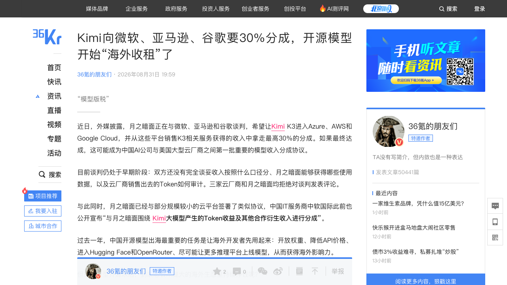
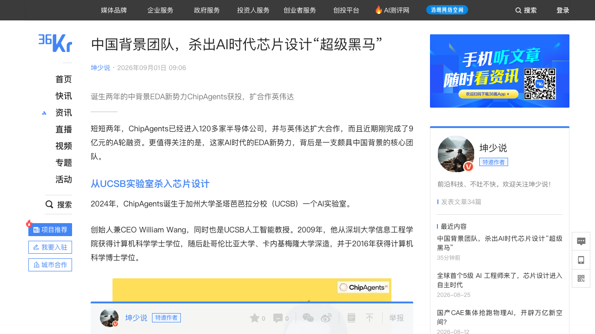
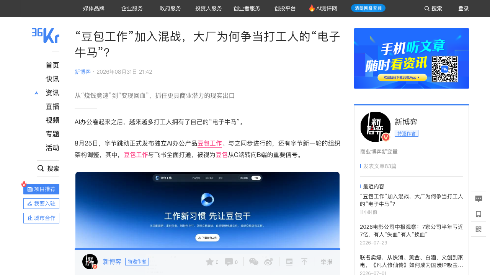
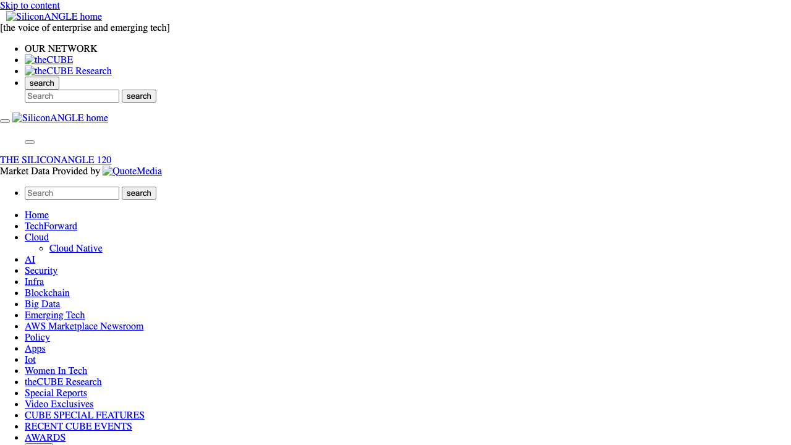
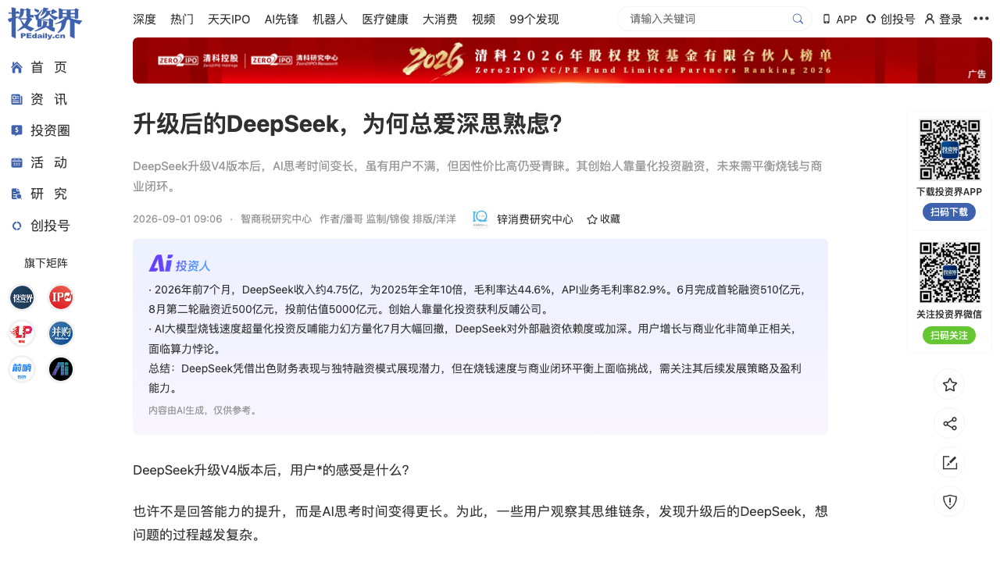
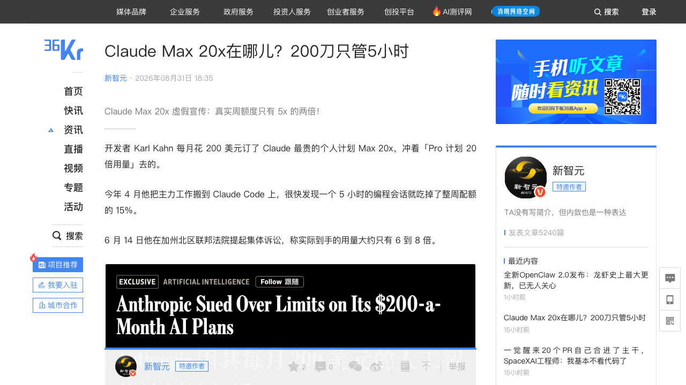

# 0901日报 | AI的「利润分配权」时刻：月之暗面找微软亚马逊谷歌要30%「模型版税」（Kimi K3进三大云、MaaS收入超2000万美元触发商业协议、Together/DigitalOcean等10+平台已托管、Qwen/MiniMax跟进、腾讯Hy4/阶跃/DeepSeek坚持Apache/MIT——「免费扩散、规模收费」vs「免费即武器」）、AI EDA融资双响炮（ChipAgents 9亿元A轮：UCSB教授创业两年进120+半导体公司、自研Renoir接近Claude Opus 4.6成本砍半、扩大英伟达合作；芯流微澜数千万元首轮：浙大团队Agentic EDA跑通10nm近千万门真实项目）、字节「豆包工作」混战AI办公（8/25上线、飞书全面打通、TRAE/扣子并入豆包体系、68/200/500元三档订阅；千问办公/WorkBuddy/库库AI同场竞技、国内AI付费率仅9.8%、IDC预测企业级Agent市场2026年449亿→2029年3320亿）、OpenAI广告业务年化收入破10亿美元（上线约200天、年底目标25亿、扩展40+国家、ChatGPT Go+免费层、50+品牌、总年化收入超400亿、8520亿美元估值IPO前夕）、DeepSeek V4升级「深思熟虑」惹争议（V4 Flash/Pro思考时间暴涨99-201秒、三档思考模式、8月两次调价+峰谷价格、MAU 1.29亿、前7月收入4.75亿=2025全年10倍、6月首轮510亿+8月二轮近500亿投前估值5000亿）、Claude Max 20x被集体诉讼「倍率虚标」（200美元月费实际只有6-8倍、周额度只比5x多2倍、Codex负责人公开对比、3月Claude Code事故烧Token无补偿 vs OpenAI 8月底修8个Bug全量回血——「额度透明化」成标配）

## 今日洞察

今天的五个字：「**AI的『利润分配权』时刻。**」

**8月31日-9月1日，六件事指向同一条主线：AI价值链上的钱正在被重新分配——模型公司开始向渠道收「版税」（月之暗面找三大云要最高30%分成）、向广告收钱（OpenAI广告年化收入破10亿美元）、推理利润率从10-20%跳到50-65%（巴克莱：Anthropic 65% vs OpenAI 48%，每100美元收入有35-40美元流进云厂商口袋）；二级市场开始给Token经济定价（MiniMax股价一个月+92%），用户侧则用集体诉讼撕开了订阅额度黑箱（Claude Max 20x「倍率虚标」）。** 与此同时两条并行主线：AI EDA一天之内两笔融资（ChipAgents 9亿元A轮+芯流微澜数千万元首轮），「用AI设计AI」从口号变成融资赛道；大厂AI办公入口战正式开打（豆包工作+千问办公+WorkBuddy+库库AI），「电子牛马」争夺B端变现的现实出口。

**① 开源模型第一次长出了「版税」——「免费扩散、规模收费」正在改写开源商业模式，License本身成了收入设计。** 月之暗面带着Kimi K3与微软、亚马逊、谷歌谈判：进Azure/AWS/Google Cloud、从平台卖出的K3服务收入中拿走最高30%分成——若达成，这是中国AI公司与美国大型云厂商之间第一批重要模型收入分成协议；K3 License前半段类MIT，但对MaaS企业「连续12个月总收入超2000万美元」设了商业谈判门槛，中小平台（中软国际等）已经签了分成协议；同一条路上还有阿里（Qwen新许可证对大型MaaS和AI Work Assistant业务设商业授权门槛）、MiniMax。另一派坚持「免费即武器」：腾讯Hy4 preview、阶跃Step 3.7 Flash用标准Apache 2.0，DeepSeek V4 pro继续MIT，智谱GLM-5.3的100亿美元门槛更像治理而非收费。对创业者的启示：① 「开源」与「免费」正在解耦——License条款（阈值、分成、审计）就是商业模型本身，做开源先想清楚「规模触发器」；② 依赖开源模型的创业公司要留意授权条款变化（哪天你做到2000万美元，成本结构就变了）；③ 「模型版税」催生新中间层生意：分成审计、Token计费验证、合规工具。

**② 「用AI设计AI」进入订单与融资双验证——Agentic EDA一天两笔融资，高约束场景的工程闭环成为Agent创业的壁垒公式。** ChipAgents完成9亿元A轮（2024年UCSB实验室创立、创始人William Wang深圳大学→CMU、团队中国背景浓厚），两年进入120多家半导体公司、2025年多个头部企业生产部署、单客户扩展到数百工程师，自研模型Renoir可在客户自有基础设施运行、内部基准接近Claude Opus 4.6而成本减半；同日芯流微澜数千万元首轮（浙大研究员孙奇创立、启高资本独家），自研IC设计大模型微澜+工程级长流程控制系统芯流，已在10nm以下近千万门规模真实项目跑通物理设计全流程。芯片复杂度可以无限扩展、工程实践能力却跟不上——「从工具自动化迈向流程智能化」正是AI Agent最擅长的形状。对创业者的启示：① 垂直高约束场景（芯片/材料/生物/工业设计）+真实工具链闭环，是比通用Copilot深得多的护城河；② 数据不出域（IP敏感）+私有化部署+开放权重微调是toB Agent标配；③ 英伟达用Megatron Core/NeMo生态卡位AI EDA——卖铲人的生态战已经打到设计工具链。

**③ 大厂AI从「烧钱竞速」转向「变现回血」，AI办公成为第一个被集体押注的现实出口——而真正的护城河是「数据资产」不是模型。** 字节8/25发布豆包工作并与飞书全面打通、TRAE/扣子并入豆包体系，阿里千问办公公测（8/26 Qwen3.8-Flash首发），百度库库AI月活超2500万，腾讯WorkBuddy桌面月访问超2000万、2.2万个Skill——四家底牌各不相同：飞书的企业数据与组织流程、钉钉的企业协同与Qwen私有化、企微的社交生态、文库网盘的内容资产。背景是残酷的账本：国内生成式AI用户6.02亿但AI应用付费比例仅9.8%，字节2026资本开支上调至2000亿元、腾讯Q2资本开支527.84亿元（自由现金流转负）、阿里3800亿已执行近半——而IDC预测中国企业级Agent市场2026年449亿元、2029年突破3320亿元。对创业者的启示：① 企业级Agent（B端）是比C端付费更确定的变现路径，但别跟大厂拼「上下文层」，找垂直行业的数据与工作流；② 「数据资产+Agent」的估值公式正在被大厂验证——你的产品积累了什么数据，决定它值多少钱；③ 大厂免费/低价抢入口的窗口期，独立工具要用「深度场景+行业know-how」卡位。

**④ AI的商业账本正在被重算：推理利润率跳到50-65%、广告年化10亿美元、云厂商拿走35-40美元——「利润分配权」成为比「模型能力」更关键的竞争维度。** 巴克莱报告：2025年行业推理利润率还只有10-20%，2026年已快速提升到50-65%以上（Anthropic约65%、OpenAI约48%，扣训练成本后55%/38%）——企业客户与Agent成为高毛利消费主力；但每产生100美元收入，约35-40美元流向AWS/Azure/GCP（算力+云软件+分成三笔钱），直到2028年自建基础设施拐点。另一边OpenAI把广告做到年化10亿美元（上线约200天、年底目标25亿、40+国家、ChatGPT Go+免费层），为8520亿美元估值IPO补故事。对创业者的启示：① 「收入口径」（总额法vs净额法）和「单位经济」比ARR更值得看——投资人正在学会不看裸收入；② AI应用层的广告变现被验证，「对话即广告位」是免费产品的出路；③ 理解价值链分配：模型层赚推理利润、云层赚算力钱、应用层赚广告与订阅——你的公司在哪一层、利润从哪来，要想清楚。

**⑤ 订阅额度的「黑箱」被集体诉讼撕开——倍率虚标+消耗不透明+事故不补偿，正在成为AI订阅产品的信任危机与合规风险。** Claude Max 20x（200美元/月、宣传「Pro 20倍」）被开发者告上加州北区联邦法院：实际只有6-8倍——「20倍」标在5小时窗口层，而用户日常被卡的是周额度，那一层Max 20x只比Max 5x多约2倍；OpenAI Codex负责人公开回应「Pro 20x就是Plus的精确20倍、没有5小时窗口」，高下立现。更严重的是Token浪费：3月Claude Code事故（缓存失效致消耗膨胀10-20倍、autocompact死循环全球每天白烧约25万次API调用）用户拿不出数据追偿；OpenAI 8月底同样查出8个Bug却给所有付费用户全额重置额度、逐个公开成因。对创业者的启示：① 把「额度计算口径」写清楚（按周/按窗口/按Token）是信任问题也是法律问题；② Token消耗可视化、可解释是产品标配（呼应0830日报OpenAI额度经济学）；③ 出事故时「公开+补偿」是挽回信任的标准动作——黑箱处理会让用户用脚投票。

**六个信号同样关键**：① **巴克莱给大模型算利润账**（8/31硅基观察Pro：2025年推理利润率10-20%→2026年50-65%，Anthropic 65% vs OpenAI 48%，每100美元收入35-40美元流向云厂商、云厂商营业利润率35-45%，2028年AI实验室自建基建拐点——「AI的商业战争越来越像一场利润分配权的战争」）；② **MiniMax股价盘中飙涨19%报357港元、市值1249亿港元，距7/27低点一个月+92%**（9/1铅笔道：中报收入1.17亿美元+283.1%、B端+703.1%占63.4%首超C端、Token消耗量达1月20倍、8月ARR突破8亿美元、企业客户开发者破200万——二级市场开始给Token经济定价，呼应0828日报MiniMax数据）；③ **燧原科技IPO发行价142.18元/股**（8/31晚披露：预估上市市值约611.87亿元、预计募资61.19亿元、9/2网上网下申购、2025年静态市销率61.80倍低于同行——国产AI芯片IPO再添一员）；④ **海外两笔融资：Blue Voice 600万美元种子轮**（8/31 TC：哈佛法学辍学生David Lawrence做「Harvey for警察」、SignalFire与Las Olas VC领投、225个县机构25个州在用、一年客户增长11倍——「为执法者提供即时法规指引」的垂直Agent）+ **Clipto 1500万美元@2.5亿美元估值**（8/31 TC：AI视频检索、HSG/GL Ventures/EnvisionX等投资、3000万用户、年初ARR 1500万美元且净利为正、两周前接入MCP让ChatGPT/Claude直接搜本地视频——「内容太多不是太少」的检索生意）；⑤ **英伟达35亿美元投资联发科**（8/31 TC/SA：联发科接入NVLink Fusion生态为AI公司与云厂商设计定制芯片、可直插英伟达数据中心；上周刚与AWS达成2百万GPU+NVLink Fusion合作——「客户造自己的芯片，英伟达造放芯片的数据中心」，对撞谷歌TPU/亚马逊Trainium/OpenAI Jalapeño）；⑥ **OpenClaw 2.0发布但「龙虾退潮」**（8/31机器之心/新智元/量子位/SiliconAngle：2026.8.1版本号称史上最大更新——多人协作共享会话、安全重做（信任边界/最小权限/防提示注入）、安装简化；但中文社区反应冷淡：「红过，爱过，散了」「已无人关心」「网友：爱过，我选Hermes」——开源个人Agent框架的兴衰，Harness竞争进入白热化）。

---

## 1. [月之暗面找微软、亚马逊、谷歌要最高30%收入分成：外媒披露Kimi K3正在谈判进入Azure/AWS/Google Cloud——若达成将是中国AI公司与美国大型云厂商之间第一批重要模型收入分成协议；K3 License前半段类MIT、对MaaS企业「连续12个月总收入超2000万美元」设商业谈判门槛；Together AI/Fireworks/DigitalOcean/Modal等10+推理平台已上线K3且多家真正自行承担算力（自己部署2.8万亿参数模型到GPU集群）；中软国际等中小平台已签分成协议；Qwen/MiniMax跟进「规模收费」，腾讯Hy4/阶跃/DeepSeek坚持Apache/MIT——「免费扩散、规模收费」vs「免费即武器」，开源模型的「模型版税」时代来了](https://36kr.com/p/3963330012970116)（行业洞察 / 开源模型的「版税时刻」：开源≠免费——License条款（阈值/分成/审计）成为商业模式本身，「免费扩散、规模收费」vs「免费即武器」两条路线在中国开源模型阵营正式分化，模型厂商从「卖Token」变成「收版税」）

🔗 链接：[36氪·Kimi向微软、亚马逊、谷歌要30%分成，开源模型开始「海外收租」了（腾讯科技）](https://36kr.com/p/3963330012970116) | [36氪·Kimi也要「入关」了？从美国三大云拿到30%的分成，Kimi能如愿吗？（字母榜）](https://36kr.com/p/3963162610734721)

**动态**：**8月31日，36氪报道（外媒披露）：月之暗面正在与微软、亚马逊和谷歌谈判，希望让Kimi K3进入Azure、AWS和Google Cloud，并从这些平台销售K3相关服务获得的收入中拿走最高30%的分成——如果最终达成，这可能成为中国AI公司与美国大型云厂商之间第一批重要的模型收入分成协议。** 关键信息：① **谈判状态**：仍处于早期阶段——双方还没谈妥收入按什么口径分、月之暗面能获得哪些使用数据、云厂商销售出去的Token如何审计；三家云厂商和月之暗面均拒绝评论；② **已落地部分**：月之暗面已与部分规模较小的云平台签署类似协议，中国IT服务商中软国际此前公开宣布「与月之暗面围绕Kimi大模型产生的Token收益及其他合作衍生收入进行分成」；③ **渠道版图**：K3已进入Together AI（7月底宣布战略合作、使用自家美国基础设施「natively serve」）、Fireworks、DigitalOcean、Modal、Baseten、DeepInfra等10家以上推理服务商，其中多家不是API转售而是真正的模型托管——自己拿到K3开放权重、把2.8万亿参数模型部署到自有GPU集群、自担推理成本，Moonshot负责训练、维护品牌、参与技术适配；④ **License设计**：Kimi K3采用自定义License，前半段类MIT宽松授权，但对从事MaaS业务的公司及其关联企业「连续12个月总收入超过2000万美元」要求重新签署商业协议——外媒披露的「最高30%」是月之暗面目前对大型客户提出的具体商业条件之一；⑤ **价格信号**：多家平台销售K3价格异常接近（官方API约每百万Token输入3美元、输出15美元，Together/Modal同价位带）——K3并非被各家完全独立部署销售，而是Moonshot参与技术适配与合作运营的「渠道体系」；⑥ **行业分化**：阿里同样在考虑对大型Qwen商业用户采用收入分成（新许可证对大型MaaS和AI Work Assistant业务设商业授权门槛，AI Coding和办公生产力类独立产品被点名）；MiniMax对达到一定收入规模的商业用户要求重新书面授权；但腾讯Hy4 preview和阶跃星辰Step 3.7 Flash采用标准Apache 2.0、DeepSeek V4 pro继续MIT License（第三方业务做大无需重新授权或分成），智谱GLM-5.3的100亿美元MaaS门槛更像模型治理而非收费。

**做什么的**：通俗讲，**这是「Kimi把『开源』做成了『免费试用、做大收租』——以前开源模型是免费让云厂商随便部署，现在K3带着一份特殊授权协议进场：小公司随便用，但一旦你靠卖Kimi的Token一年赚超过2000万美元，就得回来和月之暗面重新谈钱，最高把30%的收入分给模型方。」** 相当于给开源模型装了一个「规模触发器」：免费不再是无条件的，而是获客手段；真正的商业模式，藏在License条款里。算一笔账：假设全球第三方云一年卖出10亿美元的Kimi服务，按20%分成就是2亿美元收入、按30%则是3亿美元——而且这部分收入不需要月之暗面自己承担全球推理基础设施的投入。

**为什么值得关注**：

- **开源模型的商业模式第一次长出「版税」——「免费扩散、规模收费」正在改写开源经济学。** 过去一年中国开源模型出海的任务是「让海外开发者先用起来」：开放权重、降低API价格、进Hugging Face和OpenRouter。现在月之暗面把问题升级为「模型开源以后怎么持续挣钱」——答案是：把海外使用量变成一种新的收费权，云厂商可以自己买GPU部署Kimi卖推理服务，但生意做大了模型公司也能分钱。对创业者的启示：① 「开源」与「免费」正在解耦，License条款（触发阈值、分成比例、审计机制）就是商业模型本身；② 做开源产品的团队，把「规模触发器」写进License是从第一天就该想的事。

- **License正在成为中国开源模型的商业武器——「收租派」与「免费派」正式分化。** Kimi/Qwen/MiniMax选择「免费扩散、规模收费」，腾讯Hy4/阶跃/DeepSeek选择「免费和宽松许可本身作为最大的竞争武器」——两种路线对开发者生态、云厂商关系、商业化节奏的影响完全不同：收租派拿License换收入但可能吓退部分平台，免费派拿份额换生态但商业化路径更模糊。对创业者的启示：① 选择哪条路线取决于「模型有多难被替代」——今天Kimi性能领先可以开价30%，几个月后如果DeepSeek/混元/Qwen追平且更便宜，议价能力就会下降；② 依赖开源模型的创业公司要重新审视授权条款——「哪天你做到2000万美元，成本结构就变了」。

- **中国开源模型的出海从「卖Token」升级为「建分销网络」——三大云一旦加入，Kimi得到的是从中小推理平台延伸到全球企业云市场的渠道。** 过去模型公司要自己租GPU、建推理集群、向开发者卖Token；现在月之暗面不必自己铺设全球推理网络，就能借云厂商现成的算力和企业渠道进入海外市场——这比「自己卖API」更轻，也把推理成本留给渠道。对创业者的启示：① 「模型托管+收入分成」的渠道模式值得所有模型/技术提供方研究；② 分成审计、Token计费验证、多平台价格管理是新的工具机会（呼应0829日报TokenRhythm「中国版OpenRouter」）。

- 对创业者的启发：**① 开源≠免费，把「规模触发器」写进License；② 依赖开源模型的应用团队关注授权条款变化（2000万美元阈值、AI Work Assistant定义）；③ 「模型版税」催生分成审计/计费验证/合规工具的机会；④ 出海模型公司研究「托管+分成」渠道模型。** 跟踪三个验证点：三大云谈判结果（口径/数据/审计三关）、K3跨平台价格是否维持统一、Qwen新License对AI Coding/办公工具的落地影响。

**类比参考**：**「开源模型的『收租时刻』/ 从『免费扩散抢开发者』到『规模收费收版税』——当月之暗面带着K3 License向AWS/Azure/Google Cloud开出最高30%的分成条件、把MaaS收入2000万美元设成谈判触发器，中国开源模型的出海逻辑第一次从『用免费换份额』变成『用份额换分成』：免费不再是终点，而是获客手段（呼应0828日报『免费的东西最贵』——巨头在收编开源，开源公司也开始向巨头收钱）**

---

## 2. [AI EDA公司ChipAgents完成9亿元A轮融资：2024年诞生于UCSB AI实验室、创始人William Wang（深圳大学本科→CMU博士、UCSB人工智能教授）、团队中国背景浓厚；两年进入120多家半导体公司、2025年多个头部半导体企业大规模生产部署（单客户从试点扩展到数百名工程师）；多智能体系统覆盖RTL设计/验证/调试，从规格说明生成可综合Verilog/SystemVerilog；6月发布自研模型Renoir（开放权重MoE微调、可在客户自有基础设施运行不依赖外部API、内部芯片设计基准接近Claude Opus 4.6、成本降低一半以上）；7月26日宣布扩大与英伟达合作（Megatron Core/NeMo Megatron Bridge/Model Optimizer）——「用AI设计AI」从口号变成订单与融资双验证；同日芯流微澜完成数千万元首轮融资（启高资本独家投资、浙大研究员孙奇创立、自研IC设计大模型微澜Wavelet+工程级长流程控制系统芯流Orbit、已在10nm以下近千万门规模真实项目跑通物理设计全流程）](https://36kr.com/p/3964128883054209)（融资 / Agentic EDA融资潮：芯片设计「从工具自动化迈向流程智能化」被资本密集定价——芯片复杂度可以无限扩展、工程实践能力却跟不上，AI Agent恰好在「高约束场景+真实工具链闭环」上成立；「用AI设计AI」一天两笔融资）

🔗 链接：[36氪·中国背景团队，杀出AI时代芯片设计「超级黑马」（坤少说）](https://36kr.com/p/3964128883054209) | [投资界·芯流微澜完成数千万元首轮融资，浙大教授用AI设计芯片](https://news.pedaily.cn/202609/568371.shtml)

**动态**：**9月1日，36氪报道（坤少说）：AI for IC设计公司ChipAgents近期完成9亿元人民币A轮融资，且刚宣布扩大与英伟达的合作。** 关键信息：① **团队**：2024年诞生于加州大学圣塔芭芭拉分校（UCSB）AI实验室，创始人兼CEO William Wang是UCSB人工智能教授（2009年深圳大学计算机本科、哥伦比亚大学与CMU深造、2016年博士），核心团队中国背景浓厚——全球客户成功负责人Cindy Cui拥有天津大学微电子硕士背景、在半导体与EDA行业工作20多年，研究负责人Kexun Zhang曾在腾讯深圳、微软北京实习；② **体量**：成立两年已进入120多家半导体公司，2025年实现多个头部半导体企业的大规模生产部署，单个客户从试点团队扩展到数百名工程师；③ **产品**：多智能体系统覆盖RTL设计、验证、调试等工作——AI理解设计意图、在RTL和验证环境之间推理、生成并评估设计产物、调用EDA工具、根据反馈持续学习，从规格说明出发生成可综合的Verilog/SystemVerilog和测试平台，而不是只给代码建议；④ **自研模型**：今年6月发布首个自研模型Renoir——基于开放权重的混合专家大模型微调、结合公开半导体数据与公司内部训练数据，覆盖RTL生成、规格理解、调试、测试生成和工具调用；最关键的是可以在客户自己的基础设施中运行、不依赖外部API（芯片设计文件和IP高度敏感，很多企业无法把数据发送到第三方云环境）；内部芯片设计基准测试中接近Claude Opus 4.6的表现、同时成本降低一半以上；⑤ **英伟达生态**：7月26日宣布扩大合作——使用NVIDIA Megatron Core进行大模型训练、NeMo Megatron Bridge支持训练流程和模型格式转换、Model Optimizer进行量化等模型优化；⑥ **同日同赛道**：投资界报道芯流微澜完成数千万元人民币首轮融资（启高资本独家投资）——浙大研究员孙奇创立，自研IC设计大模型微澜（Wavelet，理解网表/布局布线/时序/功耗等专业上下文）+工程级长流程控制系统芯流（Orbit，支持跨工具跨阶段长任务稳定运行、持续学习沉淀资深工程师隐性经验），系统已在10nm以下、近千万门规模的真实项目中跑通物理设计全流程，并支持GAA等先进器件优化；吴汉明院士担任战略顾问。

**做什么的**：通俗讲，**这是「让AI自己设计芯片的公司，一天之内两笔融资」——不是给工程师写代码建议的Copilot，而是能理解设计意图、规划流程、调用真实EDA工具、根据结果反馈持续迭代的智能体：你说出芯片规格，它自己跑完「设计→验证→调试」的闭环。** 行业背景是「芯片复杂度可以无限扩展、工程实践能力却跟不上」——EDA（电子设计自动化）是芯片产业链最上游的基础设施，过去几十年软件越来越强，但到了决定项目能否按时收敛的关键阶段，只能靠人海战术修违例；AI智能体恰好擅长这种「每一步效果都有明确工程指标可验证」的迭代工作。

**为什么值得关注**：

- **Agentic EDA融资潮：一天两笔——「用AI设计AI」从口号变成订单与融资双验证。** ChipAgents 9亿元A轮+芯流微澜数千万元首轮同日落地，加上0830日报Anthropic想买MatX（训练芯片）、0829日报MHS（硬件标准）、今日英伟达35亿美元投联发科——「AI×芯片」的垂直整合正在从芯片制造、训练芯片蔓延到设计工具链。对创业者的启示：① 芯片设计是「高约束场景+可验证工程闭环」的样板——同样的公式可以迁移到材料、生物、工业设计等「复杂系统设计」领域；② 「真实工业工具链跑通」比「概念验证」值钱得多：芯流微澜强调「不同于停留在工具调用或概念验证阶段的同类项目，我们采用的是真实工业工具链」。

- **数据不出域+私有化部署，是toB智能体的通行证。** 半导体设计最有价值的工程知识存在于企业内部的设计文件、调试日志和工具数据中，无法形成公开训练语料；同时IP高度敏感，很多企业无法把数据发到第三方云环境——所以Renoir从第一天就支持在客户自有基础设施运行、不依赖外部API。对创业者的启示：① 面向大客户的Agent产品，「本地化部署+开放权重微调」是绕过数据合规的标配能力；② 「数据困境」本身就是护城河——谁能把客户私有数据安全地用起来，谁就拿到了别人拿不到的语料。

- **英伟达正在把「CUDA生态」打法复制到AI EDA。** Megatron Core、NeMo、Model Optimizer——英伟达给ChipAgents提供的不只是算力，而是一整套模型训练/优化工具链，把AI EDA公司的技术栈绑在自己的生态上（呼应今日英伟达35亿美元投联发科：让客户造自己的芯片，但造芯片的脚手架是英伟达的）。对创业者的启示：① 与芯片巨头合作时注意「生态绑定」与「多供应商冗余」的平衡；② 国产AI EDA/仿真工具链（呼应0830日报松应科技ORCA）的机会在于「国产芯片适配+开源生态」。

- 对创业者的启发：**① 关注「高约束场景+工程闭环」的Agent机会（芯片/材料/生物/工业）；② 把「真实工具链跑通+私有化部署」写进BP核心；③ 研究英伟达生态的绑定与反制；④ 「用AI设计AI」是AGI叙事里最扎实的一支。** 跟踪三个验证点：ChipAgents本轮投资方名单与英伟达合作的落地形态、Renoir在头部客户的生产渗透率、芯流微澜10nm项目向更先进制程的扩展。

**类比参考**：**「芯片设计的『Agent时刻』/ 从『AI辅助EDA』到『AI自主跑通设计闭环』——当一家UCSB实验室走出来的中国背景团队用两年时间拿下9亿元A轮、把自研模型部署进120多家半导体公司，「用AI设计AI」第一次有了订单级的注脚：芯片复杂度可以无限扩展，工程实践能力必须靠智能体来补（呼应0830日报Anthropic想买MatX、0829日报MHS——芯片×AI的垂直整合正在向设计工具链渗透）**

---

## 3. [字节8月25日发布独立AI办公产品「豆包工作」：与飞书全面打通被视为豆包从C端转向B端的重要信号；TRAE、扣子（Coze）团队整体并入豆包体系；68/200/500元三档订阅；同期大厂密集动作——千问办公8月初公测（8/26 Qwen3.8-Flash首发上线）、百度库库AI月活超2500万（8/27百度搭子升级）、腾讯WorkBuddy桌面月访问超2000万/约2.2万个Skill（QClaw产品中心并入、二季报「突破性用户增长」）；背景：国内生成式AI用户6.02亿但AI应用付费比例仅9.8%、字节2026资本开支上调至2000亿元、IDC预测中国企业级Agent市场2026年449亿元→2029年3320亿元——大厂从「烧钱竞速」转向「变现回血」，AI办公成为最具商业潜力的现实出口，护城河是「数据资产」不是模型](https://36kr.com/p/3963248919795330)（新产品 / AI办公入口战：大厂争当打工人的「电子牛马」——飞书的企业数据与组织流程、钉钉的企业协同与Qwen私有化、企微的社交生态、文库网盘的内容资产，「上下文层」决定Agent被驯化的速度；企业级Agent市场2029年3320亿元）

🔗 链接：[36氪·「豆包工作」加入混战，大厂为何争当打工人的「电子牛马」？（新博弈）](https://36kr.com/p/3963248919795330)

**动态**：**8月31日，36氪报道（新博弈）：字节跳动8月25日正式发布独立AI办公产品豆包工作，与飞书全面打通——被视为豆包从C端转向B端的重要信号。** 关键信息：① **字节布局**：发布前重新整合AI办公产品，将TRAE、扣子（Coze）团队整体并入豆包体系，TRAE WORK、扣子的产品能力融入豆包工作场景；与飞书打通相当于给「电子牛马」补上「上下文层」——十年沉淀的企业数据、已经跑通的组织结构和工作流程，让Agent更快了解组织背景、缩短「驯化」过程；② **收费**：延续豆包5月的订阅制付费探索，68/200/500元三档；③ **同期竞争**：千问办公8月初开启公测（8月26日最新发布的Qwen3.8-Flash模型首发上线千问办公，由QoderWork、MuleRun、悟空整合而来，接入钉钉、主打企业协同与Qwen开源生态私有化部署）；百度文库网盘通用智能体GenFlow官宣中文名库库AI（月活超2500万，8月27日同体系百度搭子完成新一轮升级）；腾讯WorkBuddy保持高密度更新（QClaw产品中心上个月并入，多端同步、远程遥控、人机双写，桌面月访问量超2000万、扩展模块约2.2万个Skill，腾讯二季报称「WorkBuddy和CodeBuddy都实现了突破性的用户增长」）；④ **账本**：CNNIC数据显示截至2025年12月国内生成式AI用户达6.02亿，但腾讯研究院调研显示国内AI应用付费比例仅9.8%；字节已将2026年资本开支上调至2000亿元（较原计划提升约25%，绝大部分投向AI芯片与智算中心），腾讯Q2资本开支527.84亿元（+176%、自由现金流罕见转负至-138亿元），阿里三年3800亿元AI投资已执行接近一半并配售募资800亿港元100%投入AI全栈建设；⑤ **市场空间**：IDC预测2026年中国企业级Agent市场规模达449亿元、2029年有望突破3320亿元。

**做什么的**：通俗讲，**这是「字节把豆包从聊天助手升级成打工人专属的『电子牛马』」——你告诉它要做什么，它自己匹配Skill（做PPT、整理会议纪要、数据分析等），思考、执行、给结果，甚至能辅助创作专属Skill；最狠的是和飞书打通：十年企业数据+组织流程成为它的「上下文层」，它比别的AI更懂你们公司。** 实测体感是「门槛很低，用好不易，上限很高」：基础的重复性工作（抓新闻、总结要点、理行文逻辑）好用，但需求一细化就被卡住——当AI从普遍的、大众化的工作场景转向具体的、专属于你的工作场景时，它可参考的数据几乎为0。

**为什么值得关注**：

- **大厂AI从「烧钱竞速」转向「变现回血」——AI办公成为被集体押注的第一个现实出口。** 6.02亿AI用户 vs 9.8%付费率，C端跑不通；大厂数千亿资本开支急需回收，而办公场景「用户付费阻力相对更小」——企业、打工人大多都有为办公产品付费的经历；再加上2026年API价格普降（部分主流模型降幅达90%）与工具调用准确率突破95%，B端商业潜能被点燃。对创业者的启示：① 「企业级Agent」是比「C端AI应用」更确定的变现路径（IDC：449亿→3320亿）；② 但别在通用办公战场跟大厂拼——垂直行业（法务/财务/医疗文书/客服）的「深度场景+行业know-how」才是创业窗口。

- **AI办公的核心壁垒不是技术，是「数据资产」——「上下文层」决定Agent上岗速度。** 飞书的企业数据与组织流程、钉钉的企业协同与权限管理、企微的社交生态、文库网盘的内容资产——四家的底牌各不相同，但共同逻辑是：传统办公产品成为AI办公的「养料」，谁的上下文层越厚，谁的Agent越快被「驯化」。对创业者的启示：① 「你的产品积累了什么数据」正在成为估值核心问题（呼应0830日报Oura：数据资产+AI服务层的估值公式）；② 独立AI办公工具要找到自己的「上下文层」数据源——垂直行业数据、工作流、内容资产。

- **「电子牛马」的能与不能：通用能力已就绪，个性化是下一战场。** 实测显示：基础重复性工作普遍好用，但「从大众场景到我的专属场景」时参考数据几乎为0、AI还会「逞能」接下超范围任务——本质是缺少与个人/团队完美适配的Skill与数据。对创业者的启示：① 「个性化/专属化」是AI办公产品的差异化机会（个人知识库、团队工作流模板、领域Skill）；② Agent「高估自身能力」的产品设计问题（响应超时、结果不匹配）值得用「能力边界明示」来解决。

- 对创业者的启发：**① 企业级Agent优先于C端付费，垂直场景卡位；② 把「数据资产+上下文层」写进BP；③ 学习大厂「模型+工具+生态」一体化打法；④ 关注IDC 449亿→3320亿市场曲线上的卖铲机会。** 跟踪三个验证点：豆包工作付费转化与飞书协同案例、WorkBuddy/千问办公的用户增长与留存、大厂免费策略对独立工具的挤压程度。

**类比参考**：**「AI办公的『入口战』/ 从『语音助手闲聊』到『电子牛马干活』——当字节把TRAE和扣子装进豆包工作、再插上飞书这根十年企业数据的充电线，「AI办公」第一次同时拥有了模型、工具链和上下文层三张牌：大厂比的不再是谁的模型强，而是谁的『企业数据+组织流程』能让Agent更快上岗（呼应0830日报Qoder桌面端：Coding Agent与Office Agent正在合流成「数字打工人」）**

---

## 4. [OpenAI广告业务年化收入运行率突破10亿美元：广告业务上线约200天（2月开始小范围测试）、年底目标25亿美元、总年化收入运行率超400亿美元；广告扩展到40+新国家（印度、欧洲、中东、北非），出现在ChatGPT Go订阅与免费层用户的模型回答内（这两类用户占10亿周活绝大多数）；已与50+品牌建立广告合作（通过Omnicom/WPP等代理）、某电商品牌广告投入回报3倍；背景：OpenAI正面临8520亿美元估值、预计年内IPO的压力——Q2销售67亿美元环比+18%被视作不及预期（Anthropic同期收入116亿美元+50%以上且小幅盈利），营业亏损扩大至123亿美元——「对话即广告位」从争议变成收入曲线](https://siliconangle.com/2026/08/31/openai-says-its-ad-business-has-already-hit-1b-in-annualized-rev/)（行业洞察 / AI的「广告时刻」：模型公司的收入结构从「订阅+API」扩展到「广告」——免费层用户成为广告库存；OpenAI（广告+订阅）vs Anthropic（纯订阅/API+盈利）两种商业路线分化；接续0828日报广告开到印度、0809日报agent-to-agent广告）

🔗 链接：[SiliconAngle·OpenAI says its ad business has already hit $1B in annualized revenue](https://siliconangle.com/2026/08/31/openai-says-its-ad-business-has-already-hit-1b-in-annualized-rev/)

**动态**：**8月31日，SiliconAngle报道：OpenAI Group PBC宣布其广告业务年化收入运行率已突破10亿美元——广告业务上线约200天（今年2月开始在美国小范围测试、此后快速扩张）。** 关键信息：① **目标**：OpenAI正加速增长，年底广告收入目标25亿美元，总年化收入运行率有望超过400亿美元；② **扩张**：广告扩展到40多个新国家（包括印度、欧洲、中东和北非地区）；广告出现在ChatGPT Go订阅用户和免费层用户的模型回答内部——这两类用户占OpenAI约10亿周活用户的绝大多数；③ **品牌合作**：已通过Omnicom、WPP等代理机构与50多个品牌建立广告合作，某电商品牌在多个活动中实现3倍广告投入回报；④ **背景压力**：OpenAI正面临8520亿美元估值下、预计年内启动的大规模IPO——上月报道其Q2销售额67亿美元、环比+18%，被市场视作不及预期；一天前Anthropic刚报告同期收入增长超50%至116亿美元、且实现小幅盈利，而OpenAI营业亏损扩大至123亿美元；⑤ **争议**：广告业务2月上线时颇具争议——Anthropic曾投放超级碗广告嘲讽对手，但OpenAI并未动摇；⑥ **叙事**：OpenAI称这一里程碑印证了「多元化商业模式」的成功——在消费订阅、企业产品和API之外给人们更多选择。

**做什么的**：通俗讲，**这是「OpenAI在ChatGPT的回答里卖广告，上线200天做到年化10亿美元」——免费用户和Go订阅用户提问时，模型回答里会插入广告卡片；以前AI公司靠订阅和API赚钱，现在多了一条「对话即广告位」的路；在8520亿美元估值、即将IPO、还在巨亏（Q2亏损123亿美元）的当口，广告是它给投资人讲的新故事：年底25亿美元、总年化收入超400亿美元。** 免费层+广告，这个互联网老套路第一次在AI模型公司身上规模化跑通。

**为什么值得关注**：

- **模型公司的收入结构从「订阅+API」扩展到「广告」——免费层用户第一次变成可货币化的广告库存。** 订阅与API是「按使用付费」，广告是「按注意力付费」——10亿周活里的绝大多数免费用户，以前是OpenAI的成本项（推理烧钱），现在变成广告库存。对创业者的启示：① 免费层+广告是AI应用被验证的变现路径（如果OpenAI能做，说明用户对「回答里出现广告」的容忍度已经过线）；② 但广告质量与体验的平衡决定留存——OpenAI用「广告管理器、日预算最低7.6美元」等工具把广告主体验也产品化了（0828日报）。

- **OpenAI（广告+订阅）vs Anthropic（纯订阅/API+盈利）——前沿实验室的两种商业路线正在分化。** 同一周的两组数字：OpenAI Q2销售67亿美元（+18%）但亏损123亿美元，广告成为补血故事；Anthropic Q2收入116亿美元（+50%）且小幅盈利，B端企业API+开发者撑起「以质取胜」路线（0830日报：Anthropic 88%概率先IPO）。对创业者的启示：① 商业模式选择（免费+广告 vs 付费+质量）会深刻影响产品设计与估值叙事；② 「收入口径」正在成为行业新话题——总额法vs净额法让ARR不能裸看（呼应今日信号①巴克莱报告）。

- **「对话即广告位」验证了AI应用层广告的可行性——下一步是Agent时代的广告形态。** 从「回答内插入广告卡片」到「AI Agent在决策时推荐商品/服务」，广告会从静态展示变成动态推荐——0809日报的Gravity已经在测试「agent-to-agent广告」（AI替AI做广告决策）。对创业者的启示：① AI应用的免费产品，「广告+订阅+API」三轨变现值得提前设计；② Agent时代的广告（推荐式、对话式、代理式）是比展示广告更大的增量。

- 对创业者的启发：**① AI产品把「免费层+广告」写进商业模式（如果你有10亿级免费用户或垂直流量）；② 广告体验产品化（定向、预算控制、效果归因）是差异化；③ 关注OpenAI广告对ChatGPT留存的影响与监管态度。** 跟踪三个验证点：年底25亿美元广告目标能否达成、广告对ChatGPT免费层留存/付费转化的影响、Anthropic等对手是否跟进广告。

**类比参考**：**「AI的『广告时刻』/ 从『ChatGPT免费+订阅』到『回答里长出广告位』——当OpenAI把广告业务做到年化10亿美元、年底还要翻到25亿，「对话即广告位」第一次有了可规模化的收入注脚：模型公司的账本上，除了订阅和API，正在长出第三条收入曲线（呼应0828日报OpenAI广告开到印度、0809日报agent-to-agent广告——AI的流量生意终于开始像互联网了）**

---

## 5. [DeepSeek升级V4 Flash/V4 Pro后「思考时间暴涨」惹争议：写700字小说开头想99秒、400字大纲扩写6000字想201秒、专家模式知识问题想165秒、V4 Flash四个简单代码问题每个想约1000秒——思维链细化+上下文架构重构+向Agent能力倾斜（天然需要更长推理链路），官方提供三档思考模式；副作用：复读机、「人机」感、创意类内容质量下降；定价：5月底降价75%后8月两次调价全线涨价并增加峰谷价格机制（高峰V4 Pro每百万Token缓存命中输入0.3元/未命中9元/输出27元）；Quest Mobile：6月MAU 1.29亿国产第三（豆包3.82亿/千问1.67亿）；The Information：2026前7个月收入约4.75亿元=2025全年10倍、毛利率44.6%、API业务毛利率82.9%；融资：6月首轮约510亿元（梁文峰个人出资约200亿）、8月第二轮接近500亿元、投前估值5000亿元——「以价格为锚」的定价实验与「量化反哺AI」模式的极限测试](https://news.pedaily.cn/202609/568370.shtml)（新产品 / 大模型的「沉思时刻」：「多花时间推理=更强」从行业共识变成用户体验变量——三档思考模式把「推理深度」做成可调节的产品旋钮；峰谷定价/动态定价从算力侧走向产品侧）

🔗 链接：[投资界·升级后的DeepSeek，为何总爱深思熟虑？（潘哥）](https://news.pedaily.cn/202609/568370.shtml)

**动态**：**9月1日，投资界报道（潘哥）：DeepSeek接连升级AI大模型版本——V4 Flash版和V4 Pro版相继推出后，用户最直观的感受不是回答能力提升，而是「思考时间变长」。** 关键信息：① **实测案例**：网文作者让DeepSeek写700字小说开头，思考99秒才动笔、写了600多字；给400字大纲让它生成6000字同人文，V4 Pro思考201秒只输出2000多字且无新情节；知识类问题开专家模式（V4 Pro）思考165秒只复述结论；V4 Flash用户问四个简单代码问题「每个都想1000秒左右、总思考时长约15分钟」直到被骂才收敛；② **原因**：AI大模型行业有个推论——让AI多花时间推理，哪怕模型本身没升级性能也能提升；V4细化了思维链的逐步推演、反复校验，上下文架构重构让思维链长度突破算力显存限制（思维链成为AI的「草稿纸」），且V4设计重心向智能体（Agent）能力倾斜、天然需要更长推理链路；③ **产品化解法**：V4提供三档思考模式，用户嫌AI太纠结可以选适合自己的档位；④ **副作用**：复读机（上下文过长导致注意力涣散）、「人机」感（回答固定）、创意类内容质量下降；⑤ **定价**：5月底宣布V4降价75%（V4 Pro每百万Token缓存命中输入0.025元/未命中3元/输出6元），8月又两次调价全线涨价并增加峰谷价格机制（高峰V4 Pro：缓存命中输入0.3元、未命中9元、输出27元）；⑥ **用户盘**：Quest Mobile数据显示2026年6月DeepSeek月活1.29亿，位列国产AI应用第三（豆包3.82亿、千问1.67亿）；⑦ **商业化**：The Information数据显示2026年前7个月DeepSeek收入约4.75亿元、达2025年全年收入的10倍，毛利率44.6%、其中API业务毛利率82.9%；⑧ **融资**：2026年6月完成首轮融资约510亿元（梁文峰个人出资约200亿元），8月宣布第二轮融资接近500亿元、投前估值5000亿元——创始人靠量化投资从资本市场赚取资金反哺AI的模式，正面临「融资规模扩大后能否持续」的疑问。

**做什么的**：通俗讲，**这是「DeepSeek升级V4后变得爱思考了，用户等得着急但舍不得换」——为了更强能力，模型把思维链拉长、反复自我校验：写个开头要想99秒，问个代码问题每个要想1000秒；官方给了三档思考模式，同时8月两次涨价+峰谷电价式计费。** 虽然吐槽「光思考不输出」「Token消耗变高」，但前7个月收入已是去年全年10倍、API毛利率82.9%，6月和8月两轮融资合计超千亿元、估值5000亿——「以价格为锚」的定价实验和「量化反哺AI」模式都在接受极限测试。

**为什么值得关注**：

- **「思考时间」成为新一代模型的产品体验变量——推理深度与延迟的权衡第一次有了「三档旋钮」。** 思维链细化让V4「更接近人类智力」，但也带来99秒、201秒、1000秒的等待和「复读机」「人机」的恐怖谷效应；官方用三档思考模式把「多想一会儿」变成用户可调节的选择。对创业者的启示：① 长思考模型改变了交互设计——「思考中」状态、档位选择、延迟管理都是体验优化点；② 思考Token的消耗激增会直接影响用户的钱包感受（呼应0830日报OpenAI额度经济学——「思考时间」正在变成看得见的成本）。

- **DeepSeek的定价策略是一场公开的「价格弹性实验」：降价75%抢份额→两次涨价+峰谷价格。** 5月底降价75%（V4 Pro输出6元/百万Token），8月两次调价全线涨价、高峰输出27元（较5月涨约350%），并引入峰谷机制（呼应0817日报DeepSeek峰谷定价落地）——用定价观察市场反应，寻找利润与规模的帕累托最优。对创业者的启示：① 动态定价/峰谷计费可以借鉴到AI产品与SaaS（把算力成本曲线映射到价格曲线）；② 「以价格为锚」是开源模型商业化的重要策略——用户对DeepSeek「又爱又恨但离不开」的黏性，来自性价比而非品牌。

- **「量化反哺AI」模式的极限测试：510亿+500亿两轮融资、5000亿估值，但烧钱越来越贵。** 梁文峰靠量化投资赚的钱反哺大模型，让DeepSeek不必重度依赖外部融资就能维持性价比；但随着融资规模扩大到千亿级、同行都在囤算力，「深思熟虑的DeepSeek也许未来也要三思而后行」。对创业者的启示：① 「母体业务反哺AI」是一种罕见的资本结构优势（类似OpenAI早期靠微软、Anthropic靠亚马逊）；② 但反哺模式的可持续性取决于母体业务的现金流——这是BP里要讲清楚的风险。

- 对创业者的启发：**① 为长思考模型设计「思考档位+延迟管理」的产品体验；② 研究DeepSeek峰谷定价/动态调价的用户反馈作为定价实验样本；③ 关注「思考Token」对应用成本结构的影响。** 跟踪三个验证点：V4正式版发布节奏、三档思考模式的使用分布与留存、第二轮500亿融资的交割与算力扩张。

**类比参考**：**「大模型的『沉思时刻』/ 从『秒回』到『想99秒再动笔』——当DeepSeek V4把思维链拉长到让用户等到着急、又用三档思考模式和峰谷定价把它变成产品选择，「推理深度」第一次成为可以调节的产品旋钮：模型变强的方式，正在从『参数更大』变成『更愿意多想一会儿』（呼应0830日报Anthropic AAR、0817日报DeepSeek峰谷定价——「多花时间推理=更强」正在成为行业共识）**

---

## 6. [Claude Max 20x被集体诉讼「倍率虚标」：开发者Karl Kahn每月200美元订最贵个人计划、冲着「Pro计划20倍用量」去，6月14日在加州北区联邦法院提起集体诉讼称实际到手只有约6-8倍——依据是Anthropic自己2025年7月发给用户的周用量参考（Pro 40-80小时Sonnet 4、Max 20x 240-480小时，只看Sonnet 4上限Max 20x只有Pro的6倍）；Reddit深度实测：「20倍」只在5小时窗口层成立、周额度层Max 20x只比Max 5x多约2倍；OpenAI Codex负责人Tibo Sottiaux公开回应「Pro 20x就是Plus的精确20倍、没有5小时窗口」；更严重的是Token浪费：2026年3月Claude Code事故（Prompt缓存失效致消耗膨胀10-20倍、autocompact死循环全球每天白烧约25万次API调用）用户拿不出数据追偿；OpenAI Codex 8月底同样查出8个类似Bug却给所有付费用户全额重置额度、逐个公开成因——「额度透明化」从产品细节升级为法律风险与信任标配](https://36kr.com/p/3963233115257984)（行业洞察 / AI订阅的「黑箱时刻」：订阅倍率的营销口径（5小时窗口）与真实瓶颈（周额度）错位，进度条不记录历史消耗明细、Bug偷吃额度用户无法追偿——「公开+补偿」成为挽回信任的标准动作；呼应0830日报OpenAI烧Token Bug集体回血）

🔗 链接：[36氪·Claude Max 20x在哪儿？200刀只管5小时（新智元）](https://36kr.com/p/3963233115257984) | [WSJ·Anthropic sued over limits on its $200-a-month AI plans](https://www.wsj.com/tech/ai/anthropic-sued-over-limits-on-its-200-a-month-ai-plans-e2a109e4)

**动态**：**8月31日，新智元报道：开发者Karl Kahn每月花200美元订了Claude最贵的个人计划Max 20x——冲着「Pro计划20倍用量」去的，今年4月把主力工作搬到Claude Code后，发现一个5小时的编程会话就吃掉整周配额的15%；6月14日他在加州北区联邦法院提起集体诉讼，称实际到手的用量大约只有6到8倍。** 关键信息：① **双层限制**：Claude付费计划同时受两层限制——5小时滚动窗口限制单次会话消耗上限，每周总额度限制7天总量，「哪个先到就先卡住你」；② **周用量参考（Anthropic向TechCrunch透露）**：Pro（$20/月）40-80小时Sonnet 4；Max 5x（$100/月）140-280小时Sonnet 4+15-35小时Opus 4；Max 20x（$200/月）240-480小时Sonnet 4+24-40小时Opus 4——只看Sonnet 4上限，Max 20x实际上只有Pro的6倍（80小时 vs 480小时）；③ **Reddit实测**：上周一篇深度帖拆解Claude定价指出，「20倍」只在5小时窗口那一层成立，周额度层面Max 20x只比Max 5x多大约2倍；④ **竞品对照**：OpenAI Codex负责人Tibo Sottiaux公开回应——OpenAI的Pro 20x里「20倍」对应的就是周用量限额，两档Pro都没有5小时窗口，Pro 20x就是Plus的精确20倍；「区别在于，Anthropic把20倍标在5小时窗口上，而用户日常碰到的瓶颈往往是周额度；OpenAI直接标在周额度上」；⑤ **Token浪费更严重**：Anthropic从不公布各档计划对应的绝对Token数量、只给相对倍率，用户在产品里只看到一根百分比进度条，无法验证倍率是否兑现；2026年3月Claude Code出过大规模事故——Prompt缓存失效导致Token消耗膨胀10到20倍、autocompact陷入死循环全球每天白烧约25万次API调用、恢复旧会话时整段上下文重新处理，有Max 5x用户反映「平时能撑8小时的额度1小时就空了」；⑥ **对比处理**：Anthropic承认消耗速度远超预期但没公布补偿方案、三天没回应；而OpenAI Codex 8月底也查出8个类似Bug（最严重的失控任务吞掉用户70%周配额），修完后给所有付费用户做了全额配额重置、每个Bug的成因和修复方式全部公开。

**做什么的**：通俗讲，**这是「Claude最贵的200美元套餐被用户告上法庭——说好的20倍实际只有6-8倍」——Anthropic把「20倍」算在5小时单次窗口上，但用户实际被卡的是每周总额度，那一层只比便宜一档的5x多2倍；更糟的是厂商自己的Bug还会偷吃额度（缓存失效让消耗膨胀10-20倍、死循环每天白烧25万次调用），出了事故既不公布也不补偿。** 而OpenAI的Codex同样查出8个Bug，却给所有付费用户重置了配额、把每个Bug的成因都公开——同一类问题，两种处理方式，「用户拿不出数据追偿，因为进度条不记录历史消耗明细」。

**为什么值得关注**：

- **订阅倍率的「虚标」争议：营销口径（5小时窗口）与真实瓶颈（周额度）错位——「额度经济学」成为AI订阅产品的核心战场。** 用户以为买的是「20倍」，实际按周额度算只有「6倍」或「2倍于5x」——倍率标在哪个口径上，直接决定用户花200美元买到什么。对创业者的启示：① 订阅制AI产品把「额度计算口径」写清楚（按周/按窗口/按Token），既是信任问题也是法律问题；② 「倍率」标注要与用户真实瓶颈对齐，否则就是给自己埋诉讼。

- **Token消耗黑箱被撕开：进度条不记录明细、Bug偷吃额度无法追偿——「透明化」从差异化变成标配。** 用户拿不出数据追偿的根源是「进度条不记录历史消耗明细，Bug期间从100%跌到0%和正常耗尽看起来一模一样」——德勤1月的分析就点过：订阅制包装把Token消耗细节几乎完全抽象掉了，消耗效率对用户而言是黑箱。对创业者的启示：① Token消耗可视化、可解释（历史明细、按任务归因）是产品功能，不是营销话术；② 呼应0830日报OpenAI公开8类「烧Token」Bug并集体回血——「额度花到哪里去了」正在成为AI产品的信任标配。

- **同一类事故，两种处理：OpenAI「公开+全额回血」vs Anthropic「沉默」——危机公关成为用户信任的分水岭。** OpenAI Codex修完8个Bug后给所有付费用户全额重置额度、逐个公开成因；Anthropic 3月事故后「工单提了、X上发了帖、Reddit翻遍了，三天没收到任何回复，没有博客，没有邮件，没有状态页更新」。对创业者的启示：① 出事故时「公开+补偿」是挽回信任的标准动作；② 事故透明度正在成为竞品对比的显性维度——尤其在订阅单价高（200美元/月）、用户重度依赖（把主力工作搬上去）的场景。

- 对创业者的启发：**① 把「额度计算口径」写进产品文档与条款；② 给Agent产品做「Token消耗明细+异常告警」；③ 建立「事故公开+补偿」机制（参考OpenAI Codex的做法）；④ 关注集体诉讼对行业「倍率标注」的规范效应。** 跟踪三个验证点：诉讼进展与Anthropic是否调整Max 20x额度口径、Anthropic是否跟进「额度透明化」功能、行业对订阅倍率标注的监管或自律变化。

**类比参考**：**「AI订阅的『黑箱时刻』/ 从『20倍宣传』到『6-8倍到手』——当Claude Max 20x被集体诉讼撕开「倍率虚标+消耗黑箱」、而OpenAI用「公开Bug+全额回血」做出对照，「额度透明化」第一次从产品细节升级为法律风险：AI订阅的信任，正在从「相信宣传」转向「看得见消耗」（呼应0830日报OpenAI额度经济学、0831日报Claude安全降级翻车——AI产品的账，用户开始要求算清楚）**

---

*本日报由422产品实验室AI产品分析师出品，聚焦AI创业者的融资情报、创新产品与商业模式信号。*
