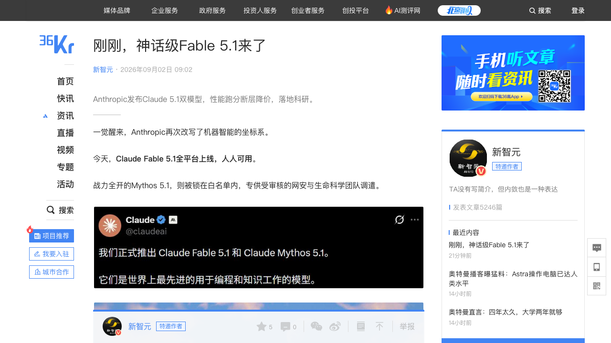
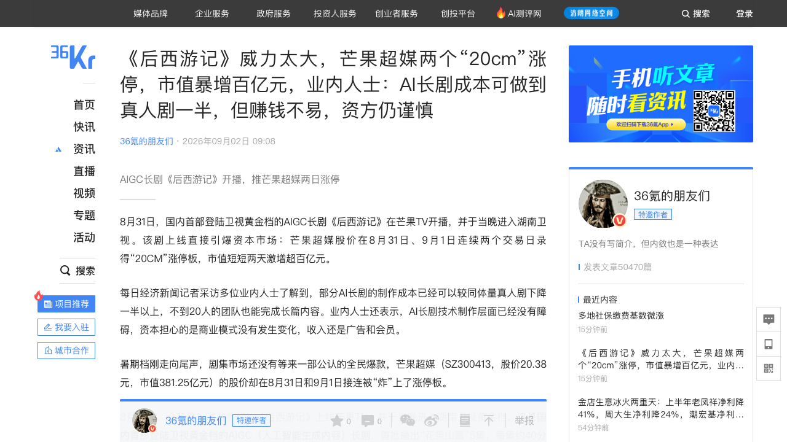
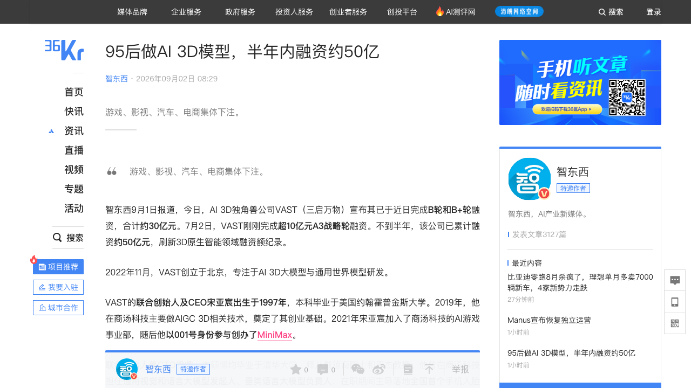
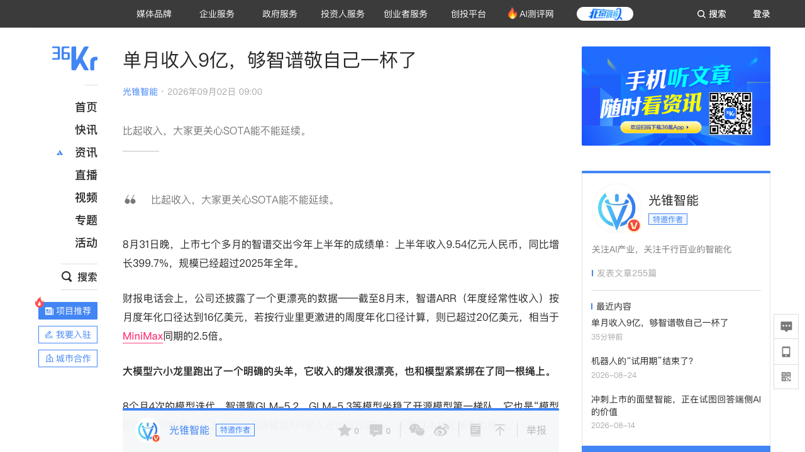
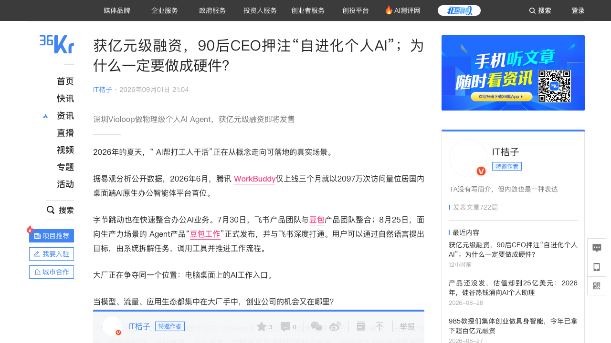
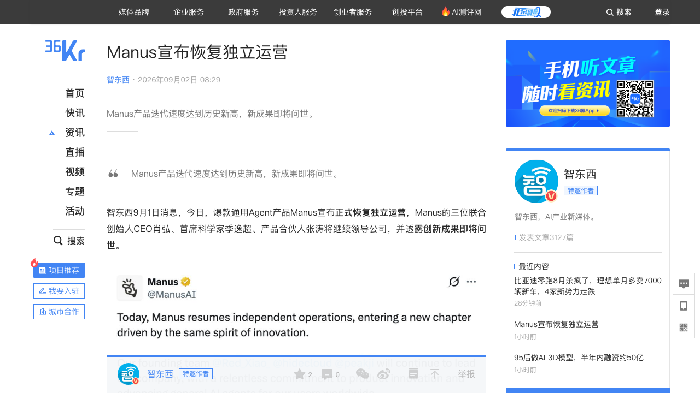

# 0902日报 | AI的「重资产化」时刻：Anthropic一周签下800亿美元算力租约（350亿Lambda+450亿Nscale、IPO前「模型路演」、Fable 5.1/Mythos 5.1双模型发布、缓存读取降价75%让「长时间工作」变便宜、API底层上「反蒸馏锁」）、AI长剧《后西游记》登陆湖南卫视黄金档（芒果超媒两日20cm涨停市值暴增百亿、成本仅为真人剧一半、算力和Token消耗占总投资七成——AI内容生产进入「重资产算账」阶段）、VAST半年融资约50亿（95后CEO、B+B轮30亿+Tripo P2.0行业首个原生四边面拓扑3D基座模型——3D原生智能被产业资本密集定价）、智谱上半年收入9.54亿/ARR最高20亿美元（API占比86.5%、「模型即产品」跑出六小龙头羊、自建数据中心+10万级国产芯片推理、Token成本降80%）、深圳Violoop亿元级天使+Pre-A（90后CEO做「物理级个人AI Agent」：掌机大小外接硬件、26 TOPS端侧算力、独立安全芯片+物理按键把「盖章权」留给用户、9月中旬海外发售已有1.2万人付订金）、Manus宣布恢复独立运营（发改委叫停Meta数十亿美元收购后按20亿美元估值回购、年化营收运行速率4-5亿美元、张涛预告「成立以来最具雄心的产品」——通用Agent的监管与资本双重剧本）

## 今日洞察

今天的五个字：「**AI的『重资产化』时刻。**」

**9月1日-2日，六件事指向同一条主线：AI正在从「轻资产的软件故事」变成「重资产的基础设施游戏」——Anthropic一周内签下350亿+450亿美元两份算力租约（WSJ：租Lambda位于德州Hut 8在建机房的算力，英伟达持有园区租约）、DeepSeek被路透曝出已自研AI芯片一年（OpenAI Jalapeño推理集群公布首份成绩、Anthropic也在组建芯片团队），模型公司从「买卡」走向「造卡+包机房」；内容侧，《后西游记》成为国内首部登陆卫视黄金档的AIGC长剧，算力和Token消耗最高占AI长剧总投资七成——内容生产的成本结构被AI重写；融资侧，VAST半年融资约50亿元把3D原生基座模型做成「基础设施生意」，Violoop/Heygo把Agent做成硬件。** 与此同时两条并行的「账本」：智谱用一份收入9.54亿、ARR最高20亿美元的半年报验证了「模型即产品」路线（API占比86.5%），Manus在监管叫停Meta收购后恢复独立运营（年化营收4-5亿美元）——重资产化的下一站，一边是收入证明，一边是监管边界。

**① 模型公司的「重资产化」：一周签下800亿美元算力租约，Anthropic把「算力账单」变成IPO故事的一部分。** Fable 5.1/Mythos 5.1发布当天（9/1），WSJ爆出Anthropic周一刚与Lambda签下350亿美元基础设施租约——机房由Hut 8在德州Nueces County建设（1GW容量、2027年Q1并网），英伟达持有园区租约（降低Lambda与Anthropic的财务风险）；一周前还与英国Nscale签了450亿美元、约460MW西弗吉尼亚机房的租约。结合The Information此前披露的IPO时间表（已秘密递表、劳动节后公开招股书、9月中旬投资者日、最快9月底10月初上市），这次发布被字母AI称为「公开递表前最后一次重量级模型路演」。对创业者的启示：① 前沿模型公司的竞争已经从「模型能力」延伸到「算力资产负债表」——800亿美元租约=未来5-10年的产能承诺，也是给IPO讲「供给有保障」的故事；② 「租约+代建+第三方持租」的结构化算力金融正在成为标配（呼应0824日报英伟达联合六大机构5000亿美元算力平台）；③ 模型公司重资产化意味着云厂商的「算力二房东」生意越做越大——你的公司在算力链条上站在哪一层？

**② 推理芯片潮起：DeepSeek被曝自研AI芯片、OpenAI Jalapeño出成绩、Anthropic组建芯片团队——「模型适配芯片」翻转为「芯片适配模型」。** 路透社报道DeepSeek已做了一年AI芯片、正接触芯片设计/晶圆代工/存储厂商；OpenAI与博通的Jalapeño推理集群公布首份结果（芯片+HBM+本地缓存+芯片间网络一体化设计、靠KV Cache与算力集群绑定减少数据搬运）；Anthropic也宣布组建芯片团队（并与AWS深度合作Trainium、拿Claude真实运行数据反向写编译器）。技术背景：深度推理+Agent路线确认后，Decode阶段「每搬1字节数据只算1次」的GPU短板被放大——谷歌TPU的脉动阵列、Groq砍掉HBM全上SRAM、阿里用标准加工岛拼共享缓存，各有路线。对创业者的启示：① 「推理芯片」成为模型公司降本的战略支点——谁的Decode成本低，谁就能把「思考型模型」卖得更便宜（呼应0901日报DeepSeek V4思考时间暴涨的成本压力）；② 模型厂+芯片厂的「汽车行业式」格局正在形成（谷歌=比亚迪全栈、OpenAI+博通=吉利代工、Anthropic+AWS=鸿蒙智行）——创业公司可以押注「芯片适配工具链」「KV Cache优化中间件」等卖铲机会；③ 英伟达涨价+ASIC抬头（今日投资界：英伟达涨价背后ASIC要被认真对待）意味着算力供给多元化的窗口期。

**③ AI内容生产的「成本结构革命」：国内首部卫视黄金档AIGC长剧《后西游记》上线，成本仅为真人剧一半、算力和Token占投资七成——内容行业的固定成本被重写，但商业模式还没变。** 8/31《后西游记》登陆芒果TV并于当晚进入湖南卫视黄金档（国内首部AIGC卫视黄金档长剧，首批5集每集约40分钟、计划30集），芒果超媒连续两日20cm涨停、市值两天增加逾百亿；业内人士称部分AI长剧制作成本较同体量真人剧下降一半以上、不到20人团队也能完成长篇内容，但算力和Token消耗最高占总投资七成；资本仍然谨慎——「技术制作层面已经没有障碍，资本担心的是商业模式没有发生变化，收入还是广告和会员」。对创业者的启示：① 「AI内容」的成本曲线已经跨过商业拐点（成本减半+产能解锁），但收入模型（广告/会员/分账）还是旧的——先想清楚「内容供给暴增后钱从哪来」；② 算力成为内容公司的新成本中心，AI影视的「卖铲人」（算力调度、Token计费、角色一致性工具）是确定性机会，赵斌判断「半年内会出现工具寡头」；③ 制作次序被颠覆（先做细节再推故事、边播边改），平台采购转向分账模式——个体创作者和小团队第一次有机会进入长剧生产。

**④ 「模型即产品」被财报验证：智谱上半年收入9.54亿（+399.7%）、8月ARR按周度年化超20亿美元、API收入占比86.5%——大模型六小龙跑出明确的头羊，但一切押在SOTA能否延续。** 智谱上市七个多月交出首份半年报（8/31晚）：收入9.54亿元超2025全年、API开放平台收入8.25亿（+2735.7%、占比15.2%→86.5%）、本地化部署收缩到13.5%；8月单月收入约1.33亿美元（约8.94亿元），月度年化ARR 16亿美元、周度年化口径超20亿美元（约MiniMax同期2.5倍）；MaaS注册用户超740万（+144%）、付费日活+603%、前十大用户日均调用+98倍；但整体毛利率从50%降到26.4%（本地化高毛利业务收缩+API定价涨101%却未显著改善毛利率），经调整净亏损19.64亿、研发开支21.31亿（收入的2.2倍）。唐杰回应「只会后训练」质疑：「简单地做大参数，并不是Scaling的本质路径」，智谱在自建数据中心、与中科曙光合作、搭建10万级国产芯片规模化推理（Token推理单位成本较年初降80%）。对创业者的启示：① 中国模型公司的「收入结构转型」（本地化项目制→API流量制）正在被资本市场重新定价——「模型即产品」是2026年中国大模型的确定叙事；② 但毛利率与提价脱钩说明模型层定价权仍受价格战约束——「既要SOTA又要性价比」的双重压力是所有模型创业者的生存题；③ 刘德兵的五级阶梯（Chat→Coding→Agent→co-worker→Autonomous AI）给Agent商业化画了清晰的路线图：每一级对应一个数量级更大的市场（5000亿→5万亿→30万亿美元）。

**⑤ Agent创业开始「变硬」：Violoop把个人AI Agent做成掌机大小外接硬件（独立安全芯片+物理按键授权、26 TOPS端侧算力、自带模型API或自备Key）、Heygo用雪靴传感器做「AI滑雪教练」——当软件Agent卷不动时，硬件正在成为「持续在场、可信执行、数据边界」的答案。** Violoop获联想创投、中金保时捷、蓝驰创投等亿元级天使+Pre-A：主打「消灭提示词」的主动式AI（从持续在场的上下文+长期记忆理解「此刻正在发生什么」，关键主动交互响应目标1秒内），三层信任设计——端侧优先处理隐私敏感任务、独立安全芯片管理授权、不可逆操作（发送/删除/提交/支付）必须物理按键确认（「盖章权留给用户」）；9月中旬海外上线、国内首批发售，已有约1.2万海外用户付订金。Heygo获厚雪数百万美元天使：雪靴外侧两个IMU传感器+实时语音教练反馈，用「鞋不等于板」的底层模型攻克（训练阶段雪板加装传感器学习映射），数据精度3度以内，9月预售覆盖38国。对创业者的启示：① 纯软件Agent的「权限与信任」问题（呼应0831日报Claude删库事件、0812日报SAFE框架）正在催生「硬件信任边界」的新品类——物理按键、独立安全芯片、数据本地化是三个可复用的设计语言；② 「AI原生硬件」的估值逻辑=数据资产（持续在场采集的上下文）+硬件毛利+订阅，与Oura（0830日报）的公式同构；③ 垂直运动/场景的「物理AI」是创业公司的差异化窗口——大厂抢软件入口，创业公司可以抢「人机物理交互层」。

**六个信号同样关键**：① **DeepSeek被曝自研AI芯片、推理芯片潮起**（9/2差评综合：路透社报道DeepSeek已做一年AI芯片、正接触芯片设计/晶圆代工/存储厂商；OpenAI与博通合作的Jalapeño推理集群公布首份成绩；Anthropic组建芯片团队——深度推理确认后Decode阶段「每搬1字节只算1次」的GPU短板放大，谷歌TPU脉动阵列/Groq全SRAM/阿里共享缓存/OpenAI KV绑定各走各路——「模型适配芯片」翻转为「芯片适配模型」，呼应0831日报Mac mini强化学习与0901日报推理利润率）；② **AI陪伴产品Zeta月流水突破千万美元**（9/2白鲸出海/AppMagic：8月分成后流水破千万美元，日本贡献八成以上——6-7月下载量稳定在30万次/月但收入从370万美元升至800万美元、ARPMAU半年翻约10倍；关键动作是5/21把Lorebook/角色状态/叙事风格/剧情选项全部免费开放给免费模型，把用户养成「深度剧情玩家」后再靠广告（40分钟10次、卡在剧情转折点）+Pieces虚拟币买高级模型（「多角色plot不用Koji以上根本玩不了」）变现——「免费体验越完整，用户越清楚更好值多少钱」，纯UGC平台暂无创作者分成、创作者「为爱发电」的默契能维持多久是最大问号）；③ **海外两笔融资：AIR Security 5000万美元两轮种子**（9/1 TC/SA：以色列Unit 8200老兵Yair Saban与Niv Hoffman创办、红杉领投首轮1000万+Greenoaks领投二轮4000万——「AI Agent的防火墙」：发现企业内运行的Agent、持续审查其使用的Skill/插件/MCP并拦截不合规交互，目前过滤约27%的线上技能插件，20+客户、金融与医药需求最旺——「MCP供应链安全」成新赛道，竞品Zenity刚融1.25亿美元C轮、Noma去年1亿美元B轮）+ **Empirik 2100万美元种子轮**（9/1 TC：红杉2023年孵化、本周独立运营，CEO为前Quantum Metric CPO——追踪系统变更并推断涟漪效应、预测宕机，「给基础设施工程师的Cursor/Claude Code」，客户含S&P Global、Guardant Health）；④ **Google Pics对标Canva**（9/1 TC：由Nano Banana图像模型驱动的AI优先设计工具——「prompt instead of design」，内置Docs/Slides今日上线、后续进Drive，与Canva/Adobe Express的「模板市场+设计师分成」路线正面竞争——AI生成的免费供给 vs 人类设计师的版权市场，创意工具的商业模式分野）；⑤ **Heygo数百万美元天使轮做「AI滑雪教练」**（9/2 36氪/欧雪：前字节/腾讯/大疆团队（创始人吴振华曾任飞书区域业务负责人）、厚雪独家投资——雪靴传感器+蓝牙耳机实时语音反馈（滑行中关键时刻提示/缆车复盘/全天报告）、「鞋不等于板」模型攻克、数据精度3度以内、9月预售10月发货覆盖38国——「个人运动智能」从滑雪起步，垂直运动数据资产被资本下注）；⑥ **Meta让机器人进机房「打工」**（9/2 36氪朋友们：Meta数据中心测试运维机器人——服务器上架、巡检、线缆管理等场景，「仍存挑战需求迫切」——继0831日报人形机器人进厂真相后，数据中心成为机器人落地的新场景，但效率与泛化依然是同一道坎）。

---

## 1. [Anthropic发布Claude Fable 5.1/Mythos 5.1双模型：Fable 5.1全平台上线人人可用、Mythos 5.1白名单专供受审核的网安与生命科学团队（同一套能力、后者不拦网络攻防与生物用途）；Terminal-Bench-Science 0.1拿52.6%（前代Fable 5为24.7%、GPT-5.6 Sol为22.4%）、Terminal-Bench 4.0达55.8%（Mythos 5.1为60.9%）、AutomationBench从17.1%涨到31.4%；基础定价不变（输入10美元/输出50美元每百万Token）但缓存读取从1美元砍到0.25美元（-75%），8月四周实测典型工作负载总成本降约25%、重度Agent任务最高省45%——「不是把模型卖便宜，是把让它长时间工作这件事做便宜」；科研案例：重绘三分之一金星地形图（分辨率10-20公里→2-3公里）、蛋白质设计12靶点命中率近50%（常态10-15%）、为7个开源生物模型手写GPU Kernel提速最高2.5倍（Evo 2分析300万变异成本从1.8万美元降至8千美元）；安全「一松一紧」：护栏放松允许识别代码漏洞（网安误报降六成、但只找漏洞不写攻击代码）而API底层上「反蒸馏锁」（提示词与思维块不一致直接报错拦截或抽走思维块，先拿8/31后注册的新API账号开刀、未来所有新模型强制）；时间点：WSJ爆料周一刚与Lambda签350亿美元基础设施租约（Hut 8德州Nueces County 1GW机房在建、英伟达持园区租约、2027年Q1并网）、一周前与英国Nscale签450亿美元约460MW西弗吉尼亚机房租约（配Nvidia Rubin+ Vera）——The Information披露Anthropic已秘密递表、劳动节后公开招股书、9月中旬投资者日、最快9月底10月初上市，「这是公开递表前最后一次重量级模型路演」；8/29还宣布9月14日起Claude Code「标准周额度提高25%」但相对当前临时额度实际下降约17%，发布评论区用户仍在追问「更透明、更慷慨」的额度](https://36kr.com/p/3965405241204228)（新产品 / 模型公司的「重资产化+IPO路演」：一周签下800亿美元算力租约、缓存降价75%把成本结构转向「长任务友好」，Anthropic正在用「能力+产能+额度」三件套讲IPO故事；反蒸馏机制把「思维链保护」从软约束变成API硬锁——护城河开始写在基础设施层）

🔗 链接：[36氪·刚刚，神话级Fable 5.1来了（新智元）](https://36kr.com/p/3965405241204228) | [36氪·Fable 5.1来了，Anthropic 再秀肌肉（字母AI）](https://36kr.com/p/3965506148652681) | [SiliconAngle·Anthropic launches Claude Fable 5.1 after inking $35B cloud deal with Lambda](https://siliconangle.com/2026/09/01/anthropic-launches-claude-fable-5-1-inking-35b-cloud-deal-with-lambda/)

**动态**：**9月1日-2日，Anthropic发布Claude Fable 5.1与Mythos 5.1双模型——同一套能力、两种开放度：Fable 5.1全平台上线人人可用，Mythos 5.1被锁在白名单内、专供受审核的网络安全与生命科学机构（后者不拦网络攻防与生物用途，Anthropic称其拥有「我们发布过的最强网络能力」）。** 关键信息：① **跑分断层**：科研探索基准Terminal-Bench-Science 0.1从Fable 5的24.7%涨到52.6%（GPT-5.6 Sol为22.4%），Terminal-Bench 4.0从42.0%涨到55.8%（Mythos 5.1达60.9%），商业工作流AutomationBench从17.1%涨到31.4%——提升明显集中在「长时间、多步骤、连续调用工具的Agent任务」而非均匀分布；传统基准上HLE带工具从63.8%到65.0%、CursorBench 3.2.0从70.5%到73.4%、知识工作GDPval-AA v2从1723到1853；② **降价路径**：基础定价不变（输入10美元/百万Token、输出50美元），但缓存读取从1美元砍到0.25美元（-75%）——用8月四周实际数据测算，典型工作负载整体成本降约25%、上下文更重的复杂Coding和高度Agent化任务最高省45%；5分钟/1小时缓存写入仍为12.5/20美元；对比GPT-5.6 Sol当前促销价（输入2/输出10/缓存0.2美元），Fable 5.1仍属明显更贵一档（同量级约2.5倍、GLM-5.3的10倍以上），Anthropic官方仍建议大多数任务优先用价格一半的Opus 5；③ **科研案例**：用麦哲伦号30多年前的雷达数据重新生成覆盖金星约三分之一面积的高分辨率地形图（分辨率从10-20公里推进到2-3公里、高度估计准确性最高+25%）；分子与蛋白质设计在EGFR、Nipah G等三个靶点亲和力达Adaptyv Bio竞赛最佳方案的10倍、12个靶点总体命中率近50%（行业常态10-15%）；只拿公开源代码几天内为7个开源生物模型手写GPU Kernel、推理提速最高2.5倍且输出与原版完全一致（Evo 2分析300万变异成本从1.8万美元降到8千美元）；还帮对冲基金Millennium解决了潜伏四五年的Bug（一路反汇编到第三方库）；④ **安全「一松一紧」**：松——护栏不再「神经质」，允许识别代码漏洞、网安误报降六成，但只找漏洞绝不写攻击代码（渗透测试仍交Opus）；紧——API底层上「反蒸馏锁」：严查上下文，提示词与生成思维块不一致时直接报错拦截或抽走整个思维块，先拿8月31日后注册的API新账号开刀、未来所有新模型强制生效；⑤ **算力重资产化**：WSJ爆料Anthropic周一与Lambda签350亿美元基础设施租约——机房由Hut 8在德州Nueces County建设（1GW容量、基于英伟达DSX参考架构、2027年Q1并网、首个数据厅约半年后上线），英伟达持有园区租约（可能是为Lambda与Anthropic降低财务风险）；一周前刚与英国Nscale签450亿美元、约460MW西弗吉尼亚机房租约（配Nvidia Rubin显卡+Vera CPU）；⑥ **IPO时间表**：The Information此前披露Anthropic已秘密提交IPO文件，可能在9月7日美国劳动节后公开招股书、9月中旬举行投资者日、最快9月底至10月初上市——这次发布被解读为「公开递表前最后一次重量级模型路演」；⑦ **额度余波**：8/29 Claude Developers宣布9月14日起「标准周额度提高25%」，但这是相对5月以前旧标准计算，与用户当前使用的临时额度（曾临时+50%）相比实际下降约17%——Fable 5.1发布评论区仍有用户追问「更透明、更慷慨」的会话与每周额度（呼应0901日报Claude Max 20x集体诉讼）。

**做什么的**：通俗讲，**这是「Anthropic赶在IPO前把最强双模型和最大算力账单一起端出来——Fable 5.1让AI能自己做完一整套科研/编程长任务（重绘金星、设计蛋白质、手写GPU内核），缓存读取降价75%让『让它长时间干活』这件事变便宜；同一周它签下800亿美元算力租约，把『未来五年我有卡』写进招股书；同时在API底层上了把『反蒸馏锁』，防止别人套走思维链。」** 一句话：能力、产能、额度三件套，全是讲给IPO听的。

**为什么值得关注**：

- **模型公司进入「重资产化」周期：800亿美元算力租约=IPO故事里的「产能承诺书」。** 350亿（Lambda/Hut 8）+450亿（Nscale）在一周内落定，加上此前与AWS的合作，Anthropic的算力布局已经从「租云」变成「包机房+定制代建」——租约结构里甚至出现英伟达持租（用英伟达的信用给机房融资背书）。对创业者的启示：① 前沿模型公司的估值叙事里，「算力资产负债表」与「模型能力」同等重要——投资人要看到供给有保障；② 「租约+代建+第三方持租」的结构化算力金融会成为标配（呼应0824日报英伟达5000亿算力平台）——做算力融资/经纪/保险的中间层有机会；③ 对应用层创业者，模型公司的重资产化短期是好事（产能保障、价格战弹药），长期要警惕「模型公司自建生态」的挤压。

- **「把长时间工作做便宜」成为模型竞争的新维度——缓存降价75%是给Agent经济算的账。** Fable 5.1不是整体降价，而是专门把「缓存读取」（Agent反复读取系统提示词、代码库、工具定义）砍掉75%——任务越长、工具调用越多，省得越多（最高45%）。这等于公开承认：未来主流负载是连续运行几小时的Agent，而不是单轮问答。对创业者的启示：① 选择模型时要算「长任务总成本」而不是「单Token价格」——缓存命中率、KV Cache效率正在成为新的定价语言；② 你的Agent产品要把「缓存友好」写进架构（系统提示词结构化、上下文复用），这是与模型厂降价共振的省钱点；③ 呼应0901日报「额度经济学」——成本结构决定产品能不能让用户「用得久」。

- **「反蒸馏锁」把思维链保护从软约束变成API硬约束——护城河开始写在基础设施层。** 过去防蒸馏靠多轮对话里的内容审计，Fable 5.1直接在API底层校验「提示词与思维块一致性」，不一致就报错或抽走思维块，且未来所有新模型强制生效。对创业者的启示：① 依赖蒸馏/逆向思路做「模型套壳」的团队要重新评估合规与成本风险；② 「思维链即知识产权」正在成为行业共识（与0901日报Kimi K3 License、开源收租一起看：模型公司开始系统性地保护与变现自己的「智力资产」）；③ 应用层真正的护城河从来不是「套哪个模型」，而是数据、工作流与分发。

- 对创业者的启发：**① 把「算力租约/产能承诺」纳入模型公司的尽调维度；② 按「长任务总成本」选模型、按「缓存友好」做架构；③ 关注思维链保护对套壳生意的合规影响；④ 额度透明化（呼应0901集体诉讼）仍是订阅产品的信任红线。** 跟踪三个验证点：Lambda/Nscale租约的实际交付节奏（2027年Q1并网）、Fable 5.1在科研/编程场景的生产渗透率、IPO招股书披露的算力负债结构。

**类比参考**：**「AI的『重资产化』时刻/ 从『轻资产模型公司』到『包机房的算力玩家』——当Anthropic一边发布能重绘金星的最强双模型、一边一周签下800亿美元算力租约、再给API装上一把反蒸馏锁，前沿AI的竞争第一次同时出现在「能力、产能、产权」三个战场：这不再是一家软件公司讲的故事，而是一家重资产基础设施公司写给IPO的情书（呼应0901日报巴克莱利润账、0830日报Anthropic想买MatX——模型公司的钱，正在从「买模型」变成「买卡、买机房、买产能」）**

---

## 2. [国内首部卫视黄金档AIGC长剧《后西游记》开播引爆资本市场：8月31日上线芒果TV、当晚进入湖南卫视黄金档（首批「花果山篇」5集、每集约40分钟、全剧计划30集；芒果TV出品、AIGC创新内容中心制作、伯璟文化承制、依托自研AIGC创作平台「芒果灵创」、累计109个角色+143个场景数字资产、项目组近百人）；芒果超媒8月31日与9月1日连续两日「20CM」涨停、市值两天激增逾百亿（报20.38元/股、市值381.25亿元）——但芒果超媒上半年归母净利润2.02亿元同比下降73.58%；业内：部分AI长剧制作成本较同体量真人剧下降一半以上、不到20人团队也能完成长篇内容，算力和Token消耗最高可占总投资的七成以上；商业模式未变（收入还是广告和会员）让资本谨慎、不少团队靠自筹完成制作；未来半年将有多部AI长剧上线，赵斌称「电影比长剧更容易实现、AI对院线电影的冲击可能大于长剧」；平台采购转向分账模式、AI长剧没有明星让定价依据少一块；华策影视（电视剧制作发行收入同比-90.35%）/优酷/爱奇艺同步押注AIGC剧集](https://36kr.com/p/3965568457514501)（行业洞察 / AI内容生产的「成本结构革命」：成本减半+产能解锁（不到20人团队）+算力Token占投资七成——固定成本被重写、收入模型没变，AI长剧第一次进入卫视黄金档，「技术无阻碍、资本等模式」；内容供给暴增后「钱从哪来」成为下一题）

🔗 链接：[36氪·《后西游记》威力太大，芒果超媒两个「20cm」涨停，市值暴增百亿元（每经头条）](https://36kr.com/p/3965568457514501)

**动态**：**8月31日，国内首部登陆卫视黄金档的AIGC长剧《后西游记》在芒果TV开播，并于当晚进入湖南卫视黄金档——芒果超媒股价8月31日、9月1日连续两个交易日录得「20CM」涨停，市值短短两天激增超百亿元。** 关键信息：① **剧集**：首批播出「花果山篇」5集、每集约40分钟（仙石中诞生的小石猴孙小圣与唐半偈、猪一戒、沙弥组成新的取经队伍），全剧计划30集；由芒果TV出品、AIGC创新内容中心制作、伯璟文化承制，全片依托芒果TV自研AIGC内容创作平台「芒果灵创」完成，制作期间累计形成109个角色数字资产和143个场景数字资产，项目组近百人；② **资本反应**：芒果超媒8/31以20%涨幅收盘、9/1再次涨停报20.38元/股（市值381.25亿元），两天市值增加逾百亿——背景是芒果超媒并不轻松的半年报（营收61.94亿元+3.86%、归母净利润2.02亿元-73.58%），《后西游记》成为传统影视行业应对成本压力的出口；③ **成本账**：每日经济新闻采访多位业内人士——部分AI长剧制作成本已可较同体量真人剧下降一半以上、不到20人团队也能完成长篇内容（制作速度较慢）；真人剧通常预留约10%浮动空间应对极端天气/演员状态/场地变化，AI全流程制作的预算与决算更接近、超支风险可控；但算力和Token消耗最高可占总投资的七成以上——画面精细度越高、生成与修改次数越多，人工修正返工与算力支出越高；④ **商业模式顾虑**：「技术制作层面已经没有障碍，资本担心的是商业模式没有发生变化，收入还是广告和会员」——投资机构愿意看项目、真正投入时相当谨慎，不少团队仍靠自筹完成制作；平台现阶段更多采用分账模式（AI长剧没有明星，原来的价格依据少了一块）；⑤ **行业动向**：赵斌（成都天府宽窄文化董事长）近三个月接触国内外三四十个AI影视团队，「00后」占比不低、有些成员从未参加过真人实拍；未来半年内将有多部AI长剧上线，行业处在爆发前夜；赵斌对AI电影判断更激进——「电影比长剧更容易实现，AI技术对院线电影的冲击，可能还会大于长剧」；华策影视今年公布6集×15分钟的AIGC中剧《消失的500年》、全AI制作项目《绯色之契》已放预告，优酷推出AIGC网络故事片激励计划，爱奇艺7月上线国内首部获《网络剧片发行许可证》的AIGC网络故事片；⑥ **创作次序被颠覆**：AI团队可以拆开不同桥段制作最后合成、也可以先找到满意的人物/场景/镜头再反向调整故事，「甚至可以先把细节做出来，再反向推导整个故事」——这会冲击原有的影视教学和人才评价方式。

**做什么的**：通俗讲，**这是「一部没有真人演员的AI长剧登上湖南卫视黄金档，把芒果超媒的股价干出两个20cm涨停」——全片由芒果TV自研的『芒果灵创』平台生成，成本能做到同体量真人剧的一半，团队最小不到20人；但算力和Token消耗占投资七成，投资人却在犹豫——因为收入还是广告和会员，商业模式没变。」** 换句话说：AI把拍剧的「固定成本」打下来了，但「怎么赚钱」还是老一套——技术无阻碍，资本等模式。

**为什么值得关注**：

- **AI内容生产的成本曲线跨过商业拐点——「成本一半+产能解锁」是行业级的供给侧变化。** 成本降一半以上、不到20人团队做长篇、边制作边播（首批5集播出后可按观众反馈调整后续内容）、AI剧还能提前生产「物料」（粉丝会、花絮、路透、演员日常都能模拟运营）——长剧的生产函数被彻底改写。对创业者的启示：① 内容创业的门槛从「资本密集」变成「创意+工具能力」——个体创作者和小团队第一次有机会进长剧生产（只要达到播出标准）；② 「先做细节再推故事」的逆向流程、边播边改的敏捷生产，是AI内容团队的新方法论；③ 警惕「工业糖精/预制爆款」批量生产——创作者对人物和故事的理解重新变得重要，真诚是稀缺品。

- **算力成为内容公司的新成本中心——AI影视的「卖铲人」是确定性机会。** 演员、场地、外景支出减少后，算力和Token消耗最高占总投资七成——这是AI长剧的「隐形制片人」。赵斌判断「现在工具很多，真正通用、稳定的主流工具还没有形成，我估计半年内会出现工具寡头」；角色跨场景一致性（换场景面部身体是否保持一致）、多人同框动作自然度、局部修改保留已完成画面——这些技术痛点直接决定制作时间和成本。对创业者的启示：① 角色一致性、长镜头稳定性、批量返工工具是AI影视工具链的三大刚需；② 国内算力资源集中在西部、AI影视团队聚集在江浙沪，「算力+创作」之间的产业服务衔接是空白；③ 「工具寡头」窗口期半年——现在切入有机会。

- **「成本革命」与「收入模型不变」的错位，是AI内容最大的投资分歧点。** 一边是资本用两个涨停投票，一边是「资本担心商业模式没有发生变化，收入还是广告和会员」——AI长剧没有明星，定价依据少了一块；平台转向分账模式分散风险。对创业者的启示：① 做AI内容项目，先回答「内容供给暴增后，钱从哪来」——会员、广告、分账、IP衍生还是新形态（互动/游戏化）？② 分账模式对内容方是把双刃剑——风险分散但收入不确定，拼的是播放表现；③ 验证《后西游记》价值的两把尺子（赵斌）：剧自身的播出表现要好、行业短期内出现第二部成熟AI长剧——这两个信号值得跟踪。

- 对创业者的启发：**① 评估AI内容机会时把「成本减半」与「收入模型未变」放在一起看；② AI影视工具链（一致性/长镜头/返工/算力调度）是半年窗口期的卖铲机会；③ 学习「边播边改+逆向创作」的新生产流程；④ 关注AI对院线电影的冲击（可能大于长剧）。** 跟踪三个验证点：《后西游记》播出表现与会员/广告转化、第二部卫视级AI长剧何时出现、芒果灵创等平台工具的开放程度。

**类比参考**：**「AI内容生产的『成本结构革命』/ 从『人海战术拍剧』到『算力与Token写进制片预算』——当第一部AIGC长剧登上卫视黄金档、成本做到真人剧一半而算力占了投资七成，「拍剧」的固定成本第一次被AI重写：内容行业的产能上限被打开，但钱的分配方式还没跟上——技术已经进场，商业模式还在门口排队（呼应0901日报OpenAI广告、0828日报MiniMax——AI内容与AI应用一样，正在从『能不能做』走向『怎么赚钱』）**

---

## 3. [AI 3D独角兽VAST（三启万物）完成B轮和B+轮融资合计约30亿元：不到半年累计融资约50亿元（7/2超10亿元A3战略轮、6/1约2亿美元A+轮+A++轮、3/5 5000万美元A轮）、刷新3D原生智能领域融资额纪录；95后创始人兼CEO宋亚宸（1997年生、约翰霍普金斯本科、商汤AIGC 3D背景、001号参与创办MiniMax）、CTO梁鼎（清华本硕博、戴琼海院士与周杰教授门下、商汤通用视觉和语言大模型发起人）、首席科学家曹炎培（清华计算机系、3D全息公司Owlii被快手收购、腾讯ARC Lab/AI Lab生成式3D负责人）；投资阵容覆盖游戏/汽车/电商/智能终端/XR/影视/文旅/广告——产业资本（完美世界、蓝色光标、芯动能投资、延趣游戏、中科创达、广电投资、三七互娱）+一线财投（鼎晖VGC、中金资本、CMC资本、洪泰基金等）+老股东（达晨财智、春华资本等）；同日发布旗舰3D原生基座模型Tripo P2.0——行业首个解锁原生四边面拓扑的3D原生基座模型（数秒内直接生成四边面为主、形状还原更精准、面数可控、分件合理的3D对象，「引擎可用、动画可绑、编辑可及」，自然语言驱动+模型内智能体承担方案规划/代码编写调试，如生成机械蜘蛛并实现部件级动画控制）](https://36kr.com/p/3964719241305607)（融资 / 3D原生基座的「基础设施化」：半年50亿融资+游戏/汽车/影视产业资本集体下注——3D原生智能从实验室验证走向真实商业生产链路，「自然语言→可用3D资产」成为Vibe Coding时代的下一代创作底座）

🔗 链接：[36氪·95后做AI 3D模型，半年内融资约50亿（智东西）](https://36kr.com/p/3964719241305607)

**动态**：**9月1日，AI 3D独角兽公司VAST（三启万物）宣布已于近日完成B轮和B+轮融资，合计约30亿元——7月2日刚完成超10亿元A3战略轮，不到半年累计融资约50亿元，刷新3D原生智能领域融资额纪录。** 关键信息：① **融资节奏**：自创立以来7轮融资近60亿元——2026年9月1日B轮+B+轮30亿元；7月2日A3战略轮超10亿元；6月1日A+轮+A++轮约2亿美元；3月5日A轮5000万美元；2025年6月Pre-A+轮数千万美元；2024年9月Pre-A轮数亿元+天使轮；② **团队**：2022年11月创立于北京，专注AI 3D大模型与通用世界模型；CEO宋亚宸1997年生（本科约翰霍普金斯大学，2019年商汤做AIGC 3D，2021年加入商汤AI游戏事业部，随后以001号身份参与创办MiniMax）；CTO梁鼎清华本硕博（师从戴琼海院士和周杰教授，商汤通用视觉和语言大模型发起人、垂类语言大模型负责人，主导落地全国首个手机人脸解锁、人脸门锁、城市级地铁刷脸乘车）；首席科学家曹炎培85后（清华计算机系本科博士，联合创立3D全息公司Owlii被快手收购，后在腾讯ARC Lab和AI Lab领导生成式3D工作）；③ **投资阵容**：本轮战略投资方覆盖对3D原生基座模型和世界模型有切实需求的各行各业——产业资本（完美世界、蓝色光标、芯动能投资、延趣游戏、中科创达、广电投资、三七互娱等）、一线财投（鼎晖VGC、中金资本、CMC资本、洪泰基金、三正健康投资等）、老股东（达晨财智、春华资本、四三九九、慕华科创、绿洲资本、渶策资本、华控基金）；据领投机构经纬创投披露，本轮融资将持续投入3D原生模型与数据能力迭代、训练与推理基础设施扩建、产品开发与商业化落地加速；④ **Tripo P2.0**：官宣融资同时发布旗舰3D原生基座模型最新版本——支持原生四边面拓扑网格（行业首个解锁原生四边面拓扑的3D原生基座模型），数秒内直接生成以四边面为主、形状还原更精准、面数可控且分件更合理的3D对象，做到「引擎可用、动画可绑、编辑可及」；用户通过自然语言提出创作需求并校验输出，模型内智能体承担方案规划、代码编写与调试——例如生成一只机械蜘蛛，在天然语意分件基础上让LLM为独立部件命名、编写和调试运动逻辑，实现部件级动画控制；也可以根据一张平面设计图生成完整、结构清晰的四边面3D角色建模；⑤ **背景**：近半年陆续发布Tripo H3.1、Tripo P1.0，今天发布P2.0——服务游戏、影视与实时交互内容的专业管线，也为Vibe Coding时代的创作者提供「可直接编程、绑定、迭代」的3D原生底座。

**做什么的**：通俗讲，**这是「一个95后带着MiniMax元老和清华系技术班底做AI 3D建模，半年融了50亿——你给AI说一句话（或一张设计图），它几秒钟生成一个『引擎里能用、动画能绑、能拆开编辑』的3D模型，比如一只能动的机械蜘蛛；游戏、汽车、电商公司都来投钱，因为这直接关系到他们生产管线里的下一个环节。」** 3D原生基座模型正在变成与文本/图像模型并列的基础设施——「自然语言→可用3D资产」从概念走向商业生产链路。

**为什么值得关注**：

- **3D原生智能进入「基础设施化」定价阶段：半年50亿、7轮近60亿，产业资本集体下注。** 本轮投资方覆盖游戏、影视、XR、汽车、电商、文旅、广告——产业资本下场代表3D原生智能不再停留在实验室技术验证，正在走向真实商业生产链路；一线产业机构离下游需求近、对技术落地要求高，参投本身是对VAST技术落地的认可。对创业者的启示：① 「基座模型+产业资本绑定」是重基础设施赛道（3D/世界模型/具身）的标准打法——产业资本带来订单场景与数据，财投带来估值锚；② 3D原生基座模型正在成为游戏、影视、实时交互应用的重要基础设施——围绕它做「行业适配层」（游戏引擎插件、电商商品建模、汽车数字孪生）是创业窗口。

- **Tripo P2.0的「原生四边面拓扑」是技术分水岭——「能看」与「能用」之间隔着一条拓扑鸿沟。** 过去AI生成3D多是三角面网格（游戏/影视引擎难以直接使用），四边面拓扑+可拆件+可绑定动画意味着AI产出能直接进专业生产管线——「引擎可用、动画可绑、编辑可及」。对创业者的启示：① 「生成质量」的评判标准正在从「像不像」变成「能不能进生产管线」——可编辑性、拓扑质量、语义分件是新一代生成模型的护城河；② 「LLM+3D模型」的组合（自然语言规划+代码生成运动逻辑）预示3D创作将从「建模」走向「编程式组装」——Vibe Coding的3D版。

- **MiniMax系创业者的「连续创业溢出」：宋亚宸001号参与创办MiniMax后二次创业——大模型人才正在向「3D/世界模型/具身」溢出。** 从商汤AIGC 3D到MiniMax再到VAST，宋亚宸的路径代表一种「模型基础设施人才」的迁徙：文本大模型格局既定后，同一批人才把Scaling经验复制到3D与世界模型。对创业者的启示：① 关注「大模型老兵二次创业」的团队——他们带着训练方法论+资本信任+产业资源；② 3D/世界模型赛道的竞争本质是「数据+训练方法论+产业场景」三要素——与文本模型的竞争结构相似。

- 对创业者的启发：**① 把「能不能进生产管线」作为生成类产品的评判标准；② 3D基座模型的行业适配层（引擎/电商/汽车/影视插件）是创业机会；③ 关注「大模型人才溢出」带来的新赛道供给；④ 产业资本+基座模型的绑定模式可复制到其他重基础设施赛道。** 跟踪三个验证点：Tripo P2.0在游戏/影视客户的生产渗透率、VAST商业化收入结构与增速、下一轮融资估值（半年50亿后的定价锚）。

**类比参考**：**「3D生成的『生产管线时刻』/ 从『能看的3D』到『能用的3D』——当VAST用半年50亿融资把Tripo P2.0推到「原生四边面拓扑+部件级动画控制」、游戏汽车影视的产业资本集体下场，3D原生基座模型第一次像当年的文本大模型一样被当作基础设施定价：生成物的评判标准，从「像不像」变成了「能不能进流水线」（呼应0828日报HF MicroDuck、0830日报Qoder——AI的下一代创作底座正在从文本、代码扩展到三维世界）**

---

## 4. [智谱2026上半年财报：收入9.54亿元同比增长399.7%、规模已超2025全年（8/31晚披露，上市七个多月首份半年报）；8月ARR按月度年化口径16亿美元、按周度年化口径超20亿美元（约MiniMax同期2.5倍）；8月单月收入约1.33亿美元（约8.94亿元）；收入结构剧变——开放平台及API收入8.25亿元（+2735.7%、占比从去年15.2%/全年26.3%升至86.5%）、模型本地化部署1.29亿元（-20.5%、占比73.7%→13.5%）；企业级智能体收入1374万→5556万（+304.4%）；MaaS注册用户超740万（+144%）、付费日活+603%、前十大用户日均调用量+98倍；但整体毛利率从50.0%降到26.4%（云业务毛利率-0.4%→24.6%）、API定价平均提升约101%而毛利率改善有限；经调整净亏损19.64亿元（+12.1%）、研发开支21.31亿元（+33.6%、收入的2.2倍）；唐杰回应「只会后训练」质疑：简单地做大参数不是Scaling的本质路径、国内训练数据普遍30-50万亿Token量级、堆参数收益不大；智谱自建数据中心+与中科曙光合作+搭建10万级国产芯片规模化推理、Token推理单位成本较年初下降80%；刘德兵提出能力阶梯Chat→Coding→Agent→co-worker→Autonomous AI（对应5000亿美元/5万亿美元/30万亿美元市场），当前定位在第二级coding到第四级co-work之间、网络安全是第一块试验田（GLM-5.3 CyberGym 84.5%超GPT-5.6）](https://36kr.com/p/3964873497320966)（行业洞察 / 「模型即产品」被财报验证：收入结构从本地化项目制转向API流量制、单月收入接近上半年总和——大模型六小龙跑出明确头羊；但毛利率与提价脱钩、研发开支2.2倍于收入，「一切押在SOTA能否延续」）

🔗 链接：[36氪·单月收入9亿，够智谱敬自己一杯了（光锥智能）](https://36kr.com/p/3964873497320966) | [36氪·5500亿智谱，拒绝成为大厂「打工人」（中国企业家杂志）](https://36kr.com/p/3965507243891976)

**动态**：**8月31日晚，上市七个多月的智谱交出今年上半年成绩单：收入9.54亿元人民币、同比增长399.7%，规模已经超过2025年全年——财报电话会上还披露，截至8月末智谱ARR按月度年化口径达16亿美元、按更激进的周度年化口径超过20亿美元（约MiniMax同期2.5倍），倒推8月单月收入约1.33亿美元（约8.94亿元），接近上半年整体收入。** 关键信息：① **收入结构剧变**：开放平台及API收入8.25亿元（+2735.7%）、占比从去年同期的15.2%（去年全年26.3%）一路抬升到86.5%；模型本地化部署收入1.29亿元（-20.5%）、占比从73.7%萎缩到13.5%——「之前智谱的标签是本地化部署，现在完全把模型当做核心收入来源」；企业级通用大模型收入从1.48亿降至6704万（-54.6%），企业级智能体收入从1374万增至5556万（+304.4%）；② **增长质量**：MaaS注册用户超740万（较年初+144%）、付费日活用户+603%、以收入计前十大用户日均调用量较年初+98倍；③ **盈利质量**：整体毛利率从去年同期50.0%降到26.4%（高毛利本地化业务收缩所致），云业务毛利率从-0.4%转为24.6%；API定价平均提升约101%但毛利率改善极其有限（「大幅提价后，反映在毛利率上的变化极其有限」）；经调整净亏损19.64亿元（+12.1%），研发开支21.31亿元（+33.6%、是同期收入的2.2倍、首次超过经调整净亏损）；④ **模型策略**：8个月4次迭代（GLM-5.2、GLM-5.3等）坐稳开源模型第一梯队，GLM-5.3 Flash（总参数3200亿、激活180亿、稀疏注意力+线性注意力混合架构）价格为GLM-5.2的十分之一；唐杰回应「只会后训练」质疑——「简单地做大参数，并不是Scaling的本质路径」，国内训练数据普遍在30-50万亿Token、自身算力有限的情况下按Scaling Law简单堆参数收益不大；⑤ **算力家底**：自建数据中心、与中科曙光等合作扩大算力供给、在国产替代趋势下搭建10万级国产芯片规模化推理能力，Token推理单位成本较年初下降80%；⑥ **商业化路线**：董事长刘德兵提出「模型即产品」的五级阶梯——Chat交付一次性回答、Coding交付可运行代码、Agent交付被执行的多人任务链、co-worker交付可被专业人士复核的工作成果、Autonomous AI交付持续运行的能力，「每一级向上都有一个具体的技术门槛，门槛跨不过去，上一层的商业模式就不成立」；对应市场空间逐级放大：编程约5000亿美元软件研发支出、Co-work约5万亿美元知识工作开支、更长期AI重构操作系统约30万亿美元；智谱当前定位在第二级coding到第四级co-work之间，网络安全是第一块试验田（GLM-5.3在CyberGym上84.5%、超过GPT-5.6，ExploitBench完成130项任务），但「除了网络安全领域，其它领域尚未形成规模化收入」——下半年营收的期望，还是笃定模型能持续有优势。

**做什么的**：通俗讲，**这是「智谱上市后的第一份半年报：上半年收入9.54亿、比去年同期翻了5倍，8月一个月就赚了近9亿——靠的不是以前那种『一单一单给企业做本地化部署』，而是把模型API当高速公路收费（占比86.5%）；按最激进的口径算，年化收入已经20亿美元，是MiniMax同期的2.5倍——大模型六小龙里跑出了头羊。」** 但财报的另一面：毛利率从50%跌到26.4%（API涨价101%却没换来毛利率改善）、研发开支是收入的2.2倍、亏损还在扩大——「一切成也模型，败也模型」，市场更关心SOTA能不能延续。

**为什么值得关注**：

- **「模型即产品」第一次被中国大模型公司的财报验证——收入结构转型是2026年最确定的叙事。** 智谱API占比86.5%、单月收入接近上半年总和、MaaS用户740万+付费日活6倍增长——模型能力本身成为收入引擎（呼应0831日报Unisound「OpenClaw没有消失，不能赚钱的Agent才会消失」、0901日报MiniMax B端占63.4%）。对创业者的启示：① 中国模型公司的估值逻辑从「融资规模」转向「API收入曲线」——投资人开始按「模型即产品」重新定价；② 本地化部署（高毛利项目制）收缩是主动选择——标准化API业务的规模化效应远大于定制项目，创业公司做模型层也要尽早「从盖房子转向修高速公路」。

- **毛利率与提价脱钩：模型层的定价权仍被价格战约束——「既要SOTA又要性价比」是所有模型创业者的生存题。** API平均定价提升约101%、毛利率却几乎没动——说明提价空间被竞争抵消（成本端也在涨：长上下文、深度推理、Agent负载）；GLM-5.3 Flash用「1/10价格」抢性价比市场，MiniMax M3低价抢量——价格战没有结束，只是从「全线降价」变成「分层定价」。对创业者的启示：① 单看「收入增速」会误判——毛利率与定价的脱钩关系才是模型生意的真实健康度；② 做模型层要同时管理「SOTA叙事」与「单位经济」两条线；③ 应用层创业者要意识到模型价格仍在下行通道——你的成本结构会持续改善，但对手也一样。

- **「后训练回报更高」路线与「堆参数」路线的正面论战——Scaling Law的裁判权正在从规模转向效率。** 唐杰「简单地做大参数，并不是Scaling的本质路径」vs 月之暗面2.8T的Kimi K3、MiniMax规划的3T M3 Pro——智谱选择在30-50万亿Token数据量级上做深后训练+国产芯片推理降本（Token成本降80%）。对创业者的启示：① 后训练需要大量推理算力（合成数据、强化学习、自动评测本质上都是推理）——「推理越便宜，同样预算下能跑的后训练轨迹越多，模型智能天花板越高」（MiniMax同款判断）；② 算力受限团队的务实路线（自建+国产芯片+降本）正在被验证——「堆参数」不是唯一答案。

- 对创业者的启发：**① 用「API收入占比+毛利率+单位经济」三维度评估模型公司；② 「模型即产品」路线下，MaaS平台的开发者生态（740万注册用户）就是估值底座；③ 关注五级阶梯（Chat→Coding→Agent→co-worker→Autonomous AI）作为Agent商业化路线图；④ 网络安全等「co-worker级」垂直场景是模型公司向外扩张的第一站。** 跟踪三个验证点：GLM-5.3之后下一代基座模型的训练进度（参数规模是否拉高）、毛利率能否随定价与降本改善、CyberGym/网络安全试验田的规模化收入。

**类比参考**：**「中国大模型的『头羊时刻』/ 从『本地化项目制』到『API流量制』——当智谱用一份收入翻5倍、8月ARR最高20亿美元、API占比86.5%的财报跑出六小龙头羊，「模型即产品」第一次有了财报级注脚：收入结构转型比模型跑分更能说明一家模型公司的真实竞争力——但毛利率与提价脱钩也提醒所有人：这仍然是一场「SOTA+性价比」的双线战争（呼应0901日报MiniMax股价+92%、巴克莱推理利润率——二级市场正在用放大镜看模型公司的账本）**

---

## 5. [深圳AI硬件公司Violoop完成亿元级天使轮及Pre-A轮融资：联想创投、中金保时捷、蓝驰创投、元生资本、启赋资本及清科控股联合投资、向阳资本任长期独家财务顾问；90后创始人何佳霖（字节飞书背景，联合创始人兼CTO朱贤桢）做「物理级个人AI Agent」——掌机大小可连接电脑的外部硬件设备（独立芯片+端侧算力26 TOPS、上代6 TOPS；HDMI获取屏幕信息、键盘鼠标信号执行操作）；主打「消灭提示词」的主动式AI（Artificial Intuition人工直觉：从持续在场的上下文+长期记忆+真实工作流理解「此刻正在发生什么」，在用户开口前完成信息整理/任务拆解/可逆准备，关键主动交互响应目标1秒内）；学习路径三阶段：长期记忆→学会工作方式（沉淀为Agent Harness技能/工作流）→个人模型能力（自研任务理解拆解+执行两类模型、走通「捕捉工作轨迹—形成长期记忆—用于个人化训练」链路）；信任边界三层设计：端侧优先处理延迟/隐私敏感任务+模型路由按需调云端、独立安全芯片管理执行侧授权、不可逆操作（发送/删除/提交/支付）必须物理按键确认（「把签字权和盖章权始终留在用户手里」）；用户可自带智谱/DeepSeek等API Key、不强制绑定模型套餐；团队2023-2024年曾为欧洲世界500强提供计算集群模型部署/后训练/优化服务；产品9月中旬海外正式上线、国内首批小规模发售（10月后扩大），约1.2万名海外用户已支付订金](https://36kr.com/p/3964567434059016)（融资 / Agent创业的「硬件化」：当软件Agent卷不动「持续在场/可信执行/数据边界」三件事，硬件成为答案——独立安全芯片+物理按键把「授权」从软件层独立出来，AI原生硬件的估值公式=持续在场的上下文数据+硬件毛利+订阅）

🔗 链接：[36氪·获亿元级融资，90后CEO押注「自进化个人AI」；为什么一定要做成硬件？（IT桔子）](https://36kr.com/p/3964567434059016)

**动态**：**9月1日，IT桔子报道：深圳AI硬件公司Violoop正式完成亿元级天使轮及Pre-A轮融资——联想创投、中金保时捷、蓝驰创投、元生资本、启赋资本及清科控股联合投资，向阳资本担任长期独家财务顾问。** 关键信息：① **产品形态**：掌机大小、可连接电脑的外部硬件设备——拥有独立芯片与端侧算力（新一代从6 TOPS提升至26 TOPS，对比主流大厂AI PC最高40 TOPS、相当于一台迷你主机），通过HDMI和USB接入电脑、从屏幕获得视觉信息、通过键盘和鼠标信号执行操作——「人能够通过屏幕和键鼠操作使用的软件都有机会进入其工作范围」，不依赖软件专门开放API；② **核心交互**：「消灭提示词」的主动式AI——系统从持续在场的上下文、长期记忆和真实工作流中理解「此刻正在发生什么」，在用户开口之前完成信息整理、任务拆解和可逆的准备工作（演示场景：微信讨论时系统已备好下一段回复、同事索要简历时找到对应文件停在发送前等确认、打开简历时主动询问是否做岗位匹配分析）；团队发现「阻碍AI进入真实生产工作的，往往不只是模型能力，而是提示词本身」——提出任务的成本接近亲自完成任务时，Agent很难进入高频连续的生产环境；③ **学习三阶段**：围绕个人的长期记忆（判断哪些值得长期保存、持续合并修正）→学会一个人的工作方式（沉淀为技能/工作流/执行路径进入Agent Harness）→把反复验证的经验转化为个人模型能力（走通「捕捉工作轨迹—形成长期记忆—用于个人化训练」链路、正在训练任务理解拆解+具体执行两类自研模型）；④ **信任边界**：第一层——屏幕感知、记忆构建、部分文本补全和低延迟模型任务端侧处理，复杂任务经模型路由按需调用云端；第二层——独立安全芯片管理执行侧授权，发送/删除/提交/支付等不可逆操作必须停下来等待用户物理按键确认（「合同可以改很多遍，盖章那一刻意味着决定正式生效」）；用户可自带智谱/DeepSeek等模型API Key、官方模型套餐的价值是统一提供和调度不同模型；⑤ **团队与节奏**：核心团队来自软件和模型工程背景，2023-2024年为欧洲世界500强提供计算集群上的模型部署、后训练和优化服务；第一批内测硬件已获数十名真实用户持续使用反馈、更大范围测试覆盖200多名全球用户；计划9月中旬海外正式上线、国内首批小规模发售、10月后逐步扩大市场覆盖，约1.2万名海外用户已支付订金；产品定价对标「滑雪装备消费逻辑」（千元硬件+订阅制，深度分析和个性化计划额外付费）。

**做什么的**：通俗讲，**这是「一个90后团队把个人AI Agent做成了一个小硬件盒子，插在电脑上——它通过HDMI看着你的屏幕、通过键鼠信号替你操作电脑，但不再需要你写提示词：你正在微信里谈事，它已经把下一段回复备好；同事要简历，它已经找到文件停在发送前等你确认；要发送、删除、付款这类不可逆操作，必须你按一下物理按键它才敢执行。」** 一句话：软件Agent解决不了的「持续在场、可信执行、数据边界」三件事，它用一台硬件来回答——「AI可以越来越主动，但决定权不能因此转移」。

**为什么值得关注**：

- **纯软件Agent的「信任死结」正在催生「硬件信任边界」新品类——物理按键是给「不可逆操作」上的一道物理保险。** 今年4月AI编程Agent权限过大误删创业公司生产数据库的事故（Violoop文中引用）、0831日报Claude删库事件、0812日报SAFE框架——当Agent拥有执行权，「怎么保证不越权、错了怎么停」成为产品生死线。Violoop的答案是三层拆分：AI负责理解和准备、执行系统负责操作、独立安全芯片+物理按键负责不可逆行为的最终授权——「感知、推理、执行、授权」不再挤在同一条软件链路上。对创业者的启示：① 「授权链路独立于模型」是Agent产品的信任设计范式——物理按键/独立安全芯片/双人确认都是可复用的设计语言；② 在金融、医疗、法律等高后果场景，「人必须能一键喊停」会从加分项变成合规项。

- **「消灭提示词」指向AI产品的下一个交互范式：从「你问我答」到「主动式AI」——持续在场是数据护城河。** 主流Agent仍是「用户提需求→AI执行→停下等指令」；Violoop做的是「AI持续理解你在做什么、在你开口前准备好一切」——而这需要「持续在场的上下文+长期记忆+个人化模型」三件套，硬件（HDMI持续看屏、独立设备处理授权上下文、不依赖单个应用生命周期）是这三件事的数据基础。对创业者的启示：① 「上下文层」正在从软件（应用内）扩展到物理层（屏幕级/设备级）——谁能合法、可信地拿到「完整上下文」，谁就拥有下一代个人AI的入口（呼应0901日报大厂办公「上下文层」之争）；② 主动式AI的体验关键是「及时」（1秒内响应目标）与「克制」（只在关键时刻开口，呼应Heygo的语音教练设计）——过度打扰是主动式AI最大的产品风险。

- **AI原生硬件的估值公式=持续在场的上下文数据+硬件毛利+订阅——与Oura、Heygo同构的「物理AI消费」叙事。** Violoop（个人Agent硬件）、Heygo（AI滑雪教练）、Oura（0830日报、AI健康戒指）——「数据资产+AI服务层+硬件毛利」正在成为AI硬件创业的标准估值公式；Violoop已有1.2万海外用户付订金、定价对标滑雪装备而非消费电子（「一个能长期陪伴、持续进化的AI搭子值多少钱」）。对创业者的启示：① 硬件形态的合理性要能讲出「纯软件做不到的三件事」（Violoop：持续在场/兼容所有软件/独立信任边界）——否则就是伪需求；② 订阅+硬件双收入、自带API Key的「模型无关」设计降低了用户迁移成本；③ 1.2万订金说明「物理级个人AI」存在真实付费意愿——但要警惕「尝鲜者」与「持续付费者」的落差。

- 对创业者的启发：**① 把「授权链路独立+人可一键喊停」写进Agent产品的安全设计；② 探索「持续在场」类产品的数据合规与隐私边界（用户授权、数据本地化）；③ 研究「AI原生硬件」的估值公式（数据+硬件毛利+订阅）；④ 主动式AI产品把「克制」写进设计原则。** 跟踪三个验证点：Violoop 9月中旬海外发售的退货率与留存、物理按键授权在真实使用中的摩擦感、1.2万订金的转化与复购。

**类比参考**：**「个人AI Agent的『物理化』/ 从『软件Agent抢桌面入口』到『硬件Agent守信任边界』——当Violoop用一台带物理按键的小盒子回答「AI凭什么替我操作电脑、错了怎么喊停」，「主动式AI」第一次有了硬件的答案：软件扩大AI的能力，硬件决定数据流向、执行边界与系统必须在哪里停下来（呼应0831日报Claude删库事件、0812日报SAFE框架、0830日报Oura——AI的信任与数据，正在从软件层下沉到物理层）**

---

## 6. [Manus宣布正式恢复独立运营：9月1日官宣（X），三位联合创始人CEO肖弘、首席科学家季逸超、产品合伙人张涛继续领导公司，三个重点——更深融入用户日常工作流程、与周围现实世界更直接交互、代表用户更主动地开展行动；张涛称「产品迭代速度达到历史新高，接下来要推出的是成立以来最具雄心的产品项目」；背景：2025年3月以「全球首个通用AI智能体」横空出世（邀请码一码难求），2025年12月30日被Meta收购（数十亿美元、Meta成立以来第三大收购仅次于WhatsApp和Scale AI、创始人肖弘任Meta副总裁、100名成员加入Meta超级智能实验室新加坡组织）；2026年4月国家发改委外商投资安全审查工作机制办公室叫停收购（《外商投资安全审查办法》第十二条，要求限期处分股权或资产恢复到投资实施前状态）；6-7月外媒报道腾讯、真格基金、红杉中国讨论按Meta收购时估值20亿美元回购蝴蝶效应股权（腾讯预计收购最多股份但保持少数股东身份）；8月12日发布《致Manus用户的一封信》宣布即将恢复独立运营（部分2025年12月29日Meta收购当天或之后产生的数据8月下旬删除，备份期间不收费+「回归奖励」补偿）；FT：被Meta收购以来年化营收运行速率从约1亿美元攀升至4-5亿美元（约27-34亿元）——监管叫停跨国AI收购后「恢复原状」的完整样本，轻资产通用Agent公司能否复刻现象级高光仍是未知数](https://36kr.com/p/3964719417040392)（新产品 / 通用Agent的「监管与资本双重剧本」：Meta数十亿美元收购被发改委叫停后按原估值回购回归独立——「外商投资安全审查+数据删除补偿+回归奖励」成为跨国AI交易的教科书案例；轻资产Agent公司年化营收4-5亿美元，恢复独立后能否复刻高光待观察）

🔗 链接：[36氪·Manus宣布恢复独立运营（智东西）](https://36kr.com/p/3964719417040392)

**动态**：**9月1日，智东西报道：爆款通用Agent产品Manus宣布正式恢复独立运营——三位联合创始人CEO肖弘、首席科学家季逸超、产品合伙人张涛将继续领导公司，并透露「创新成果即将问世」。** 关键信息：① **官宣内容**：Manus在社交平台X上宣布将持续拓展通用AI智能体的能力边界，接下来的三个重点是「更深融入用户日常工作流程、与周围现实世界进行更直接交互、代表用户更主动地开展行动」；张涛在X称「今天，Manus再次独立，整个团队重新燃起了热情。如今Manus的产品迭代速度达到历史新高，接下来将要推出的，是其成立以来最具雄心的产品项目」；② **收购始末**：2025年3月Manus以「全球首个通用AI智能体」横空出世（云端虚拟机自主浏览网站、执行订票/分析股票/深度研究等复杂任务）；2025年12月30日Meta官宣收购母公司蝴蝶效应——交易规模达数十亿美元（真格基金称是Meta成立以来第三大收购、仅次于WhatsApp和Scale AI），创始人肖弘加入Meta任副总裁、约100名成员加入Meta超级智能实验室（MSL）新加坡组织；③ **监管转折**：2026年4月国家发改委下属的外商投资安全审查工作机制办公室叫停收购——公告称依法对「外资收购Manus项目」作出禁止投资的决定、要求当事人撤销该收购交易（依据《外商投资安全审查办法》第十二条，已实施交易应限期处分股权或资产、恢复到投资实施前状态）；④ **回购落地**：今年6-7月多家外媒报道Manus此前投资方（腾讯、真格基金、红杉中国）讨论按Meta收购时估值20亿美元（约136亿元）完成对蝴蝶效应的股权回购，腾讯预计收购最多股份但仍保持少数股东身份；8月12日Manus发布《致Manus用户的一封信》宣布即将恢复以独立公司形式运营——作为恢复独立运营及遵守特定司法辖区监管要求的一部分，部分用户在2025年12月29日Meta收购当天或之后产生的数据将于8月下旬被删除，作为补偿，Manus在备份期间不向受影响用户收费、恢复数据后发放「回归奖励」；⑤ **业绩背景**：知情人士向英国《金融时报》透露，自从被Meta收购以来Manus业绩持续快速增长——年化营收运行速率已攀升至4-5亿美元（约27-34亿元）区间，而Meta收购时该数字仅为1亿美元（约6.8亿元）。

**做什么的**：通俗讲，**这是「曾经火遍全球的通用AI智能体Manus，在被Meta几十亿美元收购后又被中国监管部门叫停，现在按原价20亿美元估值被老股东（腾讯、真格、红杉）买回来、重新独立运营——团队放话要推出『成立以来最具雄心的产品』，公司年化营收已经做到4-5亿美元。」** 一个轻资产Agent公司，在「全球爆红→被巨头收购→监管叫停→回购回归」的完整剧本里走了一圈，顺便验证了一件事：通用Agent真的能收钱（ARR从1亿涨到4-5亿美元）。

**为什么值得关注**：

- **监管叫停跨国AI收购的「恢复原状」全流程样本——外商投资安全审查第一次落到一家通用Agent公司身上。** 从4月发改委禁止投资决定、到按原估值20亿美元回购、再到数据删除（Meta收购当天及之后产生的数据8月下旬删除）+补偿机制（备份期不收费+回归奖励）——这套流程为「被监管叫停的跨国AI交易」提供了完整参照系。对创业者的启示：① 涉及核心数据/通用智能能力的中国创业公司，被外资收购前要评估《外商投资安全审查办法》风险——「恢复原状」意味着股权结构、数据、团队都要回到原点；② 「数据删除+补偿」是监管语境下的标准操作——产品团队要提前设计好数据生命周期与用户补偿机制；③ 对AI创业者，股权回购条款（按原估值回购）值得在融资时谈清楚——它成了这次回归的关键定价锚。

- **轻资产通用Agent的营收能力被验证：ARR从1亿到4-5亿美元——「Agent能赚钱」不再只是叙事。** 被Meta收购后业绩持续快速增长、年化营收运行速率攀升至4-5亿美元——这与Manus「云端虚拟机+浏览器操作」的相对轻资产模式形成对比（呼应智谱/Anthropic的重资产化：不是所有AI生意都要重资产）。对创业者的启示：① 通用Agent的变现路径（任务订阅、企业采购）正在被真实数据验证——「能执行任务的AI」比「能聊天的AI」有更强的付费意愿；② 恢复独立后的Manus要同时面对：数据删除后的用户信任重建、老股东（腾讯为最大少数股东）的资源协同、以及复刻现象级高光的期待——「能否复刻问世之初那波现象级高光，目前仍是未知数」。

- **「通用Agent」的竞争格局再生变数：Manus回归+OpenClaw退潮（0831日报）+字节TRAE/扣子并入豆包（0901日报）——通用智能体赛道的「独立玩家」正在重新洗牌。** 张涛预告「成立以来最具雄心的产品项目」，三个重点（融入工作流程、直接交互现实世界、更主动地代表用户行动）直指「从演示到日常生产力」的进化方向。对创业者的启示：① 通用Agent的差异化正在从「任务执行能力」转向「工作流融入深度+现实世界交互+主动性」三件套；② 独立Agent公司与大厂（豆包/OpenAI Agent）的竞争，护城河在「跨平台中立性+深度工作流+用户数据积累」；③ 关注Manus新产品的发布节奏——它可能重新定义「通用Agent该长什么样」。

- 对创业者的启发：**① 把「外商投资安全审查+回购条款+数据补偿」纳入国际化资本结构设计；② 轻资产Agent模式的营收验证（ARR 4-5亿美元）值得作为BP参照；③ 关注Manus「最具雄心的产品」对通用Agent产品形态的重新定义。** 跟踪三个验证点：Manus新产品发布内容与市场反应、恢复独立后的营收/用户恢复速度、腾讯等老股东对Manus的资源注入方式。

**类比参考**：**「通用Agent的『独立回归』/ 从『被巨头收购』到『监管叫停后回购回归』——当Manus走完「爆红→Meta第三大收购→发改委禁止投资→按20亿美元估值回购→恢复独立」的完整剧本，通用Agent的资本故事第一次被写进监管语境：轻资产Agent能赚钱（ARR 4-5亿美元），但「谁拥有它」这件事，比「它能做什么」更早被写进法律条文（呼应0830日报OpenAI断供Cursor的「不拥有模型就不拥有决定权」——AI时代的控制权之争，正在从模型层延伸到公司层）**

---

*本日报由422产品实验室AI产品分析师出品，聚焦AI创业者的融资情报、创新产品与商业模式信号。*

