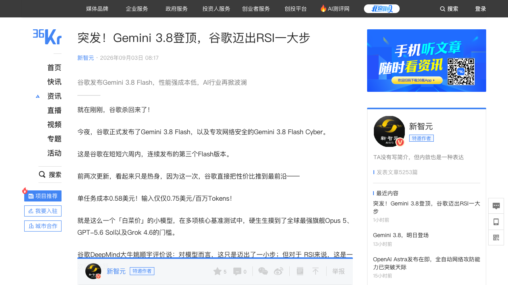
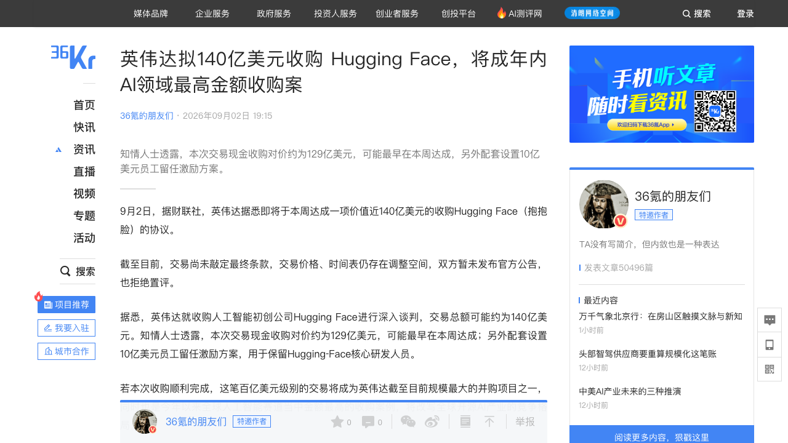
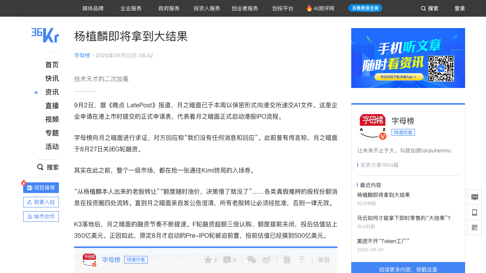
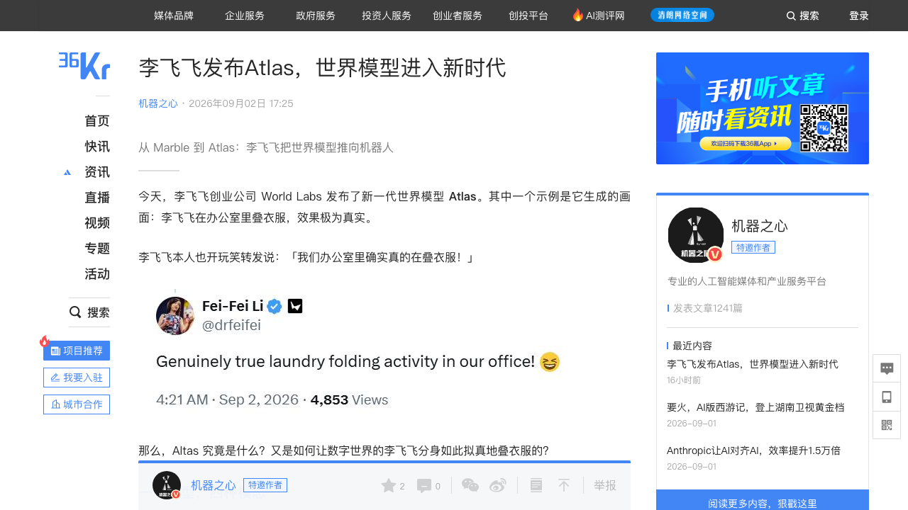
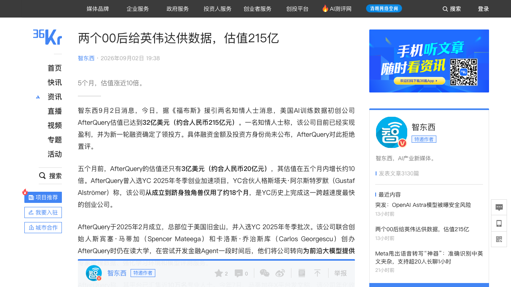
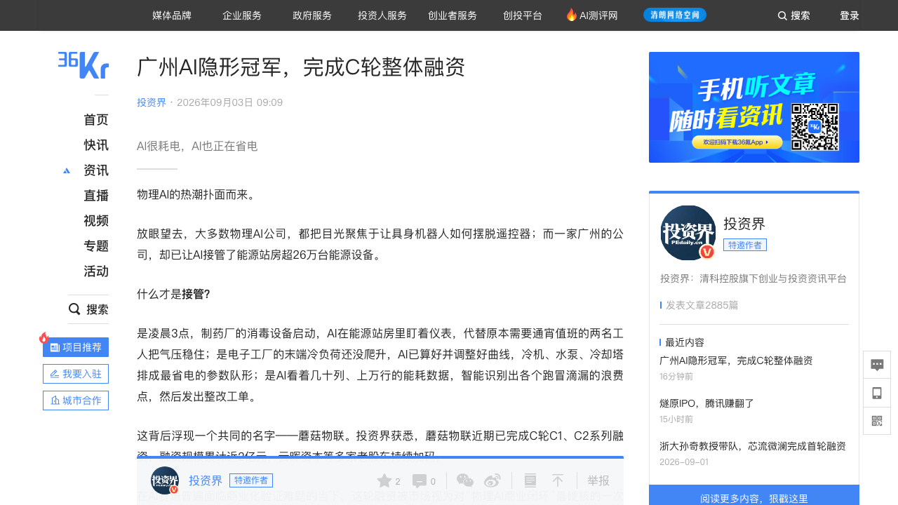

# 0903日报 | AI的「入口争夺战」：谷歌发布Gemini 3.8 Flash「性价比刺客」（9/3 08:17新智元/SiliconAngle：Artificial Analysis智能指数59分逼近GPT-5.6 Sol与Grok 4.6、部分维度超越Claude Opus 5、单任务成本仅0.58美元（输入0.75/输出3.75美元每百万Token）、生成速度305 tokens/s、长周期软件工程DeepSWE v1.1拿73.7%、六周内第三个Flash版本、官方博客「3.8 Flash工作得更努力」用低单价+循环思考硬凑智力、内部代码工具Jetski工程师偏好度反超Opus；网络安全版3.8 Flash Cyber在CyberGym屠榜86.2%、Chrome安全团队正确补丁数达此前最好商业模型2.6倍、Wiz渗透召回率+7.5-9.7个百分点且成本降2.3-5.2倍、谷歌云漏洞团队2小时挖出人类专家需数月的基础性漏洞、仅通过Fairwind计划向受信机构开放；谷歌首次把RSI（递归自我改进）写进发布主线——DeepMind代码突击队+挖来前OpenAI后训练负责人Barret Zoph主管强化学习；但TBench 2.1与4的断层被质疑刷榜、Meta Muse Spark 1.3拿62分还在受限预览并遭Meta CAIO阴阳——谷歌、Anthropic（知识可靠）、OpenAI（深度推理）三国杀走上三条岔路），英伟达拟140亿美元收购Hugging Face（9/2 19:15界面新闻/财联社：129亿美元现金+10亿美元员工留任、可能最早本周达成、将成年内全球AI最高金额收购；Hugging Face托管超300万个模型/100万个数据集/1300万开发者/月活访客1800万/2000+企业付费客户、年化收入约1.5亿美元、今年1月刚拒绝英伟达5亿美元投资邀约、2023年D轮投后45亿美元（如今近3倍）；英伟达从卖铲人变成「开源分发入口」的收编者——Nemotron+HF+CUDA闭环、对冲OpenAI/Anthropic自研芯片；呼应Stripe超70亿美元吞下OpenRouter、Run:ai、Kumo-AI——AI中间层与分发层并购潮起，「AI界GitHub」要姓黄了），月之暗面秘密递表港交所正式启动IPO（9/2晚点LatePost/字母榜9/3 08:42：本周以保密形式递交A1文件、红筹VIE架构调整、联席保荐人中金与高盛、计划走18C特专科技规则；F轮超35亿美元超额3倍认购提前关闭、投后估值350亿美元，原定8月启动的Pre-IPO轮被迫前置、投前估值已摸到500亿美元——43亿到500亿美元仅用8个月，是智谱（42.4亿）/MiniMax（34亿）上市前最后一轮估值的10倍有余；老股转让疯抢到公司发公告「未经批准一律无效」；若Pre-IPO落地2027年初或成智谱、MiniMax之后第三家上市的国产大模型头部——K3在Artificial Analysis排全球第三（57分、仅次于Claude Fable 5与GPT-5.6 Sol）、Code Arena前端盲测登顶、价格不到Fable 5一半，「技术天才的二次加冕」），李飞飞World Labs发布世界模型Atlas（9/2 17:25机器之心：自称「世界上第一个能以像素级相机控制生成图像与视频帧并重建为3D的多模态世界模型」、从零预训练原生吃文本/图像/视频/3D四种模态、核心设计「空间上下文」把相机位姿变成原生输入类型——「坐进导演椅，而不是在拉老虎机的拉杆」；相机可控生成最高1440p/1分钟视频、盲测胜率对MiniMax H3 75%/Gemini Omni Flash 81%/阿里HappyHorse 1.1 86%/FLUX 3 93%/字节Seedance 2.5 94%（作者承认衡量的主要是「原生相机接口vs文本描述运镜」）、稀疏视角3D重建误差25.3优于Pi3X/π³等专用开源模型；2-25张手机照片重建校园航拍、3-5台消费相机做「子弹时间」；机器人Real-to-Sim让「世界与机器人对世界的观测来自同一个模型」——7月收购仿真公司SceniX后战略首次以模型形态落地；未开源仅向少数伙伴开放早期访问、将驱动Marble；资本时间线：2024.9带2.3亿美元走出隐身→2025.11首款产品Marble→2026.1开放World API→2026.2完成10亿美元融资（英伟达/AMD/Autodesk/Fidelity参投、估值约50亿美元）→2026.7收购SceniX→2026.9发布Atlas——世界模型从「生成好看的世界」转向「生成够用的世界」），AfterQuery估值冲到32亿美元（9/2 19:38智东西/福布斯：两位00后创始人（CEO斯宾塞·马蒂加23岁、CTO卡洛斯·乔治斯库22岁、高中相识、沃顿/Meta实习）2025年2月创办、YC W25批次、从做金融Agent转向「为前沿大模型提供专家推理数据+强化学习环境+模型评测」，4月3000万美元A轮投后3亿美元、五个月估值涨约10倍、已盈利且为新一轮确定领投方、18个月成YC史上最快独角兽；平台汇集近10万名验证过的专业人士（工程/医疗/法律/金融）、用定制软件系统做多轮质量校验并先自跑后训练证明数据有效；6月英伟达Nemotron 3 Ultra技术报告点名其为唯一数据合作方（消融实验真实职业评测GDPval 35.3→46.7）、与Thinking Machines Lab及部分中国AI实验室合作、与Legora共建5161案例法律评测集BAR——数据标注正在变成「专家经验工程」，Mercor据报正以200亿美元估值与英伟达洽谈），广州「物理AI」蘑菇物联完成C轮C1/C2系列近2亿元（9/3 09:09投资界：云晖资本等老股东持续加码；AI已接管超26万台云端在线的能源设备、服务超6000家企业、累计省电超36亿度、可释放近20%节能空间、世界500强服务130家；创始人沈国辉2016年从工厂副总下海、十年三阶迭代（设备连接→工业SaaS→灵知AI多源垂模+LingX智能体），云-边-端一体化产品+安全门控；商业模式=产品化（初装费+年度运维费）+服务化（节能效果分成/AI托管）、未来探索Token式API计费；今年7月与三菱旗下上市公司RYODEN达成能效物理AI联合开发合作——中国AI科技企业与全球头部自动化巨头在该领域的首个联合开发，「AI很耗电，AI也正在省电」——物理AI商业闭环第一次可以拿「电费单」审计）

## 今日洞察

今天的五个字：「**AI的『入口争夺战』。**」

**9月2日-3日，六件事指向同一条主线：AI产业的钱与权，正在涌向六个「入口收费站」——谷歌用「便宜+快」抢Agent默认运行时的入口（Gemini 3.8 Flash把旗舰级智能的成本打到单任务0.58美元，还第一次把RSI递归自我改进写进发布会）、英伟达拟花140亿美元买下开源模型分发的入口（Hugging Face这个「AI界的GitHub」）、月之暗面递交港股A1抢中国大模型的资本入口（Pre-IPO投前500亿美元，是智谱/MiniMax上市前估值的10倍）、李飞飞用Atlas抢「空间/物理世界」的入口（一个模型吃文本图像视频3D，相机位姿成为原生输入）、AfterQuery抢「专家经验数据」的入口（RL Scaling时代最稀缺的弹药）、蘑菇物联抢「能源控制」的入口（物理AI最标准化、占总用电30%-60%的场景）。** 昨天日报写AI在「重资产化」——今天看到的是：重资产化之后，谁握着下一层生态的闸机钥匙。对创业者的启示先行：当巨头开始为「入口」付百亿美元级别的对价时，创业公司要么成为某个入口的「独家内容/独家能力供应商」，要么趁入口格局未定抢下一个新入口——六路入口，每一路都还有缝隙。

**① 模型层的竞争从「参数」转向「每秒思考次数×单次成本」：Gemini 3.8 Flash用0.58美元单任务成本摸到旗舰门槛，谷歌把「小模型+快循环」变成新武器，还第一次把RSI写进发布叙事。** 谷歌六周内连发三个Flash版本（9/3 08:17新智元/SiliconAngle），最新3.8 Flash在Artificial Analysis智能指数拿到59分——距离GPT-5.6 Sol和Grok 4.6一步之遥、部分维度反超Claude Opus 5，但单任务成本仅0.58美元、生成速度305 tokens/s（下一档154）、长周期软件工程DeepSWE v1.1达73.7%；官方解释「性能提升源于核心设计选择：3.8 Flash工作得更努力」——遇到难题不摆烂，用极低的基础单价多跑几轮循环思考、自我验证与工具迭代，「算总账依然比直接调一次GPT-5.6便宜」。背后是谷歌把RSI（递归自我改进）第一次放到发布台前：DeepMind组建由CTO领导的代码突击队、布林直接监督，还挖来Thinking Machines Lab联创、前OpenAI后训练负责人Barret Zoph任研究副总裁主管强化学习；内部代码工具Jetski上工程师已更倾向用3.8 Flash而非Opus。同场发布的3.8 Flash Cyber更是「杀手」：CyberGym 86.2%屠榜、Chrome安全团队正确补丁数是此前最好商业模型的2.6倍、Wiz渗透测试召回率+7.5-9.7个百分点且成本降2.3-5.2倍、谷歌云漏洞研究团队用它在2小时内挖出人类顶级专家通常要数月才能发现的基础性漏洞——因破坏力过强不整体开源、仅通过Fairwind计划向受信机构开放。质疑同样存在：Terminal-Bench 2.1与4.0的巨大断层被指有「刷榜」成分，Meta的Muse Spark 1.3（AA 62分）还在受限预览、其CAIO Alexandr Wang公开阴阳谷歌「只能吃尾气」——但「又快又聪明又便宜得不像话」的Flash系路线已确认成为谷歌的主战场。对创业者的启示：①选底座模型要开始算「长任务总成本=单价×循环次数×速度」而不是单Token价（呼应0902日报Fable 5.1缓存降价的同一逻辑，只是这次谷歌把循环次数也打便宜了）；②「便宜到可以默认在场」的模型会把更多任务从人手里接管——应用层的机会从「帮人选模型」变成「帮人设计让模型多跑几轮的工作流」；③RSI从口号变成招聘与组织信号：后训练/强化学习人才（如Barret Zoph式人物）的争夺会白热化。

**② 分发入口易主：英伟达拟140亿美元全资收购Hugging Face——「卖铲人」终于买下了「矿工集市」，AI开源生态的中立性第一次被巨头定价。** 9月2日财联社/界面（9/2 19:15）：英伟达就收购Hugging Face深入谈判，交易总额约140亿美元（现金对价约129亿美元+10亿美元员工留任激励，可能最早本周达成、尚未敲定）；Hugging Face 2016年由三位法国创业者在纽约创办、2018年开源Transformers工具库后转型为「AI领域的GitHub」——托管超300万个公开模型、100万个数据集、汇聚超1300万开发者、月活访客超1800万、2000+企业付费使用Enterprise Hub，Meta/谷歌/DeepSeek/智谱都把这里当模型分发第一渠道，公司年化收入约1.5亿美元；英伟达2023年D轮已是投资人（投后45亿美元，如今报价近3倍），今年1月HF还拒绝过英伟达5亿美元的投资邀约——「拒绝小钱、收下大钱」的剧本。战略意图很直白：拿下开源模型分发入口，补齐「GPU算力+CUDA框架+Nemotron自研模型+模型流通渠道」的产业链闭环；更深一层是防御——OpenAI/Anthropic正加速自研芯片降低对英伟达的依赖，而「开源生态越繁荣、算力需求越分散，单一闭源厂商越难切断基本盘」。加上上半年完成Run:ai收购、6月不低于4亿美元收购Kumo-AI、以及Stripe刚以超70亿美元吞下OpenRouter——AI「中间层/分发层」正在成为巨头并购的重灾区（呼应0901日报的「模型版税」：上游开始系统性地买「路」收「过路费」）。对创业者的启示：①模型/数据/工具的分发渠道正在被巨头收编，「托管在HF=站在中立广场」的假设要重新评估，多渠道分发（自有站点+多平台）应提前布局；②中间层与入口型公司（路由、评测、数据集市、插件市场）的估值锚被巨头抬高——这是创业公司「卖公司」的窗口期；③反垄断审查预期强烈（软硬件生态合并风险），交易落地节奏与附加条件值得跟踪。

**③ 中国大模型的资本化进入「第三棒」：月之暗面秘密递表港交所、Pre-IPO投前估值500亿美元——是智谱、MiniMax上市前估值的10倍以上，一级市场正在为「稀缺标的」支付极端溢价。** 9月2日晚点LatePost（字母榜9/3 08:42）：月之暗面本周以保密形式向港交所递交A1文件、正式启动港股IPO，红筹VIE架构调整中，联席保荐人中金与高盛，计划走主板18C特专科技规则；此前F轮融资超35亿美元、超额3倍认购提前关闭、投后估值350亿美元，原定8月启动的Pre-IPO轮被迫前置、投前估值摸到500亿美元——从43亿美元到500亿美元只用了8个月，而智谱、MiniMax登陆港股前最后一轮一级市场估值分别只有42.4亿和34亿美元；一级市场「抢Kimi终局入场券」抢到公司发公告：所有老股转让必须经批准、否则一律无效。底气是K3：Artificial Analysis 57分全球第三（仅次于Claude Fable 5与GPT-5.6 Sol）、Code Arena前端编程盲测1679分登顶、2.8万亿参数、价格不到Fable 5一半（发布当天智谱跌28.49%、MiniMax跌15.62%，外媒称之为「DeepSeek 2.0时刻」）。若顺利，月之暗面有望2027年初成为继智谱、MiniMax之后第三家上市的国产大模型头部（股东含阿里、腾讯、美团龙珠、红杉中国、IDG及社保基金、中国移动产业基金等）。对创业者的启示：①18C特专科技通道+红筹VIE已成为中国AI公司标准上市路径，资本化节奏要提前18个月设计；②「老股转让需审批」的治理条款会成为Pre-IPO公司的标配（防止股东套利扰乱定价）；③上市后智谱、MiniMax、月之暗面将第一次在公开市场同台——「模型即产品」的财报叙事（呼应0902日报智谱半年报）会被资本市场反复检验。

**④ 世界模型第一次「够用」：World Labs发布Atlas，把重建、生成、仿真收进同一个模型——李飞飞团队的商业化转向清晰指向机器人与物理世界。** 9月2日机器之心（9/2 17:25）：World Labs发布新一代世界模型Atlas，自称「世界上第一个能以像素级相机控制生成图像与视频帧、并将其重建为3D的多模态世界模型」——从零预训练、原生处理文本/图像/视频/3D四种模态；核心设计是「空间上下文」：每一张输入图像都被锚定在三维空间的具体位置、相机位姿成为原生输入类型（创作者「坐进导演椅，而不是在拉老虎机的拉杆」）。四大能力：相机可控生成（1-6张参考图按指定机位生成新视角、最高1440p/1分钟视频）、空间重建（输出新视角+点云+3D高斯泼溅）、时空模拟（视频重构图与机器人Real-to-Sim）、图像生成（文生图/360全景）。评测：相机可控生成盲测对MiniMax H3胜率75%、Gemini Omni Flash 81%、阿里HappyHorse 1.1 86%、FLUX 3 93%、字节Seedance 2.5 94%（World Labs自述对比模型不支持原生相机输入，衡量的主要是「原生相机接口vs文本描述运镜」的差距）；稀疏视角3D重建误差25.3优于Pi3X（28.7）/π³（34.7）等「最好的开源专用重建模型」；2-25张手机照片即可重建斯坦福校园航拍、3-5台消费相机拍出子弹时间。机器人线最值得注意：用手机视频扫描环境、让Atlas生成机器人机身相机每一步应看到的RGB与深度——「世界和机器人对世界的观测来自同一个模型」，传统Real-to-Sim两套系统在接缝处累积误差的问题被绕开（7月刚收购仿真公司SceniX，这是收购后战略首次以模型形态落地）。未开源、仅向少数合作伙伴开放早期访问。资本节奏密集：2024.9带2.3亿美元走出隐身→2025.11 Marble→2026.1 World API→2026.2完成10亿美元融资（英伟达/AMD/Autodesk/Fidelity、估值约50亿美元）→2026.7 SceniX→2026.9 Atlas。对创业者的启示：①世界模型的商业化主线从「生成好看的世界」（影视/游戏）转向「生成够用的世界」（机器人训练数据/仿真）——具身智能的「数据工厂+仿真环境」是确定性卖铲位；②原生相机控制会让影视/3D工作流的「导演语言」被重写（运镜从文本提示变成几何输入），视频模型竞争的下一站是3D与空间一致性；③「重建+生成+仿真同一模型」的架构路线，值得所有做空间智能的团队对照研究。

**⑤ 融资侧双主线：数据层与物理层。「专家经验」成为RL Scaling时代最稀缺的训练数据，AfterQuery 5个月估值涨10倍到32亿美元；物理AI的「能效入口」被老股东用真金白银验证——蘑菇物联C轮近2亿元、AI已经替6000家企业看管能源设备、省下36亿度电。** AfterQuery（9/2 19:38智东西/福布斯）：两个00后（23岁CEO+22岁CTO、高中相识、Meta实习）2025年2月创办、从金融Agent转做「专家推理数据」，4月3000万美元A轮投后3亿美元、5个月估值约10倍到32亿美元、已盈利且新一轮领投方已定；平台汇集近10万名验证过的专业人士（工程/医疗/法律/金融），用定制软件做多轮质量校验、交付前先自跑后训练「用模型成绩说话」；6月英伟达Nemotron 3 Ultra技术报告点名其为唯一数据合作方（消融实验：加入其数据后真实职业评测GDPval从35.3涨到46.7）、与Mira Murati的Thinking Machines Lab及部分中国AI实验室合作——数据标注正从「廉价人工贴标」变成「专家经验工程」，同赛道Mercor据报正以200亿美元估值与英伟达洽谈。蘑菇物联（9/3 09:09投资界）：广州公司、创始人沈国辉1982年生（数学+管理科学出身、做过冰箱洗衣机事业部副总），十年三阶迭代（设备连接→工业SaaS→灵知AI垂类大模型+LingX智能体），C轮C1/C2系列累计近2亿元、云晖资本等老股东加码；AI已接管超26万台云端实时在线的能源设备（空压机/制冷机/水泵/风机——跨行业通用），服务超6000家企业、累计省电超36亿度、可释放近20%节能空间、世界500强中服务130家；商业模式=产品化（初装费+年度运维费）+服务化（节能分成/AI托管），还在探索Token式API计费；今年7月与三菱旗下上市公司RYODEN达成能效物理AI联合开发（中国AI企业与全球头部自动化巨头在该领域的首个联合开发）。对创业者的启示：①「推理数据/专家经验」是继基础标注、合成数据之后的第三代数据生意——做数据的人要能证明「我的数据让模型涨分」（像AfterQuery先自跑后训练再交付）；②物理AI的「验货标准」开始清晰（沈国辉给出两条：有AI可视化界面让数据与执行一一对应+垂类模型完成国家网信办备案）——讲故事的时代结束；③「AI很耗电，AI也正在省电」：能效是物理AI最标准化、最易收费的入口（综合能源系统占总用电30%-60%、年节能价值空间约2400亿元），且老股东加码+500强复购是比融资金额更硬的信任票。

**六个信号同样关键**：① **艾斐智药完成亿元级天使轮**（9/3 08:00 36氪首发：清华AIR兰艳艳教授/张亚勤院士课题组孵化、2026年7月成立、襄禾资本领投、智谱旗下星连资本及某知名产业基金跟投；「AI Native新药研发」——自研DrugCLIP药物基础模型（双塔对比学习把蛋白-分子映射进高维表征空间、单台服务器一天10万亿次蛋白-分子配对、千亿级化合物库秒级检索、部分靶点命中率60%-80%）+PharmAgents药物研发智能体引擎（处理冲突/不完备多源证据、自主调用工具提假设）；进展最快的ADHD自研管线已进Pre-PCC、与5家以上药企以Co-development模式共研——AI4S第三代叙事：让AI承担研发决策，不只是工具）；② **海外AI安全「双响炮」**（9/2 TC/SA：HiddenLayer完成1亿美元B轮——Delta-v Capital领投、Ten Eleven/Morgan Stanley/Microsoft M12/Booz Allen参投、累计融资约1.56亿美元，主打「检查模型与依赖包防篡改」，新钱投向Agentic Runtime Security与面向自主编程Agent的Agent Harness Security，ARR一年涨超10倍、超90%来自新客户，客户含国防部与情报机构；Huskeys获2700万美元A轮——Unit 8200老兵Itai Gafni/Roy Weisfeld 2025年创办，读取WAF/CDN/负载均衡配置的边缘安全——「Agent时代的安全入口」正被密集下注，呼应0902日报AIR Security 5000万美元两轮种子）；③ **海外两笔「自动化/机器人感知」C轮**（9/2 TC/SA：Wonderful完成5.5亿美元C轮、估值50亿美元——以色列-荷兰、2025年初创立、客服AI Agent起家主打非英语市场、现推「Wonderful AI OS」连接Agent/工作流/数据且兼容任意模型、覆盖35+国家、Insight Partners连续领投、Salesforce首投、6个月估值翻倍；Lyte AI完成1.65亿美元C轮、估值16亿美元——Maverick Silicon领投、1月隐身启动、8个月冲到16亿美元、做「让机器人看得准」的感知——自动化与机器人的「入口」同样在被资本定价）；④ **OpenAI Astra「发布前刷屏」**（9/2 The Information/TC/智东西/AI前线：Astra将采用名为「recurrent depth（循环深度/opaque recurrence）」的推理技术——同一查询在循环中处理多次、留下的思维痕迹更少、可绕开传统思维链记录，Redwood CEO Buck Shlegeris称「extremely concerned」；AI前线称循环Transformer让3.5B小模型追平50B大模型、「用计算深度换参数规模」——深度推理的成本战与可解释性争议同步升级，0831日报曾写Astra灰测、本次是新架构细节+安全争议的新动态）；⑤ **美国政府站队OpenAI版权案**（9/2 TC：特朗普政府在《纽约时报》诉OpenAI案中提交20页法庭之友意见书、为OpenAI未经授权用版权材料训练辩护——「美国对继续发展强健的AI产业有强烈利益」——训练数据版权立场出现政策级反转信号，直接影响中国AI公司出海的训练数据合规预期）；⑥ **服务机器人公司优地机器人启动招股**（9/2 雷帝触网：拟募资8亿元、9月9日上市、年营收约3亿元仍亏约1亿元、商汤认购200万美元/58同城认购100万美元作基石——继人形机器人供应链融资潮（0831日报弓望传感）后，中国机器人公司的IPO通道也在验证）。

---

## 1. [谷歌发布Gemini 3.8 Flash与网络安全版3.8 Flash Cyber：六周内第三个Flash版本、Artificial Analysis智能指数59分逼近GPT-5.6 Sol与Grok 4.6（部分维度反超Claude Opus 5）、单任务成本仅0.58美元（输入0.75/输出3.75美元每百万Token）、生成速度305 tokens/s、长周期软件工程DeepSWE v1.1拿73.7%；Cyber版在CyberGym屠榜86.2%、Chrome安全团队正确补丁数达此前最好商业模型2.6倍、Wiz渗透召回率+7.5-9.7个百分点且成本降2.3-5.2倍、谷歌云漏洞团队2小时挖出人类专家需数月的基础性漏洞、仅通过Fairwind计划向受信机构开放；谷歌首次把RSI（递归自我改进）写进发布主线：DeepMind组建CTO领导的代码突击队、布林直接监督、挖来前OpenAI后训练负责人Barret Zoph主管强化学习；「3.8 Flash工作得更努力」=用0.75美元/百万Token的极低单价多跑循环思考与工具迭代来硬凑智力；但TBench 2.1与4.0断层被质疑刷榜、Meta Muse Spark 1.3（AA 62分）受限预览中且其CAIO公开阴阳——Anthropic（知识可靠）、OpenAI（深度推理）、谷歌（廉价快循环Agent）三国杀走上三条岔路](https://36kr.com/p/3966935532412416)（新产品 / 模型层新战争维度：把「单次推理成本×循环次数×速度」打成新武器，谷歌六周三连发Flash、首次把RSI写进发布叙事——「小模型+快循环」开始抢旗舰饭碗）

🔗 链接：[36氪·突发！Gemini 3.8登顶，谷歌迈出RSI一大步（新智元）](https://36kr.com/p/3966935532412416) | [36氪·Gemini 3.8 Flash 光速发布：干活挺勤快，就是没开窍（爱范儿）](https://36kr.com/p/3966847977905669) | [SiliconAngle·Google launches two Gemini 3.8 models with cutting-edge reasoning capabilities](https://siliconangle.com/2026/09/02/google-launches-two-gemini-3-8-models-with-cutting-edge-reasoning-capabilities/)

**动态**：**9月3日晨（北京时间08:17新智元、SiliconAngle 9/3 00:04 UTC），谷歌正式发布Gemini 3.8 Flash与专攻网络安全的Gemini 3.8 Flash Cyber——这是谷歌短短六周内连续发布的第三个Flash版本，被开发者戏称「拿着Flash的价格、干着Pro的活」。** 关键信息：① **性价比断层**：Artificial Analysis高推理模式下智能指数冲到59分——距GPT-5.6 Sol与Grok 4.6仅一步之遥、部分维度反超Claude Opus 5，而单任务成本只有0.58美元（输入0.75/输出3.75美元每百万Token）、生成速度305 tokens/s（下一档只有154）；长周期软件工程基准DeepSWE v1.1拿73.7%，在「智力-成本」帕累托前沿上把第二名甩开一条街；② **「工作得更努力」路线**：谷歌官方博客明说性能来自设计选择——3.8 Flash面对复杂任务会执行额外推理步骤、不断迭代调用工具，通过消耗更多Token在内部高速自我验证与反思；由于基础单价极低，「算总账依然比直接调一次GPT-5.6便宜得多」——用「低单价×多循环」打破「大参数=强能力」的单一维度竞争（内部代码工具Jetski上工程师已更倾向用它而非Opus）；③ **RSI叙事**：谷歌DeepMind组建由CTO领导的代码突击队、联创谢尔盖·布林直接监督，目标是「把编程模型硬改造成全自动AI研究员」；同时挖来Thinking Machines Lab联创、曾任OpenAI后训练负责人的Barret Zoph出任研究副总裁、主管强化学习与后训练——上个月Demis Hassabis卸任CEO、接棒的Koray Kavukcuoglu上任就喊「提速提速再提速」；④ **Cyber版屠榜**：3.8 Flash Cyber在漏洞发现基准CyberGym拿86.2%直接登顶；谷歌内部横跨20种编程语言的复杂代码库测试中漏洞发现成功率超70%；Chrome安全团队实测其生成正确修复补丁数是此前最好且大得多的商业模型的2.6倍；Wiz安全公司测试渗透召回率+7.5-9.7个百分点、成本降2.3-5.2倍；谷歌云漏洞研究团队用它在2小时内发现一个关键基础性漏洞——以往人类顶级专家通常需要几个月；因破坏力过强，Cyber版不整体开源、仅通过全新的Fairwind计划向受信机构开放（呼应0902日报Anthropic Mythos 5.1白名单模式，网安模型「限流分发」正成为共识）；⑤ **争议**：3.8 Flash在Terminal-Bench 2.1/HLE超越GPT-5.6 Sol与Opus 5，但TBench 2.1与4.0的巨大分数断层被指存在「刷榜」成分——面对未进入训练集的Zero-shot挑战大概率仍不如Opus 5这类参数巨兽；Meta的Muse Spark 1.3在AA智能指数拿62分（与Claude Fable 5持平、高于3.8 Flash）、输入成本比Fable 5低8倍，但仍在受限预览，Meta CAIO Alexandr Wang公开阴阳「Gemini啥也不是，只能吃尾气」；⑥ **版本节奏内幕**：3.5 Pro候选模型内部被「毙掉」（不比Flash系强出足够身位）、Gemini 4卡在后训练——阴差阳错造就了Flash系疯狂迭代，也意味着谷歌把「跑量」当成当前主战场。

**做什么的**：通俗讲，**这是「谷歌杀回来了——一个便宜到0.58美元、快得像不要钱的『小模型』，在核心基准上摸到了全球最强旗舰的门槛；它还带了个专攻网络安全的孪生兄弟，2小时能挖出人类专家要挖几个月的漏洞；谷歌甚至第一次把『让AI自己改进AI（RSI）』写进了发布会PPT。」** 一句话：当别人还在比谁最聪明，谷歌开始比谁「又便宜又快还能循环思考」——这是Agent时代最实用的组合拳。

**为什么值得关注**：

- **模型层竞争维度变了：「单Token价格」让位于「长任务总成本=单价×循环次数×速度」。** Fable 5.1（0902日报）把缓存读取降价75%，谷歌3.8 Flash把「循环思考本身」打便宜——两者都指向同一判断：未来主流负载是连续运行几小时、反复调用工具的Agent，不是单轮问答。对创业者的启示：① 选底座模型要按「让Agent跑完一个任务的总账单」算账，输入/输出单价、缓存价、速度、循环深度四要素缺一不可；② 「便宜到可以默认在场」的模型会系统性接管更多原本需要人盯着的工作流——应用层的机会从「帮人选模型」变成「帮人设计让模型多跑几轮的工作流与验证闭环」；③ 长上下文+高并发场景（代码库分析、多轮长对话Agent）是这轮性价比红利的最大受益者。

- **RSI（递归自我改进）第一次成为发布主线——「后训练军备竞赛」正式开打。** 谷歌把代码突击队、Barret Zoph的挖角、布林亲自监督写进发布叙事，目标是把编程模型变成「全自动AI研究员」——模型自己写代码、自己跑评测、自己改进自己。对创业者的启示：① 关注「模型改进模型」从实验室走向产品化的拐点——所有依赖「人工调Prompt/微调」的中间层生意都可能被压缩；② 强化学习/后训练人才成为最稀缺资产（呼应0831日报OpenAI买Mac mini跑RL、0901日报DeepSeek思考时间暴涨的成本压力——「会训练」正在比「会预训练」更值钱）。

- **网安模型进入「双轨制」：能力越强的攻防模型越不开放。** 3.8 Flash Cyber仅通过Fairwind计划向受信机构开放，与Anthropic Mythos 5.1白名单（0902日报）、OpenAI Astra被曝「漏洞利用满分」（今日信号④）同频——网络安全正在成为前沿模型「受控发布」的第一试验场。对创业者的启示：① 「AI对抗AI」的安全产品（漏洞挖掘、渗透测试、补丁生成）进入能力红利期，但要注意获取门槛（受信机构白名单）；② 做安全产品的创业公司可借力这些「半开放」模型建立自己的受信交付体系——合规与信任本身是护城河。

- 对创业者的启发：**① 用「长任务总成本+速度」重选模型底座、按「循环友好」重做架构；② 把后训练/RL能力纳入团队建设与估值叙事；③ 关注「受控发布的网安模型」带来的安全产品窗口。** 跟踪三个验证点：3.8 Flash在生产环境对Opus/GPT-5.6的份额侵蚀速度、Meta Muse Spark 1.3正式开放后的价格战走向、谷歌RSI工具链是否向开发者开放。

**类比参考**：**「模型战争的『性价比刺客』/ 从『拼参数』到『拼每秒思考次数×单次成本』——当谷歌用0.58美元的单任务成本摸到GPT-5.6 Sol与Grok 4.6的门槛、把『便宜到可以循环思考』变成新武器，大模型第一次像『算力普惠』的工业品在定价：昨天Anthropic讲『把长时间工作做便宜』（0902），今天谷歌讲『把循环思考做便宜』——AI竞争正在从『谁的脑子最好』转向『谁能让脑子一直转下去还付得起电费』（呼应0901日报Kimi K3要30%版税、DeepSeek V4思考时间暴涨的成本账——模型的『单位思考成本』正在成为行业新的定价语言）**

---

## 2. [英伟达拟140亿美元收购Hugging Face：9月2日财联社/界面新闻——现金对价约129亿美元+10亿美元员工留任激励、可能最早本周达成（尚未敲定、无官方公告），将成为英伟达史上最大并购之一、年内全球AI最高金额收购；Hugging Face「AI领域的GitHub」：托管超300万个公开模型、100万个数据集、1300万+开发者、月活访客超1800万、注册用户约500万、2000+企业付费使用Enterprise Hub（Meta/谷歌/DeepSeek/智谱均以这里为模型分发第一渠道），年化收入约1.5亿美元；今年1月刚拒绝英伟达5亿美元投资邀约、2023年D轮投后估值45亿美元（如今报价近3倍）；英伟达意图=拿下开源分发入口补齐「GPU+CUDA+Nemotron+渠道」闭环、并防御OpenAI/Anthropic自研芯片（开源生态越繁荣算力需求越分散）；呼应Stripe超70亿美元吞下OpenRouter、英伟达上半年完成Run:ai收购+6月不低于4亿美元收购Kumo-AI——AI「中间层/分发层」并购潮起，市场预期将迎美国反垄断严格审查](https://36kr.com/p/3966094074600965)（行业洞察 / 分发入口易主：卖铲人买下矿工集市——当开源模型分发的「中立广场」被巨头定价，AI开源生态与创业公司的分发依赖一起进入不确定期）

🔗 链接：[36氪·英伟达拟140亿美元收购 Hugging Face，将成年内AI领域最高金额收购案（界面新闻/财联社）](https://36kr.com/p/3966094074600965)

**动态**：**9月2日（财联社，36氪/界面新闻19:15转载），英伟达据悉即将于本周达成一项价值近140亿美元的收购Hugging Face协议——现金收购对价约129亿美元，另配10亿美元员工留任激励用于保留核心研发人员；交易尚未敲定最终条款、价格与时间表仍有调整空间，双方未发公告并拒绝置评。** 关键信息：① **HF的家底**：2016年由三名法国创业者在纽约创办，最初想做青少年聊天机器人，2018年开源Transformers工具库后转型为面向全球开发者的AI模型共享协作平台——目前托管超300万个公开AI模型、100万个数据集、汇聚超1300万开发者、月活访客超1800万、注册用户约500万、超2000家企业付费使用Enterprise Hub；Meta、谷歌、DeepSeek、智谱等海内外开源模型团队都把这里当模型对外分发与版本迭代的首要渠道；去年4月收购法国开源机器人公司Pollen Robotics开始卖机器人，加上企业托管、推理部署、定制开发等商业服务，外媒测算年化营收约1.5亿美元且增速很快；② **资本轨迹**：英伟达2023年HF的D轮就是投资方（同期参投还有谷歌、亚马逊、英特尔、Salesforce，投后估值45亿美元），如今140亿美元报价约为当时的3倍；今年年初HF还拒绝过英伟达5亿美元的投资邀约——「拒绝小钱、收下大钱」；③ **战略意图三层**：最直接是拿下全球开源模型分发核心入口，补齐从GPU算力硬件、CUDA开发框架到上层模型流通渠道的产业链闭环，让算力产品直达开源模型研发群体；更深一层是防御——OpenAI、Anthropic正加速自研AI服务器芯片以降低对英伟达GPU的依赖，而英伟达的核心判断是「开源AI生态越繁荣、全球算力需求越分散，单一闭源厂商的自研芯片就越难切断基本盘」；再结合Nemotron开源模型项目，形成硬件算力+自研模型+开源社区三位一体；④ **并购节奏**：英伟达今年上半年完成以色列算力调度厂商Run:ai收购（已获欧盟批准）、6月以不低于4亿美元完成对预测AI初创Kumo-AI的全资收购；而在更广的市场上，Stripe刚以超70亿美元吞下AI模型路由平台OpenRouter——硅谷AI「中间层/分发层」成为巨头争抢的目标赛道；⑤ **风险提示**：市场分析认为交易落地后还将迎来美国反垄断机构的严格审查，软硬件生态合并带来的市场竞争风险是监管重点评估方向。

**做什么的**：通俗讲，**这是「全球最大的AI芯片公司，准备花140亿美元把『AI界的GitHub』——那个托管着300多万个模型、1300万开发者的开源分发平台——整个买下来。Hugging Face今年1月还拒绝过英伟达5亿美元的小投资，现在可能要收下20多倍的价钱；而对全世界用开源模型的创业公司来说，最扎心的问题是：以后模型下载、分发、社区讨论的中立广场，要姓黄了。」** 一句话：卖铲人终于买下了矿工集市。

**为什么值得关注**：

- **开源生态的「中立性」第一次被巨头定价——分发渠道正在变成战略资产。** Hugging Face长期扮演「AI开源世界的基础设施」，各家（包括DeepSeek、智谱、Meta、谷歌）都把它当默认分发渠道。一旦归入英伟达，渠道中立性必然被质疑：英伟达会不会让HF偏向自家Nemotron、会不会把「下载量/热度榜」变成算力营销工具？对创业者的启示：① 把模型/数据托管在单一第三方平台=把分发命脉交给别人，应尽早建立「自有站点+多平台」的分发矩阵；② 开源社区的「治理权」与「渠道权」分离是伪命题——钱在哪，权就在哪；③ 对被巨头收编的平台型公司（模型库、评测榜、插件市场）来说，这是估值锚抬升的窗口期（Stripe/OpenRouter的70亿美元就是参照系）。

- **英伟达的防御逻辑值得所有「生态位公司」学习：当你的客户开始自研上游，就去买下游。** OpenAI/Anthropic自研芯片直接威胁英伟达的基本盘，英伟达的选择不是降价硬拼，而是把「开源生态的繁荣度」变成自己的护城河——开源越繁荣、模型越多、算力需求越分散，任何单一闭源玩家都难以垄断需求。对创业者的启示：① 面对被上游客户「垂直整合」的威胁，控制「下游生态/分发渠道」是经典的反制路径；② 「生态位生意」的估值取决于你卡住的节点是否不可绕行——HF卡住的是「模型分发」，你的公司卡住的是什么？

- **AI并购进入「中间层时刻」：模型层格局初定，巨头开始买路。** Stripe买OpenRouter（模型路由）、英伟达买HF（模型分发）+Run:ai（算力调度）+Kumo（预测AI）、再加上0902日报Anthropic的800亿算力租约与IPO传闻——AI产业的钱正从「模型训练」流向「基础设施与通道」。对创业者的启示：① 做「中间层」（路由、评测、数据、安全、可观测）的团队，现在的并购估值环境是过去两年最好的；② 反过来，依赖某个中间层（如只靠OpenRouter分发、只靠HF托管）的产品要有Plan B。

- 对创业者的启发：**① 立即评估自身对HF/OpenRouter等单一分发渠道的依赖并做多平台备份；② 把「分发矩阵+自有渠道」写进开源产品的增长设计；③ 关注反垄断审查对交易结构与时间表的影响。** 跟踪三个验证点：交易是否本周官宣、HF的企业托管与商业化团队去留、Meta/谷歌/DeepSeek等大厂是否加速自建分发渠道作为对冲。

**类比参考**：**「开源世界的『广场收购案』/ 从『中立平台』到『巨头基础设施』——当英伟达把140亿美元拍在Hugging Face桌上，AI开源生态第一次面对『分发入口被收编』的现实：就像GitHub如果被某家云厂商买走、PyPI被芯片公司控股，开发者社区的『中立假设』瞬间失效（呼应0830日报OpenAI断供Cursor的『不拥有模型就不拥有决定权』——现在轮到『不拥有渠道就不拥有分发权』；以及0901日报Stripe吞下OpenRouter——AI的路，正在一条条被巨头买下来收费）**

---

## 3. [月之暗面本周以保密形式向港交所递交A1文件、正式启动港股IPO：9月2日晚点LatePost报道、字母榜9/3 08:42长文复盘（公司回应「没有任何消息和回应」）；红筹VIE架构调整中、联席保荐机构锁定中金与高盛、计划遵循港交所主板18C特专科技规则；融资节奏：F轮募超35亿美元、超额3倍认购提前关闭、投后估值350亿美元，原定8月启动的Pre-IPO轮（坊间称G轮、8/27有传闻关闭）被迫前置、投前估值已摸到500亿美元——从43亿到500亿美元仅用8个月；一级市场「抢Kimi终局入场券」抢到公司发公告：所有老股转让必须经批准否则一律无效；对比智谱（上市前最后一轮42.4亿美元）、MiniMax（34亿美元），月之暗面Pre-IPO投前估值是两者10倍有余；若落地有望2027年初成为继智谱、MiniMax之后第三家上市的国产大模型头部（股东含阿里、腾讯、美团龙珠、红杉中国、IDG及社保基金、中国移动产业基金等国家队）；底气=K3：Artificial Analysis综合57分全球第三（仅次于Claude Fable 5与GPT-5.6 Sol）、Code Arena前端编程盲测1679分登顶、2.8万亿参数、价格不到Fable 5一半（发布当天智谱跌28.49%、MiniMax跌15.62%、外媒称「DeepSeek 2.0时刻」）；叙事弧线：2023.10 Kimi Chat 20万字上下文→2024年200万字爆火与5.3亿元季度投流→2025年初DeepSeek R1冲击（放弃C端流量内卷、all in基座模型、16个月融资空窗）→K2（全球首个万亿参数开源MoE）/K2.5（Agent集群、ARR破1亿美元）→K3技术登顶+商业化闭环——「技术天才的二次加冕」，从「中国的OpenAI」到不回避「超越Anthropic」](https://36kr.com/p/3966927971325573)（行业洞察 / 中国大模型资本化第三棒：一级市场正在为「稀缺标的」支付极端溢价——500亿美元Pre-IPO估值=智谱/MiniMax上市前估值的10倍，18C+红筹VIE成为国产大模型标准上市路径）

🔗 链接：[36氪·杨植麟即将拿到大结果（字母榜，转晚点LatePost消息）](https://36kr.com/p/3966927971325573)

**动态**：**9月2日，据晚点LatePost报道，月之暗面已于本周以保密形式向港交所递交A1文件——这是企业申请在港上市的正式申请表，代表月之暗面正式启动港股IPO流程；字母榜向公司求证，对方回应「我们没有任何消息和回应」，此前已有传言称其8月27日关闭G轮融资。** 关键信息：① **上市架构**：为推进上市已启动红筹VIE架构调整，联席保荐机构锁定中金与高盛，计划遵循港交所主板18C特专科技规则（特专科技公司上市通道）；② **融资与估值**：K3发布不到两周公司完成F轮、募得超35亿美元、认购金额超出原定目标3倍有余、融资直接提前关闭、投后估值来到350亿美元；原定8月才启动的Pre-IPO轮被迫提前开闸，投前估值已升至500亿美元——从43亿美元（2025年底K2.5后的估值起点）到500亿美元仅用8个月；③ **市场抢筹**：整个一级市场都在抢「通往Kimi终局的入场券」——「从杨植麟本人出来的老股转让」「额度随时涨价、决策慢了就没了」等真假难辨的股权消息在投资圈流转，直到公司亲自发公告澄清：所有老股转让必须经批准、否则一律无效；④ **稀缺性定价**：智谱、MiniMax登陆港股前最后一轮一级市场估值分别为42.4亿美元与34亿美元——月之暗面Pre-IPO投前估值是两者的10倍有余；错过前两家份额的机构将其视作核心可投筹码；⑤ **技术底气**：K3参数规模2.8万亿（当时全球最大开源模型）、在Artificial Analysis综合评测以57分排全球第三（仅次于Claude Fable 5和GPT-5.6 Sol）、Code Arena前端编程盲测拿1679分登顶；K3发布当天智谱股价跌28.49%、MiniMax跌15.62%，美股AI板块明显回撤、英伟达短暂丢掉全球市值最高公司头衔，外媒称之为「DeepSeek 2.0时刻」；K3价格不到Anthropic旗舰Fable 5的一半；⑥ **股东结构**：成立三年股东覆盖阿里、腾讯、美团龙珠、红杉中国、IDG等一线机构，社保基金、中国移动产业基金等「国家队」也已入场；⑦ **叙事弧线（字母榜复盘）**：2023年10月Kimi Chat以20万字无损上下文出道→2024年扩到200万字爆火出圈、四季度投流高达5.3亿元（「投流狂魔」标签）→2025年1月DeepSeek R1横空出世（上线两周日活破3000万），C端逻辑被击穿、公司陷入16个月融资空窗→杨植麟两次关键取舍：放弃C端流量内卷、all in基座模型，并在深度思考被DeepSeek抢占后转攻Agent制高点（「中国最接近Anthropic技术范式的玩家之一」）→K2（全球首个万亿参数开源MoE）→K2.5（首次引入Agent集群/Orchestrator、发布不到20天收入超2025全年、一个月后ARR破1亿美元、API收入占总营收70%以上）→K3全球第三+价格战破局→GTC 2026主会场演讲（唯一中国独立大模型创始人）。

**做什么的**：通俗讲，**这是「Kimi的母公司月之暗面正式踏上港股IPO之路——本周已秘密递交上市申请，上市前最后一轮融资的估值已经喊到500亿美元，是已上市的智谱和MiniMax上市前估值的10倍以上。一年半前它还背着『投流狂魔』的标签被DeepSeek打得找不着北，如今靠K3在全球模型榜上排第三、价格只有对手一半——杨植麟从『至暗时刻』走到了『大结果』的门前。」** 一句话：一级市场为「稀缺标的」支付的极端溢价，即将在港交所接受公开定价。

**为什么值得关注**：

- **中国大模型公司进入「上市三缺一」的最后阶段——公开市场将第一次给国产基座模型定价。** 智谱、MiniMax已登陆港股，月之暗面若按500亿美元Pre-IPO落地、2027年初上市，三家将首次在公开市场同台：智谱刚交出的半年报（0902日报：收入9.54亿+399.7%、API占比86.5%）给「模型即产品」立了标尺，MiniMax有C端与社交陪伴的基本盘，月之暗面则押注「Agent+开发者生态+海外收入」。对创业者的启示：① 国产大模型的资本故事已从「融资竞赛」切换成「公开财报竞赛」——「ARR/收入结构/毛利率」会成为唯一语言（呼应0902日报智谱毛利率50%→26.4%的拷问）；② 18C+红筹VIE是标准路径，公司治理（老股转让审批）要提前设计。

- **500亿美元 vs 42亿/34亿美元——同一个赛道，10倍估值差的来源是「稀缺性」与「叙事」的双重溢价。** 智谱与MiniMax上市后二级市场的表现（尤其智谱8/31财报后、K3冲击下的股价波动）并没有吓退一级市场对月之暗面的狂热——机构逻辑是：错过前两家的钱需要一个「最后的国产大模型标的」。对创业者的启示：① 「赛道内最后一个未上市头部」本身就是稀缺性溢价——时间窗口与卡位有时比基本面更能决定估值；② 但这种溢价依赖「AI信仰」的流动性，一旦公开市场情绪反转（今日投资界标题已在讨论「9月AI投资情绪要大转弯」），Pre-IPO估值与上市定价可能脱锚——老股转让乱象与公司紧急公告正是泡沫的注脚。

- **从「投流狂魔」到「技术信仰」的叙事反转，是2026年最值得研究的创业公司战略案例。** 字母榜复盘的关键不是K3多强，而是杨植麟在至暗时刻的两次取舍：砍掉C端买量（投流规模骤降七成）、放弃与DeepSeek在「深度思考」上硬碰硬、转攻Agent与编程制高点，并all in基座模型——用16个月空窗期换来了技术路线的复利。对创业者的启示：① 当你的赛道被「免费+更强」的对手击穿时，与其在旧维度加注，不如换一个对手还没封死的维度（Agent/Coding）重开一局；② 「长期主义」只有在技术路线被验证后才会被追认——在此之前它叫「固执」；③ K3的「卖复杂任务解决能力、跳出低价内卷」（呼应0901日报Kimi K3向三大云要30%版税）证明：中国模型第一次有了「不打价格战」的底气。

- 对创业者的启发：**① 把「18C+红筹VIE+老股转让审批」纳入AI公司资本化 checklist；② 关注月之暗面招股书披露的收入结构与海外占比——它会重定国产模型的估值锚；③ 从杨植麟的两次战略取舍里提炼「被击穿后的换维打法」。** 跟踪三个验证点：招股书公开时间与Pre-IPO轮落地、智谱/MiniMax/月之暗面三家公开财报的对比、港股对「高估值AI新股」的承接力。

**类比参考**：**「中国大模型的『上市三人行』/ 从『被DeepSeek击穿』到『Pre-IPO估值500亿美元』——当月之暗面用8个月把估值从43亿推到500亿美元（是智谱/MiniMax上市前估值的10倍），国产基座模型的资本故事第一次出现『断层式分化』：技术登顶（K3全球第三）+商业化闭环（API占比70%+、向云厂商收版税）+稀缺性（最后一个头部标的）三合一，让一级市场愿意为『终局入场券』付溢价——但上市钟声响起的那一刻，叙事就要交给财报与K线来审判（呼应0901日报Kimi K3要30%版税的『模型收租』实验、0902日报智谱财报的『模型即产品』验证——中国大模型的资本化正在从『讲故事』进入『交答卷』）**

---

## 4. [李飞飞创业公司World Labs发布新一代世界模型Atlas：自称「世界上第一个能以像素级相机控制生成图像与视频帧、并将其重建为3D的多模态世界模型」——从零预训练、原生处理文本/图像/视频/3D四种模态；核心设计「空间上下文」：每张输入图像锚定在三维空间的具体位置、相机位姿成为原生输入类型（创作者「坐进导演椅，而不是在拉老虎机的拉杆」，运镜不再靠文字提示词）；四大能力=相机可控生成（1-6张参考图按指定机位生成新视角、最高1440p/1分钟视频）/空间重建（新视角+点云+3D高斯泼溅）/时空模拟（视频重构图+机器人Real-to-Sim）/图像生成（文生图+360度全景）；评测：相机可控生成第三方盲测对MiniMax H3胜率75%、Gemini Omni Flash 81%、阿里HappyHorse 1.1 86%、FLUX 3 93%、字节Seedance 2.5 94%（World Labs自述对比模型不支持原生相机输入——衡量的主要是「原生相机接口vs文本描述运镜」的差距）；稀疏视角3D重建误差AbsRel 25.3优于Pi3X（28.7）/π³（34.7）/VGGT-Ω 1B（36.4）等最好的开源专用重建模型；2-25张手机照片重建斯坦福校园航拍、3-5台消费相机+手机三脚架拍出「子弹时间」；机器人线=用手机视频扫描环境、Atlas生成机器人机身相机每一步应看到的RGB与深度——「世界和机器人对世界的观测来自同一个模型」、绕开传统Real-to-Sim两套系统的接缝误差（7月收购仿真公司SceniX后战略首次以模型形态落地）；未开源、仅向少数合作伙伴开放早期访问、将驱动Marble及后续产品；资本时间线：2024.9带2.3亿美元走出隐身→2025.11首款产品Marble→2026.1开放World API→2026.2完成10亿美元融资（英伟达/AMD/Autodesk/Fidelity参投、估值约50亿美元）→2026.7收购SceniX→2026.9发布Atlas——世界模型从「生成好看的世界」（影视/游戏）转向「生成够用的世界」（机器人训练/仿真）](https://36kr.com/p/3965806085053961)（新产品 / 空间入口之争：重建+生成+仿真收进同一个模型——世界模型的商业化主线从「内容生成」转向「物理世界」，相机位姿成为原生输入类型意味着视频/3D工作流要被重写）

🔗 链接：[36氪·李飞飞发布Atlas，世界模型进入新时代（机器之心）](https://36kr.com/p/3965806085053961) | [36氪·李飞飞带来了新的Atlas，但还是走在2024年的旧路上（36氪的朋友们）](https://36kr.com/p/3965946666950145)

**动态**：**9月2日（机器之心17:25，World Labs官方博客同步），李飞飞的创业公司World Labs发布新一代世界模型Atlas——官方称其为omni model（全模态模型），从零开始预训练、原生处理文本、图像、视频与3D四种数据。** 关键信息：① **空间上下文**：Atlas是多模态自回归扩散Transformer，与LLM把输入编码成context再生成token类似——区别在于进入context的每一张图像都被锚定在三维空间的一个具体位置、带着相机位姿一起进来，相机几何成为原生输入类型（不再靠「向左推轨」「升降镜头」这类文字描述，模型理解程度不再是个黑箱）；官方演示里，把两张毫不相关的参考图放进空间上下文并指定相对位置，Atlas会自己想象出门廊、走道、转角，生成两者间平滑过渡的完整世界；② **四大能力**：相机可控生成（从1-6张参考图出发按指定机位/角度生成新视角、最高1440p、最长1分钟视频）、空间重建（一张到几十张输入图重建真实场景、输出新视角+点云+3D高斯泼溅）、时空模拟（从输入视频同时建模空间与时间，用于视频重构图和机器人的Real-to-Sim流程）、图像生成（文生图+360度全景图）；③ **评测成绩**：相机可控生成由第三方人类评分者盲选——对MiniMax H3胜率75%、Gemini Omni Flash 81%、阿里HappyHorse 1.1 86%、FLUX 3 93%、字节Seedance 2.5 94%，运镜轨迹越复杂优势越大（World Labs在博客中自述：对比模型均不接受相机位姿作为原生输入、运镜只能靠文本描述，因此75%-94%衡量的主要是「原生相机接口vs文本描述运镜」的差距，而非纯画面质量碾压）；稀疏视角重建平均误差（AbsRel×10⁻³）25.3，优于Pi3X（posed）28.7、π³ 34.7、VGGT-Ω 1B 36.4、Depth Anything 3 39.3——对比对象被限定为「最好的开源专用重建模型」且并非每个数据集都第一；参数量/训练数据规模/scaling曲线/推理成本均未公布；④ **「看得越多，想象越少」**：单张照片时模型大量填补没看到的部分，两到三张图即可忠实重建，也能吃下超100张输入图（斯坦福主方庭只用2-25张地面照片就能生成远高于校园的航拍飞行路径）；⑤ **机器人线**：用手机视频扫描两个大型环境、每个环境取24帧重建，然后模拟不同形态的机器人沿不同路径行走、由Atlas生成机器人机身相机每一步应看到的RGB与深度数据——关键在「世界和机器人对世界的观测来自同一个模型」，传统Real-to-Sim流程里环境重建与传感器渲染是两套系统、误差在接缝处累积；操作任务还能捕捉刚体/铰接体/可变形物体交互，支持替换物体、改变位置、调整光照批量生成变体——这是7月收购仿真公司SceniX之后，战略方向第一次以模型形态落地；⑥ **开放与节奏**：Atlas不开源、仅向少数合作伙伴开放早期访问申请，后续将驱动Marble及World Labs其他产品；资本节奏密集：2024年9月带2.3亿美元融资走出隐身→2025年11月首款产品Marble（影视特效/游戏/建筑可视化）→2026年1月开放World API→2026年2月完成10亿美元新融资（英伟达、AMD、Autodesk、Fidelity等，估值约50亿美元）→2026年7月收购SceniX→2026年9月发布Atlas；同期也有质疑声音（36氪的朋友们：「还是走在2024年的旧路上」——一场2024年的大规模Scaling，缺乏参数与成本数据支撑）。

**做什么的**：通俗讲，**这是「李飞飞团队拿出一个『空间大模型』——你给它两三张照片，它能按你指定的镜头角度生成一段视频，还能把整个场景重建成立体的3D世界；给机器人的话，它能在同一个模型里同时生成『世界长什么样』和『机器人眼睛应该看到什么』，让AI训练用的仿真世界第一次和真实世界共用一套空间理解。官方演示里，李飞飞本人在办公室里叠衣服的画面真实到让人分不清真假。」** 一句话：世界模型第一次从「生成好看的视频」进化到「生成物理上够用的世界」。

**为什么值得关注**：

- **世界模型的商业化主线变了：从「内容生成」转向「机器人训练的数据工厂」——这是具身智能最缺的一环。** Atlas把重建、生成、仿真收进同一个模型，直接服务Real-to-Sim：环境与传感器观测同源，绕开传统仿真「接缝处累积误差」的难题。配合今年2月英伟达等10亿美元下注、7月收购SceniX，World Labs的路线已清晰：不是做另一个视频生成器，而是做机器人/空间智能的「数据+仿真基础设施」。对创业者的启示：① 具身智能的瓶颈在数据与仿真（呼应0831日报人形机器人进厂真相的「数据四道坎」），「合成空间数据」会成为继「专家推理数据」（今日AfterQuery）之后的又一个数据金矿；② 做仿真/数据工具链的团队要认真评估「模型厂直接下场」的挤压——你的护城河在垂直场景数据与物理引擎的耦合深度，不在通用重建能力。

- **相机位姿成为原生输入类型——「运镜语言」被重写，视频/3D工作流将迎来导演级控制。** 过去视频模型只能靠文字描述运镜，模型理解到几分是黑箱；Atlas把相机几何做成原生输入，创作者第一次能「指定机位」生成画面（World Labs的比喻：「坐进导演椅，而不是在拉老虎机的拉杆」）。对创业者的启示：① 影视/广告/3D内容工具的下一波差异点是「空间/相机控制力」——谁能把导演语言（机位、焦段、运动轨迹）变成模型的直接输入，谁就拿到专业创作者市场；② 原生多模态（文本+图像+视频+3D）意味着「一个模型吃所有素材类型」的应用架构正在成熟——内容产品的数据管线可以围绕单一世界模型重建。

- **从「生成好看的世界」到「生成够用的世界」——AI内容估值逻辑的分水岭。** Marble服务影视/游戏/建筑可视化，视觉逼真即可；Atlas则要物理上站得住、能被传感器读取。这两条路对应完全不同的商业模式：前者是创意工具（按订阅/按量），后者是工业基础设施（按数据/按仿真）。对创业者的启示：① 「好看」是红海（MiniMax H3、Seedance 2.5、HappyHorse都在卷），「够用」是蓝海——物理一致性、传感器仿真、空间编辑这些「不性感但必要」的能力才是B端付费点；② World Labs两年从2.3亿美元估值走到50亿美元（今天刚被英伟达140亿美元收购案的同日新闻盖过风头），证明「世界模型」叙事在资本市场的吸金力——但Atlas未开源+无成本数据，商业化验证仍需跟踪。

- 对创业者的启发：**① 把「空间一致性/相机控制」纳入视频与3D产品的选型与技术路线评估；② 关注世界模型在机器人数据/仿真侧的落地节奏，评估「合成空间数据」供应链机会；③ 对照World Labs的资本节奏理解空间智能赛道的估值逻辑。** 跟踪三个验证点：Atlas早期合作伙伴的落地场景、机器人Real-to-Sim的规模化数据生产是否跑通、Marble产品线接入Atlas后的收入变化。

**类比参考**：**「世界模型的『物理转向』/ 从『生成好看』到『生成够用』——当李飞飞的Atlas把重建、生成、仿真收进同一个模型、让机器人训练用的仿真世界与真实世界共享同一套空间理解，世界模型第一次从影视特效的工具变成具身智能的『数据工厂』（呼应0831日报Gemini Co-Scientist接管真实实验室、人形机器人进厂真相里的数据瓶颈——AI的下一场军备竞赛，争的是『物理世界的干净数据』；以及今日Gemini 3.8的RSI叙事——模型在改进自己之前，先要学会理解自己所在的空间）**

---

## 5. [AI训练数据公司AfterQuery估值冲到32亿美元（约215亿元）：9月2日福布斯引述两名知情人士、智东西19:38编译——五个月前估值还只有3亿美元、五个月内增长约10倍，已实现盈利、并为新一轮融资确定了领投方（金额与投资方未公布）；两位00后创始人——CEO斯宾塞·马蒂加（23岁、沃顿金融+统计、Meta/谷歌软件工程、摩根士丹利投行与Silver Lake实习）、CTO卡洛斯·乔治斯库（22岁、UBC退学、卖过一家教育科技公司、两度进Citadel Securities实习）——高中相识、一起参加谷歌CS暑期项目、一起进Meta实习；2025年2月创办并入选YC 2025冬季批次（申请截止前48小时提交材料、当时无产品无方向），先做金融Agent发现「最领先的模型在白领工作流里频繁失败、问题不在架构而在没受过专业工作训练」，随即转型为「为前沿大模型提供专家推理数据、强化学习环境与模型评测服务」——YC合伙人称其「从成立到独角兽仅18个月、YC史上最快」；4月完成3000万美元A轮（Altos Ventures领投、The Raine Group/YC/BoxGroup/Latitude Capital参投、天使含谷歌DeepMind/OpenAI/Anthropic/Meta超级智能实验室/微软AI个人投资者）投后3亿美元；平台汇集近10万名验证过的专业人士（工程/医疗/法律/金融）、团队约30人，用定制软件系统做多轮质量校验（任务难度控制在「能挑战先进模型又不至于完全无法作答」）、交付前先自跑后训练「用模型成绩变化证明数据质量」；6月英伟达Nemotron 3 Ultra技术报告点名其为唯一数据合作方（办公与职场任务数据、消融实验真实职业评测集GDPval从35.3涨到46.7）、与Mira Murati的Thinking Machines Lab及部分中国AI实验室合作、与法律AI公司Legora共建Agent推理评测基准BAR（28个法律领域5161个案例+11075份源文件、Legora据此一个月输出质量+5%）——数据标注正从「廉价人工贴标」变成「专家经验工程」，同赛道Mercor据报正以200亿美元目标估值与英伟达洽谈](https://36kr.com/p/3966110624537860)（融资 / 数据入口之争：RL Scaling时代最稀缺的不是算力是「专家经验」——两个00后用18个月做出YC史上最快独角兽，给英伟达供「推理数据」的生意5个月估值翻10倍）

🔗 链接：[36氪·两个00后给英伟达供数据，估值215亿（智东西/福布斯）](https://36kr.com/p/3966110624537860) | [TechCrunch·AfterQuery reportedly becomes Y Combinator's fastest-ever unicorn, now valued at $3.2B](https://techcrunch.com/2026/09/01/afterquery-reportedly-becomes-y-combinators-fastest-ever-unicorn-now-valued-at-3-2b/)

**动态**：**9月2日（智东西19:38编译，福布斯援引两名知情人士）：美国AI训练数据初创公司AfterQuery估值已达32亿美元（约合人民币215亿元），公司已实现盈利、并为新一轮融资确定了领投方——具体金额与投资方尚未公布；五个月前（4月）其估值还只有3亿美元，五个月内增长约10倍。** 关键信息：① **人物**：两位联合创始人斯宾塞·马蒂加（23岁，CEO）与卡洛斯·乔治斯库（22岁，CTO）高中相识（一起参加谷歌计算机科学暑期项目）、随后一起进Meta实习；马蒂加在Meta/谷歌做过软件工程、还在摩根士丹利科技投行部与Silver Lake实习过，沃顿商学院金融与统计学士+宾大计算机硕士；乔治斯库在UBC读CS、创办并出售过一家教育科技公司、两度进入Citadel Securities实习，加入YC后选择退学；② **转型故事**：2025年初两人在YC申请截止前48小时提交材料（没产品、没方向、只确定要去旧金山做AI）；入选后先做金融Agent，测试中发现「即使最领先的大模型在复杂白领工作流里仍频繁失败——问题不完全在模型架构，而在模型没受过足够的专业工作训练」——从业者面对信息不完整、标准模糊、要靠经验判断的任务，模型不会；于是转型为底层数据供应商：收集金融、软件工程、法律、医疗等领域专家的判断过程与逐步推理数据，把专业人士的隐性知识变成模型可学习的材料；③ **融资轨迹**：今年4月完成3000万美元A轮（投后3亿美元）——Altos Ventures领投、The Raine Group、Y Combinator、BoxGroup、Latitude Capital参投，天使投资人包括来自谷歌DeepMind、OpenAI、Anthropic、Meta超级智能实验室与微软AI的个人投资者；如今32亿美元估值若确认=5个月10倍，YC合伙人格斯塔夫·阿尔斯特罗默称其「从成立到跻身独角兽仅约18个月、YC历史上最快」；④ **产品与壁垒**：平台汇集近10万名经过验证的专业人士（工程/医疗/法律/金融），提供监督微调与RLHF数据、工具调用与电脑操作的强化学习环境（基于真实API/MCP服务器/开发工具搭建训练环境让Agent学习调工具、处理错误、完成多步骤任务）、定制训练集与模型评测；与Mercor等同行的差异在「用定制软件系统验证人类生成的数据」——多轮检查、把任务难度控制在「能挑战先进模型又不至于完全无法作答」，并在交付前自行运行后训练流程、观察数据能否提升模型基准成绩（让客户先看模型表现变化再判断数据质量）；⑤ **英伟达背书**：6月英伟达Nemotron 3 Ultra技术报告显示其使用了AfterQuery提供的办公与职场任务数据（覆盖基于文件的推理、专业交付物生成、多步骤分析与结果评判），AfterQuery称自己是该报告中唯一被点名的数据合作方；英伟达消融实验中加入其数据后真实职业评测集GDPval（覆盖美国GDP最大九大行业、44种职业、1320项真实任务）从35.3分升至46.7分；⑥ **生态合作**：与法律AI公司Legora共同开发Agent推理评测基准BAR（28个法律业务领域、5161个案例、11075份源文件），Legora据评测结果调整系统后「相同模型一个月输出质量提高5%」；据福布斯，还与OpenAI前CTO Mira Murati创办的Thinking Machines Lab合作，并与部分中国AI实验室保持合作。

**做什么的**：通俗讲，**这是「两个还在读大学就退学的00后，开了一家公司专门收集『各行各业内行的思考过程』卖给大模型公司当训练数据——律师怎么审合同、医生怎么下判断、工程师怎么调工具，都被记录成模型能学习的材料；英伟达训练Nemotron都用了他们的数据。靠着这门生意，公司18个月成为YC史上最快独角兽，5个月估值翻了10倍到32亿美元。」** 一句话：当互联网上的公开文本被模型「吃干抹净」，专业人士的隐性经验成了AI军备竞赛的新弹药。

**为什么值得关注**：

- **数据生意的三代演进：基础标注（Scale AI）→ 合成数据 → 「专家经验工程」——RL Scaling时代，数据供应商第一次要「用模型涨分证明自己」。** AfterQuery的差异化不是人多，而是「用定制软件系统验证人类生成的数据」并在交付前先自跑后训练——把「我的数据有没有用」从玄学变成可量化指标（Nemotron的GDPval 35.3→46.7就是最硬广告）。对创业者的启示：① 如果你在做数据/评测生意，「先自跑、拿模型成绩说话」应该成为标准交付动作；② 「任务难度校准」（既能挑战先进模型又不至于答不出）是数据质量的隐形护城河——Too easy的数据喂不出能力、too hard的数据只会制造噪声；③ 数据供应商正在变成「后训练合伙人」——深度绑定RLHF/RL环境搭建能力（真实API/MCP工具环境）的公司比纯数据采集公司值钱得多。

- **「专家经验」的供给组织方式被重新发明：近10万名验证过的专业人士+软件化质量管控=新型人力资本平台。** AfterQuery本质上在做一个「专家隐性知识市场」：把律师/医生/金融分析师/工程师的判断过程标准化、可校验、可规模化。对创业者的启示：① 「专业人士的时间」是RL Scaling时代的稀缺资源（呼应Mercor 200亿美元估值谈判）——垂直领域的「专家数据即服务」存在大量空白；② 中国AI实验室也是其客户（文中明确「与部分中国AI实验室保持密切合作」）——国内团队可以反向思考：谁在为国产模型（DeepSeek/智谱/Kimi）供应「专业推理数据」？这个市场刚起步。

- **给英伟达供数据+给OpenAI系供数据（Thinking Machines Lab）两头通吃——「数据中立性」是门好生意。** AfterQuery同时服务英伟达Nemotron、Thinking Machines Lab、Legora与多家中国实验室——与模型厂深度绑定反而危险（客户名单可能快速变化），保持中立、做「所有模型厂的弹药库」才是数据平台的生存之道。对创业者的启示：① 平台型数据公司要警惕被单一巨头包养（对照今日英伟达收购Hugging Face的渠道逻辑）；② 「中立+可验证」是数据生意对抗巨头自建数据团队的唯一护城河。

- 对创业者的启发：**① 把「专家推理数据/评测基准」当成AI创业的隐藏赛道来扫描——尤其垂直行业（法律/医疗/工业）的专业判断数据；② 学习AfterQuery的「先自跑后交付」质量证明模式；③ 评估自身产品是否处于「RL/Agent训练数据」的受益链上。** 跟踪三个验证点：AfterQuery新一轮融资的领投方与金额、Mercor与英伟达的200亿美元谈判是否落地、中国「专家数据」供应商是否跟进融资。

**类比参考**：**「AI军备竞赛的『弹药商』/ 从贴标签到卖『专家思维过程』——当通用大模型把互联网公开文本消化殆尽、合成数据又撞上质量天花板，两个00后用『把律师医生工程师的判断过程变成可训练材料』这门生意做到YC史上最快独角兽（18个月、5个月估值翻10倍到32亿美元）——数据标注正在变成『专家经验工程』，而英伟达在自己的技术报告里点名感谢它（呼应0831日报OpenAI为强化学习狂买Mac mini、0901日报RL Scaling的行业共识——算力在卷，喂给模型的『经验』更在卷；今天谷歌把RSI写进发布会，明天模型要自我改进，靠的正是AfterQuery们供应的『人类专家思维链』）**

---

## 6. [广州物理AI公司蘑菇物联完成C轮C1、C2系列融资、规模累计近2亿元：9月3日投资界09:09披露，云晖资本等多家老股东持续加码——被市场视为对「物理AI商业闭环」最硬核的一次资本投票；AI已接管超26万台云端实时在线的能源设备（30+类设备、8类数据维度、覆盖空压机/制冷机/水泵/风机等跨行业通用设备）、服务超6000家企业、累计省电超36亿度、可释放近20%节能空间、世界500强中服务130家；创始人沈国辉（1982年生、数学+管理科学与工程、2006年硕士毕业进工厂三年做到冰箱洗衣机事业部副总经理）2016年下海创业、十年三阶迭代：设备连接期（物联网关/通讯协议/数据应用）→工业SaaS期→2022年ChatGPT浪潮后启动灵知AI多源垂模（吃文本/时序/图形三类数据）+自研LingX智能体（安全与可靠性门控：规则校验/仿真试运行/设备联锁保护/边界校验）——云-边-端一体化产品（云侧数据层+灵知AI/LingX+应用层、边侧边缘智能服务器低时延控制、端侧物联网关/巡检机器人感知执行）；商业模式=产品化收费（初装费+年度运维费）+服务化收费（节能效果分成/AI托管），未来探索类似Token的API调用收费模式；「物理AI验货标准」：有AI可视化界面（数据与执行一一对应）+垂类模型完成国家网信办备案；今年7月与三菱集团旗下上市公司RYODEN达成能效物理AI控制战略合作（技术+市场双重合作）——中国AI科技企业与全球头部自动化巨头在该领域的首个联合开发合作；场景叙事：凌晨3点华润三九制药厂消毒设备启动、AI在能源站房代替通宵值班工人稳住气压，无人值守改造被写进华润三九ESG报告与国资委国企改革案例汇编——物理AI从口号变成「可以审计的电费单」](https://36kr.com/p/3966955457519111)（融资 / 能源入口之争：「AI很耗电，AI也正在省电」——综合能源系统占企业总用电30%-60%、年节能价值空间约2400亿元，物理AI最标准化、最容易收费的入口被老股东用真金白银验证）

🔗 链接：[36氪·广州AI隐形冠军，完成C轮整体融资（投资界）](https://36kr.com/p/3966955457519111)

**动态**：**9月3日（投资界09:09）：广州物理AI公司蘑菇物联近期完成C轮C1、C2系列融资、规模累计近2亿元，云晖资本等多家老股东持续加码——在AI赛道普遍面临商业化验证难题的当下，这轮融资被视为对「物理AI商业闭环」最硬核的一次资本投票（云晖资本合伙人李星：「老股东见过公司研发费用居高不下却难以规模化的最艰难阶段，比任何外部尽调都更了解这家公司的成色」）。** 关键信息：① **成绩单**：AI已接管超26万台云端实时在线的能源设备（30+类设备、8类数据维度，覆盖空压机、制冷机、水泵、风机等跨行业通用设备），服务超6000家企业、累计省电超36亿度、可释放近20%节能空间、世界500强中服务130家——「AI从数字世界走向物理世界」变成一张可以审计的电费单；② **创始人**：沈国辉1982年生、学数学、保研读管理科学与工程（水利电力工程的运筹优化方向），2006年硕士毕业进大型工厂、三年做到冰箱洗衣机事业部副总经理、后负责集团智能家居建设；在工厂十年悟到「几百几千元的家电都能智能化，几十万上百万一台的大型设备一旦智能化价值不可同日而语」，2016年创立蘑菇物联；③ **十年三阶**：第一个三年做设备连接（物联网关、能源设备通讯协议、数据应用——「打井的逻辑：选一个方向一直挖，挖到地下河一通百通」）；第二个三年开辟设备产业链的工业SaaS业务；第三个三年撞上ChatGPT浪潮，启动灵知AI多源垂模研发（「吃」文本、时序、图形三类数据）并在其上自研LingX智能体——叠加安全与可靠性门控（规则校验、仿真试运行、设备联锁保护、边界校验）与数据支撑框架（异构数据接入标准化、时序数据库、数据湖与语义索引），「别人在教AI说话，我们在教AI干活——但AI干活必须100%安全、可验证、可追溯」；④ **为何是能效AI**：站在能源视角一切用能主体分为能源侧（供能端）与生产侧（用能端）——生产侧太挑（制药和造车逻辑完全不同），能源侧很统一（空压机/制冷机/水泵/风机核心指标全世界一样、跨行业通用，覆盖工厂/数据中心/商业综合体/院校）；综合能源系统通常占企业总用电量的30%-60%，年节能价值空间粗略计算高达2400亿元——「从煤炭时代到新能源时代，每一次能源革命都伴随一次控制革命，这一次控制革命的名字叫物理AI」；⑤ **物理AI真伪「验货标准」**：沈国辉给出两条——是否有AI可视化界面（类似无人驾驶SR界面，数据与执行一一对应，伪物理AI界面炫酷但数据与执行脱节）+垂类模型是否完成国家网信办备案（「必须经得住国家级审核机构验证，这是做物理AI最基础也是硬性要求」）；⑥ **商业化**：云-边-端一体化标准产品体系跑通两种收费模式——产品化收费「初装费+年度运维费」与服务化收费「按节能效果分成或AI托管」；正在探索类似Token的API调用收费，「随着客户对无人值守价值的认知提升，这个收费模式的接受度会越来越高」；⑦ **出海与巨头背书**：今年7月与三菱集团旗下核心上市公司RYODEN达成战略合作，围绕能效领域物理AI控制展开技术+市场双重合作——「中国AI科技企业与全球头部自动化巨头之间首个能效领域物理AI控制技术的联合开发合作」（三菱面向中国、美国多家科技公司多轮对比筛选、深入现场核查落地案例后选中蘑菇物联）；沈国辉认为大厂最佳策略是像三菱一样选择合作而非竞争——「大家像拼乐高一样拼出工业AI的完整版图」；⑧ **落地叙事**：凌晨3点华润三九制药厂消毒设备启动，AI在能源站房代替原本需通宵值班的两名工人稳住气压；从深圳观澜基地空压站试点到制冷站15%以上节能率，华润三九决定采购集团级能源AI管理平台并向全国基地复制——故事被写进华润三九ESG报告与国资委国企改革案例汇编。

**做什么的**：通俗讲，**这是「一家广州公司用AI替工厂『看管电表』——制药厂凌晨消毒时AI在站房里盯着仪表稳住气压、电子厂冷负荷还没爬升AI就算好曲线让冷机水泵排成最省电的队形、几十列上万行能耗数据里的跑冒滴漏AI自动识别并开出整改工单。26万台能源设备、6000家企业、省下36亿度电——现在老股东又加码了近2亿元，连三菱都来谈联合开发。」** 一句话：当所有人都在教AI写诗画画，这家公司教AI「干活」，而且每一度电都省得可以审计。

**为什么值得关注**：

- **物理AI的「商业闭环」第一次可以拿电费单审计——这是融资新闻里最硬的成色证明。** 蘑菇物联本轮的关键不是「近2亿元」的金额，而是「老股东持续加码」+「6000家企业服务/36亿度电/500强中130家」的组合——在AI公司普遍「增收不增利」、资本从「投概念」转向「投落地」的当下，它证明了物理AI能收钱、能复购、能算清账（省下的电费就是ROI）。对创业者的启示：① 「可审计的价值」（省了多少电、提了多少效）是B端AI创业最有力的融资语言——先找到那个能用数字说话的指标；② 老股东加码>新股东进场：服务好已有客户的复购与增购，比不断讲新故事更能融资。

- **「能源侧vs生产侧」的二分法是AI落地的经典战略模型：选「统一」的入口，别选「挑剔」的场景。** 蘑菇物联刻意避开制药/造车这类「产品与工艺属性强」的生产侧，专攻空压机/制冷机/水泵/风机这些「核心指标全世界都一样」的能源侧——跨行业通用、覆盖工厂/数据中心/商业综合体/院校。对创业者的启示：① 垂直AI选场景时，先问「这个场景的物理指标是否全球统一」——统一则产品可复制、可规模化，不统一则永远是项目制（呼应文中「业内普遍困在Project阶段」的观察）；② 「综合能源占总用电30%-60%」+AI自身耗电激增（数据中心/芯片）——能效AI同时吃「省电」与「AI耗电」两个增长引擎，这是它顺周期的底层逻辑。

- **「暗数据」是钱买不来的壁垒——十年前坚持公有云部署的决定，今天成了护城河。** 沈国辉复盘：早年做工业SaaS坚持公有云部署，而同行私有化部署「只图短期营收」——结果同行的数据散落在各家客户手里，「现在想花钱买都买不到」。26万台在线设备的实时运行数据（文本+时序+图形多模态）构成了灵知AI的数据飞轮。对创业者的启示：① 数据资产的积累要从第一天设计（部署形态决定谁能拿到数据）；② 「先规模后盈利」的公有云模式在工业AI里反而可能是长期最优解——短期营收与长期数据壁垒的取舍，决定了你在AI时代的卡位。

- **真伪物理AI的「验货标准」正在形成——行业出清开始，合规成为硬门槛。** 沈国辉给出的两条标准（AI可视化界面让数据与执行一一对应+垂类模型完成国家网信办备案）直指行业乱象——「不少厂商打着物理AI旗号，实际只是在传统PLC自动化系统上套了一层通用大模型对话外壳」。对创业者的启示：① 物理AI/具身智能创业要把「安全门控」（规则校验、仿真试运行、联锁保护、边界校验——类似0902日报Violoop的物理按键授权哲学）当产品核心而非合规成本；② 网信办备案等合规动作要提前做——它会成为B端采购的准入门槛与竞争过滤器。

- 对创业者的启发：**① 用「可审计的单点价值」（省电/提效数字）设计物理AI的冷启动；② 场景选择上押注「指标统一、跨行业通用」的入口型场景；③ 数据壁垒要从第一天靠架构（公有云/数据主权设计）积累。** 跟踪三个验证点：与三菱RYODEN联合开发的首批落地项目、Token式API计费模式的客户接受度、C轮后是否向数据中心/算力中心能效场景扩张。

**类比参考**：**「物理AI的『省电冠军』/ 从『能写PPT的AI』到『敢动手控制能源设备的AI』——当大多数物理AI公司都在让机器人摆脱遥控器，蘑菇物联选择让AI接管工厂的『电表』：26万台设备、36亿度电、6000家企业、130家世界500强，再用一份老股东加码的C轮证明『物理AI商业闭环』可以拿电费单审计——AI很耗电，AI也正在省电（呼应0831日报人形机器人进厂真相里『商业化闭环』的稀缺、0806-0830系列对Oura/硬件估值的讨论——AI落地物理世界的顺序，可能不是先有机器人，而是先有『省下来的钱』）**

---

*本日报由422产品实验室AI产品分析师出品，聚焦AI创业者的融资情报、创新产品与商业模式信号。*
