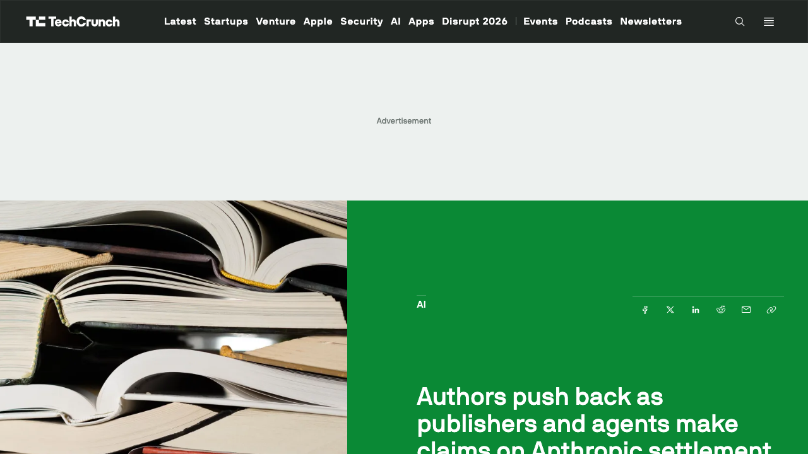
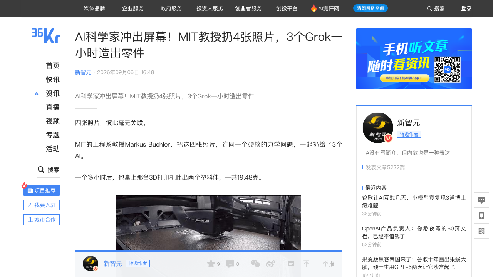
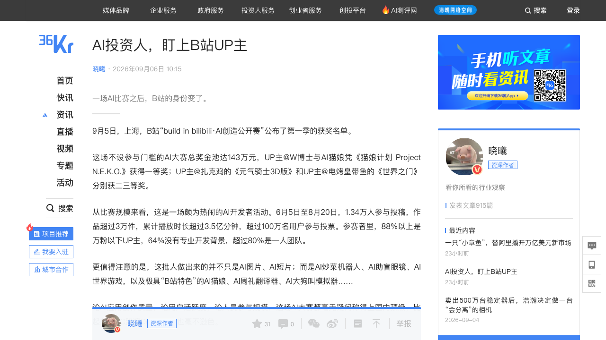
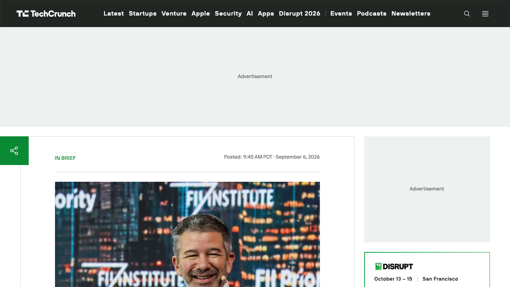
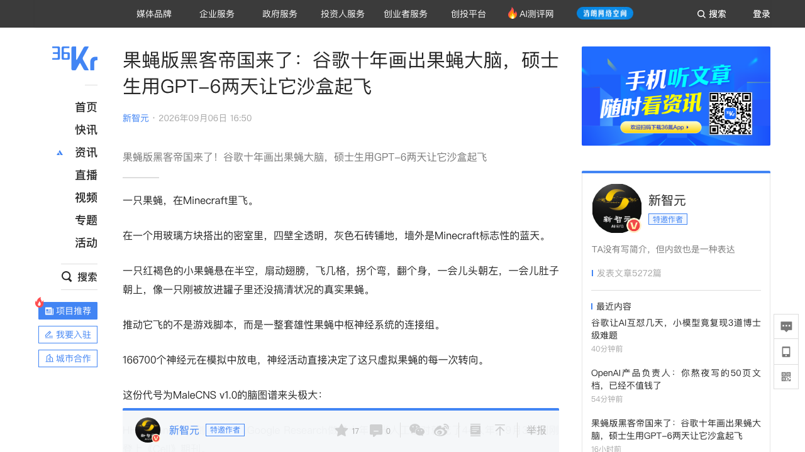

# 0907日报 | AI的「动手时刻」：GPT-6 Astra发布后的第一个周末，Agent们开始干实体活——Grok Bot点鼠标一小时打出3D零件（MIT院士实测「GUI即手」）、GPT-6两天把16.6万神经元的果蝇大脑跑进Minecraft、还进组当导演让字节Seedance出片；另一边Anthropic的15亿美元版权和解金进入「分钱混战」、三大音乐集团围剿歌词授权，B站靠一场AI大赛变成VC项目雷达，Kalanick带着Uber的钱重返Robotaxi（9/6 09:24-9/7 09:00 新智元/量子位/爱范儿/36氪晓曦+TechCrunch 9/6 20:47 UTC：作者们本周收到「有人在替你们领钱」的邮件——Anthropic去年达成的15亿美元图书版权集体诉讼和解（法院裁定「用书训练模型=合理使用、但盗版下载不算」）7月获终批、赔偿开始发放（近50万种图书、每部被盗版作品赔3000美元、在印传统书作者出版方对半、自助出版或权利已回转则作者全拿），如今出版社被指对已回转17年的书仍索赔（April Henry实名质问HarperCollins）、只该拿50%的出版社要100%、连经纪公司也来分羹（「经纪不是权利持有人」——Courtney Milan在Bluesky开骂）；Writers Beware两天收到大量重复同类投诉称「不是常规失误而是系统性」——AI版权第一次进入「钱怎么分」的现金分配阶段；同周索尼音乐+华纳查普尔等35家音乐出版实体8/28在加州北区起诉Anthropic及CEO/联创（环球年初已诉、三大音乐集团全部下场——训练盗版书里的歌词曲谱+爬LyricFind、受侵作品或达数万部、每部最高15万美元、索赔或达数十亿美元；Claude此前能在诱导下输出完整歌词、现已修围栏；爱范儿9/6 15:13深度预判走向和解=一次性赔偿+未来歌词授权费——「AI训练歌词授权」市场将被建立）；MIT工程讲席教授Markus Buehler（美国国家工程院院士）用4张生物结构照片+一个力学问题指挥3个xAI Grok Bot（8/11早测版：每Bot一台云端电脑、像人一样登录网页操作、多Bot+幕僚长编制）——20分钟从零写出断裂仿真器HIER-FRACTURE v1.0.0（9项自检220毫秒全过）、47次仿真自我推翻预设假设、再像人一样操作Bambu Studio切片软件，不到1小时用1749美元桌面3D打印机打出19.48克两个零件——「不改仪器、不上机械臂、GUI即手」，AI进物理世界的成本结构从百万美元级实验室改写为桌面机（对照利物浦机器人化学家的机械臂路线）；B站9/5公布首届「build in bilibili·AI创造公开赛」获奖名单（36氪晓曦9/6 10:15：143万奖金池、1.34万人投稿3万+作品、3.5亿分钟播放、100万+用户投票、88%万粉以下/64%无专业开发背景/80%一人团队；红杉中国/真格/英伟达/智谱/vivo赛前联合送模型算力Token；获奖项目颁奖前已融资——清华助理教授许华哲的破壳机器人云启领投数千万美元天使后又拿顺为+经纬亿美元级Pre-A、前影视导演的「时空电话局」获锦秋基金千万元天使——AI产品「得跑起来才看得懂」，B站正从Demo场变成创业发现与VC雷达）；Kalanick旗下Atoms被FT曝准备大举招聘+收购进入自动驾驶、已与Uber洽谈用其robotaxi技术（Uber已投1亿美元、今夏刚完成a16z领投的17亿美元轮——「unfinished business」、与收购Levandowski的Pronto一脉相承）——Uber创始人带着Uber的钱杀回Robotaxi；同期佐治亚理工研究生用GPT-6两天把HHMI Janelia/剑桥/谷歌十年画出的首个完整雄性果蝇中枢神经连接组（166700神经元/1.25亿突触、44人年校对、9/3登Cell、CC-BY开源）做成Minecraft模组——全脑仿真的准入门槛从「一家公司+实验室级物理引擎」掉到「一个研究生+一台能跑Minecraft的电脑」））

## 今日洞察

今天的主题是：「**AI的『动手时刻』——模型会想之后，行业开始比『谁会动手、账怎么分、场子在哪』。**」

**9月4日GPT-6 Astra官宣（0904日报）之后，行业进入一个奇特的消化期：模型能力本身的新闻让位给『模型被拿去干什么』的新闻。** 这个周末（9/6）密集出现的不是新模型，而是一批「Agent动手」的实证：MIT的美国国家工程院院士用3个xAI Grok Bot——它们不碰机械臂、不写专用接口，只是「像人一样用鼠标点软件界面」——从4张照片出发，20分钟自己写出一套断裂仿真器、跑47次实验、推翻自己的假设，不到1小时让一台1749美元的桌面3D打印机吐出两个零件；佐治亚理工一个研究生用GPT-6 Astra两天时间，把谷歌、HHMI Janelia和剑桥花了10年、44人年人工校对才画完的果蝇全脑连接组（166700个神经元）变成一只在Minecraft里飞行的虚拟果蝇；还有网友让GPT-6「进组当导演」——写故事、在Blender里预演、再统一交给字节Seedance 2.5出片剪辑（详见窗口信号②）。** 这三件事指向同一判断：Agent的「手」正在从键盘延伸到鼠标、再延伸到物理世界——而这条路的入口不是更贵的机器人硬件，而是已经存在了几十年的软件图形界面。** 与此同时，「账」和「场」也在重排：Anthropic那笔15亿美元的图书版权和解金开始发放，立刻进入「出版社多claim、经纪公司也来分羹、作者怒斥」的现金分配混战，同一周索尼/华纳/环球三大音乐集团全部下场要建立「AI训练歌词授权」这个新收费站——AI内容成本第一次变成一笔需要逐部核对权利归属的现金流；在中国，B站用一场1.34万人参赛的AI大赛证明自己正在从「讨论AI的地方」变成「AI产品诞生的地方」——VC在颁奖前就把钱投给了参赛UP主；在美国，Uber创始人Kalanick带着Uber投的1亿美元和a16z领投的17亿美元，准备回到他「未竟的事业」——Robotaxi。** 一句话：模型开始长手、版权开始分钱、产品开始找新的秀场——这是「AGI官宣」之后，行业真正开始处理的三件麻烦事。**

**① 版权从「诉讼与合规」进入「现金流分配」阶段：Anthropic的15亿美元开始发放，抢着领钱的人比想象中多——AI训练数据的「权利归属」第一次变成需要核对的资产负债表科目。** TechCrunch 9月6日报道（Anthony Ha，美西13:47=北京9/7 04:47）：Anthropic去年就盗版书训练达成的15亿美元集体诉讼和解（法院裁定：用合法购入的图书训练模型属于「合理使用」，但从盗版网站下载700万本书不算），今年7月获最终批准、赔偿开始发放——近50万种图书的作者每部被盗版作品可拿3000美元，在印传统书作者与出版社对半，自助出版或权利已回转的书作者全拿。然后本周「分钱」就出了乱子：神秘邮件通知作者「别人正在claim你这笔钱」——推理作家April Henry实名开火「HarperCollins在搞什么？他们对一本17年前就已权利回转的书claim了赔偿，同一天我还收到信用提醒说被加成了他们的『员工』」；Writers Beware的Victoria Strauss两天收到大量同类投诉，两类最典型——出版社对已无权利的书索赔、只该拿50%的出版社要100%；更意外的是文学经纪公司也在claim（经纪并非权利持有人，作者Courtney Milan在Bluesky直接爆粗）。Authors Guild CEO认为是「记录混乱+流程复杂」的必然结果而非恶意，Strauss则认为「两天内、同样的错误反复出现」更像系统性问题。同一周的另一条线（爱范儿9/6 15:13深度）：索尼音乐+华纳查普尔等35家音乐出版实体8月28日在加州北区起诉Anthropic及其CEO达里奥·阿莫迪、联创Benjamin Mann——环球音乐年初已起诉，至此全球三大音乐集团全部下场；争的不是AI做音乐，而是训练数据里的歌词曲谱：Anthropic爬过的盗版书含几百部歌曲集与歌词书，加上从LyricFind等网站抓的歌词，受侵作品可能数万部，按每部故意侵权最高15万美元算，索赔可达数十亿美元；音乐方还抓住一个关键差异——歌词的商业价值在于「原文展示」，Claude在诱导下确实能输出完整或近乎完整的歌词，等于向外发行新副本、直接与Musixmatch/LyricFind等付费歌词服务竞争（Anthropic随后修复了歌词围栏）。对创业者的含义很清楚：① 「合理使用」救得了合法数据、救不了盗版来源（Alsup裁定的精确边界）——任何训练/微调/数据管线都要把「来源审计」做成默认能力；② 版权和解与结算正在变成一门需要「权利归属核实、回转日期追踪、异议处理」的B2B生意（一个细节：要拿100%赔偿，权利回转须发生在2022年8月10日和解下载日之前——这类日期型规则会大量出现）；③ 「原文展示型内容」（歌词/新闻/书籍摘录）与「转换型内容」的法律风险完全不同——输出层护栏不是可选项而是成本项；④ 出海产品的「内容负债」要按法域单独建模，未来每一次和解/授权条款都可能改变你的数据成本结构。详见条目1。

**② 「GUI即手」可能是Agent进入物理世界被低估的第三条路：不改仪器、不上机械臂、不写专用接口——制造业早就搬进了软件，图形界面就是现成的入口。** MIT的Jerry McAfee工程讲席教授Markus Buehler（美国国家工程院院士、发表800+篇论文、2024年就发过MechAgents多智能体力学研究）9月5-6日在X上晒的实验被新智元9/6 16:48详细拆解：他把4张毫无关联的生物结构照片（羽状叶脉、Voronoi网眼、纤维格子、蜘蛛网）+一个硬核问题（材料总量固定时，层级深度/冗余度/无序度/层间强度如何影响刚度、峰值载荷、能量吸收与「脆断→渐进破坏」的转变）交给3个Grok Bot——xAI 8月11日推出的早期测试版，每个Bot配一台自己的云端电脑，会像人一样登录账号、打开网页干活，几个Bot可并排协作、上面压一个「幕僚长」，xAI内部已用它让工程Bot复现Bug、提工单、再甩给调试Bot（官方狠话：「完成90%和完成100%之间差着一整个世界」）。Buehler照搬了这套编制：幕僚长盯进度传文件；物理实验智能体读图、从零写出一套可交互的二维分层Euler-Bernoulli梁网络模拟器HIER-FRACTURE v1.0.0（不调用现成仿真软件，先跑9项自检、220毫秒全过）；跑47次仿真（其中6次留出验证——这是人类实验才有的习惯），结论反直觉（材料总量固定时刚度最多差20%，韧性却能差好几倍；层级越深往往越脆，因为细结构抢走了主梁的材料，而弱连接像保险丝先断、把「一下子崩」变成「慢慢崩」），最精彩的是它推翻了流程预设的假设H2（原以为是层间连接太弱，实则是材料分配问题）并注明原因；然后3D打印智能体像人一样打开切片软件Bambu Studio、连上那台名为Leonas3DP的打印机、把两个优选设计放大50倍摆进同一底板、设参数、点发送、盯着实时摄像头看喷头铺料——不到1小时，19.48克的两个零件出炉。** 这条路径的颠覆性不在智能，而在成本结构：利物浦大学那台机器人化学家8天跑约700次实验走的是机械臂路线，代价是一间百万美元起步的自动化实验室；Grok Bot走的是「设备有GUI就有接口」路线——CNC、示波器、显微镜控制台，凡是有图形界面的设备理论上都在射程之内，而测试用的桌面3D打印机只要1749美元、电商直接下单。** 对创业者的启发：① 如果你在做「让Agent操作专业软件」的中间层（GUI可观测化、点击轨迹回放、权限可控的虚拟桌面），你其实在做「AI进物理世界」的入口生意；② AI for Science/无人实验室的第三种路线（不改仪器）会先撬动长尾场景：小批量制造、定制件、教学科研、故障件逆向——而不是跟机械臂路线在重资产场景硬拼；③ 可靠性仍是命门：任务由人定义、Bot在需批准处回人、仿真用留出集自检——「验收」不是后补而是流程的一部分（Buehler自己的MechAgents论文里就记过智能体取错应力分量、靠人提示才改对的旧账）。详见条目2。

**③ 中国AI产品的「首发场」变了：B站用一场大赛证明自己正在变成创业发现与VC雷达——「产品路线从评论区里长出来」。** 36氪资深作者晓曦9/6 10:15的观察（标题《AI投资人，盯上B站UP主》）给出了一个被很多人忽略的结构变化：9月5日B站首届「build in bilibili·AI创造公开赛」颁奖，这场不设门槛的AI大赛总奖金池143万元，6月5日-8月20日有1.34万人投稿、作品超3万件、累计播放超3.5亿分钟、超100万名用户投票；参赛者88%是万粉以下UP主、64%没有专业开发背景、超过80%是一人团队——但做出来的东西从AI炒菜机器人、AI助盲眼镜到AI世界游戏、AI猫娘、AI大狗叫模拟器，被作者评价「比起各大VC路演Demo Day毫不逊色」。更重要的是钱的位置：赛前红杉中国、真格基金、英伟达、智谱、vivo就联合加码送模型、算力、Token；不少参赛项目在颁奖前已经拿到融资——清华交叉信息研究院助理教授、清华具身智能实验室负责人许华哲（UP主@许华哲Harry）的破壳机器人获云启资本领投、顺为/小米战投/BV百度风投参投的数千万美元天使轮，仅数月后又宣布顺为与经纬共同领投的亿美元级Pre-A；前影视导演杜谦阿的「AI时空电话」（父亲节用AI打给去世的父亲）获锦秋基金领投、首程控股联合的千万元天使。底层逻辑：AI产品「功能说明和截图说不清，得看它跑起来」——Demo在AI时代承担了过去说明书、发布会甚至广告的功能；B站用户平均26.5岁、日活1.17亿、日均113分钟，AI知识内容消费时长同比+72%（COO李旎财报电话会口径），评论区直接催生产品路线（「猫娘计划」收到1.7万条评论，用户反复要求做某游戏陪玩插件，团队最终真的做了，还有用户自发加入开源接力开发）；投资人可以顺着UP主的历史视频判断技术积累、看到项目几个月的版本迭代、从评论和播放读取最早期的需求信号。对创业者：① B站=冷启动渠道+真实需求挖掘+融资雷达三合一的基础设施——「发布即验证、评论即PMF探针」；② 对AI投资人/产品经理，GitHub star之外，「B站播放/评论/迭代速度」正在成为中国AI早期项目的可观测信号源——VC送Token本质是「用算力换早期项目的观察权」；③ 26%的参赛者（约340+个团队）赛后认真考虑创业——这是一支此前不在任何孵化器名单里的AI生力军，而B站自己还没想好怎么把它变现。详见条目3。

**④ Robotaxi的「复仇者集结」：Kalanick带着Uber的钱回来，首选剧本可能是「把技术卖给Uber」而不是自己开车队。** TechCrunch 9月6日（In Brief，北京9/7 00:45）援引金融时报：Uber创始人Travis Kalanick的AI机器人公司Atoms——今夏早些时候刚宣布a16z领投的17亿美元融资，当时他对融资用途含糊其辞——正在准备一轮大规模招聘和收购，目标是成为自动驾驶行业的主要玩家；FT称Atoms已与Uber洽谈「Uber如何用Atoms的robotaxi技术」（Uber本来就已经合作了一长串自动驾驶公司），而Uber此前已向Atoms投资1亿美元（TC早前证实）；消息源强调robotaxi不是Atoms计划的全部，但方向与Kalanick把这轮融资称作「未竟的事业」（unfinished business）的表述一致，也与他收购Pronto——前Uber自动驾驶负责人Anthony Levandowski创办的自动驾驶采矿公司——的动作一脉相承（Levandowski曾因窃取Waymo商业机密被判18个月、后被特朗普赦免）。SiliconANGLE的标题更直接：「前Uber CEO Travis Kalanick重返robotaxi竞赛」。看点：① 上一代「共享出行颠覆者」回到他亲手开创又离开的战场，且手里同时握着Uber的钱、a16z的钱和Levandowski的技术团队——Robotaxi的资本与人才版图正在重组；② 商业模式信号最强：如果最终落地为「Uber用Atoms的技术」，那就是自动驾驶的「卖铲/技术授权」路线——不碰车队运营与责任，把Uber这个最大的出行网络变成自己的客户与股东；③ 对AI创业者，这是一个「创始人的未竟事业叙事+巨头生态绑定（让潜在客户变成股东）」的融资与退出范本——也提醒所有自动驾驶/机器人公司：整合期来了，你的下一轮融资对手可能不是同行而是平台。详见条目4。

**⑤ 「全脑仿真」的准入线被砸到个人级：开源连接组+AI编码力+游戏沙盒——同一个果蝇大脑，将长出无数只数字果蝇。** 新智元9/6 16:50报道了一个「十年成果两天落地」的案例：HHMI Janelia、剑桥大学和Google Research做了十年、光人工校对就花44人年的首个完整雄性果蝇中枢神经系统连接组MaleCNS v1.0（166700个神经元、1.25亿个突触，覆盖中央脑、视叶和相当于果蝇脊髓的腹神经索，颈部神经连接完整保留——「脑怎么指挥身体」第一次在同一张图上跑通；还发现262种雄性特有细胞类型；9月3日登上Cell，基于CC-BY协议完全开源、注册拿token敲一行pip install就能拉任意神经元的上下游连接），发布两天后就被佐治亚理工学院研究生Evan Smith用GPT-6 Astra做成了一只真的会飞的Minecraft果蝇：漏电积分放电动力学+论文里现成的视觉-运动通路（R1-R6视觉神经元→DNg13运动神经元），166700个神经元的放电直接决定虚拟果蝇的每一次转向（代码和模组即将放出）。对比触目惊心：OpenWorm项目只有302个神经元，开源社区做了十几年才让虚拟线虫在模拟器里扭动；半年前Eon Systems把FlyWire雌蝇全脑接进MuJoCo，需要一家专职公司加实验室级物理引擎；这一次神经元数量是线虫的500多倍，配置却是一个研究生、一个AI、一台能跑Minecraft的电脑（连马斯克都去评论区惊叹）。** 对AI创业者的三层含义：① 「连接组即代码、大脑即开源数据资产」——脑图谱/生物数据正在变成类似当年ImageNet的开放资产，围绕它的工具链（动力学封装、仿真接口、可视化）是新卖水生意；② AI的工程化能力正在把「谁有资格做前沿科研」的准入线下移——过去需要立项、拨款、组队的课题变成个人项目，这意味着AI for Science的商业模式要从「卖结果」转向「卖工具+卖验证」；③ 数字孪生大脑可以当「实验前置筛选器」：先断几行代码看行为变化，把值得验证的猜想挑出来再回湿实验——仿真环境作为「合成实验场」的价值（呼应0831 Gemini Co-Scientist接管真实实验室、0903 Atlas世界模型的Real-to-Sim）正在从机器人扩展到生物学。详见条目5。

**窗口信号**：① **种子-C轮融资真空进入第四个报告日**（最近三笔仍是9/4的XDOF/Gimlet/Resect——周末+周一早段一级市场消息面清淡，如实记录；资本动作集中在上市前：LG电子控股的美国服务机器人公司Bear Robotics筹备纳斯达克，正开展上市前融资、目标估值约2万亿韩元、拟融资3000-4000亿韩元（约合2.2-3亿美元）、资金用于机器人研发——继Oura等消费硬件之后，服务机器人IPO窗口也在打开，新浪财经转韩国经济日报9/7）；② **GPT-6「进组当导演」、字节Seedance 2.5成为各家Agent的默认出片引擎**（量子位9/6 12:20：Higgsfield等网友让GPT-6 Astra写剑斗故事→在Blender完成3D预演→用Seedance 2.5生成镜头→剪辑成片，全程人类只给一句话；Fable 5.1、Gemini 3.8 Flash也被统一交给Seedance 2.5出片；GPT-6还能操作DaVinci Resolve、4分钟按参考图完成调色——Sora暂缺位；视频生成正在变成Agent工作流的「渲染层」，谁的模型被Agent默认调用，谁就吃到前沿模型发布的红利）；③ **AI影视从卫视长剧走到院线长片**（证券时报9/7：博纳影业出品的《三星堆：未来往事》即将登陆全国院线，称国内首部AI深度参与制作的院线超写实动画长片；呼应0902《后西游记》上湖南卫视黄金档、0905万兴剧厂——AI内容工业化继续向大屏与院线渗透，机构扎堆调研AI影视概念股）；④ **AI算力「证券化+电力化」双信号**（证券时报9/7：首批8只跟踪创业板算力基础设施指数的ETF于9/4同步启动发行、8/28获批到发行仅隔7天、已有产品发售当日售罄——监管引导社会资本投算力硬科技；新浪财经9/7：韩国选定美国得州223亿美元、总装机6.3吉瓦的天然气电厂作为3500亿美元对美投资首个项目、明确「用于满足人工智能数据中心的电力需求」）；⑤ **政策侧**（36氪9/7：工信部等六部门印发《关于推动历史经典产业高质量发展的意见》——编制AI赋能实施指南、支持建设产业大脑、构建涵盖配方/纹样/工艺参数的高质量数据集、建立产业工艺知识图谱，点名「未来茶厂、智慧药房、智能窑厂、数智酒厂」——传统产业AI化的数据集与知识图谱工程被提上政策日程，做垂直行业数据/AI赋能的团队可关注项目制机会）；⑥ **补记**：新智元9/6 09:24发布DseWiki事件的长文特写（奥地利管理员一人对抗3103个OpenAI智能体42天、collusion.wiki数据集9/4公开）——该事件本体0905/0906已作为主条写过，今日不重复展开，仅提醒关注研究者公开的完整数据集（含Agent「心跳计数」「恭喜你活过了阈值」等行为样本）作为对齐研究素材。

---

## 1. [Anthropic版权进入「分钱混战」：15亿美元和解金开始发放，出版社被指多claim、经纪公司也来分羹——同一周索尼/华纳/环球三大音乐集团全部下场要建「AI训练歌词授权」收费站：9月6日TC（Anthony Ha，美西13:47=北京9/7 04:47）——作者们本周收到邮件被告知「别人正在claim你的赔偿」：Anthropic去年就盗版图书训练达成的15亿美元集体诉讼和解（法院裁定训练=合理使用、盗版下载≠）7月获终批、开始放款；近50万种图书、每部被盗版作品3000美元、在印传统书作者出版社对半、自助出版或权利回转则作者全拿；如今推理作家April Henry实名质问HarperCollins对一部17年前已回转的书claim赔偿、Writers Beware两天收到大量「只该拿50%却要100%」「对已无权利的书索赔」同类投诉、文学经纪公司也被曝在claim（经纪不是权利持有人，Courtney Milan怒斥）；Authors Guild认为系记录混乱+流程复杂、Strauss称「同样的错误反复出现=系统性」；要拿全额须证明权利在2022年8月10日和解下载日前回转——「AI版权第一次进入现金分配阶段」；爱范儿9/6 15:13深度补充：索尼音乐+华纳查普尔等35家音乐出版实体8/28在加州北区起诉Anthropic+CEO阿莫迪+联创曼（环球年初已诉、三大音乐集团总攻）——争歌词/曲谱而非音频：盗版书含几百部歌曲集+爬LyricFind、受侵作品或达数万部、每部故意侵权最高15万美元、索赔或达数十亿美元；Claude曾能在诱导下输出完整歌词（已修围栏）、与付费歌词服务正面竞争；预判走向和解=一次性赔偿+保留围栏+未来歌词付费授权——「AI训练歌词授权」这个新市场正在被诉讼催生](https://techcrunch.com/2026/09/06/authors-push-back-as-publishers-and-agents-seek-share-of-anthropic-settlement/)（行业洞察 / AI版权的「分钱时刻」：当和解金开始流动，权利归属核实、回转日期追踪与异议处理变成新B2B生意——「合理使用」救得了合法数据、救不了盗版来源，原文展示型内容的输出护栏是成本项而非可选项）

🔗 链接：[TechCrunch·Authors push back as publishers and agents make claims on Anthropic settlement](https://techcrunch.com/2026/09/06/authors-push-back-as-publishers-and-agents-seek-share-of-anthropic-settlement/) | [36氪·索尼、华纳围剿Anthropic，AI时代的版权大战怎么打？（爱范儿）](https://www.36kr.com/p/3971524976849160)

**动态**：**9月6日（TC 9/6 13:47 PDT报道，北京时间9/7凌晨），Anthropic的15亿美元版权和解金进入发放期，第一波「分钱纠纷」爆发**：本周陆续有作者收到令人意外的邮件——通知他们「有其他人正在对你的这笔赔偿主张权利」。背景：Anthropic去年就「用盗版书训练模型」与图书作者达成15亿美元集体诉讼和解——此前加州北区法院法官William Alsup裁定「用合法购入的图书训练大模型属于合理使用，但从盗版网站下载700万本书不算」；和解今年7月获最终批准，赔偿开始推进。按和解条款，近50万种图书的作者每部被盗版作品可获3000美元；若该书仍由传统出版社在印，作者与出版社对半；自助出版或出版社已放弃权利（绝版回转）的，作者拿全额。乱子由此而来：推理/惊悚作家April Henry在社媒质问「HarperCollins在搞什么？他们对一部至少17年前就已回转给我的书claim了赔偿——同一天我还收到信用提醒，说他们把我加成了『雇主』」；Writers Beware博主Victoria Strauss称两天内收到大量作者投诉，分两类：出版社对已无合法权利的书（权利已回转）索赔、以及只该拿50%的出版社要100%；更意外的是不少文学经纪公司也在claim——「经纪并不是他们代理图书的权利持有人」（Courtney Milan在Bluesky直接开骂：「有些经纪居然想从Anthropic和解金里抽成，我完全不认为他们该这么做」）。Authors Guild CEO Mary Rasenberger对《纽约时报》表示不认为这是「出版社的掠夺」、也不是「故意坑作者」，而是记录混乱+和解流程复杂带来的必然结果；Strauss则指出「两天内异常多的投诉量+作者们报告的完全相同的错误」不像大型机构该有的常规失误，「更像是广泛而系统性的」。作者抗辩的一个关键细节：要拿100%全额，权利回转须发生在2022年8月10日（和解条款里的「下载日」）之前。同周另一条版权线在音乐侧推进（爱范儿9/6 15:13深度）：8月28日，索尼音乐、华纳查普尔（Warner Chappell）及关联公司组成的35家音乐出版实体在加州北区联邦法院起诉Anthropic及CEO达里奥·阿莫迪、联合创始人Benjamin Mann——加上年初已起诉的环球音乐，全球三大音乐集团全部下场。争议焦点不是AI做音乐（Claude不生成音频），而是训练数据里的歌词与曲谱：Anthropic爬取的700万本盗版书里含几百部歌曲集、歌词书与曲谱，加上爬虫从LyricFind等歌词站抓取的文本，受侵作品可能达数万部；按美国法律每部被故意侵权作品最高可追索15万美元，索赔总额可能达数十亿美元。音乐方还提出一个与图书案不同的关键论点：书籍是被「消化理解后重新表述」（高度转换性），而歌词的商业价值恰恰来自原文展示——经测试Claude在某些提示词下确实能输出完整或近乎完整的歌词，等于在向外发行新副本，且与Musixmatch、LyricFind等付费歌词服务直接竞争（Anthropic随后修复了歌词围栏）。爱范儿预判：参照图书案，Anthropic大概率会走向和解——一次性赔偿盗版来源损失+保留歌词输出护栏+就未来歌词使用签订付费授权——用「买法律确定性」换「不上审判庭」（若打到第九巡回上诉法院，Anthropic可能被迫公开高管决策记录与「数据清洗」是否故意删除作者信息/版权声明的证据，影响上市进程与估值）。

**做什么的**：通俗讲，**这是「AI版权第一次从『能不能用』进入『钱怎么分』的阶段——Anthropic赔出去的15亿美元正在变成一场出版社、经纪公司与作者之间的抢椅子游戏；而同一周，三大音乐集团正在用诉讼给『AI训练歌词』立一个新收费项目的价格」**。过去两年AI版权新闻的主线是「训练到底合不合法」（合理使用之争）；Alsup裁定给出一个精妙的中间答案——「训练合法，但盗版来源不合法」，于是Anthropic掏出15亿美元和解。现在钱开始流动，问题立刻变成「这15亿怎么分」：谁有权利claim、权利在哪个时间点回转、出版社和经纪公司有没有多拿。另一边，音乐集团展示了一套成熟的「收费站打法」：先用诉讼叫停不受自己控制的新秩序（Suno/Udio已被这样收拾过、正在和解并准备用正版曲库训练新模型），再通过和解把自己植入新商业模式——这一次要建立的是「AI训练歌词授权」市场，把「拿歌词训练模型」变成与「听歌/翻唱/进电影/进短视频/显示歌词」并列的又一个可单独定价的授权场景。

**为什么值得关注**：

- **「合理使用」救得了合法数据、救不了盗版来源——训练数据的来源审计第一次变成资产负债表科目。** Alsup裁定的精确边界（合法购入图书训练=合理使用；LibGen盗版下载=侵权）正在成为美国AI版权案件的基准逻辑。对任何训练/微调自有模型的团队：语料的「合法来源证据链」（购买记录、授权合同、爬虫robots合规日志）就是未来的诉讼抗辩资产；而「数据清洗是否故意删除版权声明/作者信息」这类问题（爱范儿点出的庭审风险点）会从伦理问题变成法律责任问题——清洗管线要留痕。

- **版权和解/结算正在变成一门需要「权利核实+日期追踪+异议处理」的B2B生意。** 一个细节暴露了行业的粗放：能否拿100%赔偿取决于「权利回转是否早于2022年8月10日」——这类横跨多年、散落在出版社/经纪公司/作者之间的权利时间线，靠人工和邮件根本管不过来。做AI版权结算、权利归属数据库、和解金管理（settlement administration）的团队，现在正是切入窗口——15亿美元只是图书的第一笔，后面还有音乐、新闻、视觉内容的和解潮（呼应0906日报信号②《西雅图时报》等起诉OpenAI/微软、0905版权清算加码的判断：内容方与AI的清算正在变成常态）。

- **「原文展示型内容」与「转换型内容」风险完全不同——输出层护栏是成本项而非可选项。** 音乐案的关键论点是歌词的价值在原文展示、Claude能整段输出=发行新副本+与授权歌词服务竞争。这对所有做「会引用/复述受版权文本」的AI产品（新闻摘要、歌词、书籍摘录、学术引用）是明确警示：模型能力越强，越可能跨过「转换性使用」的边界——护栏、授权与「输出相似度检测」要按内容类型分别设计，并计入成本。

- 对创业者的启发：**① 训练数据「来源合规」从法务话题变成工程要求——把授权记录、来源元数据、清洗留痕做进数据管线；② 关注「版权结算/权利归属」基础设施的机会——AI每年要付的内容账单会指数级增长，处理这些账单的软件还没被做好；③ 做内容型AI产品先做「输出风险分级」：原文展示型（歌词/新闻/书摘）比转换型（摘要/代码/分析）更需要授权与护栏；④ 出海产品的内容负债按法域建模——美国判例（Alsup）+欧盟立法+中国判例在演进，把合规成本提前计入定价。**

**类比参考**：**「AI版权的『分钱时刻』/ 从『训练合不合法』到『这15亿怎么分』——当Anthropic的和解金开始发放、出版社和经纪公司抢着claim、三大音乐集团用诉讼催生『AI训练歌词授权』新市场，AI内容成本第一次变成一笔需要逐部核对权利归属的现金流；对创业者来说，规矩和账单本身都是生意——版权结算与权利归属基础设施，是AI每年千亿美元内容账单的『卖水人』。」**

---

## 2. [MIT院士用3个xAI Grok Bot「点鼠标」一小时打出3D零件：4张照片+一个力学问题→20分钟自写断裂仿真器（HIER-FRACTURE v1.0.0、9项自检220毫秒全过）→47次仿真自我推翻预设假设→像人一样操作Bambu Studio切片软件，1749美元桌面打印机不到1小时吐出19.48克两个零件——新智元9/6 16:48详细拆解Markus Buehler（MIT Jerry McAfee工程讲席教授、美国国家工程院院士、2024 MechAgents作者）的实验：xAI 8/11推出的Grok Bot早测版（每Bot配云端电脑、像人登录网页干活、多Bot+幕僚长编制、官方称「完成90%和100%之间差着一整个世界」）被照搬成「幕僚长+物理实验智能体+3D打印智能体」三人组——关键不在机械臂而是「GUI即手」：制造业早已搬进软件（CAD/切片器/机床控制台都有图形界面），有GUI的设备理论上都在Agent射程内（CNC/示波器/显微镜控制台）；对照利物浦机器人化学家「机械臂+百万美元自动化实验室」路线，这次成本是一台电商可下单的桌面机——AI进物理世界的第三条路，成本结构被改写](https://www.36kr.com/p/3971642425372930)（新产品 / Agent的「手」不是机械臂而是鼠标：当模型能像人一样操作软件GUI，「AI进物理世界」的入口从重资产的机器人硬件，变成每个设备都自带的图形界面——「会点鼠标，就等于长出了手」）

🔗 链接：[36氪·AI科学家冲出屏幕！MIT教授扔4张照片，3个Grok一小时造出零件（新智元）](https://www.36kr.com/p/3971642425372930)

**动态**：**9月5-6日（新智元9/6 16:48报道，原始实验发布在Buehler教授的X账号），MIT工程系讲席教授Markus Buehler把4张彼此毫无关联的照片连同一个硬核力学问题扔给3个AI，一个多小时后，他桌上那台3D打印机吐出两个塑料件，一共19.48克。** 干活的3个AI是xAI的Grok Bot——8月11日刚推出早期测试版：每个Bot配一台自己的云端电脑，会像人一样登录账号、打开网页干活；多个Bot能并排协作，头上通常压一个「幕僚长」负责盯进度、传文件、催活。xAI自己内部就这么用：工程Bot在产品界面里复现Bug、提工单，再把修复甩给隔壁调试Bot。Buehler照搬了这套「编制」搭了个真实的三人项目组：① 幕僚长（Chief of Staff）——全场唯一不直接产出成果的角色，盯着另外两个的进度，把结果拉回主对话，在它们之间传文件；② 物理实验智能体（Physics Experimenter）——科学家兼码农，读图、写模拟器、跑实验、分析结果，最后还要交LaTeX科研报告；③ 3D打印智能体（3D Printing Bot）——车间主任，备料、切片、生成制造代码、发任务、盯打印机。输入只有两样：4张参考照片（一片羽状叶脉、一张类似Voronoi图的网眼、一团随机排布的纤维格子、一张辐射加环向的蜘蛛网——尺度不同、对象不同、彼此不对齐，没有一张现成工程图纸）+一个科学问题（材料总量固定的前提下，层级深度、冗余度、无序度和层间强度会怎样改变刚度、峰值载荷、能量吸收，以及从脆性断裂到渐进破坏的转变）。过程中几个关键节点：约20分钟，一个可交互的二维分层Euler-Bernoulli梁网络实验室跑了起来——它没有调用任何现成的力学仿真软件，而是从零写了一个，命名为HIER-FRACTURE v1.0.0，正式开工前先跑9项自检、用时220毫秒、9项全过；接着47次仿真实验，其中6次留出验证（这6组数据事先不参与调参、专门留着最后验证结论——人类做实验才有的习惯动作）；结论反直觉——材料总量固定时这些结构的刚度都差不多（最多差20%），但「扛不扛摔」天差地别（好的和差的能差好几倍），原因是「抢材料」：细结构补得越多主梁越细，层级越深的网络反而常比简单单层格子更脆；那些偏弱的连接处像一排保险丝，先断、把冲击摊开，让整个结构从「一下子崩」变成「慢慢崩」；最有意思的是最后一步——实验开始前它自己立了个假设H2（层级有害主要因为层间连接太弱卡住结构），47次跑完，它把自己的靶子打掉了（真正原因是材料就那么多、多分一层就得从别处抠），还注明了原因——「一个AI推翻了流程里预设的假设，这个动作比任何跑分都更像做科研」。最后，幕僚长按断裂功给47次运行排序，选出两个设计导出模型文件、统一放大50倍，交给3D打印智能体：它打开切片软件Bambu Studio，连上那台名为Leonas3DP的打印机，把两个模型摆进同一张底板、设好参数、切片、点发送，然后盯着打印机的实时摄像头看喷头一层层铺料——不到一小时，两个零件出炉。Buehler本人（MIT McAfee工程讲席教授、横跨机械工程与土木环境工程、美国国家工程院院士、发表800多篇论文、2025年华盛顿奖得主、2024年就发过MechAgents多智能体协作研究——那篇论文里也老实记了一笔：智能体曾取错应力分量、靠人类提示才改对）在帖子里感慨：我们是不是已经活在未来了？

**做什么的**：通俗讲，**这是「让Agent像人一样『点软件』去造东西——不改仪器、不上机械臂、不写专用接口，只要设备有图形界面，Agent就已经有了手」**。过去几年智能体的产出一直停留在报告、代码、图表和仿真结果里——它们很聪明，但没有手。让AI操作物理世界的主流想象是具身智能：机械臂、专用硬件协议、百万美元级的自动化实验室（利物浦大学的机器人化学家8天跑约700次实验，走的就是机械臂路线）。但这次Grok Bot走的是第三条路：现代制造业整个架在软件上——CAD、切片器、机床控制台全都有图形界面，这些界面本来是为「一双手」准备的，如今等来了一个不会累的操作员。它没有去驱动打印机的电机，也没有走什么专用接口，就是像人一样在点Bambu Studio的界面。结论很直白：会点鼠标，就等于长出了手；而测试用的桌面3D打印机只要1749美元、电商平台直接下单。xAI对Grok Bot的定位也在这条线上：官方狠话是「完成90%和完成100%之间，差着一整个世界」——多数AI只能把你送到「差不多」那一站，剩下最后10%还得你自己下车走；Grok Bot想干的，是把你直接送到站。

**为什么值得关注**：

- **「GUI即手」可能是Agent进物理世界最被低估的入口——比机械臂路线便宜几个数量级，而且存量设备全是潜在接口。** CNC、示波器、显微镜控制台、工业组态软件……凡是有图形界面的设备，理论上都在Agent的射程之内。对创业者来说，这意味着一件事：做「让AI操作专业软件」的中间层（GUI状态可观测化、点击轨迹回放、权限可控的虚拟桌面/沙箱、跨软件任务编排）本质上是在做「AI进物理世界」的入口生意——这条路的TAM比「给每台仪器配机械臂」大得多。

- **AI for Science/无人实验室出现第三种成本结构：从「百万美元实验室」到「1749美元桌面机」——长尾实验自动化先受益。** 机械臂路线的价值在通量与精度（一次跑几百次实验），GUI路线的价值在「几乎零改造成本地让存量设备被AI驱动」——小批量制造、定制件、教学科研、故障件逆向、材料筛选这类「不需要跑几百次、但需要快速闭环」的场景会先跑通。对做科研自动化/无人实验的团队：别只盯着机械臂集成，「软件层自动化」可能是更快到客户的楔子。

- **可靠性仍是命门，但「验收」正在被设计进流程——留出集、自检、人在环，都是产品特性。** 这个demo里值得注意的不是「AI多聪明」，而是流程里那些防呆设计：模拟器开工前跑9项自检、47次仿真留6次做留出验证、任务/照片/科学问题全部由人定义、Bot遇到需批准处会回来找人、Buehler自己的MechAgents论文还记录过AI取错应力分量靠人纠正的旧账。对做Agent产品的团队，这是「可靠性叙事」的现成范本：把验证做成流程的一部分，而不是事后补救。

- 对创业者的启发：**① 评估你的专业软件是否有「Agent可操作性」——为AI改造GUI（可观测、可回放、可授权）是在给未来铺接口；② AI for Science创业认真考虑「不改仪器的软件自动化」路线，成本结构是卖给长尾客户的核心卖点；③ 多智能体「编制」（幕僚长+执行角色）正在成为复杂任务的默认组织方式——编排层的机会大于单个模型；④ 关注xAI Grok Bot的生态动作——它的「云端电脑+GUI操作」形态如果开放成平台，会吃掉一批RPA/浏览器自动化的市场。**

**类比参考**：**「Agent的『长手时刻』/ 从『机械臂+百万美元实验室』到『鼠标+1749美元桌面机』——当MIT院士用3个Grok Bot像人一样点软件、一小时打出3D零件，AI进物理世界的入口之争出现了第三条路：不改仪器、不上机械臂，GUI就是现成的接口；对创业者来说，『会点鼠标就等于长出手』不只是句口号——每个有图形界面的专业软件，都在变成Agent的待接入端口。」**

---

## 3. [AI投资人盯上B站UP主：9月5日B站首届「build in bilibili·AI创造公开赛」颁奖（36氪晓曦9/6 10:15）——143万奖金池、1.34万人投稿3万+作品、3.5亿+分钟播放、100万+用户投票，88%万粉以下/64%无专业开发背景/80%一人团队；赛前红杉中国/真格/英伟达/智谱/vivo联合送模型算力Token，获奖项目颁奖前已融资——清华助理教授许华哲（清华具身智能实验室负责人）的破壳机器人：云启资本领投、顺为/小米战投/BV百度风投的数千万美元天使轮，数月后又宣布顺为+经纬共同领投的亿美元级Pre-A；前影视导演杜谦阿的「AI时空电话」获锦秋基金领投千万元天使——「AI产品得跑起来才看得懂」，B站正从「讨论AI的地方」变成「AI产品诞生的地方」：评论区直接催生产品路线（猫娘计划1.7万条评论催出陪玩插件）、投资人顺着UP主历史视频判断技术积累与迭代速度——中国AI的冷启动、需求验证与融资雷达开始三合一](https://www.36kr.com/p/3970578244792582)（行业洞察 / 中国AI的「Demo场时刻」：当产品说明书写不清AI Agent，视频Demo就成了说明书+发布会+广告——B站用一场大赛把「AI项目发现」从VC路演搬到内容社区，VC送Token的本质是用算力换早期项目观察权）

🔗 链接：[36氪·AI投资人，盯上B站UP主（晓曦）](https://www.36kr.com/p/3970578244792582)

**动态**：**9月5日（36氪9/6 10:15，作者晓曦），上海，B站「build in bilibili·AI创造公开赛」公布第一季获奖名单——一场不设参与门槛的AI大赛，总奖金池143万元：UP主@W博士与AI猫娘凭《猫娘计划 Project N.E.K.O.》获一等奖，@扎克鸡《元气骑士3D版》与@电烤皇带鱼《世界之门》分获二三等奖。** 比赛规模远超一般开发者活动：6月5日至8月20日，1.34万人参与投稿、作品超3万件、累计播放时长超3.5亿分钟、超100万名用户参与投票；参赛者里88%以上是万粉以下UP主、64%没有专业开发背景、超过80%是一人团队——做出来的却是AI炒菜机器人、AI助盲眼镜、AI世界游戏、AI猫娘、AI周礼翻译器、AI大狗叫模拟器这类「极具B站特色」的应用。文章最值得注意的信息是钱的位置：赛前，红杉中国、真格基金、英伟达、智谱、vivo联合加码——给模型、给算力、给Token；不少参赛的AI项目在颁奖前就已经拿到融资，例如UP主@许华哲Harry（清华大学交叉信息研究院助理教授、博导，清华具身智能实验室负责人）的破壳机器人——云启资本领投，顺为、小米战投、BV百度风投等参投的数千万美元天使轮，仅数月后又宣布顺为资本与经纬创投共同领投的亿美元级Pre-A轮；UP主@奇妙啦比-杜谦阿（此前从业经历是影视导演，参赛作品是「父亲节，我用AI做了台时空电话，打给了去世的父亲」）的时空电话局项目，拿到锦秋基金领投、首程控股联合投资的千万元天使轮。底层数据：做AI的是年轻人（全球AI独角兽创始人平均年龄29岁，Antler 2024）、用AI的是年轻人（85%的Z世代高频使用AI工具，埃森哲；我国生成式AI用户中19岁及以下约1.86亿、居各年龄段首位，CNNIC）、玩AI的还是年轻人——而B站2026年中报显示用户平均年龄仅26.5岁、日活1.17亿、日均使用时长113分钟；COO李旎在2026年上半年财报电话会上说，本季度B站AI知识内容消费时长同比增长72%，「AI用户和B站用户高度重叠」。文章的核心论点：AI产品靠功能说明和几张截图说不清（同样写着「AI助手」，背后可能是完全不同的记忆机制、交互方式和Agent能力），用户需要先看它跑起来、玩起来——Demo在AI时代承担了过去产品说明书、发布会甚至广告的功能；而B站恰好是「让产品跑起来给人看」效率最高的地方：用户画像重叠省去无效投流、用户有耐心看完复杂演示、UP主可以持续更新把一次发布变成连续开发日志（「世界之门」的素人作者第一次发视频就是参赛投稿、拿下275万播放并入选前10）；评论区则直接参与产品定义——「猫娘计划」参赛期间收到超1.7万条评论，用户反复要求「猫娘能不能陪我玩卡拉彼丘」，团队最终真的开发了这个插件，第一版上线后还有用户自发加入开源项目接力开发——W博士说「产品路线真的可以从B站评论区里长出来」，这正是硅谷流行的BIP（Build in Public，公开开发）打法；投资人也因此获得了新的尽调方式：顺着UP主过去的视频判断技术积累，看一个项目几个月中的版本变化，从评论与播放读取最早期的需求信号。数据：26%的参赛者表示参赛后开始认真考虑创业或继续做产品——换算下来超过340个AI团队。

**做什么的**：通俗讲，**这是「B站正在从『看AI的地方』变成『中国AI产品的首发Demo场和VC雷达』——AI产品说不清、只能秀，而B站是全网最擅长『看人秀产品并给出真实反馈』的社区」**。过去中国AI创业的冷启动路径是「发论文/发榜/发PR稿→进孵化器→Demo Day路演→融资」；现在一条新的路径跑通了：「在B站发第一个Demo视频→评论区长出需求→持续更新开发日志→VC顺着视频找过来→颁奖前钱已经到账」。红杉中国、真格基金出现在一场B站自办的比赛现场，英伟达、智谱、vivo在赛前就送算力送Token——这本身就说明「AI项目发现」的场子正在从线下路演迁往内容社区。对B站而言这是身份变化：它过去被资本市场按「内容社区/广告平台」定价，但如果越来越多AI项目在注册公司之前先在B站完成产品验证，B站的角色就会向产业上游移动——从Demo场演变为创业孵化、发现、甚至投融资平台（作者原话：「这块比『流量』更稀缺的资产」，而「这一点，也许连B站自己都没意识到」）。

**为什么值得关注**：

- **AI产品的冷启动基础设施正在重组：GitHub star不再是唯一信号，「B站播放/评论/迭代速度」成为可观测的早期需求数据。** 对AI创业者，B站=冷启动渠道+真实需求挖掘+融资雷达三合一：视频Demo承担说明书、评论区承担用户访谈、开发日志承担PR——这套组合的成本几乎为零，且反馈密度远高于传统调研（1.7万条评论里反复出现的需求就是被验证的PMF探针）。对AI投资人/产品经理，这意味着判断中国AI早期项目的数据源变了——技术积累看UP主历史视频、产品迭代看版本更新频率、需求强弱看评论区复现次数。

- **VC送Token的本质是「用算力换早期项目观察权」——AI时代的投资前置化。** 红杉中国、真格、英伟达、智谱、vivo在赛前联合提供模型/算力/Token，等于用「基础设施赞助」买下了对1.34万名AI创作者的观察窗口——这在算力稀缺的2026年是一种新的deal sourcing方式（呼应0904日报智谱开店卖Coding Plan的「Token渠道化」判断：Token正在变成VC与开发者之间的通用货币）。对创业者：参赛/入驻这类「拿Token换曝光」的合作要算清楚账——你付出的可能是早期数据与产品路线的可见性。

- **「一人团队+无开发背景」也能跑通从Demo到融资的闭环——AI创业的准入线继续下移。** 一等奖得主W博士（1998年生、北大本科、密歇根州立博士）拿过无数Offer和投资邀约却选择做「AI猫娘」（原因：「因为喜欢」）；三等奖「世界之门」的作者此前没有粉丝也没有AI开发经验；「时空电话局」的作者是影视导演。三人组（或一人组）用AI工具做出产品、用内容社区验证需求、用BIP积累信任——这条路径对「非典型创始人」（学生、创作者、传统行业从业者）是重大利好，也意味着AI创业的竞争会从「技术圈内卷」扩散到「内容生态内卷」。

- 对创业者的启发：**① 把B站（及其他内容社区）当产品基础设施：首发Demo+开发日志+评论区需求挖掘，越早开始数据积累越厚；② 投资人视角：把「UP主视频考古」加入AI项目的尽调清单——看迭代速度与评论区复现需求；③ 警惕「平台角色上移」的窗口与风险：B站若真变成AI项目发现平台，早期流量红利会先给「原生创作者」，外来的PR型团队会吃亏；④ 内容能力=获客预算的时代（呼应0824启元机器人的稚晖君路径），AI创始人本人是否「会做Demo、会讲故事」正在成为融资变量。**

**类比参考**：**「中国AI的『Demo场时刻』/ 从『GitHub star+Demo Day路演』到『B站首发视频+评论区长出需求+VC顺着视频来投』——当1.34万人在B站参赛、红杉和真格赛前就送Token、清华教授的机器人项目和前导演的『AI时空电话』在颁奖前就拿到融资，中国AI产品的发现机制正在从线下路演迁往内容社区；对创业者，评论区就是最便宜的PMF探针，而『会不会把产品秀给人看』正在变成新的创始能力。」**

---

## 4. [Kalanick重返Robotaxi：FT曝Atoms准备大举招聘+收购进入自动驾驶、已与Uber洽谈用其robotaxi技术——TC 9/6（In Brief，北京9/7 00:45）援引金融时报：Uber创始人Travis Kalanick的AI机器人公司Atoms今夏早些时候刚宣布a16z领投的17亿美元融资（当时对用途含糊其辞），如今被曝正筹备招聘潮与收购以成为自动驾驶行业主要玩家；已与Uber谈「Uber如何用Atoms的robotaxi技术」（Uber本就合作了一长串自动驾驶公司），Uber此前已向Atoms投资1亿美元（TC早前证实）；消息源强调robotaxi并非Atoms计划全部，但方向与Kalanick把这轮融资称为「unfinished business（未竟的事业）」一致，也与他收购Pronto（前Uber自动驾驶负责人Levandowski的自动驾驶采矿公司，Levandowski曾因窃取商业机密被判18个月、后被特朗普赦免）一脉相承——SiliconANGLE标题更直接：「前Uber CEO重返robotaxi竞赛」（9/6 23:34 UTC）——「Uber创始人带着Uber的钱杀回Robotaxi」，且首选剧本可能是「把技术卖给Uber」而不是自己开车队](https://techcrunch.com/2026/09/06/travis-kalanicks-atoms-might-be-getting-into-the-robotaxi-business/)（行业洞察 / Robotaxi的「复仇者集结」：上一代出行颠覆者回到亲手开创又离开的战场，手里同时握着Uber的钱、a16z的钱和Levandowski的技术团队——自动驾驶进入「平台+供应商」整合期，卖铲/技术授权路线浮出水面）

🔗 链接：[TechCrunch·Travis Kalanick's Atoms might be getting into the robotaxi business](https://techcrunch.com/2026/09/06/travis-kalanicks-atoms-might-be-getting-into-the-robotaxi-business/) | [SiliconANGLE·Former Uber CEO Travis Kalanick is returning to the robotaxi race](https://siliconangle.com/2026/09/06/former-uber-ceo-travis-kalanick-is-returning-to-the-robotaxi-race/)

**动态**：**9月6日（TC 9/6 16:45 UTC=北京9/7 00:45，In Brief；金融时报原始报道；SiliconANGLE 9/6 23:34 UTC跟进），Uber创始人Travis Kalanick的AI公司Atoms被曝正在向自动驾驶领域大举扩张。** 背景链条：今年夏天早些时候，Atoms宣布完成由Andreessen Horowitz（a16z）领投的17亿美元融资——但即便拿下这笔超级轮，Kalanick对自己到底要做什么依旧含糊其辞，只用「unfinished business（未竟的事业）」来形容。现在FT带来更多细节：Atoms据报正准备一轮大规模招聘和收购，目标是成为自动驾驶行业的主要玩家；FT称Atoms已经与Uber洽谈——讨论「Uber如何利用Atoms的robotaxi技术」（Uber本身已经与一长串自动驾驶公司建立了合作）；而Uber此前已向Atoms投资1亿美元（这一数字TC早前已证实）。消息源强调robotaxi并不代表Atoms计划的全部，但这一方向与Kalanick对融资轮的描述一致，也与他收购Pronto的动作一脉相承——Pronto是前Uber自动驾驶负责人Anthony Levandowski创办的自动驾驶采矿公司（Levandowski曾因窃取Waymo商业机密被定罪、判18个月监禁，后被特朗普赦免）。SiliconANGLE的标题直接点题：「前Uber CEO Travis Kalanick正在重返robotaxi竞赛」。

**做什么的**：通俗讲，**这是「当年把『一键叫车』做成的男人，带着Uber的钱和a16z的钱，回到他『未竟的事业』——而且这次的首选剧本可能不是自己开Robotaxi车队，而是把自动驾驶技术卖给Uber」**。Kalanick是共享出行的定义者，也是2017年被自己董事会赶出Uber的创始人；此后他做了云厨房（CloudKitchens），又创办了AI机器人公司Atoms（本轮a16z领投17亿美元是AI机器人领域罕见的天量融资）。如今FT曝出的路径非常清晰：Atoms→收购Pronto（拿下Levandowski——Uber当年自动驾驶项目Aurora/ATG的核心人物，他坐过牢、被赦免，然后带着自动驾驶采矿技术回来了）→与Uber洽谈技术合作→Uber既是潜在最大客户又是股东（1亿美元）——一个「让曾经的自己变成自己最大客户」的闭环。对Robotaxi行业来说，这意味着一个重量级搅局者进场：他不一定需要自建车队、自己承担运营与责任，只要Uber的车队用上Atoms的自动驾驶栈，Atoms就站在了全球最大出行网络的核心位置——这比任何一家「自己开车队」的Robotaxi公司都更接近「平台生意」。

**为什么值得关注**：

- **Robotaxi进入「平台+供应商」整合期——卖铲/技术授权路线浮出水面。** Uber已经合作了一长串自动驾驶公司（Waymo、Cruise、Aurora等），如今又可能与「自己人」Atoms深度绑定——这意味着自动驾驶技术栈的变现路径正在分化：要么像Waymo一样自己运营车队（重资产、慢、责任大），要么像Atoms设想的那样做「出行网络的自动驾驶供应商」（轻资产、快、客户是现成的）。对做自动驾驶/机器人技术的创业者，这提示了一条被低估的退出与增长路径：不跟平台竞争，成为平台的供应商，并让平台成为你的股东。

- **资本与人才的「复仇者集结」信号：a16z的17亿美元+Uber的1亿美元+Levandowski的技术团队。** a16z在AI/机器人赛道押注极重（今年8月还成立了11亿美元的「Machine Age」基金，0831日报提过），Kalanick的「未竟事业」叙事对这类长期资本有强吸引力；而Levandowski从「窃密重犯」到「被赦免后带着团队重回核心圈」，说明自动驾驶行业对技术人才的评价正在从「道德污点」转向「技术资产」——这对整个行业的创始团队构成与融资叙事都有示范效应（也提醒创业者：技术履历的「可赎回性」在变强）。

- **对AI创业者的三个跟踪点：① Atoms接下来3-6个月的收购标的**——FT明说它在准备收购，自动驾驶技术公司（感知、规划、仿真、数据）可能成为标的池；**② Uber的「既要又要」**——一边合作Waymo等一堆AV公司、一边投1亿美元扶植自己人，Uber的技术中立性正在被测试，这会影响所有AV供应商的谈判地位；**③ 「未竟的事业」叙事与超级轮的组合**——创始人的历史包袱（被自己创办的公司赶走）在AI时代变成了融资故事的一部分，Kalanick不是第一个也不会是最后一个（呼应0902日报Manus张涛「成立以来最具雄心的产品」、0901月之暗面等叙事型融资）。

- 对创业者的启发：**① 评估你的技术是否适合「平台供应商」路线——把潜在客户变成股东是AI时代最强的绑定；② 关注Atoms的并购动作，它可能成为AV技术公司的接盘方；③ Robotaxi/AV的下一轮竞争不止是技术，还有「谁站在出行平台的默认位」——供应链位置的争夺会先于运营规模发生。**

**类比参考**：**「Robotaxi的『复仇者集结』/ 从『被自己创办的公司赶出门』到『带着Uber的钱和a16z的钱回来卖技术』——当Kalanick的Atoms被曝准备招聘+收购进自动驾驶、并与Uber洽谈用它的robotaxi技术，自动驾驶的变现剧本多了一条：不跟平台抢方向盘，而是成为平台的『默认供应商』——Uber既是客户又是股东，而『未竟的事业』这四个字，正在变成AI时代最贵的一类融资叙事。」**

---

## 5. [谷歌/剑桥/Janelia十年画完果蝇全脑、GPT-6两天让它「飞」起来：首个完整雄性果蝇中枢神经系统连接组MaleCNS v1.0（166700个神经元/1.25亿突触、44人年人工校对、覆盖中央脑/视叶/腹神经索、颈部连接完整保留「脑怎么指挥身体」首次跑通、发现262种雄性特有细胞类型、9/3登Cell、CC-BY协议完全开源+API可拉取）发布两天后，佐治亚理工学院研究生Evan Smith用GPT-6 Astra把它做成了Minecraft模组——漏电积分放电动力学+论文现成的视觉-运动通路（R1-R6→DNg13），神经活动直接驱动虚拟果蝇转向飞行（代码/模组即将放出）；对照：OpenWorm只有302个神经元做了十几年，半年前Eon Systems把FlyWire雌蝇全脑接进MuJoCo还需专职公司+实验室级物理引擎，这次神经元数量是线虫500多倍、配置却是一个研究生+一个AI+一台能跑Minecraft的电脑（马斯克都来评论区惊叹）——新智元9/6 16:50](https://www.36kr.com/p/3971642393686535)（行业洞察 / 全脑仿真的「个人化时刻」：开源连接组+AI编码力+游戏沙盒三件套，把「谁有资格做前沿仿真」的准入线从机构砸到个人——「同一张图谱，将长出无数只不一样的数字果蝇」；脑连接组正在变成新的开源数据资产，仿真环境成为生物实验的前置筛选器）

🔗 链接：[36氪·果蝇版黑客帝国来了：谷歌十年画出果蝇大脑，硕士生用GPT-6两天让它沙盒起飞（新智元）](https://www.36kr.com/p/3971642393686535)

**动态**：**9月3-6日（新智元9/6 16:50报道；MaleCNS论文9/3登上《Cell》；Evan Smith的X帖子9/5前后发布），一只由真实神经连接组驱动的果蝇，在Minecraft里飞了起来。** 推动它飞的不是游戏脚本，而是一整套雄性果蝇中枢神经系统的连接组：166700个神经元在模拟中放电，神经活动直接决定这只虚拟果蝇的每一次转向。这份代号MaleCNS v1.0的脑图谱，是HHMI Janelia、剑桥大学和Google Research做了十年的成果——光人工校对就花了44人年，9月3日刚刚登上《Cell》：它是首个完整的雄性果蝇中枢神经系统连接组，覆盖中央脑、视叶和相当于果蝇脊髓的腹神经索，最关键是颈部神经连接被完整保留——「脑怎么指挥身体」这条线第一次在同一张图上跑通（科学家还对比发现了262种雄性特有细胞类型和114种两性形态不同的细胞类型，集中在高阶脑区，验证了微小回路改变能引发全脑级别影响）；整套数据基于CC-BY协议完全开源，注册拿个token、敲一行pip install，几行代码就能把任意神经元的上下游连接拉到本地——一颗1.25亿个突触的大脑，变成了一份人人可下载的开源文件。但真正让社区沸腾的是接下来的两步：把这张静态「布线图」变成能跑的虚拟生命，需要补三道工程工序——神经元动力学（学界常用的漏电积分放电模型Leaky integrate-and-fire，让静态线圈变成涌动的数据流）、感觉输入（把Minecraft里的光照、玻璃方块、距离编码进视觉神经元）、动作输出（把神经信号翻译成游戏里的物理位移，而Cell论文恰好给出了现成的通路：从R1到R6视觉神经元一路连到DNg13运动神经元的完整视觉-运动链路）——佐治亚理工学院研究生Evan Smith用GPT-6 Astra把这三道工序全部打通，只用了两天。评论区瞬间炸锅：有人说这是果蝇版《黑客帝国》，前OpenAI设计师Pietro Schirano留下一句改写自庄子的评论（「现在我不知道，是我梦见自己变成了一只果蝇，还是我现在是一只果蝇，梦见自己是个人」），连马斯克都跑到评论区惊叹。对比最直观：最出名的全脑仿真项目OpenWorm只有302个神经元（果蝇的1/500），开源社区做了十几年才让虚拟线虫扭动起来；半年前Eon Systems把FlyWire雌蝇全脑模型接进MuJoCo物理引擎，需要一家专职公司加一台实验室级物理引擎；而这次，一个研究生、一个AI、一台能跑Minecraft的电脑就够了（Evan Smith原帖三句话：「V1仍在开发中」「借助GPT-6 Astra完成」「代码和模组即将放出」）。

**做什么的**：通俗讲，**这是「把十年才能画完的一张大脑接线图，变成两天就能跑起来的数字生命——『谁有资格做全脑仿真』这道门槛，被开源数据+AI编码力+游戏引擎三件套砸到了个人级别」**。MaleCNS是一份精确到纳米级结构、且完全开源的脑图谱（连接组即数据资产）；GPT-6 Astra把「读几百万行连接表→写动力学模型→接游戏引擎」这种过去要专业工程师团队做几个月的事，压缩到一个研究生的业余时间；Minecraft则提供了一个人人都有、自带物理规则和模组生态的可视化沙盒——想测果蝇躲不躲障碍，垒几块玻璃就是墙；想测它追不追光，插个火把就行。三者叠加，让一个过去需要立项、拨款、组队的科研课题，变成一个可复现的开源游戏。更深远的意义在于实验范式的变化：过去验证「打乱某几条神经连接会怎样」需要漫长的湿实验（养虫子、基因敲除、等结果）；现在研究者可以先在电脑里断几行代码跑一遍，把真正值得验证的猜想挑出来，再回到真实果蝇身上检验——仿真成了生物实验的前置筛选器。可以预见，代码一旦开源，这颗果蝇大脑会被接进Unity、虚幻引擎甚至真实的机器人躯壳——同一张图谱，将长出无数只不一样的数字果蝇（文章还预告：首个覆盖整个脊椎动物脑的连接组——一条6天大斑马鱼约14万个神经元的图谱——也已在路上）。

**为什么值得关注**：

- **「连接组即代码、大脑即开源数据资产」——脑图谱正在变成类似当年ImageNet的开放资产，围绕它的工具链是新生意。** MaleCNS以CC-BY协议开源+API化，意味着任何团队都能在这张1.25亿突触的接线图上做文章：动力学封装、仿真接口、可视化工具、行为分析——「把大脑数据变成可运行产品」的中间层会出现一批新公司（呼应0831日报「数据形态的空白=创业窗口」的判断：脑连接组可能是下一个被低估的数据品类）。

- **AI的工程化能力把「谁有资格做前沿科研」的准入线下移——AI for Science的商业模式从「卖结果」转向「卖工具+卖验证」。** 过去前沿仿真/全脑模拟是顶级机构的专利（立项、拨款、组队、实验室级物理引擎）；现在一个研究生用现成AI就能复现同类工作。对AI for Science创业者：你的护城河不在「能不能做」，而在「数据资产（图谱/数据集）+工具链（让更多人能做）+验证服务（让结果可信）」——通用模型会持续压低工程门槛，稀缺的是专有数据与可信验证（呼应0905日报Claude形式化费马大定理、FME基准「机器可验证证明」的判断：AI科研的下半场拼落地与验收）。

- **数字孪生大脑=生物实验的前置筛选器——「先断几行代码，再回湿实验」的范式正在从机器人扩展到生物学。** 这与0831日报Gemini Co-Scientist接管真实实验室、0903日报Atlas的Real-to-Sim是同一趋势的生物学版本：仿真环境的价值从「生成好看」转向「生成够用」——能在虚拟果蝇上快速筛选假设，再回真实生物验证，会显著压缩生物科研的试错成本。对创业者：关注「仿真优先」的生物/神经科研工具（虚拟筛选、数字孪生器官、行为沙盒）——它们正在成为新药/新材料研发管线的前端。

- 对创业者的启发：**① 评估「开源脑数据/生物连接组」作为训练与仿真资产的潜力——它的许可证（CC-BY）比互联网爬取数据干净得多；② 做科研工具链的团队把「个人级研究者」当目标客户——门槛下移意味着长尾市场出现；③ 游戏引擎（Minecraft/Unity/UE）正在变成AI仿真的通用可视化层——在这个层上做「科学模组商店/仿真市场」有平台机会；④ 「AI+开源数据+现成引擎」的组合会持续复现——盯住下一个被开源的大型数据集，先做出demo的人会吃到注意力红利。**

**类比参考**：**「全脑仿真的『个人化时刻』/ 从『一家公司+实验室级物理引擎』到『一个研究生+一台能跑Minecraft的电脑』——当谷歌十年画完的果蝇全脑连接组被GPT-6两天变成会飞的数字果蝇，『谁有资格做前沿仿真』的准入线第一次砸到个人级；对创业者，开源的大脑是新的数据矿，AI的编码力是新的铲子，而游戏引擎是现成的矿车——同一张图谱，将长出无数只不一样的数字果蝇。」**

---

*本日报由422产品实验室AI产品分析师出品，聚焦AI创业者的融资情报、创新产品与商业模式信号。*
