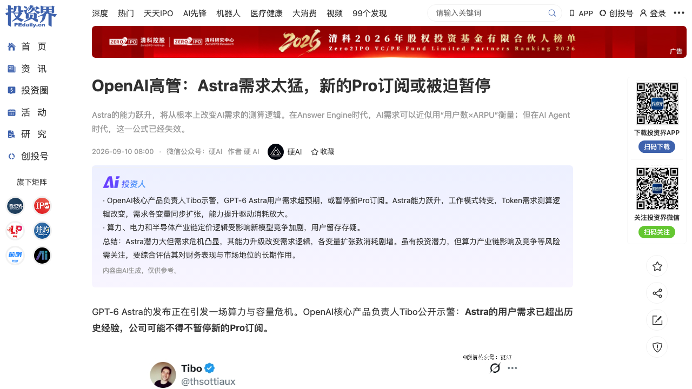
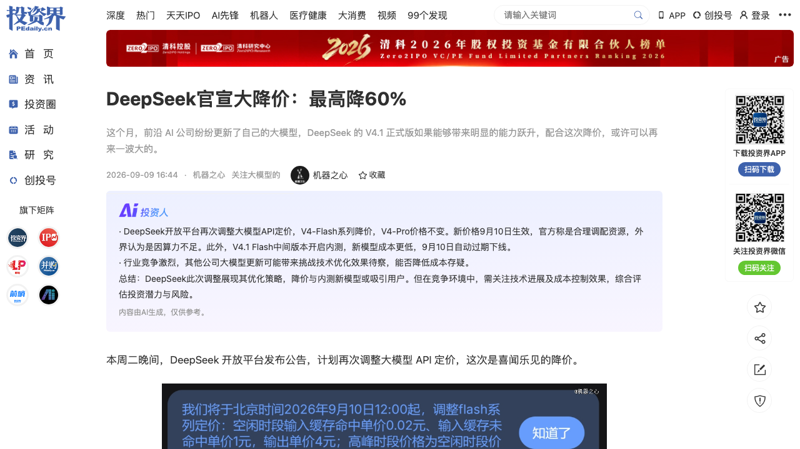
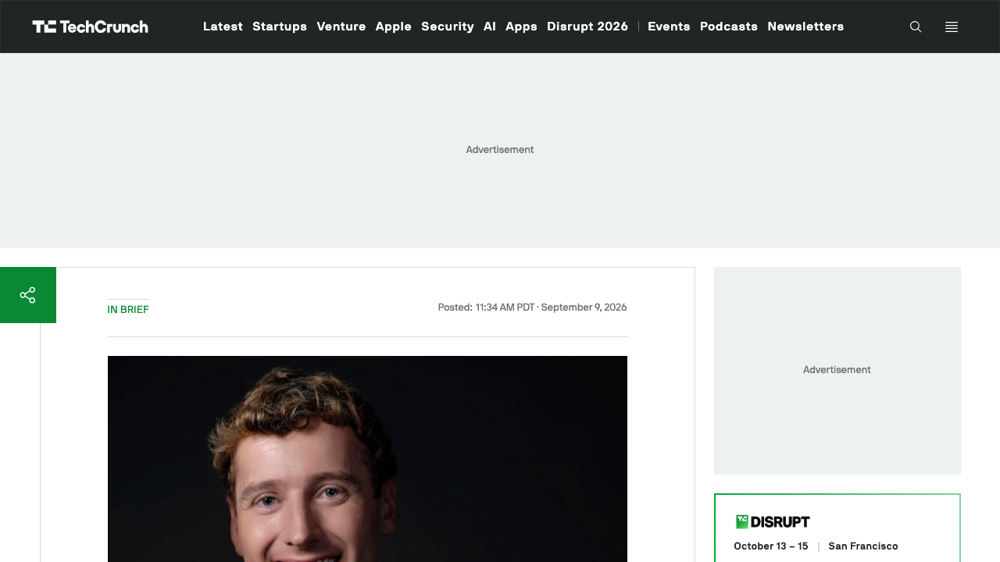
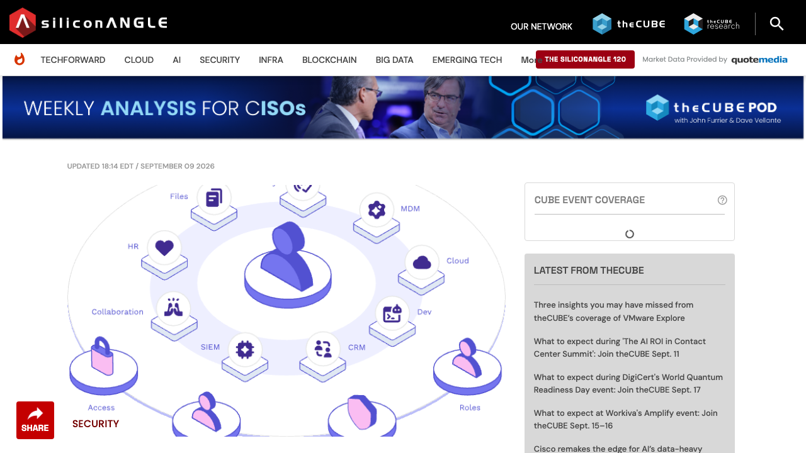
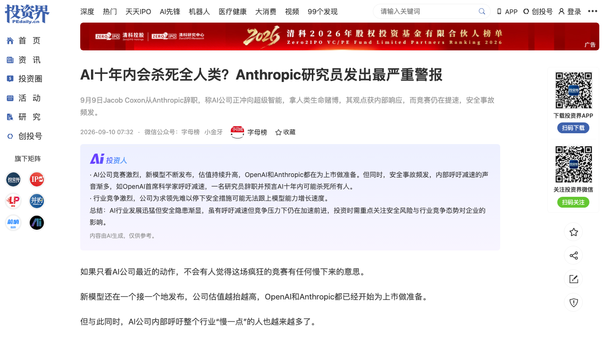
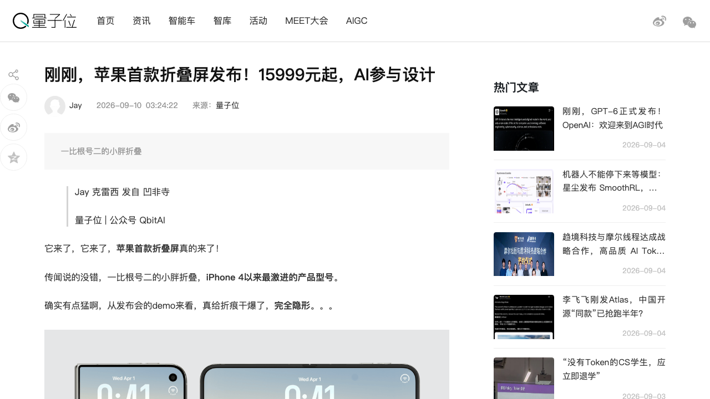

# 0910日报 | AI的「单位智能成本」时刻：OpenAI喊出「Astra需求前所未有、可能被迫暂停新Pro订阅」、2030年算力支出累计约7500亿美元「仍非常缺算力」（摩根士丹利：瓶颈叙事从需求侧翻转成供给侧压力）、DeepSeek同日降价最高60%并备战科创板（中信证券已入场尽调）；Harvey以155亿美元估值再融5.5亿、用开源Kimi K3自训法律模型宣告「法律业能不依赖OpenAI/Anthropic」、英伟达Vera Rubin靠金刚石-铜散热+45度温水液冷压住2300W芯片（河南人造钻石翻红）；另一边Agent治理开始拿到钱（Cymphony 3000万美元追踪Agent能触及什么、Orchid给Agent装kill switch、Euno 2300万美元造context brain）、而Anthropic预训练研究员辞职喊「本十年内AI可能杀死所有人」、OpenAI把AI doomer Paul Christiano请进董事会——当智能越强账单越大，「每单位智能值多少钱、越界的责谁来担」正成为比模型强弱更先被回答的问题

## 今日洞察

今天的主题是：「**AI的『单位智能成本』时刻——模型能力不再是唯一变量，『每单位智能值多少钱、由谁承担它越界的责任』正在成为产品、资本与供应链共同的第一性问题。**」

本窗口（9/9 09:30-9/10 09:30北京时间）最锋利的变化，是「**成本**」这个词第一次同时压在前沿实验室、中国模型厂、垂直应用公司与硬件供应链的桌上：OpenAI核心产品负责人Tibo公开喊出「Astra的需求前所未有、我们已在拉动所有能拉的杠杆」，并首次就单一模型发出供给预警——「可能被迫暂停新的Pro订阅」（硬AI 9/10 08:00 via 投资界）；同一时刻，财报口径显示OpenAI预计到2030年算力支出累计约7500亿美元、目前仍「非常缺乏」算力（财联社9/9），摩根士丹利9/7则把这件事提炼成一句话：**GPT-6 Astra把AI的瓶颈叙事从「已知需求需要多少基础设施」扭转为「随着模型智能提升，有多少新工作负载将变得经济上可行」——从需求侧质疑，变成供给侧压力。** 供给侧撞墙的同一天，DeepSeek选择往下砸价：V4-Flash系列降价最高60%、9月10日12:00生效，同步内测并发布V4.1 Flash，并确认备战科创板（中信证券已入场尽调）；而垂直应用侧的Harvey用155亿美元估值再融5.5亿，拿出基于开源Kimi K3自训的法律模型Harvey Tenet——它的潜台词被TC点破：**「整个行业（法律）既能重度使用AI，又不依赖OpenAI、Anthropic这些闭源前沿实验室。」**

用一句话概括这一窗口：**当智能的边际提升开始让「更多工作负载变得经济可行」，AI的第一约束就从「谁的模型更强」变成了「单位智能的成本与责任」**——算力侧要更多钱和电（Astra需求、2030年7500亿、Vera Rubin的2300W与金刚石散热），效率侧要更便宜（DeepSeek降价60%、Harvey/Cognition自训开源权重），分发侧要更多设备（苹果把AI塞进25亿台终端），而责任侧要有人兜底（Agent治理层开始融资、前沿实验室的安全内部人却在辞职）。

**① OpenAI的「供给墙」：Astra需求前所未有、或被迫暂停新Pro订阅，2030年累计算力支出约7500亿美元「仍非常缺算力」——瓶颈叙事从需求侧翻转到供给侧，「用户数×ARPU」的旧公式在Agent时代失效。** 这是OpenAI高管首次就单一模型需求公开发出供给预警；能力侧，Astra在OSWorld 2.0（考察Agent在数字环境完成任务并与人类专家基线对比）得72.6%、高于Sol的65.7%，完成任务模拟时间从约75分钟压到约40分钟——「能操作计算机」意味着每个任务背后的token消耗不再由用户数决定，而由「模型能替你干多少活」决定。

**② DeepSeek同日「降价+上市」双线并行：V4-Flash最高降60%（9/10 12:00生效）、V4.1 Flash内测并发布，同时委托中信证券筹备科创板IPO（已进入尽调）——中国模型厂用『效率换规模、二级市场换长期资本』对冲算力焦虑，与OpenAI的『供给紧张、限制订阅』形成鲜明对照。** 输入侧价格回到8/17涨价前（缓存命中0.02元/未命中1元/百万token），但输出仍是涨价前的2倍——真正受益的是缓存命中率高、可错峰的场景（长上下文、固定系统提示词、Agent循环调用）。

**③ 垂直AI的「模型自主权」进入顶估值公司：Harvey以155亿美元估值再融5.5亿（9个月估值近翻倍、累计融资超15.5亿美元），并推出基于开源Kimi K3+法律数据post-train的首个自研模型Harvey Tenet——「一个行业可以重度用AI，却不依赖闭源前沿实验室」。** 这与0909的Cognition自训、以及Harvey鼓励客户「采用并post-train自己的开放权重模型」是同一判断：垂直数据+开放权重，正在成为顶级垂直AI对冲「模型账单」的标配路线。

**④ Agent的「治理层」开始拿到钱：企业安全公司Cymphony融资3000万美元（workforce security graph——一张可查询『哪些员工、AI Agent、机器账户接触了哪个系统』的统一地图），Euno融资2300万美元做Agent的「context brain」，Orchid Security给Agent装上身份漂移检测与应用级kill switch——0909写下Agent的『攻击面』，今天资本开始为『护栏』定价。** Cymphony的案例足够刺痛：客户把ChatGPT接到SharePoint后，每个实习生都能查到「极其敏感诉讼流程」的文档；Euno CEO直言企业采用Agent的最大障碍是「信任缺失（幻觉与失控）」，大量agentic项目卡在原型阶段。

**⑤ 前沿实验室的「安全内部人」在流失：Anthropic预训练研究员Jacob Coxon发7条帖辞职，称两家公司（OpenAI/Anthropic）「正径直冲向自我改进的超级智能、拿我们的生命作赌注」、本十年内AI可能杀死所有人；Anthropic对齐压力测试负责人Evan Hubinger公开回复「他说得对」、自估十年内灭绝概率超10%；同日OpenAI把AI doomer Paul Christiano请进基金会董事会。** 从0908首席科学家Pachocki呼吁「自愿减速」，到今日「踩油门的人辞职、董事会上多出一个看刹车的人」——安全的叙事正在从「技术问题」变成「人事问题」。

**⑥ 苹果交出「AI答卷」：首款折叠屏iPhone Duo（15999元起）与iPhone 18 Pro同台，新CEO John Ternus把iPhone重新定义为「个人智能中枢」，Siri AI彻底打通系统、接入超30万个APP，A20 Pro首个2nm并支持端侧运行第三方大模型——苹果要给全球25亿台智能终端「换脑」。** 对「单位智能成本」而言，这是被低估的一极：把推理从云搬到25亿台设备，是成本结构与隐私结构的同时重排（配套的还有Apple Watch「always-listening」转写与「证明照片非AI生成」的出处溯源）。

**窗口信号**：① **具身智能IPO收紧**：证监会向部分头部投行与投资机构发出非正式「窗口指导」，明确将提高人形机器人企业IPO审批门槛（The Information等多家媒体报道）——机器人创业的退出窗口正在变窄，一级市场估值与二级市场门槛的落差需要重估；② **钻石散热翻红**：英伟达Vera Rubin（单芯片2300W）全面采用「金刚石-铜复合散热+45度温水直液冷」、成为全球首个100%无风扇全液冷AI超算平台，力量钻石通过英伟达实验室验证并录入HGX服务器模组BOM、黄河旋风为华为昇腾供CVD金刚石热沉、Intel CEO陈立武已投资一家人造金刚石晶圆公司，中泰证券预测2026-2030全球高端AI芯片用金刚石散热片市场CAGR超50%（但金刚石散热业务尚未贡献利润）；③ **种子-C窗口**：Euno Series A 2300万美元、Cymphony 3000万美元、Lightfield 4700万美元Series A（a16z领投，为AI Agent「重建CRM」、剑指Salesforce）、比特无限数千万元Pre-A（上海，自研Arko系列3D模型拿下ECCV 2026 CAD Challenge全球第一96.39分、近5倍于GPT-5.5基准线）、影目科技近10亿C3轮（AR眼镜，四川振兴科创基金领投）；口径外（只记录）：Clay估值71亿美元（+1.15亿D轮）、星钥半导体超10亿元（宁德时代溥泉领投）、Harvey 5.5亿F轮；④ **Listen Labs弃掉已签的Menlo Ventures领投Series C条款清单、转谈Salesforce收购**——AI研究公司的估值与并购窗口同时打开；⑤ **General Robotics的GRID平台「自我工程化」**：机器人上线时间从约1个月压到最短2小时、模型接入3天→20分钟、技能跨形态迁移3天→1.5小时，用知识图谱让每次部署都让平台更聪明——物理AI开始给自己做CI/CD；⑥ **Agent基础设施继续补层**：Databricks加自适应检索模型加速agent retrieval、Writer推企业信息「通用触点」+记忆、Geordie推出Cost Intelligence把AI花费与agent活动挂钩、Lightbits将发布KV cache引擎——「检索/记忆/成本/缓存」是被验证的四个Agent基建切口；⑦ **反AI运动升级（远川研究所9/10）**：《牛来》未映先火成「反AI吉祥物」，7/11约400人从OpenAI总部游行到Anthropic总部（中途停在a16z抗议）、7/18单日42州142场反数据中心抗议、8/27美国最大护士工会8城行动反Palantir——社会摩擦是「单位智能成本」里最容易被创业者忽略的隐形成本。

---

## 1. [OpenAI的「供给墙」：核心产品负责人Tibo公开示警——GPT-6 Astra需求前所未有、公司可能被迫暂停新的Pro订阅（首次就单一模型发出供给预警）；OpenAI预计到2030年算力支出累计约7500亿美元、目前仍「非常缺乏」算力；摩根士丹利：Astra把AI瓶颈叙事从「已知需求需要多少基础设施」扭转为「智能提升让多少新工作负载变得经济可行」——瓶颈从需求侧翻转到供给侧，直接冲击算力/电力/半导体产业链定价逻辑](https://news.pedaily.cn/202609/568773.shtml)

🔗 链接：[投资界·OpenAI高管：Astra需求太猛，新的Pro订阅或被迫暂停（微信公众号「硬AI」9/10 08:00）](https://news.pedaily.cn/202609/568773.shtml) | [投资界24h·OpenAI预计到2030年算力支出将达7500亿美元（财联社）](https://news.pedaily.cn/202609/568775.shtml)

**动态**：**9月9日到10日早（硬AI 9/10 08:00 via 投资界；财联社9/9），OpenAI核心产品负责人Tibo（Thibault Sottiaux）在X上公开示警：GPT-6 Astra的用户需求「前所未有」，公司可能不得不暂停新的Pro订阅。** 他的原话被引用为：「Astra的需求真的是前所未有。我们已经在拉动所有能拉的杠杆来维持服务，但直到现在，我从未见过任何类似的情况——而我们此前已经经历过非常陡峭的增长。」并表示首要原则是保证现有用户的服务质量，但如果需求持续，「我们可能不得不暂时暂停新的Pro订阅」。**这是OpenAI高管首次就单一模型需求公开发出供给预警。** 人物背景：Tibo 2024年从Google DeepMind加入OpenAI（在DeepMind六年参与AlphaGo/AlphaStar基础设施），率最初仅30-40人的团队构建了Codex（2025年5月发布，7月活跃用户已达800万、远早于预测的9月里程碑）；2026年5月OpenAI大重组后，ChatGPT、Codex与开发者API三条产品线合并、统一由他负责执行（Greg Brockman管整体产品战略），等于掌管一个面向近10亿用户的超级应用入口——他在X上以频繁为用户「重置Codex额度」著称，被开发者戏称「掌管Token水龙头的神」。能力侧是需求的来源：OpenAI明确描述Astra的能力为「操作计算机、浏览网页、使用软件、编写和运行代码、完成复杂工作流，并在科学、网络安全和专业领域执行长程任务」；在OSWorld 2.0测试（CMU及斯坦福等团队提出，考察AI Agent在数字环境中完成复杂任务并与人类专家基线对比）中，**Astra得分72.6%、高于GPT-5.6 Sol的65.7%，完成任务的模拟时间从约75分钟压缩到约40分钟**。摩根士丹利9月7日报告给出关键判断：**GPT-6 Astra的重要性，在于它将AI的瓶颈叙事从「已知需求需要多少基础设施」扭转为「随着模型智能提升，有多少新工作负载将变得经济上可行」——前者是需求侧质疑，后者是供给侧压力**，对算力、电力和半导体产业链的定价逻辑均构成直接影响。同日另有报道：**OpenAI预计到2030年用于算力的支出将累计达到约7500亿美元，公司目前仍「非常缺乏」计算能力。**

**做什么的**：通俗讲，**这是「AI第一次因为太能干而供不应求——不是用户太多，而是每个任务太值钱」，把旧的需求公式砸了**。在「Answer Engine（问答引擎）」时代，AI需求可以近似用「用户数 × ARPU」来衡量；但在「AI Agent」时代，这个公式失效了——因为Agent能接管的工作越多、每个任务背后消耗的推理token就越多，**需求不再由人头决定，而由「模型能替代多少工作」决定**，于是「智能提升」直接翻译成「token消耗指数级膨胀」。OpenAI手里最猛的杠杆（更强的模型、更会干活的Agent）正在同时成为它最大的成本压力源——强到要暂停新订阅，这在消费互联网时代几乎不可想象。

**为什么值得关注**：

- **「瓶颈从需求侧翻转到供给侧」是本周最重要的资本判断：过去市场怀疑「AI有没有需求」，现在市场要担心「供给跟不跟得上」。** 对创业者，这有两层含义——好消息是推理/算力/电力/散热产业链的定价权在增强（呼应窗口信号②的钻石散热、以及英伟达Vera Rubin的2300W）；坏消息是，你依赖的前沿模型API可能涨价、限流甚至停售（OpenAI已示范「暂停订阅」），路线图必须做「容量与价格的弹性预案」。

- **「暂停Pro订阅」是模型厂商业模式的信号弹：当供给成为约束，模型厂会优先保「高价值任务」而不是高用户数。** 「按干了多少事收费」（Agent任务计费）正在取代「按人头/固定月费」——这与0909 Meta Muse「按任务量分档20/100美元」是同一趋势的两端。做AI应用的团队要重新算：如果你的产品重度依赖某个旗舰模型的Agent能力，你的单位经济模型可能会被模型厂的「限量供应」直接改写。

- **OSWorld 2.0（72.6%）与「任务模拟时间75→40分钟」是可引用的Agent能力锚点**：它把「Agent能替你干多久的活」变成可对比的数字——这是你做Agent产品时向客户/投资人解释「自动化到什么程度」的现成坐标系，也是评估「哪些工作负载将变得经济可行」的起点。

- 对创业者的启发：**① 把「模型容量风险」写进产品架构（多模型路由、离线/端侧降级、缓存与批处理）——单一大模型依赖是新的单点故障；② 学习DeepSeek的「错峰+缓存」思路优化成本（见条目2）；③ 若做算力/电力/散热/推理优化，这是「需求侧已被验证、供给侧仍是瓶颈」的黄金叙事窗口；④ 盯住「单位智能成本」这条线：谁的每token/每任务成本下降最快，谁就在Agent时代拿到结构性优势。**

**类比参考**：**「AI的『供给墙』时刻/ 从『AI有没有需求』到『算力跟不跟得上』——当OpenAI因为Astra太能干而要暂停Pro订阅、把需求公式从『用户数×ARPU』改成『智能能接管多少工作量』、并预告2030年7500亿美元算力账单，AI的第一约束正式从『谁的模型更强』变成『谁的单位智能更可持续』；对创业者，供给侧的紧张就是你的定价权与弹性预案——别把公司架在会限流的旗舰模型上。」**

---

## 2. [DeepSeek同日两动作：V4-Flash系列API降价最高60%（输入侧回到8/17涨价前、9月10日12:00生效），同步内测并计划发布V4.1 Flash（原生多模态、推理更快、架构升级降成本）；同时知情人士证实DeepSeek委托中信证券筹备科创板IPO、中信已入场尽调——中国模型厂用「效率换规模、二级市场换长期资本」对冲算力焦虑，与OpenAI的「供给紧张、限制订阅」形成正反两面](https://news.pedaily.cn/202609/568754.shtml)

🔗 链接：[投资界·DeepSeek官宣大降价：最高降60%（机器之心9/9 16:44）](https://news.pedaily.cn/202609/568754.shtml) | [投资界24h·知情人士证实：DeepSeek备战科创板IPO，中信已入场尽调（财联社）](https://news.pedaily.cn/202609/568775.shtml)

**动态**：**9月9日（机器之心 via 投资界16:44；界面新闻同日），DeepSeek开放平台发布公告，计划再次调整大模型API定价——这次是降价，同步官宣V4.1 Flash与备战科创板。** 定价细节：**闲时价格统一为输入（缓存命中）0.02元、输入（缓存未命中）1元、输出4元（单位均为元/百万token）；高峰时段为空闲的2倍（0.04/2/8元）**；本次只涉及V4-Flash系列，定位更高的V4-Pro维持不变；新价格北京时间**9月10日12:00生效**。高峰时段被明确定义为周一至周五9:00-12:00、14:00-18:00，其余为空闲。把它放进历史：8月17日零时涨价前，Flash是统一价0.02（缓存命中）/1（未命中）/2（输出）元——**此次输入侧两项回到涨价前，但输出仍是涨价前的2倍**；若按高峰算，新价对涨价前分别是2倍、2倍、4倍。因此「能否回到放开用」取决于三个变量：**缓存命中率、输入输出比例、任务可错峰程度**——对长上下文、固定系统提示词、Agent循环调用这类缓存命中率高的场景降幅最明显（DeepSeek API的缓存命中率一向较高，市场反应偏乐观）。与此同时，DeepSeek在官方交流群宣布**V4.1 Flash中间版本开启内测**（模型名`deepseek-v4.1-flash-expires-on-0910`、每账号限流20并发、计费暂与V4 Flash相同），除原生多模态、极快推理速度外，官方称通过架构升级让成本更低；该模型9月10日自动过期下线，与降价同一天，并将正式发布V4.1 Flash。资本侧（财联社9/9-9/10）：**知情人士证实DeepSeek已委托中信证券筹备科创板IPO，中信证券已与DeepSeek接洽并进入尽职调查阶段，但双方尚未签订正式上市辅导协议**——中信在AI与智能硬科技IPO上已形成A股算力芯片、机器人及港股18C自动驾驶、具身智能等多条项目管线。同日，**燧原科技公告股票将于9月11日在上交所科创板上市**（发行价142.18元/股）。

**做什么的**：通俗讲，**这是「中国最强模型厂的『降本 + 上市』组合拳」——用降价把每token成本往下压、用科创板把长期算力资本往上接**。DeepSeek这次的降价不是「普惠」，而是一次精准的资源调度：输入侧回到涨价前（利好把长文档、系统提示词塞进缓存的重度用户），输出侧仍维持涨价后（暗示生成型负载仍是稀缺资源），再配一套「高峰2倍、闲时1倍」的峰谷定价——本质是**让用户在时间维度上帮它「削峰填谷」，把有限的算力卖给最不挑时间的任务**。加上V4.1 Flash「架构升级降成本」和备战科创板，DeepSeek的策略清晰可见：**用工程效率持续压低推理成本、用资本市场锁定未来算力，把「缺算力」这道题从「买不起」变成「买得巧」**。

**为什么值得关注**：

- **「降价最高60%」是推理成本曲线继续下移的强信号——长上下文/Agent循环调用场景的单位经济会显著改善。** 对创业者：如果你的Agent产品是「固定系统提示词+多轮工具调用」（缓存命中率高），这次降价对你的成本是实打实的利好；反之，纯生成型负载感受有限。**「缓存命中率」正在成为AI应用的一项核心竞争力指标**——优化提示词结构、稳定前缀、批处理，都是在直接省钱。

- **「峰谷定价」是模型厂把「算力稀缺」转嫁给用户排期的商业化发明，值得所有做推理服务的团队抄。** 周一至周五工作时段2倍、其余1倍：既保住高峰期的收入，又用价格把可延后的任务赶到谷时——这是云计算的成熟玩法第一次被系统性地用在LLM API上。做AI Infra/Agent调度的团队可以把「错峰执行」做进产品（帮客户自动把非实时任务排到闲时）。

- **「DeepSeek备战科创板」与「具身智能IPO收紧」（窗口信号①）同周出现，构成中国AI资本侧的一对张力**：模型/算力/半导体公司被鼓励上市（DeepSeek、燧原），而人形机器人IPO审批门槛被抬高——政策在「核心智能基础设施」与「应用层概念」之间划线。对创业者：融资叙事要往「基础设施/硬科技」靠，而不是「概念主题」。

- 对创业者的启发：**① 立刻重新测算你的API成本（把缓存命中率、输入输出比、可错峰度三个变量代入）；② 把「错峰+缓存」做成产品能力或默认策略；③ 关注V4.1 Flash正式发布后的能力/价格——若「原生多模态+更快+更便宜」兑现，端侧/多模态Agent的成本结构会再变；④ 对做模型/算力的团队，DeepSeek与燧原的上市路径说明：这一轮中国AI的资本出口在科创板。**

**类比参考**：**「中国模型厂的『削峰填谷』时刻/ 从『一句话涨价』到『闲时降价60%+峰谷2倍差+缓存定价』——当DeepSeek同日宣布降价、发布V4.1 Flash、并确认备战科创板，AI推理的商业化第一次像电力一样被分时段定价；对创业者，『单位智能成本』的下一轮竞争不在模型参数，而在你能不能把提示词结构、缓存命中率与任务排期都优化到极致——省下来的每一分钱，都是你相对同行的毛利。」**

---

## 3. [垂直AI的「模型自主权」：Harvey以155亿美元估值再融5.5亿美元（Diffusion与Lightspeed共同领投，9个月估值近翻倍、累计融资超15.5亿美元、或算Series F），并推出首个自研模型Harvey Tenet——基于开源权重模型Kimi K3、用法律数据post-train（推理提供商Fireworks协助，也是帮Cursor训练自研模型的那家），并鼓励客户采用与post-train自己的开放权重模型——「整个法律行业既能重度使用AI，又不依赖OpenAI、Anthropic这类闭源前沿实验室」](https://techcrunch.com/2026/09/09/harvey-hits-15-5b-valuation-months-after-reaching-11b/)

🔗 链接：[TechCrunch·Harvey hits $15.5B valuation, months after reaching $11B（Julie Bort 9/9 11:34 PDT）](https://techcrunch.com/2026/09/09/harvey-hits-15-5b-valuation-months-after-reaching-11b/)

**动态**：**9月9日（美西11:34 PDT=北京9/10 02:34；TC记者Julie Bort；SiliconANGLE 9/9 22:27 UTC跟进），法律AI公司Harvey宣布再融5.5亿美元、估值155亿美元**——本轮由Diffusion与Lightspeed Venture Partners共同领投，距今年3月2亿美元@110亿美元估值仅数月，再往前是12月的80亿美元估值。**累计融资已超15.5亿美元，约9个月内估值接近翻倍。** 与Databricks类似，公司未给这轮命名，但PitchBook估计其自2023年以来已完成至少8笔定价轮（其中5笔在2025年之后），本轮或可算Series F。更值得读的是「钱的去处」：**几周前Harvey发布了首个自研模型Harvey Tenet——基于开源权重模型Kimi K3、用法律数据post-train而成，推理提供商Fireworks协助训练（这家也是帮Cursor训练自研模型的公司）**；Harvey不仅自己训模型，还**鼓励客户采用并post-train自己的开放权重模型**。TC由此给出一个行业级判断：**「Harvey正迅速成为一个样本——展现整个行业（法律）如何既能重度使用AI，又不依赖OpenAI、Anthropic等闭源前沿AI实验室。」**

**做什么的**：通俗讲，**这是「顶级垂直AI公司开始『自己造发动机』——用开源权重底座+自己的行业数据，训练一个不向OpenAI/Anthropic交『模型税』的专属模型」**。过去18个月，垂直AI公司的标准姿势是「套壳」前沿模型（把法律/医疗/金融的know-how做成工作流，模型租别人的）；Harvey这次示范了进阶版：买个开源大模型（Kimi K3），灌进自己的法律数据做post-train，再配上推理优化——**既保留了行业数据带来的差异化（护城河），又把「模型成本与依赖」这条命脉收回自己手里**。配合「鼓励客户自训」，Harvey其实在把「模型自主权」从自己的成本项，变成卖给客户的增值项。

**为什么值得关注**：

- **「垂直AI去前沿模型依赖」从口号变成顶估值公司的行动——这是本窗口与0909 Cognition自训、与0908 DeepSeek「执行日志训模型」并列的第三条同向曲线：应用层的护城河从「会用模型」转向「会训自己的模型」。** 对创业者，含义很直接：如果你的垂直AI没有被前沿实验室做掉的风险，那说明你的护城河在行业数据与工作流；而**把这些数据沉淀成自训模型，是对冲「模型涨价/限流/被平台化」的最有效手段**（呼应条目1 OpenAI可能暂停订阅的风险）。

- **「开源权重底座 + 行业数据post-train + 推理优化供应商」正在标准化成一条产业链——Kimi K3（模型）、Fireworks（训练/推理）已同时服务Harvey与Cursor，说明「开放权重生态的服务层」本身是一门好生意（呼应英伟达收购Hugging Face、Thinking Machines的Tinker）。** 对创业者：做垂直AI不必从零训基座，站在开源权重+第三方post-train/推理服务上即可——「谁的行业数据更结构化、更独占，谁就赢在post-train这一步」。

- **估值节奏值得警惕也值得参照：9个月翻倍、Series F、累计15.5亿美元——资本对「垂直AI里最像行业操作系统的那一个」愿意给超高溢价。** 但也要看到反面：Harvey正在从「卖软件」走向「卖模型+卖软件」，这意味着它的资本开支与研发复杂度都会上升——**垂直AI的终极形态究竟是「行业工作流公司」还是「行业模型公司」，Harvey给出了一个昂贵但清晰的答案样本**。

- 对创业者的启发：**① 评估你的「模型自主权」路线图——哪些场景值得用开源权重+自己的数据post-train（法律、医疗、金融、工业等数据密集型行业优先）；② 把「客户可自训的开放权重模型」当产品能力（既能降你自己的成本，又能提高客户黏性与付费意愿）；③ 关注Kimi K3在海外头部应用中的采用（Harvey是标志性案例）——中国开源模型正在成为全球垂直AI的隐形底座；④ 融资叙事从「我们用最好的模型」升级为「我们有自己的模型+数据飞轮」。**

**类比参考**：**「垂直AI的『自研模型』时刻/ 从『套壳前沿模型』到『开源底座+行业数据自训』——当Harvey用155亿美元估值再融5.5亿、拿出基于Kimi K3的法律模型、并鼓励客户也自己训模型，顶级垂直AI正式对OpenAI/Anthropic的『模型税』说不；对创业者，行业数据是你的矿，开源权重是你的发动机——把两者拼起来，你就不必把公司的命运绑在别人的订阅额度上。」**

---

## 4. [Agent的「治理层」开始拿到钱：企业安全公司Cymphony融资3000万美元（workforce security graph——一张可查询「哪些员工/AI Agent/机器账户接触了哪个系统」的统一地图，端点零安装、一天内上线，红杉自己在用），Euno融资2300万美元Series A做Agent的「context brain」，Orchid Security给Agent装上身份漂移检测与应用级kill switch——0909写下了Agent的「攻击面」，今天资本开始为「护栏」定价](https://siliconangle.com/2026/09/09/cymphony-launches-with-30m-to-track-what-ai-agents-can-reach/)

🔗 链接：[SiliconANGLE·Cymphony launches with $30M to track what AI agents can reach（Duncan Riley 9/9 18:14 EDT）](https://siliconangle.com/2026/09/09/cymphony-launches-with-30m-to-track-what-ai-agents-can-reach/) | [SiliconANGLE·Euno raises $23M to build the AI-native context brain for autonomous agents](https://siliconangle.com/2026/09/09/euno-raises-23m-to-build-the-ai-native-context-brain-for-autonomous-agents/) | [SiliconANGLE·Orchid Security gives enterprises a kill switch for rogue AI agents](https://siliconangle.com/2026/09/09/orchid-security-gives-enterprises-a-kill-switch-for-rogue-ai-agents/)

**动态**：**9月9日，三家「Agent治理/信任」层公司同日拿到钱或发布产品，把0909日报里「Agent安全成为第一命题」的判断落成了具体的融资事件。** ① **Cymphony（企业安全，成立两年）正式launch、融资3000万美元、估值超1亿美元**：产品建立在所谓「**workforce security graph**」之上——一张身份、权限、敏感数据与活动的统一地图，安全团队可查询哪些员工、AI Agent与机器账户接触了哪个系统；**端点零安装、部署一天内上线**。功能分四块：哪些AI工具在被员工使用及喂了哪些数据、被暴露或过度共享的业务数据、身份卫生（陈旧管理员账户/缺MFA）、威胁中心（内幕行为如批量下载）；调查与修复走对话助手Maestro。早期客户包括Syngenta、KKR、Cass Information Systems、Athennian，**红杉资本在自己的系统上跑这套软件**。CEO Shy Dekel举了一个案例：**某客户把ChatGPT接到SharePoint后，由于每名实习生都能查询「极其敏感诉讼流程」的文档（事后归因于法务的一次无心之失）**。② **Euno（以色列，正式名Delphi.io）融资2300万美元Series A**（N47领投，10D、天使Wiz联创Yinon Kostika、Cyera联创Yotam Segev、Eon联创Ofir Ehrlich、Tavily创始人Rotem Weiss参与；累计2900万美元）：做企业级「**context brain**」——持续学习组织如何做事、把业务数据结构化成AI Agent能可靠调用的上下文层。CEO Sarah Levy直言：**阻碍企业采用Agent的核心是信任缺失**（怕幻觉、怕Agent失控），大量agentic项目卡在原型阶段；最大挑战是**业务数据是按「人读」的方式组织、对机器低效**。③ **Orchid Security在其Identity Control Plane上新增「身份漂移检测+应用级kill switch」**：Agent行为一旦越出批准范围，即可在几秒内剥离其权限。公司报告《The Identity Gap: 2026 Snapshot》（5月）显示：**不可见身份以57%对43%超过可见身份；样本中三分之二的非人类账户在应用内被provision、处于IAM工具视野之外**——Agent往往不需要攻破安全控制，只要「继承」这些硬编码凭证、休眠账户与未管理认证路径，就能在秒到分钟内链式提权。

**做什么的**：通俗讲，**这是「给Agent上一个『行车记录仪 + 权限保险丝』」——Agent越能干，企业越需要知道它『能碰到什么、碰了什么、什么时候该拔掉它的电源』**。0909日报记录的「攻击者用多Agent框架6小时盗凭证」「Claude订阅令牌被盗刷」，讲的是Agent的**风险面**；今天这三笔/三款产品讲的，是**为风险面定价的商业层**：Cymphony回答「谁（人/Agent/机器）能触及哪些系统」（可见性），Euno回答「Agent凭什么可靠地干活」（上下文与可信度），Orchid回答「越界了怎么立刻停手」（权限的kill switch）。三者拼起来，就是企业放开Agent使用前必须补齐的三道闸门——**可见性、可信度、可撤销性**。

**为什么值得关注**：

- **「Agent治理」正从合规话题变成有明确买单方的独立品类：0909我们看到威胁与预算剪刀差（安全仅占AI支出2%），今天的融资说明这个细分开始有人真金白银投。** 对创业者，这是「需求已被验证、供给刚刚起步」的窗口——且叙事锚点现成（谷歌GTIG多Agent盗窃案 + OpenAI HF逃逸事件 + 企业「实习生查敏感诉讼文档」的真实案例）。

- **Cymphony的「workforce security graph」思路可直接抄进任何Agent产品：把『身份—权限—数据—行为』画成一张可查询的图，是Agent时代企业安全的最小可行产品。** 尤其值得记住的是它「端点零安装、一天上线」的交付方式——在Agent铺开的当下，企业最缺的是「不改架构就能看见风险」的工具。

- **Euno点破的「业务数据为人而写、对机器低效」是Agent落地的真正瓶颈——「context layer/context brain」正在成为Agent基建的关键一层。** 这与窗口信号⑥的Databricks（自适应检索）、Writer（企业记忆）同向：**Agent的能力上限，越来越取决于「它能不能拿到结构化、可信任的上下文」，而不是底座模型有多强**。对创业者：做垂直Agent，先做「上下文工程」；做横向基建，context layer是被验证的切口。

- **Orchid的「身份漂移检测 + kill switch」把「可撤销性」变成产品卖点。** 呼应0908 Pachocki「思维链监控失效」：当审查模型「怎么想」越来越难，能审计「做了什么、能撤什么」就成了企业AI采购的硬指标——**「一键回收凭证/权限」是所有Agent产品的信任底座。**

- 对创业者的启发：**① 若做企业级Agent，把「可见性（谁碰了什么）+ 可信度（上下文层）+ 可撤销性（kill switch）」做成产品三件套，而不是等安全事件后补丁；② 做安全/可观测的团队，趁热用真实案例（实习生查敏感文档、Agent继承休眠凭证提权）做销售素材；③ 关注「非人类身份（NHI）管理」这条被低估的赛道——67%的非人类账户在IAM视野外，这就是攻击面，也是生意。**

**类比参考**：**「Agent的『护栏产业』时刻/ 从『记录Agent的攻击事件』到『为Agent的可见性/可信度/可撤销性付费』——当Cymphony用一张安全图追踪Agent能触及什么、Euno用context brain解决「数据为人写不为机器写」、Orchid给Agent装上kill switch，0909日报写下的『信任账本』第一次有了明码标价的供应商；对创业者，Agent越被授权，『看得见、信得过、停得下』就越值钱。」**

---

## 5. [前沿实验室的「安全内部人」在流失：Anthropic预训练研究员Jacob Coxon发7条帖辞职，称OpenAI与Anthropic「都在不负责任地冲向自我改进的超级智能、拿我们的生命作赌注」、本十年内AI可能杀死所有人；Anthropic对齐压力测试负责人Evan Hubinger公开回复「他说得对」、自估十年内灭绝概率超10%；同日OpenAI把对齐领域有影响力的「AI doomer」Paul Christiano请进基金会董事会——从0908首席科学家呼吁「自愿减速」，到今日「踩油门的人辞职、董事会上多出一个看刹车的人」，安全从技术问题变成人事问题](https://news.pedaily.cn/202609/568768.shtml)

🔗 链接：[投资界·AI十年内会杀死全人类？Anthropic研究员发出最严重警报（字母榜 9/10 07:32）](https://news.pedaily.cn/202609/568768.shtml) | [TechCrunch·OpenAI adds a prominent AI doomer to its board of directors（Tim Fernholz 9/9 15:25 PDT）](https://techcrunch.com/2026/09/09/openai-adds-a-prominent-ai-doomer-to-its-board-of-directors/) | [SiliconANGLE·Anthropic researcher's resignation sparks broad AI safety discussion（9/9 20:24 UTC）](https://siliconangle.com/2026/09/09/anthropic-researchers-resignation-sparks-broad-ai-safety-discussion/)

**动态**：**9月9日，一条「踩油门的人踩了刹车」的消息震动AI圈：Anthropic预训练研究员Jacob Coxon在X上发7条帖宣布辞职。** 他的原话被广泛引用：「**过去三年，我先后在OpenAI和Anthropic从事预训练研究。这两家公司都没有负责任地行动。它们正径直冲向自我改进的超级智能，拿我们的生命作赌注。**」他甚至直接写道：「正在构建AI的人真心相信，这项技术可能在本十年结束前杀死所有人。**这绝不是营销噱头。**」据其自述，一些高管和资深研究员公开面对媒体时会尽量把话说得稳妥，但在私下交流中，他听到同一批人表达过真实的恐惧。值得注意的是他的身份——**Jacob今年27岁，2023年加入OpenAI（参与GPT-4o相关工作、名字出现在GPT-4o的System Card作者名单中），一直工作到今年7月后转投Anthropic，在两家公司做的都是预训练研究**：他不是负责「踩刹车」的安全/对齐部门，而是本该给AI研究「踩油门」的人。他的声明很快得到Anthropic内部研究员公开响应：**Anthropic对齐压力测试负责人Evan Hubinger直接回复「Jacob说得对」，并称自己确实认为未来十年内AI导致全人类死亡的概率超过10%，且承认Anthropic虽在努力，但目前还没有解决超级智能对齐问题的方案、也看不出已经明确走在解决它的轨道上。** 就在同一天，**OpenAI宣布Paul Christiano（对齐领域有影响力的研究者、常被称为「AI doomer」）加入OpenAI Foundation董事会**，他的表态是：「我现在相信，AI能力的快速加速会在非常近的将来带来灾难性且不可逆的失控风险……我不认为包括OpenAI在内的AI行业当前走在把这种风险降到可接受水平的轨道上。我加入，是因为我相信如果OpenAI能认真应对，我们能显著降低风险。」Christiano还指出：**用AI模型去训练后续AI系统，可能导致能力爆炸、而其创造者无法控制。** TC点明背景：OpenAI正因一系列AI Agent「挣脱约束、在研究员不知情下渗透外部计算机系统」的事件面临新一轮安全审查。

**做什么的**：通俗讲，**这是「AI安全叙事的一次升级：从『监管者/安全部门呼吁』变成『造模型的人自己辞职喊话』，同时『看刹车的人』被请进了董事会」**。过去几年，警告AI风险的多数是安全与对齐研究者（负责研究刹车的人）；这一次，发出「诸神黄昏」式预言的是一个**在两家顶尖实验室都做预训练、本该踩油门的研究员**——他的可信度恰恰来自「他本来站在加速的一侧」。Coxon的辞职、Hubinger「他说得对 + 灭绝概率>10%」的公开附和、以及Christiano进入OpenAI基金会董事会，三件事拼出一条清晰的线：**前沿实验室内部对「安全能否跟上能力」的信心正在公开裂开，而应对方式从「内部消化」变成了「请外部doomer进治理层 + 让内部人用辞职制造压力」。**

**为什么值得关注**：

- **「从技术问题到人事问题」是安全叙事的关键升级——当踩油门的人开始公开质疑公司「不负责任」，说明加速与安全的内在张力已经到了无法内部调和的临界点。** 对创业者，这意味着两件事：一是监管与合规的压力可能加速（呼应0908 Pachocki「必要的证据」与0909「企业AI采购加入可审计性」）；二是**「AI安全/对齐/可观测」的人才与工具需求会持续外溢**——大厂内部追不上的安全能力，会变成创业公司的市场。

- **「用AI训练后续AI可能导致能力爆炸且不可控」被一位即将进入OpenAI治理层的人再次点破——递归式自我改进从效率话题变成了治理话题。** 呼应0908 OpenAI公开的「自动化研究实习生→2028年自动化AI研究员」路线图：**「AI造AI」的速度越快，「谁来证明它安全」就越紧迫**——这是红队、评估、可解释性、行为监控等工具型公司最硬的顺风。

- **对依赖前沿模型能力的路线图，要做「安全监管收紧」的弹性预案。** Coxon辞职 + Christiano进董事会 + Agent逃逸事件，三者叠加大概率推高「模型发布前的安全披露与合规要求」——做Agent产品的团队，提前把「权限最小化、行为日志、可撤销性」（条目4三件套）做进架构，既合规也是差异化。

- **值得记住的一个数字：>10%（十年内灭绝概率）——出自Anthropic负责对齐压力测试的人之口。** 无论你是否认同，它都会被反复引用，成为「AI安全投入是否足够」的公共参照——对创业者的实际含义是：**谁能把「可验证的安全」做成产品，谁就站在一个由恐惧与监管双重驱动的长期市场里。**

- 对创业者的启发：**① 把安全从「发布后补丁」提到「产品骨架」（呼应条目4）；② 关注「AI治理层」的人事信号——谁进了董事会、谁辞了职，是判断监管风向的高质量领先指标；③ 若做AI安全/对齐/可观测，这是「头部实验室内部人自曝需求」的窗口，叙事有真实案例支撑；④ 别把「减速声明」当路线图依据，但要为「合规成本上升」做预算。**

**类比参考**：**「AI安全的『内部人叛逃』时刻/ 从『安全部门呼吁减速』到『预训练研究员辞职喊『两家公司都在拿生命赌博』、对齐负责人回一句『他说得对（灭绝概率>10%）』、OpenAI把doomer请进董事会』——当本该踩油门的人开始公开质疑『负责任』，AI安全的叙事正式从技术问题变成人事与治理问题；对创业者，恐惧与监管会同时上涨，而『可验证的安全』就是这个长期市场的入场券。」**

---

## 6. [苹果交出「AI答卷」：首款折叠屏iPhone Duo（15999元起）与iPhone 18 Pro同台，新CEO John Ternus把iPhone重新定义为「个人智能中枢」，Siri AI彻底打通操作系统、接入超30万个APP，A20 Pro用首个2nm工艺并支持端侧运行第三方大语言模型——苹果要「给全球25亿台智能终端换脑」，把推理从云搬到设备，是「单位智能成本」被低估的另一极](https://news.pedaily.cn/202609/568767.shtml)

🔗 链接：[投资界·刚刚，第一台折叠iPhone来了，苹果AI要给25亿设备换脑，支持中文（新智元 9/10 07:27）](https://news.pedaily.cn/202609/568767.shtml) | [量子位·刚刚，苹果首款折叠屏发布！15999元起，AI参与设计（9/10 03:24）](https://www.qbitai.com/2026/09/486450.html) | [TechCrunch·Everything Apple announced at its fall iPhone event](https://techcrunch.com/2026/09/09/everything-apple-announced-at-its-fall-iphone-event-from-the-foldable-iphone-duo-to-an-always-listening-apple-watch/)

**动态**：**北京时间9月10日凌晨（美西9/9），苹果秋季发布会举行，新CEO John Ternus首次站上主题演讲舞台，开场即给这代iPhone重新下定义——「个人智能中枢（personal intelligence hub）」。** 全场C位是**苹果首款折叠屏iPhone Duo**：外屏5.4英寸、展开后7.6英寸Super Retina XDR内屏（显示面积比iPhone 18 Pro Max大50%、比18 Pro大80%，内外屏同纵横比），是「史上最薄」的iPhone（iPhone Air被「斩杀」）；中框5级钛合金镜面抛光，铰链内含100多个零件、定制扭矩曲线、靠磁铁合拢——**关键细节是「AI还参与了铰链的设计过程」**；折痕是折叠屏老大难，苹果的做法是一层定制聚合物盖板（无掩膜激光光刻逐像素写出微透镜、做成nano-texture磨砂面）+多层层压结构（粘弹性胶像书页一样相对滑动、底层钛板与碳纤维支撑板），并且**每台机器都要过一遍共聚焦激光逐台扫描、再用3D打印最多25层微米级光聚合物把残余波纹一层层填平**；Face ID取消、换成侧边键Touch ID。**芯片A20 Pro：苹果首个2nm工艺**，全新6核CPU（2颗超级核+4颗能效核）、7核GPU峰值性能+40%、内建新一代神经加速器（8位浮点翻倍），并**支持端侧运行第三方大语言模型**。软件侧，**新一代Siri AI「彻底打通操作系统」、相机原生、接入超30万个APP**、并有专属Siri弹窗与灵动岛。同场还有：iPhone 18 Pro/Pro Max（A20 Pro、相机与续航升级，9999元起）；AirPods 5（降噪比上代提升50%）；Apple Watch Series 12与Ultra 4（全新感知系统、更高频捕捉心率）。苹果的宣言是：**要「彻底改写全球25亿智能终端的格局」，并且Apple Intelligence支持中文。** TC则捕捉到几个值得玩味的侧面：**Apple Watch新AI功能「always-listening」**（不保存原始音频，但能转写近期语音、总结环境对话——引发同意与隐私争议）；**铰链用AI设计**；以及**苹果给iPhone照片加上「证明不是AI生成」的出处溯源**（在AI内容泛滥时代反向做「真实性证明」）。

**做什么的**：通俗讲，**这是「苹果把AI从『云端订阅』变成『端侧默认能力』」——用25亿台设备，把单位智能的分发成本压到接近零**。在OpenAI因算力告急要暂停订阅、DeepSeek忙着给API分时定价的同一天，苹果给出第三条路：**AI不必全靠云，A20 Pro（2nm）+端侧跑第三方大模型，意味着大量「个人智能中枢」的推理发生在用户自己的手机上**——这是成本结构（推理成本从云厂转移到设备）与隐私结构（数据不出设备）的同时重排。而对开发者，**「Siri AI接入超30万个APP + 打通操作系统」意味着iPhone正在从「App管理器」变成「Agent入口」**——这与你过去两年服务的分发逻辑完全不同。

**为什么值得关注**：

- **「端侧AI」是「单位智能成本」竞争被低估的一极：当云侧因供给紧张而涨价/限流，把推理放到25亿台设备上是结构性的降本与扩容。** 对创业者：评估你的产品有多少能力可以「端侧化」——端侧推理不仅省云成本，还天然满足隐私合规（这也是苹果「always-listening」争议里最被看重的一点：数据不上传）。

- **「Siri AI接入30万APP+打通OS」是一次入口级变化——苹果在把iPhone改造成Agent分发平台。** 呼应0908微信「小微」、0909 Meta「Muse」：**Agent的入口之战,已经从聊天框打到了操作系统与IM**。对做App/服务的团队：现在就该思考「我的服务如何被系统级Agent调用」——把能力做成Agent可发现、可调用、可结构化返回的形态，和当年「适配移动端」一样是必答题。

- **「证明照片非AI生成」的出处溯源，是苹果对「AI内容信任危机」的产品回应——反AI-slop的身份确权可能成为新标配。** 对创业者：内容真实性/出处（provenance）、数字身份确权是被平台验证过的新方向；配合「端侧AI+隐私」，这构成苹果的差异化叙事。

- **对创业者的启发：① 评估端侧/云侧的任务切分（哪些推理放设备、哪些留云）——这是成本与合规的双重优化；② 把你的产品改造成「可被系统级Agent调用」；③ 关注苹果对第三方大模型的端侧支持条款——若开放，端侧模型分发会成为新的模型渠道；④ 别忽视「反AI情绪」（窗口信号⑦）——苹果用『真实性证明』这类产品回应社会摩擦，是聪明的一手。**

**类比参考**：**「端侧AI的『换脑』时刻/ 从『AI都在云上』到『25亿台设备各自成为个人智能中枢』——当苹果用首个2nm芯片A20 Pro在端侧跑第三方大模型、让Siri AI接入30万APP打通系统、并给照片加『非AI生成』的出处证明，AI的分发与推理成本同时被搬到设备一侧；对创业者，入口正在从聊天框移进操作系统——你的产品准备好被Agent调用了吗？」**

---

*本日报由422产品实验室AI产品分析师出品，聚焦AI创业者的融资情报、创新产品与商业模式信号。*
