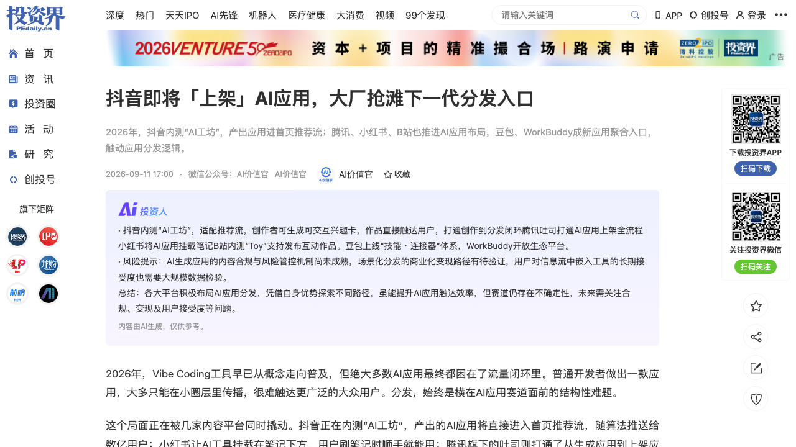
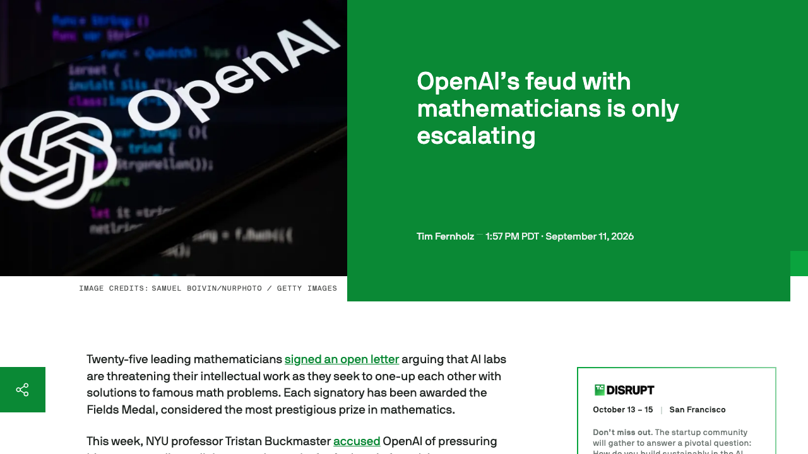
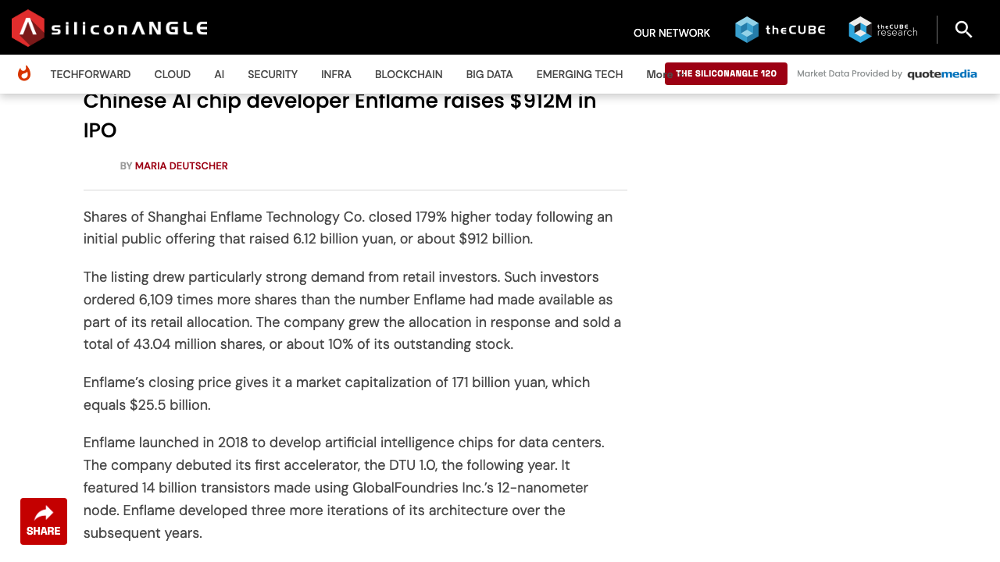
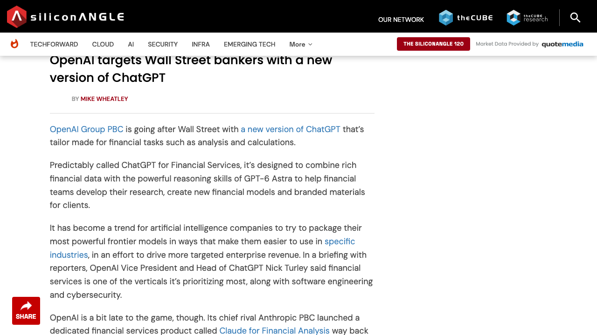
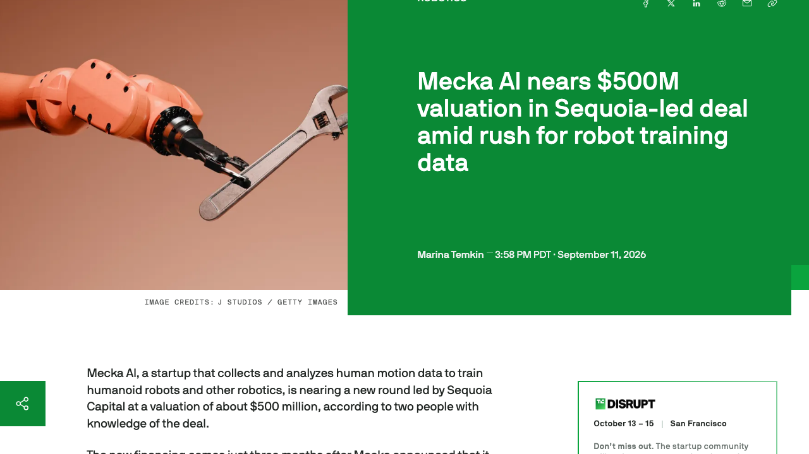
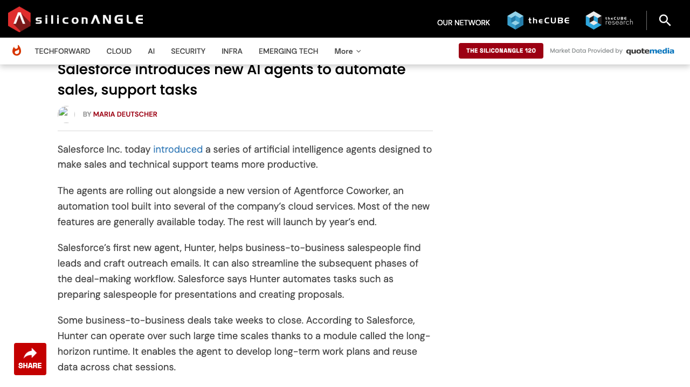
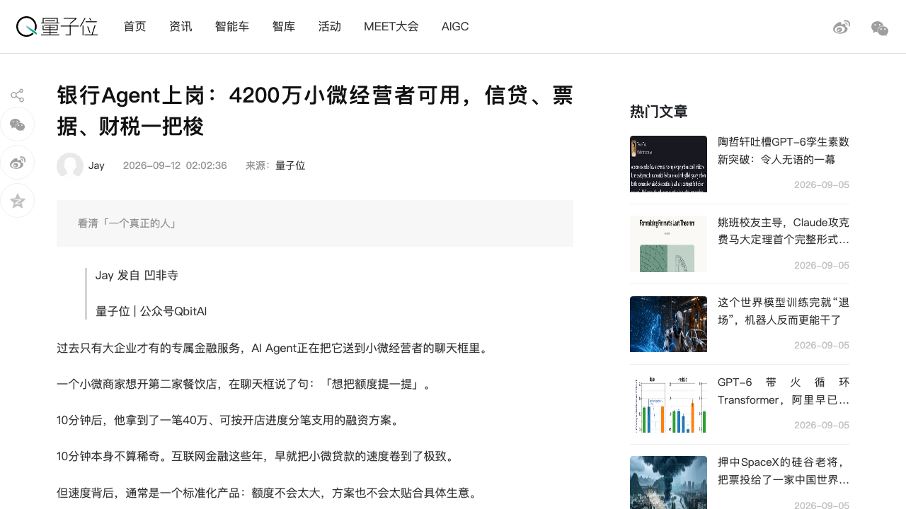
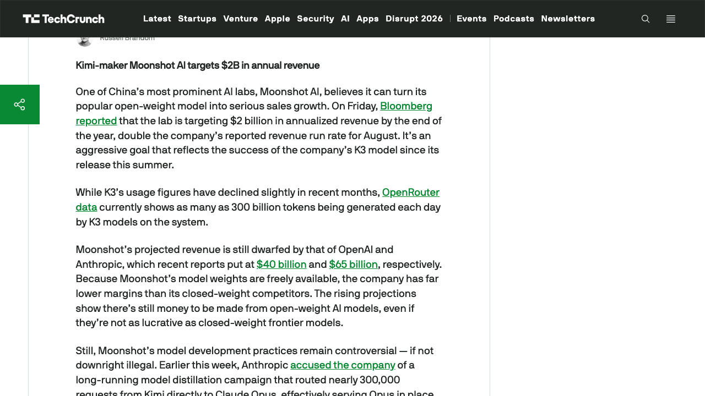

# 0912日报 | AI的「出口」时刻：抖音内测「AI工坊/兴趣卡」把AI应用直接塞进推荐流、四大平台（抖音/腾讯吐司/小红书/B站）争抢AI应用分发入口，豆包连接器与WorkBuddy把办公平台变成新应用商店；燧原科技科创板IPO首日+179%（市值1700亿、腾讯8年浮盈300亿、第4家国产AI芯片IPO）；OpenAI把千禧年难题刷成Benchmark——纳维-斯托克斯引发25位菲尔兹奖得主联名反击、又攻下第二道难题；ChatGPT推出金融服务版、Salesforce一天发布7个Agent、Kimi的月之暗面剑指20亿美元年化收入、红杉领投机器人训练数据公司Mecka估值5亿美元——当「能力」不再稀缺，资本、收入、分发与功劳，成了AI新的四种「出口」

## 今日洞察

今天的主题是：「**AI的『出口』时刻——当智能的产能已经被证明跑在前面（昨日主线「承载力」），这一周资本、企业、平台与学界几乎同时在做同一件事：给智能找『出口』。**」

昨天我们写的是「承载力」：供给、算力、制度、防线四层底座都接不住暴涨的智能产能。今天把镜头转向另一侧——**当「能不能做出来」不再是问题，「能不能送出去」就成了新的稀缺。** 而所谓「送出去」，在这一周同时出现了四种完全不同的形态：

- **资本的出口**：**燧原科技9月11日登陆科创板，首日收涨179%、市值约1700亿元，腾讯8年重仓一笔浮盈超300亿元**——这是过去一年里第4家上市的中国AI芯片公司（前有壁仞、沐曦、摩尔线程），国产AI芯片的「退出通道」正式打开。同期红杉资本领投、估值约5亿美元的机器人训练数据公司**Mecka AI**，也在为「物理世界的智能」找一级市场的出口。
- **收入的出口**：**Kimi的月之暗面（Moonshot AI）把目标直接定到年底20亿美元年化收入**（是8月run rate的两倍），比OpenAI（约400亿美元）与Anthropic（约650亿美元）差了两个数量级，却证明「开放权重也能赚钱」；**OpenAI推出 ChatGPT for Financial Services**、**Salesforce一天发布7个销售/客服/供应链Agent**、**网商银行百灵2.0服务4200万小微商家**——前沿能力正在被逐行「打包」成可收费的垂直产品。
- **分发的出口**：**抖音内测「AI工坊」，产出的「兴趣卡」直接进入首页推荐流**；腾讯「吐司」打通「生成→软著→备案→上架应用宝」的一站式合规链路；小红书把AI应用挂载到笔记、B站用「Toy」承接互动网页、豆包与WorkBuddy用「连接器/Buddy」把办公平台变成新应用商店。**AI应用第一次集体冲出了「做出来没人用」的流量闭环。**
- **功劳的出口**：**OpenAI把千禧年难题当Benchmark「刷」，引发25位菲尔兹奖得主联名反击**——纳维-斯托克斯方程被OpenAI用上万个Agent在几天内攻下，NYU教授Buckmaster公开冲突升级为全球数学界的署名与优先权之争。**当AI能产出「成果」，『成果算谁的』第一次成为硬问题。**

对AI创业者与产品经理而言，今天最务实的判断是：**通用能力的毛利正在被压扁（月之暗面自己承认开放权重毛利远低于闭源），所以「出口」比「入口」更值钱——你要么把智能装进一个垂直行业可付费的通道（金融、银行、客服、供应链、无代码造系统），要么把产品嵌进用户本来就待着的场景（信息流、笔记、办公台），而不是指望用户主动来下载。同时，如果你做的是基础设施或硬科技，「上市退出」的窗口正在打开。**

**① 抖音内测「AI工坊」：产出的「兴趣卡」直接进入首页推荐流，全程无需跳转小程序、不用离开抖音主App，内测期每张通过审核的兴趣卡奖励100元。** 这是一次对「AI应用分发」结构性难题的精准击穿——过去Vibe Coding工具层出不穷，普通人已能快速做出AI应用，**但长期缺乏公域流量出口**。抖音把亿级推荐流量直接向AI应用创作者开放，并把交互内容从侧边栏二级入口（2026年年中的「互动空间」）搬到首页信息流，完成「人找内容 → 内容找人」的切换。**对PM的启发：AI应用的下一波红利不在『生成能力』，而在『谁掌握场景入口』。**

**② OpenAI把千禧年难题刷成Benchmark：攻下纳维-斯托克斯（调动上万个Agent、把数学家预计要十年的路压缩到几天），又宣布在第二道千禧年难题上取得「实质性进展」；此举引发25位菲尔兹奖得主联名信，NYU教授Buckmaster与OpenAI研究负责人Bubeck的通话细节被《纽约时报》补出。** 争议的核心不是「AI能不能做数学」，而是**「AI做出来的成果，署名、优先权、数据来源算谁的」**——Buckmaster指控自己的Codex使用被反哺、OpenAI则更新说法称「7月3日之后的任何用户输入都不可能进入该系统」。**对创业者：当AI让『产出』变得廉价，『归属』就变成了一门需要被设计的生意（贡献度计量、溯源、协作协议）。**

**③ 燧原科技科创板IPO首日+179%、市值约1700亿元，发行价142.18元/股、募资约61.2亿元（约9.12亿美元），散户超额认购6109倍。** 腾讯8年重仓（2018年7月领投3.4亿元Pre-A起几乎每轮加注），持股超20%为最大外部股东，**且2025年为燧原贡献超80%的销售收入、是其第一大客户**——这是一种中国硬科技特有的「股东-客户一体」模式。创始人赵立东出自清华EE85班、在AMD工作20余年；公司8年自研4代架构5款云端AI芯片。**对创业者：在AI基础设施赛道，「场景喂养」（绑定一个大客户做全场景打磨）+「科创板退出」，是当下最清晰的中国式路径。**

**④ AI应用的分发入口正在被四家内容平台同时撬动：抖音（算法推荐/AI工坊）、腾讯（双轨：微信内『小微』+生态外吐司一站式上架）、小红书（笔记挂载RED Skill，超7300个原创Skill）、B站（Toy互动网页，1个多月超300件作品/体验量超850万次）。** 与此同时，豆包（超200个技能与连接器）与WorkBuddy（首批上百款Buddy应用）正在把AI办公平台变成「新应用商店」。野村7月数据显示，**抖音以19.4%的用户时长份额首次超越微信的18.8%**——注意力的主战场已经转到内容信息流。

**⑤ OpenAI推出 ChatGPT for Financial Services：企业订阅+定向申请（仅「合格机构」），可连接Bloomberg/FactSet数据与约50个MCP连接器，预载Crunchbase/Pitchbook/Daloopa/LSEG，支持高/中/低effort档、直接生成PPT/Excel/网页仪表盘。** 这是前沿模型「垂直化变现」的标准动作——ChatGPT负责人Nick Turley明确说金融是优先垂直（另有软件工程与网络安全）。风险也被同时点名：**高盛合伙人担心自动化初级任务会导致下一代银行家的「认知萎缩」（cognitive atrophy）。**

**⑥ Salesforce一天发布7个AI Agent（Hunter/Piper/Carter/Casey/Fin/Paige/Marshall），并升级 Agentforce Coworker：新增多Agent编排（Multi-Agent Orchestration）、子Agent输出质量持续优化、AI Skills，以及能让Agent跨会话、跨数周工作的 long-horizon runtime。** 其中支持客服的Fin基于Salesforce今年36亿美元收购的技术。**对做企业Agent的团队，这是「Agent军团化 + 长时程任务 + 角色脚本（Agent Script）」三件套的产品化样本。**

**⑦ 网商银行百灵2.0首次披露AI银行落地进展：面向4200万小微商家，八大AI工作台覆盖风控/人审/营销/产研。** 案例：小微商家一句「想把额度提一提」，10分钟内拿到一笔40万元、按开店进度分笔支用的融资方案；风控台「千里眼」把分析颗粒度从「客群」细化到「客户」，把带两个风险标签但实为高速扩张的连锁摄影商家判别为可授信；台风过境广西时，从一位果农的一句求助，推导出数万名产业链上下游客户的延期还款/免息方案。**这可能是本周「AI交付真实结果」最有说服力的中国样本。**

**⑧ 月之暗面（Kimi）把目标定到年底20亿美元年化收入（是8月的两倍），K3模型在OpenRouter上每天生成多达3000亿tokens。** 但要注意两点：一是开放权重导致其毛利远低于闭源对手；二是它本周正被Anthropic指控长期蒸馏Claude（近30万次请求被路由、超2300万条响应被收集）。**对创业者：开放权重路线能做出收入，但需要极强的成本工程（呼应DeepSeek V4.1-Flash的架构效率）。**

**窗口信号**：① **AI编程与Agent工具继续补层**：百度秒哒企业版把「自然语言造系统」推进企业业务流（过去一年用户增长200倍、创造500万个商业价值应用、87%创作者此前不会写代码、办公协同系统比外包报价50万/年省下全部成本）；Dynatrace×Arize把可观测性从「检测」推向「行动」；Extreme Networks的Agent ONE Coworker把网络运维从「看仪表盘」变成「直接给答案」；RunningHub让MiniMax H3本地推理提速12倍。② **资本侧**：Cognition AI完成320亿美元E轮、估值480亿美元；Mistral AI获近35亿美元（三星领投）；Ayar Labs的E轮扩至6.5亿美元（光互连替代铜互连、目标2028年量产）；迦智科技赴港IPO（18C）；比特无限完成数千万元Pre-A（ECCV全球物理3D竞赛夺冠）。③ **安全与治理**：Anthropic研究员Jacob Coxon以「实验室在拿我们的命赌博」为由辞职，其对齐科学负责人认同「AI十年内消灭人类概率>10%」；OpenAI首席科学家呼吁AI研究减速；Anthropic称AI已让单人操作者发动国家级黑客行动。④ **企业与生态**：Instagram/字节等继续抢AI分发（抖音母公司字节新模型可实时生成空间视频）；Oracle云基础设施收入翻倍；Adobe Q4指引不及预期；DeepSeek据称聘请中信证券筹备科创板IPO、并史上最大招聘扩招150名工程师；腾讯重仓燧原浮盈300亿成为国产芯片退出样本；「腾讯WorkBuddy/豆包」把办公平台变成应用商店；3万台无人车公司转向「城市级物理AI」。

## 1. [AI应用的分发出口之战：抖音内测「AI工坊/兴趣卡」把AI应用直接塞进首页推荐流，腾讯「吐司」一站式上架应用宝、小红书笔记挂载RED Skill、B站Toy承接互动网页；豆包连接器与WorkBuddy把办公平台变成新应用商店——「应用分发的核心矛盾，已从『怎么让用户下载』变成『怎么嵌入用户的场景』」](https://news.pedaily.cn/202609/568893.shtml)

🔗 链接：[投资界·抖音即将「上架」AI应用，大厂抢滩下一代分发入口（9/11，via AI价值官）](https://news.pedaily.cn/202609/568893.shtml)

**动态**：**9月11日（投资界转发AI价值官），一篇调研披露了正在同时发生的「AI应用分发入口之战」。** **抖音**正在创作者中心小范围上线「AI工坊」工具（邀请制内测，口号「把好想法变成好玩法」），配套产出的「**兴趣卡**」已进入首页推荐流灰度测试。与短视频、图文不同，兴趣卡是一种**依托个性化推荐分发的可交互AI内容载体**：用户在刷信息流时可直接触达，在卡片内完成问答查询、趣味测试、信息生成、轻量互动，**全程无需跳转小程序、也不用离开抖音主App**。AI工坊界面为「左（技能库/资源库/项目库）—中（自然语言对话创作区）—右（实时预览与发布区）」，面向完全不懂代码的创作者；有技术能力者可改底层文件做深度定制，调试/真机预览/发布在同一环境完成。**为冷启动，抖音对内测期每张通过审核的兴趣卡提供100元现金奖励。** 这并非首次尝试：2026年年中抖音已上线「互动空间」独立广场（创作者用字节Trae自然语言生成互动作品），但当时仍是侧边栏二级入口——**AI工坊+兴趣卡的真正突破，是把交互内容直接置入首页推荐流。** **同期其他平台**：**腾讯**走双轨——微信生态内「小微」AI助手（6月灰度，一句话生成仅个人自用、不开放转发/支付/通讯录的小工具），生态外「**吐司**」5月上线安卓版，**8月19日推出「一站式上架」付费功能**（生成应用后可完成软著申请、App备案、合规文件生成，一键提交上架应用宝），被称为国内首个打通「AI应用从生成到正式上架」的合规链路；**小红书**在WAIC宣布全量上线RED Skill、内测Vibe Coding小工具并升级Builder Hub，AI应用挂载于笔记、用户无需跳转直接使用，站内已涌现超7300个原创Skill、今年2月以来每月新增4-5万件作品，AI被上升为一级部门Dots；**B站**6月起内测网页内容发布平台「Toy」，本地创意网页一键发布为站内可访问可玩的互动作品，1个多月已有超300件作品、用户体验量累计超850万次。**与此同时，AI办公平台正变成新的应用聚合入口**：豆包8月上线「技能·连接器」体系（已上架超200个技能与第三方连接器，含飞书/企业微信/钉钉/同花顺/天眼查/企查查）；腾讯WorkBuddy 9月初开放生态平台（首批接入上百款Buddy应用，含通达信/腾讯电子签/美图）。**背景数据**：野村证券7月显示，抖音以19.4%时长份额首次超越微信18.8%，字节系5款应用合计占Top50应用时长的40.9%（腾讯系29.1%）。

**做什么的**：通俗讲，**这是「给AI应用补上最后一块短板——出口」。** 过去两年，Vibe Coding工具让「做出一款AI应用」变得极简单，但绝大多数应用最终都困在流量闭环里：普通开发者做出来的东西只能在小圈层传播，**AI应用卡住的从来不是『能不能做出来』，而是『做出来谁看得见』**。这次的集体动作，本质是把内容平台的公域流量向AI应用开放：**抖音用算法推荐做中心化分发、腾讯用合规链路做上架、小红书/B站用内容社区做嫁接**。它印证了一个正在发生的转变：**用户获取并使用工具的成本，已经降到和刷一条视频、读一条笔记差不多**——对大量轻量化、场景化、一次性的AI应用而言，**信息流的触达效率已明显优于传统应用商店**。而豆包/WorkBuddy代表的另一条路径（把工具封装成自然语言背后「按需调用」的能力模块）则说明：**传统应用商店『先下载再使用』的逻辑，正在从娱乐与办公两端被同时消解。**

**为什么值得关注**：

- **对PM最重要的一句话：产品设计的起点从「下载漏斗」变成「场景嵌入」。** 过去你优化的是App Store截图、首屏、注册转化；现在你要优化的是「用户在哪一个已有场景里、会顺手用到你」。**能做成一张「卡片/一个Skill/一个连接器」被嵌进信息流或办公台的产品，会比做成一个独立App的产品更快拿到规模。** 对创业者：**如果你在做C端AI工具，优先问『我能不能成为抖音的一张兴趣卡、小红书的一个Skill、豆包的一个连接器』，而不是『我怎么把App下载量做上去』。**

- **「合规上架」本身正在商品化——腾讯吐司把软著/备案/合规文件做成付费流水线，这是一个被忽视的B端生意。** 大量AI应用卡在「生成之后如何合法上线」，谁能把这条链路做成标准化、可付费的服务（或API），谁就能吃到海量长尾开发者的「上架税」。

- **对做内容/分发的团队：互动内容的停留时长天然高于单向视频，这是短视频增长见顶后的新抓手。** 全网短视频用户已10.74亿、使用率95.4%，**平台需要能拉升时长的「新内容形态」**——可交互AI卡片正好填这个缺口。**对创业者，这意味着『为信息流设计AI应用』（轻量、即用即走、单次完成）会比『为留存设计』更匹配平台的分发逻辑。**

- **对创业者的启发**：**① 做C端AI工具，先想「嵌入哪张信息流/哪个工作台」；② 做开发者工具，考虑把「合规上架」做成服务；③ 警惕不确定性——AI生成应用的内容合规与风控机制尚未成熟、场景化分发的变现路径仍待验证（平台补贴（如100元/卡）能否持续存疑）；④ 关注「注意力入口」的迁移，押注分发渠道时优先看时长份额而非DAU。**

**类比参考**：**「AI应用的『分发』时刻/ 从『做出来没人用』到『平台把亿级流量直接向AI创作者开放』——当抖音把AI应用塞进首页推荐流、腾讯吐司把『生成到上架』做成一条付费流水线、小红书/B站用内容社区给工具导流、豆包与WorkBuddy把办公台变成应用商店，AI应用的分发逻辑被彻底改写：用户获取工具的成本降到和刷一条视频一样低；对创业者，产品设计的起点不再是『用户怎么下载我』，而是『用户本来待在哪，我能不能被顺手调用』。」**

---

## 2. [OpenAI把千禧年难题「刷」成Benchmark：攻下纳维-斯托克斯方程（调动上万个Agent、数天压缩数学家预计十年的路），又宣布在第二道千禧年难题上取得「实质性进展」——25位菲尔兹奖得主联名反击，NYU教授Buckmaster与OpenAI研究负责人Bubeck的通话细节被《纽约时报》补出，「AI的成果署名算谁的」摆上台面](https://techcrunch.com/2026/09/11/openais-feud-with-mathematicians-is-only-escalating/)

🔗 链接：[TechCrunch·OpenAI's feud with mathematicians is only escalating（9/11 20:57 UTC）](https://techcrunch.com/2026/09/11/openais-feud-with-mathematicians-is-only-escalating/) · [量子位·OpenAI这是拿千禧年难题当Benchmark刷啊（9/11 01:46 UTC，引《纽约时报》追访）](https://www.qbitai.com/2026/09/487092.html)

**动态**：**9月11日，这场「AI vs 数学界」的冲突全面升级。** **第一，联名反击**：25位顶尖数学家签署公开信，每位都是菲尔兹奖得主，**指控AI实验室在「用解决著名数学难题来互相攀比」的过程中，正在威胁他们的智力劳动**——信中说，这些证明「往往被仓促宣布，没时间做恰当的撰写、新方法的提炼与他人既往工作的引用」，并警告**「和所有创造性职业一样，这带来了严重的署名与抄袭问题」**；公开信还提醒「你的领域就是下一个」。**第二，冲突核心**：NYU教授**Tristan Buckmaster**此前（本月早些时候）指控OpenAI在其与一位Anthropic数学家**Levent Alpöge**的千禧年问题（纳维-斯托克斯）成果公开前「借力抢先」；**《纽约时报》最新追访补出前所未知的细节**——**OpenAI向Buckmaster提供了几种「选择」**（两位数学家先发欧拉方程成果、OpenAI次日再公布纳维-斯托克斯证明；由Buckmaster担任主要作者整理OpenAI模型生成的论文；为Buckmaster提供充足算力继续自己的研究；并愿意公开推荐100万美元千禧年大奖的荣誉归属）。Buckmaster觉得这是在「收买」自己。OpenAI研究负责人**Sébastien Bubeck**承认「不希望Alpöge出现在最终论文中」（理由是「怎么能让一名Anthropic员工参与OpenAI内部项目」），也承认说过「公开这件事会毁掉你的职业生涯」但称是「极其糟糕的措辞」并当场收回道歉。**第三，数据争议**：OpenAI更新了用户数据说法——**「Buckmaster过去两个月的Codex提示词绝不可能以任何方式影响内部模型，7月3日之后的任何用户输入也不可能进入这套系统」**，并称「无法完全排除匿名用户数据曾帮助改进模型」，但**仍是单方面说法、无公开技术材料可独立核查**。**第四，动作升级**：**OpenAI已宣布在另一道千禧年难题上取得「实质性进展」、正在准备公布**；周四，**OpenAI撤回其对加州理工（CalTech）一场数学活动的赞助**（此前被该校研究者批评）。**背景方法**：西班牙数学家Diego Córdoba与Luis Martínez-Zoroa数年前提出通过一串精确外力「踢击」逼出流体方程奇点的策略，Buckmaster设题、Alpöge把问题输入Anthropic模型并反复反馈修正；**按过去节奏这条路由数学家接力或需再用十年，而OpenAI调动上万个Agent把这段路压缩到了几天。** 这已是本月第二次讨论（0909我们已记录最初的Buckmaster指控）。

**做什么的**：通俗讲，**这是「AI第一次在人类最看重的智力圣殿里『刷榜』，把功劳与署名的老规矩撞了个粉碎」。** 数学界的传统是：一个重大证明要被同行完整理解、验证、引用、整合进数学体系，才算「活着」；而AI让「产出证明」变成一次算力冲刺（**几千万美元的推理、上万个Agent、几天时间**）。**于是冲突的本质不是「AI能不能做数学」，而是三件更难的事：① 归属（这个证明算谁的）；② 优先权（谁先发布）；③ 数据来源（我用的Codex，是否反哺了对手的模型）。** 值得注意的是，**数学家真正恐惧的是『赛跑取代交流』**：如果前沿实验室一看到有用路径，就愿意花几千万美元用LLM抢在原始研究者之前完成证明，那么**开放研究的文化会被激励转向保密**——这对整个科学生态是结构性的伤害。

**为什么值得关注**：

- **「贡献度计量与归属」正在从学术问题变成产品问题。** 当AI能批量产出「成果」，**谁贡献了多少、如何溯源、如何在多方（甚至竞争公司）之间分配功劳，会需要全新的工具与协议**（类似代码领域的commit/署名、内容领域的溯源）。**对创业者，这是一个被严重低估的赛道：面向科研/研发组织、基于AI的『贡献度计量与优先权存证』产品。**

- **对用AI做研发的企业团队：要提前设计「AI产出的人机协作规则」。** OpenAI事件暴露的典型冲突是——**研究者用AI工具（Codex/Claude）做出的工作，其成果与数据是否被工具方『借力』**。**对你的团队，这意味着：在合同里明确AI工具使用数据的边界；在流程上记录AI产出的来源与人的贡献比例；在署名上建立规则。** 越早做，越不容易在成果公布时陷入争议。

- **「算力换首发」是一种正在成型的新竞争范式，它会重塑科研的资源配置。** 过去一个团队的资金决定「能做多少实验」，现在**「能否调集上万Agent做几天高强度推理」直接决定「谁先拿到证明」**。对做AI4Science的团队：**算力预算要按「一次冲刺」而非「长期迭代」来规划，同时要把『可验证性』做成第一优先级（否则成果无法被学界接受）。**

- 对创业者的启发：**① 别把「AI能做科学」当成纯利好——它同时制造了署名、数据、优先权的摩擦，做工具的人能吃到这波；② 与高校/研究者合作时，提前约定贡献与署名规则；③ 关注「AI生成的成果如何被验证」——验证工具与流程可能是比生成更刚需的市场；④ 对做知识管理的团队，「协作中的出处与溯源」将成为标配能力。**

**类比参考**：**「AI的『署名危机』时刻/ 从『证明属于发现它的人』到『证明属于调动了最多算力的人』——当OpenAI用上万个Agent在几天内拿下纳维-斯托克斯、又扑向第二道千禧年难题，25位菲尔兹奖得主联名捍卫『理解与传承』的旧秩序，这场冲突真正的战场不是『AI能不能做数学』，而是『AI做出来的东西算谁的』；对创业者，凡是AI放大了『产出』的领域，『归属与溯源』都会立刻变成一门新生意。」**

---

## 3. [燧原科技科创板IPO：首日收涨179%、市值约1700亿元、募资约61.2亿元，散户超额认购6109倍——腾讯8年重仓（最大外部股东、且贡献超80%收入）一笔浮盈超300亿元；这是过去一年第4家上市的中国AI芯片公司（前有壁仞/沐曦/摩尔线程），「科创板退出」成为国产AI芯片最清晰的资本出口](https://news.pedaily.cn/202609/568897.shtml)

🔗 链接：[投资界·腾讯重仓燧原：一笔浮盈300亿（9/11）](https://news.pedaily.cn/202609/568897.shtml) · [SiliconANGLE·Chinese AI chip developer Enflame raises $912M in IPO（Maria Deutscher 9/11 20:54 UTC）](https://siliconangle.com/2026/09/11/chinese-ai-chip-developer-enflame-raises-912m-in-ipo/)

**动态**：**9月11日，上海燧原科技正式登陆上交所科创板。** 发行价142.18元/股，**开盘大涨超190%，市值一度冲破2000亿元，首日收盘市值约1700亿元**（据SiliconANGLE，收涨179%，IPO募资61.2亿元人民币约9.12亿美元，市值1710亿元约255亿美元）。**散户需求极端旺盛——超额认购6109倍**，公司因此扩大配售、共计发行4304万股（约占总股本10%）。**创始人**：赵立东（清华EE85班、美国犹他州立大学硕士、在硅谷工作20余年、AMD多年负责CPU/GPU/APU及核心IP）与张亚林（复旦、曾任AMD全球芯片研发主要负责人之一），2018年3月在上海创办燧原，分工为「赵主战略融资业务、张主产品研发生产」。**8年自研迭代4代架构5款云端AI芯片**，构建覆盖AI芯片、加速卡与模组、智算系统与集群、AI计算及编程软件平台的完整体系。**最新一代L600**支持训练与推理，配114GB RAM、3.6Tbps内存带宽、采用HBM3（英伟达最新Rubin用HBM4）。**腾讯的角色**：2018年7月领投3.4亿元Pre-A轮起「几乎每年融一轮」加注，**招股书显示持股超20%（据SiliconANGLE为IPO后17.95%），为最大外部股东**；**且腾讯是核心客户，2025年为燧原贡献超80%的销售收入（SiliconANGLE称83%）、是其第一大客户**；在最终战略配售中获配约174.71万股、约2.48亿元。**简单计算，腾讯一笔投资账面浮盈超300亿元。** **融资历程**：种子轮（亦合资本/真格基金/达泰资本/云和资本/上海科创集团，上海科创集团以约1亿元估值投100万元）、Pre-A 3.4亿元（腾讯领投）、A轮3亿元（红点创投领投）、B轮约7亿元（武岳峰领投）、C轮约17亿元（CPE源峰/中金资本/春华资本领投）、C+轮（国家大基金）、D轮超20亿元（2023年，国方创投6.3亿元领投）、Pre-IPO约27亿元（上海国投IC与腾讯联合领投）——**一级市场累计融资近百亿元**。**财务**：2025年收入9.902亿元（+37%）、亏损收窄25%至11.6亿元；公司预计今年前9个月收入翻倍多至23-30亿元、2026年底或2027年实现盈利；募资将用于第5、6代加速器研发。**行业位置**：燧原是过去一年第4家上市的中国AI芯片公司（前有壁仞、沐曦、摩尔线程，均首日大涨且现价仍高于开盘）。

**做什么的**：通俗讲，**这是「中国AI芯片拿到了自己的退出通道，也把一种独特的『股东-客户一体』模式跑通了」。** 全球AI芯片创业公司的经典困境是：**芯片要投巨额研发、要迭代数代才有竞争力，但客户不敢用、订单起不来、资本市场看不到现金流就不给钱**。燧原的解法是**绑定一个大客户做「场景喂养」**：腾讯既给钱（8年持续加注、最大外部股东），又给场景（贡献80%+收入、从2019年小批量试点到全场景大规模部署）——**这让燧原在早期就拿到真实的、大规模的、可迭代的订单，从而把『融资-研发-订单』的飞轮转起来**。而科创板则提供了**退出的第二半**：让早期投资人（真格、红点、武岳峰、国方、上海国资等）拿到回报、让公司拿到扩张所需资金。**这套组合，正是当下中国硬科技（尤其是AI基础设施）最清晰的路径。** 值得注意的是，**燧原上市与「具身智能IPO审批收紧」同周出现**（0909已记录）——**政策在「核心智能基础设施」与「应用层概念」之间划线。**

**为什么值得关注**：

- **对硬科技创业者：『绑定战略客户』是比『拿VC钱』更重要的生存策略。** 燧原的故事说明，**在AI芯片这种需要长期迭代、客户验证极难的赛道，一个愿意同时做股东和客户的大厂，价值远超多融一轮钱**——它给你真实的场景、真实的收入和反哺研发的反馈。**但要警惕代价：客户集中度80%+意味着公司命脉系于一家，招股书本身就是风险披露的核心。** 对创业者的取舍：**早期用「战略客户」换生存与验证，但要在获得竞争力后尽快多元化客户结构。**

- **「科创板」正在成为中国AI基础设施的标准退出路径，这会影响融资谈判的估值锚。** 过去一年4家AI芯片公司上市、DeepSeek据称也在筹备上市（聘中信证券），**说明资本市场对「国产算力/半导体」给了明确的上市预期**。**对创始人的启示：融资叙事要往「基础设施/硬科技（可上市）」靠，而非「概念主题」；投资人对这类公司的估值，会越来越多地按『能否走到科创板』来贴现。**

- **对做AI应用/服务的团队：国产算力的『性价比拐点』值得持续跟踪。** 燧原（及壁仞/沐曦/摩尔线程）拿到资本后会加速迭代，**国产推理芯片的每tokens成本可能进一步下降**——这与DeepSeek V4.1-Flash（架构效率）和Positron（绕开HBM）是同一个方向：**应用层的成本结构还会继续变。谁能把「国产芯片+国产模型」的组合调到最优，谁就在成本上领先。**

- 对创业者的启发：**① AI基础设施创业者，优先找「既是投资人又是客户」的战略方；② 但要设计客户多元化路线图，避免80%单一客户依赖；③ 应用层团队持续关注国产推理芯片的性价比；④ 判断一个AI硬科技项目，看它的「场景喂养方」和「退出路径」，而不只是技术参数。**

**类比参考**：**「中国AI芯片的『退出』时刻/ 从『投进去出不来』到『科创板首日+179%、腾讯一笔浮盈300亿』——当燧原用『腾讯既当股东又当80%客户』的场景喂养模式跑通8年、成为一年内第4家上市的国产AI芯片公司，中国硬科技的资本循环第一次被打通：早期投资人有退出、公司有扩张弹药、大厂有可控供应链；对创业者的启示很直接——在需要长期迭代的硬科技赛道，一个愿意同时做股东和客户的大厂，比多一轮融资更值钱，但要记得尽早把客户结构从『一家』扩到『多家』。」**

---

## 4. [OpenAI推出 ChatGPT for Financial Services：企业订阅+定向申请（仅「合格机构」），可连Bloomberg/FactSet、预载Crunchbase/Pitchbook/LSEG、约50个MCP连接器，支持高/中/低effort档并直接生成PPT/Excel/网页仪表盘——前沿模型「垂直化变现」的标准动作，同时引发「初级银行家认知萎缩」的担忧](https://siliconangle.com/2026/09/10/openai-targets-wall-street-bankers-with-a-new-version-of-chatgpt/)

🔗 链接：[SiliconANGLE·OpenAI targets Wall Street bankers with a new version of ChatGPT（Mike Wheatley 9/10 21:54 EDT）](https://siliconangle.com/2026/09/10/openai-targets-wall-street-bankers-with-a-new-version-of-chatgpt/)

**动态**：**9月10日（美东21:54），OpenAI推出面向华尔街的 ChatGPT for Financial Services**，把丰富的金融数据与 GPT-6 Astra 的推理能力结合，服务金融团队做研究、建财务模型、制作客户品牌材料。**接入方式**：银行需先购买企业订阅、再直接向OpenAI申请（**目前仅面向「合格机构（eligible institutions）」**）。**功能与数据**：界面与标准ChatGPT类似，但增加金融数据源开关——**可连接银行自有数据，或Bloomberg、FactSet等提供商的数据集**；OpenAI还提供Crunchbase、Pitchbook、Daloopa、LSEG News的预载数据；**约50个Model Context Protocol（MCP）连接器**用于连接其他数据与第三方软件；**凡使用这些数据生成输出，都会提供详细引用**。用户可选择ChatGPT以**高/中/低effort**生成（effort越高、消耗token越多、越慢，但质量更好）；除问答外，**可直接生成PowerPoint幻灯片、Excel表格与网页仪表盘**。**典型场景（并购）**：OpenAI称用户可用多数据集做深度研究，从一个prompt生成「详细工件」——例如「对一笔收购，比较标的与同业、测试收入增长如何影响估值，并把整个分析变成可编辑的模型或pitchbook（使用公司模板）」。**定位**：ChatGPT负责人Nick Turley称金融是与软件工程、网络安全并列的最优先垂直之一，并说「这是我们希望行业采用的canonical product（标准产品）」；他称自己深度参与了开发，曾与摩根士丹利、Evercore等机构打磨需求，并强调「demo里好看的输出和真正可用的输出之间差别很大」。**竞争**：OpenAI在时间上落后——Anthropic早在2025年5月就推出了 Claude for Financial Analysis。**风险**：自动化初级任务可能让银行减少招聘初级员工，**高盛合伙人Chris Churchman警告这可能导致下一代银行家的「认知萎缩（cognitive atrophy）」**；Turley则回应称这只是生产力提升（「他们通常一周工作100小时」）。

**做什么的**：通俗讲，**这是「把通用大模型『切成』一个行业专属产品，然后按席位收费」的标准打法——也是当前AI公司最现实的收入出口。** 通用ChatGPT的付费天花板有限（消费端订阅+API），**而垂直行业的付费意愿和客单价高得多**：一家投行有成千上万的分析师，如果他们每人每天省下几小时做PPT/建模/做研究的时间，企业订阅费是很容易算得过账的。**产品设计上有三个值得学的点**：① **数据接进来（Bloomberg/FactSet/MCP连接器）**，让模型从「泛泛而谈」变成「引用可靠来源」——这是金融场景的信任前提；② **产出物对齐工作流（PPT/Excel/仪表盘/pitchbook模板）**，AI不只要「回答」，要直接交付客户已经习惯的「工件」；③ **effort档位（高/中/低）把「推理成本」变成用户可调的旋钮**，让用户自己权衡质量与速度。**它同时暴露了垂直AI最尖锐的组织问题：当AI接走了初级员工的「学徒任务」，企业的人才梯队从哪里来？**

**为什么值得关注**：

- **这是「垂直化变现」的教科书案例，值得所有做B端AI产品的团队拆解。** 关键不是「加一个行业提示词」，而是三件事：**把行业权威数据接进来（信任）、把产出物做成行业标准工件（可用）、把成本变成用户可调的档位（规模化）。** 对创业者：**如果你在做行业AI，先问自己『我的客户每天要交付什么工件（报告/模型/PPT/代码/图纸）』，然后让AI直接产出它——而不是让用户自己在对话框里来回搬运。**

- **「数据连接器（MCP）+ 引用」正在成为企业AI产品的默认标配。** 约50个MCP连接器 + 详细引用，意味着**「可追溯、可审计」是金融（及一切强监管行业）采购的硬门槛**。**对做企业Agent的团队：把『每一个结论都能点回数据源』做成产品能力，它比模型分数更能决定你能不能进采购名单。**

- **对用人方与产品经理：垂直AI会重构「初级岗位」的价值链，这是一个组织设计问题，不只是技术问题。** 高盛担忧的「认知萎缩」是真实的：**如果一个行业的新人成长依赖『做学徒任务』，而AI把这些任务接管了，企业必须重新设计『人如何获得判断力』的路径。** **对AI产品团队，这也是机会：做『帮新手快速建立领域判断力』的AI训练/陪练产品，可能比『替新手干活』更有长期价值（也更少被抵制）。**

- 对创业者的启发：**① 做垂直AI，优先「数据接入+标准工件+成本档位」三件套；② 把引用/溯源做成合规通行证；③ 定价按席位而非按token，匹配企业预算逻辑；④ 注意组织阻力——用「生产力提升」而非「替代人力」来叙事，同时考虑为「学徒环节」设计替代性产品。**

**类比参考**：**「垂直AI的『标准品』时刻/ 从『一个模型服务所有人』到『一个行业一个产品』——当OpenAI把GPT-6 Astra切成金融服务版、接上Bloomberg与50个MCP连接器、直接产出PPT/Excel/pitchbook，前沿模型最现实的收入出口被找到：不是卖token，而是把『分析师的工作流』整体包成一个可按席位收费的产品；对创业者，做行业AI的公式已经很清晰——接入权威数据、产出行业标准工件、把成本做成可调档位，同时警惕你正在重构的不只是工作流，还有整个行业的人才梯队。」**

---

## 5. [红杉资本领投机器人训练数据公司 Mecka AI，估值约5亿美元——距其上一轮6000万美元融资仅3个月；它付费让人佩戴身体传感器+手机记录日常动作（煮咖啡/修车）来训练人形机器人，对标「Scale AI之于LLM」——「具身智能的瓶颈不是模型，而是物理世界的数据」正在成为共识](https://techcrunch.com/2026/09/11/mecka-ai-nears-500m-valuation-in-sequoia-led-deal-amid-rush-for-robot-training-data/)

🔗 链接：[TechCrunch·Mecka AI nears $500M valuation in Sequoia-led deal amid rush for robot training data（9/11 22:58 UTC）](https://techcrunch.com/2026/09/11/mecka-ai-nears-500m-valuation-in-sequoia-led-deal-amid-rush-for-robot-training-data/)

**动态**：**9月11日（TechCrunch），机器人训练数据公司 Mecka AI 正接近完成一轮由红杉资本（Sequoia Capital）领投的新融资，估值约5亿美元**（据两位知情人士；具体金额未披露，条款尚未最终确定）。**这距离它上一轮仅3个月**——此前Mecka宣布完成6000万美元融资，由Framework Ventures领投，Menlo Ventures、SV Angel、Kindred Ventures参与。**公司**：2024年由四位创业者共同创立（加拿大人Josh Gao与Mogen Cheng此前做餐饮金融科技，Jason Chong的加密交易所被Coinbase收购后加入，Duy Nguyen负责运营），**四人皆无机器人背景**，但识别出「物理世界数据匮乏」是把通用机器人（含人形）卡住的首要瓶颈。**业务**：Mecka（名字源自「mecha」——被人类操控的巨型机器人）**付费让人们用身体传感器和智能手机记录自己执行日常任务（如煮咖啡、修车）**，以「以自我为中心（egocentric）」的方式采集真实世界交互数据。**它的定位是「对机器人做 Scale AI、Mercor、Surge 等人类数据公司对LLM所做的事」。** 联合创始人Gao今年6月告诉《财富》，公司预计**2026年底达到1亿美元年化收入（run rate）**。**竞争格局**：TechCrunch上周报道 **XDOF 正接近一轮新融资、估值12亿美元**；此外还有向LLM之外扩展的人类数据平台Scale AI与Micro1。**客户**：未公开，但许多机器人公司与AI实验室依赖这类真实世界数据（与遥操作等其他物理数据采集方式并用）来构建模型。

**做什么的**：通俗讲，**这是「给机器人当『驾校+题库』」的生意——当大模型把『脑力』的燃料（文本）烧得差不多了，『具身智能』缺的是『体力』的燃料（真实世界的动作数据）**。为什么真实数据这么关键？因为**机器人要学的不是「知道怎么做」，而是「手怎么动」**：拿起一个形状不规则的杯子、在湿滑地面保持平衡、把纸箱码成不会倒的垛——**这些「物理常识」无法从互联网文本里学到，只能从真人在真实环境中的动作里采集**。Mecka 的模式本质是**把「数据采集」工业化、规模化**：**用众包（付费给普通人）+ 传感器 + 手机，把零散、昂贵、难以标准化的真实动作，变成可批量供给的机器训练数据**。**它的估值逻辑**：如果机器人是下一个平台，那么**训练机器人的数据就是下一个『石油』**——而Mecka是这个油田的「开采商」。三个月内估值再到5亿美元（且上一轮才6000万），说明**资本正在抢在「机器人放量」之前，抢占数据供给的卡位**。

**为什么值得关注**：

- **「具身智能的瓶颈是数据而非模型」正在成为行业共识，这打开了一个清晰的数据服务赛道。** 对创业者：**如果你在做机器人/具身智能的数据采集，几条被验证的路径是：众包采集（Mecka）、遥操作（teleoperation）、仿真合成数据、以及「真实作业现场」的数据合作（工厂/仓库/餐厅）。** 关键是**采集的标准化与可复用性**——数据能被多少种机器人、多少种任务复用，直接决定它的价值。

- **「人类数据平台」正从LLM扩展到物理世界，这是一个值得留意的平台级机会。** Scale AI、Micro1这类做文本标注的公司，能力正迁移到「物理动作标注」；**谁能把『数据采集→清洗→标注→交付』做成流水线，谁就有机会成为具身智能时代的Scale AI**。对创业者：**平台型机会在「数据标准」和「采集网络」，垂直型机会在特定场景（家庭/工业/物流）的高质量数据。** 但要注意：**这类生意前期靠资本烧钱补贴采集者，毛利与规模效应是关键考验。**

- **对做机器人应用/产品的团队：数据供给的丰富程度，会决定你能做哪些场景。** 当Mecka/XDOF这类公司把「家庭日常动作」「工业作业」的数据做起来，**中小团队就能像调用API一样调用「物理动作数据」来微调自己的机器人策略**——这会显著降低具身智能创业的门槛，把竞争从「谁能采数据」转向「谁能定义好场景」。

- 对创业者的启发：**① 具身智能的钱正在流向「数据层」，早期创业者可切入数据采集/标注/复用；② 三个月估值连跳（6000万融资→5亿估值）说明资本对『机器人数据卡位』极度饥渴，但也要警惕估值前置、收入未验证（Mecka的1亿美元只是预测）；③ 无论做机器人还是做数据，把「数据的标准化与复用率」当成核心指标；④ 对应到产品：为具身智能设计「数据工具链」（采集/回放/标注/评测）可能是一门被低估的基础设施生意。**

**类比参考**：**「具身智能的『石油开采』时刻/ 从『机器人缺的是更聪明的模型』到『机器人缺的是真实世界的动作数据』——当红杉领投Mecka（付费让普通人佩戴传感器做家务来采集数据）、估值3个月从6000万融资跳到5亿美元，而XDOF估值已达12亿美元，资本正在抢在机器人放量之前抢占『燃料』：训练人形机器人靠的不是更多文本，而是更多真实的手怎么动、脚怎么站；对创业者，这是从LLM数据标注延伸到物理动作数据的平台级机会，但也要记住——油田值钱的前提，是机器人真的会放量。」**

---

## 6. [Salesforce一天发布7个AI Agent：销售侧 Hunter/Piper/Carter、客服侧 Casey/Fin、内部 Paige/Marshall，并升级 Agentforce Coworker 加入「多Agent编排」与能跨会话、跨数周工作的 long-horizon runtime——「Agent军团化 + 长时程任务 + 角色脚本（Agent Script）」三件套的产品化样本](https://siliconangle.com/2026/09/11/salesforce-introduces-new-ai-agents-to-automate-sales-support-tasks/)

🔗 链接：[SiliconANGLE·Salesforce introduces new AI agents to automate sales, support tasks（Maria Deutscher 9/11 19:40 EDT）](https://siliconangle.com/2026/09/11/salesforce-introduces-new-ai-agents-to-automate-sales-support-tasks/)

**动态**：**9月11日（美东19:40），Salesforce发布一系列AI Agent，让销售与技术支持团队更高效，并与新版 Agentforce Coworker 一同推出。** 大部分新功能当天GA，其余年底前上线。**7个新Agent**：**Hunter**（帮B2B销售找线索、撰写外联邮件，并自动化演示准备、提案撰写等后续环节；**因B2B交易常需数周完成，它依靠一个叫 long-horizon runtime 的模块，让Agent能制定长期工作计划、**跨聊天会话复用数据**——该运行时首发仅用于Hunter，未来将扩展到更多Agent）；**Piper**（可嵌入企业网站，迎接B2B潜客并导向最相关的销售）；**Carter**（帮线上零售商回答消费者产品问题，含聊天内结账widget）；**Casey**（自动化处理退货请求等客服任务）；**Fin**（同类客服场景，**基于Salesforce今年36亿美元收购的技术**）；**Paige**（面向内部help desk，回答员工的HR问题与技术支持请求）；**Marshall**（为供应链团队自动化重复任务）。**定制方式**：企业可用一种叫 **Agent Script** 的编程语法定制Agent，它允许开发者要求Agent以特定方式执行重要任务，从而**降低幻觉风险**。**Agentforce Coworker升级**：① **Multi-Agent Orchestration**（把复杂任务拆分给多个专门的子Agent）；② 持续优化子Agent的输出质量；③ **AI Skills**（让员工更容易定制Coworker执行任务的方式）。

**做什么的**：通俗讲，**这是「企业软件把AI从『一个助手』升级为『一支有编制的团队』」。** 值得学的产品设计有三点：**① Agent军团化与角色化**——不是一个大Agent包办一切，而是**按岗位分角色**（Hunter=销售开发、Piper=前台接待、Carter=导购、Casey=退货专员、Paige=内部IT/HR支持），每个Agent有明确职责、可嵌入具体触点；**② 长时程任务（long-horizon runtime）**——过去的Agent只能完成一次会话内的任务，**而销售周期是数周、跨多次沟通的，Agent必须能「记住并推进长期计划」**，这是企业Agent从「demo」走向「真实业务」的关键能力；**③ 角色脚本（Agent Script）**——允许用代码**强制关键步骤按特定方式执行**，本质是**给概率模型装一个确定性骨架**，用来压住幻觉和合规风险。**这三件套，基本就是「企业级Agent」当下最实用的产品化范式。**

**为什么值得关注**：

- **「多Agent编排 + 长时程记忆」是企业Agent最有价值也最难的两件事，Salesforce给出了可抄的模板。** 对做Agent产品的团队：**① 别再想做一个万能Agent，按用户岗位/触点拆成一组专职Agent，各自可嵌入、可度量；② 把「跨会话、跨周的长期任务」当成核心能力（记忆、计划、状态），这是拉开与「单轮Copilot」差距的地方；③ 用「脚本/规则」约束关键路径，把可靠性做成产品卖点（尤其面向合规行业）。**

- **「角色化Agent」的定价与商业模式值得关注：它天然按『岗位/席位』收费，而不是按token。** 这与ChatGPT for Financial Services一样，**说明企业AI正在集体转向「按价值（岗位/席位）而非按成本（token）」定价**。对创业者：**把Agent包装成「一个虚拟员工/一个岗位」来报价，通常比「按用量」更容易被企业预算接受。**

- **Salesforce把「收购能力」快速产品化（Fin基于36亿美元收购）是一个值得学习的节奏。** 大厂用「自研框架（Agentforce）+ 收购垂直能力（Fin）」补短板，**意味着垂直Agent创业公司有明确的『被收购出口』**——**对做客服/销售/供应链等垂直Agent的团队，把场景做深、做出口碑，被平台收购是一条现实路径。**

- 对创业者的启发：**① 企业Agent按「岗位角色」拆分，配长时程记忆与任务编排；② 用确定性脚本约束关键步骤以降幻觉；③ 定价锚定「虚拟员工」而非token；④ 垂直Agent团队注意「平台化竞争」——要么做深被收购，要么做平台做不了的非标场景。**

**类比参考**：**「企业Agent的『编制化』时刻/ 从『一个AI助手』到『一支有角色的Agent军团』——当Salesforce一天放出7个各司其职的Agent（Hunter找线索、Piper迎客、Carter导购、Casey退货、Paige管内部IT），并给它们装上能跨数周推进的 long-horizon 记忆和能压住幻觉的脚本骨架，企业AI的产品范式被定型：不是更强的模型，而是更像『一个团队』；对创业者，按岗位拆分、按『虚拟员工』定价、用脚本保可靠，是当下最实用的一套打法。」**

---

## 7. [网商银行百灵2.0：面向4200万小微商家的「AI银行」，八大AI工作台覆盖风控/人审/营销/产研——一句「想把额度提一提」，10分钟给出40万元分笔支用的融资方案；台风过境广西时，从一位果农的求助推导出数万名产业链客户的服务方案](https://www.qbitai.com/2026/09/487631.html)

🔗 链接：[量子位·银行Agent上岗：4200万小微经营者可用，信贷、票据、财税一把梭（9/11 18:02 UTC）](https://www.qbitai.com/2026/09/487631.html)

**动态**：**9月11日（量子位），网商银行在2026外滩大会上首次披露其AI银行落地进展：百灵2.0已面向4200万小微商家提供服务。** **前台案例**：一个小微商家想开第二家餐饮店，在聊天框说「想把额度提一提」，**10分钟后拿到一笔40万元、可按开店进度分笔支用的融资方案**——百灵结合他此前的经营与信贷记录，通过多轮对话把他的模糊意图还原为真实需求（新店投入约60万元：品牌/装修/设备约45万、房租/首批备货/周转约15万；自筹20万、缺口40万），并提示补充经营与用途材料。**但报告强调：前台只是GUI入口，真正的能力在后台——网商银行一口气建了八大AI工作台，把风控、人审、营销、产研等核心生产环节全面AI化**：**「千里眼」**（千人千面风控，把分析颗粒度从「客群」细化到「客户」——苏州一家连锁摄影商家系统里挂着「评级较差、负债较高」两个风险标签，按传统逻辑会被直接拦截，千里眼沿决策链回溯发现其实是「两年内把同一门生意开到6座城市、9家门店、月营收稳定70多万」的高歌猛进，最终把「拒绝」变成匹配其经营节奏的方案）；**「定海针」**（赋能人审专家——一次内部测试中，它几秒内把客户的经营、融资、履约及保证人信息浓缩成一页简报并给出初步建议，专家逐项追问后发现三处被忽略的实际情况（电商轻资产、同业支持弱≠生意不好；多次申贷是因存储设备涨价需提前扩采），重新推理后客户成功获批180万元，标注自动回流系统）；**「宝莲灯」**（天气/事件驱动的批量服务——2026年7月台风过境广西，南宁武鸣沃柑种植户老谭的二十亩果园受灾，它迅速交叉验证对话、卫星遥感、经营流水与区域事件，推理出受灾的不止老谭，还有一批种养殖户及其上下游的农资经销商、冷链物流商，随即生成针对性的延期还款、免息方案，从一个人开口到数万名产业链客户收到方案）。**研发侧**：网商银行内部推进AI Coding（但明确**并非可「随手生成」的Vibe Coding，代码仍须遵守金融合规、经过规范评审/测试/审核**），并打造「筋斗云」让AI打通各部门、建立高质量上下文——其反直觉的结论是：**AI Coding提升了单个程序员的写码速度，但需求澄清、交互设计、系统分析、测试、合规审核如果跟不上，省下的时间又会耗在跨部门会议对齐里。**

**做什么的**：通俗讲，**这是「把AI从『聊天客服』变成『真正交付金融结果的系统』」——也是本周『AI落地真实业务』最有说服力的中国样本。** 很多银行AI项目的通病是：**前台做了个好用的对话框，后台却还是人工审批，AI沦为「高级智能客服」，交付不了实际结果**。网商银行的路径恰好相反：**它把AI铺满全流程（风控/人审/营销/产研），让前台的一句话真正驱动后台的决策链**。三个案例各展示了一种「AI超越单点效率」的能力：**「千里眼」展示『更细的颗粒度』**（从客群到客户，避免误伤真实的经营扩张）；**「定海针」展示『人机协同』**（AI做信息整理与初判、专家做最终判断，且专家标注回流系统）；**「宝莲灯」展示『一个信号触发一片服务』**（从个体求助推导出产业链的系统性需求）。**这三件事，都是传统规则引擎做不到、而通用Chatbot也做不到的——它需要AI+数据+行业知识+流程权限的深度耦合。**

**为什么值得关注**：

- **「前台一句话、后台全流程AI化」才是金融/政务等重流程行业AI落地的正确姿势。** 对做行业AI产品的团队：**别只做入口（对话框），要打通决策链**——**你的AI能不能直接驱动风控、审批、定价、批量处置，决定了它是「成本项」还是「利润项」**。**关键指标不是「用户聊了多少」，而是「AI驱动的流程完成了多少真实结果（放款/理赔/审批）」。**

- **「AI+卫星遥感+区域事件」这类多源数据融合，打开了「事件驱动的批量服务」这一新场景。** 宝莲灯的案例说明：**当AI能把『个体痛点』放大为『一群人的共同处境』，金融服务就从「等人来申请」变成「主动批量触达」**。**对创业者：保险（灾损预判）、供应链金融（原材料价格波动）、零售（天气/节日备货）都有类似的『事件驱动批量服务』机会，核心是『多源数据融合+批量决策』。**

- **「人机协同」是金融AI的现实答案，也是产品设计的关键（AI做整理/初判，人做判断，标注回流）。** 定海针的案例显示：**AI不是取代人审专家，而是把专家的经验变成可复用的推理框架，同时让专家的标注回流训练系统**——**这既解决了「专家稀缺」，又解决了「经验难沉淀」**。**对做专业服务AI的团队：设计『AI初判 + 人工终审 + 标注回流』的闭环，比一味追求全自动更容易在强监管行业落地。**

- **对做AI Coding/研发提效的团队：网商银行的提醒极其重要——「编码快了，但其他环节没快，等于白快」。** 它打造「筋斗云」的目的正是**打通各部门、建立高质量上下文**，让需求澄清→设计→编码→测试→合规不再靠会议对齐。**这说明：AI研发提效的真正瓶颈不在「写代码」，而在「跨角色的上下文传递」——这也是一个被低估的产品方向。**

- 对创业者的启发：**① 做行业AI，优先打通后台流程而非只做漂亮前台；② 用多源数据融合做「事件驱动的批量服务」；③ 在强监管行业采用「AI初判+人审+标注回流」；④ 做研发提效产品，聚焦「跨角色上下文」，而不是只优化写码速度。**

**类比参考**：**「AI银行的『结果交付』时刻/ 从『一个会聊天的客服』到『一个会走完整条决策链的系统』——当网商银行用八大AI工作台把4200万小微商家的「我想提额」在10分钟内变成一笔40万的融资方案、用卫星遥感把一位果农的受灾推导成数万产业链客户的纾困方案，AI在金融业的价值终于从『省人力』变成『交付真实结果』；对创业者，凡是重流程行业（金融/保险/政务/医疗），AI落地的胜负手都不在对话框，而在它能否真正驱动后台的决策与批量处置。」**

---

## 8. [月之暗面（Kimi）把目标定到年底20亿美元年化收入（是8月的两倍），K3每天在OpenRouter上生成多达3000亿tokens——但开放权重意味着毛利远低于闭源（OpenAI约400亿/Anthropic约650亿），且正被Anthropic指控长期蒸馏Claude](https://techcrunch.com/2026/09/11/kimi-maker-moonshot-ai-targets-2-billion-in-annual-revenue/)

🔗 链接：[TechCrunch·Kimi-maker Moonshot AI targets $2B in annual revenue（9/11 19:35 UTC）](https://techcrunch.com/2026/09/11/kimi-maker-moonshot-ai-targets-2-billion-in-annual-revenue/)

**动态**：**9月11日（TechCrunch引彭博），中国最受关注的AI实验室之一月之暗面（Moonshot AI）认为，它能把自己流行的开放权重模型变成实实在在的销售增长。** 彭博报道称，该公司**目标在年底实现20亿美元年化收入，是其8月报告收入run rate的两倍**。**这是一个激进的目标，反映出其K3模型自今夏发布以来的成功。** 虽然K3的使用量近几个月略有下滑，**但OpenRouter数据显示，K3模型目前在系统上每天生成多达3000亿tokens**。**对比**：Moonshot的预期收入与OpenAI（近期报道约400亿美元）和Anthropic（约650亿美元）相比仍相形见绌。**由于Moonshot的模型权重是免费开放的，其毛利率远低于闭源对手。** **争议**：Moonshot的模型开发实践仍具争议、甚至可能违法——**本周早些时候，Anthropic指控该公司进行了长期的模型蒸馏campaign，将近30万次请求从Kimi直接路由到Claude Opus（实际上是用Opus代替Kimi自家模型作答），总计从Anthropic模型收集了超过2300万条响应用于Moonshot的训练。** 不过，上升的收入预期表明：**即便开放权重模型不如闭源前沿模型赚钱，也依然能做出可观的收入。**

**做什么的**：通俗讲，**这是「开放权重路线的一次商业化压力测试」——证明『免费给权重』也能挣钱，但赚的是『薄利的辛苦钱』。** 商业逻辑上有一条清晰的算术：**开放权重 = 任何人都能自己部署 = 你必须靠极致的成本工程（推理效率/单位成本）来竞争，毛利天然更薄**；而**闭源前沿模型靠「别人拿不到的能力」维持高毛利**。月之暗面给出的答案，是把「收入」的规模做起来（20亿美元年化）——**这在to B/开发者市场是可能的，因为『便宜且够用』本身就是一种巨大的需求**（尤其在中国、以及成本敏感的场景）。**把它放进本周主线**：它与DeepSeek V4.1-Flash（架构效率降本70%）、Positron（绕开HBM降本）、国产AI芯片（燧原等）是**同一个方向——当『能力』不再稀缺，『单位成本』和『可获得的收入』才是决定谁能活下来的变量**。**同时必须警惕『蒸馏』这条灰色地带**：如果训练数据来自对闭源模型的系统性提取，那么**「开放权重」的成本优势，部分建立在他人（可能被法律追责）的研发投入之上**——这是行业的重大风险点。

**为什么值得关注**：

- **这是「开放权重 vs 闭源」这场路线之争的关键数据点：开放权重能做出规模收入，但很可能永远赚不到闭源的利润。** 对创业者：**如果你做的是「够用就好」的应用层/开发工具，开放权重（Kimi/DeepSeek/Qwen）提供了极低的成本底座，这是你的优势；但如果你指望靠模型本身建立护城河与高毛利，开放权重不是好选择。** 选择路线的核心问题：**你是「靠能力稀缺赚钱」，还是「靠成本与规模赚钱」？**

- **每天3000亿tokens的K3使用量，说明「开源模型的真实使用规模」已经非常可观——这是一个被低估的生态。** 对做应用/工具/MaaS的团队：**围绕开放权重模型构建的产品（推理优化、微调、部署、评测、路由）存在持续的产品机会**，因为**庞大的使用量背后是庞大且分散的工程需求**。呼应本周「分发」主线：**开源模型也需要『分发出口』（OpenRouter这类聚合平台就是它们的应用商店）。**

- **「蒸馏」是开放权重路线最大的合规与舆论风险，会持续成为地缘与法律争端。** Anthropic的指控（近30万次路由、超2300万条响应）只是本周最新的一个案例（此前还有阿里1.51亿次、DeepSeek等）。**对创业者：如果你的模型或数据来源不明，未来在出海、融资、上市时都会是雷区——「数据来源可审计」会变成硬性要求。** 反过来说，**「数据与模型的合法溯源」本身是一个服务机会。**

- 对创业者的启发：**① 选路线前先想清楚「靠能力稀缺还是靠成本规模」；② 应用层放心用开放权重压低成本，但别指望模型本身当护城河；③ 围绕开源模型做工程工具（推理优化/部署/路由/评测）是持续机会；④ 数据与训练来源务必可审计，避免在未来成为合规炸弹。**

**类比参考**：**「开放权重的『薄利生存』时刻/ 从『开源=不赚钱』到『开源也能做出20亿美元年化收入，只是毛利远低于闭源』——当月之暗面用K3每天3000亿tokens的用量冲20亿美元收入目标、却被Anthropic指控长期蒸馏Claude，开放权重路线的真相被摊开：它能靠『便宜且够用』做出规模，但代价是更薄的毛利和更高的合规风险；对创业者，选开放还是闭源，本质是在回答『我靠能力稀缺赚钱，还是靠成本与规模赚钱』——而这个答案，决定了你的产品、定价和护城河应该长什么样。」**

---
