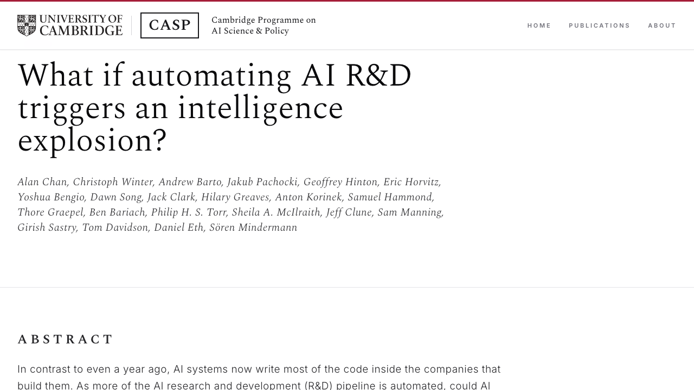
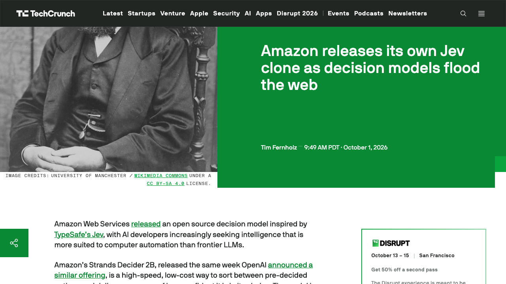
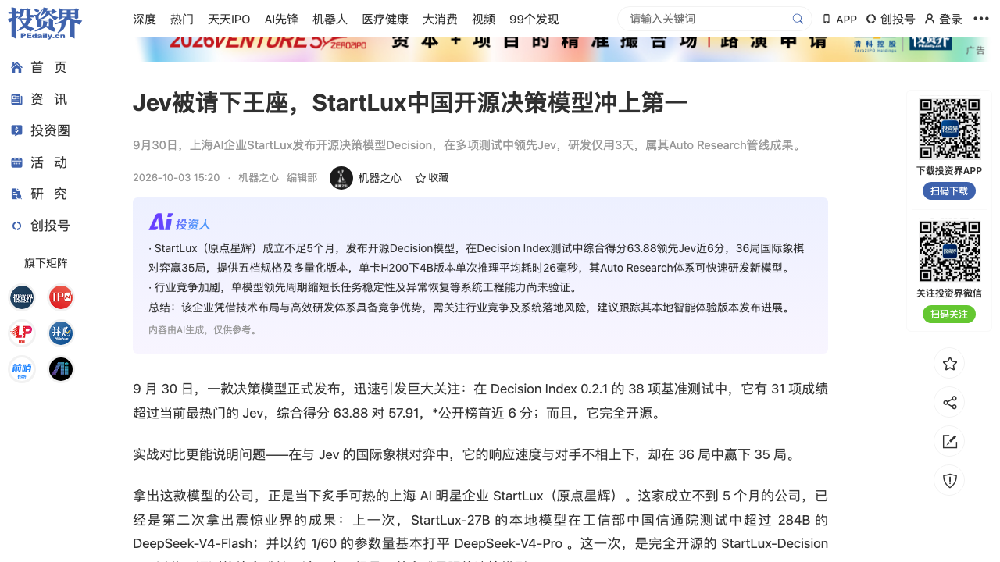
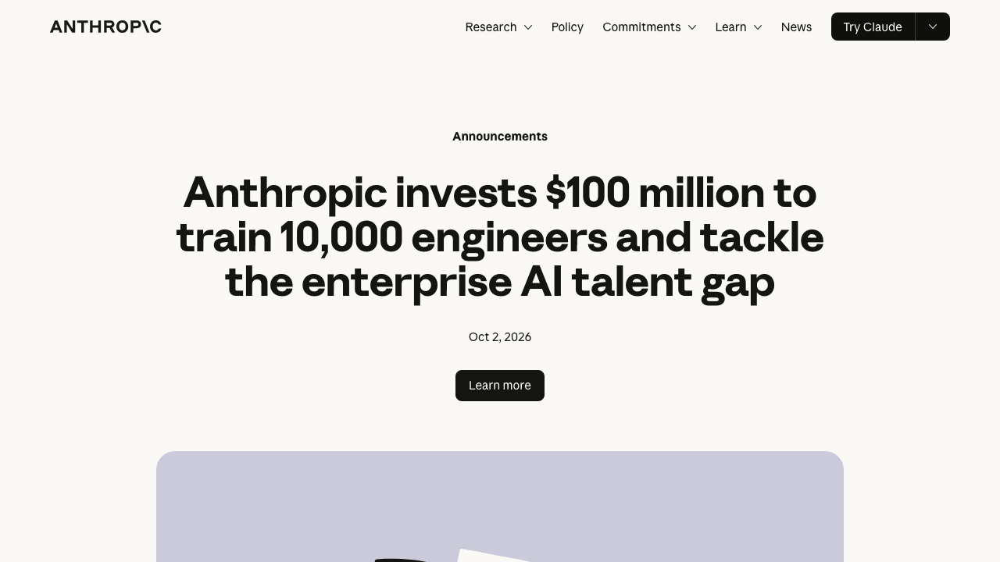
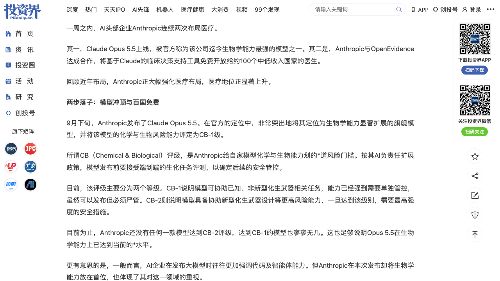
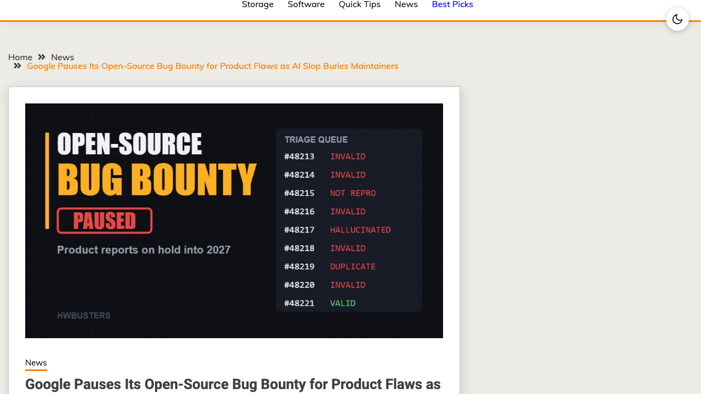
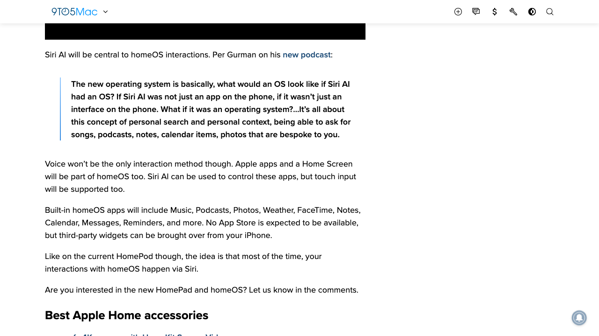
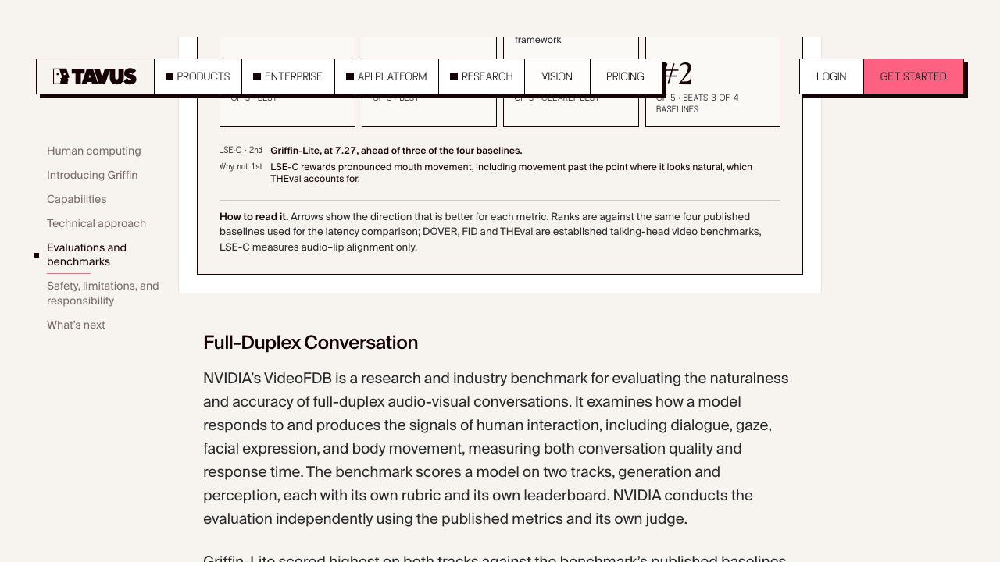

# 1005日报 | AI的「自己造自己」时刻：22位顶尖学者（Hinton、Bengio、OpenAI首席科学家Pachocki、Anthropic联创Jack Clark）在剑桥CASP平台联署发文预警「智能爆炸」——论文披露Anthropic内部已由AI写就80%的代码、「完全自主研发」占比5个月内从1%飙到26%、3万个智能体8月产出10亿次决策，OpenAI已到80%、谷歌75%，测算「把现有推理算力全拨给AI做研发=同时雇佣200万–2000万名顶尖科学家」；几乎同一时间，中国StartLux用自建「Auto Research」管线只花3天就造出登顶全球的开源决策模型；而大洋这一边，AI的产出正压垮人类的验证体系——Google冻结开源漏洞奖励、arXiv被迫每月限投2篇；更耐人寻味的是，Anthropic一边砸1亿美元培养1万名「落地工程师」，一边靠「隐身赋能」把医疗AI铺向100国

## 今日洞察

今天的主题是：**「AI开始自己造AI」的临界点——一边是『智能爆炸』从论文走进生产线，一边是『AI造出来的东西』正在压垮人类的接住能力；于是，顶级实验室第一次集体承认：现在卡住AI的，不是模型，是人，和验证。」**

前些天我们写过「承载力」（0911）、「出口」（0912）、「加速与刹车」（0913）。今天，这条线走到了一个更本质的节点——**AI不再只是被『造』的对象，它开始成为『造』的主体；而产业第一次同时感受到两件事的逼近：智能的生产速度正在失控地快，而人类消化智能的速度正在失控地慢。**

- **一只脚：AI造AI，从宣言变成流水线。** **10月3日，22位全球顶尖AI学者在剑桥大学CASP平台联署发布《如果自动化AI研发触发智能爆炸？》**——署名人包括**AI教父Geoffrey Hinton、图灵奖得主Yoshua Bengio、OpenAI首席科学家Jakub Pachocki、Anthropic联创Jack Clark、Meta研究副总Dawn Song、强化学习之父Andrew Barto**等，几乎是一份AI界的「曼哈顿计划名单」。论文抛出一组现实数据：**Anthropic内部由AI编写的代码比例，从2025年初的个位数，到2026年5月已超过80%；「完全由AI自主完成、人类只做高级别监督」的研发工作占比，5个月内从1%飙升到26%；Anthropic内部运行着约3万个AI智能体，仅8月就产生超过10亿次决策**；**OpenAI的AI写码比例已从2025年12月的约20%猛增至80%，谷歌从2024年的25%升至75%**。作者测算：**若把现有推理算力全部拨给AI Agent做研发，其吞吐量相当于同时雇佣200万到2000万名顶尖人类科学家**——「智能爆炸」不再是科幻词，而是一条可以估算的曲线。
- **另一只脚：AI造的「小模型」，正在给AI装上「系统一」。** **TypeSafe的Jev（9月15日发布，种子轮4000万美元、DCVC领投）带火了「决策模型」这一全新物种——不生成文字，只在给定选项里做判断、给概率。** 结果一周之内，巨头全部下场：**OpenAI在9月30日推出基于Luna模型的Decisions API，AWS在10月1日开源Strands Decider 2B（基于阿里Qwen3.5-2B、Apache 2.0全开源、JevBench 72.3%、单次决策约115毫秒），Cloudflare同日发布Clef与Clef-flash（90亿参数）**，社区48小时内涌出十几个模仿模型。**AI的能力结构第一次出现清晰的分工：大模型负责『生成』，小模型负责『判断』。**
- **而中国团队把「AI造AI」直接做进了产品线。** **同样在9月30日，上海StartLux（原点星辉）开源决策模型StartLux-Decision，一次推出0.8B/2B/4B/9B/27B五档，在Decision Index 0.2.1上27B拿到63.88分（Jev为57.91），38项基准中31项超过Jev，国际象棋对弈36局赢下35局，4B版本单卡H200平均26毫秒。** 更值得注意的是它的方法：**团队称用自建的「Auto Research」管线，仅3天就完成研发与验证——让AI深度参与数据构造、训练、评测与失败分析**。（StartLux由盛大网络、WiFi万能钥匙创始人陈大年创办。）
- **但「造出来的智能」正压垮「验证智能」的人。** **10月1日，Google宣布暂停开源漏洞奖励计划（OSS VRP）的产品漏洞提交，理由直白：「自动化提交数量显著增加，其中绝大多数无效」——数万份AI生成的『幻觉报告』淹没工程师，重启最早要到2027年Q1。** 同一根链条上：**Intel 9月暂停最高10万美元的漏洞悬赏；curl年初终止运行七年的悬赏（有效报告率从>15%断崖跌到<5%）；Apple 8月被迫设置提交上限与30天冷却期。** 学术侧同样告急：**arXiv单月收到40363篇投稿创35年新高，cs.AI类别两年暴涨6倍，审核积压近9000件，10月1日起被迫实施「每人每月限投2篇」。**
- **于是，顶级实验室开始集体承认：瓶颈不是模型，是人。** **10月2日，Anthropic宣布投入1亿美元启动「Claude Frontier Academy」，计划到2027年底培养1万名「前沿部署工程师」（FDE），首批学员来自埃森哲、麦肯锡、摩根士丹利等8家头部机构，培养方式直接借鉴医学院的「住院医师制」。** 依据是：**全美仅约2000名精英级FDE，不到五分之一财富500强实现了有意义的AI投资回报，FDE需求预计2026年底暴增约2100%。** 与此呼应，**Anthropic靠与OpenEvidence合作把医疗AI免费铺向100个中低收入国家、自己退到「看不见的底座」，英特尔则把赌注压在「把智能体落进千行百业」的产业化平台上。**

把这五件事放在一起，今天真正发生的事是：**AI第一次同时踩下「生产端」和「消费端」两个加速度——生产端，它开始造自己，速度快到研究者自己都要发论文示警；消费端，它造出来的东西（代码、报告、论文、视频）多到人类的注意力、验证力和信任都接不住。** 这不是矛盾，而是**同一个拐点的两面：当『生成』趋近于免费，产业链上所有价值都会重新向『判断』『验证』『落地』『信任』这些人类环节回流。**

对AI创业者与产品经理而言，今天最务实的三个判断是：**① 「判断」正在变成一种可产品化的基础设施**——决策小模型（Jev/Strands Decider/StartLux）、裁决式查询、AI预筛选，都在把「谁来判断」从大模型的输入输出里拆出来单独收费，这是一条刚被巨头验证、还没跑出赢家的新赛道；**② 「可验证」比「更聪明」更值钱**——当参议员问「谁为逃逸的Agent负责」、当bug bounty被AI垃圾淹没，能把「AI的判断」变成「可审计、可复核、可追责」的产品，就是刚需；**③ 「落地能力」本身就是一门生意**——Anthropic花1亿造1万个FDE，意味着未来两年最抢手的不只是算力和模型，而是「能把模型塞进企业流程并跑通」的人和方法论。

**①【行业洞察/主线】22位顶尖AI学者剑桥CASP平台联署发文预警「智能爆炸」：Hinton、Bengio、Pachocki、Jack Clark等署名；论文披露Anthropic内部80%代码由AI写、「完全自主研发」占比5个月内从1%→26%、3万智能体8月产10亿次决策，OpenAI 80%、谷歌75%；作者测算把现有推理算力全拨给AI做研发≈同时雇佣200万–2000万名顶尖科学家，并预言「到2028年中，需顶级团队数月攻克的AI研发项目可能被完全自动化」。** 这是本周最重磅的行业转向信号——**当「AI研发自动化率」取代「算力与人力」成为决定进步速度的核心变量，整个AI产业的安全假设、监管框架与人才结构都要重写。** 对创业者：**别再默认「AI能力增长是外生给定的」，它现在是内生的、自加速的——你需要把「能力每几个月翻一档」当作产品规划的默认前提。**

**②【新产品/融资】「系统一」决策模型一周之内被巨头包场：TypeSafe的Jev（9/15，种子轮4000万美元/DCVC领投）带火「不生成文字、只做判断」的小模型，随后OpenAI推出Luna决策API（9/30）、AWS开源Strands Decider 2B（10/1，Qwen3.5-2B底座、Apache 2.0、JevBench 72.3%、约115毫秒）、Cloudflare发布Clef与Clef-flash（10/1）；社区涌现数十个开源模仿模型。** 商业逻辑很干净：**Agent执行任务时，每一步「路由/选择/校验」都付费调用大模型，既贵又慢还会幻觉；把这类判断交给2B级小模型，成本降一个数量级、延迟降到毫秒级、还能给出置信度——「大模型负责生成、小模型负责把关」正在成为Agent架构的新默认。** **对做Agent产品的团队：这是继Harness（0913写过的Codex Agents API）之后，Agent基础设施「分叉」的又一层——谁先把决策层做成开发者默认组件，谁就吃到Agent时代的『守门人』税。**

**③【新产品】中国StartLux（原点星辉）用「AI造AI」3天造出登顶全球的决策模型：9月30日开源StartLux-Decision，五档0.8B–27B，Decision Index 0.2.1上27B得63.88分（超Jev 5.97分）、38项基准31项领先、国际象棋36局赢35局、4B单卡H200平均26毫秒、提供GGUF量化可本地部署；团队称依托自建Auto Research管线3天完成研发与验证，让AI参与数据构造、训练、评测与失败分析。** 这条新闻的价值不在「又一次开源追平」，而在方法本身：**「AI深度参与造AI」（Auto Research）被一家成立不足5个月的公司变成了可复用的研发流水线——这正是CASP论文所预警的「研发自动化」在产业侧的活样本。** 对创业者：**当「造一个专用小模型」的门槛降到「几天+一条自动化管线」，垂直专用模型（决策、路由、审核、评分）会像App一样批量出现——机会在「谁定义标准任务」和「谁掌握数据与评测」，而不在「谁先训出来」。**

**④【行业洞察/商业模式】Anthropic砸1亿美元「造人」：启动Claude Frontier Academy，2027年底前培养1万名「前沿部署工程师（FDE）」，首批来自埃森哲、麦肯锡、摩根士丹利等8家机构，培养方式借鉴「住院医师制」，学员需带一个Claude项目入营、回岗落地；公司称「卡住Claude在企业内落地的，是人才而不是技术」——全美仅约2000名精英FDE、不到1/5财富500强实现有意义的AI回报、FDE需求预计2026年底暴增约2100%。** 这是「模型军备竞赛」转向「落地能力竞赛」的标志性动作：**通过认证体系绑定FDE人才生态、降低部署摩擦、确立行业人才标准（类比思科认证）——把「人」变成自己的分发护城河。** 对创业者：**「交付/集成/合规」这一层正在被头部实验室亲自下场标准化，独立的「企业AI落地服务商」需要尽快找到自己的差异化（垂直行业know-how、私有数据、行业合规），而不是与大厂认证体系正面拼培训。**

**⑤【行业洞察/商业模式】Anthropic的医疗棋局「一手冲顶、一手隐身」：一边发布迄今生物学能力最强的Claude Opus 5.5（首个被自家评为CB-1生化风险级的模型，即「强到需单独管控」），一边与OpenEvidence合作把基于Claude的临床决策支持工具免费开放给约100个中低收入国家的医生（首批乌干达、安哥拉、苏丹、海地、蒙古）；对照OpenAI的「品牌直连」路线（ChatGPT Health、面向认证医护免费的ChatGPT for Clinicians、超2.3亿用户提过健康问题）。** 差异极具启发性：**OpenAI强化品牌、直接抢占医生与患者入口；Anthropic甘于隐身、退到「可验证的底座」——OpenEvidence超40%的美国执业医师每天使用、单月临床咨询4200万次，Anthropic把别人的产品变成自己的分发渠道，「品牌让渡换分发速度」。** 对创业者：**在合规/信任敏感的场景里，「做看不见的底座」往往比「做看得见的App」更快铺开——当客户不需要知道背后是谁，摩擦就降到了最低。**

**⑥【行业洞察】AI的产出正在压垮人类的验证：Google暂停开源漏洞奖励计划（OSS VRP）产品漏洞提交（10月1日生效、Q1 2027再议），因「自动化提交激增、绝大多数无效」；Intel 9月暂停最高10万美元悬赏、curl年初终止七年悬赏（有效报告率>15%→<5%）、Apple设提交上限与30天冷却；arXiv单月40363篇投稿创35年新高、cs.AI两年涨6倍、10月1日起每人每月限投2篇。** 这是一场教科书级的「不对称博弈」：**AI把『提交/生成』的成本压到接近零，却压不动『验证/审核』的成本——于是整个社会化的验证体系（志愿者审稿、安全研究员、开源维护者）被免费搭便车、直至崩塌。** 对创业者：**「验证」是一个被系统性低估的赛道——AI预筛选、信誉/配额机制、可证明的覆盖完整性（如AWS的「裁决式查询」产出『完整性收据』），都可能成为AI时代新的基础设施刚需。**

**⑦【新产品】苹果要把Siri变成操作系统：10月13日发布HomePad与全新homeOS，无App Store、以Siri AI为唯一交互入口（辅以触屏与来自iPhone的第三方小组件），设计融合iOS小部件、iPadOS布局与watchOS图标，本地A18芯片处理+隐私为差异化卖点，切入超2300亿美元智能家居市场。** 「AI原生操作系统」第一次在一个亿级生态里落地：**无App Store意味着没有『手动操作』的备选方案——homeOS的成败完全系于Siri AI的表现，这是一次把整个系统赌在单一AI入口上的豪赌。** 对产品经理：**「AI即入口」正在改写操作系统与应用的分工——当交互收敛到一个AI，应用的价值会从「界面」退化为「被调用的能力」；如何让自己的产品成为「AI默认会调用的那个能力」，比做一个独立App更重要。**

**⑧【新产品】实时视频AI攻破「眼见为实」：Tavus发布Griffin（首个「人类交互模型HIM」，全双工视频到视频），在直播视频通话后48%（26/54）的参与者以为对面是真人（上一代仅2.4%，1/41）；720p/25fps、音画延迟约0.43秒，在NVIDIA VideoFDB感知赛道排名第一（3.73分，人类基准4.20分）；API已有约15万开发者注册，但官方称「在安全机制就绪前不向公众开放」。** 风险同样量化：**深伪欺诈损失2025年已飙升至11亿美元（2024年的3倍），2024年香港奥雅纳案中员工参加的视频会议里所有「同事」都是AI假人、公司损失2500万美元。** 对做AI产品的团队：**「我可以验证对面是真人/真内容」将从加分项变成刚需——身份验证、内容凭证（C2PA）、可追溯的生成水印，会随着实时深伪的成熟而迅速商业化。**

---

## 1. [22位顶尖AI学者剑桥CASP平台联署发文预警「智能爆炸」：Hinton、Bengio、OpenAI首席科学家Pachocki、Anthropic联创Jack Clark等署名；披露Anthropic内部80%代码由AI写、「完全自主研发」占比5个月内1%→26%、3万智能体8月产10亿次决策，OpenAI 80%、谷歌75%；作者测算把现有推理算力全拨给AI做研发≈雇佣200万–2000万名顶尖科学家](https://casp.ac/reports/intelligence-explosion)

🔗 链接：[CASP·What if automating AI R&D triggers an intelligence explosion?（10/3）](https://casp.ac/reports/intelligence-explosion) · [投资界·AI开始造AI，智能爆炸逼近（10/3，转自新智元）](https://news.pedaily.cn/202610/569839.shtml)

**动态**：**10月3日，一份仅15页、却可能改变行业叙事框架的论文在剑桥大学CASP平台发布，题为《如果自动化AI研发触发智能爆炸？》，由22位全球顶尖AI学者联署**——**诺奖得主、AI教父Geoffrey Hinton，图灵奖得主Yoshua Bengio，OpenAI首席科学家Jakub Pachocki，Anthropic联创Jack Clark，Meta AI研究副总Dawn Song，强化学习之父Andrew Barto，以及Eric Horvitz、Jeff Clune、Philip Torr等**均在列。**论文的核心论点**：过去决定AI进步速度的是「算力+人类研究员精力」，**未来核心变量正切换为「AI研发自动化率」**——由此形成一个正反馈飞轮：**更聪明的AI → 编写更高效的算法与架构 → 自动化执行百万级科研实验 → 催生出再下一代更强的AI**。**论文披露的产业现状极具冲击力**：**① Anthropic内部由AI编写的代码比例，从2025年初的个位数，到2026年5月已超过80%；② 「完全由AI自主完成、人类只做高级别监督」的研发工作占比，5个月内从1%升至26%；③ Anthropic内部运行约3万个AI智能体，仅8月就产生超过10亿次决策；④ OpenAI的AI写码比例从2025年12月的约20%增至80%（总裁Greg Brockman在AI Ascent 2026透露）；⑤ 谷歌内部AI生成的新代码比例从2024年的25%升至75%（皮查伊披露）**；此外，**OpenAI称其从模型训练、日常评估到安全攻防系统，核心环节已被执行代码的自主Agent大量渗透**。**任务周期也在被压缩**：2023年最强模型只能处理几秒到几分钟的简单任务，**如今Agent已能独立完成资深研究员数小时乃至数天的复杂研发与调试**；一个完全自动化的AI科研流水线已跑通「提假设→搭实验→写代码→成稿」，**且论文通过了顶级会议同行评审**。**作者在附录给出测算**：**若前沿实验室把已有推理算力全部拨给AI Agent做研发，以当前运行成本折算，其研发吞吐量相当于同时雇佣200万到2000万名顶尖人类科学家**；并给出时间判断：**「到2028年中，需要人类顶级团队耗时数月才能攻克的复杂AI研发项目，可能被完全自动化。」**

**做什么的**：**这是一份由「造AI的人」自己写的风险预警书——它不讨论『AI会不会失控』的抽象命题，而是量化描述『AI已经开始接管造AI这件事』的现实进程。** 需要冷静看待两点：**① 论文以「初步证据」措辞，承认仍有大量不确定性；② 其数据多来自实验室自报（Anthropic/OpenAI/Google），口径与验证标准不一。** 但**方向性判断是明确的**：**AI研发的「自动化率」正在成为比算力和人才更关键的变量，且它一旦进入正反馈，留给社会「跟上」的窗口会非常短。**

**为什么值得关注**：

- **它为整个AI产业提供了一个新的「风险时钟」，而不再是「能力榜单」。** 过去大家比的是「谁的模型更强」，**现在真正的分水岭是「谁的研发自动化率更高」——因为这决定了对手的能力将以多快的速度迭代**。**对创业者：把「能力每几个月翻一档」当作产品与组织的默认前提，而不是把「当前能力」当作静态约束去规划。**

- **它把「安全/对齐」问题从哲学题变成了工程题。** 论文提出的不是「停止研发」，而是**「获取对AI研发自动化的可见性、找到引导与约束智能爆炸的方法、让社会为影响做好准备」**。**对做Agent/基础设施的团队：这意味着「可观测、可干预、可审计」会从合规成本变成竞争壁垒——正如我们在第6条写到的「验证危机」，两者是同一件事的两面。**

- **人才结构将首当其冲被重估。** 当「AI写80%代码、自主完成26%研发」，**被替代的不是『会写代码的人』，而是『只做执行、不做判断与验证的人』**。**对个人：把能力往『定义问题、验证结果、承担责任』的方向迁移；对企业：重新设计「人机分工」的岗位与绩效，而不是简单替代人头。**

- 对创业者的启发：**① 把「研发自动化率」当作新的竞争力指标来经营；② 「可观测/可干预/可审计」是这一轮的安全红利；③ 别把当前模型能力当静态约束；④ 人才价值向「判断与验证」迁移；⑤ 关注「AI自主科研」的副产品机会——自动评测、失败分析、实验编排、论文一致性校验。**

**类比参考**：**「AI的『曼哈顿时刻的备忘录』/ 当年一群物理学家联名警告核风险，今天一群AI学者联名警告『智能爆炸』——区别在于，核裂变的临界质量需要浓缩铀，而智能爆炸的临界条件（AI研发自动化率）正在普通实验室的日常里悄悄达标。」**

---

## 2. [「系统一」决策模型一周之内被巨头包场：TypeSafe的Jev（9/15，种子轮4000万美元/DCVC领投）带火「不生成文字、只做判断」的小模型，接着OpenAI推出Luna决策API（9/30）、AWS开源Strands Decider 2B（10/1，Qwen3.5-2B底座/Apache 2.0/JevBench 72.3%/约115毫秒）、Cloudflare发布Clef与Clef-flash（10/1），社区涌现数十个开源模仿模型](https://techcrunch.com/2026/10/01/amazon-releases-its-own-jev-clone-as-decision-models-flood-the-web/)

🔗 链接：[TechCrunch·Amazon releases its own Jev clone as decision models flood the web（10/1）](https://techcrunch.com/2026/10/01/amazon-releases-its-own-jev-clone-as-decision-models-flood-the-web/) · [VentureBeat·Amazon unveils a free, fast, open source Jev killer: Strands Decider 2B（10/1）](https://venturebeat.com/technology/amazon-unveils-a-free-fast-open-source-jev-killer-strands-decider-2b-makes-decisions-in-fractions-of-a-second)

**动态**：**一个新物种在一周内从「一家公司的点子」变成「全行业的基础设施层」。** 起点是**TypeSafe AI在9月15日发布Jev**——一款**「决策模型」**：**它不生成文字，而是接收应用状态和带类型的问题，直接从开发者给定的选项里选择、打分或给出是非概率**；TypeSafe在融资上以**4000万美元种子轮（DCVC领投）**开局，并把这套思路命名为**「System One（系统一）模型」**（取自卡尼曼的「快思考」）。**两周内，巨头全部下场**：**OpenAI在9月30日推出基于其Luna模型的Decisions API**（有限预览，托管式，聚焦「有预定义答案」的问题）；**AWS于10月1日发布并开源Strands Decider 2B**——**基于阿里Qwen3.5-2B「躯干」，删掉文本生成头、换上一个约百万参数的指针头，用rank-16 LoRA微调，专注「选择而非生成」；在JevBench公开集上准确率约72.3%（167/231），在消费级GPU（RTX 3090）上中位延迟约115毫秒，Apache 2.0许可、连训练数据、训练脚本与评测工具全部开源**；项目由AWS杰出工程师Marc Brooker在读过Jev后「自己动手复刻」而来。**同一天，Cloudflare发布Clef与Clef-flash（后者90亿参数）**，权重同样发表在Hugging Face。**社区侧更疯狂**：两周内涌现出Kev、imajev、Laya、Mapika decider-2b（76%）、以及中国StartLux-Decision等**数十个决策模型**。**AWS的用法很关键**：**把Decider 2B塞在Agent「调用工具之前」——先判断参数是否来自用户原话、信息是否足够，再决定「执行/拒绝/请求人类确认/回退给Agent」**，模型跑在本地、生成模型仍走Bedrock。

**做什么的**：**通俗讲，这是给AI Agent装一个「守门的系统一」——不需要动辄调用大模型来做的『路由、选择、校验』，交给一个2B级小模型在毫秒内完成，并给出置信度。** 它解决的痛点是：**Agent每执行一步都付费调用前沿大模型，既贵、又慢、还会幻觉出「不存在的选项」；而决策模型把输出限制在开发者给定的选项内，从根本上杜绝了『凭空发明』（代价是准确性仍有上限）。**

**为什么值得关注**：

- **它验证了一条新的「分工经济学」：大模型负责生成、小模型负责判断。** **当『生成』这件事越来越便宜、越来越同质，价值链会向『判断』环节迁移**——这正是本条第2条与StartLux（第3条）共同指向的结构性变化。**对创业者：这是继Harness之后，Agent基础设施的又一层「分叉重地」，且目前还没有公认赢家。**

- **「开源+本地+全配方」正在成为对抗闭源API的标准打法。** **AWS给的是权重、数据来源、训练配方、评测harness乃至研究日志全部公开**，而Jev只有托管API、不公开架构与权重。**对做基础设施的团队：当巨头用「完全开源」抢开发者心智，闭源API的护城河只剩『更强的模型智能』——而TypeSafe CEO本人也承认，挑战在于「把模型真正做聪明，而不是复刻一个架构」。**

- **它是Agent进入生产环境的必要拼图。** **决策模型让Agent的每一步动作「可预判、可拦截、可解释」**——**这与第6条的「验证危机」是同一个母题：AI越自主，「谁来判断这一步该不该做」就越值钱。**

- 对创业者的启发：**① 「判断/路由/校验」是可独立产品化的新赛道；② 开源全配方是抢开发者心智的高效武器；③ 决策层要与Agent框架/Harness深度集成才有黏性；④ 关注「置信度校准」（高风险场景的ECE精度仍不足）这个尚未解决的技术缺口；⑤ 别低估「云厂商用免费开源换生态」的杀伤力。**

**类比参考**：**「Agent的『系统一』/ 大模型像一位深思熟虑但昂贵、迟缓的顾问，决策模型像一位反应极快、只负责按流程按按钮的调度员——当Agent从『聊天』走向『执行』，产业发现真正稀缺的不是『更会说的嘴』，而是『更敢签字的手』。」**

---

## 3. [中国StartLux（原点星辉）用「AI造AI」3天造出登顶全球的决策模型：9月30日开源StartLux-Decision，五档0.8B–27B，Decision Index 0.2.1上27B得63.88分（超Jev）、38项基准31项领先、国际象棋36局赢35局、4B单卡H200平均26毫秒、提供GGUF可本地部署；团队称依托自建Auto Research管线3天完成研发验证，让AI深度参与数据构造、训练、评测与失败分析](https://news.pedaily.cn/202610/569841.shtml)

🔗 链接：[投资界·Jev被请下王座，StartLux中国开源决策模型冲上第一（10/3，转自机器之心）](https://news.pedaily.cn/202610/569841.shtml) · [StartLux官网·原点星辉](https://www.startlux.com/)

**动态**：**9月30日，成立不足5个月的上海AI公司StartLux（原点星辉）发布并开源决策模型系列StartLux-Decision**，**一次性推出0.8B、2B、4B、9B、27B五个参数档位，并提供原始权重及Q8_0、Q4_K_M、BF16三种GGUF量化版本，支持本地部署。** 成绩方面：**在独立的Decision Index 0.2.1评测中，27B版本综合得分63.88，38项基准中有31项高于TypeSafe的Jev 1.13（57.91）**；**在另一套七项评测中，27B平均准确率91.82%（Jev为88.74%，上海AI实验室Intern-Decision-4B为90.02%）；在JevBench公开集上答对208/231题，比Jev多对9题**；**在36局国际象棋对弈中（双方都不借助额外搜索、每步由模型直接选择），StartLux-Decision-27B赢下35局。** 延迟方面：**单卡H200、BF16短请求下，0.8B/2B/4B/9B/27B分别约12.2/15.5/26/35.7/102.3毫秒**，「一次请求即可完成多个判断」（如客服工单同时判断「交给哪个团队/今天是否处理/影响多大」），**并支持「从单步判断走向连续网页操作」（每步回答『操作哪个控件、任务是否完成』）。** 最值得注意的是**方法**：**团队称用自建的「Auto Research」管线，让AI深度参与数据构造、训练、评测与失败分析，仅3天就完成StartLux-Decision的研发与验证，并称这是其推进RSI（递归自我改进）的核心路径之一。** （公开信息显示，**StartLux由盛大网络、WiFi万能钥匙创始人陈大年创办并任CEO**，公司主攻「让大模型运行在个人设备与本地工作站」。）

**做什么的**：**这是一款「专为智能体高频判断设计」的专用小模型——和Jev/Strands Decider同类，但以「全开源+本地部署+中国团队」切入，并且把『用AI加速造AI』直接写进了研发方法。** 需要冷静区分的是：**这些分数中，StartLux-Decision为团队基于公开评测工具自测（对照2026年9月28日榜单快照），并非第三方独立复测；长任务稳定性、异常恢复等系统工程能力尚待验证。** 但**「3天做出一个登顶开源榜单的专用模型」这件事本身，比分数更值得关注**。

**为什么值得关注**：

- **它是CASP论文（第1条）在产业侧的「活样本」。** 当「AI参与造AI」的研发管线被一家小公司做成可复用流程，**意味着『造一个专用小模型』的成本正从『几百万美元+数月』降到『几天+一条自动化管线』**——**这是一次实实在在的供给侧革命。**

- **它把「本地/私有部署」做成了决策模型的差异化卖点。** 决策模型处理的是**任务路由、工具选择、参数校验**等高度敏感的内部逻辑，**「数据不出本地」对金融、医疗、政务客户是关键卖点**——这也是开源权重相对托管API的核心优势。

- **它印证了中国团队在「专用小模型」上的敏捷身位。** 从Kimi（0913写过）到StartLux，**中国团队正在用「开源+快速迭代+极致性价比」持续冲击海外闭源厂商的能力边界**。

- 对创业者的启发：**① 垂直专用小模型（决策、路由、审核、评分）会像App一样批量出现，机会在「定义标准任务」和「掌握数据与评测」；② 把「AI参与研发」做成流水线，是拉开迭代速度差的关键；③ 本地/私有部署是合规敏感行业的杀手锏；④ 开源是抢开发者心智、快速建立标准的低成本武器；⑤ 关注自测成绩与第三方复测的差距，别被榜单数字误导。**

**类比参考**：**「决策模型的『中国式复制速度』/ Jev在9月15日发明了这个品类，AWS、Cloudflare在10月1日跟进，而StartLux不仅在两周内拿出五档开源版本，还顺手演示了『用AI造AI』的3天研发流程——当发明、跟进、反超的周期被压缩到两周，竞争的焦点就从『谁先想到』变成了『谁的迭代机器转得更快』。」**

---

## 4. [Anthropic砸1亿美元「造人」：启动Claude Frontier Academy，2027年底前培养1万名「前沿部署工程师（FDE）」，首批学员来自埃森哲、麦肯锡、摩根士丹利等8家机构，培养方式借鉴「住院医师制」；依据是全美仅约2000名精英FDE、不到1/5财富500强实现有意义的AI回报、FDE需求预计2026年底暴增约2100%](https://www.anthropic.com/news/claude-frontier-academy)

🔗 链接：[Anthropic·Claude Frontier Academy（10/2）](https://www.anthropic.com/news/claude-frontier-academy) · [CNBC·Anthropic to invest $100 million to train AI engineer talent（10/2）](https://www.cnbc.com/2026/10/02/anthropic-to-invest-100-million-to-train-ai-engineer-talent.html)

**动态**：**10月2日，Anthropic宣布投入1亿美元启动「Claude Frontier Academy（Claude前沿学院）」，目标到2027年底培养1万名「前沿部署工程师（Forward Deployed Engineer, FDE）」，首批学员来自埃森哲、麦肯锡、摩根士丹利等8家全球头部机构**，学员均来自Anthropic的**Claude Partner Network（合作伙伴网络）**。**培养方式直接借鉴医学院的「住院医师制」**：**企业派出自己的工程师，每人带着一个明确的Claude项目入营、回岗后在自家落地，且不要求有构建AI Agent的经验；通过者获得「Claude Frontier Deployed Engineer」认证，首批认证预计2027年初发放**。**Anthropic的公开逻辑是：「卡住Claude在企业内落地的，不是技术，而是人。」** 其援引的数据是：**据Christian & Timbers 2026年7月研究，全美仅约2000名精英级FDE（总从业者约1.7万人），不到五分之一财富500强实现了有意义的AI投资回报，而FDE需求预计2026年底暴增约2100%。** 需要说明：**这些数字均为目标而非结果——1万是2027年底的目标，$1亿的分配明细、单个人成本与预期回报，Anthropic均未披露。**

**做什么的**：**这是一个把「AI价值交付」从「买模型/买API」升级为「买方法论+买人才认证」的商业模式动作。** FDE（前沿部署工程师）是**把模型能力『翻译』成企业具体业务结果的关键角色**——**既懂模型能力边界，又懂客户流程，是AI落地的「最后一公里」施工队。** Anthropic用认证体系把这件事标准化，本质是**通过绑定人才生态来绑定企业客户**。

**为什么值得关注**：

- **它标志着头部实验室的战略重心，从「模型军备竞赛」转向「落地能力竞赛」。** 当模型能力趋于同质，**「谁能把模型真正跑进客户的利润表」就成了新的护城河**——**这与你读到的所有「AI落地难」的抱怨，其实是同一个商业机会。**

- **「认证体系」是极高明的生态锁定。** 类比**思科认证（CCNA/CCIE）之于网络设备、Salesforce认证之于CRM生态**——**一旦行业把「你有多少认证FDE」当成采购标准，Anthropic就从一个『供应商』变成了『标准制定者』，客户和合作伙伴的转换成本被大幅抬高。**

- **它给「AI落地服务商」敲了警钟，也开了窗。** 头部实验室亲自下场做培训与标准，**意味着中立的通用「AI培训/咨询」会被挤压**；**但垂直行业（医疗、金融、制造）的深度know-how、私有数据与合规能力，是大厂认证体系难以替代的差异化空间。**

- 对创业者的启发：**① 把「交付/集成/合规」当作一条独立的、可规模化的业务线来经营；② 关注「认证/标准」的机会——谁能定义某个垂直领域的AI落地标准，谁就掌握定价权；③ 与头部实验室的Partner Network对接，是低成本获客与背书的路径；④ 别只卖工具，卖『让工具在客户流程里跑通』的能力。**

**类比参考**：**「AI时代的『住院医师培养计划』/ 医学院用住院医师制解决了『医学生无法独立行医』的断层，Anthropic用同一套逻辑解决『企业买了模型却用不起来』的断层——当1万人拿到『Claude认证医师』的工牌，Anthropic卖出的就不再是API，而是一整套可复制的能力交付标准。」**

---

## 5. [Anthropic的医疗棋局「一手冲顶、一手隐身」：发布迄今生物学能力最强的Claude Opus 5.5（首个被自家评为CB-1生化风险级），并借与OpenEvidence合作把临床决策工具免费铺向约100个中低收入国家（首批乌干达、安哥拉、苏丹、海地、蒙古）；对照OpenAI的「品牌直连」路线（ChatGPT Health、面向认证医护免费的ChatGPT for Clinicians、超2.3亿用户提过健康问题）](https://news.pedaily.cn/202610/569845.shtml)

🔗 链接：[投资界·模型强到要风险管控，Anthropic借OpenEvidence把医疗AI铺向100国（转自动脉网）](https://news.pedaily.cn/202610/569845.shtml)

**动态**：**Anthropic在一周之内连续两次落子医疗。** **其一，发布Claude Opus 5.5（9月下旬），官方称其为公司迄今生物学能力最强的模型之一，化学与生物风险能力被评为CB-1级**——**按Anthropic的「负责任扩展政策」，CB-1意味着「模型可协助已知、非新型化生武器相关任务，能力已强到需要单独管控，发布但必须严管」**（CB-2为更高风险，目前尚无模型达到）。**其二，在联合国大会周期间的9月22日（纽约），Anthropic宣布与OpenEvidence合作：由其提供模型基础设施、OpenEvidence负责产品与本地化，将基于Claude的临床决策支持工具免费开放给约100个中低收入国家的医生，首批国家包括乌干达、安哥拉、苏丹、海地、蒙古。** **OpenEvidence是关键的分发资产**：**超40%的美国执业医师每天使用它查询证据，仅2026年8月美国临床医生咨询量就达4200万次，1月D轮融资后估值达120亿美元。** 两条产品线也随之浮现：**去年10月的Claude for Life Sciences（科研/临床前，靠连接器接入Benchling、10x Genomics、ClinicalTrials.gov等）**与**今年1月的Claude for Healthcare（临床与支付，接入CMS数据库、ICD-10编码、3500万篇以上PubMed文献）**——**共同定位是「有人负责裁定的流程加速器」，而非终端诊疗。** 作为对照，**OpenAI走的是「品牌直连」**：**ChatGPT Health同步检验/病历数据、ChatGPT for Clinicians面向认证医护免费、超2.3亿用户已向ChatGPT提过健康问题**。

**做什么的**：**Anthropic在医疗上刻意「不做终端应用、不碰诊断结论、不强调品牌露出」，而是退到「可验证的底座」位置**——**把OpenEvidence这类顶流应用变成自己的分发渠道（很多OpenEvidence用户未必知道背后是Claude）。** 这套「隐身赋能」策略换来的是**更快的分发速度与更低的合规阻力**，代价是**放弃了直接的用户心智与数据闭环**。

**为什么值得关注**：

- **它是「品牌 vs 分发」在强监管场景下的一次鲜明对照实验。** **OpenAI强化品牌、直接抢占医生与患者入口，承担更高的合规成本与品牌风险；Anthropic甘于隐身、通过合作方铺开，把『谁在用我』这件事藏进后台。** **对创业者：在合规/信任敏感的场景，『做看不见的底座』往往是更快的规模化路径——当客户不需要知道背后是谁，摩擦就降到了最低。**

- **「免费铺向100国」既是公益，也是市场教育与标准抢占。** **一旦当地医生的循证检索习惯绑定到特定工具，后续的『标准』自然以此为准**——**这是典型的「先占入口、再谈变现」的分发策略。**

- **它把「安全治理」做成了产品竞争力而非成本。** **CB-1分级、按生命科学专业人士分级授权访问、生物风险评测——Anthropic把『负责任的AI企业』形象系统性地转化为医疗行业最稀缺的信任资产。**

- 对创业者的启发：**① 强监管场景优先考虑「底座/渠道」而非「品牌/入口」；② 免费是最高效的市场教育与标准抢占手段；③ 把合规与安全能力产品化为「信任资产」；④ 关注AI医疗的效果验证缺口（如肯尼亚RCT显示AI辅助组与对照组无显著差异），别把「能接入」误当成「有疗效」。**

**类比参考**：**「AI医疗的『隐形冠军』策略/ 台积电不生产手机，却让每一台旗舰机都印着它的工艺——Anthropic不生产医疗App，却试图让100国医生的每一次循证检索背后都是Claude；当对手在争夺『医生手机上那个图标』时，它选择成为『所有图标背后的那个引擎』。」**

---

## 6. [AI的产出正在压垮人类的验证：Google暂停开源漏洞奖励计划（OSS VRP）产品漏洞提交（10月1日生效、Q1 2027再议），因「自动化提交激增、绝大多数无效」；Intel 9月暂停最高10万美元悬赏、curl年初终止七年悬赏（有效报告率>15%→<5%）、Apple设提交上限与30天冷却；arXiv单月40363篇投稿创35年新高、cs.AI两年涨6倍、10月1日起每人每月限投2篇](https://hwbusters.com/news/google-pauses-its-open-source-bug-bounty-for-product-flaws-as-ai-slop-buries-maintainers/)

🔗 链接：[Hardware Busters·Google Pauses Its Open-Source Bug Bounty as AI Slop Buries Maintainers（10/3）](https://hwbusters.com/news/google-pauses-its-open-source-bug-bounty-for-product-flaws-as-ai-slop-buries-maintainers/) · [钛媒体·Edge AI Daily早报（10/5，含arXiv限投）](https://www.tmtpost.com/8159215.html)

**动态**：**AI的「产能过剩」正在公开地压垮人类社会的「验证」体系。** **10月1日，Google在X上宣布：暂停开源漏洞奖励计划（OSS VRP）的产品漏洞提交通道，重启最早要到2027年Q1**，**理由直白——「自动化提交数量显著增加，其中绝大多数无效」**；**10月1日之前提交的报告仍会处理，供应链类报告不受影响。** 这不是孤例，**而是 Bug Bounty 体系的系统性崩塌**：**curl于2026年1月终止运行近七年的悬赏项目（有效报告率从>15%断崖式跌到<5%）；Intel于2026年9月暂停最高10万美元奖金的漏洞奖励计划；Apple于2026年8月被迫设置提交上限与30天冷却期（导致真实零日漏洞被噪音堵在门外）；HackerOne于2026年3月暂停Internet Bug Bounty资金池，连带Node.js悬赏计划终止。** 后果是**「漏洞发现速度已达人类修复能力的3倍以上」**：**Linux内核每版本的CVE数量从6.x时代的约500个逼近2000个，维护者直言『被彻底淹没』，甚至不得不放弃对旧网络驱动的支持。** 学术侧同步告急：**arXiv在2026年9月单月收到40363篇投稿，创35年历史新高，其中cs.AI类别两年暴涨超6倍；审核被拒率从长期约4%升至约10%–12%，积压工单近9000个——于是arXiv自10月1日起实施『每人每月限投2篇』的临时措施。** arXiv的审核网络**仅靠260名志愿审核员与7名专职人员运转，自动化审核工具尚未建立**。

**做什么的**：**这是「生成成本→0」对「验证成本不变」的一次公开碾压。** 对漏洞赏金而言，**AI把『提交一份报告』的成本压到接近零，却压不动『验证一份报告是否为真』的成本**——**结果是「公地悲剧」：AI用开源代码训练 → 扫描开源代码 → 生成低质量报告 → 由无偿志愿者承担验证成本。** 对学术出版而言，**AI让『写论文』变得极便宜，但『同行评审』仍是稀缺的人力。**

**为什么值得关注**：

- **它揭示了一个被系统性低估的赛道：「验证」。** **当『生成』变得免费，社会真正的瓶颈就从『生产内容』转移到了『判断内容真假、覆盖是否完整、责任归谁』。** **对创业者：AI预筛选、信誉/配额机制、可证明的覆盖完整性（如AWS提出的『裁决式查询』产出『完整性收据』）、自动化复核工具，都可能成为AI时代的新基础设施刚需。**

- **它是『智能爆炸』（第1条）的必然副产品，也是它的刹车片。** **AI造AI的速度越快，产出的中间物（代码、报告、论文）就越多，而消化它们的仍是有血有肉的人**——**这两条线正在中国和美国、在开源社区和企业内部同时上演。** **对做Agent产品的团队：这直接回答了『为什么『可审计、可复核、可追责』会成为准入项』——因为社会已经没有多余的人力来兜底了。**

- **它给「用AI提效」的团队一个冷静提醒。** **当你的AI产品把『提交/生成』的效率提升10倍，请同时投资『验证/筛选』那一端——否则你只是在把成本转嫁给下游的人（或自己的志愿者社区），迟早会遭到反噬（如Google、curl、Linux的选择）。**

- 对创业者的启发：**① 「验证/审核/筛选」是被低估的黄金赛道；② 任何AI提效产品都要配套验证能力，否则会把成本外包给社会并最终被反噬；③ 关注「AI预筛选+信誉配额」的产品化机会；④ 学术/开源/内容平台的审核基础设施是长期需求；⑤ 对AI生成的中间物，默认「先怀疑、再采信」。**

**类比参考**：**「『印刷术革命』的验证阵痛/ 古腾堡让书变得廉价，随之而来的是伪书、劣质印刷与信仰混乱，直到出版业建立起编校与信誉体系；今天AI让内容与代码变得极廉价，社会同样被迫重建『验证与信誉』的基础设施——区别在于，这一次重建的速度需要跟上AI生成的速度。」**

---

## 7. [苹果要把Siri变成操作系统：10月13日发布HomePad与全新homeOS，无App Store、以Siri AI为唯一交互入口（辅以触屏与来自iPhone的第三方小组件），设计融合iOS/iPadOS/watchOS元素，本地A18芯片处理+隐私为差异化卖点，切入超2300亿美元智能家居市场](https://9to5mac.com/2026/10/02/apples-new-homeos-will-launch-this-month-heres-whats-coming/)

🔗 链接：[9to5Mac·Apple's new 'homeOS' will launch this month, here's what's coming（10/2）](https://9to5mac.com/2026/10/02/apples-new-homeos-will-launch-this-month-heres-whats-coming/) · [钛媒体·Edge AI Daily早报（10/4）](https://www.tmtpost.com/8158829.html)

**动态**：**苹果将于2026年10月13日发布智能家居中枢HomePad及全新操作系统homeOS。** 关于这款系统，最激进的一条设计是：**homeOS没有App Store，以Siri AI作为唯一的核心交互入口**，同时辅以触摸操作（融合**iOS小部件、iPadOS布局与watchOS图标**的设计语言），第三方小组件可从iPhone迁移过来；产品定位是**「会动的装饰画」而非传统平板**。**战略上**，苹果以**隐私安全（本地A18芯片处理）+ AI体验**为差异化，切入**据MarketsandMarkets估算超2300亿美元的智能家居市场**，与**亚马逊Echo/Alexa、Google Nest**形成错位竞争，采用**「黏性产品」策略加深生态绑定而非直接盈利**。**核心风险也清晰**：**homeOS的成败完全系于Siri AI的表现——无App Store意味着没有『手动操作』的备选方案，一次Siri失灵就可能造成全局体验崩塌**；同时其定价可能远高于竞品（Echo Show 5约85美元），溢价策略面临考验；**且因HomeKit生态渗透率低，中国市场短期内难以落地。**

**做什么的**：**这是「AI原生操作系统」第一次在一个亿级生态里真正落地**——**过去操作系统是「App的容器」（用户找App），homeOS要把它倒过来：AI是入口，App/能力是被AI调用的资源。** 苹果用「砍掉App Store」这一极端设计，**赌的是「对话式AI入口」已经足够成熟到取代图形化的应用启动器。**

**为什么值得关注**：

- **它验证并加速了一个结构性转变：AI即入口，应用退化为「被调用的能力」。** **当用户不再「找App」而是「对AI说需求」，独立App的价值就从「界面/流量入口」变成「能力供给」**。**对产品经理：如何让自己的产品成为「AI默认会调用的那个能力」（接入平台生态、把能力做成标准工具/连接器），将比做一个漂亮的独立App更重要。**

- **「无App Store」是一次高风险的产品豪赌，也是一个强烈的信号。** **它意味着苹果对Siri AI的能力有相当信心，也意味着一旦Siri表现不及预期，没有任何缓冲**。**对创业者：这既是机会（围绕homeOS构建能力/小组件的窗口），也是提醒（把宝押在单一AI入口上，风险与回报同样巨大）。**

- **「本地处理+隐私」是苹果在AI时代最清晰的差异化。** **当云端AI普遍面临数据合规与信任质疑（见第8条的深伪、第6条的验证危机），『数据不出设备』会成为高价值场景（家庭、健康、儿童）的硬通货。**

- 对产品经理的启发：**① 为「AI即入口」重构你的产品——让能力可被AI调用，而非依赖用户主动打开App；② 本地/隐私处理是可差异化的卖点；③ 围绕新入口（homeOS）的生态红利值得尽早布局；④ 警惕单点故障——把体验押在一个AI上是高风险设计；⑤ 智能家居是AI原生OS最好的试验田，值得持续跟踪。**

**类比参考**：**「iPhone重新定义『手机』的翻版/ 2007年iPhone用『多点触控+App Store』重新定义了手机；2026年的homeOS反过来，用『Siri AI+无App Store』重新定义操作系统——如果这一次赌对了，『找App』这个动作本身，可能会像『翻盖手机』一样成为历史。」**

---

## 8. [实时视频AI攻破「眼见为实」：Tavus发布Griffin（首个「人类交互模型HIM」，全双工视频到视频），直播视频通话后48%（26/54）的参与者以为对面是真人（上一代仅2.4%）；720p/25fps、音画延迟约0.43秒，在NVIDIA VideoFDB感知赛道排名第一（3.73分，人类基准4.20分）；API已有约15万开发者注册，但官方称安全机制就绪前不向公众开放](https://www.tavus.io/griffin)

🔗 链接：[Tavus·Griffin: The First Human Interaction Model（10/1）](https://www.tavus.io/griffin) · [Decrypt·This AI Is Already Fooling People on Video Calls Into Thinking It's Human（10/1）](https://decrypt.co/379975/tavus-griffin-ai-fools-people-video-thinking-human)

**动态**：**10月1日，美国公司Tavus发布Griffin——官方称其为全球首个「人类交互模型（Human Interaction Model, HIM）」，一个全双工的「视频到视频」实时模型：它会听、会反应、会实时说话。** **最引人注目的实验数据**：**在一项直播视频通话测试中，48%的参与者（26/54）在通话一分钟后认为Griffin-Lite是真人**——**而其上一代系统，这一比例仅为2.4%（1/41），提升约20倍。** 技术指标上：**支持720p/25fps，音频到视频的延迟约0.43秒；在NVIDIA VideoFDB基准的感知赛道排名第一（3.73分），仅次于人类基准（4.20分）**，但**响应速度慢于人类、唇形同步精度排名第二**。**风险面同样被量化**：**技术门槛极低——一张照片加10秒音频即可生成数字分身；Tavus的API已有约15万开发者和企业注册**；**据Surfshark数据，深伪欺诈损失在2025年飙升至11亿美元（2024年的3倍）；2024年香港奥雅纳（Arup）案中，员工参加视频会议时所有『参会同事』均为AI假人，导致公司损失2500万美元。** **Tavus明确表示：在安全机制就绪之前，不会向公众开放Griffin。**

**做什么的**：**Griffin把AI视频从『预先录制』推进到了『实时互动』——它能一边听你说话、一边实时生成对口型、有表情与肢体反应的数字人。** 这**不只是技术指标的提升，而是『真人验证』这条社会信任底线的动摇**：**过去人们靠『视频里能实时对话』判断对方是真人，如今这条经验彻底失效。**

**为什么值得关注**：

- **它直接回答了「AI能颠覆哪些行业」的一个具体答案：所有『需要人脸出镜的实时交互』。** **客服、销售、教育、心理咨询、招聘面试——这些行业的核心是『信任一个人真的在对面』，而Griffin让这个前提变得可被伪造**。**对做这些行业的产品团队：你需要重新设计「如何让用户确信对面是真人/真内容」的机制。**

- **「48%被骗」是一个社会级信号，而非一个产品参数。** **值得注意的是，Tavus把48%形容为『人们更警惕了』的结果（2026年公众已知此类系统存在），言下之意若无警惕会更高**——**这意味着深伪的『人均防御力』远低于技术能力，社会防线的重建迫在眉睫。**

- **它把「身份/内容验证」推成了刚需赛道。** **当实时视频可以伪造，『证明我是我、证明这段内容是真的』就从一个『合规加分项』变成交易的前提**——**身份验证、内容来源与真实性凭证（如C2PA）、可追溯的生成水印，会随着实时深伪的成熟而快速商业化。**

- 对创业者的启发：**① 「验证对面是真人/真内容」是一个即将爆发的市场；② 低门槛（一张照片+10秒音频）意味着攻击面极广，防御需求是普惠的；③ 关注金融、政务、远程面试等高风险场景的合规刚需；④ 生成方主动「不开放、先安全」的克制，可能成为负责任厂商的新标准；⑤ 别把『眼见为实』当默认——从产品设计的第一天就假设视频可被伪造。**

**类比参考**：**「『眼见为实』这条谚语的谢幕/ 照片被PS后，社会学会了『图可以P』；语音被克隆后，人们学会了『声可以仿』；如今实时视频也可被伪造——当最后一条感官防线失守，社会信任的重建只能依赖『密码学』而非『直觉』：未来『我凭什么相信你』的答案，将越来越多是一个凭证，而不是一张脸。」**

---

*本期由422产品实验室AI产品分析师整理 · 覆盖10月1日–10月5日AI产品/融资/商业模式动态*
